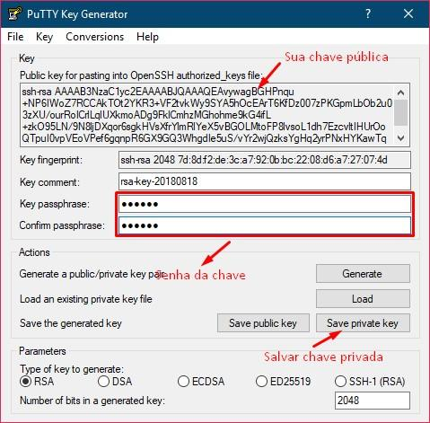

SSH keys são chaves de autenticação SSH para aprimorar a segurança do servidor
remoto. Nesse artigo você vai aprender a configurar o par de chaves
pública/privada no seu computador local (com Linux ou Windows) e no servidor
remoto.

Se você administra um servidor e este funciona constantemente online,
provavelmente faz acesso a ele via SSH (Secure Shell). E, se já faz algum tempo
que esse seu servidor está online, é certo que já deve ter visto algumas coisas
estranhas nos logs, como tentativas de login no seu arquivo
**/var/log/auth.log** vindas de vários IPs diferentes. Isso, provavelmente, pode
ser alguém tentando fazer brute force no seu servidor.

Existem várias maneiras de prevenir
[brute force](https://www.profissionaisti.com.br/2011/11/o-que-e-brute-force-nada-alem-de-forca-bruta/),
e vários outros ataques, apenas manipulando regras de firewall. Um bom exemplo
disso é a [Google Cloud](https://cloud.google.com/), que permite liberar portas
específicas nas VMs apenas para sua rede, porém, não são todos os provedores que
permitem tal configuração.

Outra forma muito eficaz para aumentar a segurança do seu servidor e ainda
prevenir brute force é usar as SSH Keys (chaves de autenticação SSH) e eliminar
a possibilidade de login por senha.

As SSH Keys funcionam no modo chave pública e chave privada (sempre em pares),
onde a conexão SFTP/SSH só é autorizada se a **chave privada** do usuário do
computador cliente bater com a **chave pública** do usuário do servidor.

Soa um tanto complexo, né? Mas você vai entender direitinho ao terminar esse
artigo.

## Antes de continuar

Será necessário um servidor com OpenSSH instalado e um usuário com acesso
[sudo](https://www.todoespacoonline.com/w/2015/10/su-sudo-e-sudoers-no-linux/)
nesse servidor.

**Atenção:** se você está fazendo isso em um servidor de produção, não feche sua
conexão SSH antes de criar uma nova conexão e conseguir se conectar com sucesso.
Do contrário, pode ser que você perca acesso SSH e SFTP ao servidor. Além disso,
preste bastante atenção no que está fazendo para conseguir voltar as
configurações anteriores caso necessário.

## Divergência de usuários

É importante que você saiba que não é necessário que os usuários do computador
local e do servidor remoto tenham o mesmo nome, ou seja, você pode criar uma
chave para um usuário chamado “Joãozinho” no computador local, porém ele vai se
conectar no usuário “Zézinho” no servidor remoto.

Porém, a chave privada do usuário Joãozinho precisa bater com a chave pública do
usuário Zézinho no servidor.

## Criando SSH Keys no Linux

Se o seu computador local tem o Linux com OpenSSH instalados, basta digitar o
seguinte:

```shell
ssh-keygen -t rsa
```

Ao pressionar “Enter” você verá algo parecido com:

```shell
Generating public/private rsa key pair.
Enter file in which to save the key (/home/joaozinho/.ssh/id_rsa):
Created directory '/home/joaozinho/.ssh'.
Enter passphrase (empty for no passphrase):
Enter same passphrase again:
Your identification has been saved in /home/joaozinho/.ssh/id_rsa.
Your public key has been saved in /home/joaozinho/.ssh/id_rsa.pub.
...
```

Na primeira linha é requisitado que você especifique onde deseja gerar a chave.
Não é necessário alterar este local, ela será gerada na sua **pasta local**
dentro de uma pasta oculta chamada **.ssh**.

**Atenção:** em “Enter passphrase”, digite uma senha forte e que você se lembre
posteriormente. Essa senha sempre será utilizada para realizar a primeira
conexão SSH com o servidor. Assim, se você perder ou alguém roubar sua chave,
não conseguirá acesso ao servidor sem saber sua “senha forte”. Será necessário
repetir essa senha na linha “Enter same passphrase again”.

## Criando uma SSH Key para outro usuário no Linux

Apesar de ser algo privado de um usuário e ele mesmo deveria criar e guardar sua
própria chave, você pode gerar uma chave para outro usuário apenas alterando o
caminho onde ela é salva no comando explicado anteriormente.

Mas, se você tem acesso sudo no computador, pode digitar o seguinte:

```shell
sudo -u joaozinho ssh-keygen -t rsa
```

Apenas altere “joaozinho” para o nome de usuário que deseja criar a chave. Se
você não alterar nada, as chaves pública e privada serão geradas na pasta .ssh
dentro da home do usuário “joaozinho”.

## Como ver a chave pública

Como é a chave pública que será copiada para o servidor, você só vai precisar
copiar ela. Para isso, digite:

```shell
cat /home/joaozinho/.ssh/id_rsa.pub
```

Apenas altere “joaozinho” para o seu usuário ou nome de usuário que deseja
copiar a chave.

Lembre-se que as permissões desse arquivo são voltadas para o usuário do
arquivo, se você estiver criando para outro usuário, precisará usar sudo para
executar esse comando.

```shell
sudo cat /home/joaozinho/.ssh/id_rsa.pub
```

Você vai ver muitos caracteres, começando com “ssh-rsa”. Selecione e copie todos
os dados dessa linha. Essa é a chave pública do seu usuário que será copiada
para o servidor posteriormente nesse artigo.

## Criando SSH Keys no Windows

No Windows você vai precisar do Putty para gerar seu par de chaves pública e
privada. Baixe o no link a seguir:

- [Baixar Putty](https://www.chiark.greenend.org.uk/~sgtatham/putty/latest.html)

Baixe o instalador com extensão **.msi** e instale no seu computador.

Depois de instalado, pressione simultaneamente as teclas “Windows” + “R” e
digite:

```shell
%programfiles%\Putty
```

E pressione “Enter”.

Dentro da pasta do PuTTY, abra o arquivo **puttygen.exe**. Clique em “Generate”
e mova o mouse próximo a barrinha de carregamento até terminar.

Na imagem abaixo detalho o que você precisa fazer dentro do puttygen:



Copie sua chave pública para o servidor, como explico na próxima etapa.

Não se esqueça que, para se conectar ao servidor remoto, você primeiro precisa
carregar sua chave privada.

## Adicione chave pública no servidor remoto

Depois de criar suas chaves, você vai precisar copiar sua chave pública para o
servidor. Para isso, basta criar um arquivo chamado “authorized_keys” dentro da
pasta **.ssh** do usuário desejado dentro do servidor.

Por exemplo: suponhamos que eu queira dar autorização para o usuário “Joãozinho”
(usado no linux anteriormente) para acessar o servidor remoto como o usuário
“Zézinho”. Então eu digitaria o seguinte no servidor remoto:

```shell
sudo mkdir --mode=600 /home/zezinho/.ssh/
sudo nano /home/zezinho/.ssh/authorized_keys
```

E colocaria a chave pública do “Joãozinho” dentro do arquivo “authorized_keys”
do “Zézinho”.

Agora cole os dados da sua chave pública dentro desse arquivo e pressione
“CTRL” + “O” para salvar, “CTRL” + “X” para sair.

Se vários usuários poderão se conectar usando o usuário do servidor remoto,
adicione uma chave pública por linha no **authorized_keys**.

Pronto, configuramos os usuários, agora vamos configurar o OpenSSH.

## Configurando o OpenSSH

Dentro do servidor remoto, digite o seguinte:

```shell
sudo nano /etc/ssh/sshd_config
```

E altere as linhas:

```ssh-config
# ...
PermitRootLogin no
# ...
PubkeyAuthentication yes
# ...
PasswordAuthentication no
# ...
```

**PermitRootLogin** remove completamente o acesso do root ao servidor SSH,
**PubkeyAuthentication** permite o acesso via chave pública e
**PasswordAuthentication** remove o acesso via senhas de texto.

Pressione “CTRL”+”O” para salvar e reinicie o servidor SSH:

```shell
sudo service ssh restart
```

**Atenção:** não feche sua conexão SSH atual. Para testar, abra uma nova conexão
SSH, se der errado você não perderá sua conexão atual.

É isso, se tiver dúvidas comenta aí.
