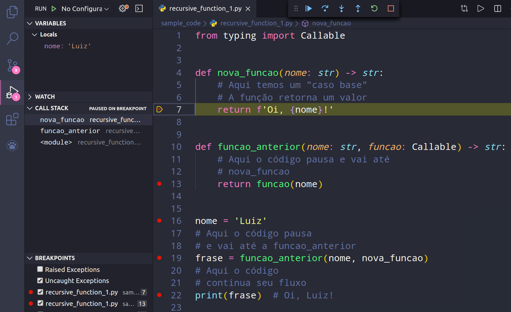

<p>
  Funções recursivas com Python (ou qualquer linguagem de
  programação) são funções que chamam
  a si mesmas de maneira direta ou indireta. Infelizmente, não
  há nenhum benefício em termos de desempenho ao usar
  funções recursivas em
  <a href="https://www.otaviomiranda.com.br/2017/cursos-de-python-e-javascript-com-desconto/">Python</a>, já que laços podem resolver o problema com mais
  eficiência. Porém, funções recursivas podem
  ser mais intuitivas para o programador quando um problema pode ser
  dividido em problemas menores de mesmo tipo.
</p>

<p>
  Considere o conceito de
  <a href="https://www.todamateria.com.br/fatorial/">fatorial da matemática</a>: o fatorial de um número é calculado pela
  multiplicação desse número por todos os seus
  antecessores até chegar ao número 1.
</p>

<p>
  Esse é um problema extremamente simples para ser resolvido com
  recursão por dois fatores:
</p>

<ul>
  <li>
    É um problema que pode ser dividido em sub-problemas menores
    e de mesmo tipo (multiplicar um número pelos seus
    antecessores)
  </li>
  <li>
    Temos um <em>caso-base</em> para parar a recursão, retornar
    um valor real e resolver as equações (quando chegarmos
    em 1)
  </li>
</ul>

```python
def fatorial(n: int) -> int:
    if n == 1 or n == 0:
        return 1
    return n * fatorial(n - 1)


if __name__ == "__main__":
    fat5 = fatorial(5)
    print(fat5)
```

<p>O resultado da execução da função acima será 120.</p>

```
# 5 * 4 * 3 * 2 * 1 = 120
```

<p>
  <strong>Observação:</strong> você poderia escrever
  uma condição mais concisa eliminando o
  <code>or</code> da expressão com “<code>if n &lt; 2</code>” ao invés de “<code>if n == 1 or n == 0</code>“.
</p>
<h2>Caso-base e caso recursivo</h2>

<p>
  É muito fácil escrever uma função
  recursiva incorretamente e cair em uma recursão infinita. Veja
  isso no código a seguir:
</p>

```python
def recursao_infinita(numero: int = 100) -> int:
    return recursao_infinita(numero - 1)


if __name__ == "__main__":
    recursao_infinita()
```

<p>
  O Python não vai permitir que este código execute infinitamente, então
  você deverá ver uma exceção:
</p>

```
# RecursionError: maximum recursion depth exceeded
```

<p>
  Isso ocorre porque nunca dissemos para a função quando
  parar a recursão, mais especificamente, não adicionamos
  um
  <a href="https://pt.wikipedia.org/wiki/Caso_base">caso-base na função</a>.
</p>

<p>
  Toda função recursiva é composta de, pelo menos,
  duas partes: caso-base e caso recursivo. O caso-base é quando a
  função <em>NÃO</em> chama a si mesma, mas retorna
  um valor real; já o caso recursivo, como o próprio nome
  indica, é onde a recursividade ocorre (a função
  chama a si mesma).
</p>

<p>
  Veja uma nova função recursiva, porém com ambos
  os casos: caso-base e caso recursivo.
</p>

```python
def contagem_regressiva_recursiva(comeca_em: int = 10, termina_em: int = 0) -> int:
    """
    Contagem regressiva iniciando em 'comeca_em' e terminando em 'termina_em'
    """
    print(comeca_em)

    # Caso-base
    if comeca_em <= termina_em:
        # Perceba que aqui um valor real é retornado
        # e não há mais recursão
        return comeca_em

    # Caso recursivo
    # Esse código será executado sempre, até
    # 'comeca_em' se tornar menor ou igual a 'termina_em'
    return contagem_regressiva_recursiva(comeca_em - 1)


if __name__ == "__main__":
    contagem_regressiva_recursiva()
```

<h2>Call stack</h2>

<p>
  Sempre que invocamos uma função, dados do seu escopo
  interno (como variáveis e parâmetros) precisam ser salvos
  em algum local. Além disso, também precisamos saber
  quando a função retorna um valor para que o programa
  continue a seguir o seu fluxo. Tudo isso é gerenciado pela
  <em>Call Stack</em> (pilha de chamada ou pilha de
  execução).
</p>

<h3>Como funciona a Call Stack</h3>

<p>
  De forma simples e direta, funciona assim: quando meu programa
  está em execução e encontra uma chamada de
  função, ele pausa temporariamente o que estava fazendo e
  vai até o código interno da função para
  realizar sua execução. Após a
  execução, a função precisa saber como
  retornar o programa para o local onde ele parou antes da chamada para
  a execução. Então, após o retorno da
  função, o programa sabe como resumir o código
  partindo exatamente de onde a função retornou.
</p>

<h3>Exemplo de funcionamento da Call Stack</h3>

<p>
  Veja um exemplo no gif abaixo como o fluxo do programa muda quando
  existe uma chamada para função:
</p>


<p>
  No trecho simples de código acima, existe uma
  definição de função (linha 1),
  definição de variável (linha 5), uma chamada para
  função (linha 8) e em seguida um “print” em
  uma variável (linha 11). Eu marquei breakpoints nas linhas 2,
  5, 8 e 11, mas não é essa a ordem de
  execução. Ao executar o programa, a ordem dos
  breakpoints não é a mesma. Ela é alterada para 5,
  8, 2 e 11. Isso porque existe uma chamada para função na
  linha 8. Então enquanto o interpretador não conferir o
  que a função da linha 8 retorna, ele não tem como
  continuar a execução.
</p>

<p>
  Além disso, perceba que, na lateral esquerda do gif, a
  “Call Stack” está aberta. Nela, existe o que
  está sendo executado no momento (stack frames). Nesse caso em
  específico, começamos com o módulo que
  está sendo executado (<code>&lt;module&gt;</code>). Tudo o que
  estiver definido dentro do módulo, será exibido na Call
  Stack dele. Porém, ao chamar a função, algo novo
  é adicionado ali, a chamada para função
  “<code>funcao</code>“. Isso ocorre após a
  execução da linha 8 (chamada da função) e
  termina após o retorno da função.
</p>

<h3>Locals</h3>

<p>
  Vamos observar o que existe dentro da chamada de função
  (após a execução da linha 8).
</p>


<p>
  Após a chamada para a função, a
  execução do módulo é pausada
  temporariamente até que o interpretador verifique o que a
  função retorna. Nesse momento, ela é adicionada
  na “Call Stack”, seus dados internos são salvos
  até que ela decida retornar um valor. Perceba que o argumento
  enviado ao parâmetro “<code>nome</code>” está
  em “<code>Variables</code>” como locals dessa
  função, essas são suas variáveis locais.
</p>

<p>
  Assim que o retorno for concluído, a execução do
  módulo continuará a seguir seu fluxo e a chamada para a
  função será eliminada da “Call
  stack”.
</p>


<p>
  Após o retorno da função, ela é eliminada
  da Call Stack e o módulo pode prosseguir com sua
  execução. Aliás, também preciso mencionar
  que capturei o valor do seu retorno em uma variável
  <code>frase</code> para fazer algo ela posteriormente (como dar um
  simples print no terminal).
</p>

<p>
  Então, podemos resumir que “Call Stack” é
  exatamente o que sua tradução descreve, uma
  <em>pilha de chamadas</em>. Assim como existe uma pilha de livros na
  prateleira, existe uma pilha de chamadas de funções no
  seu programa. Cada elemento na call stack contém os dados do
  momento em que a funções foram chamadas.
</p>

<h3>Funções dentro de funções</h3>

<p>
  Assim como acontece com funções chamadas diretamente
  dentro de um módulo, também ocorre com
  funções chamadas dentro de outras funções.
  Nesse caso, a pilha de chamadas fica ainda maior, porque se existir
  outra chamada para função dentro de uma
  função existente, o interpretador também
  precisará checar o retorno dessa outra função.
</p>

<p>
  Considere o mesmo código anterior, porém com uma chamada
  dentro da função já criada.
</p>



<p>
  Agora os passos são um pouco diferentes. Mas, se você me
  acompanhou até aqui, não terá dificuldade nenhuma
  para entender o que ocorreu.
</p>

<p>
  Lembra que eu te disse que quando há uma chamada de
  função, o interpretador precisa verificar o que essa
  chamada retorna? Então, não é diferente aqui!
</p>

<p>
  Quando estamos dentro de uma <code>funcao_um</code> realizando uma
  chamada para uma <code>funcao_dois</code>, o que ocorre é que a
  <code>funcao_um</code> precisa pausar sua execução para
  saber o que a <code>funcao_dois</code> retorna. Só após
  isso, a <code>funcao_um</code> poderá continuar sua
  execução normal.
</p>

<p>
  Mas não termina aqui, isso tudo é registrado pela
  “Call Stack” (chamarei de <em>pilha</em> daqui em diante).
  Então, quanto mais chamadas de funções dentro de
  funções, mais coisas existem acontecendo na pilha.
</p>

<p>
  <a href="https://gist.github.com/luizomf/83c8f286a83ad6ddb1e7094aedabbef5">No código da imagem anterior</a>, temos uma chamada para função na linha 19,
  então sabemos que o interpretador vai conferir o retorno para
  essa chamada. Porém, ao acessar o código da
  função, o interpretador encontra uma nova chamada para
  função na linha 13, então ele também vai
  conferir o que essa outra função retorna.
</p>

<p>Veja na imagem, que a pilha agora tem o seguinte:</p>

<ul>
  <li><code>nova_funcao</code></li>
  <li><code>funcao_anterior</code></li>
  <li><code>&lt;module&gt;</code></li>
</ul>

<p>
  Cada elemento na pilha tem suas próprias variáveis
  locais salvas em memória.
</p>

<p>
  Portanto, para resolver essa pilha o interpretador precisa voltar
  resolvendo todos os retornos de cima para baixo. Ou seja, o resultado
  final será: retorno da <code>nova_funcao</code> + retorno da
  <code>funcao_anterior</code> + continua executando o módulo.
  Como a <code>funcao_anterior</code> retorna a
  <code>nova_funcao</code>, o retorno final será o que a
  <code>nova_funcao</code> retornar.
</p>

<h2>Funções recursivas com Python</h2>

<p>
  As funções recursivas com Python ou com qualquer outra
  linguagem de programação, funcionam exatamente como
  outras funções, porém, ao chamarem a si mesmas
  dentro do seu código, a cada nova chamada um novo elemento
  é adicionado na pilha (Call Stack, lembra?) contendo as
  variáveis locais daquele ponto na execução.
</p>

<p>
  Considere a função fatorial, que te mostrei mais acima
  nesse post:
</p>

```python
def fatorial(n: int) -> int:
  if n == 1 or n == 0:
      return 1
  return n * fatorial(n - 1)


if __name__ == "__main__":
  fat5 = fatorial(5)
  print(fat5)
```

<p>
  A chamada dessa função (iniciando na linha 8) desencadeará mais 4
  chamadas para ela mesma (somando 5 no total) até atingir meu
  caso-base, que é quando n for igual a 1.
</p>


<p>Essas chamadas ocorreram na seguinte ordem:</p>

<p>
  <code>fatorial(5) * fatorial(4) * fatorial(3) * fatorial(2) * fatorial(1)
  </code>
</p>

<p>
  Isso tudo está na pilha de chamadas e agora o interpretador precisa
  voltar resolvendo todas as chamadas de cima para baixo (ou de trás pra
  frente).
</p>

<p>Dessa maneira (vou mostrar apenas os retornos):</p>

```
# 1 = 1
# 2 * 1 = 2
# 3 * 2 = 6
# 4 * 6 = 24
# 5 * 24 = 120
```

<p>O trecho descrito acima é exatamente como a pilha foi resolvida.</p>


<p>
  Perceba que após retornar todos os valores e a pilha terminar
  de ser resolvida, todas as chamadas e suas variáveis locais
  agora foram eliminadas da memória e temos apenas o valor de
  retorno de toda a pilha.
</p>

<p>
  É assim que as Funções recursivas com Python (ou
  qualquer outra linguagem de programação) funcionam.
  Exatamente como descrito em todo este artigo.
</p>

<h2>
  Problemas que podemos encontrar com Funções recursivas
</h2>

<p>
  Como você pôde perceber no texto que seguiu, cada chamada
  para função dentro de uma função recursiva
  é adicionada à pilha (cada elemento na pilha, cujo
  retorno ainda não foi finalizado, é chamado de
  <em>stack frame</em>). Isso pode ser um problema quando temos muitas
  recursões ocorrendo dentro de um programa.
</p>

<p>
  Imagine que eu peça o fatorial de 998, isso significa que a
  minha recursão ocorreria 997 vezes até atingir o caso
  base (somando 998 chamadas). Isso também significa que eu teria
  998 elementos na minha pilha de chamadas (sem contar qualquer outra
  chamada para funções no módulo e a chamada do
  módulo em si). Talvez, se o custo de execução da
  função consumir muita memória, eu poderia esgotar
  os recursos do computador facilmente apenas chamando uma
  função recursiva.
</p>

<p>
  Existe uma técnica chamada de
  <em>Tail Call Optimization</em> (ou
  <em>Tail Recursion Elimination</em> em casos recursivos) que
  resolveria este problema. Porém, Guido van Rossum, criador do
  Python, foi um contra a adição disso no Python alegando
  ser “Não Pythônico”.
</p>

<blockquote>
  <p>
    <em>I recently posted an entry in my Python History blog on the
      origins of Python’s functional features. A side remark about
      not supporting tail recursion elimination (TRE) immediately
      sparked several comments about what a pity it is that Python
      doesn’t do this, including links to recent blog entries by
      others trying to “prove” that TRE can be added to
      Python easily. So let me defend my position (which is that I
      don’t want TRE in the language). If you want a short answer,
      it’s simply unpythonic. Here’s the long answer.</em>
  </p>
  <a href="https://neopythonic.blogspot.com/2009/04/tail-recursion-elimination.html">Por Guido van Rossum, em 22/04/2009, em Neopythonic</a>
</blockquote>

<p>Tradução Livre:</p>

<blockquote>
  <p>
    <em>Recentemente, publiquei um post em meu blog Python History, sobre
      as origens dos recursos funcionais do Python. Uma
      observação simples sobre não suportar Tail
      Recursion Elimination (TRE) imediatamente provocou vários
      comentários sobre ser uma pena Python suportar isso,
      incluindo links para posts recentes de blogs de outros que
      tentaram “provar” que TRE pode ser adicionado ao
      Python facilmente. Então, deixe-me defender minha
      posição (que não quero TRE na linguagem). Se
      você quer uma resposta curta, simplesmente não
      é Pythônico. Aqui está a resposta longa.</em>
  </p>
  <a href="https://neopythonic.blogspot.com/2009/04/tail-recursion-elimination.html">Por Guido van Rossum, em 22/04/2009, em Neopythonic</a>
</blockquote>

<p>
  Se o próprio criador do Python mencionou isso, não
  iremos discutir isso por aqui =).
</p>

<h2>RecursionError: maximum recursion depth exceeded in comparison</h2>

<p>
  Esse erro apareceu pra você? Isso quer dizer que a pilha de
  elementos no seu call stack passou de 1000 (limite padrão em
  Python).
</p>

<p>
  Você pode fazer três coisas para resolver este problema:
</p>

<ul>
  <li>
    Checar se você realmente queria fazer mais de 1000 chamadas
    recursivas. Geralmente, quando criamos funções
    recursivas incorretamente, são realizadas mais
    recursões do que gostaríamos;
  </li>
  <li>
    Trocar por um laço <code>for</code>. Como Python não
    tem <em>Tail Recursion Elimination</em> (pelo menos até o
    momento da escrita deste post), talvez você poderia reescrever
    o código usando <code>for</code> ou até
    <code>while</code>;
  </li>
  <li>Por fim, um hack (aumentar o limite de recursão).</li>
</ul>

<p>Para aumentar o limite de recursão, use:</p>

```python
import sys
sys.setrecursionlimit(5000)
print(sys.getrecursionlimit())  # 5000
```

<p>
  O padrão são 1000 recursões, no trecho acima
  aumentei para 5000.
</p>

<h2>Algoritmos usando recursão</h2>

<p>
  Como vimos anteriormente, o algoritmo mais clichê que é
  implementado com recursão, seria o fatorial, que vimos ao longo
  de todo o post. No entanto, há uma gama enorme de algoritmos
  que podem se beneficiar da recursão.
</p>

<p>
  Eu não pretendo detalhar o que todos eles fazem (talvez fique
  pra um próximo post), mas seguem alguns:
</p>

<h3>Sequência Fibonacci</h3>

```python
from functools import lru_cache


@lru_cache
def fibonacci_sequence(n: int) -> int:
    """Sequência Fibonacci with memoization"""
    if n < 1:
        return 0
    if n <= 2:
        return 1
    return fibonacci_sequence(n - 1) + fibonacci_sequence(n - 2)


if __name__ == "__main__":
    for i in range(1000):
        print(fibonacci_sequence(i))
```

<p>
  A
  <a href="https://pt.wikipedia.org/wiki/Sequ%C3%AAncia_de_Fibonacci">Sequência Fibonacci</a>
  pode se beneficiar da
  <a href="https://en.wikipedia.org/wiki/Memoization">memoization</a>
  (cache) de funções executadas anteriormente. O Python
  inclui
  <a href="https://docs.python.org/3/library/functools.html#functools.lru_cache">lru_cache</a>
  no módulo
  <a href="https://docs.python.org/3/library/functools.html">functools</a>
  que serve justamente para isso.
</p>

<p>
  Adaptação do Livro
  <a href="https://amzn.to/2QXcx8W">Estruturas de dados e algoritmos com JavaScript (por Loiane
    Groner)</a>
</p>

<h3>Quicksort</h3>

```python
"""
Quicksort algorithm

>>> print(quicksort(list_of_numbers))
[2, 2, 4, 5, 9, 10, 11, 122, 123, 321]
>>> print(quicksort(list_of_words))
['Aline', 'Helena', 'João', 'Luiz', 'Maria', 'Zara']
>>> print(quicksort(['A']))
['A']
>>> print(quicksort(['B', 'A']))
['A', 'B']
>>> print(quicksort([]))
[]
"""

import doctest
from typing import List, TypeVar

TListValue = TypeVar('TListValue', int, float, str, bool)


list_of_numbers: List[int] = [10, 9, 5, 2, 11, 4, 2, 123, 321, 122]
list_of_words: List[str] = ['Luiz', 'Maria', 'João', 'Helena', 'Zara', 'Aline']


def quicksort(a_list: List[TListValue]) -> List[TListValue]:
    if len(a_list) < 2:
        return a_list

    pivot_index = len(a_list) // 2
    pivot = a_list.pop(pivot_index)
    smaller_values: List = [item for item in a_list if item <= pivot]
    higher_values: List = [item for item in a_list if item > pivot]

    return quicksort(smaller_values) + [pivot] + quicksort(higher_values)


if __name__ == "__main__":
    doctest.testmod(verbose=True)
```

<p>
  Adaptação do Livro
  <a href="https://amzn.to/39v5jPV">Entendendo Algoritmos (por Aditya Bhargava)</a>
</p>

<h3>Um código personalizado</h3>

```python
from typing import List


  class Caixa:
      def __init__(self, tem_chave=False) -> None:
          self.tem_chave = tem_chave

      def __repr__(self) -> str:
          return f'Caixa({self.tem_chave})'


  def encontra_chave(caixas: List[Caixa], index: int = 0) -> Caixa:
      if len(caixas) <= index:
          return Caixa()

      caixa = caixas[index]
      print(f'Procurando chave na caixa do índice {index} -> {caixa}')

      if caixa.tem_chave:
          return caixa

      index += 1
      return encontra_chave(caixas, index)


  if __name__ == "__main__":
      caixas: List[Caixa] = [
          Caixa(True), Caixa(), Caixa(), Caixa(),
          Caixa(), Caixa(), Caixa(), Caixa(),
          Caixa(), Caixa(), Caixa(), Caixa(),
      ]

      print(encontra_chave(caixas))
```

<p>Meu código mesmo.</p>

<h3>Torre de Hanoi</h3>

<p>
  Adaptação do Livro
  <a href="https://amzn.to/2Jn18Lc">O melhor do JavaScript (Por Douglas Crockford)</a>
</p>

```python
# Torre de Hanói
def hanoi(disco: int, origem: str, auxiliar: str, destino: str) -> None:
    if disco <= 0:
        return
    hanoi(disco - 1, origem, destino, auxiliar)
    print(f'Movendo disco {disco} de {origem} para {destino}')
    hanoi(disco - 1, auxiliar, origem, destino)


if __name__ == "__main__":
    hanoi(3, 'Origem', 'Auxiliar', 'Destino')
```

<p>
  Adaptação do Livro
  <a href="https://amzn.to/2Jn18Lc">O melhor do JavaScript (Por Douglas Crockford)</a>
</p>

<h2>Em vídeo</h2>

<p>
  Também criei um vídeo sobre este conteúdo em meu
  canal do Youtube, segue abaixo:
</p>

<p>
  Link do vídeo no YouTube:
  <a href="https://youtu.be/0PwFwqiNfAI">https://youtu.be/0PwFwqiNfAI
  </a>
</p>

<h2>Super resumo do resumo</h2>

<p>
  Funções recursivas com Python (ou qualquer linguagem de
  programação) são funções que chamam
  a si mesmas de maneira direta ou indireta.
</p>
