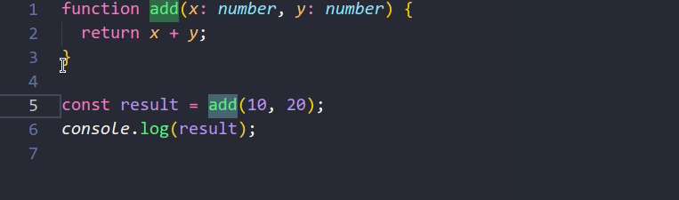

Esse post vai te ajudar a entender melhor o que é o TypeScript de maneira geral.
Vamos entrar um pouco mais na parte conceitual sem aprofundarmos em detalhes
para que você saiba como e quando usá-lo.

Atenção: não tenho o intuito de falar sobre tudo o que é possível sobre o TS.
Para isso, veja a
[documentação oficial](https://www.typescriptlang.org/docs/home.html).

## O que é o TypeScript?

Segundo o site oficial, o _TypeScript é um superconjunto do JavaScript com
tipagem que é compilado para JavaScript simples_
([texto original](https://www.typescriptlang.org/): _TypeScript is a typed
superset of JavaScript that compiles to plain JavaScript_), ou seja, algo que é
adicionado sobre o JavaScript.

No entanto, como poderíamos imaginar um “superconjunto” (_superset_)? Isso é uma
linguagem de programação? Uma versão do JS? Uma quarta dimensão? De fato, um
_superset_ não explica muita coisa pra quem conhece o termo (_e eu não estou
brincando, existe uma outra dimensão no TS, você vai descobrir já já_).

### Comparação com versões do ECMAScript

Assim como cada versão do ECMAScript adiciona novos recursos ao JavaScript, o
TypeScript também o fará.

Por exemplo, imagine as versões do ECMAScript (ES3, ES5, ES6, …, ES2020):


Figura 1. Cada nova versão do ECMAScript adiciona novos recursos ao JavaScript.

Como podemos ver na **Figura 1**, novas versões do ECMAScript adicionam novos
recursos ao JavaScript.

Além disso, cada uma das versões é compatível com a versão anterior. Portanto,
você pode facilmente rodar um script ES5 em ambientes ES7, mas não o contrário.
Não é possível usar os recursos do ES7 em ambientes ES5, porque tais recursos
ainda não existem no ES5 (salvo se usarmos algum
[polyfill](https://developer.mozilla.org/pt-BR/docs/Glossario/Polyfill)).

Mas, mesmo tendo várias versões do ECMAScript, chamamos todas elas de Javascript
(a menos que você queira falar ou usar determinada especificidade de uma
versão).

_**Nota:** existem várias versões do ECMAScript, separei apenas três para
exemplo. Você pode ver todas elas
[aqui](https://en.wikipedia.org/wiki/ECMAScript)._

### Onde o TypeScript se encaixa?

Se adicionarmos o TS como um layer, como fizemos na **Figura 1**, esse diagrama
ficaria assim:


Figura 2. O TypeScript é um superset do JavaScript.

Então, podemos perceber que o TS adiciona funcionalidades sobre o JS simples.
Portanto, é isso que o site oficial quer dizer quando detalha o TypeScript como
um superset do JavaScript.

### O que realmente é o TypeScript

Aqui segue um resumão sobre o que eu acho que o TS realmente é: _O TypeScript é
um superset do JS criado pela Microsoft. Um JavaScript mais moderno e seguro,
que adiciona as últimas versões do ECMAScript, muitos recursos próprios e um
sistema extremamente rico para tipagem_. Além disso, ele também adiciona
recursos muito úteis ao editor de código para facilitar a vida do desenvolvedor
(falaremos mais sobre isso mais adiante).

Por falar em tipagem, uma das partes mais importantes do TypeScript são os tipos
(**types**), por isso o nome **Type**Script (acho que você já tinha percebido,
né?). De fato, esse é um dos fatores que costuma levar o TS para projetos de
larga escala em bases de código gigantescas. Vamos falar mais sobre a tipagem
mais adiante neste post também.

## Linguagem interpretada ou linguagem compilada?

Depende do seu ponto de vista e do seu ambiente de desenvolvimento!

Quando falamos em TypeScript, geralmente estamos imaginando o ambiente mais
comum atualmente (06/2020): [Node.js](https://nodejs.org/en/download/).

Assim, se você pensar neste ambiente, é meio incomum falar de algo como o TS,
porque ele não seria uma
[linguagem interpretada](https://pt.wikipedia.org/wiki/Linguagem_interpretada#:~:text=Linguagem%20interpretada%20%C3%A9%20uma%20linguagem,pelo%20sistema%20operacional%20ou%20processador.)
(como [Python](categoria/python/), Ruby, PHP…), nem uma
[linguagem que compila](https://pt.wikipedia.org/wiki/Linguagem_compilada#:~:text=Linguagem%20compilada%20%C3%A9%20uma%20linguagem,linguagem%20de%20baixo%20n%C3%ADvel%2C%20como)
para bytecode ou código de máquina como outras linguagens de mais baixo nível
fazem. O TS com Node.js seria uma linguagem que compila diretamente para outra
linguagem de alto nível, o JavaScript.

Lembra da **Figura 2**? Pois é, ao terminar de escrever o meu código TypeScript,
eu faria a compilação diretamente para JavaScript simples. Por isso, o
JavaScript gerado seria o meu código de produção, que ambos, Node.js e o
Browser, entendem. Portanto, minha aplicação em produção rodaria apenas
JavaScript.


Figura 3. Processo de compilação do TypeScript em JavaScript usando Node.js

### Outra dimensão?

Lembra da nova dimensão que falei anteriormente? Então, é aqui que ela entra.
Tudo o que o TypeScript adiciona de recursos no momento do desenvolvimento, será
removido no código final compilado. Afinal, o Javascript não entende muitos dos
recursos adicionados pelo TS, no final das contas, o que a gente quer mesmo é o
código compilado, ou seja, o JS puro.

A “dimensão do TypeScript” existirá apenas no seu código de desenvolvimento.

### Um cenário diferente

Este acima seria o cenário Node.js, onde você precisa compilar o código para ter
o JS puro no back-end. Certamente, é o cenário mais usado hoje em dia e acho que
isso ainda vai perdurar por alguns anos.

Porém, em 13 de maio de 2020, a
[versão 1.0 do Deno foi lançada](https://deno.land/v1) e ele interpreta
TypeScript puro, sem a necessidade de compilação. Então, olhando por este ponto
de vista, o **TS seria uma linguagem de programação** com tipagem estática e
interpretada. Você ainda precisaria compilar o código para o front-end, mas não
para o back-end.

Neste post, vou focar mais no lado “Node.js” da coisa, com o processo de
compilação.

## Extensão .ts e .tsx

Arquivos TypeScript tem a extensão `.ts` ou `.tsx` ao invés de `.js` ou `.jsx` e
aqui cabe uma dica interessante: converter um arquivo JavaScript válido em
TypeScript válido é um processo relativamente simples, basta renomear a extensão
de `.js(x)` para `.ts(x)`. Dependendo da configuração do seu ambiente, o
TypeScript poderá compilar o seu código JavaScript sem nenhum problema (talvez
com alguns alertas, mas o código JS será gerado normalmente).

Este é um dos muitos fatores que dão tanta popularidade ao TypeScript
atualmente. Muitos desenvolvedores estão migrando suas bases de código de
JavaScript para TypeScript por conta dessa simplicidade. Apenas configure seu
ambiente, renomeie um arquivo **.js** para **.ts** e pronto, estará em ambiente
TypeScript!

Por exemplo, isso é TypeScript:

```typescript
function greet(name) {
  console.log(`Olá, ${name}!`);
}

greet('Otávio Miranda'); // Olá, Otávio Miranda!
```

Alguma diferença com o JS que você conhece? É claro que não usei nenhum recurso
do TypeScript neste código, mas eu poderia facilmente (e não acho que isso
dificultaria seu entendimento):

```typescript
function greet(name: string): void {
  console.log(`Olá, ${name}!`);
}

greet('Otávio Miranda'); // Olá, Otávio Miranda!
```

Isto só é possível, porque se observarmos nossa **Figura 2** o **TypeScript É
JavaScript**. Portanto, assim como podemos rodar scripts ES5 em ambientes ES7
(ou superiores), o compilador do TypeScript não terá nenhum problema em entender
JavaScript puro. Por outro lado, assim como não conseguimos usar recursos do ES7
no ES5 sem um polyfill, também não conseguimos rodar TypeScript diretamente em
ambiente JavaScript. Nem o Browser, nem o Node.js entenderiam TS.

O primeiro código (sem tipagem) rodaria perfeitamente tanto em ambientes
JavaScript quanto TypeScript; o segundo (com tipagem) não poderia ser
interpretado pelo JavaScript.

## Por que o TypeScript é mais seguro?

Considere este código JavaScript abaixo:

```javascript
const name = 'Otávio Miranda';
const upperCaseName = name.toUppercase();
console.log(upperCaseName);
```

Agora, me diga: encontrou o erro? Sim! Ele tem um erro que só seria detectado no
momento da execução (runtime). Porém, quase posso garantir que, ao passar o olho
sobre este código, você não o detectou facilmente, estou certo?

Se um código assim fosse para produção, ao ser executado seus usuários veriam
algo como:

```javascript
Uncaught TypeError: name.toUppercase is not a function
```

Ou, para um usuário comum, ele simplesmente veria seu programa parar de
funcionar sem saber o motivo.

Mas, se você colocar este código em um ambiente TypeScript, antes mesmo da
execução do seu código este erro seria detectado.


Figura 4. O TypeScript detecta o erro antes que você possa executar seu código.

### Conveniência da _Intelligent code completion_

Além de analisar o meu código enquanto eu digito sem deixar o meu editor lento,
a mensagem do TypeScript ainda me informa qual o erro, qual o tipo da variável e
ainda me da uma sugestão sobre o que eu quis dizer. Nesse caso, se você ainda
não detectou, `toUppercase` não existe no tipo `string`, o correto seria
`toUpperCase`.

Por fim, veja esse outro código (aqui o erro é explícito)?

```javascript
console.log([1, 2, 3] * 2); // NaN
```

Viu o erro? No entanto, o JavaScript não tem problema em permitir que meu código
rode assim, multiplicando um array por um número.

Porém, veja o que acontece quando migramos para TypeScript:

```typescript
console.log([1, 2, 3] * 2); // NaN
//          ^ The left-hand side of an
//            arithmetic operation must
//            be of type 'any', 'number',
//            'bigint' or an enum
//            type.ts(2362)
```

Por isso que o TypeScript deixa nossos códigos mais seguros.

**Nota:** vou representar esses erros com **comentários de código** (se
necessário) ao invés de imagens pra facilitar minha vida. O `^` representa onde
o erro será exibido.

Esses erros são bem simples e fáceis de encontrar e corrigir. Mas, você
provavelmente já sabe que um ambiente de produção é muito mais complexo que
isso: objetos podem ser aninhados, funções, classes e variáveis podem vir de
outros módulos, bases de dados e o ambiente podem prover APIs (como a DOM, do
browser por exemplo), e assim por diante. Esses são os casos onde o TypeScript
brilha ainda mais.

Mas, espera aí! Como o TypeScript está vendo erros no meu código sendo que eu
ainda nem o compilei? Este, minha amiga ou meu amigo, é trabalho do `tsserver` e
do Typechecker do TypeScript. Que vamos falar logo a seguir.

## TypeScript – Typechecker e tsserver

**Nota:** você realmente não precisa saber de nada disso pra programar em
TypeScript ou JavaScript.

Programas são feitos por humanos e para humanos
([pelo menos alguns](https://amzn.to/2B1IZlg) rsrs), isso quer dizer que a
linguagem de programação que escolhemos funciona exatamente como um “Idioma”
qualquer que será traduzido para que o dispositivo entenda e execute de alguma
forma. Mas, seu código precisa chegar na engine do JS de alguma forma, certo?
Vamos ver.

### Como seu código Javascript vai parar na engine do JS

Este processo é feito no JavaScript seguindo os seguintes passos (de forma bem
resumida):

1.  Seu código JavaScript é convertido em uma
    [AST](https://en.wikipedia.org/wiki/Abstract_syntax_tree);
2.  A AST é convertida em [Bytecode](https://pt.wikipedia.org/wiki/Bytecode);
3.  O Bytecode é avaliado pela engine.

Perceba que entre você criar seu código e ele ser executado pela engine do JS,
nada além de uma conversão ocorre do seu código. Se ocorrer um erro (algo
digitado incorretamente, por exemplo), seu código vai ser executado com erro e a
engine vai parar no ato do erro. Por isso vemos
`Uncaught TypeError: Bla bla bla` por não tratar essa exceção, só depois de
executar o código.

### Como seu código TypeScript vai parar na engine do JS

Ao adicionar o TypeScript, esse processo fica bem maior, veja:

1.  **Seu código TypeScript é convertido em uma AST (TS)**
2.  **A AST é analisada pelo Typechecker (TS)**
3.  **A AST é convertida em código JavaScript (TS)**
4.  O código JavaScript é convertido em uma AST (JS)
5.  A AST é convertida em Bytecode (JS);
6.  O Bytecode é avaliado pela engine (JS);

Perceba que as partes em negrito foram adicionadas ao processo. Passos de 1 a 3
são executados pelo TypeScript; passos de 4 a 6 são executados pelo JavaScript.
A tipagem é checada nos passos 1 e 2 (do TS). Do passo 3 em diante, o TypeScript
não vai mais checar seu código. Em outras palavras, a última coisa que o
compilador do TypeScript faz é compilar o seu código para Javascript, toda a
checagem é feita antes da compilação.

Por este motivo, eu posso compilar meus códigos JavaScript sem tipagem pelo
TypeScript (como eu te disse, TypeScript é JavaScript). Também é por este
motivo, que eu posso configurar o nível de restrição do TypeScript (eu poderia,
por exemplo, não permitir a compilação se meu código tiver algum tipo de alerta
ou falta de tipagem).

### tsserver

Eu falei, falei e falei, e acabei não respondendo sua pergunta: **Como o
TypeScript está vendo erros no meu código sendo que eu ainda nem o compilei?**

Quando instalamos o TypeScript, ganhamos duas coisas: o compilador (`tsc`) e um
servidor que provê serviços da linguagem (`tsserver`). De fato, você pode ver
eles na pasta “bin” do “node_modules”. Em nosso dia a dia como programador ou
programadora, não nos preocupamos com o `tsserver` porque ele geralmente é usado
pelo seu editor ou IDE. Porém, ele é super importante pra gente. É ele que nos
permite ter auto completar, inspeções de código, navegação, refatoração, e muito
mais, diretamente no editor que usamos para criar nosso código.

Então, respondendo a sua pergunta, o `tsserver` roda em background em alguns
editores de código fazendo essa checagem. Quando ele encontra algo que não bate
com a minha configuração do TypeScript, ele grifa o trecho de código com aquela
linha vermelha ondulada dizendo o que está incorreto. Dessa forma, eu não
preciso executar meu código pra saber que existe um erro nele.

### vscode

Eu não sei qual editor de códigos você usa, mas gosto bastante do
[VSCode](https://code.visualstudio.com/) porque ele já vem com o `tsserver`
embutido (muito editores também já fazem isso). Com isso, eu posso digitar o meu
código tranquilamente, sabendo que enquanto o sublinhado vermelho não aparecer,
provavelmente meu código não tem nenhum erro (a não ser de lógica rsrs).

Outra coisa interessante é que se eu passar o mouse sobre determinada variável,
eu sei exatamente qual o tipo dela. Isso em bases de código maiores é uma mão na
roda.


Figura 5. VSCode + tsserver exibindo o tipo de uma variável

#### Fatos interessantes:

O VSCode foi criado pela Microsoft e foi escrito em TypeScript e JavaScript com
o [Electron](https://www.electronjs.org/). Ele usa
[type definitions](https://github.com/DefinitelyTyped/DefinitelyTyped) do
TypeScript para a maioria das funções do seu
[IntelliSense](https://code.visualstudio.com/docs/editor/intellisense) tanto
para JavaScript quanto para TypeScript. Portanto, se você usa o VSCode para
editar seus códigos Javascript, você já faz uso extensivo de TypeScript (mesmo
sem saber).

## Instalando e configurando o TypeScript

Se você chegou até aqui, provavelmente eu já despertei seu interesse em
TypeScript (ou talvez você já o tinha). De qualquer forma, que bom! Na minha
opinião, se você começar a usar o TS nos seus projetos, vai ser difícil voltar
atrás, vai por mim.

Contudo, isso pode ser algo desafiador em meio a tantas opções, não é mesmo? A
seguir, vamos ver como iniciar um projeto TypeScript do zero. Embora eu não vá
conseguir te explicar tudo o que existe sobre ele em apenas um post, percebo que
o mais difícil é iniciar, o resto você pode ir aprendendo com o tempo e a
[documentação](https://www.typescriptlang.org/docs/handbook/basic-types.html).

### Instalação de programas

Eu gosto de usar algumas coisas nos meus projetos, por isso, a configuração que
você vai ver a seguir será a mesma que utilizo em muitos dos meus projetos.
Entretanto, tenha em mente que isso vai variar muito de desenvolvedor para
desenvolvedor e de projeto para projeto. Assim, é provável que você verá outras
configurações muito diferentes por aí, ou talvez você tenha que conversar com
seu time antes de sair configurando o ambiente de um projeto como um todo.

Se você tem experiencia com isso, provavelmente poderá pular para
“**[Instalando o TypeScript, ts-node e eslint](#Instalando_o_TypeScript,_tsnode_e_eslint)**“.

Antes de começar, você vai precisar do seguinte (se quiser o mesmo ambiente que
o meu):

- Baixar e [instalar o Node.js](https://nodejs.org/en/download/);
- Baixar e [instalar o VSCode](https://code.visualstudio.com/);

### Criando a pasta do projeto

No seu sistema operacional, crie uma pasta exclusiva para o seu projeto com o
TS. Isso é importante para termos uma pasta node_modules e package.json
exclusivos para este projeto.

**Nota:** você pode migrar uma base de código existente apenas renomeando
arquivos **.js** para **.ts** e fazendo as configurações abaixo. Nesse caso use
`strict` como `false` (você vai ver isso abaixo). Além disso, verifique se todos
os módulos que você utiliza no projeto JS dão suporte para TS. Tenha em mente
que pode ser necessário modificar coisas complicadas para fazer essa migração.

Para um projeto novo (recomendável), apenas abra a nova pasta pasta no VSCode,
indo em `File > Open Folder` e escolhendo a pasta que você acabou de criar.

### Instalando o TypeScript, ts-node e eslint

Abra o terminal do VSCode em `View > Terminal` e digite o seguinte:

```shell
npm init -y
npm i typescript ts-node eslint @types/node -D
```

- `typescript` – é o próprio TypeScript (`tsc` e `tsserver`);
- `ts-node` – permite executar scripts do TypeScript diretamente;
- `eslint` – É o meu
  [linter](https://pt.stackoverflow.com/questions/330821/o-que-significa-executar-lint-no-c%C3%B3digo#:~:text=Um%20linter%20ou%20lint%20%C3%A9%20uma%20ferramenta%20de%20an%C3%A1lise%20est%C3%A1tica%20de%20c%C3%B3digo.&text=Um%20linter%20ou%20lint%20se,c%C3%B3digo%2Dfonte%20em%20linguagem%20C.)
  preferido, algumas pessoas preferem o
  [tslint](https://palantir.github.io/tslint/) (você pode conferir depois);
- `@types/node` – São as definições de tipo para o Node.js

### Extensões do VSCode

Para uso do ESLint e do ts-node, eu gosto de duas extensões no VSCode.

- [Code Runner](https://marketplace.visualstudio.com/items?itemName=formulahendry.code-runner)
- [ESLint](https://marketplace.visualstudio.com/items?itemName=dbaeumer.vscode-eslint)

Instale ambas as extensões no seu VSCode

O **Code Runner** habilita a possibilidade executar um comando apenas
pressionando um botão de “Play” no canto superior direito do seu VSCode. Assim,
ao invés de digitar:

```shell
npx ts-node index.ts
```

Eu posso simplesmente configurar o **Code Runner** para executar automaticamente
este comando para todos os meus arquivos TypeScript assim que eu pressionar o
play. Isso é fantástico para executar rapidamente seus código e focar no
aprendizado.

O **Eslint** (a extensão) faz a integração do **ESLint** (linter) com o VSCode.

### Configurando o ESLint

Vamos instalar alguns plugins para que o ESLint funcione com o TypeScript. Para
isso, digite no terminal:

```shell
npm i @typescript-eslint/eslint-plugin @typescript-eslint/parser -D
```

Crie um arquivo com o nome .eslintrc.js na raiz do seu projeto e cole o seguinte
nele:

```javascript
module.exports = {
  env: {
    browser: true,
    es6: true,
    node: true,
  },
  extends: [
    'eslint:recommended',
    'plugin:@typescript-eslint/eslint-recommended',
    'plugin:@typescript-eslint/recommended',
  ],
  globals: {
    Atomics: 'readonly',
    SharedArrayBuffer: 'readonly',
  },
  parser: '@typescript-eslint/parser',
  parserOptions: {
    ecmaVersion: 11,
    sourceType: 'module',
  },
  plugins: ['@typescript-eslint'],
  rules: {},
};
```

E é só, agora você já tem o ESLint integrado ao seu VSCode e configurado. No
entanto, não configurei nenhuma regra do ESLint justamente para que você possa
fazer suas próprias escolhas. Seu projeto usa aspas simples ou duplas? Requer
ponto e vírgula? Usa tabs ou espaços? Quantos? Enfim, essas são decisões que
você precisa tomar.

Eu gosto de usar as regras do [Prettier](https://prettier.io/), com ponto e
vírgula, aspas simples e 2 espaços (vou mostrar como configurar mais abaixo).

### Configurando o Code Runner

No seu projeto, crie uma pasta chamada de `.vscode`. Nessa pasta, crie um
arquivo chamado de `settings.json`.

Cole o seguinte neste arquivo:

```json
{
  "code-runner.executorMap": {
    "typescript": "npx ts-node --files"
  }
}
```

Note que este arquivo pode já existir. Caso positivo, adicione a configuração
acima junto com a configuração anterior que pode já estar no arquivo
settings.json.

Por exemplo:

```json
{
  "window.zoomLevel": 0,
  "code-runner.executorMap": {
    "typescript": "npx ts-node --files"
  }
}
```

No arquivo acima, estou simulando que já existia a configuração
`"window.zoomLevel"`, então adicionei as configurações do **Code Runner** junto.

Agora você pode clicar no “Play” no canto superior direito sempre que quiser
executar o seu arquivo TypeScript.

### tsconfig.json

Você pode compilar seus arquivos TypeScript em JavaScript de duas maneiras
diferentes:

1.  com parâmetros via linha de comando
2.  com parâmetros via `tsconfig.json`

No entanto, não recomendo o uso da primeira opção.

Assim, crie um arquivo chamado `tsconfig.json` na raiz do seu projeto e cole o
seguinte:

```json
{
  "compilerOptions": {
    "lib": ["es2015"],
    "module": "commonjs",
    "outDir": "dist",
    "strict": true,
    "target": "es2015",
    "esModuleInterop": true
  },
  "include": ["src"]
}
```

Vamos entender o que fizemos, afinal, é pra isso que você está aqui:

- `lib` – configura o ambiente que o TSC vai assumir que você está usando.
  Assim, es2015 assume que o ambiente no qual você vai rodar seu código é
  compatível com o ECMAScript 2015.
- `module` – configura qual o sistema de módulos o TSC vai usar para compilar
  seu código. Geralmente, escolho ‘`common.js`‘ e ativo ‘`esModuleInterop`‘.
  Isso me permite usar Import/Export em qualquer ambiente. No entanto, se eu
  fosse usar algum ambiente front-end, usaria o
  [webpack](https://webpack.js.org/) para fazer meu _bundle_.
- `outDir` – É a pasta de saída do seu código. Quando você compilar, a pasta de
  saída terá a mesma estrutura da pasta de entrada. Então, seus arquivos de
  produção estarão em “dist” após a compilação.
- `strict` – Esse é o modo recomendável para uso do TS, ativa várias
  [flags restritivas no TSC](https://www.typescriptlang.org/docs/handbook/compiler-options.html).
  Qualquer coisa que não estiver em conformidade, o compilador vai reclamar.
  Porém, isso só é recomendável se você estiver iniciando um projeto do zero com
  TS, se for migrar um código antigo de JS para TS, configure como `false`.
- `target` – configura a versão ECMASCript que o TSC vai usar para compilar seu
  código (ES3, ES5, …, ES2020, ESNext). Entretanto, o ambiente de produção do
  seu código precisará suportar a versão escolhida.
- `esModuleInterop` – Ver `module`.
- `include` – quais pastas o `tsc` vai analisar para compilar.

### Testando tudo

Como você pôde perceber na configuração anterior, nossa pasta de entrada será
“**src**” e de saída “**dist**“. Embora você possa usar a configuração que
preferir, essa é uma convenção muito utilizada atualmente. Então, prefira
mantê-la.

**Nota:** a pasta **src** precisa ser criada manualmente, assim como os arquivos
**.ts** dentro dela.

Vamos criar todos os nossos arquivos com extensões **.ts** na pasta **src**.
Eventualmente, vamos compilar nosso código simplesmente digitando “**tsc**” (sem
aspas) no terminal.

Você terá duas opções para executar seu código:

1.  Usando o ts-node
2.  Usando o tsc

#### Código de exemplo

Embora eu ainda não tenha especificado como escrever códigos TS. Crie o arquivo
`src/index.ts` (arquivo _index.ts_ dentro da pasta _src_) e digite o seguinte
para testar:

```typescript
const name = 'Otávio Miranda';
console.log(name);
```

Conforme configuramos o `tsconfig.json` com `strict = true`, você não
conseguiria executar qualquer JS sem tipagem adequada (alguns sim, outros não).
No trecho acima estou usando a inferência de tipos do TypeScript. Porém, se
quiser executar qualquer JS normal (sem tipagem) dentro do seu script TS,
modifique `strict` para `false`.

#### ts-node

Para usar o `ts-node`, digite seu código dentro de um arquivo (suponha
`index.ts`) ou use meu código de exemplo (acima) e pressione o play no canto
superior direito da tela. Similarmente, você pode simplesmente digitar:

```shell
npx ts-node src/index.ts
```

Se o arquivo `index.ts` importar qualquer outro módulo, ele será compilado
temporariamente apenas para exibir o resultado no terminal. Embora isso não
compile códigos reais, é super interessante para execução rápida de códigos
_[on the fly](https://www.mairovergara.com/on-the-fly-o-que-significa-esta-expressao/)_.
Contudo, você vai precisar compilar seu código em algum momento. Para isso, use
`tsc`.

#### tsc

Anteriormente, vimos uma maneira simples para compilar códigos temporariamente
(sem criar novos arquivos) com `ts-node`. Contudo, você vai precisar dos
arquivos para produção, afinal, o código JS é que será executado no ambiente de
produção. Portanto, para compilar realmente seu código (gerando os arquivos na
pasta **dist**), simplesmente digite no terminal:

```shell
npx tsc
```

O compilador irá usar as configurações no `tsconfig.json` a fim de gerar nossos
arquivos JS. Além disso, ele criará e atualizará a pasta “**dist**” com os
arquivos de saída. Embora não necessário, dê uma olhada nos arquivos gerados na
pasta **dist**.

Depois que compilei o código **TS**, meu arquivo `dist/index.js` ficou assim:

```javascript
'use strict';
const name = 'Otávio Miranda';
console.log(name);
```

Ou seja, quase nenhuma diferença do arquivo original. Todavia, os arquivos reais
de produção devem ficar extremamente diferentes dos originais, vai por mim.

Uma outra forma de compilação é o modo “**watch**“, onde o `tsc` fica
“_assistindo_” mudanças no seu código a fim de gerar automaticamente os arquivos
de saída. Para usar o modo “**watch**“, digite:

```shell
npx tsc -w
```

Você vai perceber que o `tsc` vai ficar assistindo modificações no seu código e
atualizando a saída assim que você salvar seu arquivo. Para parar, pressione
CTRL + C no terminal.

### Prettier e formatação automática (opcional)

Como eu te disse anteriormente, gosto bastante de usar as configurações do
“Prettier” e a formatação automática em meus códigos. Embora opcional, você pode
fazer essa configuração como mostro abaixo.

#### Instalando os pacotes do Prettier

Digite o seguinte no terminal:

```shell
npm i prettier eslint-config-prettier eslint-plugin-prettier -D
```

Não tenho muito o que te explicar sobre isso, são pacotes necessários para o
funcionamento do Prettier com o ESLint.

Crie um arquivo chamado .prettierrc.js na raiz do seu projeto e cole o seguinte:

```javascript
module.exports = {
  semi: true,
  trailingComma: 'all',
  singleQuote: true,
  printWidth: 80,
  tabWidth: 2,
};
```

As configurações são as seguintes:

- `semi` – força o uso de ponto e vírgula;
- `trailingComma` – deixa uma vírgula ao final de arrays, objetos, etc;
- `singleQuote` – prefere o uso de aspas simples
- `printWidth` – tenta quebrar linhas com 80 caracteres ou mais;
- `tabWidth` – usa dois espaços para tab;

#### Configurando a formatação automática

O legal é que agora você pode acessar as configurações do VSCode e solicitar a
formatação automática afim de formatar seu arquivo assim que você salvá-lo. Para
isso, clique em `"File" > "Preferences" > "Settings"`. No canto superior direito
da tela, clique no ícone `"Open settings (JSON)"`. Por fim, cole o seguinte nas
configurações:

```jsonc
{
  // Configurações já existentes
  "editor.codeActionsOnSave": {
    "source.fixAll.eslint": true,
    "source.fixAll": true,
  },
  // Mais configurações existentes
}
```

Assim, quando você salvar o seu arquivo, ele será automaticamente formatado com
o Prettier e o ESLint.

#### Ajustando o eslint

Agora, precisamos adicionar o _prettier_ na configuração “_extends_” do seu
`.eslintrc.js`.

Abra o `.eslintrc.js`, que atualmente deve estar assim:

```javascript
module.exports = {
  // outras configs
  extends: [
    'eslint:recommended',
    'plugin:@typescript-eslint/eslint-recommended',
    'plugin:@typescript-eslint/recommended',
  ],
  // outras configs
};
```

Em extends, adicione 'plugin:prettier/recommended', dessa maneira:

```javascript
module.exports = {
  // outras configs
  extends: [
    'eslint:recommended',
    'plugin:@typescript-eslint/eslint-recommended',
    'plugin:@typescript-eslint/recommended',
    'plugin:prettier/recommended',
  ],
  // outras configs
};
```

Como na **linha 7** do exemplo acima.

Se você adicionou tudo corretamente, agora o _prettier_ e a _formatação
automática_ já devem estar funcionando.

## Tipos básicos e inferência de tipos do TypeScript

Até aqui você leu coisas superficiais sobre o TypeScript. Você sabe o que é,
como configurar, mas ainda não viu uma das coisas que faz ele ser o que é e ter
a popularidade que tem atualmente, os **Tipos**.

### Um perigo: A tipagem fraca e dinâmica do JS

O Javascript é uma linguagem de tipagem fraca e dinâmica. Fraca porque você
consegue fazer coisas como `10 / '20'` e o JavaScript se vira de alguma maneira
pra retornar um `0.5`. Quem não conhece JS pode assustar com esse resultado (mas
está certo).

Isso pode ser algo ruim do ponto de vista lógico, quando `10 / '20'` um seria
`0.5`? Só podemos presumir que isso foi uma coerção de tipos, portanto,
entendemos um dos valores foi convertido pra outro tipo automaticamente. A
string 20 foi convertida em number. Isso caracteriza uma linguagem de **tipagem
fraca**.

Linguagens de tipagem forte, provavelmente levantariam uma exceção neste ponto
do seu código.

E dinâmica porque você não precisa declarar os tipos com antecedência e o tipo
pode mudar ao longo do código, uma variável que muda de valor, também pode mudar
de tipo. Em momento algum eu preciso falar que `10` é um `number`, que `true` é
um `boolean`, que `'Luiz'` é uma `string`. Ele faz isso automaticamente também.
Isso caracteriza uma linguagem de **tipagem dinâmica**.

Essas duas coisas combinadas podem trazer um benefício excelente, a
**flexibilidade**. É algo extremamente simples escrever códigos em Javascript.
Mas, aqui também mora um perigo iminente. Programadores precisam tomar um
**cuidado extremo** e escrever testes além do necessário apenas para garantir
que os tipos dos valores estão corretos. Do contrário, um erro assim poderia
chegar em produção sem que soubéssemos:

```javascript
10 / [20, 10]; // NaN
```

### A tipagem forte, estática e inferida do TypeScript

Por outro lado, o TS tem tipagem forte, estática e inferida (a inferência é
muito importante aqui, atenção).

Se eu escrevo um código assim no TypeScript, imediatamente tenho um erro, veja:

```typescript
let number1 = 10; // number
let number2 = '20'; // string
let number3 = number1 / number2;
//                      ^
// The right-hand side of an arithmetic
// operation must be of type 'any',
// 'number', 'bigint' or an enum type.ts(2363)
```

Aqui o TS usa um recurso muito interessante chamado de **inferência de tipos**.
Perceba que eu deixei comentado os tipos das duas primeiras variáveis (a última
foi um erro). Esses tipos foram inferidos automaticamente pelo TypeScript, em
momento algum eu disse que `10` era um `number` e que `'20'` era uma `string`.
Mas está igual ao JS, tipagem dinâmica? Não!

A inferência de tipos é uma forma do TypeScript modelar o comportamento do
JavaScript e também de deixar o seu código mais limpo. Você não precisa
adicionar tipagem em coisas óbvias (salvo em casos onde ele não consegue inferir
um tipo). No entanto, uma vez que o tipo for inferido, ele não poderá mais ser
alterado (e aqui estamos falando em tipo, não em valor).

```typescript
let number1 = 10; // number
number1 = '20';
//        ^
// Type '"20"' is not assignable to type 'number'.ts(2322)
```

Em conclusão, minha dica pra você que está iniciando com o TS seria: só coloque
tipos em coisas que não são óbvias, evite sair adicionando tipo em todas as suas
variáveis. Quando o TS não conseguir inferir um tipo, ele vai te avisar. Use o
seu editor para saber qual tipo foi inferido. Geralmente basta passar o mouse
sobre a variável e o editor (como o VSCode) irá lhe informar o tipo da variável.



Figura 6. A inferência de tipos consegue saber o tipo de retorno da função e
repassar isso para a variável.

### Tipos mais básicos

O TS suporta todos os tipos que você tem o costume de usar em JS, como: boolean,
number, bigint, symbol, string, array, null, undefined e object. Além disso, ele
também adiciona seus próprios tipos, como: any, tuple, void, never e Enum.

A maneira que eu tenho para informar qual o tipo da minha variável, parâmetro ou
retorno de funções e métodos é com `:` (dois pontos). Existem algumas outras
maneiras, mas vamos deixar isso de lado por enquanto.

Por exemplo, aqui eu vou **quebrar minha própria dica (sobre inferência)** e vou
adicionar os tipos em tudo o que for possível só pra você ver a estrutura:

```typescript
/* eslint-disable */
// Se você não desativar o ESLint aqui, não conseguirá
// declarar esses tipos que seriam inferidos naturalmente
const name: string = 'Luiz'; // string
const age: number = 30; // number
const birthday: Date = new Date('1990-06-14T00:00:00-03:00'); // Date
const addresses: Array<string> = ['Rua 1', 'Rua 2']; // array de strings
const parentNames: string[] = ['João', 'Maria']; // array de strings
const isEmployed: boolean = true; // boolean

console.log(`Meu nome é ${name} e tenho ${age} anos.`);
console.log(
  `Nasci em ${birthday.toLocaleString()}, moro em ${addresses.join(', ')}.`,
);
console.log(`Meus pais são ${parentNames.join(' e ')}`);
console.log(`Eu ${isEmployed ? 'estou' : 'não estou'} empregado atualmente.`);

/*
Saída:
Meu nome é Luiz e tenho 30 anos.
Nasci em 14/06/1990 00:00:00, moro em Rua 1, Rua 2.
Meus pais são João e Maria
Eu estou empregado atualmente.
*/
```

Perceba que todos esses tipos seriam inferidos naturalmente por serem óbvios,
basta o TS olhar o valor para saber o tipo. Então, eu poderia limpar
drasticamente meu código os removendo.

```typescript
const name = 'Luiz'; // string
const age = 30; // number
const birthday = new Date('1990-06-14T00:00:00-03:00'); // Date
const addresses = ['Rua 1', 'Rua 2']; // array de strings
const parentNames = ['João', 'Maria']; // array de strings
const isEmployed = true; // boolean
```

Menos em objetos um pouco mais complexos, como array e date, o TypeScript foi
capaz de inferir os tipos.

O ideal seria você adicionar tipos em coisas onde o tipo não é tão óbvio assim.
Por exemplo, os parâmetros de uma função não são óbvios, eu poderia passar
literalmente qualquer coisa sem que o JS reclamasse. Esses parâmetros devem ter
tipos em TypeScript.

```typescript
// Essa função precisa receber um array de números
// posso representar isso com number[] ou Array<number>
const sumNumbers = (arrayOfNumbers: number[]) => {
  return arrayOfNumbers.reduce((s, v) => s + v);
};

const result = sumNumbers([1, 2, 3]); // number
console.log(result); // 6
```

Além disso, eu também poderia representar isso com o
[rest operator (…)](https://developer.mozilla.org/pt-BR/docs/Web/JavaScript/Reference/Functions/rest_parameters).

```typescript
// Agora qualquer parâmetro dessa função deve
// ser um número
const sumNumbers = (...nums: number[]) => {
  return nums.reduce((s, v) => s + v);
};

const result = sumNumbers(1, 2, 3); // number
console.log(result); // 6
```

Conforme você também pôde notar nos códigos anteriores, a maioria dos tipos
básicos são adicionados com letra minúscula: boolean, number, bigint, symbol,
string, array, null, undefined e object.

### Tipos básicos que existem apenas no TypeScript

Alguns dos tipos que indiquei anteriormente, existem apenas no TypeScript, como
any, tuple, void, never e Enum. Então vamos ver quando usá-los:

#### any

Esse é um tipo que você não gostaria de ter no seu código (a não ser que não
tenha outra opção). Significa a mesma coisa que “qualquer coisa” (assim como no
JS).

O fato aqui é que tudo precisa ter um tipo em tempo de compilação no TypeScript,
quando você não fornecer um tipo e o TSC também não conseguir inferir um tipo
correto, o padrão será “any” (qualquer coisa). Assim, você não terá funções de
intelliSense (auto completar, erros, etc). O any aceitará literalmente qualquer
coisa que você pedir pra ele fazer.

Por exemplo:

```typescript
// Agora a função recebe qualquer coisa
const sumNumbers = (...anything: any[]) => {
  return anything.reduce((s, v) => s + v);
};

const result = sumNumbers(1, 2, 'a'); // O tipo dessa variável é any
console.log(result); // 3a <- Resultado inesperado
```

Evite usar `any` a todo o custo. Quase sempre tem uma opção melhor.

#### tuple

Uma tupla é um array de tamanho fixo. Por exemplo:

```typescript
// O tipo é [string, number]
const personFirstNameAndAge: [string, number] = ['Luiz', 30];
console.log(personFirstNameAndAge);
```

Perceba que a tupla em TypeScript é representada como um array, porém ela é
muito mais específica. Os tipos precisam bater exatamente com os valores. No
exemplo acima, minha tupla precisa ter uma string na posição 0 e um número na
posição 1. Eu consigo alterar os valores apenas se forem do mesmo tipo.

Tupas podem ter quantos valores você quiser, não são apenas dois como no exemplo
acima.

#### void

Embora represente um “não valor”, é interessante em alguns casos representar um
método ou função que não tenha retorno, por exemplo:

```typescript
function showLog(): void {
  console.log('Hey, sou o log.');
}
```

Essa função não tem retorno, por isso representamos seu retorno com “void”.

#### never

Você já imaginou um método ou função que NUNCA retorna? Sim, eu posso ter
funções que nunca retornam mas lançam um erro. Por exemplo:

```typescript
function error(): never {
  throw new Error('NUNCA VOU RETORNAR');
}

error(); // Error: NUNCA VOU RETORNAR
```

O retorno dessa função nunca vai ocorrer, porque o erro ocorre antes.

#### Enum

Enums são uma maneira de enumerar valores. Uma estrutura de dados não ordenada
que mapeiam chaves para valores. São muito usados quando pessoas querem dar um
determinado número de opções de escolha (choice).

Por exemplo, na função abaixo, só posso receber parâmetros do tipo
“`ProgrammingLanguages`“, nada mais que isso.

```typescript
enum ProgrammingLanguages {
  Python,
  JavaScript,
  TypeScript,
}

function yourPreferedProgrammingLanguage(choice: ProgrammingLanguages) {
  console.log(`Você gosta de ${ProgrammingLanguages[choice]}`);
}

// Você gosta de TypeScript
yourPreferedProgrammingLanguage(ProgrammingLanguages.TypeScript);
// Você gosta de JavaScript
yourPreferedProgrammingLanguage(ProgrammingLanguages.JavaScript);
// Você gosta de Python
yourPreferedProgrammingLanguage(ProgrammingLanguages.Python);

// Error
// Argument of type '"Java"' is not assignable to
// parameter of type 'ProgrammingLanguages'.ts(2345)
yourPreferedProgrammingLanguage('Java');
```

Te confesso que não uso muito essa estrutura (tem outras maneira de fazer
“choices” em TS).

### Salvando tipos em variáveis

É claro que você também pode reusar os tipos que você cria, para isso você pode
usar Type ou Interface. Não vou me aprofundar tanto nisso aqui, porque esse post
está mais imenso do que eu poderia imaginar. Porém, você pode ver um tutorial
sobre isso
[aqui para Type](https://www.typescriptlang.org/docs/handbook/advanced-types.html#type-aliases)
e
[aqui para Interfaces](https://www.typescriptlang.org/docs/handbook/interfaces.html).

Por exemplo, imagine que eu queira criar uma calculadora com funções. Todas as
operações serão iguais, add (somar), div (dividir), sub (subtrair), mul
(multiplicar). Todas essas funções receberiam x (number) e y (number). Eu posso
facilmente criar um Type Alias ou uma Interface para mapear o tipo de todas
essas funções a fim de reutilizar a tipagem.

```typescript
// Usando type para declarar o tipo de uma função
type CalculatorFn = (x: number, y: number) => number;

const add: CalculatorFn = (x, y) => x + y;
const div: CalculatorFn = (x, y) => x / y;
const sub: CalculatorFn = (x, y) => x - y;
const mul: CalculatorFn = (x, y) => x * y;

const onePlusTwo = add(1, 2); // number
console.log(onePlusTwo); // 3
```

Perceba que o tipo CalculatorFn agora pode ser utilizado em qualquer função que
implemente essa assinatura. Além disso, eu já fiz a tipagem dos parâmetros
também, então não preciso adicionar tipos de x e y em cada uma das funções.

Similarmente, posso fazer o mesmo com Interfaces (em várias ocasiões, Type Alias
e Interfaces podem ser usados para fazer a mesma coisa).

```typescript
// Usando type para declarar o tipo de uma função
interface CalculatorFn {
  (x: number, y: number): number;
}

const add: CalculatorFn = (x, y) => x + y;
const div: CalculatorFn = (x, y) => x / y;
const sub: CalculatorFn = (x, y) => x - y;
const mul: CalculatorFn = (x, y) => x * y;

const onePlusTwo = add(1, 2); // number
console.log(onePlusTwo); // 3
```

Para casos mais simples assim, eu prefiro usar Type Alias, para casos mais
complexos, talvez use Interfaces.

Eu posso fazer isso com qualquer tipo, por exemplo:

```typescript
type NumberOrString = number | string; // | significa OU (union type)

function sayIt(it: NumberOrString): void {
  console.log(`Você disse: ${it}`);
}

sayIt(10); // Você disse: 10
sayIt('Olá'); // Você disse: Olá

// Error:
// Argument of type '{}' is not
// assignable to parameter
// of type 'NumberOrString'.
sayIt({});
```

Perceba também que além de usar Type Alias, também usei Union Type. Da uma lida
sobre isso
[aqui](https://www.typescriptlang.org/docs/handbook/advanced-types.html#union-types).

## Concluindo

Como eu te disse no comecinho, essa seria uma longa introdução ao TypeScript.
Falamos sobre muita coisa, porém ainda tem muito, mas muito mais para você
aprender. O local que sempre indico para quem me pergunta onde e como aprender
TypeScript é na documentação, mais especificamente na parte do
[Handbook](https://www.typescriptlang.org/docs/handbook/basic-types.html).

Tenho a intenção de trazer mais conteúdo como este aqui para o blog, então fique
de olho.
