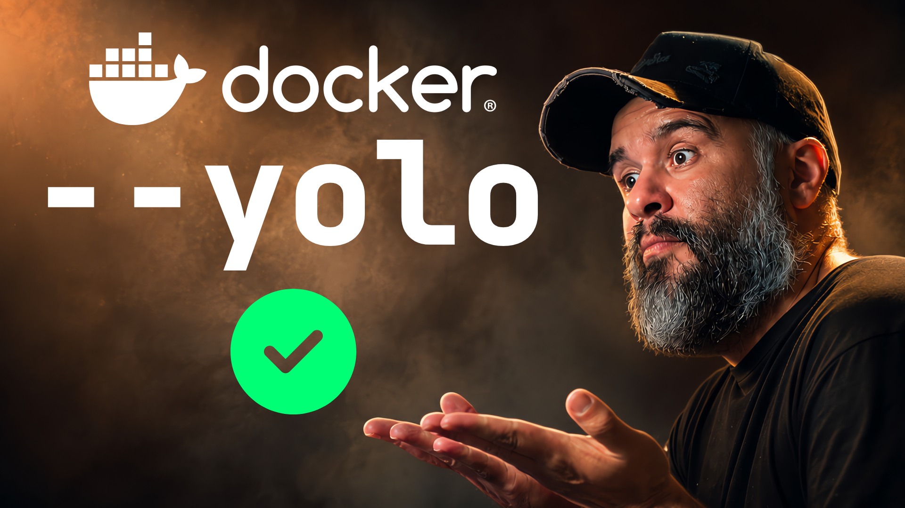

Ser um engenheiro de software hoje em dia (vulgo `dev`) significa usar agentes
de IA quase o tempo todo. Se você não usa, tem o meu respeito.

Ultimamente, meu trabalho tem se resumido a pajear modelos de LLM. E as tarefas
são bem diversas. De programar a gerar conteúdo, passando por escrever micro
scripts e fazer fetch e resumo de notícias em processo automatizado.

De vez em quando me pego quebrando a cabeça com algumas coisas que sairiam bem
mais rápidas se eu tivesse feito na mão. Este texto foi um exemplo disso.

Pedi ao modelo de forma bem detalhada, enviei minha persona mostrando como
escrevo, passei todo o contexto e a transcrição do vídeo. Cá estou, escrevendo
tudo na mão novamente.

Eu só estou te falando isso porque todas essas coisas que o agente faz sozinho
têm algo em comum: o modo YOLO.

Se a tarefa é automatizada, o agente não tem pra quem pedir permissões no
momento da execução. Além disso, é chato pra caramba descobrir como fazer um
sandbox sem capar as funcionalidades do modelo.

Isso significa que se ele roda na sua máquina, ele tem acesso às suas chave SSH,
token de AWS, histórico do seu shell, arquivos de configuração, projetos
privados, dotfiles, credenciais esquecidas, CLI autenticada e aquelas pastas
temporárias que você jurou que apagaria depois.

Sim! Ele viu suas fotos privadas de quando você estava olhando o que era aquela
dor no seu cóccix. OpenAI, Anthropic e Google Agradecem.

Eu divago. O fato é que colocar um bash na mão de um agente no seu ambiente real
é dar a chave da sua casa e seu cofre para qualquer pessoa aleatória na rua e
esperar que ela não faça nada que você não queira.

Automatizar coisas é legal, mas dormir à noite também é. E já que agora você não
vai mais desver isso, quando deitar na cama pense assim: será que tem algum
"prompt injection" no caminho do modelo que está rodando neste momento no meu
computador com o meu usuário real?

## Sannux: Sandbox Linux

A solução que encontrei para o problema que mencionei antes foi simples: O
sannux (ou Sandbox Linux).

A ideia deste projeto é ter templates para várias agentes em containers Docker.

Cada template é um pouco diferente do outro para mapear o funcionamento do
harness usado. Mas a ideia é que o agente tenha um projeto e uma home só dele.

Ambos podem ser persistentes ou efêmeros. Eu já falei do projeto no vídeo
abaixo. E também deixei o projeto super documentado em inglês e português do
Brasil.

Assista para entender melhor a ideia:

- [https://youtu.be/wqe0VU5L5aU](https://youtu.be/wqe0VU5L5aU)

Vou deixar o link do projeto e te convido a me ajudar a manter os templates
realmente úteis. Eu já testei todos eles, mas é bom cada um ver o seu caso de
uso para encontrar outros edge cases.

Se encontrar bugs ou quiser me ajudar a manter o projeto segue o link:

- [Repositório do Sannux](https://github.com/luizomf/sannux)

Até o próximo.
