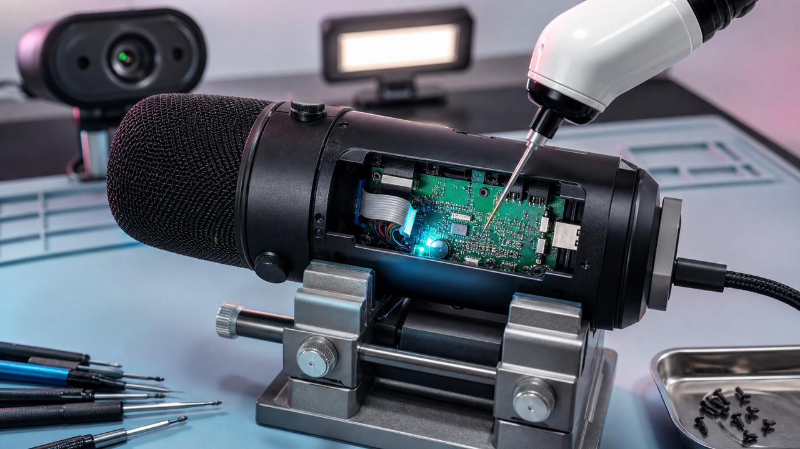

Um microfone tem um shell de comandos em texto puro. A webcam deixa apagar o LED enquanto continua gravando. A luminária aceita leitura e escrita de memória pela rede, sem autenticação. Chaz Schlarp encontrou essas superfícies enquanto investigava cinco periféricos com um agente de IA, os aparelhos na bancada e conhecimento suficiente para separar uma falha real de um palpite muito confiante.

A automação barateou a arqueologia de firmware. Infelizmente, os acessórios não aproveitaram a oportunidade para ficar mais seguros.

Os outros dois destaques mexem com números que pedem uma boa olhada no rodapé. Um executável Linux pode ser a própria base SQLite, contanto que outro executável faça o trabalho pesado. E um modelo de 250 milhões de parâmetros cabe num pacote de 60 MB, mas os tais 100 milhões de tokens antigos ficam num índice em disco. A manchete chega primeiro. A arquitetura vem logo atrás para estragar a festa.

## Cinco periféricos foram parar na bancada dos agentes

Schlarp publicou em 23 de agosto o resultado de aproximadamente duas semanas investigando cinco dispositivos USB e Wi-Fi com o Claude Opus 5. Segundo ele, foram cerca de 13 horas de trabalho do agente e 98 prompts humanos. Cada investigação lidava com um corpus relativamente pequeno: firmware, strings, contêineres de atualização, protocolos privados e interfaces de controle. Quando aparecia uma hipótese, o hardware estava ali para responder se funcionava mesmo ou era só fanfic de modelo.

No Shure MV7, um microfone USB, o pesquisador encontrou um shell em texto puro transportado por HID. São 48 comandos, incluindo operações de memória e controle dos LEDs. A gente costuma pensar em HID como teclado e mouse, só que fabricantes também usam a interface para carregar comandos privados. Quando esses comandos chegam à memória ou a funções sensíveis, o humilde “acessório” ganha uma fronteira de segurança inteira para chamar de sua.

A análise do Insta360 Link consumiu 3,7 horas de agente e 33 prompts, de acordo com Schlarp. Ela revelou primitivas para ler e escrever arquivos, além de um caminho para desligar o indicador enquanto a câmera continuava gravando. No Elgato Key Light Mini, foram 2,4 horas e 10 prompts até surgir leitura e escrita de memória sem autenticação pela interface de controle no Wi-Fi.

Uma API local numa luminária parece inofensiva até alcançar a memória. Depois disso, “controle de brilho” vira um nome bastante otimista para o perímetro.

O Shure levou 4,2 horas e 32 prompts. Tanto os números quanto os achados vêm do relato do pesquisador. Ele diz que validou a maioria das descobertas ao vivo no próprio hardware. Ainda falta reprodução independente nas diferentes revisões dos dispositivos e firmwares.

Também havia um humano fazendo bastante coisa nessa história: ele definiu os objetivos, preparou o material, deu acesso ao hardware, conduziu os prompts e validou as primitivas. O agente ficou com boa parte do trabalho repetitivo, como inventariar binários e strings, cruzar protocolos, sugerir caminhos e atravessar formatos antipáticos. Descoberta autônoma, no sentido de largar a IA sozinha no laboratório e voltar depois do almoço, ainda não foi o que aconteceu.

Mesmo com esse limite, a conta muda dos dois lados. Desenvolvedores experientes conseguem auditar firmware e protocolos de atualização com menos trabalho manual. Quem procura superfícies esquecidas em microfones, câmeras e acessórios de rede também ganha a mesma economia. Para equipes de produto, updater, HID privado e API na rede local merecem autenticação, validação e revisão como qualquer outra entrada privilegiada. Encontrar o buraco ficou mais barato. Corrigir continua no plano premium da mão de obra humana.

Fonte: [Chaz Schlarp — Everything I own, owned](https://schlarp.com/posts/everything-i-own-owned/).

## SELF executa uma base SQLite no Linux

Farid Zakaria publicou em 23 de agosto o SELF, uma prova de conceito na qual o arquivo executável também é uma base SQLite válida. Segmentos, símbolos, dependências e relocações viram tabelas e linhas consultáveis. Em vez de obrigar cada ferramenta a carregar um parser especializado para ELF, o experimento pergunta até onde dá para ir usando a interface de um banco que todo desenvolvedor já encontrou em algum canto.

O kernel não acordou sabendo executar SQLite. O protótipo usa `binfmt_misc`, mecanismo que associa uma assinatura de arquivo a um interpretador no espaço do usuário. O SELF põe seu marcador no offset 68. Ao encontrar a marca, o sistema entrega o arquivo ao `self-exec`, um pequeno programa em C ligado à `libsqlite3`.

O interpretador consulta as tabelas necessárias, mapeia segmentos, aplica relocações e passa o controle ao programa. E aqui entra a pequena crise existencial do projeto: o próprio `self-exec` continua sendo um ELF. O formato alternativo chega à festa no colo do formato tradicional. Ninguém comenta para não ficar um clima esquisito.

A estrutura relacional deixa as operações internas fáceis de enxergar. Informações de símbolos e depuração viram registros, e as dependências saem de joins. No exemplo de Zakaria, remover seções e notas para obter o equivalente a um strip é um `DELETE` seguido de `VACUUM`. Como a base tem transações, as alterações também podem ser atômicas.

ELF já guarda, na prática, uma espécie de esquema: cabeçalhos, tabelas de seção, strings, símbolos, relocações e dependências. SELF troca a serialização especializada por uma base genérica. A brincadeira fica especialmente boa quando começa a mostrar por que a especialização existe.

O custo principal aparece no carregamento. Um ELF convencional permite mapear páginas de texto diretamente e compartilhá-las entre processos. No SELF, os bytes lidos das páginas da árvore B do SQLite precisam ser copiados. O layout da base impede aquele mesmo mapeamento direto e compartilhado, então sobram mais uso de memória e trabalho na inicialização.

No exemplo do coreutils depois da remoção dos dados dispensáveis, o SELF ficou com 1.794.048 bytes; o ELF, com 1.768.632 bytes. A diferença naquele teste é pequena e bem menor que o overhead bruto sugerido por uma comparação sem strip. São medições do protótipo, não um benchmark universal. Em outro experimento, o autor varreu 723 executáveis para explorar uma base de sistema.

SELF é uma prova de conceito, sem suporte nativo no kernel ou no toolchain. Ele abre mão de compatibilidade, ferramentas maduras e eficiência no mapeamento de páginas para ganhar consultas SQL, introspecção e modificações atômicas. Acaba virando uma ótima aula sobre formatos binários: funciona o suficiente para você descobrir exatamente onde dói.

Fonte: [Farid Zakaria — Your executable is a SQLite database](https://fzakaria.com/2026/08/23/your-executable-is-a-sqlite-database).

## SHADOW cabe em 60 MB porque arquivo em disco não vira atenção

O projeto SHADOW-250M-Instruct publicou pesos, um runtime pequeno para CPU e uma camada em Python que recupera texto arquivado. O modelo tem 250 milhões de parâmetros, teria sido treinado do zero com 30 bilhões de tokens do FineWeb e usa quantização abaixo de dois bits, segundo o autor. O pacote completo ocuparia 60 MB, consumiria aproximadamente 80 MB de RAM durante a conversa e geraria perto de 400 tokens por segundo numa CPU de laptop.

Esses números são do próprio projeto e não passaram por benchmark independente nesta edição. A arquitetura, porém, é interessante porque separa duas coisas que manchetes sobre contexto adoram misturar.

A atenção direta do modelo cobre 2.048 tokens. O texto mais antigo vai para um índice lexical em disco. Antes de gerar a resposta, uma camada pesquisa o arquivo e extrai os trechos considerados relevantes. Na prática, temos um RAG compacto ao lado de uma janela curta. Atenção densa sobre 100 milhões de tokens seria outro bicho, provavelmente um bicho que comeria sua RAM e ainda pediria sobremesa.

O arquivo pesquisável chega aos 100 milhões de tokens anunciados e gasta cerca de 320 bytes por token arquivado. Nesse tamanho, o projeto relata 3,2 minutos para construir o índice, 435 milissegundos para recuperar o conteúdo e 0,45 segundo numa pergunta completa sobre o arquivo. O número grande mede quanto texto pode ser pesquisado no disco. Não mede quanto dele o modelo relaciona ao mesmo tempo.

Por isso, a avaliação precisa separar tamanho do binário e da RAM, velocidade bruta de geração, precisão da recuperação e sucesso na tarefa final. Quando você bate tudo no liquidificador, aparece um assistente minúsculo, veloz e quase onisciente. Medindo cada parte, pode aparecer uma ferramenta útil para um recorte bem menor. Produção costuma preferir a descrição que estraga a demo.

O próprio model card avisa que fatos, aritmética e respostas longas são fracos fora do arquivo. O modelo não foi treinado para raciocinar entre muitos documentos recuperados, e cadeias de dois saltos pioram no arquivo de 100 milhões de tokens. Quantização agressiva e um kernel pequeno aproveitam melhor o cache da CPU. Os 250 milhões de parâmetros continuam sendo 250 milhões de parâmetros.

SHADOW é um experimento aberto e interessante de modelo local com recuperação barata. O teste útil é descobrir se ele encontra a passagem correta e termina a tarefa que você pediu. Um índice enorme não dá memória de elefante ao modelo. Dá um armário muito bem etiquetado, o que já ajuda bastante quando alguém sabe qual gaveta abrir.

Fontes: [repositório SHADOW-250M-Instruct](https://github.com/QLNI/SHADOW-250M-Instruct) e [model card do SHADOW-250M](https://huggingface.co/NODEMIND/SHADOW-250M).

## Destaques rápidos para hoje.

- **`listen_addresses` abre sockets; `pg_hba.conf` decide quem pode autenticar no PostgreSQL.** Uma falha de bind pode afetar só uma entrada, e o servidor ainda inicia se outro socket funcionar. Por isso, `127.0.0.1,*` pode acabar acessível apenas pelo loopback quando há colisão no wildcard. `SHOW listen_addresses` mostra a configuração pedida; o log de startup e `ss -ltnp` mostram os sockets abertos de verdade. Conexão recusada costuma indicar ausência de listener, timeout aponta para rede ou firewall e um erro de `pg_hba.conf` confirma que a conexão chegou ao banco. Se você expuser `*`, firewall ou security group e regras corretas de autenticação continuam obrigatórios. Fonte: [The Build — All Your GUCs in a Row: listen_addresses](https://thebuild.com/blog/all-your-gucs-in-a-row-listen_addresses/).

- **O PowerShell do DOUBLECUP estava em texto puro depois do fim de um PNG válido.** Didier Stevens mostrou que o payload não ficava escondido nos pixels nem nos metadados. Os bytes de quebra de linha do Windows, `0x0D 0x0A`, abrem o trecho anexado, e o `FINDSTR` consegue achar um marcador e entregar o texto ao PowerShell. O parser de imagem para no fim do PNG válido; a ferramenta de texto continua andando pelo arquivo. Para defesa, um utilitário textual lendo PNG e alimentando PowerShell diz mais que uma busca limitada a esteganografia. A análise explica o armazenamento e a extração, sem determinar prevalência, vítimas ou a cadeia completa da campanha. Fonte: [SANS Internet Storm Center — DOUBLECUP's PNG Payload](https://isc.sans.edu/diary/33274).

- **Anthropic levou o Mythos 5 ao Claude Security e anunciou US$ 35 milhões em créditos defensivos.** [Quando falamos do lançamento](/2026/claude-fable-5-acima-do-opus-com-coleira-e-prazo/), o acesso restrito era parte central da história. Agora o modelo roda nos scans da beta pública para clientes Enterprise, que recebem CWE, confiança, severidade e uma correção sugerida, sempre com revisão humana antes da implementação. O Defender Advantage Fund pretende apoiar correções de vulnerabilidades abertas e automação defensiva com créditos do Claude. A empresa começará com poucos pilotos e ainda não divulgou os beneficiários. A qualidade dos achados e a capacidade do modelo são claims do fornecedor; o anúncio não traz comparação independente. Fonte: [Anthropic — Bringing the cybersecurity capabilities of Claude Mythos 5 to more defenders](https://claude.com/blog/bringing-claude-mythos-5-to-more-defenders).

- **Um experimento de Dreamer 4 com 1,57 bilhão de parâmetros custou cerca de US$ 150.** Rajat Dandekar relata o treinamento com 9,6 milhões de frames rotulados do CoinRun, PSNR de 40,41, FVD de 32,19 e rollouts de 144 frames a partir de quatro frames de contexto. Ele abandonou a tentativa anterior porque os vídeos pareciam bons, mas respondiam mal aos controles. As ações exatas do simulador deram um sinal melhor ao novo treinamento. Custos e métricas não foram reproduzidos nesta edição, o teste de troca de ações continua pendente e as comparações com Genie usam condições diferentes. É um pipeline barato e inspecionável para um jogo específico. Um modelo geral de mundo vai precisar de bem mais mundo. Fonte: [repositório dreamer4-coinrun](https://github.com/RajatDandekar/dreamer4-coinrun).

- **A Omacom Foundation nasceu com US$ 8 milhões e prometeu patrocinar o Hyprland por três anos.** Oito patronos comprometeram US$ 1 milhão cada com a organização sem fins lucrativos, que manterá marcas e infraestrutura do Omarchy e apoiará dependências abertas. Num anúncio separado, a fundação disse que será patrocinadora exclusiva do Hyprland por três anos, com opção de mais dois, para que o criador Vaxry trabalhe em tempo integral. O valor reservado especificamente ao compositor não foi divulgado. Os US$ 8 milhões financiam a fundação; eles não representam rodada de investimento nem valuation de uma distribuição Linux. Fontes: [lançamento da Omacom Foundation](https://omarchy.org/news/2026/08/omacom-foundation-launches-with-8-million/) e [patrocínio do Hyprland](https://omarchy.org/news/2026/08/omacom-foundation-to-be-exclusive-hyprland-sponsor/).

> Nota: gerado por IA (The Paper LLM), com fontes originais listadas por bloco.

<!--
briefing_id: 25045
source_urls:
  - https://schlarp.com/posts/everything-i-own-owned/
  - https://fzakaria.com/2026/08/23/your-executable-is-a-sqlite-database
  - https://github.com/QLNI/SHADOW-250M-Instruct
  - https://huggingface.co/NODEMIND/SHADOW-250M
  - https://thebuild.com/blog/all-your-gucs-in-a-row-listen_addresses/
  - https://isc.sans.edu/diary/33274
  - https://claude.com/blog/bringing-claude-mythos-5-to-more-defenders
  - https://github.com/RajatDandekar/dreamer4-coinrun
  - https://omarchy.org/news/2026/08/omacom-foundation-launches-with-8-million/
  - https://omarchy.org/news/2026/08/omacom-foundation-to-be-exclusive-hyprland-sponsor/
-->
