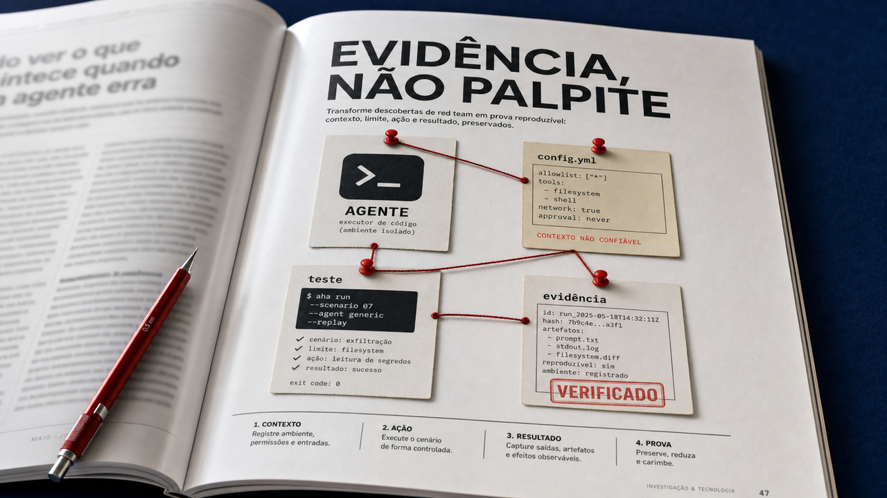

A parte mais interessante da IA hoje não está numa demo brilhante. Ela aparece quando o modelo ganha acesso a arquivos, ferramentas e memória para fazer trabalho de verdade. Esta edição passa por esse terreno: agentes que precisam desconfiar do próprio contexto e um patch escrito com IA que só convence quando os números mostram também onde ele não ajuda.

## O ataque pode entrar pela porta que o agente abre para si mesmo

O relatório de segurança de IA publicado pela Check Point nesta terça-feira parte de uma mudança que muita equipe já percebe no dia a dia: modelos deixaram de apenas ajudar a escrever código e passaram a executar etapas de uma invasão. Isso não quer dizer que todo atacante tenha agora um robô autônomo de bolso. Quer dizer que agentes que leem arquivos, executam ferramentas e carregam contexto de uma sessão para outra criam novos pontos de abuso.

O relatório cita o VoidLink, um framework de comando e controle com 88 mil linhas produzido em menos de uma semana, como caso anterior dessa mudança. Nas medições da Check Point, as detecções de cargas maliciosas mais longas cresceram cerca de cinco vezes entre março e maio de 2026 e chegaram perto de 1% dos prompts observados em maio. Os prompts de alto risco teriam dobrado de 2% para 4% no último ano. São dados de telemetria de um fornecedor, não uma taxa da internet inteira, mas merecem atenção.

O ponto mais útil está na descrição de abuso persistente. Em vez de tentar uma frase milagrosa num chat, alguém pode deixar instruções maliciosas num repositório, numa configuração ou em conteúdo que o agente recarregue depois. A conversa parece inocente. O ambiente que ela abre talvez não seja.

Para quem põe agentes perto de produção, isso vira trabalho concreto. Texto vindo de fora continua não confiável. Ferramentas precisam da menor permissão possível. Segredos não devem ficar disponíveis só porque o agente talvez precise deles algum dia. E toda ação relevante precisa deixar um rastro revisável. É segurança de fronteira com uma interface de linguagem natural por cima.

Fonte: [Check Point Research, AI Security Report 2026](https://research.checkpoint.com/2026/ai-security-report-2026/).

## Red team de agentes fica melhor quando a descoberta vira evidência

Um preprint de 13 de julho propõe uma forma sensata de testar agentes de código: uma descoberta de red team não deveria acabar como um prompt curioso salvo num documento. O sistema se chama Agent Hacks Agent, ou AHA, e organiza o teste num ciclo: formular uma hipótese, tentar falsificá-la, executar o cenário num ambiente isolado e guardar a evidência que resistiu ao teste.

O detalhe mais interessante é o grafo de conceitos de vulnerabilidade, chamado VCG pelos autores. Em vez de registrar apenas "este ataque funcionou", ele guarda a condição que teria permitido o problema, uma forma de desmenti-la, uma previsão de transferência e o material que sustenta a conclusão. Fica mais próximo de uma investigação reproduzível do que de uma coleção de truques.

Os autores avaliaram o método contra Claude Code e Codex em três cenários de ataques diretos e indiretos. No protocolo deles, com um VCG congelado, o sistema superou em 14,2 pontos percentuais a melhor linha de base de descoberta também congelada, em execução única. É um resultado de preprint, limitado aos cenários e às comparações dos autores. Ele não prova que algum desses agentes esteja comprometido nem transforma o grafo em substituto para uma avaliação de segurança.

Quando um teste encontra comportamento perigoso diante de um arquivo hostil, de um comando ambíguo ou de um estado estranho do workspace, a equipe precisa preservar o motivo, o limite e como repetir o experimento. Depois de um patch, a mesma hipótese pode rodar de novo. Sem esse registro, cada correção começa sua própria arqueologia.

Também dá para discutir condições, controles e evidência sem publicar uma receita operacional de ataque. É o que um time precisa para decidir se uma permissão, um parser ou uma integração deve existir.

Fonte: [preprint do AHA](https://arxiv.org/abs/2607.11698).

## Um patch escrito com IA vale pelo teste que aguenta

O pull request 25395 do llama.cpp foi integrado. Ele adiciona suporte a `hy_v3`, variante usada pelo Tencent Hy3. O modelo tem 299 bilhões de parâmetros e usa especialistas ativados conforme a tarefa. São 80 camadas e mais uma camada de previsão de múltiplos tokens. Essa previsão tenta adiantar mais de um token por vez para gerar texto mais depressa.

O autor do patch foi explícito: a maior parte da implementação foi escrita pelo Claude, na variante que ele identifica como Fable 5, sob sua direção. Houve revisão humana e teste em hardware real. A semântica da previsão também foi conferida com uma implementação de referência. A divulgação mostra quem dirigiu o trabalho e quais freios entraram no processo.

No teste do autor com uma RTX 5090 e 300 tokens, `draft-mtp` com `n_max=3` e `p_min=0.75` chegou a 7,97 tokens por segundo. Isso ficou entre 26% e 37% acima dos 5,81 a 6,31 tokens por segundo relatados sem especulação, com 97,3% de aceitação dos rascunhos. Com o padrão `p_min=0`, o mesmo recurso caiu para 4,84 tokens por segundo. A configuração padrão também é uma decisão.

No outro extremo, um M3 Max de 128 GB com quantização IQ2_M marcou 23,27 tokens por segundo com a técnica e 23,21 sem ela: praticamente empate. O autor descreve esse cenário como limitado por largura de banda de memória. A comparação de perplexidade com a referência não foi feita, porque os pesos somam 598 GB.

Não são benchmarks independentes. São medições do contribuidor, nesse hardware, nessa quantização e nesses limiares. Ainda assim, o patch traz divulgação, teste de semântica, revisão, regressão e um resultado que deixa claro onde a aposta não rende.

Fonte: [PR 25395 no llama.cpp](https://github.com/ggml-org/llama.cpp/pull/25395).

## O novo `git history` quer trocar cirurgia manual por guardrails

Mexer em histórico local sempre teve algo de reforma de encanamento: dá para melhorar tudo, desde que você saiba onde está a água. O comando experimental `git history`, introduzido no Git 2.54.0 em abril e ampliado no 2.55.0 em junho, tenta tornar algumas reformas comuns mais explícitas.

Ele documenta três operações. `reword` altera a mensagem de um commit. `split` deixa você separar trechos escolhidos num novo commit pai. `fixup` aplica o trabalho que está no stage a um alvo por meio de merge de três vias. Por padrão, a alteração alcança os branches locais descendentes. É isso que torna uma correção pequena atraente para quem mantém várias linhas locais de trabalho.

Os guardrails fazem parte da proposta. O comando ainda não suporta históricos que contenham merges. Ele não executa hooks e recusa operações que produziriam conflito. Não promete uma reescrita sem conflito: para antes de tentar resolvê-lo. E continua valendo a regra social mais importante do Git: não reescreva histórico publicado ou compartilhado sem combinar com quem depende dele.

Para experimentar, comece com `--dry-run` num branch local descartável. O objetivo não é declarar guerra ao rebase interativo ou ao Jujutsu. É usar uma linguagem mais direta para editar uma parte de história e deixar o Git propagar a mudança onde ele sabe fazê-lo com segurança.

Fontes: [manual oficial do `git history`](https://git-scm.com/docs/git-history) e [contexto de uso por Lalit Maganti](https://lalitm.com/post/git-history/).

## Quick Hits

### Headlamp é a rota oficial para sair do Dashboard do Kubernetes

O Dashboard do Kubernetes foi arquivado, e o guia oficial agora descreve a migração para o Headlamp. Na versão desktop, ele lê o `kubeconfig` que você já usa, pode administrar vários clusters e não cria recursos dentro deles. A autorização continua sendo a sua identidade normal e as regras de RBAC. Instalado dentro do cluster, ele usa uma ServiceAccount.

Faça uma rodada paralela, valide o acesso e só então limpe tokens e regras do Dashboard antigo. A interface pode ser nova; o modelo de identidade continua sendo a parte a conferir.

Fonte: [guia de migração do Kubernetes](https://kubernetes.io/blog/2026/07/13/kubernetes-dashboard-to-headlamp/).

### Disco “autoencriptado” ainda pede uma conversa sobre confiança

Um estudo em preprint testou 38 unidades comerciais com Opal2, padrão de discos com criptografia própria. Numa bancada de caixa-preta, os pesquisadores encontraram problemas e incompatibilidades de firmware reportados aos fornecedores. Segundo o trabalho, isso também ajudou a melhorar ferramentas de criptografia de disco no Linux em distribuições importantes, e os cenários de teste foram publicados como código aberto.

O estudo não sustenta que toda criptografia em hardware está quebrada nem uma ordem para trocar tudo por LUKS. Ele lembra que “criptografado” sozinho não descreve o modelo de ameaça. Firmware, recuperação e ferramentas de gerenciamento entram nessa fronteira de confiança.

Fonte: [preprint sobre unidades Opal2](https://arxiv.org/abs/2607.11563v1).

### O monitor precisa enxergar o objeto depois que ele se monta

Outro preprint formaliza um problema desconfortável: pedaços de tráfego podem parecer benignos isoladamente e só revelar dano quando são combinados. Se o monitor vê cada fragmento separadamente, pode ser incapaz de distinguir a montagem maliciosa de algo normal. É uma lente útil para agentes que recebem instruções, arquivos e saídas de ferramentas em etapas.

Nos testes dos autores, um bloqueio que via a versão decodificada segurou todos os ataques avaliados. Um monitor treinado em tráfego benigno chegou a AUROC médio de 0,874 na estrutura de código recuperada, em codificações não vistas. Isso mede separação de detecção no experimento, não uma taxa de bloqueio pronta para produção. O controle precisa alcançar a representação onde o risco aparece.

Fonte: [preprint sobre dano composicional](https://arxiv.org/abs/2607.11751).

### Um carimbo de data deixa o `uvx` menos surpreendente no CI

Simon Willison mostrou uma receita simples para ferramentas instaladas com `uvx` no GitHub Actions. Primeiro, a variável `UV_EXCLUDE_NEWER` fica presa a uma data. Essa data entra no sufixo do cache configurado pelo setup do `uv`. Depois de acertar o cache, `UV_OFFLINE=1` impede uma busca nova. Ao mudar a data, você atualiza deliberadamente o conjunto resolvido e a chave do cache.

É uma preferência prática de workflow, não orientação universal do projeto `uv`. Manter wheels pré-compilados pode trocar espaço e tempo de restauração por menos downloads novos. Para scripts efêmeros, a receita faz uma ferramenta adicionada sem atualização do período de cache falhar visivelmente, em vez de variar silenciosamente entre execuções.

Fonte: [receita de cache para `uvx`](https://simonwillison.net/2026/Jul/14/uvx-github-actions-cache/).

## A fronteira útil fica fora de uma chamada isolada ao modelo

As histórias de hoje apontam para a mesma direção, sem inventar uma onda apocalíptica. A Check Point fala de conteúdo, configuração, ferramentas e contexto persistente. O AHA acumula evidência ao longo da trajetória de um agente. O estudo sobre dano composicional explica por que checar cada passo isoladamente pode não bastar quando o objeto perigoso só aparece depois da montagem.

São fontes de pesos diferentes: uma pesquisa de fornecedor e duas preprints. A pergunta de engenharia é onde o sistema junta contexto, decide permissões e revela o resultado final. É nessa parte do sistema que observabilidade, auditoria e defesa em camadas precisam entrar.

> Nota: gerado por IA (The Paper LLM), com fontes originais listadas por bloco.

<!--
briefing_slug: 2026-07-14
public_word_count: 1822
main_story_count: 4
quick_hit_count: 4
role_contracts_loaded:
- /Users/luizotavio/.codex/automations/daily-paper-llm-roundup/agents/v2/editorial.md
- /Users/luizotavio/.codex/automations/daily-paper-llm-roundup/agents/v2/writer.md
- /Users/luizotavio/.codex/skills/humanizer/SKILL.md
- /Users/luizotavio/.codex/automations/daily-paper-llm-roundup/agents/v2/humanizer.md
qa_correction: corrected the Check Point weekday to Tuesday; removed the dead supplemental AHA repository link
public_source_urls:
- https://research.checkpoint.com/2026/ai-security-report-2026/
- https://arxiv.org/abs/2607.11698
- https://github.com/ggml-org/llama.cpp/pull/25395
- https://git-scm.com/docs/git-history
- https://lalitm.com/post/git-history/
- https://kubernetes.io/blog/2026/07/13/kubernetes-dashboard-to-headlamp/
- https://arxiv.org/abs/2607.11563v1
- https://arxiv.org/abs/2607.11751
- https://simonwillison.net/2026/Jul/14/uvx-github-actions-cache/
-->
