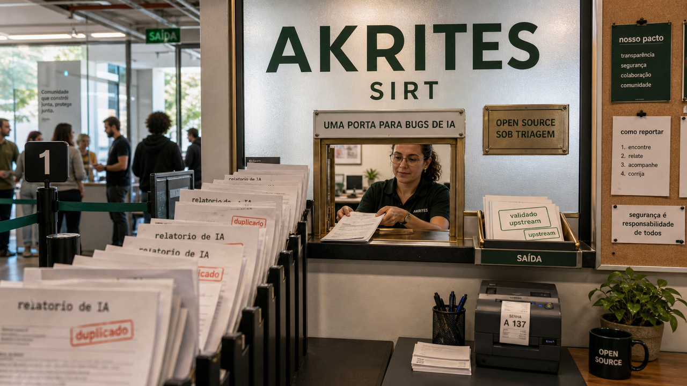

Está ficando barato encontrar falha com IA. Difícil mesmo é confirmar, corrigir e fazer o patch chegar ao projeto que todo mundo usa sem transformar mantenedor em central de atendimento de vulnerabilidade.

## Akrites quer coordenar correções antes que relatórios de IA afoguem mantenedores

O Akrites foi apresentado em 25 de junho como uma tentativa de organizar a remediação de vulnerabilidades em software aberto crítico. A carta de lançamento diz que a IA mudou a velocidade da descoberta: bugs sérios que antes podiam levar semanas para aparecer agora podem surgir em minutos.

Isso parece ótimo até a fila chegar do outro lado.

Projeto aberto já recebe issue duplicada, relatório incompleto, severidade chutada alto, prova de conceito sem contexto e pedido urgente de alguém que não vai escrever o patch. Se ferramenta de IA despejar mais achado bruto nessa mesma caixa de entrada, o gargalo deixa de ser "achar bug" e vira validar, corrigir, coordenar e publicar sem queimar quem mantém.

A proposta do Akrites é uma porta confidencial compartilhada, com uma equipe de resposta a incidentes de segurança, ou SIRT, para deduplicar relatórios, validar achados, coordenar correção upstream e sincronizar divulgação. A lista pública de participantes inclui nomes grandes de cloud, IA, infraestrutura e fundações, como AWS, Anthropic, Google, Microsoft e GitHub, NVIDIA, OpenAI, Red Hat e Rust Foundation.

O bom sinal da carta é medir sucesso por patch implantado, e não por CVE publicado. Para quem depende de pacote aberto em produção, a dor é bem concreta. Saber que a falha existe é só o começo. O fix precisa chegar no projeto certo, passar por revisão, sair em versão consumível e aparecer no seu deploy antes que o atacante faça a mesma leitura.

A parte delicada é governança. Coordenação confidencial pode reduzir duplicata e exposição antes do patch. Ao mesmo tempo, qualquer modelo concentrado de triagem levanta perguntas sobre transparência, autonomia dos mantenedores e quem decide a prioridade. Por enquanto, Akrites é uma promessa forte. A prova vem quando aparecer em correções reais, com upstream atendido e pacote chegando ao usuário final.

Fontes: [carta do Akrites](https://akrites.org/letter/) e [site do Akrites](https://akrites.org/).

## Micron indica que RAM cara pode virar planejamento, não susto de trimestre

A Micron reportou resultados recordes no terceiro trimestre fiscal de 2026, com US$ 41,46 bilhões em receita. Nos materiais oficiais, a empresa também diz que assinou 16 acordos estratégicos com clientes e que a demanda por DRAM e NAND continua superando bastante a oferta da indústria.

Esse é o pedaço que encosta no dev mesmo sem você comprar memória no atacado. Modelo local, servidor com mais cache, VPS maior, banco com mais folga, máquina de laboratório com GPU e projeto que promete "rode tudo na sua estação" continuam tendo uma dependência bem física: RAM. O README otimista não barateia esse pedaço.

Nos comentários preparados para investidores, a Micron afirma esperar condições apertadas além do ano-calendário de 2027. O Register leu os acordos como sinal de preços historicamente altos amarrados por vários anos para compradores grandes. Use isso como análise, sem transformar em previsão de varejo para o pente de memória que você vai comprar amanhã.

Mesmo assim, a direção importa. A onda de IA não consome só GPU. Ela consome memória, armazenamento, energia, rack, contrato, lead time e orçamento. Para quem planeja homelab, servidor de inferência, ambiente de teste com modelo local ou tier de VPS para produto, a pergunta deixa de ser apenas "qual modelo cabe?" e passa a incluir "quanto custa manter esse modelo cabendo daqui a dois anos?".

Serve mais como aviso de planejamento do que como gatilho para comprar hardware no impulso. Se um projeto depende de memória barata para fechar a conta, essa premissa merece ficar escrita em algum lugar, de preferência antes da fatura.

Fontes: [resultado fiscal da Micron](https://investors.micron.com/news-releases/news-release-details/micron-technology-inc-reports-record-results-third-quarter), [comentários preparados da Micron](https://investors.micron.com/static-files/631b1a32-5537-46ae-8f40-82e42fc79dfe) e [The Register](https://www.theregister.com/systems/2026/06/25/micron-locks-in-historically-high-memory-prices-for-five-years/5261854).

## Um agente em VPS recebeu mais de 6.000 e-mails e não vazou o secrets.env

Fernando Irarrazaval colocou no ar o hackmyclaw, um experimento simples de entender e difícil de executar direito: um assistente OpenClaw chamado Fiu rodando em uma VPS, recebendo e-mails públicos, com gente tentando fazer o agente vazar um arquivo chamado `secrets.env`.

Segundo o autor, mais de 2.000 pessoas mandaram mais de 6.000 e-mails. O segredo não vazou. O teste usou Claude Opus 4.6, custou mais de US$ 500 em chamadas de API e ainda rendeu uma suspensão de três dias na conta do Gmail.

O resultado chama atenção. A leitura honesta cabe no cuidado do próprio autor: prompt injection continua sendo um problema real de segurança, e ele não confiaria permissões arbitrárias a um agente. Esse cuidado evita transformar a história em propaganda involuntária.

Alguns limites do teste importam. Muita entrada era obviamente maliciosa, filtros do Google entraram no caminho, o agente não respondeu tudo e o comportamento mudou quando o processamento em lote contaminou a suspeita entre e-mails. Também estamos falando de um modelo específico, num desenho específico, com uma missão estreita.

Ainda assim, o experimento presta serviço. Ele mostra que modelo forte, instrução estreita, contexto controlado e permissão limitada podem melhorar bastante a resistência. Para um agente que lê e-mail, arquivo, calendário, terminal ou repositório, a arquitetura ao redor do prompt continua mandando: segredo fora do alcance por padrão, contexto novo quando possível, limite de custo, permissão mínima e ação perigosa passando por outra borda.

Agente que não vazou segredo em desafio público merece atenção. Agente com acesso livre a tudo porque passou em um desafio público merece preocupação.

Fontes: [post de Fernando Irarrazaval](https://www.fernandoi.cl/posts/hackmyclaw/) e [discussão no Hacker News](https://news.ycombinator.com/item?id=48681687).

## Microsoft mostra que docs para agentes precisam dizer qual caminho quebra

Ontem falamos de [harnesses e agentes entrando na arquitetura](/2026/npm-github-actions-ci-typescript-7-go/). Hoje a Microsoft trouxe uma peça menor, mas bem prática: o agente chega na documentação com um plano provável na cabeça.

No exemplo da Microsoft, a tarefa era atualizar um projeto SharePoint Framework. Uma dica suave para usar a ferramenta correta não bastou em vários testes. Quando a documentação passou a dizer que atualizar manualmente o `package.json` sozinho causaria falhas de build, e logo em seguida apontou a alternativa certa, as cinco execuções passaram a usar a ferramenta.

O padrão é simples o bastante para testar em `AGENTS.md`, `CLAUDE.md`, guia de migração e README interno. Primeiro, nomeie o caminho errado que o agente provavelmente tentaria. Depois, diga a falha concreta que esse caminho causa. Em seguida, coloque o comando ou fluxo correto perto da advertência.

Cinco execuções em blog de vendor dão pouco para chamar de lei. Ainda assim, a intervenção é boa porque troca "seria legal usar X" por "se fizer Y, quebra por este motivo; use X". Quem já viu agente editar arquivo errado por confiança demais sabe que uma frase dessas custa pouco.

Para times que estão enchendo repositório de instruções para agentes, a diferença é útil. Em documento para humano, dá para explicar contexto e deixar alternativa implícita. Para agente, talvez seja melhor invalidar a gambiarra antes que ela pareça uma solução.

Fonte: [Microsoft for Developers](https://developer.microsoft.com/blog/your-agent-already-has-a-plan).

## Destaques rápidos para hoje

- **GitHub colocou números no harness do Copilot, mas ainda é benchmark de vendor.** Depois da [conversa de ontem sobre agentes e harness](/2026/npm-github-actions-ci-typescript-7-go/), a empresa publicou dados sobre o GitHub Copilot agentic harness, descrito como componente comum por trás do Copilot CLI, app, code review e outras superfícies. O aprendizado técnico é tratar ferramenta, contexto, fluxo e gasto de tokens como parte do sistema avaliado, além do nome do modelo. A ressalva vem junto: GitHub está medindo o produto do GitHub. Fonte: [GitHub Blog](https://github.blog/ai-and-ml/github-copilot/evaluating-performance-and-efficiency-of-the-github-copilot-agentic-harness-across-models-and-tasks/).

- **Deno 2.9 colocou uma espera padrão antes de instalar pacote npm novo.** A release trouxe `deno desktop` ainda experimental, leitura de lockfiles de npm, pnpm, yarn e Bun para semear `deno.lock`, e uma defesa bem concreta de supply chain: idade mínima de 24 horas para dependências npm por padrão. Depois de dias falando de pacote recém-publicado virando risco, essa janelinha de espera faz sentido. Teste com calma: a janela ajuda, mas continua sendo só uma camada de defesa. Fontes: [Deno 2.9](https://deno.com/blog/v2.9) e [docs de supply chain do Deno](https://docs.deno.com/runtime/packages/supply_chain/).

- **ShareLock mostra que ataque a MCP pode ficar espalhado por várias ferramentas.** No dia 22, [MCP já apareceu aqui como superfície de agente](/2026/sentry-virou-porta-para-agentes-claude-mostrou-o-sandbox-e-roteadores-viraram-proxy/). O paper ShareLock muda o formato: a instrução maliciosa é fragmentada em descrições de ferramentas que, isoladas, parecem inofensivas. A ideia usa Shamir's Secret Sharing como inspiração e reforça a revisão do servidor MCP inteiro, com as ferramentas vistas em conjunto. É pesquisa, não exploração ativa confirmada. Fonte: [arXiv](https://arxiv.org/html/2606.27027v1).

- **Chai mira mau uso de criptografia com agentes.** O paper apresenta um sistema de descoberta e validação de vulnerabilidades de uso incorreto de criptografia. Os autores lembram que esse tipo de bug é mais difícil de confirmar do que muita falha de memória, porque nem sempre existe um crash ou sanitizador apontando o erro. Isso reforça o problema do Akrites: se IA aumenta achados em classes difíceis, triagem e validação viram parte central da segurança. Fonte: [arXiv](https://arxiv.org/html/2606.26933v1).

- **Microsoft rastreou phishing com ZIP de fotos e implante em Node.js.** A campanha mira organizações de hotelaria na Europa e na Ásia desde abril de 2026, segundo a Microsoft, usando arquivos ZIP com tema de fotos, atalhos LNK falsos, PowerShell ofuscado e um implante baseado em Node.js com persistência no registro. Para defesa, o gancho é direto: `node.exe` rodando de caminho estranho com script estranho pode ser sinal de intrusão em vez de ferramenta de desenvolvimento. Fonte: [Microsoft Security Blog](https://www.microsoft.com/en-us/security/blog/2026/06/25/photo-zip-campaign-targeting-hospitality-industry-delivers-node-js-implant-persistent-access/).

- **usbliter8 é importante, mas exige acesso físico e hardware específico.** A Paradigm Shift descreve o usbliter8 como exploit de SecureROM para chips Apple A12/A13 e alguns Apple Watch S4/S5. Como BootROM fica numa camada que não recebe patch comum, a pesquisa pesa para segurança de dispositivos. O freio também precisa aparecer na primeira leitura: é exploração tethered, com modo DFU e hardware baseado em RP2350. O impacto prático passa por esse limite físico, não por comprometimento remoto em massa. Fontes: [Paradigm Shift](https://ps.tc/pages/blog-usbliter8.html) e [repositório usbliter8](https://github.com/prdgmshift/usbliter8).

- **SANS mostrou o barulho que portas expostas escutam.** Um diário do Internet Storm Center, baseado em honeypot DShield, descreve scanners e botnets batendo em serviços expostos, vulnerabilidades antigas de roteador, DVR e caminhos de exploração já cansados de guerra. Para quem mantém VPS, a leitura é quase terapêutica: firewall, patch, log, limite de exposição e revisão de painel administrativo continuam chatos porque continuam funcionando. Fonte: [SANS Internet Storm Center](https://isc.sans.edu/diary/What%2Bdo%2BPorts%2BHear%2BWhen%2BNobodys%2BListening%2BAn%2BAssessment%2Bof%2BAutomated%2BCybercrime%2BGuest%2BDiary/33104).

## Acompanhamento de tendências do dia

O modelo continua importante, claro. Só que as notícias de hoje apontam para várias peças ao redor dele ficando tão decisivas quanto o próprio modelo: coordenação de correção, harness, documentação, validação, custo de token, permissão de ferramenta e até preço de memória.

Akrites aparece na fila de vulnerabilidades antes do patch. Microsoft e GitHub entram na forma como o agente é conduzido. ShareLock, Chai e hackmyclaw puxam segurança em ferramentas, validação e prompt injection. Micron lembra que IA também bate no mundo físico, com DRAM, NAND e contrato de fornecimento.

Para quem constrói produto com IA, isso puxa a conversa para um lugar mais adulto. Escolher modelo continua sendo uma decisão. Mas o sistema que envolve o modelo precisa ter dono: regra versionada, log revisável, limite de custo, permissão mínima, teste que falha de verdade, documentação que aponta o caminho errado e infraestrutura que fecha a conta.

O próximo salto provavelmente vai parecer menos mágico do que a demo. Talvez venha como fila de patch melhor coordenada, agente que para antes de gastar demais, lockfile que espera 24 horas, ou guia interno com uma frase dizendo "não edite isso manualmente porque quebra o build". Coisa pequena, mas produção é cheia de coisa pequena com chave do castelo no bolso.

Fontes da tendência: [Akrites](https://akrites.org/letter/), [Microsoft](https://developer.microsoft.com/blog/your-agent-already-has-a-plan), [GitHub](https://github.blog/ai-and-ml/github-copilot/evaluating-performance-and-efficiency-of-the-github-copilot-agentic-harness-across-models-and-tasks/), [ShareLock](https://arxiv.org/html/2606.27027v1) e [Micron](https://investors.micron.com/static-files/631b1a32-5537-46ae-8f40-82e42fc79dfe).

> Nota: gerado por IA (The Paper LLM), com fontes originais listadas por bloco.

<!--
briefing_slug: 2026-06-26
source_mode: briefing
generated_at: 2026-06-26T05:40:50-03:00
source_urls:
  - https://akrites.org/letter/
  - https://akrites.org/
  - https://investors.micron.com/news-releases/news-release-details/micron-technology-inc-reports-record-results-third-quarter
  - https://investors.micron.com/static-files/631b1a32-5537-46ae-8f40-82e42fc79dfe
  - https://www.theregister.com/systems/2026/06/25/micron-locks-in-historically-high-memory-prices-for-five-years/5261854
  - https://www.fernandoi.cl/posts/hackmyclaw/
  - https://news.ycombinator.com/item?id=48681687
  - https://developer.microsoft.com/blog/your-agent-already-has-a-plan
  - https://github.blog/ai-and-ml/github-copilot/evaluating-performance-and-efficiency-of-the-github-copilot-agentic-harness-across-models-and-tasks/
  - https://deno.com/blog/v2.9
  - https://docs.deno.com/runtime/packages/supply_chain/
  - https://arxiv.org/html/2606.27027v1
  - https://arxiv.org/html/2606.26933v1
  - https://www.microsoft.com/en-us/security/blog/2026/06/25/photo-zip-campaign-targeting-hospitality-industry-delivers-node-js-implant-persistent-access/
  - https://ps.tc/pages/blog-usbliter8.html
  - https://github.com/prdgmshift/usbliter8
  - https://isc.sans.edu/diary/What%2Bdo%2BPorts%2BHear%2BWhen%2BNobodys%2BListening%2BAn%2BAssessment%2Bof%2BAutomated%2BCybercrime%2BGuest%2BDiary/33104
omitted_briefing_items:
  - Ornith-1.0 / Stop waiting for Qwen3.7 openweights: thin source chain and unverified model-base or benchmark claims; future hands-on candidate.
  - Law enforcement takes down Amadey and StealC: relevant security news, but security lane already full and compact coverage risked IOC-heavy prose.
  - When does combining language models help?: folded into the agent harness and routing trend.
  - The Spec Growth Engine: useful architecture context, but too paper-dense as a standalone item.
  - A deterministic control plane for LLM coding agents: folded into the harness and security trend.
  - To run or not to run: code execution in program repair: optional trend support only, not needed as a separate public item.
  - Semantic early-stopping for agent loops: folded into stopping-rules and token-discipline trend.
  - NOVA verification-aware agent harness: narrow research pattern, not a separate recommender story today.
  - OpenRCA 2.0: optional trend caution only.
  - Smaller models, unexpected costs: quantization for program repair: crowded out by Micron and harness economics.
  - OpenAI internal Codex usage grew dozens of times over: newsletter/meta source and overlaps recent workflow angle.
  - pgEdge ColdFront for PostgreSQL: beta/vendor-heavy and based on older June 18 release.
  - All your GUCs in a row: enable_gathermerge: evergreen Postgres explainer, not timely enough.
  - How VictoriaLogs stores logs in a columnar layout: good observability deep dive, not a news priority today.
  - The Garbage Collection Handbook, second edition: reference material rather than same-day news.
  - Beyond Objects: design essay/paper crowded out.
  - A data race that does not compile in Rust: good technical article but weaker fit than selected stories.
  - Quickly apply LUTs with ffmpeg: useful workflow tip but not central to this edition.
  - Show HN: OpenKnowledge: needs hands-on testing before recommendation.
  - IBM sub-1-nanometer chip technology: less practical than Micron for this audience.
  - PRISM malware detection dataset: niche ML-security item crowded out.
  - AI children's books, body horror edition: AI culture story, weak fit for technical roundup.
  - Papermark accuses Corgi of AGPL copying: social accusation source chain, avoided without stronger primary evidence.
  - OpenAI GPT-5.6 slow-roll reports: secondary-only reporting and overlaps recent governance coverage.
  - JetBrains malicious AI plugins StepSecurity follow-up: repeat of June 21 public post without new public delta.
  - Podman 6.0: good Linux item but weaker than selected Deno release.
-->
