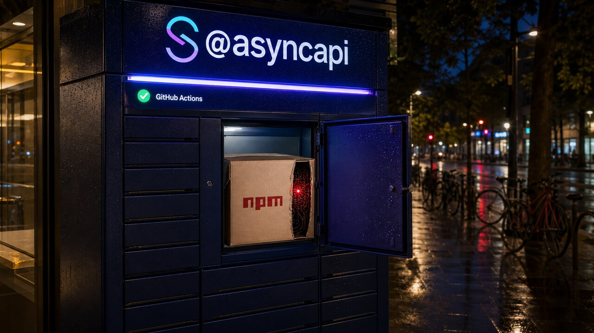

Um pacote pode vir do namespace certo, sair pelo pipeline oficial e ainda carregar malware. Foi o que aconteceu com quatro pacotes do AsyncAPI nesta terça-feira. O atacante roubou um token privilegiado e fez o próprio GitHub Actions publicar cinco versões comprometidas. Para quem importou uma delas, remover a dependência é só o começo.

## AsyncAPI publicou cinco versões maliciosas pelo pipeline legítimo

Segundo a investigação da Wiz, o ataque começou em 14 de julho com uma enxurrada de 37 pull requests contra o repositório `asyncapi/generator`. No meio do ruído estava a PR número 2155, preparada para executar código não confiável num workflow com acesso a segredos.

O perigo estava na combinação. O evento `pull_request_target` roda no contexto do repositório que recebe a contribuição e, por isso, pode acessar seus secrets. Isso, sozinho, não é uma vulnerabilidade. O problema começa quando o workflow faz checkout do código vindo do fork e o executa. A PR deixa de ser texto esperando revisão e vira código de um desconhecido rodando com as credenciais da casa. O nome desse padrão é bem literal: *pwn request*.

O código malicioso exfiltrou um token de acesso pessoal, o PAT do `asyncapi-bot`. Com ele, o invasor colocou um commit diretamente no branch `next`, às 06:58 UTC, e deixou o pipeline legítimo cuidar da publicação. As primeiras versões comprometidas chegaram ao npm às 07:10 UTC. A cronologia analisada pela Wiz vai até 08:28 UTC.

Foram quatro pacotes e cinco versões:

- `@asyncapi/generator@3.3.1`;
- `@asyncapi/generator-helpers@1.1.1`;
- `@asyncapi/generator-components@0.7.1`;
- `@asyncapi/specs@6.11.2`;
- `@asyncapi/specs@6.11.2-alpha.1`.

Juntos, esses pacotes somam mais de 3 milhões de downloads semanais, segundo a Wiz. Esse é o volume normal de circulação dos pacotes, não a quantidade de instalações comprometidas. A fonte não estabeleceu quantas foram atingidas de fato.

O payload merece atenção porque não dependia de script de instalação. Bastava importar o pacote com `import` ou `require`. A partir daí, ele baixava um segundo estágio de 8,25 MB e instalava uma estrutura com cerca de 92 mil linhas. A análise encontrou persistência, comunicação com infraestrutura de comando e controle e roubo de dados. A lista de alvos incluía cookies e senhas de navegador, chaves SSH, tokens npm e GitHub, credenciais AWS, dados do Keychain e carteiras.

O caso expõe um limite da proveniência. Saber que um artefato saiu do pipeline esperado ajuda a confirmar sua origem, mas não garante que o conteúdo seja seguro quando o workflow ou o token de publicação foi comprometido. O crachá era verdadeiro. A pessoa que entrou com ele, não.

Quem importou uma das versões afetadas precisa tratar a máquina de desenvolvimento ou o runner de CI como potencialmente comprometido. Na prática, isso significa investigar os hosts, remover as versões, procurar persistência e considerar expostos os segredos disponíveis ao processo. Tokens do GitHub e do npm, chaves SSH e credenciais de nuvem entram na rotação.

Para busca defensiva, a Wiz indicou os endereços de comando e controle `85[.]137[.]53[.]71:8080` e `85[.]137[.]53[.]71:8081`. A entrega do payload passou por `ipfs[.]io`, e a primeira exfiltração do token usou `rentry[.]co`. Os caminhos de persistência observados incluem `~/.local/share/NodeJS/sync.js` no Linux, `~/Library/Application Support/NodeJS/sync.js` no macOS e `%LOCALAPPDATA%\NodeJS\sync.js` no Windows, além do serviço `miasma-monitor.service`.

A autoria continua desconhecida. A análise cita as marcas “M-RED-TEAM” e Miasma e aponta semelhanças parciais com atividade anterior, mas não faz uma atribuição definitiva.

Fonte: [Wiz Threat Research](https://www.wiz.io/blog/m-red-team-asyncapi-supply-chain-compromise-via-github-actions).

## node-forge 1.4.0 para de aceitar duas assinaturas que deveriam falhar

Uma assinatura digital não serve apenas para conferir se uma conta matemática fecha. O verificador também precisa rejeitar codificações proibidas pela especificação. No `node-forge`, duas lacunas nessa validação permitiam aceitar assinaturas inválidas até a versão 1.3.3. A correção está na 1.4.0.

O CERT Coordination Center reuniu os dois casos no alerta VU#725167, publicado em 15 de julho. Os advisories do mantenedor atribuem severidade CVSS 7.5 a ambos.

O primeiro, CVE-2026-33894, afeta a verificação RSA com PKCS número 1, versão 1.5. No caminho padrão, o parser aceitava conteúdo ASN.1 extra e não exigia o mínimo de oito bytes de padding. O proof of concept do advisory usa uma chave com expoente público baixo, `e=3`: a assinatura forjada passa no forge, mas é rejeitada pelo Node e pelo OpenSSL.

O limite dessa demonstração importa. O advisory mostra a falsificação em condições específicas, especialmente com `e=3`. Não descreve uma quebra geral do RSA.

O segundo problema, CVE-2026-33895, envolve Ed25519. O forge não rejeitava o componente `S` quando ele era maior ou igual a `L`, limite definido pelo algoritmo. Assim, uma assinatura válida e outra variante construída como `S + L` podiam ser aceitas, enquanto Node e OpenSSL rejeitavam a segunda forma.

Esse é um caso de maleabilidade: mais de uma sequência de bytes representa algo que o verificador aceita como a mesma assinatura. O impacto depende do uso que a aplicação faz desses bytes. Sistemas que esperam uma representação única para deduplicação, controle de replay, autorização ou attestation podem tomar decisões diferentes diante da variante não canônica.

Aplicações Node.js e de navegador que usam `node-forge` para decidir autenticidade devem atualizar para 1.4.0. Também convém procurar nos lockfiles e nas dependências transitivas, porque a biblioteca pode ter entrado no projeto sem aparecer em nenhum `import` escrito pela aplicação. Depois do update, é preciso descobrir onde uma “assinatura aceita” libera acesso, impede replay ou valida uma identidade.

A versão corrigida foi publicada em 24 de março de 2026. A novidade de hoje é o CERT/CC ter reunido os dois registros, não um patch lançado agora.

Fontes: [advisory sobre RSA](https://github.com/digitalbazaar/forge/security/advisories/GHSA-ppp5-5v6c-4jwp), [advisory sobre Ed25519](https://github.com/digitalbazaar/forge/security/advisories/GHSA-q67f-28xg-22rw) e [release do node-forge 1.4.0](https://github.com/digitalbazaar/forge/releases/tag/v1.4.0).

## Pluralis põe 14 Macs para gerar rollouts de RL pela internet

Quatorze Macs, espalhados por quatro países e ligados por conexões comuns, participaram do pós-treino por reforço de um modelo com 8,3 bilhões de parâmetros. Eles geraram os rollouts; uma NVIDIA B200 central ficou responsável pelas atualizações de gradiente.

Essa divisão funciona porque o trabalho tem duas partes. Nos rollouts, o modelo executa a tarefa e produz trajetórias usadas como experiência. Depois, o treinador calcula e aplica as mudanças nos pesos. No experimento publicado pela Pluralis em 14 de julho, os Macs fizeram inferência int8 com MLX. A B200 treinou em bf16 usando Megatron. Segundo a equipe, 14 máquinas bastavam para saturar esse treinador.

O modelo era o LFM2.5-8B-A1B, uma arquitetura de mistura de especialistas, ou MoE. Ele tem 8,3 bilhões de parâmetros, mas ativa partes do modelo conforme a entrada em vez de usar tudo da mesma maneira a cada passo.

Distribuir os rollouts traz um problema de sincronização. Os workers podem gerar trajetórias com versões antigas dos pesos, outra precisão numérica e kernels diferentes dos usados no treino. Essa defasagem deixa os dados *off-policy*: a experiência veio de um estado do modelo que já não corresponde exatamente ao atual.

A solução descrita pela Pluralis, chamada PULSE, envia deltas int8 em vez do conjunto completo de pesos a cada mudança. Como mais de 99% dos valores int8 não mudavam entre versões, o volume mediano caiu de aproximadamente 9 GB para 82 MB. A cada 20 versões, o sistema publica uma âncora completa. Assim, novos workers não precisam reconstruir uma sequência interminável de deltas. Um filtro inspirado em DPPO também descarta atualizações de tokens quando a diferença fica grande demais, segundo os autores.

No conjunto de teste reservado do PaperSearchQA, uma tarefa biomédica com busca agêntica, o pass@1 subiu de 29% para 63%. O resultado foi divulgado pelo próprio laboratório, e não localizamos reprodução independente nesta edição. O ganho também não pode ser generalizado para qualquer modelo ou tarefa.

O experimento mostra que máquinas Apple heterogêneas podem ampliar a geração de trajetórias mesmo fora do mesmo data center. O modelo ainda precisa caber em cada Mac, e uma GPU de data center continua no centro do treinamento. É uma arquitetura híbrida: os Macs cuidam dos rollouts e a B200, das atualizações de gradiente.

Fonte: [Pluralis Research](https://pluralis.ai/blog/rl-post-training-on-macs/).

## ripgrep 15.2.0 chega ao Linux ARM com musl

O ripgrep 15.2.0 saiu nesta quarta-feira com uma novidade direta para containers, VPS minimalistas e máquinas ARM64: agora há um binário oficial para o target `aarch64-unknown-linux-musl`.

A release também melhora o percurso de diretórios em corpora muito grandes. O changelog não mede o ganho, então só dá para dizer que a mudança deve reduzir o tempo gasto atravessando árvores grandes em alguns cenários.

Outros ajustes evitam resultados bem confusos. O ripgrep passa a respeitar as variáveis `GIT_CONFIG_GLOBAL` e `GIT_CONFIG_SYSTEM`, úteis quando automações e sandboxes apontam para configurações alternativas do Git. Correções no matching de regras do gitignore tratam bugs que apareciam ao pesquisar vários diretórios.

A versão 15.2.0 foi publicada em 15 de julho de 2026, às 16:26 UTC. É aquela release sem manifesto épico: chegou o binário que faltava, a travessia ficou mais eficiente e menos arquivos devem aparecer ou sumir da busca pelo motivo errado. Para uma ferramenta cujo trabalho é encontrar texto, previsibilidade já é uma bela feature.

Fonte: [release do ripgrep 15.2.0](https://github.com/BurntSushi/ripgrep/releases/tag/15.2.0).

> Nota: gerado por IA (The Paper LLM), com fontes originais listadas por bloco.

<!--
source_urls:
  - https://www.wiz.io/blog/m-red-team-asyncapi-supply-chain-compromise-via-github-actions
  - https://github.com/digitalbazaar/forge/security/advisories/GHSA-ppp5-5v6c-4jwp
  - https://github.com/digitalbazaar/forge/security/advisories/GHSA-q67f-28xg-22rw
  - https://github.com/digitalbazaar/forge/releases/tag/v1.4.0
  - https://pluralis.ai/blog/rl-post-training-on-macs/
  - https://github.com/BurntSushi/ripgrep/releases/tag/15.2.0
-->
