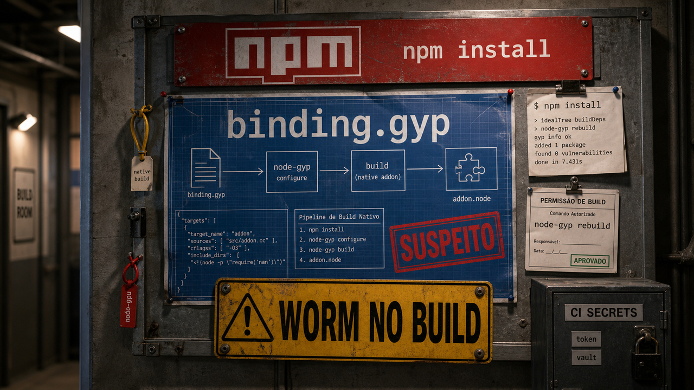

A gente confia muito no que parece rotina: instalar dependência, abrir dashboard, pedir para um modelo revisar segurança. O problema é que esses caminhos normais também executam código, carregam sessão e encostam em credencial.

## Miasma achou execução no binding.gyp durante npm install

Na edição de 1 de junho, a gente falou de [Miasma no npm](/2026/miasma-npm-cisco-odysseus-seguranca-fora-prompt/) no caminho de instalação. A atualização agora é mais específica: a StepSecurity descreveu uma variação chamada Phantom Gyp, em que o gatilho sai dos scripts óbvios do `package.json` e entra no `binding.gyp`.

Esse arquivo costuma aparecer quando um pacote precisa compilar um addon nativo. O npm vê aquilo, chama `node-gyp rebuild`, e a instalação segue como se estivesse preparando código nativo legítimo. No caso descrito pela StepSecurity, um `binding.gyp` de 157 bytes bastava para puxar a execução maliciosa durante o install.

Segundo a empresa, até a análise publicada, a campanha atingia 57 pacotes e 286+ versões maliciosas. A lista inclui `@vapi-ai/server-sdk` e `ai-sdk-ollama`; no caso de `ai-sdk-ollama`, a StepSecurity aponta as versões 3.8.5, 2.2.1, 1.1.1 e 0.13.1. Esse detalhe dói porque muita gente trata integração com modelo local como uma zona mais segura por natureza. O modelo pode estar na sua máquina, mas a cola que liga tudo ainda pode vir do npm.

A carga citada pela análise passa por um `index.js` ofuscado de 4,5 MB, baixa Bun v1.3.13 e procura credenciais de ambiente de dev e CI. O computador da pessoa é só uma parte do alcance. Em GitHub Actions e outros runners com segredo por perto, um install de dependência pode alcançar token de GitHub, cloud, Vault, Kubernetes e registry antes de a aplicação sequer rodar.

Para defesa, o trabalho chato é o correto: revisar lockfiles e logs de instalação, trocar versões afetadas por versões limpas ou alternativas confiáveis, procurar sinais estranhos no build e girar segredos que ficaram acessíveis ao ambiente de instalação. Scanner e revisão também precisam olhar `binding.gyp` e comportamento de build nativo, além de `preinstall` e `postinstall`.

Os números ainda podem mudar. A atualização publicada já basta: supply chain continua sendo supply chain, inclusive quando o pacote serve para plugar modelo local em produto bonito.

Fontes: [StepSecurity](https://www.stepsecurity.io/blog/binding-gyp-npm-supply-chain-attack-spreads-like-worm) e [Microsoft Security Blog](https://www.microsoft.com/en-us/security/blog/2026/06/02/preinstall-persistence-inside-red-hat-npm-miasma-credential-stealing-campaign/).

## Um nome no MeshCore virou XSS crítico no Home Assistant

MeshCore é uma rede de mensagens que usa LoRa, um rádio de longo alcance e baixa banda. O rádio só transporta o texto; a falha descrita por Sasha Romijn aparece quando esse conteúdo externo entra em um painel do Home Assistant sem escape adequado.

O componente afetado é o `meshcore-card`, usado via HACS. MeshCore anuncia nós com um campo de nome de 32 bytes, e esses nomes podiam ser renderizados no dashboard como HTML. Com um nome preparado para isso, bastava o painel com o card ser visualizado para JavaScript rodar na sessão do frontend.

O advisory no GitHub registra CVE-2026-45323, GHSA-5vrg-xpcj-xppc, CVSS 9.6 e correção no `meshcore-card` 0.3.3. Versões anteriores a 0.3.3 entram na área afetada. A interação do usuário também importa: alguém precisa abrir ou visualizar o dashboard. Só que, em Home Assistant OS ou Supervised, uma sessão administrativa no frontend fica perto de add-ons, tokens e automações de casa. A palavra "casa" deixa a coisa menos abstrata.

A pesquisadora também cita variantes `panel-v2` e sites analisadores que ainda pareciam expostos, com a ressalva de que nem toda variante foi verificada em runtime. Para quem usa esse caminho, a ação direta é atualizar o card, evitar variantes sem correção clara e tratar qualquer nome de nó, dispositivo ou contato vindo de rádio como entrada não confiável.

Tem um detalhe quase didático no meio da história: o analisador CoreScope tinha uma função `safeEsc` que checava um global inexistente e, quando não encontrava, devolvia a entrada sem escape. A autora aponta isso como uma aparente alucinação de LLM. A cautela aqui é proporcional: uma função com nome de segurança não garante segurança.

Fontes: [Sasha Romijn](https://mxsasha.eu/posts/meshcore-xss-home-assistant/) e [GitHub Advisory Database](https://github.com/jpettitt/meshcore-card/security/advisories/GHSA-5vrg-xpcj-xppc).

## Um experimento de US$ 1.500 testou LLMs contra Firebase

Kasra Rahjerdi montou um experimento simples de entender e difícil de exagerar com honestidade. Ele criou um app falso em React Native Expo, com backend Python/FastAPI aparentemente bem protegido, mas com uma camada Firebase/Firestore vulnerável. O caminho certo para explorar era usar informações em `google-services.json` e acessar dados privados direto pelo Firebase.

Isso é muito parecido com erro real de produto: a API oficial parece segura, mas o cliente mobile entrega uma pista para uma camada de dados com regra de autorização frouxa. Quem só testa o backend bonito pode passar reto pelo buraco.

O autor relata ter gasto cerca de US$ 1.500, com intenção de fazer 10 rodadas por modelo, limite de US$ 10 por rodada e janela de duas horas. Ele também deixa a cautela na mesa: avaliação científica ficou fora da proposta, o relato é self-report, houve limite de custo e a conta da OpenAI usada tinha aprovação para pesquisa de segurança. Já ajuda bastante quando o próprio experimento não finge ser oráculo.

Nos resultados reportados, GPT-5.5 resolveu 7 de 10 rodadas. Deepseek V4 Pro resolveu 3 de 10. Claude Sonnet 4.6 e Claude Opus 4.8 resolveram 2 de 10 cada. Outros modelos ficaram em 0 nas rodadas completas, e Gemini 3.1 Pro Preview teve recusa imediata no desenho testado.

Os erros contam bastante. Alguns modelos encontravam Firebase, mas insistiam no caminho da API protegida. Outros recusavam cedo demais ou tarde demais. Pelo relato, o desafio era persistir no caminho certo quando a arquitetura escondia o bug em uma camada que parecia secundária.

Para dev, o trabalho depois da leitura é bem menos divertido que ranking de modelo: revisar regras de Firebase, Firestore, Supabase e qualquer data layer direto pelo cliente. LLM pode ajudar a explorar hipótese, fazer checklist e olhar logs. Ele não substitui teste explícito de autorização, especialmente quando o dado está a um arquivo de configuração de distância.

Fonte: [Kasra Rahjerdi](https://kasra.blog/blog/i-spent-1500-seeing-if-llms-could-hack-my-app/).

## Destaques rápidos

- **libinput corrigiu um caminho local para root via udev.** O advisory upstream fala em texto de atributo de dispositivo sem escape sendo importado pelo `udev` como propriedades extras. As versões corrigidas, segundo a fonte primária, são `libinput` 1.31.3 e 1.30.4; o pré-requisito envolve dispositivo `uinput` ou `uhid` malicioso, muitas vezes root-only, mas regras como `steam-devices`, `antimicrox` e `kdeconnectd` no Fedora podem mudar esse alcance. Atualize pelo pacote da distro. Fontes: [freedesktop.org advisory](https://lore.freedesktop.org/wayland-devel/aiDRA35Gggyi5mTY@quokka/T/#u), [freedesktop.org announce](https://lore.freedesktop.org/wayland-devel/aiDR_N7VUOSOfBUA@quokka/T/#u) e [Phoronix](https://www.phoronix.com/news/libinput-1.31.2-Security-Fix).

- **Relatos ligados à Sophos mostram agentes acelerando laboratório de evasão de EDR.** Leia como pesquisa ofensiva assistida por IA, não como malware autônomo rodando solto em vítima. Segundo Help Net Security e BleepingComputer, o ambiente usava Cursor, Claude Opus 4.5, MCP e Ludus para desenvolver e testar quase 80 módulos e mais de 70 técnicas contra ambientes Sophos, CrowdStrike e Microsoft Defender; a própria Sophos teria visto que algumas alegações internas de sucesso não batiam com os dados revisados. Fontes: [Help Net Security](https://www.helpnetsecurity.com/2026/06/02/ai-agents-edr-evasion-techniques/) e [BleepingComputer](https://www.bleepingcomputer.com/news/security/ai-built-ransomware-toolkit-automates-edr-evasion-ad-discovery/amp/).

- **pgBackRest funcionou com `pg_tde`, mas backup criptografado cobra a conta em outro lugar.** O teste de pgstef usou pgBackRest 2.58.0, Percona Server for PostgreSQL 18, `pg_tde` e OpenBao como provedor de chaves. O arquivamento assíncrono funcionou, mas o autor precisou ajustar `archive-header-check=n` e `checksum-page=n`; dados criptografados também comprimem mal e reduzem a eficiência de backup incremental por bloco. Antes de comemorar TDE, teste restore, chaves e retenção no seu próprio ambiente. Fonte: [pgstef / Planet PostgreSQL](https://postgr.es/p/9la).

- **sydtest colocou mutation testing como juiz externo para testes gerados por IA.** A novidade é de Haskell, mas a lógica vale fora dele: o sistema muda o código de propósito e espera que a suíte falhe. Se a mudança sobrevive, o teste não pegou um erro simulado; se morre, o teste pelo menos gritou naquele caso. O sydtest agora oferece mutation testing geralmente disponível, com checks em Nix e relatórios legíveis por humano ou máquina. Fonte: [CS SYD](https://cs-syd.eu/posts/2026-06-03-mutation-testing-in-haskell).

## Tendência do dia

A ligação entre essas histórias é bem prática: quando uma ferramenta gera código, conduz teste, analisa segurança ou renderiza dado externo, precisa existir alguma verificação fora da própria conversa.

No MeshCore, o nome de um nó vindo do rádio deveria ter sido tratado como texto hostil no ponto de renderização. No CoreScope, uma função chamada `safeEsc` parecia prometer escape e devolvia entrada crua em um caminho importante. No experimento do Firebase, os modelos precisavam abandonar a API segura e insistir na camada de dados onde a autorização realmente falhava.

Mutation testing entra como exemplo menor e bom: ele não pergunta se o teste parece bonito. Ele quebra o código e vê se a suíte percebe. CI determinístico, regras de autorização testadas diretamente, sanitização no limite certo e sandbox em volta de agente fazem esse mesmo papel em outras áreas. São controles sem poesia, o que costuma ser uma qualidade.

Para quem usa IA no fluxo de desenvolvimento, vale separar ajuda de prova. Um modelo pode sugerir, resumir, achar caminho estranho e economizar tempo. A checagem que protege build, dashboard, banco e credencial precisa sobreviver mesmo quando a resposta parece convincente demais.

Fontes de contexto: [Sasha Romijn](https://mxsasha.eu/posts/meshcore-xss-home-assistant/), [CS SYD](https://cs-syd.eu/posts/2026-06-03-mutation-testing-in-haskell) e [Kasra Rahjerdi](https://kasra.blog/blog/i-spent-1500-seeing-if-llms-could-hack-my-app/).

> Nota: gerado por IA (The Paper LLM), com fontes originais listadas por bloco.

<!--
briefing_slug: 2026-06-04
source_mode: briefing
generated_at: 2026-06-04T05:41:51-03:00
source_urls:
  - https://www.stepsecurity.io/blog/binding-gyp-npm-supply-chain-attack-spreads-like-worm
  - https://www.microsoft.com/en-us/security/blog/2026/06/02/preinstall-persistence-inside-red-hat-npm-miasma-credential-stealing-campaign/
  - https://mxsasha.eu/posts/meshcore-xss-home-assistant/
  - https://github.com/jpettitt/meshcore-card/security/advisories/GHSA-5vrg-xpcj-xppc
  - https://kasra.blog/blog/i-spent-1500-seeing-if-llms-could-hack-my-app/
  - https://lore.freedesktop.org/wayland-devel/aiDRA35Gggyi5mTY@quokka/T/#u
  - https://lore.freedesktop.org/wayland-devel/aiDR_N7VUOSOfBUA@quokka/T/#u
  - https://www.phoronix.com/news/libinput-1.31.2-Security-Fix
  - https://www.helpnetsecurity.com/2026/06/02/ai-agents-edr-evasion-techniques/
  - https://www.bleepingcomputer.com/news/security/ai-built-ransomware-toolkit-automates-edr-evasion-ad-discovery/amp/
  - https://postgr.es/p/9la
  - https://cs-syd.eu/posts/2026-06-03-mutation-testing-in-haskell
omitted_briefing_items:
  - The ways we contain Claude across products: repeat without delta; prior public coverage already handled the central containment story.
  - Stop MITM on the first SSH connection, on any VPS or cloud provider: older evergreen item and recent coverage context without new update.
  - Malicious Payload in ai-sdk-ollama npm Package: covered inside the Miasma/Phantom Gyp main block.
  - Hole in GitHub's browser-based VSCode editor could lead to stolen token: already covered as June 3 quick hit, with no new material delta.
  - FoeGlass audio deepfake detector red-team: not validated deeply enough for this draft.
  - Chat com IA esta virando painel de operacao: context only; stronger selected sources carried the trend.
  - GitHub Copilot command-line tool refresh: omitted on a dense security/infra day.
  - Agentic arXiv cluster on APIs, evidence, provenance, process: trend preserved without turning the article into a paper list.
  - UModel observability data model: interesting but not validated deeply enough.
  - OpenJarvis local-first agents: primary sources older; benchmark claims need hands-on validation.
  - First Gemma 4 12B finetunes: Reddit/Hugging Face uploader trust not verified.
  - headroom token compression: needs hands-on validation before recommendation.
  - Microsoft Coreutils for Windows: already covered June 3 with no new delta.
  - mq, MarkItDown, Slumber terminal/dev-tool items: useful but crowded out by stronger verified quick hits.
  - cursor_tuple_fraction: lower urgency than pgBackRest/pg_tde for the database slot.
  - UC Berkeley failure rates and LLM reliance: potential educator angle but not source-validated in this pass.
  - They're made out of weights: shareable evergreen, not today's verified technical news.
  - PlayStation Architecture deep dive: good evergreen hardware context but off-core for this edition.
  - Trump AI executive order myth-bust: policy item not selected for this developer/security-heavy package.
  - DNS Is for People, Not for IT Infrastructure: debate fuel but weaker than selected verified stories.
  - Next.js 16.2: official release source is March 18, 2026; not fresh despite June 4 coverage.
-->
