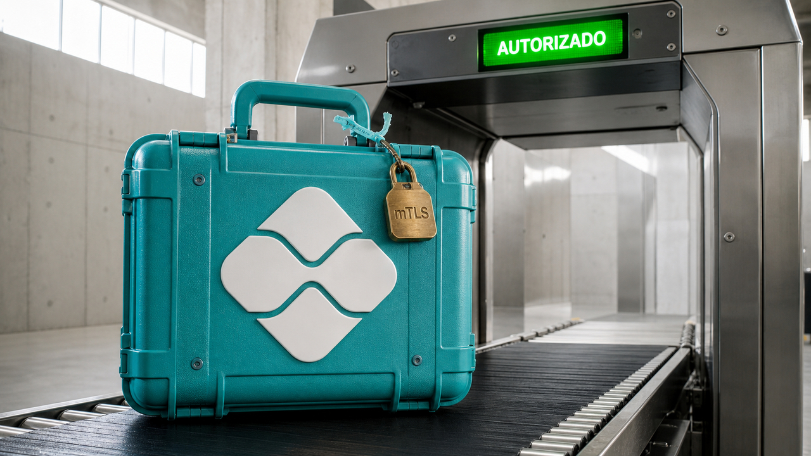

A pior requisição pode chegar com certificado válido, pela rota certa e usando uma conta que a API aprendeu a respeitar. O BREEZE COMET trabalha justamente para roubar esse pacote de autoridade dentro da infraestrutura brasileira de pagamentos. Quando consegue, o sistema autentica muito bem a pessoa errada. Uma beleza de desastre.

A mesma confusão entre confiança e prova aparece no restante do dia, em escalas diferentes. Um endpoint “gratuito” recebeu o contexto inteiro de um coding agent. O log de outro agente registrou a tentativa, mas não o resultado no sistema de negócio. E nove anos de regras do SigmaHQ mostraram que abrir uma exceção é fácil; lembrar de fechá-la já virou outra profissão.

## BREEZE COMET rouba a autoridade que o Pix confia

O Google Threat Intelligence Group e a Mandiant publicaram em 1º de setembro uma investigação sobre o BREEZE COMET, grupo financeiramente motivado acompanhado em atividade de 2024 a 2026. Segundo o relatório, ele compromete organizações autorizadas a operar Pix, STR e Boleto para alcançar tudo que uma transferência fraudulenta precisa para parecer legítima.

A operação depende de acesso à Rede do Sistema Financeiro Nacional, a RSFN, credenciais mTLS, contas persistentes e conhecimento do fluxo antifraude da vítima. O mTLS prova que o cliente tem a chave privada ligada a um certificado aceito. Se o invasor leva certificado, chave, conta e caminho de rede, a API pode receber a chamada como autorizada. A catraca funcionou. Levaram o crachá, a biometria e o mapa do prédio.

É por isso que pipelines de CI/CD e ambientes de nuvem entram na busca. Variáveis, arquivos e identidades temporárias do pipeline costumam alcançar APIs que a estação do desenvolvedor nem enxerga. A investigação encontrou buscas por termos relacionados a Pix e remessa, pods Kubernetes maliciosos e o COBALTSPIN, um túnel escrito em Rust. Ele abre um canal WebSocket de dentro para fora e entrega um proxy SOCKS5 reverso. Assim, o operador atravessa a segmentação sem deixar um listener convencional exposto.

Entre os indicadores descritos estão o paste site `dontpad[.]com`, associado à exfiltração por pods, e a URL defangada `hxxps://procon[.]go[.]gov[.]br/ComprovantePDF[.]exe`, um endereço governamental comprometido usado para staging. A lista completa está na fonte.

Em um dos casos, a Mandiant relata que o grupo levou de 24 a 48 horas entre o acesso às aplicações financeiras e duas ondas com centenas de transações fraudulentas. O relatório também atribui ao grupo ao menos um roubo de dezenas de milhares de dólares. As vítimas e os dados forenses não são públicos. Esses números vêm da apuração da Mandiant, apoiada em relato de cliente e análise forense de terceiro.

A Mandiant também avalia que alguns scripts recuperados indicam uso de LLMs. É um detalhe lateral da história. O avanço dependeu da combinação muito menos futurista de credenciais, privilégios, conectividade e conhecimento operacional legítimos. A IA pode até aparecer no roteiro; quem abriu as portas foi a velha autoridade roubada.

Para fintechs, bancos, processadores, varejistas, exchanges, fornecedores de software bancário e órgãos públicos, pipeline, nuvem, certificado transacional, rede da filial e saída dos workloads fazem parte da mesma fronteira. O relatório recomenda 802.1X nas filiais, controle de aplicação, MFA resistente a phishing, logs de PowerShell, segmentação, políticas de egress no Kubernetes, cofre central de segredos e acesso administrativo por jump hosts. É uma lista comprida porque o atacante também não respeita a divisão bonitinha do organograma.

Fonte: [Google Cloud Threat Intelligence — “Financially Motivated Threat Actor BREEZE COMET Targets Brazil”](https://cloud.google.com/blog/topics/threat-intelligence/financially-motivated-threat-actor-breeze-comet-targets-brazil/).

## A URL gratuita do modelo recebeu a sessão inteira

Em 30 de agosto, um honeypot de inferência exposto na internet recebeu uma sessão real do OpenCode rodando em Windows. Antes disso, o endpoint havia sido indexado, sondado por um health checker e renomeado com aliases de modelos procurados por usuários. As chamadas traziam até o token literal `Authorization: Bearer free`. Renato Marinho, operador do honeypot, considera esse padrão compatível com um pool montado a partir de endpoints encontrados por scanner.

Em 91 segundos, a sessão enviou 210 vezes um corpo de 224 KB. Dentro dele estavam 88 mensagens, diretórios, saídas do filesystem e o manifesto de 11 ferramentas. O endpoint só precisou estar configurado como `baseURL`. O cliente entregou o resto de bandeja.

Marinho não identificou quem mantinha o suposto pool nem o que o usuário sabia sobre o backend. A cadeia de distribuição é uma inferência apoiada no padrão observado, não uma atribuição fechada. Também não houve chamada maliciosa de ferramenta nem evidência de execução arbitrária pelo operador do honeypot. O que a sessão demonstrou foi a exposição dos dados.

O próximo risco vem do próprio protocolo. Uma API compatível com a da OpenAI pode devolver `tool_calls`, e um cliente permissivo transforma essa resposta remota em pedido de leitura, escrita ou shell local. A documentação atual do OpenCode permite `read` por padrão, pede confirmação para `external_directory` e `doom_loop` e diz que `--auto` aprova tudo que não estiver explicitamente negado. Essa documentação pode não reproduzir exatamente o comportamento da build `opencode/0.2.0` vista na sessão.

Na prática, a URL do modelo faz parte do control plane do agente. Confira operador e TLS, limite `read`, `write` e `bash`, deixe aprovação automática longe de backends não confiáveis e rotacione qualquer segredo que possa ter entrado no contexto. Trocar a URL interrompe o próximo envio. As 88 mensagens anteriores continuam lá, porque a internet ainda não ganhou Ctrl+Z.

Fontes: [SANS Internet Storm Center — “The Coding-Agent Trap”](https://isc.sans.edu/diary/33298) e [documentação de permissões do OpenCode](https://opencode.ai/docs/permissions/).

## O log prova a tentativa; o commit prova a mudança

Um agente chama `approve_claim()` e o trace registra sucesso. Aí sobra uma pergunta pequena e bastante inconveniente: o pedido mudou mesmo de estado no sistema que manda?

Vibhor Kumar propõe separar evidência operacional de evidência de negócio. O trace conta o que o agente tentou, com parâmetros, resposta e falhas. O sistema autoritativo conta se a entidade realmente mudou. Misturar os dois produz aquele tipo sofisticado de mentira em que o dashboard está verde e o cliente continua sem reembolso.

No PostgreSQL, a mudança e sua evidência local podem entrar na mesma transação. O fluxo executa o `UPDATE`, pega a linha alterada com `RETURNING` e só então insere o registro de evidência correlacionado. Se o `UPDATE` não produzir uma linha ou a transação receber `ROLLBACK`, nem a aprovação nem o registro afetam o banco. A garantia de tudo-ou-nada liga a prova ao estado comprometido, em vez de ligá-la à boa intenção do agente.

O `execution_id` acompanha execução, entidade, política e evidência. Ele também mantém a história unida quando a consequência atravessa a fronteira do banco. O PostgreSQL local prova o que aconteceu ali. Um processador de pagamentos externo precisa registrar a própria transição e preservar a mesma correlação para provar que moveu o dinheiro.

O transactional outbox cobre o intervalo entre o commit local e a publicação do evento. A aplicação grava a mensagem na mesma transação da mudança, e um relay publica depois, sem exigir uma transação distribuída entre banco e broker. O relay pode entregar mais de uma vez, e o provedor externo continua fora da atomicidade local. Idempotency key e deduplicação precisam fazer parte do contrato. Em sistema assíncrono, “tentei uma vez” e “aconteceu uma vez” moram em casas diferentes.

Fontes: [Vibhor Kumar — “When AI Takes Action, What Proves What Actually Happened?”](https://vibhorkumar.wordpress.com/2026/09/01/when-ai-takes-action-what-proves-what-actually-happened/), [documentação de transações do PostgreSQL 18](https://www.postgresql.org/docs/current/tutorial-transactions.html) e [Transactional Outbox, por Chris Richardson](https://microservices.io/patterns/data/transactional-outbox.html).

## As exceções do SigmaHQ só apertaram o ratchet

Uma regra de detecção começa barulhenta. Alguém adiciona uma exclusão para calar o falso positivo, o alerta some e leva junto boa parte da pressão para revisar aquela exceção. O preprint “The Exclusion Ratchet” mediu esse efeito em nove anos de mudanças do SigmaHQ.

Em 8.234 revisões que alteraram predicados, o detector dos autores encontrou 1.642 suppressions, que reduzem cobertura, e 304 relaxations, que retiram restrições. A conta dá 5,4 para 1. Pela estimativa do estudo, 86,7% das exclusões ainda estavam presentes depois de três anos.

O diff comum também deixa passar mudanças importantes. Em 503 das 1.642 suppressions, ou 31%, alguém apenas acrescentou um valor a uma exclusão existente sem mudar a estrutura da expressão. A árvore lógica parece igual. A janela ficou maior.

E várias dessas janelas são baratas de imitar. Entre 5.336 literais de caminho analisados, 64,1% podiam ser satisfeitos por um processo sem privilégio escolhendo o nome do arquivo. Outros 33% exigiam escrita em diretório protegido. O estudo não demonstrou exploração real, mas deu uma boa régua para a fila de revisão: uma exceção que o invasor reproduz escolhendo um filename merece bem menos confiança que outra dependente de controle privilegiado.

Esses números pertencem ao preprint e ao corpus público upstream, não a um SOC específico em produção. Na validação manual cega, o detector atingiu precisão de 0,828 e recall estimado de 0,911. Mesmo ali, 22,5% de uma amostra de 120 itens ficaram indecidíveis olhando apenas o diff. Os pesquisadores também não observaram atacantes explorando as exclusões.

A política prática é bem menos acadêmica: toda exclusão precisa de dono, justificativa, expiração e teste de regressão. Na hora de priorizar a revisão, conte quanto alerta ela suprime e quanto custa para um invasor imitá-la. O filtro já toma uma decisão de segurança. Só estava fazendo isso quietinho.

Fonte: [“The Exclusion Ratchet” (arXiv:2608.31062v1)](https://arxiv.org/html/2608.31062v1).

## DoltLite coloca branch e merge dentro do banco embedded

O DoltHub declarou o DoltLite 0.50.0 Beta em 31 de agosto. O fork mantém o parser, o analyzer, a API e o harness do SQLite acima da camada de B-tree. Embaixo, o armazenamento vira uma Prolly Tree endereçada por conteúdo. É ela que permite comparar e mesclar os estados do banco como versões.

Na interface aparecem branch, merge, diff, rebase, cherry-pick, reset, push, pull, clone e fetch. Para uma aplicação embedded, histórico e sincronização passam a morar no próprio banco. A compatibilidade com SQLite tem limites concretos: `rowid`, páginas, WAL e arquivos laterais de journal divergem ou não existem da mesma forma. O formato é estável e a versão está em Beta; a arquitetura ainda pede migração consciente, não uma troca transparente de binário.

Nos testes do próprio projeto, o DoltLite passou 100% de 5,8 milhões de queries do `sqllogictest` e 99,46% de 892.277 testes TCL, com 4.809 divergências conhecidas. Ainda faltam reprodução independente e histórico amplo em produção para colocar esses números em perspectiva.

O relatório noturno de 31 de agosto encontrou paridade agregada com SQLite nas leituras file-backed. Escritas agrupadas ficaram 1,1 vez mais lentas. Com cada escrita em autocommit, a diferença subiu para 3,1 vezes. O mecanismo ajuda a explicar a conta: alterações agrupadas dividem o custo fixo do commit versionado; no autocommit, cada escrita paga o imposto inteiro no caixa.

A release 0.50.0 diz que o código é o mesmo da 0.11.57; o salto de versão marca a chegada ao Beta. O mantenedor também atribui cerca de 2.000 PRs do desenvolvimento ao orquestrador Gas Town. Essa contagem descreve o processo de produção do código. A qualidade de cada mudança continua dependendo de revisão e teste. Antes de adotar, rode o workload real da aplicação, principalmente se ele faz muitas escritas pequenas ou encosta em detalhes físicos do SQLite.

Fontes: [DoltHub — “DoltLite Beta”](https://www.dolthub.com/blog/2026-08-31-doltlite-beta/), [relatório de performance do DoltLite](https://raw.githubusercontent.com/dolthub/doltlite/master/performance-report.md) e [release 0.50.0](https://github.com/dolthub/doltlite/releases/tag/v0.50.0).

## Destaques rápidos para hoje.

- **Traefik corrigiu o timeout que não alcançava HTTP/3.** O `respondingTimeouts.readTimeout`, de 60 segundos por padrão, cobria o socket TCP usado por HTTP/1.1 e HTTP/2, enquanto os streams QUIC ficavam fora. No reproducer, o controle encerrou em 59,99 segundos; HTTP/3 segurou o upstream por 92,94 segundos. As faixas afetadas são 2.8.2 a 2.11.55 e 3.0.0 a 3.7.11. As correções estão na 2.11.56 e na 3.7.12. O GHSA classifica o impacto como médio e restrito à disponibilidade, sem efeito atribuído à confidencialidade ou à integridade. Fontes: [GHSA-7ghq-v6jf-g56c](https://github.com/traefik/traefik/security/advisories/GHSA-7ghq-v6jf-g56c) e [Bishop Fox](https://bishopfox.com/blog/traefik-version-through-3-7-11).

- **Harden-Runner passou a observar GitHub Actions hospedados no AWS CodeBuild.** Em EC2 com imagem gerenciada, o suporte começa na v2.20.1. Containers Linux com imagem customizada pedem v2.21.0, host Amazon Linux 2023 com kernel 6 e privileged mode. O agente liga eventos de rede, processos e arquivos ao step do workflow, uma visibilidade útil quando o job recebe IAM role e alcance de VPC. AWS Lambda compute fica fora do suporte. E privileged mode aumenta o privilégio do ambiente; a proteção vem da telemetria e das políticas, não desse modo. Fonte: [StepSecurity](https://www.stepsecurity.io/blog/runtime-security-for-aws-codebuild-hosted-github-actions-runners).

- **A deny-list do Harden-Runner bloqueia destinos sem fechar o restante da saída.** Na Action v2.21.0, Self-Hosted VM v1.9.0 e ARC v2.19.0 via Policy Store, `denied-endpoints` aceita domínio, wildcard e IP, remove qualquer porta informada e bloqueia o destino em todas elas. Dá para forçar gerenciadores de pacote a usar o proxy conhecido. O restante do egress continua aberto por padrão, inclusive destinos novos e domínios legítimos usados para exfiltração. É um degrau enquanto a allow-list completa não vem. Fonte: [StepSecurity](https://www.stepsecurity.io/blog/introducing-deny-list-egress-policies-for-harden-runner).

- **Kubernetes 1.37 habilitou Storage Version Migration por padrão.** A API `storagemigration.k8s.io/v1` chegou a GA. Ao criar um `StorageVersionMigration`, o controller regrava os objetos na storage version atual e marca `Succeeded=True`. Isso alcança o estoque antigo que uma troca de schema ou rotação da chave de criptografia, sozinha, deixa quieto. Se a CRD mudar durante a operação e `.status.storedVersions` ficar desatualizado, repita a migração antes de remover a versão antiga. Fonte: [Kubernetes SIG API Machinery](https://kubernetes.io/blog/2026/08/31/kubernetes-v1-37-storage-version-migration-ga/).

- **Tailcat abriu WireGuard e NAT traversal sem o control plane da Tailscale.** O pacote Go e a CLI no estilo netcat conectam dois peers, tentam WireGuard por UDP e recorrem ao DERP como rendezvous ou fallback quando a travessia de NAT falha. Tudo isso sem conta, TUN ou alteração da tabela de rotas. O servidor gera um endereço `tc` com a chave e os dados codificados, e a autorização adicional por chave pública é opcional. O projeto não tem usuários, admins ou ACLs; os DERPs da Tailscale destinados ao Tailcat também têm região e banda limitadas. Fonte: [Tailscale](https://tailscale.com/blog/tailcat).

- **uutils Coreutils 0.11.0 passou a apontar o caractere que quebrou o argumento.** Os diagnósticos com Ariadne repetem a entrada e marcam o ponto ruim com um caret. Os artefatos de Linux, macOS e Windows também ganharam PGO. O projeto reporta até 31% de ganho nos próprios benchmarks e, depois de 358 PRs no ciclo, 653 testes GNU passando, 23 falhando e nenhum erro do harness. O “até 31%” varia por utility, e os 23 testes restantes ainda precisam entrar na validação de quem pretende substituir GNU Coreutils. Fonte: [release do uutils Coreutils 0.11.0](https://github.com/uutils/coreutils/releases/tag/0.11.0).

- **KDE Linux ativou snapshots automáticos da home e restauração pelo Dolphin.** Os diretórios pessoais viraram subvolumes Btrfs, e o `kio-snapshot` mostra versões anteriores no gerenciador de arquivos. É um belo Ctrl+Z para deleção e mudança destrutiva, enquanto o projeto diz estar a 85% do milestone Beta. Como os snapshots ficam no mesmo disco, backup externo continua cuidando de falha física, perda e roubo. Fonte: [KDE Linux](https://blogs.kde.org/2026/08/31/this-month-in-kde-linux-august-2026/).

- **BigQuery Graph chegou a GA com GQL ao lado de SQL.** Nodes e edges são mapeados sobre tabelas existentes, então dá para fazer traversals e integrar com BigQuery ML e AI sem exportar os dados para outro banco, mantendo os controles de linha e coluna do warehouse. O Google reporta ganho de 2 vezes em path finding e 100 vezes em undirected traversal desde o preview. São benchmarks do próprio fornecedor e dependem da carga medida. Parte do ecossistema agentic e cross-cloud descrito no anúncio ainda está em preview ou rollout. Fonte: [Google Cloud](https://cloud.google.com/blog/products/data-analytics/bigquery-graph-connecting-data-and-ai-at-scale/).

- **Compose Multiplatform 1.12.0 deixou o agente olhar a UI em execução.** O Compose Hot Reload ganhou um servidor MCP experimental para recarregar o app, capturar screenshot, inspecionar a árvore semântica, simular clique e texto e ler logs. Agora o agente consegue comparar código com comportamento em runtime. A JetBrains não publicou benchmark de acerto, e os testes de aceitação continuam responsáveis por dizer se o resultado está certo. Fonte: [Kotlin Blog](https://blog.jetbrains.com/kotlin/2026/08/compose-multiplatform-1-12-0/).

- **Executar testes foi a superfície silenciosa do benchmark CIPR.** O preprint reuniu 1.920 instâncias em 20 repositórios, variando quatro tipos de tarefa, três estilos de prompt e três condições de skills ou rules. A taxa de ataque mudou em até 4,5 vezes, e as tarefas de teste combinaram sucesso alto com poucos alertas. `npm test` e `pytest` podem disparar hooks, fixtures, scripts e binários controlados pelo repositório. Rode código de terceiro em sandbox, sem segredos e com o egress sob controle. Todos os experimentos usaram automação irrestrita e exfiltração simulada; aprovação humana, MCP e políticas de ferramentas ficaram fora do estudo. Fonte: [“Beyond the Payload” (arXiv:2608.30686v1)](https://arxiv.org/html/2608.30686v1).

- **Um system prompt mudou jailbreak de 2% para 58% no mesmo recorte.** Com modelo e ataque fixos, os pesquisadores alteraram apenas o estado induzido pelo system prompt. O maior salto citado ocorreu no Llama-2-7B, dentro de um estudo com sete modelos, três ataques e cinco personas Big Five. Também houve movimento na direção inversa, e nenhuma persona se mostrou universalmente segura ou insegura. É um preprint baseado em estados artificiais, sem histórico longo, tool use ou personalização real. Ainda assim, o resultado pede que a avaliação use a configuração implantada, em vez do modelo vanilla. Fonte: [“The Fragility of Jailbreak Robustness Across Operational States”](https://arxiv.org/html/2608.30748v1).

- **Schwarz transformou falha opaca do solver em reparo local para o agente.** O harness expõe snapshots, lemmas e políticas por teoria. O LLM propõe a prova; um checker determinístico decide a validade. Os autores reportam 95,2% em 475 benchmarks agentic e 91,5% nas 1.000 tarefas ReachSafety do SV-COMP 2026, contra 60,1% do CPAchecker. O preprint ainda não teve reprodução independente: rodou com Codex CLI 0.130.0 e GPT-5.5 xhigh, timeout de até quatro horas e um protótipo limitado em floating point, bibliotecas, layout de C e provas longas. Fonte: [“Schwarz: Solver-Aware Agentic Program Verification”](https://arxiv.org/html/2608.30803v1).

- **SkillZip Pro economizou tokens até a compressão mastigar a regra importante.** Na implantação de moderação relatada, a configuração final reduziu o bundle em 38,1% e o consumo por run em 10,4%, medidos em 200 auditorias pareadas. Sem classes de proteção, versões agressivas derrubaram a acurácia de 88% para 70% ou 62%. Antes de uma correção, o extrator lexical em inglês protegeu só 7 de 264 unidades numa implantação em chinês. O resultado vem de um preprint e de um único caso. Exceções, obrigações e formato de saída precisam ficar bloqueados ou cobertos por witness verificável, senão a economia come a instrução que pagava a conta. Fonte: [“SkillZip Pro”](https://arxiv.org/html/2608.30785v1).

- **Pós-treinamento de LLM virou manutenção brownfield do conjunto de dados.** Com orçamento fixo, dado novo desloca rehearsal antigo. O estudo mede supervisão aceita, regressão e custo do patch, em vez de contar apenas o volume produzido pelo teacher. Num caso interno de geração de código, mudanças de yield elevaram a supervisão aceita em 2,84 vezes e o pass@1 em 2,59 pontos no CodeForces e 6,11 no LiveCodeBench v6, com 16 avaliações por benchmark. O recorte usa um checkpoint interno de 7B, um patch controlado de 3.412 exemplos e benchmarks de 65 e 175 tarefas. Teacher, mistura e limite de tokens não foram divulgados; o filtro de sintaxe Python também não prova correção semântica. Fonte: [“LLM Post-Training as Brownfield Maintenance”](https://arxiv.org/html/2608.31102v1).

- **Um tradutor de KV cache reaproveitou contexto entre modelos diferentes.** No experimento, uma camada converteu o estado de atenção até entre famílias e tokenizers distintos. De Llama-3.1-70B para Qwen2.5-7B, entregou 44,0% de acurácia contra 45,7% nativa e latência de 138 ms contra 899 ms. De Qwen2.5-1.5B para Gemma-2-2B, reduziu o prefill em até 67,05% com contexto de 4K. A ideia poupa o reprocessamento do prompt quando o sistema troca de modelo. Por enquanto, é evidência inicial de preprint, sem generalização demonstrada para outras arquiteturas, cargas, comprimentos e ambientes. Fonte: [“A Universal Context-Reuse Layer for Cross-Model KV Sharing”](https://arxiv.org/html/2608.30963v1).

- **Um patch do Linux prefere o mesmo sibling nos cores NVIDIA Olympus.** A série usa `SD_ASYM_PACKING` para escolher PE0 quando os dois processing elements estão livres, evitando oscilações que mantêm decode, issue, cache, TLB e vetores particionados no modo de duas threads. Andrea Righi, da NVIDIA, reporta que um GEMM single-precision com 88 threads subiu de cerca de 9,4 para 10,1 TFLOP/s num Vera de dois nós. Os dois patches continuam em revisão, e a medição vem de um sistema. PE0 e PE1 têm a mesma capacidade estável; a preferência evita a alternância cara, não escolhe uma CPU magicamente mais rápida. Fonte: [Linux kernel mailing list](https://lore-kernel.gnuweeb.org/all/apX1j6srdTcFLZOd%40gpd4/T/).

- **Gradium tornou um novo TTS o padrão e publicou 216 ms até o primeiro áudio.** O conjunto aberto de casos difíceis tem 500 frases, cem por idioma em inglês, alemão, francês, espanhol e português. A empresa reporta 81% de aprovação, e a mediana de TTFA ficou em 216 ms em 480 runs medidos pela Coval. Números, emails, IBANs e códigos separam velocidade de leitura correta: perder um dígito estraga a tarefa mesmo quando a voz responde voando. O benchmark é do fornecedor, usa um conjunto representativo da própria base e varia com região, defaults, julgamento humano e ponto de medição. Fonte: [Gradium](https://gradium.ai/blog/gradium-tts-latency-and-accuracy).

> Nota: gerado por IA (The Paper LLM), com fontes originais listadas por bloco.

<!--
briefing_id: 26456
source_urls:
  - https://cloud.google.com/blog/topics/threat-intelligence/financially-motivated-threat-actor-breeze-comet-targets-brazil/
  - https://isc.sans.edu/diary/33298
  - https://opencode.ai/docs/permissions/
  - https://vibhorkumar.wordpress.com/2026/09/01/when-ai-takes-action-what-proves-what-actually-happened/
  - https://www.postgresql.org/docs/current/tutorial-transactions.html
  - https://microservices.io/patterns/data/transactional-outbox.html
  - https://arxiv.org/html/2608.31062v1
  - https://www.dolthub.com/blog/2026-08-31-doltlite-beta/
  - https://raw.githubusercontent.com/dolthub/doltlite/master/performance-report.md
  - https://github.com/dolthub/doltlite/releases/tag/v0.50.0
  - https://github.com/traefik/traefik/security/advisories/GHSA-7ghq-v6jf-g56c
  - https://bishopfox.com/blog/traefik-version-through-3-7-11
  - https://www.stepsecurity.io/blog/runtime-security-for-aws-codebuild-hosted-github-actions-runners
  - https://www.stepsecurity.io/blog/introducing-deny-list-egress-policies-for-harden-runner
  - https://kubernetes.io/blog/2026/08/31/kubernetes-v1-37-storage-version-migration-ga/
  - https://tailscale.com/blog/tailcat
  - https://github.com/uutils/coreutils/releases/tag/0.11.0
  - https://blogs.kde.org/2026/08/31/this-month-in-kde-linux-august-2026/
  - https://cloud.google.com/blog/products/data-analytics/bigquery-graph-connecting-data-and-ai-at-scale/
  - https://blog.jetbrains.com/kotlin/2026/08/compose-multiplatform-1-12-0/
  - https://arxiv.org/html/2608.30686v1
  - https://arxiv.org/html/2608.30748v1
  - https://arxiv.org/html/2608.30803v1
  - https://arxiv.org/html/2608.30785v1
  - https://arxiv.org/html/2608.31102v1
  - https://arxiv.org/html/2608.30963v1
  - https://lore-kernel.gnuweeb.org/all/apX1j6srdTcFLZOd%40gpd4/T/
  - https://gradium.ai/blog/gradium-tts-latency-and-accuracy
-->
