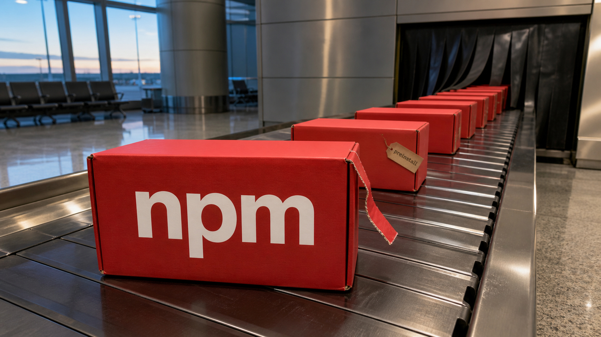

Instalar uma dependência ainda parece uma operação local: o pacote entra, o build roda e a vida segue. O ChainDrop mostra o tamanho real dessa confiança. O código executado durante a instalação pode alcançar credenciais da estação, assumir pacotes do mantenedor e chegar ao CI, onde tokens, identidade e artefatos ficam todos na mesma mesa.

A Microsoft documentou mais de 400 pacotes npm comprometidos nessa campanha. As outras notícias de hoje continuam perto da mesma pergunta, mesmo quando mudam de assunto: quanto um sistema consegue executar, repetir e mandar para revisão antes que alguém perceba o custo escondido?

## ChainDrop transforma a instalação em caminho de propagação

A Microsoft Threat Intelligence publicou em 4 de agosto a anatomia do ChainDrop. Segundo a empresa, a campanha inseriu um script malicioso de `preinstall` em mais de 400 pacotes npm de publicadores sem relação entre si. O script roda antes de a instalação terminar, carrega com Bun um payload JavaScript ofuscado e procura credenciais de npm, GitHub, AWS, Kubernetes, Vault, SSH e outros serviços.

Bun foi o runtime usado pelo código da campanha, não a causa do problema. E um script de lifecycle, sozinho, também não prova comprometimento. O risco está no acesso que esse código herda ao rodar dentro da máquina do desenvolvedor ou do runner.

Com as credenciais npm roubadas, o ChainDrop tenta assumir outros pacotes do mesmo mantenedor, inserir a carga e republicá-los. Assim, a propagação deixa de depender de uma única biblioteca popular: cada conta alcançada abre outro conjunto de pacotes. A StepSecurity encontrou a mesma estrutura geral, com `preinstall`, Bun, um segundo estágio ofuscado de aproximadamente 710 KB, coleta de credenciais e comunicação de comando e controle por um dead drop em Ethereum.

O alcance passa do registry. A Microsoft descreve atividade em GitHub Actions e tentativas de persistência nas configurações de ferramentas de desenvolvimento, incluindo Claude e VS Code. Em CI, um script de dependência pode tocar tokens, identidade OIDC, cache e artefatos. A fronteira entre "baixar código" e "deixar código entrar no pipeline" desaparece bem na nossa frente, sem nem pedir crachá.

O Paper LLM já havia acompanhado o [Mini Shai-Hulud entrando pelo CI](/2026/o-worm-do-npm-entrou-pelo-ci-claude-ganhou-porta-na-aws-e-voz-virou-arquitetura/). O relatório de 4 de agosto amplia bastante aquele retrato: agora há o nome ChainDrop, mais de 400 pacotes de publicadores diferentes, o escopo das credenciais procuradas e uma orientação completa para depois da execução.

Essa orientação merece atenção. Se uma versão afetada rodou, remover o pacote ou corrigir o lockfile não é suficiente para considerar o ambiente limpo. A Microsoft recomenda tratar a estação ou o runner como comprometido, rotacionar os segredos a partir de uma máquina limpa e reconstruir sistemas e artefatos usando entradas confiáveis.

Para reduzir a exposição, dá para limitar scripts de lifecycle, diminuir o uso de tokens duradouros, fixar versões conhecidas e desconfiar de releases sem commit, tag ou pull request correspondente. Provenance ajuda a confirmar como um artefato foi produzido. Só não garante que o workflow ou o ambiente produtor estivessem limpos.

A campanha continua ativa, então a lista e a contagem podem mudar. Os mais de 400 pacotes são a fotografia publicada pela Microsoft, não uma indicação de que todo o npm ou qualquer instalação de Bun esteja infectada.

Fontes: [Microsoft Threat Intelligence](https://www.microsoft.com/en-us/security/blog/2026/08/04/chaindrop-supply-chain-compromise-anatomy-self-propagating-worm/) e [StepSecurity](https://www.stepsecurity.io/blog/chaindrop-npm-worm).

## Salvar o estado não salva o efeito

Um agente grava um checkpoint, chama uma API para cobrar um cliente e cai antes de registrar que a cobrança terminou. Na retomada, lê o estado anterior e chama a API de novo. O fluxo voltou exatamente ao ponto salvo. O cartão, infelizmente, não voltou no tempo com ele.

O preprint “Resume Means Resume” tenta transformar esse problema em um contrato verificável. Ele define condições para execução de efeitos, forks, validade de checkpoints, consumo de interrupções e recuperação determinística. Depois aplica probes, sem depender de respostas aleatórias de modelos, a versões fixadas de cinco frameworks: LangGraph 1.2.9, LlamaIndex Workflows 2.22.2, CrewAI 1.15.2, pydantic-graph 1.107.1 e AutoGen.

A distinção é simples, mas fácil de esquecer. Serializar o estado diz de onde o fluxo deve continuar. Isso não desfaz uma escrita no banco, uma mensagem enviada ou uma chamada externa que já respondeu. Se o processo cai entre produzir o efeito e registrar sua conclusão, a recuperação pode repetir esse efeito.

Nos testes descritos, o autor reporta violação silenciosa das regras de fork e validade no LangGraph 1.2.9, replay que não aparece no estado do CrewAI 1.15.2, divergência em relação ao comportamento documentado no LlamaIndex e incapacidade do pydantic-graph 1.107.1 de recuperar o crash intermediário usado no probe.

Esses resultados são específicos às versões, configurações e testes descritos. O trabalho é um preprint de um único autor, e a implementação chamada Remit, junto de parte do artefato de reprodução, continua privada até a publicação. Isso limita a verificação independente por enquanto e também impede tratar os resultados como um veredito permanente sobre os projetos.

A consequência arquitetural independe do framework. Se o agente escreve, cobra, publica ou envia, checkpoint não pode fazer o papel de transação. O efeito externo precisa de proteção própria: chave de idempotência, ledger durável, outbox transacional ou compensação desenhada para replay e crash. Sem isso, a recuperação pode ser perfeitamente determinística e ainda fazer a coisa errada duas vezes.

Fonte: [“Resume Means Resume” no arXiv](https://arxiv.org/html/2608.03836v1).

## Rust adota política de LLM e cobra autoria humana

Cinco equipes do projeto Rust adotaram uma política para contribuições assistidas por LLM no monorepo `rust-lang/rust`. O anúncio saiu em 5 de agosto. O escopo é esse repositório, não o projeto Rust inteiro, e a política também não declara uma posição geral contra modelos.

A regra exige que a pessoa assuma a autoria, entenda o código enviado e consiga participar da discussão sobre ele. Também tenta evitar uma dinâmica que qualquer mantenedor reconhece rápido: alguém copia o comentário da revisão para o modelo, cola a resposta de volta e vira apenas um proxy humano entre duas pontas que não carregam a responsabilidade pelo patch.

O Rust aponta três problemas. Os sinais tradicionais de esforço e entendimento ficaram menos confiáveis; a geração em volume piora uma capacidade de revisão que já é limitada; e retransmitir respostas mecanicamente consome o tempo de quem mantém o projeto. O anúncio registrava 1.281 pull requests abertos, uma boa medida do tamanho da fila em que esses patches chegam.

Já havíamos falado da [proposta ainda aberta no Rust Forge](/2026/chaves-ssh-vazaram-pelo-kernel-shai-hulud-virou-molde-e-agentes-pediram-oficina/). Agora a decisão mudou de estado: cinco equipes anunciaram a adoção.

Para quem contribui, o recado é assumir o patch e demonstrar que o entende. Para equipes que recebem código, o caso expõe uma conta menos confortável: gerar mais mudanças sem aumentar revisão, testes e responsabilidade pode reduzir o throughput real. Código sintaticamente convincente ficou barato. Entender o desenho e cuidar das consequências continua no orçamento humano.

Fonte: [Inside Rust Blog](https://blog.rust-lang.org/inside-rust/2026/08/05/rust-langrust-is-adopting-an-llm-policy/).

## LLM 0.32 separa texto, raciocínio e ferramentas no terminal

Simon Willison lançou em 4 de agosto o LLM 0.32. A ferramenta de terminal ganhou suporte a traces de raciocínio, ferramentas hospedadas pelo provedor, OpenAI Responses API e uma interface Python que trata a resposta como uma sequência de eventos mistos.

Uma resposta moderna já não é apenas uma string. No mesmo fluxo podem chegar texto, raciocínio, chamadas de ferramenta e anexos. A nova API `stream_events()` expõe essas partes como eventos tipados, sem obrigar cada integração a inventar um parser para descobrir o que acabou de sair do modelo.

Na linha de comando, o raciocínio vai para stderr. O texto final continua em stdout e entra em pipes sem carregar todo o material intermediário. É uma decisão pequena com cheiro de Unix: cada canal mantém uma função, e o próximo comando não precisa separar conversa interna de saída útil usando fé e expressão regular.

O log em SQLite também passou a armazenar mensagens de forma content-addressable. Em vez de repetir conversas completas, o sistema identifica o conteúdo e reduz a duplicação no histórico. Um plugin separado, `llm-chat-completions-server`, expõe um endpoint compatível com a API da OpenAI.

Nesse caso, "compatível" descreve a interface, sem prometer paridade completa entre provedores, modelos ou ferramentas. Ainda assim, representar texto, tools, mídia e raciocínio como eventos descreve melhor o que um agente realmente produz.

Fonte: [Simon Willison — LLM 0.32](https://simonwillison.net/2026/Aug/4/new-release-of-llm/).

## WebKit encontra três saídas fora do proxy da aplicação

Configurar um proxy dentro do navegador parece uma ordem ampla: passe o tráfego por aqui. Uma pesquisa da Mysk, publicada em 4 de agosto, mostra três caminhos do WebKit que podem sair por outra camada e revelar o resolvedor DNS ou o IP real.

O primeiro é o DNS prefetch, que pode antecipar a resolução usando o serviço normal do sistema. O segundo aparece em WebAuthn Related Origin Requests, quando a requisição é delegada ao serviço de credenciais do sistema. O terceiro é o WebTransport, que pode abrir uma conexão HTTP/3 sobre QUIC diretamente com o servidor. Segundo os pesquisadores, os mesmos caminhos também alcançam o iCloud Private Relay.

Os três casos têm a mesma origem arquitetural. Um proxy configurado na aplicação só cobre as stacks que recebem essa configuração. Um serviço do sistema ou um transporte que abre a própria conexão pode usar outro socket. Já uma VPN de sistema opera abaixo dessas APIs e não foi afetada nos testes dos autores.

A divulgação veio da Mysk, fabricante do Psylo, um navegador baseado em WebKit e afetado pelo problema. O Psylo 1.3.1 passou a desativar WebAuthn e WebTransport por padrão, com reativação por site, ou “silo”. Seus usuários já têm essa mitigação, mas a página não cita resposta nem correção da Apple.

O resultado não vale automaticamente para qualquer configuração de WebKit, Tor ou VPN. O Onion Browser no nível Silver já bloqueava WebTransport, e uma VPN de sistema segue outro desenho. A consequência prática é específica: quem depende de proxy no nível da aplicação não pode presumir que todo recurso web atravessa a mesma camada de rede.

Fonte: [pesquisa da Mysk](https://mysk.blog/2026/08/04/webkit-proxy-icloud-private-relay-ip-leak/).

## Destaques rápidos para hoje

- A Fortinet analisou uma campanha Windows em que componentes adulterados do QuickFox usavam JavaScript no renderer Electron, loaders e DLL side-loading para instalar o implante FDMTP. A atividade observada remonta a agosto de 2025 e perfilava processos ligados a ferramentas empresariais, de desenvolvimento e cripto. JavaScript dentro de Electron é normal por si só; o sinal de risco está na cadeia formada por arquivo adulterado, download, loaders e comunicação de comando e controle. A página diz que os componentes foram removidos no QuickFox 3.59.6, mas sua seção de indicadores lista como afetadas versões maiores que 3.0.35 e menores que 3.55.6. Como a própria fonte traz números incompatíveis, o caminho seguro é instalar a versão atual, investigar execuções anteriores e revisar a telemetria e os segredos da máquina. A atualização remove o componente, mas não limpa retroativamente um host já comprometido. A atribuição ao Mustang Panda também é uma avaliação da Fortinet. Fonte: [Fortinet FortiGuard Labs](https://www.fortinet.com/blog/threat-research/quickfox-supply-chain-attack-used-to-deploy-fdmtp-implant).

- A Mistral lançou em 4 de agosto o Shieldstral, um classificador multimodal de segurança com 3 bilhões de parâmetros e pesos Apache 2.0. Ele recebe políticas em linguagem natural durante a inferência e avalia texto, imagem e combinações de prompt e resposta. Segundo a empresa, roda em uma GPU de 16 GB e alcança desempenho comparável ou superior ao de modelos até sete vezes maiores. Os benchmarks são do fornecedor, não uma garantia de segurança em produção. Para equipes, o atrativo é testar um moderador local e adaptável sem enviar todo o conteúdo a um serviço remoto. Falsos positivos, falsos negativos, políticas e idiomas ainda precisam ser avaliados no domínio real. Um classificador probabilístico pode aplicar e registrar uma política, mas não deve ser a única fronteira de autorização. Fonte: [Mistral AI](https://mistral.ai/news/shieldstral/).

- O preprint ReCite descreve um sistema para encontrar referências obsoletas a funções nos comentários do kernel Linux e propor reparos. Os autores reportam 869 ocorrências, 75 patches enviados upstream e 50 aceitos. Nesse número, "aceito" inclui mudanças na árvore de um mantenedor, não necessariamente presentes em todas as versões estáveis, e os dados vêm do próprio preprint. Mesmo com a ressalva, há algo interessante aqui: uma tarefa estreita, com patches pequenos e validação humana no fluxo real de manutenção, produziu mudanças que os mantenedores conseguiram revisar. É uma aplicação bem menos cinematográfica de IA e automação. Talvez por isso tenha conseguido entrar no kernel. Fonte: [“We Must Have Missed This Comment” / ReCite](https://arxiv.org/html/2608.03734v1).

> Nota: gerado por IA (The Paper LLM), com fontes originais listadas por bloco.

<!--
briefing_id: 27757
source_urls:
  - https://www.microsoft.com/en-us/security/blog/2026/08/04/chaindrop-supply-chain-compromise-anatomy-self-propagating-worm/
  - https://www.stepsecurity.io/blog/chaindrop-npm-worm
  - https://arxiv.org/html/2608.03836v1
  - https://blog.rust-lang.org/inside-rust/2026/08/05/rust-langrust-is-adopting-an-llm-policy/
  - https://simonwillison.net/2026/Aug/4/new-release-of-llm/
  - https://mysk.blog/2026/08/04/webkit-proxy-icloud-private-relay-ip-leak/
  - https://www.fortinet.com/blog/threat-research/quickfox-supply-chain-attack-used-to-deploy-fdmtp-implant
  - https://mistral.ai/news/shieldstral/
  - https://arxiv.org/html/2608.03734v1
-->
