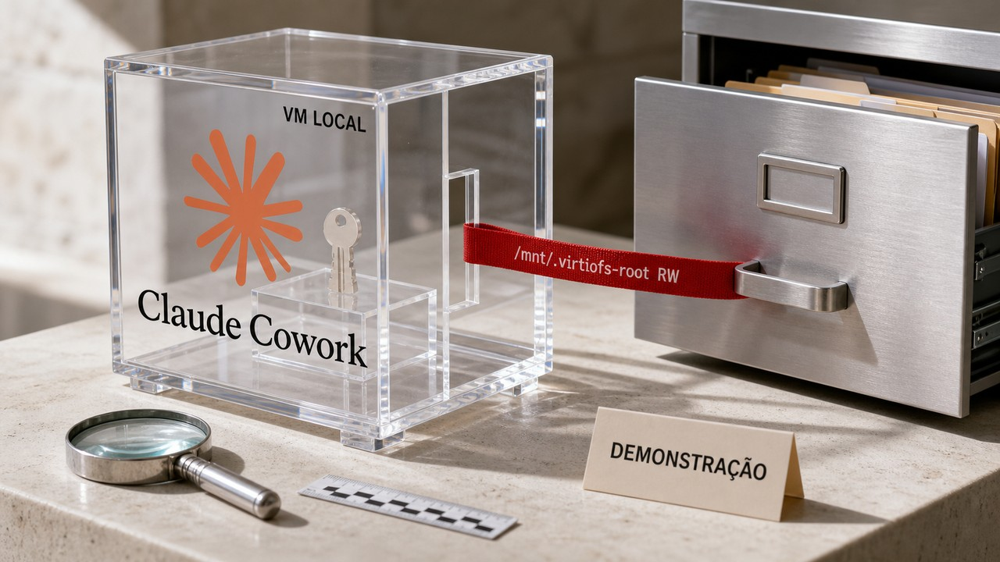

Conseguir root dentro de uma máquina virtual deveria ser o começo do limite de dano, não o fim da defesa. Numa demonstração publicada ontem, pesquisadores chegaram a root no ambiente local do Claude Cowork e encontraram o sistema de arquivos inteiro do macOS montado ali, com permissão de escrita. A parede continuava no diagrama, mas tinha uma porta larga para o host.

A história abre uma edição bem pé no chão sobre agentes. A Grab conta que levou uma tarde para montar o primeiro loop e cerca de duas semanas para construir tudo ao redor. A DigitalOcean mostra uma conta de inferência caindo depois que o prompt para de sabotar o próprio cache. São problemas diferentes, mas todos aparecem depois que a demo já funciona.

## SharedRoot transforma root na VM em acesso ao macOS

A Accomplish diz ter executado, de ponta a ponta, uma cadeia de fuga numa sessão local do Claude Cowork. O processo começou como usuário sem privilégio dentro da máquina virtual, explorou uma falha do kernel para chegar a root no guest e terminou lendo e escrevendo arquivos do host fora da pasta que o usuário havia conectado ao agente.

O primeiro passo usa um *user namespace*. Com esse recurso, um processo pode parecer root dentro de um namespace e receber capacidades ali sem se tornar root no host. Na demonstração, isso bastou para obter `CAP_NET_ADMIN` e alcançar uma parte do kernel que o ambiente nem precisava expor.

A cadeia ativou o módulo `act_pedit` e explorou a CVE-2026-46331. Segundo a Accomplish, a falha permitiu envenenar o *page cache* de um helper executado pelo `coworkd`, daemon que roda como root. O registro público da Ubuntu confirma a identidade da vulnerabilidade no kernel. Sozinho, ele não valida toda a cadeia específica do Claude Cowork.

Depois de obter root no guest, faltava descobrir se a VM realmente continha a falha. Não continha. O `/` inteiro do macOS estava compartilhado por VirtioFS em `/mnt/.virtiofs-root`, no modo leitura e escrita. VirtioFS é o mecanismo que apresenta arquivos do host à máquina virtual. Com todo o host visível dessa forma, guest-root ganha autoridade sobre muito mais que o diretório escolhido para a tarefa.

[No dia 19, falamos de namespaces, `seccomp` em allowlist e isolamento fail-closed](/2026/nsjail-blinda-codigo-de-terceiros-num-vps-e-o-harness-vira-a-peca-que-decide-o-agente/). Agora apareceu a consequência concreta de compor mal essas fronteiras numa VM: uma capacidade dentro do namespace abriu uma superfície desnecessária do kernel, e o mount transformou a escalada local em acesso ao host.

`seccomp` filtra chamadas de sistema. Quando a política deixa tudo passar por padrão, subsistemas sem função naquela tarefa continuam alcançáveis. Uma allowlist inverte a lógica e entrega ao processo apenas as chamadas necessárias. A mesma disciplina vale para namespaces, módulos e compartilhamentos. Os pesquisadores propõem quatro cuidados: restringir *user namespaces*, usar `seccomp` com bloqueio por padrão, impedir caminhos desnecessários de carregamento e execução de módulos e não montar o host inteiro no guest.

A regra prática é assumir que root na VM pode acontecer. Mesmo nesse cenário, o agente deveria encontrar poucos arquivos, de preferência somente para leitura, nenhuma credencial reaproveitável e uma superfície mínima de kernel. "Está numa VM" descreve um mecanismo. Não diz qual é o raio de dano.

O relato tem limites importantes. A demonstração e a leitura da arquitetura vêm da Accomplish, empresa que também oferece um produto concorrente. O pesquisador Oren Yomtov afirma ter reportado o caso à Anthropic e diz que o relatório foi encerrado como "Informative". A Anthropic não publicou, nas fontes abertas desta pesquisa, uma confirmação técnica de cada etapa. A Accomplish também diz que esse caminho local não parece atingir o modo cloud usado atualmente por padrão. Não há evidência apresentada de exploração em campo, e a CVE é uma falha do kernel, não "uma CVE do Claude".

Fontes: [Accomplish — SharedRoot; Escaping the Claude Cowork sandbox](https://www.accomplish.ai/blog/sharedroot-escaping-claude-cowork-sandbox/) e [Ubuntu Security — CVE-2026-46331](https://ubuntu.com/security/CVE-2026-46331).

## Na Grab, o loop levou uma tarde e a plataforma levou semanas

Um bot interno de suporte da Grab começou com uma tarefa comum: consultar sistemas da empresa, reunir contexto e responder a funcionários. Segundo a equipe, o loop de raciocínio ficou pronto em uma tarde. Autenticação, segredos, configuração, banco, tracing, probes e métricas consumiram cerca de duas semanas.

Essa diferença explica bastante sobre agentes em produção. Chamar um modelo, receber uma tool call e devolver o resultado é o miolo visível. O serviço ainda precisa saber quem fez o pedido, quais ferramentas aquela identidade pode usar, onde buscar segredos, como falhar sem criar um incidente e como alguém vai reconstruir o que aconteceu às três da manhã.

A Grab transformou esse trabalho no LLM-Kit, um framework que hoje atende mais de 500 serviços, segundo a própria empresa. A plataforma também declara mais de 50 servidores MCP registrados e um gateway central que processa bilhões de tokens por mês. Esses números não passaram por auditoria independente nesta pesquisa. Ainda assim, a arquitetura descrita traz decisões úteis até para uma equipe que nunca chegará perto dessa escala.

O scaffold combina FastAPI com dois loops em LangGraph, uma imagem *distroless*, gerenciamento de dependências com `uv`, segredos no Vault, telemetria com OpenTelemetry, health checks e clientes gRPC tipados. Nos exemplos, cada passo tem política de retry e timeout de 30 segundos. O endpoint de avaliação roda casos *golden*: entradas e resultados esperados versionados junto da aplicação.

ROUGE, BLEU e avaliações feitas por outro modelo aparecem como pontos de partida. Nenhuma dessas métricas prova sozinha que um agente é bom no trabalho real. Mesmo assim, colocar casos de avaliação no template muda a conversa. Qualidade deixa de ser uma impressão tirada do chat e passa a ter histórico, regressão e condição de release.

A observabilidade também precisa acompanhar o caminho inteiro, e não apenas linhas soltas de log. Um trace distribuído liga o pedido HTTP ao loop do agente, a cada chamada de ferramenta, à recuperação de contexto e à chamada ao modelo. Assim fica mais fácil descobrir se a lentidão veio do provedor, se a ferramenta retornou um dado ruim ou se o loop insistiu cinco vezes no caminho errado.

O gateway compatível com a API da OpenAI separa as aplicações do fornecedor de modelo. Escolha, fallback, orçamento e atribuição de custo ficam numa camada comum, sem obrigar cada serviço a reimplementar a troca. Os servidores MCP remotos, por sua vez, evitam embutir todas as integrações no processo do agente. A complexidade não some, claro. Ela muda de endereço e passa a exigir autenticação, autorização, disponibilidade e telemetria na rede.

[Na mesma edição de 19 de julho, chamamos esse entorno de *harness*](/2026/nsjail-blinda-codigo-de-terceiros-num-vps-e-o-harness-vira-a-peca-que-decide-o-agente/). O relato da Grab dá volume e componentes à ideia. Para uma equipe menor, a ordem talvez seja mais útil que a lista de tecnologias: primeiro um template reproduzível; identidade e segredos antes do deploy; traces atravessando modelo e ferramenta; avaliações versionadas; e uma camada para trocar de provedor sem reescrever cada aplicação.

Este é o primeiro texto de uma série da Grab. Gateway, MCP remoto e plataforma de avaliações ainda devem ganhar partes próprias. Por enquanto, temos o relato da empresa sobre seu ambiente, seus volumes e o tempo economizado. É um mapa de engenharia, não um benchmark universal nem uma receita para instalar sete serviços antes de conseguir o primeiro usuário.

Fonte: [Grab Tech — How Grab builds and runs AI agents at scale](https://engineering.grab.com/how-grab-builds-and-runs-ai-agents-at-scale).

## Um ID no começo do prompt pode inutilizar o cache inteiro

Prompt cache parece uma daquelas otimizações com uma caixa de seleção: ligar, receber o desconto e seguir a vida. O detalhe inconveniente é que o cache reaproveita um prefixo inicial idêntico. Se um identificador, timestamp ou nome de usuário muda cedo demais, a comparação para ali. Todo o conteúdo estável que vem depois precisa ser processado de novo.

O arranjo mais favorável coloca primeiro o que se repete: system prompt, schemas das ferramentas e exemplos. A cauda variável recebe ID da requisição, usuário, horário e consulta. Algumas APIs pedem um ponto explícito, como `cache_control`; outras fazem *prefix caching* automaticamente. Nos dois casos, você precisa conferir como o modelo e a API usados em produção se comportam.

A ProjectDiscovery relata que reorganizou os pontos de cache e moveu o contexto volátil. O hit rate subiu de 7% para 74%, enquanto o gasto mensal caiu 59%. Esse é um caso real da empresa, não uma promessa de que qualquer prompt receberá o mesmo desconto.

A DigitalOcean reproduziu o princípio em seu serviço serverless com Claude Haiku 4.5. O benchmark usou um prefixo de aproximadamente 6 mil tokens, 1.500 requisições por layout e três execuções. Depois de marcar o prefixo e tirar o campo variável do trecho estável, o hit rate foi de 0% para 99,3%. O custo estimado de entrada caiu de US$ 6,72 para US$ 0,57 por mil requisições.

É uma redução grande, nas condições declaradas pela empresa que opera o serviço medido. Outro modelo, fornecedor, tamanho mínimo de cache, TTL ou padrão de tráfego pode dar um resultado bem diferente. O mecanismo descrito no estilo das APIs da Anthropic oferece TTLs de cinco minutos e uma hora. Se o intervalo entre chamadas passa dessa janela, reorganizar os campos não ressuscita uma entrada que já expirou.

Também vale separar três nomes parecidos. O *prefix cache* reutiliza o estado computado de uma sequência inicial igual entre requisições. O KV cache mantém chaves e valores da atenção durante a geração. O cache semântico tenta encontrar consultas com significado próximo. Mover um ID resolve o primeiro tipo de desperdício. Não corrige tráfego esparso, prefixo curto ou conteúdo que varia sem a equipe perceber.

Medir apenas latência também pode esconder o ganho. A DigitalOcean diz que, no serverless compartilhado, o resultado reproduzível foi custo. O tempo até o primeiro token e a vazão oscilaram com a fila. A telemetria mínima deveria registrar tokens escritos e lidos do cache, hit rate, custo por requisição, TTL efetivo, tempo até o primeiro token e p95. Cache "ativado" sem essas métricas é só uma configuração otimista.

A ação prática cabe numa revisão do layout: ordene o conteúdo do mais estável para o mais variável, marque o breakpoint quando a API exigir e observe o hit rate na carga real. Um campo dinâmico no topo pode custar mais que muita discussão sofisticada sobre qual modelo economiza centavos.

Fontes: [DigitalOcean Community — Prompt Caching in Practice](https://www.digitalocean.com/community/tutorials/prompt-caching-in-practice-hit-rate) e [ProjectDiscovery — How We Cut LLM Costs by 59% With Prompt Caching](https://projectdiscovery.io/blog/how-we-cut-llm-cost-with-prompt-caching).

## Radar rápido

**Desligar `fsync` pode comprometer o cluster inteiro:** Christophe Pettus publicou uma explicação sobre um atalho perigoso no PostgreSQL. Com `fsync = off`, o banco deixa de impor a ordem entre o WAL, que registra as mudanças, e as páginas de dados. Depois de um crash, isso pode causar corrupção irrecuperável, não apenas a perda das transações mais recentes. É diferente de `synchronous_commit = off`, que aceita perder commits recentes sem criar o mesmo risco de inconsistência. Religando `fsync`, as escritas anteriores não são forçadas ao disco retroativamente; a documentação recomenda sincronizar os buffers com opções como `initdb --sync-only`, `sync`, unmount ou reboot. Em banco durável, mantenha a opção ligada. Para importação descartável ou CI reconstruível, documente o risco e faça a sincronização completa antes de confiar no cluster. Se o armazenamento parece lento, meça com `pg_test_fsync` antes de trocar integridade por esperança. O texto é uma explicação operacional, não uma mudança no PostgreSQL. Fontes: [PostgreSQL 18 Documentation](https://www.postgresql.org/docs/current/runtime-config-wal.html) e [The Build — All your GUCs in a row: fsync](https://thebuild.com/blog/all-your-gucs-in-a-row-fsync/).

**Firefox 153 ESR pede piloto antes do rollout da frota:** a Mozilla lançou a nova base ESR em 21 de julho, reunindo mudanças desde o Firefox 140 ESR e o lote de correções de segurança do advisory MFSA 2026-68. A versão inclui organização de abas no dispositivo, preview de links com IA, busca com IA e controles centralizados. A Mozilla diz usar processamento local quando possível, o que não significa que todo recurso funcione sempre offline. Para organizações, vale testar extensões, autenticação, *native messaging* e políticas de IA antes da migração ampla; usuários comuns devem aplicar a atualização de segurança oferecida em seu canal. O advisory lista classes como fuga de sandbox, escalada de privilégio, divulgação de informação e falhas de segurança de memória. Fontes: [Mozilla — Firefox 153.0 ESR Release Notes](https://www.firefox.com/en-US/firefox/153.0esr/releasenotes/) e [Mozilla Foundation Security Advisory 2026-68](https://www.mozilla.org/security/advisories/mfsa2026-68/).

**VS Code deixa o modelo triar pedidos de aprovação de ferramentas:** a versão 1.130, publicada em 22 de julho, apresenta um *agent host* que executa a sessão num processo dedicado e pode conectá-la a várias janelas. Harnesses Claude e Codex nesse host também recebem isolamento por worktree, útil para separar árvores e branches de sessões paralelas. Worktree não isola credenciais, rede, processos nem o host. A opção preview `chat.assistedPermissions.enabled` vai além: o próprio modelo avalia o risco de cada tool call e escolhe entre executar ou pedir aprovação humana. Isso pode reduzir interrupções, mas entrega parte da triagem ao mesmo sistema probabilístico que está sendo supervisionado. [No dia 22, vimos um comentário invisível conduzir um agente com credenciais amplas](/2026/comentario-invisivel-sequestra-agentes-e-a-aws-descobre-que-alerta-sem-acao-nao-basta/). A novidade agora é uma interface que tenta diminuir prompts. Ações irreversíveis ainda precisam de credenciais estreitas, allowlists e confirmações determinísticas fora do modelo. Agent host, janela de agentes e permissões assistidas estão em preview ou rollout, então disponibilidade e comportamento podem variar. Fonte: [Microsoft — Visual Studio Code 1.130 Release Notes](https://code.visualstudio.com/updates/v1_130).

## Agentes estão virando infraestrutura

Entre 22 e 24 de julho, ferramentas e relatos diferentes chegaram ao mesmo ponto por caminhos independentes. A Grab colocou gateway, tracing, avaliações, identidade e health checks ao redor do loop. O SharedRoot mostrou por que uma fronteira de VM mal composta não contém root no guest. O VS Code levou processo dedicado, worktrees e aprovação assistida para a experiência normal do editor. Até o prompt cache pediu o velho tratamento de produção: layout explícito, TTL e métrica.

Isso sustenta uma tendência, não uma estatística de adoção. "Agentes estão virando infraestrutura" é uma síntese editorial dessas implementações e incidentes. Não quer dizer que toda empresa já opera uma plataforma madura. O sinal é forte porque os mecanismos são diferentes e apontam para a mesma migração: o desempenho do modelo continua importante, mas o trabalho decisivo desce para os controles e serviços ao redor dele.

Isolamento, autorização, aprovação e observabilidade não são nomes elegantes para a mesma caixa. Isolamento contém processo, filesystem e rede. Autorização limita o que uma identidade pode pedir. Aprovação segura uma ação sensível antes do efeito. Observabilidade permite reconstruir o que ocorreu. Se um mount entrega o host inteiro, um bom prompt não fecha a fronteira. Se o token alcança projetos demais, um worktree não diminui essa autoridade.

Um preprint recente leva a discussão para autorização verificável. A proposta tenta vincular criptograficamente a identidade do agente, o pedido, o contexto de execução e a política antes da ação. O próprio trabalho se apresenta como hipótese, modelo preliminar e prova de conceito. É um sinal para acompanhar, não uma solução estabelecida, revisada por pares ou implantada de forma ampla.

A prática disponível hoje é menos futurista e bem mais útil: identidade por tarefa, credencial curta, ferramenta e destino em allowlist, filesystem mínimo, orçamento, avaliações versionadas, logs correlacionados e intervenção humana para ações irreversíveis. O melhor teste de uma fronteira é assumir que o agente ou o guest já falhou. A partir daí, pergunte o que ainda impede o acesso às credenciais, aos mounts, à rede e às ferramentas importantes.

Nos últimos dias, o blog acompanhou a mesma mudança por outros ângulos. [No dia 19, o harness apareceu como a peça que decide a segurança do agente](/2026/nsjail-blinda-codigo-de-terceiros-num-vps-e-o-harness-vira-a-peca-que-decide-o-agente/). [No dia 22, uma prompt injection atravessou MCP e usou a autoridade do revisor](/2026/comentario-invisivel-sequestra-agentes-e-a-aws-descobre-que-alerta-sem-acao-nao-basta/). [No dia 23, plataformas começaram a converter automação em regras](/2026/codeberg-restringe-vibe-coding-e-claude-code-ganha-uma-equipe-de-seguranca/). Hoje a convergência ficou operacional: arquitetura, custo e fronteira de execução já pertencem à mesma conversa.

A demo termina quando o agente conclui a tarefa. O sistema de produção começa exatamente ali.

Fontes: [Grab Tech](https://engineering.grab.com/how-grab-builds-and-runs-ai-agents-at-scale), [Accomplish](https://www.accomplish.ai/blog/sharedroot-escaping-claude-cowork-sandbox/), [Microsoft — Visual Studio Code 1.130](https://code.visualstudio.com/updates/v1_130) e [preprint sobre autorização verificável de agentes](https://arxiv.org/abs/2607.21325v1).

> Nota: gerado por IA (The Paper LLM), com fontes originais listadas por bloco.

<!--
source_urls:
  - https://www.accomplish.ai/blog/sharedroot-escaping-claude-cowork-sandbox/
  - https://ubuntu.com/security/CVE-2026-46331
  - https://engineering.grab.com/how-grab-builds-and-runs-ai-agents-at-scale
  - https://www.digitalocean.com/community/tutorials/prompt-caching-in-practice-hit-rate
  - https://projectdiscovery.io/blog/how-we-cut-llm-cost-with-prompt-caching
  - https://www.postgresql.org/docs/current/runtime-config-wal.html
  - https://thebuild.com/blog/all-your-gucs-in-a-row-fsync/
  - https://www.firefox.com/en-US/firefox/153.0esr/releasenotes/
  - https://www.mozilla.org/security/advisories/mfsa2026-68/
  - https://code.visualstudio.com/updates/v1_130
  - https://arxiv.org/abs/2607.21325v1
-->
