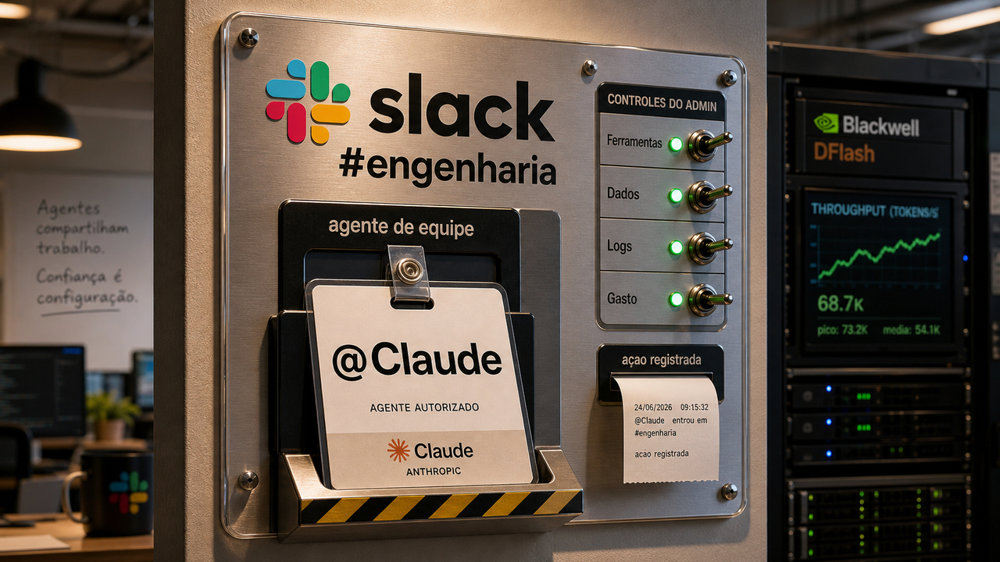

Quando um agente entra no canal do time, ele deixa de ser só conversa privada. Precisa de permissão, memória com limite, custo visível e log para alguém conferir depois.

## Claude Tag coloca @Claude em canais do Slack com permissão de admin

A Anthropic apresentou, em 23 de junho de 2026, o Claude Tag. A ideia começa no Slack: usuários de planos Claude Enterprise e Team podem marcar `@Claude` em canais escolhidos e delegar tarefas ali mesmo, com o contexto do time por perto.

Isso muda a cara do uso. Em vez de cada pessoa carregar uma conversa isolada, o agente trabalha em um espaço compartilhado. Ele pode acompanhar o histórico daquele canal, planejar trabalho ao longo do tempo, responder depois e, quando o comportamento ambiente estiver ligado, trazer atualizações sem esperar uma pergunta direta.

O controle em volta dele é a parte séria do lançamento. Segundo a Anthropic, admins escolhem quais canais, ferramentas, dados e codebases o Claude Tag pode acessar. As memórias ficam escopadas aos canais e casos de uso configurados. Canais privados não entram na leitura só porque alguém chamou o bot em outro lugar.

Também há limite de gasto em tokens e logs para mostrar o que o Claude fez e quem pediu a tarefa. Esse tipo de trilha fica bem menos opcional quando o agente sai da aba individual e passa a mexer em trabalho de equipe. Se uma automação abriu issue, pesquisou dado interno, leu repositório ou resumiu conversa sensível, alguém precisa conseguir reconstruir o caminho.

A Anthropic diz ainda que 65% do código do time de produto dela é criado por uma versão interna do Claude Tag. É um número chamativo, mas é métrica da própria empresa, num ambiente que ela controla. Use como contexto, não como prova de que todo time vai repetir a conta na segunda-feira.

Num piloto, eu olharia menos para a demo e mais para as bordas: canal pequeno, ferramenta explícita, dado mínimo, limite de custo, log revisável e migração consciente do app antigo do Claude no Slack, que o Claude Tag substitui com janela de opt-in de 30 dias. Agente compartilhado é útil. Agente compartilhado sem dono vira reunião que aprendeu a chamar API.

Fontes: [Anthropic](https://www.anthropic.com/news/introducing-claude-tag) e [Latent Space](https://www.latent.space/p/ainews-claude-tag-multiplayer-proactive).

## DFlash acelera inferência no Blackwell, mas o 15x precisa de bancada

A NVIDIA publicou, em 23 de junho, o DFlash, um caminho de aceleração para inferência de modelos de linguagem. O problema é conhecido por quem serve modelo: o texto sai token por token, e essa sequência briga com latência, custo de GPU e quantidade de usuários simultâneos.

O DFlash usa um modelo leve de difusão em blocos para rascunhar vários tokens futuros de uma vez. Depois, o modelo principal verifica esses tokens. O ganho prometido vem daí: adiantar trabalho sem trocar o modelo que o usuário vê por outro mais esperto.

Na manchete grande do post, a NVIDIA fala em mais de 15x de throughput no `gpt-oss-120b` rodando em Blackwell, dentro de uma faixa de interatividade alta, contra decodificação autoregressiva. O texto também cita ganhos em Llama 3.1 8B, Gemma 4 31B no vLLM e Qwen3 8B no SGLang.

Essa conta depende do cenário. Benchmark de vendor é bom para descobrir o que testar, não para atualizar planilha de capacidade sem medir nada. Modelo, prompt, batch, limite de latência, quantização, hardware e framework mudam o resultado. O número maior faz barulho, mas a pergunta boa é mais chata: isso melhora o meu tráfego real?

Os caminhos citados incluem TensorRT-LLM, SGLang e vLLM. A NVIDIA também aponta o repositório do projeto. Para times que já operam workload de IA, especialmente código, raciocínio e agente interativo, vale acompanhar. Trate "até 15x" como hipótese de teste antes de produção.

Fonte: [NVIDIA Technical Blog](https://developer.nvidia.com/blog/boost-inference-performance-up-to-15x-on-nvidia-blackwell-using-dflash-speculative-decoding/) e [GitHub / z-lab/dflash](https://github.com/z-lab/dflash).

## Cisco Unified CM tem CVE-2026-20230 reportada em exploração

Agora a parte menos divertida do dia: Cisco Unified Communications Manager e Unified CM SME. A CVE-2026-20230 afeta ambientes com o serviço WebDialer habilitado. A própria Cisco diz que o WebDialer vem desativado por padrão, mas esse tipo de "por padrão" nem sempre descreve a sua instalação de cinco anos atrás.

A falha é uma SSRF, ou falsificação de requisição pelo servidor, causada por validação imprópria em certas requisições HTTP. Segundo o advisory da Cisco, um atacante remoto não autenticado pode enviar requisições criadas para explorar o problema e gravar arquivos no sistema operacional por baixo. Esses arquivos poderiam ser usados depois para escalar privilégio até root.

A Cisco lançou atualizações em 3 de junho de 2026 e informa que não há workaround. Isso empurra a decisão para um lugar simples, embora trabalhoso: inventariar Unified CM e Unified CM SME, conferir se WebDialer está ativo, aplicar a versão corrigida e olhar exposição de rede.

A novidade vem das reportagens. SecurityWeek e BleepingComputer reportam exploração observada pela Defused depois de disponibilidade de PoC. A Cisco é a fonte primária para a vulnerabilidade e as correções; a exploração ativa, pelo material visto aqui, vem dessa cobertura de segurança. Por isso a linguagem correta é "reportada em exploração", não "Cisco confirmou campanha ativa".

Para quem mantém esse tipo de telefonia corporativa, o item sai da fila genérica de patch e vira verificação com cara de incidente: saber se o serviço existe, se está habilitado e se a versão foi corrigida já é bastante.

Fontes: [Cisco Security Advisory](https://sec.cloudapps.cisco.com/security/center/content/CiscoSecurityAdvisory/cisco-sa-cucm-ssrf-cXPnHcW), [SecurityWeek](https://www.securityweek.com/hackers-exploiting-cisco-unified-cm-vulnerability/) e [BleepingComputer](https://www.bleepingcomputer.com/news/security/cisco-unified-cm-sme-flaw-cve-2026-20230-now-exploited-in-attacks/).

## Qwen-AgentWorld simula ambientes antes de soltar o agente

Um agente não erra só porque respondeu uma frase ruim. Ele erra porque chamou ferramenta na hora errada, interpretou estado de ambiente do jeito errado, esqueceu uma consequência ou achou que o mundo mudou quando nada mudou. Benchmark de pergunta e resposta mede uma parte pequena disso.

O Qwen-AgentWorld, submetido ao arXiv em 23 de junho, tenta atacar esse pedaço. A proposta é criar modelos de mundo em linguagem para simular ambientes de agentes. Em português comum: um modelo que tenta prever como o ambiente reage quando o agente age, antes de colocar esse agente no ambiente real.

O paper apresenta os modelos Qwen-AgentWorld-35B-A3B e Qwen-AgentWorld-397B-A17B. Também descreve mais de 10 milhões de trajetórias de interação com ambientes e um pipeline em três etapas, com CPT, SFT e RL. O repositório lista sete domínios: MCP, busca, terminal, engenharia de software, Android, web e sistema operacional.

O nome AgentWorldBench entra como benchmark desse trabalho. Segundo o paper, ele foi construído a partir de interações reais de cinco modelos de fronteira em nove benchmarks já existentes. O repositório diz que o modelo 35B-A3B e o AgentWorldBench foram liberados em 24 de junho, com pesos no Hugging Face e no ModelScope.

Isso é pesquisa fresca, com resultado reportado pelos autores. Ainda não dá para trocar staging, teste de integração ou aprovação humana por um simulador bonito. Mas a direção é interessante: antes de deixar um agente mexer em terminal, navegador, MCP ou app Android, faz sentido treinar e avaliar a leitura que ele tem do ambiente.

Para dev, fica a ideia: o mundo do agente também precisa de teste. Não só a resposta final, mas a cadeia de estado, ferramenta e consequência.

Fontes: [arXiv](https://arxiv.org/abs/2606.24597) e [GitHub / QwenLM/Qwen-AgentWorld](https://github.com/QwenLM/Qwen-AgentWorld).

## Destaques rápidos para hoje

- **Mistral OCR 4 devolve texto com estrutura para RAG.** A Mistral anunciou, em 23 de junho, o OCR 4, com texto extraído, caixas de posição, classificação de blocos e pontuação de confiança. Isso interessa para pipelines de RAG e agentes porque PDF não é só texto corrido: tabela, assinatura, equação e rodapé precisam continuar identificáveis depois da extração. O produto suporta 170 idiomas em 10 grupos linguísticos, tem opção self-hosted em container único para clientes enterprise e preço anunciado de US$ 4 por 1.000 páginas na API, US$ 2 por 1.000 páginas no Batch API e US$ 5 por 1.000 páginas no Document AI. Os benchmarks são da própria Mistral, e a empresa também alerta que usos de alto risco precisam de controles adequados. Fonte: [Mistral AI](https://mistral.ai/news/ocr-4/).

> Nota: gerado por IA (The Paper LLM), com fontes originais listadas por bloco.

<!--
briefing_slug: none
source_mode: recent_curated_fallback
generated_at: 2026-06-24T05:45:40-03:00
fallback:
  reason: stale_latest_briefing
  window_start: 2026-06-23T08:18:32Z
  window_end: 2026-06-24T08:18:32Z
  candidate_article_ids_considered:
    - 738998
    - 739219
    - 738966
    - 738942
    - 738853
    - 738615
    - 738690
    - 738537
    - 738721
    - 738720
    - 738312
    - 738376
    - 738737
    - 737487
    - 737399
    - 737403
    - 736736
    - 736814
    - 737648
    - 736668
    - 736178
    - 736084
    - 736379
    - 736409
    - 735859
    - 736056
    - 735857
    - 736019
    - 735858
    - 735827
    - 736111
    - 735329
    - 734947
    - 735816
    - 735357
    - 735128
    - 735072
    - 734964
    - 734779
    - 734432
    - 734114
    - 734371
    - 734468
    - 734274
    - 734701
    - 734352
    - 734375
    - 734077
    - 733990
    - 733713
    - 734078
    - 735708
    - 734509
    - 735623
    - 733294
    - 736597
    - 737310
    - 737311
    - 737312
    - 732900
    - 733295
    - 737339
    - 732530
    - 732879
    - 737345
    - 732532
    - 732827
    - 737349
    - 732561
    - 732624
    - 732260
    - 734055
    - 732433
    - 732460
    - 732359
    - 732256
    - 732305
    - 732614
    - 736272
    - 732454
    - 732437
    - 731871
    - 737321
    - 731897
    - 732755
    - 733238
    - 731794
    - 731973
    - 731900
    - 737323
    - 737324
    - 731990
    - 737325
    - 731817
    - 731565
    - 737975
    - 731523
    - 731561
    - 731524
    - 737326
    - 731701
    - 731499
    - 731796
    - 731638
    - 731617
    - 737330
    - 731196
    - 731239
    - 731148
    - 731412
    - 730874
    - 731135
    - 737334
    - 730875
    - 735023
    - 731053
    - 730818
    - 730819
    - 730657
    - 730501
    - 730454
    - 730210
    - 730431
    - 730120
    - 730586
    - 730279
    - 730019
    - 730295
    - 739204
  selected_article_ids:
    - 732900
    - 732437
    - 737403
    - 738312
    - 731794
source_urls:
  - https://www.anthropic.com/news/introducing-claude-tag
  - https://www.latent.space/p/ainews-claude-tag-multiplayer-proactive
  - https://developer.nvidia.com/blog/boost-inference-performance-up-to-15x-on-nvidia-blackwell-using-dflash-speculative-decoding/
  - https://github.com/z-lab/dflash
  - https://sec.cloudapps.cisco.com/security/center/content/CiscoSecurityAdvisory/cisco-sa-cucm-ssrf-cXPnHcW
  - https://www.securityweek.com/hackers-exploiting-cisco-unified-cm-vulnerability/
  - https://www.bleepingcomputer.com/news/security/cisco-unified-cm-sme-flaw-cve-2026-20230-now-exploited-in-attacks/
  - https://arxiv.org/abs/2606.24597
  - https://github.com/QwenLM/Qwen-AgentWorld
  - https://mistral.ai/news/ocr-4/
omitted_briefing_items:
  - none: source_mode recent_curated_fallback; no same-day briefing was used.
-->
