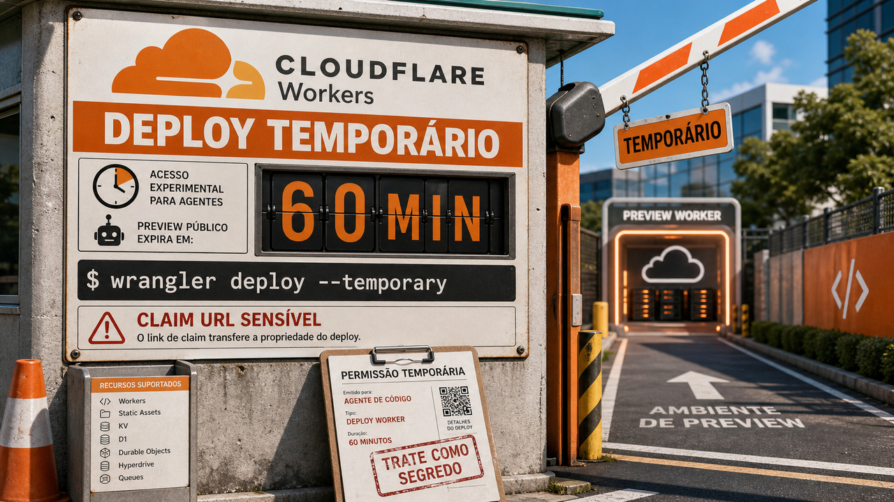

Quando uma ferramenta começa a publicar, instalar pacote e mexer em servidor, a pergunta boa deixa de ser só "funciona?" e passa a ser "com qual limite?". A primeira notícia de hoje é um deploy que nasce com prazo de validade.

## Cloudflare deixa agentes publicarem Workers temporários por 60 minutos

A Cloudflare adicionou um caminho para agentes publicarem um Worker sem passar primeiro por cadastro, login humano ou token permanente. O comando é bem direto: `wrangler deploy --temporary`.

O resultado é uma conta temporária de preview. O agente consegue subir o Worker, receber uma URL pública, testar, ajustar e publicar de novo dentro de uma janela de 60 minutos. Se uma pessoa quiser ficar com aquilo, abre a URL de claim e assume a propriedade. Se ninguém reivindicar, a implantação expira.

Isso resolve uma dor bem concreta de agentes de código. Eles conseguem criar arquivo, rodar teste e montar uma API simples, mas travam quando o fluxo pede navegador, OAuth, painel, token copiado no terminal ou cartão de crédito no meio do caminho. A ideia da Cloudflare é liberar um pedaço curto do ciclo de deploy sem entregar a chave mestra da conta.

Esse limite faz parte do desenho. A documentação fala em produtos suportados, cotas, verificação de prova de trabalho e checagens contra abuso. Também avisa que a URL de claim transfere a propriedade da implantação, então ela deve ser tratada como segredo. Se um agente imprime isso no lugar errado, vira credencial disfarçada de link bonitinho.

Os recursos citados incluem Workers, Workers Static Assets, Workers KV, D1, Durable Objects, Hyperdrive e Queues, mas com restrições. Use isso para demo, protótipo, preview e loop de verificação. Para produção autônoma, continua faltando política, dono, revisão e rastreabilidade.

Fonte: [Cloudflare Blog](https://blog.cloudflare.com/temporary-accounts/), [Cloudflare Developers Changelog](https://developers.cloudflare.com/changelog/post/2026-06-19-temporary-accounts-for-agents/) e [Cloudflare Workers Docs](https://developers.cloudflare.com/workers/platform/claim-deployments/).

## airgap redige segredos antes de agentes e npm install lerem arquivos

No dia 17, a gente falou do risco de [`npm install` virar execução de código antes do app rodar](/2026/mastra-levou-o-risco-para-o-npm-install-e-glm-5-2-abriu-pesos-no-hugging-face/). O airgap entra pelo lado defensivo: ele tenta reduzir o que agentes e scripts de instalação conseguem enxergar quando passeiam pelos arquivos da máquina.

A ferramenta roda o programa alvo dentro de namespaces do Linux, com um sistema de arquivos apoiado em FUSE. Em vez de esconder o arquivo inteiro, ela redige valores sensíveis em lugares como `.env`, chaves privadas em `~/.ssh`, chaves PGP e tokens de `.npmrc`. O arquivo continua editável e útil, mas o segredo aparece mascarado para o processo protegido.

Em fluxo com npm, a ideia fica ainda mais concreta. Se um script de instalação tenta ler um arquivo inesperado, como uma chave SSH, o airgap pode pedir permissão antes. Esse tipo de pergunta no momento certo é melhor do que descobrir no log de incidente que o `postinstall` já tinha feito turismo pela sua home.

O projeto também documenta aliases para ferramentas como Claude, opencode e npm, além de instalação por `cargo install airgap`. A graça do desenho é que ele não depende de o agente "se comportar bem"; ele muda a visão de filesystem que o processo recebe.

O alcance ainda é curto: o projeto é experimental, hoje o suporte completo é Linux, e macOS ainda não está pronto. Redigir segredo é diferente de bloquear todo acesso a arquivo. Mesmo assim, como padrão mental, é forte: segredo local não precisa virar texto cru para qualquer ferramenta que ganhou permissão de abrir uma pasta.

Fontes: [Sven Sauleau](https://sauleau.com/notes/airgap-security-for-the-modern-ai-age.html), [GitHub / xtuc/airgap](https://github.com/xtuc/airgap) e [crates.io](https://crates.io/crates/airgap).

## systemd 261 leva metadata de cloud, instalador e storage para o centro do Linux

O systemd 261 saiu em 19 de junho de 2026. Para quem só quer que o serviço suba no boot e fique quieto, a lista pode parecer grande demais. Para quem monta imagem, opera VPS ou mantém servidor Linux, algumas peças merecem atenção porque mostram para onde a infraestrutura está andando.

Uma delas é o novo subsistema de IMDS, com `systemd-imdsd`. IMDS é o serviço de metadata que instâncias de cloud usam para descobrir informações sobre o ambiente onde estão rodando. A release fala em reconhecer provedores como EC2, Azure, Google Compute Engine, Hetzner, Oracle, Tencent, Alibaba, Scaleway e Vultr.

Também aparecem `storagectl` e `systemd-sysinstall`. O primeiro expõe recursos de storage por CLI e Varlink. O segundo é um instalador de sistema em texto/CLI, amarrado a peças de particionamento e credenciais do próprio systemd. Ninguém precisa sair trocando instalador da distribuição no sábado. Ainda assim, mais tarefas de provisionamento estão virando primitivas oficiais.

No lado de hardening, `RestrictFileSystemAccess=` chama atenção. A opção usa BPF LSM para restringir execução a binários armazenados em sistemas de arquivos assinados e verificados por dm-verity. O benefício depende desse cenário existir de verdade, com filesystem verificado e cadeia de confiança configurada. Sem essa base, o ganho de segurança cai bastante.

A release também cita `ConditionFraction=`, LUO e KHO. A maior parte dos usuários vai receber systemd 261 pela distribuição, quando ela empacotar, testar e decidir o que habilitar. Para produção, núcleo do sistema pede menos impulso e mais compatibilidade.

Fontes: [GitHub / systemd v261](https://github.com/systemd/systemd/releases/tag/v261) e [Phoronix](https://www.phoronix.com/news/systemd-261).

## Destaques rápidos para hoje

- **Amazon Cognito ganhou replicação multi-Região para user pools, mas continua ativo-passivo.** A AWS agora oferece replicação de uma região primária para uma secundária. Isso ajuda continuidade de autenticação em desastre, inclusive com tokens reconhecidos dos dois lados, mas a réplica secundária fica em modo leitura para criação de usuário, reset de senha e mudança de perfil. Na hora de implementar, entram na conta plano Essentials ou Plus, chave KMS multi-Região, emissor OIDC, failover de domínio customizado e limitações de TOTP MFA. Fontes: [AWS News Blog](https://aws.amazon.com/blogs/aws/improve-your-application-resilience-with-amazon-cognito-multi-region-replication/), [AWS Documentation](https://docs.aws.amazon.com/cognito/latest/developerguide/user-pool-multi-region.html) e [InfoQ](https://www.infoq.com/news/2026/06/cognito-replication-aws/).

- **Aikido Code Audit tenta usar agente para achar falha de lógica que SAST costuma perder.** A proposta é analisar código-fonte estático procurando cadeias como IDOR, buraco de autorização, ReDoS e rota administrativa exposta, com evidência e sugestão de correção. A OWASP anunciou créditos para membros individuais testarem a ferramenta por seis meses a partir de 18 de junho. A categoria merece acompanhamento, mas os números de 70% a 80% de cobertura de pentest e custo 10 vezes menor são claims da Aikido, não benchmark independente. Fontes: [Aikido](https://www.aikido.dev/blog/introducing-code-audit-find-complex-vulnerabilities-hidden-in-your-codebase), [OWASP](https://owasp.org/blog/2026/06/18/aikido-agentic-code-audit.html) e [Aikido Help Center](https://help.aikido.dev/code-audit/ai-code-audit-overview).

## Acompanhamento de tendências do dia

Três textos de arquitetura apontam para um hábito que está ficando mais caro ignorar: validar o comportamento final, perto de onde o usuário sente o resultado. A Netflix descreve o Data Canary para validar metadata de catálogo já transformada, usando tráfego de produção e comparação entre baseline e canary. O problema ali era curto de tempo: esperar meia hora ou uma hora para confiança tradicional podia ser tarde demais para um ciclo de dados rápido.

Outro texto da Netflix separa política lenta e rápida no sistema de notificações. A parte lenta planeja cadência semanal e tenta evitar fadiga. A parte rápida escolhe a mensagem em tempo real. Isso é menos vistoso que um botão de IA, mas quem já irritou usuário com notificação demais sabe que cadência também é produto.

No lado de agentes de dados, a Hex descreve o Shoebox, uma infraestrutura de avaliação que compara candidato contra baseline e mantém ambientes sincronizados para a disputa ser justa. A conexão entre esses casos é simples de falar e difícil de fazer: se o sistema decide, publica ou recomenda algo automaticamente, o teste precisa chegar perto da consequência que o usuário vai sentir.

Fontes: [Netflix TechBlog / Data Canary](https://netflixtechblog.medium.com/the-data-canary-how-netflix-validates-catalog-metadata-18b699d58e36), [Netflix TechBlog / Notification System](https://netflixtechblog.medium.com/thinking-fast-slow-for-a-personalized-notification-system-4d89b26525cd) e [Hex](https://hex.tech/blog/evaluate-data-agents/).

> Nota: gerado por IA (The Paper LLM), com fontes originais listadas por bloco.

<!--
briefing_slug: 2026-06-20
source_mode: briefing
generated_at: 2026-06-20T05:36:12-03:00
source_urls:
  - https://blog.cloudflare.com/temporary-accounts/
  - https://developers.cloudflare.com/changelog/post/2026-06-19-temporary-accounts-for-agents/
  - https://developers.cloudflare.com/workers/platform/claim-deployments/
  - https://sauleau.com/notes/airgap-security-for-the-modern-ai-age.html
  - https://github.com/xtuc/airgap
  - https://crates.io/crates/airgap
  - https://github.com/systemd/systemd/releases/tag/v261
  - https://www.phoronix.com/news/systemd-261
  - https://aws.amazon.com/blogs/aws/improve-your-application-resilience-with-amazon-cognito-multi-region-replication/
  - https://docs.aws.amazon.com/cognito/latest/developerguide/user-pool-multi-region.html
  - https://www.infoq.com/news/2026/06/cognito-replication-aws/
  - https://www.aikido.dev/blog/introducing-code-audit-find-complex-vulnerabilities-hidden-in-your-codebase
  - https://owasp.org/blog/2026/06/18/aikido-agentic-code-audit.html
  - https://help.aikido.dev/code-audit/ai-code-audit-overview
  - https://netflixtechblog.medium.com/the-data-canary-how-netflix-validates-catalog-metadata-18b699d58e36
  - https://netflixtechblog.medium.com/thinking-fast-slow-for-a-personalized-notification-system-4d89b26525cd
  - https://hex.tech/blog/evaluate-data-agents/
omitted_briefing_items:
  - https://arrowtsx.dev/bigger-models/: GLM-5.2 and AA-Omniscience facts were confirmed, but GLM-5.2 was already covered on June 17 and June 19 without a concrete new product/source delta.
  - https://medium.com/netflix-techblog/thinking-fast-slow-for-a-personalized-notification-system-4d89b26525cd: folded into the trend section instead of a standalone quick hit because the public source date is June 5.
  - https://www.joachimschipper.nl/Stop%20MITM%20on%20the%20first%20SSH%20connection%2C%20on%20any%20VPS%20or%20cloud%20provider.html: useful evergreen SSH tutorial, but no current hook after recent consideration.
  - https://lwn.net/SubscriberLink/1077619/f7b07c5489fdd43a/: AUR/Atomic Arch/Bun angle was covered on June 15, and the current item adds analysis without a new public delta.
  - https://github.com/X11Libre/xserver/wiki/XLibre-XServer-25.2-Changes: official page placed stable 25.2.0 on June 21, 2026, after the target date.
  - https://overreacted.io/there-are-no-instances-in-atproto/: fresh and thoughtful, but lower fit than the selected agent, Linux, security and cloud infrastructure stories.
  - https://isc.sans.edu/diary/rss/33090: narrow phishing/IOC item with lower reader relevance and extra defanging risk.
  - https://thehackernews.com/2026/06/autojack-attack-lets-one-web-page.html: AutoJack was the June 19 lead and had no new public delta for this post.
  - https://thehackernews.com/2026/06/cisa-warns-fortinet-customers-as.html: FortiBleed was the June 18 lead and June 19 continuity quick hit, with no new lead-worthy delta.
-->
