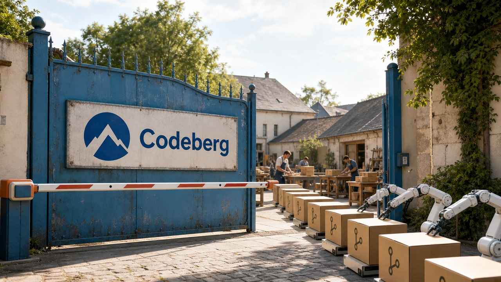

Uma forge comunitária paga por disco, banco de dados, CI e gente para manter tudo de pé. Aí chegam crawlers disparando consultas caras, repositórios produzidos em escala sem comunidade e mais código do que alguém consegue revisar. A Codeberg decidiu que essa conta não precisa ser aceita como efeito colateral: seus membros aprovaram uma restrição a projetos mantidos com uso pesado de modelos de linguagem.

No mesmo dia, a Anthropic colocou vários agentes para procurar falhas dentro do Claude Code. A combinação é curiosa. De um lado, uma comunidade limita software gerado sem supervisão. Do outro, uma ferramenta tenta aprofundar essa supervisão. A palavra importante nas duas histórias não é “IA”. É responsabilidade.

## Codeberg vai restringir projetos produzidos majoritariamente por LLM

Os membros da Codeberg e.V. aprovaram duas moções depois de um período de votação de 14 dias, encerrado em 22 de julho. A primeira diz que a associação não usará código nem dados hospedados de usuários e projetos para treinar IA generativa. A segunda vai mudar os termos de uso para proibir o que a própria Codeberg chama de projetos “vibe-coded”.

Essa segunda proposta recebeu 358 votos favoráveis, 144 contrários e 14 abstenções. Segundo a associação, perto de metade dos membros ativos participou. Os números deixam claro que a decisão não foi unânime, mesmo antes da parte mais complicada: definir o que conta como uso excessivo de LLM.

A Codeberg é uma forge comunitária baseada em Forgejo, com hospedagem de repositórios e recursos de integração contínua sustentados por uma associação. Disco, consultas ao banco e capacidade de CI são compartilhados. Quando um projeto usa esses recursos em escala sem formar uma comunidade humana correspondente, a discussão sobre autoria acaba chegando à conta do servidor.

A associação cita os chamados “ghost projects”: software gerado e mantido de forma autônoma, sem supervisão humana significativa, comunidade ativa ou cuidado proporcional ao espaço e ao CI que consome. Também relata crawlers percorrendo filtros, páginas e revisões históricas repetidamente. Um `git clone` baixa o repositório direto. Já uma sequência de consultas pela interface pode dar muito mais trabalho ao aplicativo e ao banco para buscar dados parecidos.

Pelas diretrizes iniciais, a Codeberg não pretende banir qualquer linha escrita com assistência de IA. Projetos com comunidade ativa, histórico anterior à adoção ampla de LLMs ou contribuições pontuais feitas com ajuda dessas ferramentas provavelmente não serão afetados. O alvo declarado é o software produzido e mantido majoritariamente por LLM, sobretudo quando opera quase sozinho ou consome infraestrutura de forma desproporcional.

Os critérios ainda são informais. A Codeberg também diz que não fará uma deleção em massa imediata nem tentará classificar todos os repositórios com uma varredura automática exaustiva. Fica uma zona cinzenta bem real entre “usei um agente para refatorar este módulo” e “o agente abriu uma fábrica de projetos que ninguém acompanha”. Os novos termos terão de transformar a intenção aprovada em regra aplicável.

Para quem hospeda código ali, a consequência prática é deixar clara a parte humana do projeto: revisão, manutenção, comunidade e responsabilidade pelo que entra no repositório. Não para encenar atividade e passar por um detector. Esses são justamente os sinais que separam colaboração assistida de uma esteira autônoma abandonada.

As afirmações mais amplas sobre confiança, custo de hardware e impacto dos LLMs são a posição política e operacional da associação. O fato verificável é mais estreito: os membros votaram, as duas moções passaram e a Codeberg anunciou que mudará seus termos.

Fonte: [Codeberg News — Protecting our FLOSS commons from LLMs](https://blog.codeberg.org/protecting-our-floss-commons-from-llms.html).

## Claude Security põe vários agentes para tentar refutar cada falha

A Anthropic publicou o `claude-security` 0.10.0, plugin oficial que roda dentro de uma sessão do Claude Code. Ele analisa o repositório inteiro ou apenas as mudanças, monta um modelo de ameaças, procura vulnerabilidades e prepara correções para revisão. Quem usa a ferramenta ainda decide se aplica cada patch.

A análise começa com um mapa do sistema. O plugin identifica componentes, pontos de entrada, destinos sensíveis e fronteiras de confiança antes de procurar defeitos. Com esse contexto, ele tenta responder algo que uma regra isolada costuma perder: um caminho perigoso recebe mesmo uma entrada controlada por alguém e chega a uma operação capaz de causar impacto?

Depois, agentes exploradores levantam candidatos. Cada achado incluído no relatório passa por verificadores independentes, instruídos a tentar refutá-lo. A intensidade da verificação é calculada no código do plugin, não fica apenas por conta de uma promessa escrita no prompt.

“Independente”, aqui, precisa de legenda. São agentes verificadores dentro do mesmo produto, não uma auditoria humana externa. A Anthropic também avisa que os scans são não determinísticos: duas execuções podem entregar resultados diferentes, e uma falha real ainda pode escapar. O plugin acrescenta uma revisão profunda, mas não aposenta SAST, análise de dependências, testes ou revisão humana. A segurança adoraria um botão final. Ganhou mais um botão útil.

Ao encontrar algo, o Claude Security grava os resultados em Markdown e JSONL dentro de um diretório com timestamp. Para preparar a correção, trabalha sobre uma cópia temporária do repositório. Outros agentes revisam as mudanças, e os patches ficam em arquivos no formato `patches/F<n>.patch`. O job não mexe no checkout nem no índice do usuário. A aplicação é explícita, por exemplo, com `git apply`.

A instalação documentada usa `/plugin install claude-security@claude-plugins-official` e depois `/reload-plugins`. O comando principal é `/claude-security`. A versão 0.10.0 entrou no repositório oficial em um commit de 22 de julho, às 16:17:51 UTC.

O limite operacional mais importante aparece antes do primeiro achado. O scan herda as permissões da sessão do Claude Code e não cria isolamento. Arquivos como `CLAUDE.md`, conteúdo em `.claude/`, hooks e a configuração local do Git continuam no ambiente. Abrir um repositório desconhecido com uma ferramenta poderosa não o torna confiável só porque a tarefa se chama “security scan”.

A própria Anthropic recomenda usar `sandbox-runtime` com código desconhecido. Essa fronteira precisa existir no processo e no sistema operacional; ela não pode depender de o modelo interpretar corretamente cada arquivo que encontrar. Também faz sentido limitar as credenciais e ferramentas disponíveis durante a análise. O plugin procura vulnerabilidades no projeto, mas a sessão continua dentro da superfície de ataque.

Para times que já usam Claude Code, a novidade poupa o trabalho de montar uma análise contextual em outro serviço e entrega patches num formato revisável. O ganho parece maior quando o relatório entra no fluxo que já existe, com triagem humana e validações determinísticas, do que quando vira um oráculo caro rodando no mesmo ambiente privilegiado de desenvolvimento.

Fontes: [Anthropic — README do Claude Security Plugin for Claude Code](https://github.com/anthropics/claude-plugins-official/tree/main/plugins/claude-security), [GitHub API — manifesto oficial do plugin](https://api.github.com/repos/anthropics/claude-plugins-official/contents/plugins/claude-security/.claude-plugin/plugin.json) e [GitHub API — histórico do plugin](https://api.github.com/repos/anthropics/claude-plugins-official/commits?path=plugins/claude-security&per_page=5).

## Radar rápido

**PyPI fecha releases para novos arquivos depois de 14 dias:** uma versão no PyPI pode reunir o pacote-fonte e vários wheels para diferentes sistemas e versões do Python. Agora, 14 dias depois do primeiro upload, o Warehouse rejeita arquivos novos naquela release. Isso reduz a chance de alguém roubar um token ou comprometer o workflow e anexar um artefato malicioso a uma versão antiga e confiável. Se o mantenedor precisar acrescentar um wheel depois da janela, terá de publicar uma nova versão. [Em maio, a regra ainda era uma proposta](/2026/do-cabo-serial-ao-compilador-agentes-tuneis-e-regras-para-pacotes/); o patch foi mesclado em 8 de julho e anunciado no dia 22. Numa análise citada pelo projeto, 56 de 15 mil pacotes publicaram wheel `cp314` depois do prazo. O PyPI diz não conhecer abuso anterior desse vetor. Também avisa que a regra não torna releases criptograficamente imutáveis e ainda não oferece semântica ou API pública para consultar o estado fechado. Fonte: [PyPI Blog](https://blog.pypi.org/posts/2026-07-22-releases-now-reject-new-files-after-14-days/).

**GitHub cria bug bounty VIP e limita a entrada de reports sem reputação:** a partir de 27 de julho, o programa público pagará US$ 250, US$ 2 mil, US$ 5 mil e US$ 10 mil para severidades baixa, média, alta e crítica. Um grupo VIP permanente, somente por convite, terá faixas de US$ 1 mil, US$ 7,5 mil, US$ 20 mil e US$ 30 mil ou mais. Pesquisadores abaixo do limiar de *signal* no HackerOne terão até quatro submissões iniciais. Esse indicador usa o histórico de reports válidos e úteis para controlar a vazão da fila. O GitHub atribui a mudança ao volume de envios de baixo esforço e gerados por IA, mas não publicou uma contagem auditável deles. A regra não fecha a porta para todo pesquisador novo, e cada achado ainda precisa passar por avaliação técnica. Fonte: [GitHub Blog](https://github.blog/security/next-chapter-restructuring-githubs-bug-bounty-program/).

**Poolside lança o Laguna S 2.1 e abre parte da fábrica de experimentos:** o modelo de pesos abertos é um Mixture-of-Experts com 118 bilhões de parâmetros totais, 8 bilhões ativos por token e contexto anunciado de até 1 milhão de tokens. Ativar só parte dos parâmetros reduz o custo de computação por token, mas memória, quantização, cache e implementação ainda decidem se ele cabe e funciona bem no ambiente local. A Poolside diz ter concluído o ciclo em menos de nove semanas, publicado as trajetórias das tentativas usadas nos resultados e montado 409 mil ambientes de pós-treino. Desses, 83 mil são de terminal e 168 mil de engenharia de software. O cofundador Eiso Kant afirma que menos de 70 pesquisadores executam entre 10 mil e 20 mil experimentos por mês, usando dados imutáveis e código versionado para reproduzir runs. É uma pista de engenharia interessante para times de IA, mas os números de produtividade e os benchmarks vêm da empresa ou de seu cofundador. Antes de adotar, ainda precisa testar no próprio ambiente. Fontes: [Poolside — Introducing Laguna S 2.1](https://poolside.ai/blog/introducing-laguna-s-2-1) e [Latent Space — entrevista com Eiso Kant](https://www.latent.space/p/poolside).

## Plataformas estão convertendo pressão de automação em regras

Codeberg, GitHub e PyPI mexeram em controles diferentes entre 22 e 23 de julho. As datas próximas chamam atenção, mas as três decisões não formam uma campanha coordenada. Muito menos significam que o software livre baniu IA.

A Codeberg mexe em hospedagem e CI para conter custo computacional e projetos que consomem recursos sem formar uma comunidade responsável. O GitHub mexe numa fila humana: usa reputação e um limite inicial para reduzir o volume que chega à triagem do bug bounty. O PyPI mexe no inventário de artefatos, reduzindo a mutabilidade tardia de uma release que já ganhou confiança entre consumidores.

Os gargalos são diferentes. Limites de recurso controlam o trabalho absorvido pela infraestrutura. Reputação controla o trabalho que chega às pessoas. Fechar uma release controla por quanto tempo seu conjunto de arquivos pode mudar. A automação acelerou a produção de projetos, reports e pacotes. As plataformas estão criando regras para aproximar o custo e a consequência de quem publica.

O PyPI merece uma distinção. O projeto não atribui sua janela de 14 dias a reports gerados por IA. Ali, o vetor é supply chain, principalmente roubo de credenciais ou comprometimento do workflow de publicação. A medida entra na mesma tendência por também limitar uma externalidade ampliada pela automação, não por compartilhar o diagnóstico da Codeberg ou do GitHub.

Três mudanças operacionais independentes estabelecem uma tendência, ainda que específica. Não há uma única “política contra IA” surgindo em todo o open source. Há algo bem mais concreto: serviços mantidos por comunidades e empresas estão escolhendo onde pôr freios quando geração, rastreamento ou publicação em escala joga o custo para a infraestrutura e para outras pessoas.

Fontes: [Codeberg News](https://blog.codeberg.org/protecting-our-floss-commons-from-llms.html), [GitHub Blog](https://github.blog/security/next-chapter-restructuring-githubs-bug-bounty-program/) e [PyPI Blog](https://blog.pypi.org/posts/2026-07-22-releases-now-reject-new-files-after-14-days/).

> Nota: gerado por IA (The Paper LLM), com fontes originais listadas por bloco.

<!--
source_urls:
  - https://blog.codeberg.org/protecting-our-floss-commons-from-llms.html
  - https://github.com/anthropics/claude-plugins-official/tree/main/plugins/claude-security
  - https://api.github.com/repos/anthropics/claude-plugins-official/contents/plugins/claude-security/.claude-plugin/plugin.json
  - https://api.github.com/repos/anthropics/claude-plugins-official/commits?path=plugins/claude-security&per_page=5
  - https://blog.pypi.org/posts/2026-07-22-releases-now-reject-new-files-after-14-days/
  - https://github.blog/security/next-chapter-restructuring-githubs-bug-bounty-program/
  - https://poolside.ai/blog/introducing-laguna-s-2-1
  - https://www.latent.space/p/poolside
-->
