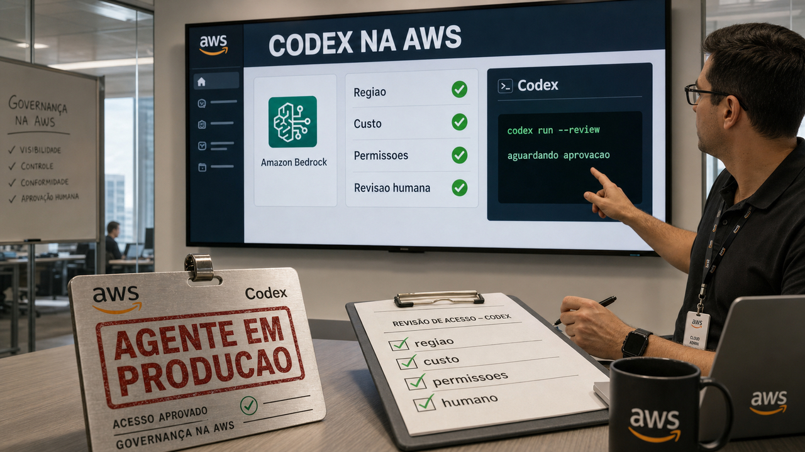

Quando uma ferramenta sai do experimento e entra no caminho de compra, deploy e permissão da empresa, a conversa muda. Hoje o agente de código aparece menos como demo bonita e mais como algo que precisa caber em cloud, arquitetura, patch e auditoria.

## Codex chega à AWS como caminho corporativo para agentes

A OpenAI anunciou em 1 de junho que seus modelos frontier e o Codex estão geralmente disponíveis na AWS. Para dev, o nome que chama mais atenção é o Codex on Amazon Bedrock: o agente de engenharia de software da OpenAI entrando por um caminho que muitas empresas já usam para aprovar serviço, cobrança, compliance, governança e região de implantação.

Esse detalhe brilha menos que benchmark, mas costuma decidir adoção. Um time pode gostar muito de um agente de código e ainda travar na pergunta simples: quem compra, quem paga, onde roda, que região pode usar, que política interna aprova e quem responde quando o fluxo mexe em repositório de verdade?

O anúncio também fala em disponibilidade para regiões Commercial e GovCloud. Isso importa para empresas que não conseguem tratar IA como uma ferramenta solta no cartão de crédito de alguém. Quando a integração aparece dentro da AWS, a avaliação conversa com a burocracia que já existe. Burocracia ruim atrapalha. Burocracia boa impede que um experimento vire gasto misterioso com permissão demais.

A fonte confirma disponibilidade e posicionamento. Preço, isolamento, comportamento do control plane, custo por fluxo de trabalho, qualidade em repositório real e governança ainda ficam para avaliação de cada empresa.

O texto da OpenAI também coloca Daybreak, modelos cibernéticos e Codex Security como direção futura. Dá para acompanhar com o pé no chão: por enquanto, isso aparece como disponibilidade futura; ainda falta pacote técnico público para comparar no detalhe.

Fonte: [OpenAI](https://openai.com/index/openai-frontier-models-and-codex-are-now-available-on-aws/).

## Conflitos de merge viram diagnóstico de arquitetura com agentes

Adam Tornhill publicou uma leitura boa sobre uma irritação bem conhecida: conflito de merge. A tese dele é que, em fluxos com agentes trabalhando em paralelo, o conflito repetido pode dizer algo sobre o desenho do sistema, além de Git, PR empilhado ou fila de merge.

Em projeto grande, dá para sentir isso rápido. Se duas tarefas que deveriam ser independentes mudam sempre a mesma função, talvez a independência exista só no card. O código está contando outra história. Em agente de código, essa fricção aparece mais cedo porque várias mudanças podem chegar com velocidade de máquina, mas ainda bater no mesmo arquivo, na mesma função ou no mesmo limite de domínio mal cortado.

Tornhill sugere olhar para análise comportamental de código: hotspots, análise de coordenação e change coupling. Hotspot é o lugar que muda muito e costuma doer. Coordenação mostra onde muita gente, ou muitos agentes, precisam encostar ao mesmo tempo. Change coupling procura arquivos ou partes do sistema que mudam juntos com frequência, como se estivessem presos por uma fita que ninguém assumiu no desenho.

O exemplo citado no texto é `extractToolStats()`, uma função acumulando preocupações diferentes. O nome é só detalhe. O padrão importa mais: uma função vira depósito de caminhos de produto, depois todo mundo precisa mexer nela, e o conflito de merge vira sintoma visível de uma fronteira ruim.

Ferramentas como merge queue e resolvedor de conflito ajudam. Elas reduzem atrito e podem ser necessárias em time grande. Só que tratam a colisão depois que ela apareceu. Quando o conflito volta sempre no mesmo canto, vale olhar antes para módulo, domínio, fluxo de produto e responsabilidade. Às vezes o melhor fix para o agente é uma fronteira que um humano também entende melhor.

Fonte: [Adam Tornhill](https://adamtornhill.substack.com/p/why-merge-conflicts-became-the-new).

## X.Org e XWayland corrigem nove falhas em aviso de 2 de junho

O X.Org publicou um advisory de segurança em 2 de junho com nove problemas no X.Org X server e no XWayland. As correções saíram em `xorg-server` 21.1.23 e `xwayland` 24.1.12, então a parte mais direta para quem usa Linux é acompanhar o pacote da distribuição e atualizar quando o update chegar.

Mesmo em desktop moderno, XWayland ainda importa. Ele é a ponte que deixa aplicação X11 rodar em sessão Wayland. A notícia ainda encosta no ambiente atual.

As classes citadas no advisory incluem stack buffer overflow, use-after-free e acessos fora dos limites. O aviso diz que oito achados foram creditados a Anonymous trabalhando com a TrendAI Zero Day Initiative, e o nono, ligado a DRI2, foi creditado a Peter Hutterer, da Red Hat.

Para quem rastreia advisory por identificador, os oito itens aparecem como ZDI-CAN-30136, ZDI-CAN-30159, ZDI-CAN-30160, ZDI-CAN-30161, ZDI-CAN-30163, ZDI-CAN-30164, ZDI-CAN-30165 e ZDI-CAN-30168. O caso separado envolve DRI2 em `DRIGetBuffers` e `DRIGetBuffersWithFormat`.

O próprio advisory diz que identificadores CVE foram pedidos, mas não chegaram a tempo da divulgação. Então o caminho mais confiável é seguir o advisory da distro antes de depender de busca por CVE. E o crédito ligado à TrendAI ZDI precisa de leitura proporcional: auditoria assistida por IA está entrando no trabalho normal de encontrar bug em infraestrutura antiga.

Não vi fonte verificada afirmando exploração ativa. Mesmo assim, memória corrompida em componente gráfico usado por sistemas reais merece patch sem drama e sem fantasia.

Fontes: [X.Org advisory](https://lists.x.org/archives/xorg-announce/2026-June/003702.html), [xorg-server 21.1.23](https://lists.x.org/archives/xorg-announce/2026-June/003703.html), [xwayland 24.1.12](https://lists.x.org/archives/xorg-announce/2026-June/003704.html) e [Phoronix](https://www.phoronix.com/news/X.Org-9-Vulnerabilities-AI).

## AgentRedBench e SkillHarm tratam integrações e skills como dependências

Ontem à noite, falamos de [Miasma no npm](/2026/miasma-npm-cisco-odysseus-seguranca-fora-prompt/) como pacote comprometido no caminho de instalação. A novidade aqui é que a mesma cabeça de supply chain começa a subir uma camada: a dependência agora pode ser uma integração SaaS, uma resposta de ferramenta ou uma skill que o agente decide reaproveitar.

O AgentRedBench olha para injeção indireta de prompt em agentes que usam integrações empresariais. A fonte fala em 215 cenários, 24 integrações, nove famílias funcionais e cinco tipos de ataque. Os exemplos de ambiente passam por coisas estilo Gmail, Salesforce e Jira, justamente onde o agente lê conteúdo que o usuário não escreveu e pode estar perto de ação de conta.

Os autores reportam taxas de sucesso de ataque sem guard variando de 32% a 81% no painel de oito modelos. Também reportam que o AgentRedGuard reduziu a taxa média do painel de 69,9% para 2,4%, com 0,37% de falso positivo. Isso é benchmark dos autores; a prevalência real no mundo continua sem confirmação. Ainda assim, a forma do problema é bem concreta: conteúdo vindo de ferramenta precisa ser tratado como entrada não confiável.

O SkillHarm vai para outro canto da mesma sala. Ele trata skills de agente como superfície privilegiada e descreve cenários de envenenamento com payload fixo e com skill que se altera para usos futuros. O paper fala em 879 amostras de ataque em 71 skills, com taxa de sucesso de até 86,3% no fixed-payload poisoning e 69,3% no self-mutating poisoning.

Os dois papers são preprints no arXiv, com números de benchmark e sem prova de prevalência real. Para dev, o ensinamento vem antes do susto do percentual: se um agente pode ler Gmail, mexer em arquivo, chamar Jira, operar Salesforce, carregar skill, escrever memória persistente ou seguir instrução de plugin, a revisão precisa passar do prompt do sistema. Precisa de menor privilégio, aprovação em pontos certos, revisão de skills, monitoramento e uma fronteira clara entre dado externo e instrução executável.

Fontes: [AgentRedBench no arXiv](https://arxiv.org/abs/2606.02240v1) e [SkillHarm no arXiv](https://arxiv.org/abs/2606.02540v1).

## Destaques rápidos de hoje

- `thunderbolt-ibverbs` é uma experiência de 28 de maio, ressurgida agora, que expõe um link USB4/Thunderbolt como dispositivo parecido com InfiniBand para RDMA em inferência distribuída local. O autor relata cerca de 48 Gb/s por direção e 95 Gb/s bidirecional em dois mini PCs Strix Halo de 128 GB, mas também avisa que o código foi gerado com IA, provavelmente tem falhas, é pesquisa e deve ficar fora de máquina de produção. Fonte: [Hellas AI](https://blog.hellas.ai/blog/thunderbolt-ibverbs/).

- A NVIDIA publicou o JetPack 7.2 para Jetson com NemoClaw em um comando, skills de agente no lado do dispositivo e do BSP, suporte ao Yocto Project, MIG no Jetson Thor e Super Mode no Jetson AGX Orin 32 GB. É mais um sinal de agente entrando em stack de edge AI, mas vem de blog de fornecedor e ainda traz aquele padrão de instalar por script remoto no shell; leia antes de colar. Fonte: [NVIDIA Technical Blog](https://developer.nvidia.com/blog/deploy-agentic-ready-ai-at-the-edge-with-memory-efficiency-in-nvidia-jetpack-7-2/).

- O `gws`, CLI do Google Workspace, é interessante pelo desenho: lê o Google Discovery Service em runtime, gera superfície de comando dinamicamente, fala em saída JSON estruturada e inclui material para agentes e MCP. O README também diz que ele não é produto oficialmente suportado pelo Google, exige setup de projeto e OAuth, e está em desenvolvimento ativo. Fontes: [googleworkspace/cli](https://github.com/googleworkspace/cli) e [InfoQ](https://www.infoq.com/news/2026/06/google-workspace-cli/).

- O Warpgate 0.24.0 adicionou WebSSH com múltiplas abas no navegador, transferência de arquivo via ZMODEM, tickets self-service, roles padrão e gravação opcional de SCP. Para quem cuida de VPS, bastion e acesso de time pequeno, é uma peça para observar; browser SSH e gravação de sessão pedem política bem pensada, não só entusiasmo com interface. Fonte: [Warpgate no GitHub](https://github.com/warp-tech/warpgate/releases/tag/v0.24.0).

- O SANS ISC registrou uma onda de phishing usando anexos SVG com comportamento de redirecionamento em JavaScript. A mensagem defensiva é simples: SVG recebido por email deve ser tratado como conteúdo ativo de navegador, não como imagem inocente; gateway, sandbox e bloqueio de anexo fazem mais sentido do que abrir para "ver o desenho". Fonte: [SANS Internet Storm Center](https://isc.sans.edu/diary/33040).

- Christophe Pettus lembrou uma regra prática de PostgreSQL que evita muita aflição: `cpu_tuple_cost`, `cpu_index_tuple_cost` e `cpu_operator_cost` são constantes globais relativas do planner e quase sempre devem ficar nos defaults. Quando o plano parece estranho, olhe antes para estatísticas, `ANALYZE`, `default_statistics_target`, estatísticas estendidas e custo de armazenamento como `random_page_cost`. Fonte: [The Build](https://thebuild.com/blog/all-your-gucs-in-a-row-cpuindextuplecost-cpuoperatorcost-and-cputuplecost/).

- A Jane Street publicou em 26 de maio o `strace-ui`, uma TUI para tornar `strace` mais navegável com filtros interativos, IDs curtos para PIDs, rastreamento de file descriptors e fluxo testável com expect tests. É de 26 de maio, mas combina com o momento: terminal voltou a ser uma ótima superfície para ferramenta de dev, inclusive quando o agente trabalha perto de shell, SSH e logs. Fonte: [Jane Street](https://blog.janestreet.com/strace-ui-bonsai-term-and-the-tui-renaissance/).

## Acompanhamento de tendências do dia

O que junta essas histórias é bem material. Codex entra em caminho corporativo de cloud. Merge conflict deixa de ser só aborrecimento e vira evidência de acoplamento. Skills de agente parecem dependências. JetPack coloca skills no mundo de dispositivo. `gws` tenta fazer CLI legível para gente e máquina. Warpgate mexe em acesso remoto. Até SVG de email lembra que dado externo pode virar comportamento ativo.

Isso desloca a pergunta sobre agentes. O modelo responder bem continua importante. Só que produção costuma quebrar depois da resposta: no arquivo que foi alterado, no pacote que foi instalado, na integração que trouxe conteúdo, no ticket de acesso, no custo da chamada, na região permitida e na permissão que alguém aprovou com pressa.

Para dev, o pedido é inventário honesto. O que o agente pode ler? O que ele pode executar? Qual skill persiste? Qual CLI entrega JSON previsível? Qual fluxo precisa de aprovação humana? Qual componente antigo ainda está no desktop porque uma aplicação precisa dele? Responder isso é menos glamouroso do que trocar o modelo no seletor. Também é mais perto do lugar onde o incidente nasce.

Fontes de contexto: [OpenAI](https://openai.com/index/openai-frontier-models-and-codex-are-now-available-on-aws/), [Adam Tornhill](https://adamtornhill.substack.com/p/why-merge-conflicts-became-the-new), [AgentRedBench](https://arxiv.org/abs/2606.02240v1), [SkillHarm](https://arxiv.org/abs/2606.02540v1), [NVIDIA](https://developer.nvidia.com/blog/deploy-agentic-ready-ai-at-the-edge-with-memory-efficiency-in-nvidia-jetpack-7-2/) e [Warpgate](https://github.com/warp-tech/warpgate/releases/tag/v0.24.0).

> Nota: gerado por IA (The Paper LLM), com fontes originais listadas por bloco.

<!--
briefing_slug: 2026-06-02
source_mode: briefing
generated_at: 2026-06-02T05:44:31-03:00
source_urls:
  - https://openai.com/index/openai-frontier-models-and-codex-are-now-available-on-aws/
  - https://adamtornhill.substack.com/p/why-merge-conflicts-became-the-new
  - https://lists.x.org/archives/xorg-announce/2026-June/003702.html
  - https://lists.x.org/archives/xorg-announce/2026-June/003703.html
  - https://lists.x.org/archives/xorg-announce/2026-June/003704.html
  - https://www.phoronix.com/news/X.Org-9-Vulnerabilities-AI
  - https://arxiv.org/abs/2606.02240v1
  - https://arxiv.org/abs/2606.02540v1
  - https://blog.hellas.ai/blog/thunderbolt-ibverbs/
  - https://developer.nvidia.com/blog/deploy-agentic-ready-ai-at-the-edge-with-memory-efficiency-in-nvidia-jetpack-7-2/
  - https://github.com/googleworkspace/cli
  - https://www.infoq.com/news/2026/06/google-workspace-cli/
  - https://github.com/warp-tech/warpgate/releases/tag/v0.24.0
  - https://isc.sans.edu/diary/33040
  - https://thebuild.com/blog/all-your-gucs-in-a-row-cpuindextuplecost-cpuoperatorcost-and-cputuplecost/
  - https://blog.janestreet.com/strace-ui-bonsai-term-and-the-tui-renaissance/
coverage:
  - openai-codex-on-aws: main block; Codex on Amazon Bedrock, AWS availability, Commercial/GovCloud regions, governance/procurement frame and Daybreak future caveat preserved.
  - merge-conflicts-agentic-architecture: main block; recurring conflicts framed as architecture evidence with hotspots, coordination analysis, change coupling and extractToolStats() example preserved.
  - xorg-nine-security-fixes-trendai: main block; Jun 2 advisory, xorg-server 21.1.23, xwayland 24.1.12, nine issues, TrendAI ZDI credit, DRI2 credit, CVE caveat and no-active-exploitation caveat preserved.
  - agentredbench-skillharm-agent-supply-chain: main block; SaaS integrations, indirect prompt injection, AgentRedGuard numbers, SkillHarm poisoning shapes, benchmark caveat and supply-chain continuity preserved.
  - thunderbolt-ibverbs-usb4-rdma: quick hit; May 28 date caveat, USB4/Thunderbolt RDMA experiment, bandwidth numbers and research-only AI-generated-code warning preserved.
  - nvidia-jetpack-72-edge-agents: quick hit; JetPack 7.2, NemoClaw, Jetson skills, Yocto, MIG, Super Mode and curl-pipe-bash caution preserved.
  - google-workspace-cli-agent-first: quick hit; gws, Discovery Service, structured JSON, agent/MCP angle, OAuth friction and not-officially-supported caveat preserved.
  - warpgate-024-webssh: quick hit; WebSSH, multi-tab terminal, ZMODEM, self-service tickets, default roles, SCP recording and policy caveat preserved.
  - sans-svg-phishing-emails: quick hit; SVG as active browser content, JavaScript redirect and defensive handling preserved without payloads or IOCs.
  - postgresql-cpu-cost-gucs: quick hit; relative planner costs, CPU GUC defaults, random_page_cost, ANALYZE, default_statistics_target and extended statistics preserved.
  - strace-ui-tui-renaissance: quick hit; May 26 caveat, strace-ui, Bonsai_term, filtering, PID/file-descriptor tracking and terminal workflow context preserved.
  - agent-tooling-production-surface-trend: trend section; production-surface synthesis anchored in selected verified stories.
omissions:
  - Stop MITM on the first SSH connection, on any VPS or cloud provider: confirmed but omitted because it was already a main block on 2026-06-01 and a recent quick hit; no fresh update.
  - NuGet Code Execution As A Service: omitted because it was Reddit-first, .NET off-core and overlapped recent package-install execution coverage.
  - NVIDIA Cosmos 3, Nemotron 3 Ultra, and RTX Spark: omitted because primary NVIDIA benchmark/model-card claims were not verified in this stage.
  - Man trains local model to detect and kill mosquitos with a laser: omitted because it was viral/Reddit-first and needed original build validation.
  - Moss TTS 1.5 8B: omitted because quality and hardware claims require hands-on testing beyond Reddit sourcing.
  - AWS AgentCore Gateway OAuth/MCP flow: confirmed but omitted because the selected agent-security main block already carried the auth/tool-boundary lesson.
  - Como estruturamos um SaaS no Edge para custar quase R$ 0: omitted because it was self-reported and crowded out by stronger verified public news.
  - What's gonna happen to software engineers?: omitted because it was opinion context weaker than the merge-conflict architecture story.
  - Do Multimodal Agents Really Benefit from Tool Use?: omitted because it was less central than AgentRedBench and SkillHarm.
  - Harness-1: omitted because it lacked enough public relevance for this dense day.
  - SimSD: confirmed but omitted because it was benchmark-heavy and lower fit.
  - Echo: omitted because local-audio research was not strong enough as a news item today.
  - google-gemma/gemma-skills: omitted because it was early and Reddit-first; SkillHarm/AgentRedBench carried the skill-security angle better.
  - The Frame Problem: confirmed but omitted because it was evergreen context, not fresh news.
  - O problema das vulnerabilidades falsas em cybersec: omitted because it was weaker than X.Org plus agent-security sources.
  - Pasted File Editor: omitted because it was a small micro-tool crowded out by stronger tooling quick hits.
  - Red Hat npm packages compromised / Miasma continuation: confirmed but omitted because it was already the June 1 late lead and had no new fact strong enough to repeat.
  - GoDaddy WordPress malware using Steam profiles: confirmed but omitted because original source was May 28, IOC-heavy and weaker than selected same-day items.
-->
