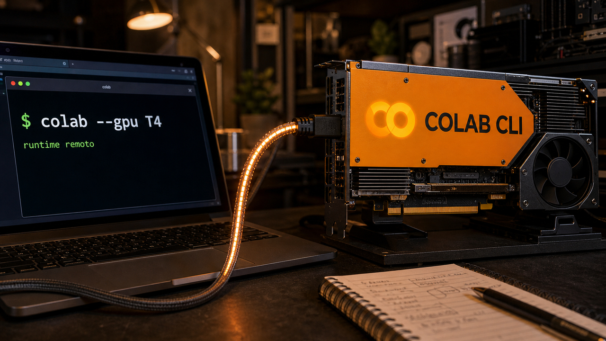

Quando uma ferramenta ganha permissão para gastar GPU, atualizar extensão ou resetar conta, ela deixa de ser só conveniência. E isso começa no terminal.

## Google Colab CLI coloca runtime remoto no caminho dos agentes de terminal

O Google apresentou o Google Colab CLI, uma interface de linha de comando open source que liga o terminal local a runtimes remotos do Colab. Na prática, você continua no shell, mas consegue pedir uma GPU ou TPU do Colab para rodar scripts, pipelines de machine learning e tarefas que não cabem bem no notebook da sua máquina.

No post oficial, aparecem comandos como `colab --gpu T4`, `colab exec`, `colab download` e `colab log`. O fluxo permite criar um runtime, instalar dependências, executar um script Python remoto, baixar artefatos e guardar o log em notebook. O exemplo do Google usa fine-tuning com QLoRA em Gemma 3 1B. Para o dia a dia com agentes, a parte mais sensível é outra: qualquer agente com acesso ao terminal pode, em tese, ganhar um braço de computação fora do laptop.

O próprio texto cita Antigravity, Claude Code, Codex e outros agentes de terminal. Isso muda a pergunta do dia a dia. Antes ela era "minha máquina roda isso?". Agora também vira "esse agente pode gastar esse runtime, mexer nesses dados e trazer esses artefatos de volta?".

Colab continua tendo quota, custo, limites e contexto de uso. A ponte ficou mais interessante: prompt local, acelerador remoto e um agente no meio. Esse tipo de ponte é útil, e justamente por isso precisa de limite bem visível.

Fontes: [Google Developers Blog](https://developers.googleblog.com/introducing-the-google-colab-cli/) e [Help Net Security](https://www.helpnetsecurity.com/2026/06/08/google-colab-command-line-interface-cli/).

## VS Code 1.123 atrasa atualização automática de extensão por duas horas

No dia 5, falamos de [configs de agente dentro do repositório](/2026/miasma-agentes-repo-cisco-sdwan-cve-sem-patch/) como superfície de execução. Agora a mudança concreta vem do VS Code: a versão 1.123 passou a esperar duas horas antes de aplicar automaticamente uma atualização de extensão recém-publicada.

O detalhe é pequeno e bom. Se a atualização automática estiver ligada, uma versão nova da extensão não entra imediatamente assim que aparece. O usuário ainda pode clicar no botão de Update e instalar na hora. Enquanto a atualização está pendente, a tela de detalhes explica por que ela ainda não foi aplicada e quando o update automático deve acontecer.

Há uma exceção importante: extensões de publishers confiáveis, como Microsoft, GitHub e OpenAI, continuam atualizando imediatamente. A exceção já delimita a medida. O cooldown não é sandbox, assinatura perfeita, detector de malware nem escudo contra tudo. Ele reduz velocidade.

Mesmo assim, velocidade importa em cadeia de suprimentos. Se uma versão ruim ou comprometida entra no marketplace, duas horas podem ser o espaço para alguém notar, reportar, remover, bloquear ou pelo menos não acordar com todo o parque atualizado. A cobertura de segurança compara isso com freios parecidos em package managers, como Bun, npm, pnpm, Yarn e Bundler. A confiança no plugin continua sendo problema, mas um pouco da pressa automática sai do caminho.

Fontes: [Visual Studio Code 1.123 release notes](https://code.visualstudio.com/updates/v1_123) e [The Hacker News](https://thehackernews.com/2026/06/vs-code-adds-2-hour-extension-auto.html).

## Meta teve 20.225 pessoas afetadas em falha no suporte do Instagram

O registro do procurador-geral do Maine lista 20.225 pessoas afetadas em um incidente da Meta ligado ao Instagram. A data da ocorrência aparece como 17 de abril de 2026, a descoberta como 31 de maio de 2026, e a data de notificação aos consumidores como 19 de junho de 2026, posterior à data deste texto.

O fluxo envolvido era o Meta High Touch Support, ou HTS, um sistema de recuperação de conta com assistência de IA. Segundo a cobertura da BleepingComputer, a falha permitia solicitar links de redefinição de senha sem verificar corretamente se o email informado pertencia à conta alvo do Instagram. Com isso, atacantes conseguiam resetar senhas e tomar contas, principalmente quando a conta não tinha autenticação em dois fatores no caminho descrito.

O nome "IA" chama atenção, claro. Mas o bug tem cheiro conhecido: recuperação de conta com autoridade demais e uma checagem de identidade fraca demais. Suporte que consegue resetar senha é infraestrutura de segurança, mesmo quando aparece com interface de chatbot. Se ele pula a amarração entre conta e email, a conversa simpática vira detalhe secundário.

A Meta desativou o HTS e os links de reset gerados, colocou contas afetadas em checkpoint obrigatório, pediu nova autenticação e disse que vai corrigir a checagem antes de relançar a ferramenta. Também prometeu revisar fluxos semelhantes de recuperação. Para usuário, dois fatores continuam sendo uma barreira importante; para plataforma, a parte difícil é impedir que o próprio suporte vire atalho privilegiado para o atacante.

Fontes: [Maine Office of the Attorney General](https://www.maine.gov/agviewer/content/ag/985235c7-cb95-4be2-8792-a1252b4f8318/686120c8-63be-4e3c-b7ed-466d65b672f5.html), [notificação em PDF](https://www.maine.gov/cgi-bin/agviewerad/ret?loc=4169) e [BleepingComputer](https://www.bleepingcomputer.com/news/security/meta-ai-support-data-breach-affects-20-000-instagram-accounts/).

## PostgreSQL `data_sync_retry` explica por que cair pode ser mais seguro

Christophe Pettus publicou uma explicação ótima sobre `data_sync_retry`, um parâmetro do PostgreSQL que quase ninguém deve mudar. Ele é booleano, vem desligado por padrão e exige restart. O motivo está em uma cicatriz antiga de confiabilidade: o fsyncgate.

O contrato mental de muita gente era este: o banco escreve páginas sujas no cache do kernel com `write()`, depois chama `fsync()` para forçar aquilo para armazenamento durável. Se o `fsync()` falhar, parece natural tentar de novo. Só que, em Linux, uma falha de writeback podia marcar a página como limpa, reportar erro uma vez e depois deixar aquela página ser reaproveitada. Em algumas situações, o descritor errado consumia o erro, ou o erro sumia no fechamento do arquivo.

Agora vem a parte que dói: se o PostgreSQL acredita que o checkpoint terminou bem, ele pode reciclar o WAL que ainda seria necessário para reconstruir aqueles dados. A página não foi escrita, a cópia em memória se foi, e o WAL também. Não sobrou uma tentativa honesta para repetir. Sobrou perda.

A resposta do PostgreSQL foi dura e correta: com `data_sync_retry = off`, o padrão atual, falha de `fsync()` em arquivo de dados causa PANIC. O servidor cai e a recuperação por WAL reconstrói o que ainda estava descrito no log. Parece contraintuitivo, mas cair alto é mais seguro do que continuar baixo fingindo que o disco confirmou algo que talvez tenha perdido.

O Linux 4.13 melhorou a notificação com `errseq_t`, mas isso não traz dado perdido de volta. Direct I/O aparece como direção mais completa para reduzir a dependência do page cache, só que isso ainda é trabalho grande e parcial. Para quem opera PostgreSQL, a conclusão prática é menos "tune isso" e mais "não esconda PANIC de storage". Quando o banco grita nesse ponto, ele pode estar protegendo seus dados do silêncio.

Fonte: [The Build](https://thebuild.com/blog/all-your-gucs-in-a-row-datasyncretry/).

## Destaques rápidos

- **Defesa em profundidade reduz o estrago depois da primeira falha.** Um post no TabNews explica bem a ideia de dividir serviços para que uma RCE no nginx, por exemplo, não vire acesso automático a PostgreSQL, Redis e o resto da casa. É material didático, não pesquisa nova, mas encaixa com o dia: container, sandbox, VM, MicroVM, autenticação interna e logs existem para quando a primeira parede já caiu. Fonte: [TabNews](https://www.tabnews.com.br/Silva97/dividir-para-proteger).

- **Microsoft colocou agente dentro de um terminal experimental para Windows.** O Intelligent Terminal 0.1 é um fork open source e separado do Windows Terminal, com painel de agente, detecção de erro, sugestão de correção e gerenciamento de sessões. O GitHub Copilot CLI é o padrão, e a experiência aceita agentes compatíveis com ACP; a cobertura hands-on cita Claude, Codex e Gemini como opções vistas na configuração. Fontes: [Microsoft Command Line Blog](https://devblogs.microsoft.com/commandline/announcing-intelligent-terminal-version-0-1/) e [BleepingComputer](https://www.bleepingcomputer.com/news/microsoft/hands-on-with-intelligent-terminal-an-ai-powered-windows-terminal/).

- **Linux 7.1-rc7 segue mais pesado que o normal, mas a curva está baixando.** A Phoronix relata que o ciclo ainda carrega volume maior de patches, com agentes de IA e LLMs como parte do pano de fundo, mas que as correções estão encolhendo e Linus Torvalds parece confortável com um lançamento estável provavelmente em 14 de junho se nada grave aparecer. GPU e rede puxaram parte das mudanças do rc7. Fonte: [Phoronix](https://www.phoronix.com/news/Linux-7.1-rc7).

- **Troy Hunt marcou o milésimo vazamento no Have I Been Pwned e reclamou do atraso nas notificações.** O texto é de 1º de junho e o próprio Hunt avisa que está falando por experiência e exemplos, sem fechar estatística global. Ainda assim, o ponto é direto: se emails já circularam publicamente, esperar semanas por análise completa antes de avisar a pessoa afetada protege mais o processo do que o usuário. Fonte: [Troy Hunt](https://www.troyhunt.com/1000-data-breaches-later-the-disclosure-lag-is-worse-than-ever/).

- **`datasette-agent-edit` transforma edição de texto por agente em ferramentas pequenas.** Simon Willison lançou a versão 0.1a0, ainda alpha, com primitivas no estilo `view`, `str_replace` e `insert` para plugins do Datasette Agent. Parece pequeno porque é pequeno mesmo, e esse é o charme: agentes que editam Markdown, SQL ou SVG ficam mais previsíveis quando a superfície de edição é explícita e reutilizável. Fonte: [Simon Willison](https://simonwillison.net/2026/Jun/7/datasette-agent-edit/).

## O padrão do dia

Hoje, o padrão é simples: agentes estão encostando em lugares que executam coisas. O Colab CLI leva o agente para runtime remoto. O Intelligent Terminal coloca assistência dentro da shell. O `datasette-agent-edit` tenta fazer edição de texto com ferramentas menores. O HTS da Meta lembra que suporte automatizado, quando consegue resetar conta, já virou parte da segurança da plataforma.

As respostas mais interessantes são meio sem glamour. Um atraso de duas horas no VS Code. Um conjunto pequeno de ferramentas de edição. Uma checagem de email que não pode faltar em recuperação de conta. Quota, logs, autorização e escopo claro para runtime remoto. É esse tipo de detalhe que separa automação útil de automação com chave mestra perdida em cima da mesa.

A diferença entre capacidade e permissão ficou bem prática. Dar GPU ao agente é útil. Dar terminal ao agente é útil. Dar suporte de conta ao agente pode ser útil. Mas cada uma dessas frases precisa de uma segunda metade: até onde, com qual identidade, com qual custo, com qual registro e com que botão de parar.

Fontes: [Google Developers Blog](https://developers.googleblog.com/introducing-the-google-colab-cli/), [Visual Studio Code 1.123 release notes](https://code.visualstudio.com/updates/v1_123), [BleepingComputer](https://www.bleepingcomputer.com/news/security/meta-ai-support-data-breach-affects-20-000-instagram-accounts/), [Microsoft Command Line Blog](https://devblogs.microsoft.com/commandline/announcing-intelligent-terminal-version-0-1/) e [Simon Willison](https://simonwillison.net/2026/Jun/7/datasette-agent-edit/).

> Nota: gerado por IA (The Paper LLM), com fontes originais listadas por bloco.

<!--
briefing_slug: 2026-06-08
source_mode: briefing
generated_at: 2026-06-08T05:42:51-03:00
source_urls:
  - https://developers.googleblog.com/introducing-the-google-colab-cli/
  - https://www.helpnetsecurity.com/2026/06/08/google-colab-command-line-interface-cli/
  - https://code.visualstudio.com/updates/v1_123
  - https://thehackernews.com/2026/06/vs-code-adds-2-hour-extension-auto.html
  - https://www.maine.gov/agviewer/content/ag/985235c7-cb95-4be2-8792-a1252b4f8318/686120c8-63be-4e3c-b7ed-466d65b672f5.html
  - https://www.maine.gov/cgi-bin/agviewerad/ret?loc=4169
  - https://www.bleepingcomputer.com/news/security/meta-ai-support-data-breach-affects-20-000-instagram-accounts/
  - https://thebuild.com/blog/all-your-gucs-in-a-row-datasyncretry/
  - https://www.tabnews.com.br/Silva97/dividir-para-proteger
  - https://devblogs.microsoft.com/commandline/announcing-intelligent-terminal-version-0-1/
  - https://www.bleepingcomputer.com/news/microsoft/hands-on-with-intelligent-terminal-an-ai-powered-windows-terminal/
  - https://www.phoronix.com/news/Linux-7.1-rc7
  - https://www.troyhunt.com/1000-data-breaches-later-the-disclosure-lag-is-worse-than-ever/
  - https://simonwillison.net/2026/Jun/7/datasette-agent-edit/
coverage:
  - colab-cli-terminal-agent-gpu: main block; Google Colab CLI named; terminal-to-Colab-runtime capability explained; GPU/TPU and agent workflow preserved; Claude Code/Codex context included; cost/quota/trust caveat kept.
  - vs-code-extension-cooldown: main block; VS Code 1.123 two-hour auto-update delay, manual Update path, pending-details UI and trusted-publisher exceptions preserved; continuity link to June 5 repo-config story used without re-announcing Miasma.
  - meta-hts-instagram-account-takeover: main block; Maine AG count and dates preserved; HTS/AI-assisted account recovery explained; reset-email verification bug described; 2FA boundary and Meta remediation preserved without saying "Meta AI stole accounts".
  - postgres-data-sync-retry-fsyncgate: main block; data_sync_retry default-off behavior, Linux fsync/writeback uncertainty, WAL crash-recovery model, Linux 4.13 errseq_t limit and Direct I/O caveat preserved; framed as reliability explainer, not new vulnerability.
  - defense-in-depth-blast-radius-tabnews: quick hit; PT-BR primer preserved as practical containment bridge, not original research.
  - intelligent-terminal-ai-windows-terminal: quick hit; Intelligent Terminal 0.1 experimental separate app, agent pane, error detection/suggestion, sessions and ACP-compatible-agent framing preserved.
  - linux-71-rc7-ai-patch-cycle: quick hit; heavier-but-shrinking rc7, likely June 14 conditional stable date, GPU/networking fixes and AI/LLM patch-volume context preserved.
  - troy-hunt-disclosure-lag-1000-breaches: quick hit; HIBP 1000th breach milestone and anecdotal disclosure-lag argument preserved; public source date shown as June 1, so not framed as same-day breaking news.
  - datasette-agent-edit-reusable-text-tools: quick hit; 0.1a0 alpha, view/str_replace/insert primitives and small tool-surface framing preserved.
  - agents-build-surface-attack-surface-trend: trend section; synthesized only from selected verified sources around agents touching compute, terminal, account recovery and editing surfaces; no universal industry claim.
omitted_briefing_items:
  - Miasma/repo-config worm: repeat_without_delta; already published on 2026-06-05 and explicitly excluded by run steering.
  - Tokenpocalypse / Copilot per-token pricing: repeat_without_delta; same TechCrunch/Copilot angle used on 2026-06-07.
  - SolarWinds Serv-U KEV item: repeat_without_delta from 2026-06-07 quick hits.
  - Gemma 4 QAT tool-calling anecdote: single Reddit/community report, insufficient confirmation.
  - AGENTS.md files hurt coding agents: social/old-study chain not validated as a fresh source.
  - Cannibalism AI, 90210 pipeline, VibeOS, local TTS thread, Proton Drive Linux SDK, In Defense of YAML, Galaxy Z Fold6 inference node and SANS ISC Stormcast: lower validation, lower urgency, evergreen/demo/community fit, or crowded out by stronger verified stories.
-->
