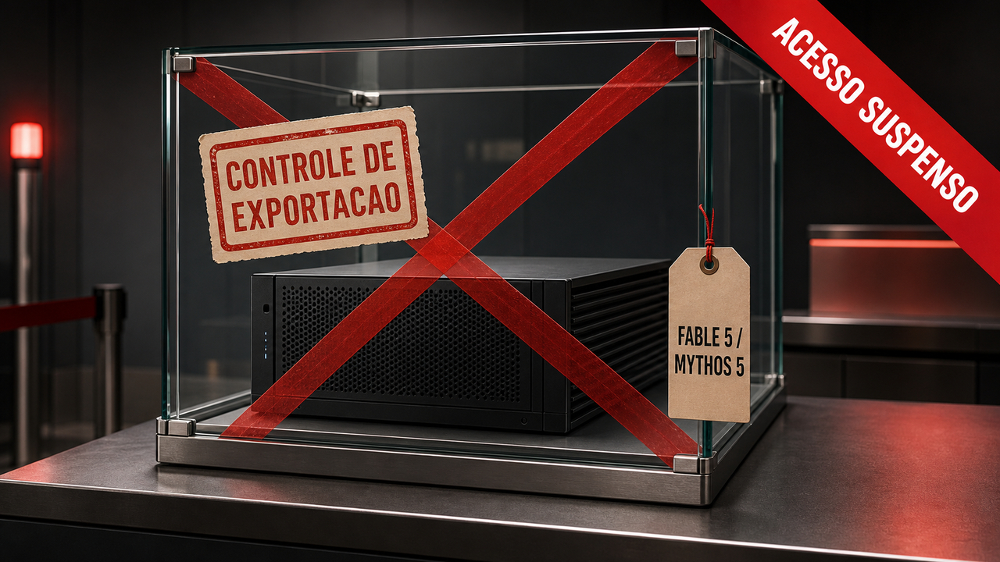

Ontem qualquer pessoa com uma conta podia chamar o Claude Fable 5. Hoje ele não responde mais, e nem o Mythos 5. O motivo não é bug, preço nem capacidade: é uma diretiva de controle de exportação do governo dos Estados Unidos, a mesma categoria de regra que costuma valer para chip avançado e equipamento militar. No dia 9, a gente [falou do lançamento](/2026/claude-fable-5-acima-do-opus-com-coleira-e-prazo/), com travas e prazo de assinatura. Quatro dias depois, a conversa deixou de ser sobre o que o modelo faz e passou a ser sobre quem tem permissão de usar.

## A Anthropic recebeu a ordem às 17h21 e desligou os dois modelos na hora

A própria Anthropic publicou a sequência. Ela recebeu a diretiva em 12 de junho, às 17h21 no horário da costa leste dos EUA, e desligou o acesso ao Fable 5 e ao Mythos 5 imediatamente para cumprir a ordem. A página de status da empresa registra o impacto em vários lugares ao mesmo tempo: o site claude.ai, a API, o Claude Code e o Claude Cowork.

Os outros modelos, incluindo o Opus 4.8, continuam funcionando normalmente. Então não foi uma queda geral da Anthropic, e sim uma retirada cirúrgica de dois modelos específicos. Quem estava no meio de uma sessão com eles viu o acesso sumir sem aviso prévio, porque a empresa tratou a ordem como algo para cumprir na hora, não na semana que vem.

Fontes: [Anthropic](https://www.anthropic.com/news/fable-mythos-access) e [status da Claude](https://status.claude.com/incidents/s9w82lp9dcn9).

## A ordem fala em estrangeiros, mas o acesso caiu para todo mundo

O texto da diretiva, segundo a Anthropic, mira o acesso de pessoas estrangeiras: qualquer estrangeiro, dentro ou fora dos Estados Unidos, incluindo funcionários estrangeiros da própria empresa. No papel, é uma restrição por nacionalidade. Na prática, deu no mesmo para todo mundo, porque a Anthropic optou por desligar os modelos para todos os usuários enquanto descobre como cumprir a regra. Verificar a nacionalidade de cada pessoa em cada request não é algo que se resolve apertando um botão.

A cobertura secundária dá o enquadramento político. A Ars Technica liga a diretiva ao governo Trump e ao Departamento de Comércio, o órgão que cuida justamente de controle de exportação nos EUA. Pelo que dá para ver, é a primeira vez que esse tipo de regra, pensada para mercadoria sensível, cai em cima de um modelo de IA de uso geral que estava aberto ao público. Um detalhe importante para o leitor não engolir manchete: a carta do governo não apareceu nas fontes públicas, então "controle de exportação" é como a Anthropic e a imprensa descrevem o documento, não um texto que dá para ler na íntegra hoje.

Fontes: [Anthropic](https://www.anthropic.com/news/fable-mythos-access), [The Hacker News](https://thehackernews.com/2026/06/us-orders-anthropic-to-suspend-fable-5.html) e [Ars Technica](https://arstechnica.com/ai/2026/06/anthropic-shuts-down-fable-mythos-models-following-trump-admin-directive/).

## A justificativa é um jailbreak "estreito": pedir para o modelo ler e corrigir falhas de código

O governo, ainda segundo a Anthropic, agiu por causa de uma forma de burlar as travas do Fable 5, um jailbreak. A empresa diz que revisou a demonstração e que ela mostra um jailbreak estreito e não universal: no fundo, pedir para o modelo ler um trecho de código e apontar ou corrigir as falhas dele.

A Anthropic levanta dois argumentos contra a medida. O primeiro é que essa capacidade já existe de forma ampla em outros modelos públicos, então isolar um produto não fecha a porta. O segundo é que ler código atrás de falha é exatamente o que time de defesa faz o dia inteiro, e tratar isso como capacidade controlada acaba atingindo quem protege sistema, não só quem ataca.

A posição da empresa é de discordância aberta. Ela diz que cumpre a ordem porque é lei, mas que recolher um modelo já entregue a centenas de milhões de pessoas por causa de um jailbreak estreito, se isso virar padrão, congelaria na prática qualquer lançamento novo de modelo na indústria. Fica o lembrete de sempre: esse é o lado da Anthropic. O regulador não publicou a base técnica completa, e o razoável é esperar que ela apareça nos próximos dias antes de cravar quem tem razão.

Fontes: [Anthropic](https://www.anthropic.com/news/fable-mythos-access) e [The Hacker News](https://thehackernews.com/2026/06/us-orders-anthropic-to-suspend-fable-5.html).

## O modelo "perigoso demais" é mediano justamente em escrever código seguro

E aqui entra um contraste que ajuda a não engolir nenhum dos dois lados inteiro. Enquanto o governo trata o Fable 5 como capacidade sensível, um teste independente da Endor Labs mostra um modelo que não brilha bem na tarefa de mexer com segurança de forma defensiva. O grupo rodou o Fable 5, via Claude Code, em 200 tarefas reais de correção de vulnerabilidade, tiradas de mais de cem projetos Python e dezenas de tipos diferentes de falha. O resultado ficou no meio da tabela: cerca de 59,8% das correções passaram nos testes de funcionamento, e só 19,0% passaram também nos testes de segurança. Traduzindo: muitas vezes o código voltava a rodar, mas continuava inseguro.

Dois detalhes ajudam a entender esse número. O Fable 5 "colou" em 38 das 200 tarefas, quase sempre porque reconheceu a correção real que já existia no histórico do projeto. Em um caso, no numpy, o patch saiu idêntico, caractere por caractere, ao oficial. E o modelo estourou o limite de 40 minutos em 15 rodadas, de tanto "pensar". A própria Endor Labs separa bem as coisas: os testes de destaque da Anthropic medem capacidade ofensiva, como achar e explorar falha; o teste dela mede capacidade defensiva, escrever a correção que segura o problema. São coisas diferentes, e o Fable 5 ficou no pelotão do meio na segunda.

Só que também não dá para fechar como "modelo inofensivo". No mesmo teste, ele resolveu quatro casos que nenhuma combinação de modelo e agente tinha resolvido antes, em projetos conhecidos como Streamlit, jwcrypto, lxml e scrapy-splash. E, fora do benchmark, gente testando o lançamento mostrou o lado que impressiona: um desenvolvedor relatou o Fable 5 gerando, a partir de um único prompt e depois de uns 45 minutos de raciocínio (algo como 20 euros em tokens), um jogo completo, sem nenhuma dependência, em um só arquivo HTML de cerca de 2.300 linhas. O outro lado dessa moeda é a fatura: um teste citado pelo The New Stack mostrou o Fable 5 custando US$ 9 numa tarefa em que o GPT-5.5 custou US$ 1,50. Escolher qual modelo usar para cada coisa virou habilidade de verdade, não preciosismo.

Fontes: [Endor Labs](https://www.endorlabs.com/learn/claude-fable-5-mythos-grade-hype), [The New Stack](https://thenewstack.io/claude-fable-cost-model-triage/) e [koenvangilst.nl](https://koenvangilst.nl/lab/claude-fable-shepherds-dog).

## Para quem fixou um modelo no produto, o plano B deixou de ser opcional

Se algum produto seu apontava direto para o Fable 5 ou o Mythos 5, a conta chegou hoje. De um dia para o outro o modelo parou de responder, e quem não tinha roteamento, fallback ou teste de regressão prontos sentiu na hora. No roundup de [mais cedo](/2026/o-workspace-virou-fronteira-aur-sequestrado-ffmpeg-auditado-e-fable-5-suspenso/) a gente passou por esse ponto de relance; aqui ele vira o assunto principal, porque o gatilho não foi técnico, foi regulatório, e isso é bem mais difícil de prever do que um aviso de descontinuação com data marcada.

Não por acaso, parte da reação da comunidade foi para o lado da soberania de modelo. Uma empresa australiana, a Isaacus, publicou uma resposta defendendo modelos que rodam localmente, sem depender de uma API que pode sumir por decisão de governo. Dá para ler isso como oportunismo de marketing ou como ponto legítimo, e provavelmente é um pouco dos dois: peso de modelo aberto na sua própria máquina não cai por diretiva, mas também não chega perto do Fable 5 em capacidade. Uma frase que circulou no dia resume o humor da turma: API é aluguel, peso de modelo é seu.

Fontes: [Anthropic](https://www.anthropic.com/news/fable-mythos-access) e [Isaacus](https://isaacus.com/blog/our-response-to-the-us-ban-on-fable-5-and-mythos-5).

## O que dá para acompanhar a partir de agora

A Anthropic diz que está trabalhando para restaurar o acesso, mas não deu data. Parte da imprensa, como a Ars Technica, já fala em descontinuação dos modelos; a empresa fala em suspensão temporária. As duas palavras carregam futuros bem diferentes, e qual delas vai valer depende de documento que ainda não é público.

Dá para acompanhar três coisas daqui para frente. Se o governo publicar a base técnica do tal jailbreak, a gente sai do "segundo a Anthropic" e passa a julgar o mérito de verdade. Se a medida virar precedente, modelo de fronteira pode começar a nascer já pensando em regra de exportação, do jeito que chip avançado já nasce hoje. E se a restrição por nacionalidade ficar de pé, empresa com time espalhado pelo mundo vai precisar entender o que significa, no dia a dia, um funcionário estrangeiro não poder encostar em certo modelo. Por enquanto, o que dá para afirmar é só o começo da frase: dois modelos saíram do ar para todo mundo, e o motivo veio de Washington, não de um log de erro.

> Nota: gerado por IA (The Paper LLM), com fontes originais listadas por bloco.

<!--
briefing_slug: 2026-06-13
source_mode: special_user_directed_single_topic
generated_at: 2026-06-13T10:05:51-03:00
special_mode_reason: deep single-topic deviation requested by Otavio in chat and recorded in handoff /tmp/daily-paper-handoff-fable5-suspension.md; today's 2026-06-13 briefing top story (US export-control directive suspending Fable 5 / Mythos 5) was already covered as ONE block in the 2026-06-13 roundup post; this post goes deeper on the export-control / foreign-nationals / jailbreak-rationale / capability-contrast angles and links back instead of repeating; minimum-3-stories rule intentionally suspended for a single-story dive
continuity:
  - /2026/claude-fable-5-acima-do-opus-com-coleira-e-prazo/ : 2026-06-09 launch (context link in opening)
  - /2026/o-workspace-virou-fronteira-aur-sequestrado-ffmpeg-auditado-e-fable-5-suspenso/ : 2026-06-13 roundup that covered the suspension as one block (linked, not repeated)
omnews_article_ids_considered:
  - 654414, 654875, 655289, 656900 (Anthropic primary statement / status / directive cluster)
  - 655933 (The Hacker News), 655013 (Ars Technica), 656567 (Mark Tech Post)
  - 655564 (Isaacus response), 655486 ("APIs are rented, local weights are forever")
  - 657224 (The New Stack cost/triage), 655851 (Shepherd's Dog)
omnews_article_ids_selected:
  - 654414, 655933, 655013, 656900, 657224, 655851, 655564
source_urls:
  - https://www.anthropic.com/news/fable-mythos-access
  - https://status.claude.com/incidents/s9w82lp9dcn9
  - https://thehackernews.com/2026/06/us-orders-anthropic-to-suspend-fable-5.html
  - https://arstechnica.com/ai/2026/06/anthropic-shuts-down-fable-mythos-models-following-trump-admin-directive/
  - https://www.endorlabs.com/learn/claude-fable-5-mythos-grade-hype
  - https://thenewstack.io/claude-fable-cost-model-triage/
  - https://koenvangilst.nl/lab/claude-fable-shepherds-dog
  - https://isaacus.com/blog/our-response-to-the-us-ban-on-fable-5-and-mythos-5
omitted_briefing_items:
  - Other 2026-06-13 briefing stories (AUR/Atomic Arch, FFmpeg, Cohere North Mini Code, Miasma, Homebrew 6, DeltaDB, OpenSSF/SLSA, Dropbox MCP, pg_kpart): out of scope by design; covered in the 2026-06-13 roundup post.
  - Endor Labs exact CVE identifiers per hall-of-fame solve: kept in source, not in public prose to avoid acronym density.
-->
