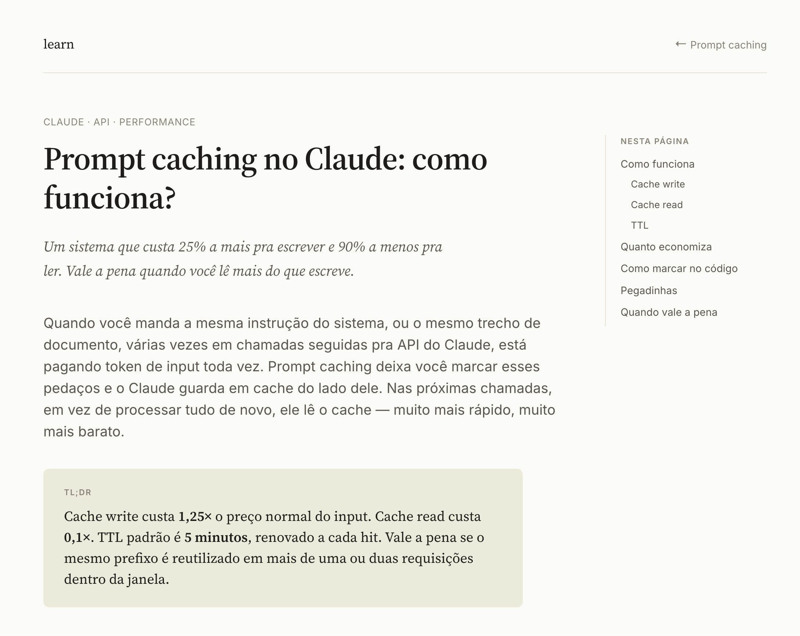
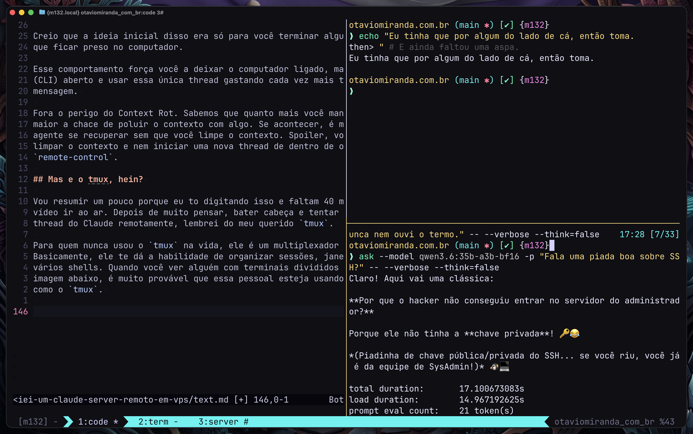

A história começa comigo descobrindo um template do Claude Code nos templates de
sistema operacional do VPS. Ele só dizia que era um "Ubuntu 24.04 LTS com Claude
Code".

Eu já instalei agentes de IA quando subo servidores
[para fazer o hardening](https://github.com/luizomf/vps_deploy_template/blob/main/DEV_GUIDE.md)
tantas vezes, que essa etapa já tá quase entrando no meu script principal.

## Em vídeo

Caso queira assistir ao vídeo, repliquei exatamente o que descrevo aqui:

- [https://youtu.be/fdWBSN9wkv0](https://youtu.be/fdWBSN9wkv0)

## O template e hardening

Como eu já ia formatar o VPS para fazer outro vídeo (em breve), pensei: "vou
testar esse template do Claude". E, ele funciona. (Sério 😬? Num brinca.)

É uma instalação normal do Ubuntu 24.04 que vem com o Claude Code instalado.

Nada demais. Mas é menos um passo para me preocupar.

Como sempre, a primeira coisa que fiz foi criar o meu usuário próprio do VPS
para sair do `root`. Dizem por aí que é pecado usar `root` direto no servidor.
Vamos respeitar.

Depois, autentiquei no Claude Code e pedi para ele fazer o hardening usando a
base do meu
[DEV_GUIDE](https://github.com/luizomf/vps_deploy_template/blob/main/DEV_GUIDE.md).

Já fiz isso antes, inclusive em vídeo do canal.

O fato é que eu adoro digitar. Mas já não aguento mais fazer hardening de
servidor.

Depois que terminei tudo, percebi que o servidor ainda não tinha o Docker
instalado. O outro template que eu estava acostumado a usar tinha um nome
criativo e sugestivo. Ele já te dá uma dica do motivo de isso não estar no meu
script principal: "Ubuntu 24.04 LTS com Docker".

Pedi ao `claude` para instalar o Docker e o Traefik para mim. Também apontei um
registro `A` do DNS com valor `*` (tudo) para o IP do servidor. Não vou colocar
o [domínio real](https://learn.otaviomiranda.cloud) porque quando você for ler
isso é provável que já esteja fora do ar.

Mas o negócio do DNS facilita demais a criação de subdomínios no estilo
`otaviomiranda.cloud`, `learn.otaviomiranda.cloud`, etc.

E pronto, mais um VPS configurado com sucesso.

Fechei o laptop e fui dormir.

(Mentira, eu não fecho laptop e também quase nunca durmo, mas ficou melhor na
história)

## Acordei com um artigo

No outro dia pela manhã, vi o tweet do
[Thariq](https://x.com/trq212/status/2052809885763747935) e gostei muito da
ideia de trocar Markdown para HTML. Só que, apenas em alguns casos mais
específicos.

Pensei nisso mais para estudos em geral.

Quando você está estudando um assunto novo, ficar cheio de fontes em Markdown e
notas é bem chato. Fora meus post-its amarelinhos (de verdade e escritos à mão).

Acho que HTML pode ajudar mais nessa parte, porque você pode fazer uma página
bem mais interativa. Isso deixaria qualquer assunto mais interessante. Talvez
até mais bonito.

Eu simplesmente peguei o post do _Thariq_ e mandei para o Claude explicando que
queria que ele fizesse um layout similar para eu gerar documentos sobre assuntos
que eu estivesse estudando.

Ele gerou isso:

Isso é só uma página bonitinha de várias outras que ele gerou para mim. Tudo
indexado perfeitamente. Do jeito que está, adicionar uma busca, mudar o layout e
adicionar interatividade fica bem fácil.

Então ele subiu isso no Docker, atrás do domínio `learn.dominio.com` e o
restante das páginas no formato de subdiretórios, como em
`learn.dominio.com/o-assunto-aqui`.

Também usou o Traefik para adicionar TLS (HTTPS) automaticamente e
gratuitamente.

Tudo ficou muito bom, mas eu queria mais. Eu queria aquela ideia do "assistente"
que vemos no `Hermes Agent` ou no `OpenClaw` quando você adiciona alguma bridge
qualquer de aplicativos de mensagem.

A gente acostuma tanto com isso, que quando não tem sente falta. Como eu iria
falar para o agente criar aquela minha ideia genial enquanto estivesse no
mercado?

## Claude Remote control

Já faz algum tempo que isso existe, mas eu sempre esbarrava no mesmo problema:
**contexto**.

Você pode usar o comando `claude --remote control` ou `/remote-control` para
iniciar uma thread que pode ser controlada por outros apps do Claude, como:
Claude Desktop, Claude Web e Claude Mobile. O CLI passa a funcionar como um
"servidor" e suas mensagem ficam sincronizadas entre todos os dispositivos
conectados.

Isso perde um pouco o propósito se você forçar.

Por exemplo: se eu inicio uma seção com o `--remote-control` e saio para fazer
alguma coisa, só tenho aquela única thread disponível para tudo. E outra, só no
computador onde iniciei o Claude Code (o CLI).

Creio que a ideia inicial disso era só para você terminar algum serviço sem ter
que ficar preso no computador.

Esse comportamento força você a deixar o computador ligado, manter o Claude Code
(CLI) aberto e usar essa única thread gastando cada vez mais tokens a cada
mensagem.

Fora o perigo do Context Rot. Sabemos que quanto mais você mantem um único chat,
maior a chace de poluir o contexto com algo.

Se acontecer, é muito difícil o agente se recuperar sem que você limpe o
contexto. Spoiler, você não consegue limpar o contexto e nem iniciar uma nova
thread de dentro de outra thread via `remote-control`.

## Mas e o tmux, hein?

Vou resumir um pouco porque eu to digitando isso e faltam 40 minutos para este
vídeo ir ao ar, então...

Depois de muito pensar, bater cabeça e tentar criar uma nova thread do Claude
remotamente, lembrei do meu querido `tmux`. (Nem tentei tanto assim, isso é só
pra dar ênfase no texto).

Para quem nunca usou o `tmux`, ele é um multiplexador de terminal.

Basicamente, ele te dá a habilidade de organizar sessões, janelas e painéis com
vários shells.

Quando você ver alguém com terminais divididos na tela como na imagem abaixo, é
muito provável que essa pessoal esteja usando um multiplexador como o `tmux`. Ou
um desses terminais modernos, tipo Ghostty.

Eu sei que você achou que eu não estava digitando mesmo, mas vou te perdoar
dessa vez. A imagem acima mostra o `tmux` usando painéis para dividir uma janela
dentro de uma sessão. Também esse trecho do meu texto (que acabei de corrigir e
ficou diferente) e que a IA não tem a mínima noção sobre o que é uma piada. Leia
a piada do Qwen. Eu nem entendi o propósito ali.

Enfim, não estou te dando um curso de `tmux` e nem falando para você usar isso
(mas use, vai por mim). O ponto é que as `sessions` precisam de uma `window`
(janela) e essa janela precisa de um shell. Isso é o que permite que o `tmux`
rode vários "terminais" em background. Fora buffers e outras coisas que nem vou
falar (porque eu nem sei).

O que eu pedi para o `claude` fazer foi testar com `tmux`.

Quando quero que ele inicie uma nova thread no Claude Code (CLI), ele cria uma
`session` no `tmux`; essa `session` entra com uma `window` e dentro da `window`
um shell rodando um `claude -n nome-da-thread --remote-control`.

Funcionou perfeitamente. Então criamos um
[script](https://github.com/luizomf/claude-vps-studio/blob/main/bin/claude-thread)
que faz isso automaticamente.

Quando percebi o quão bem isso estava funcionando, pedi ao `claude` para pegar
tudo o que fizemos no servidor e jogar em um repositório público para ficar
fácil de replicar.

No final, eu só sobrei com este texto, o vídeo lá em cima, que eu sei que você
foi assistir ao invés de ler, e
[este repositório](https://github.com/luizomf/claude-vps-studio) que você também
pode usar se quiser.

Agora deixa eu publicar isso que tô atrasado... 18h01 😅. Até o próximo.
