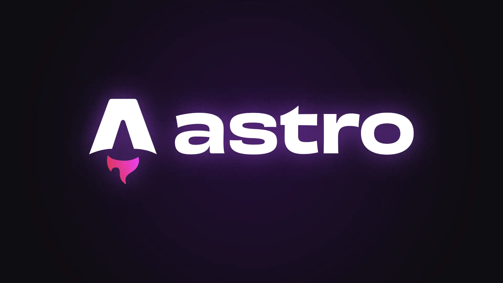

Já tem alguns dias que estou falando sobre esta migração na
[comunidade do meu canal](https://www.youtube.com/@otaviomiranda/posts). Hoje,
finalmente terminei!

Meu site foi de **HTML, CSS e JavaScript PUROS** para o
[Astro](https://astro.build/) (_usando SSG - Static Site Generation_).

Além disso, este foi um dos primeiros projetos em que mais administrei do que
digitei código. Diria que **95%** do código atual foi escrito por 3 LLMs
diferentes: **Claude Code** _(Opus 4.6)_, **Codex App** _(GPT 5.3 Codex High)_ e
**Antigravity** _(Gemini 3.1 Pro High)_. Também usei variações desses modelos
para tarefas simples ou mais complexas.

Usando um arquivo de regras simples, `git` e GitHub, consegui manter o contexto
do que estava em andamento até a conclusão do projeto. Isso me permitiu até
mesmo trocar de modelo ao longo da migração sem muitos problemas.

Vamos entender mais detalhes sobre isso adiante.

Mas, primeiro vamos garantir que você não vai cometer os mesmos erros que eu.

---

## Meu erro ao usar HTML, CSS e JS puros

Ao criar um website com HTML, CSS e JS puros, é muito provável que você termine
com uma estrutura assim (ou variações disso):

```
.
├── css
│   └── styles.css
├── images
│   └── ...
├── js
│   └── scripts.js
├── 2025
│   ├── meu-post-1
│   │   └── index.html
│   ├── meu-post-2
│   │   └── index.html
├── 2026
│   ├── meu-post-3
│   │   └── index.html
│   ├── meu-post-4
│   │   └── index.html

... vários anos e posts ...

│ 
└── index.html
```

No começo, isso parece uma boa ideia.

Só que, sem um padrão ou framework, você vai precisar copiar e colar o diretório
de uma página para criar outra (ou inventar uma outra maneira qualquer).

Com o passar do tempo, isso vai fazer você terminar com centenas de páginas com
variações levemente diferentes do `index.html`.

Todas com repetições do mesmo cabeçalho, rodapé, menu e qualquer outra coisa que
estiver no seu layout.

Como todo bom **dev**, cheio de projetos para entregar, você vai pensar:

> "Se funciona, vou manter como está! Se precisar, depois melhoro a estrutura."

### Tudo vai ficar bem até que...

Você precisa alterar algo.

Pense que você criou um site de notícias que fala de assuntos variados. Como são
muitos assuntos, você pode publicar mais de uma vez por dia. Então, rapidamente
você tem 999 notícias.

Só que algo passou despercebido na vigésima quinta notícia que você publicou. Um
erro de digitação no rodapé do seu `index.html`. O seu hábito de copiar e colar
clonou este erro para mais 974 páginas.

Ao publicar sua próxima notícia, você percebe que é um grande momento, mas
aquele erro está pegando mal. Então você pensa:

> "Um script Python resolve!"

Talvez! Mas, se isso ainda não tinha passado pela sua cabeça, de agora em diante
você lembra disso o tempo todo.

> "E se aparecer outro erro?"  
> "E se eu tiver que alterar o layout e o CSS?"  
> "E se eu quiser adicionar ou remover um link de menu?"

Refatorar todo o site nessa altura do campeonato é complicado. Você está com
vários outros projetos em andamento. Deadlines batendo na porta.

Seu script não vai capturar todas as nuances dos posts, porque todo ser humano
tem bursts de dopamina que geram micro alterações de código ao longo do tempo.

E nós sabemos que você nunca voltou para alterar todos aqueles quase 1000 posts.

### As janelas estão quebradas...

A partir daqui, começa a acontecer algo muito parecido com a
[teoria das janelas quebradas](https://pt.wikipedia.org/wiki/Teoria_das_janelas_quebradas).

Você passa a "vandalizar" seu próprio site. Adiciona "só mais um script" para
alguma coisa específica, "um ajuste de margem aqui", "uma div ali"... Este site
nunca vai estar perfeito.

Isso vai rapidamente da empolgação de algo novo para o _"medo de quebrar outro
trecho do site"_, para o _"Eu não ligo mais"_.

Um belo dia, você simplesmente para de publicar completamente. Só manter o que
já tem, já será sua vitória.

Exatamente o que aconteceu comigo.

---

## A refatoração mal sucedida

Com o advento dos agentes para código com LLMs cada vez mais inteligentes, criei
coragem para fazer essa refatoração. Mas, antes de colocar qualquer IA no
projeto tive essa ideia brilhante:

> "Vou refatorar isso aqui na mão mesmo mantendo HTML, CSS e JS"

Claro! Vamos cometer o mesmo erro duas vezes seguidas. Já que vamos errar,
erramos em tudo o que for possível para não restar dúvidas sobre o erro 😅.

Olhei algumas tendências no CodePen e Dribbble. Não sou bom com design, por
isso, tudo que adiciono nos meus layouts vem de coisas que vejo na Internet e
gosto.

### Meu único código do projeto

Decidi que queria uma section `Hero` no topo do site com um texto bem grande e
centralizado.

Me inspirei no design do [Antigravity](https://antigravity.google/), com as
partículas interativas que ficam se mexendo suavemente.

Cheguei a fazer 3 efeitos de background para decidir qual usar. Estão todos
abaixo:

- [Primeiro canvas](https://codepen.io/luizomf/full/ZYOdpdx)
- [Segundo canvas](https://codepen.io/luizomf/full/yyJdoWP)
- [Final (Home do site)](https://www.otaviomiranda.com.br/)

Perdi uns 2 ou 3 dias com isso, mas consegui um resultado que me agradou.

E essa foi minha única participação em digitação de código neste projeto. O
canvas e o JavaScript que o acompanha.

### Desistência

Cheguei a colocar o canvas na página inicial e fazer alguns ajustes de fonte.

Queria (e consegui) criar um site onde o conteúdo vem primeiro. Principalmente
na [parte dos posts](/blog/1/).

Usei uma fonte grande, muito bem espaçada e não tenho anúncios, pop-ups,
cookies...

Nada além do conteúdo.

### Código antigo embaixo da cama

BoOoO 👻!

Mesmo tentando remover o máximo de coisas do código antigo sem quebrar nada,
mexer em uma parte do CSS ou JS antigo estragava outras partes do site.

Trocar o tamanho de algo, significava ter que sair conferindo todas as outras
páginas. Confesso que nem forcei, com uma ou duas tentativas, já desisti disso e
fui atrás de solução.

> Eu: Me indique um bom framework para SSG em 2026.  
> IA: Astro!

Como eu ainda não havia usado o **Astro**, vamos checar do que se trata.

---

## Astro is a JavaScript web framework 🤮🫣☺️💜

Ao entrar no [astro.build](https://astro.build/), adivinha a primeira coisa que
vejo?

_"Astro is a JavaScript web framework"_ (sentiu um calafrio aí?).

Toda vez que vejo as palavras **JavaScript** e **Framework** juntas, a vontade é
tapar os ouvidos e ficar gritando: _"lá lá lá lá lá, não quero saber..."_.

Se você já usou a quantidade de frameworks e libs de JS que eu, deve ter a mesma
sensação. No final você só quer não usar nada.

Mas, o Astro foi diferente.

### Conceitos do Astro

Olha só que coincidência, alguns dos conceitos do **Astro** falaram diretamente
comigo, como se eu estivesse em uma consultoria com o framework:

- Servidor primeiro: _"O Astro melhora o desempenho do seu website
  **renderizando componentes no servidor**, enviando HTML leve para o browser,
  com **zero overhead de JavaScript desnecessário**."_
- Voltado para conteúdo: _"O Astro foi criado para trabalhar com o seu conteúdo,
  não importa onde ele estiver. **Carregue dados do seu sistema de arquivos**,
  APIs externas ou seu CMS favorito."_
- Personalizável: _"Estenda o Astro com suas ferramentas favoritas. Traga sua
  própria UI de componentes, bibliotecas JS, temas, integrações e mais."_

Interessante! Tudo isso realmente está lá no site deles. Agora, quer mais?

### Astro Islands

Se você já usou qualquer framework ou lib JavaScript, deve ter notado que
queremos encapsular o máximo de coisas de um componente.

Isso evita o problema que eu tive na minha refatoração falha. Editar algo e
quebrar outro componente. Mas, até o momento, eu fazia isso com um único
framework.

O **Astro** permite criar ilhas (islands) dentro da página. Dessa forma, um
componente pode usar _React_, outro _Vue_, outro pode ter **somente HTML puro**.

Então não vamos procurar mais.

### Fechado com Astro 💜

A partir daqui o negócio até que fluiu bem.

Só tem aquele fato que mencionei antes _"ainda não havia usado o **Astro**"_.
Então deixa eu chamar os LLMs e começar os trabalhos.

---

## LLMs: problemas e soluções

O meu intuito com a IA neste projeto não é fazer "Vibe Coding". É o oposto.
Quero a IA trabalhando como um colega qualquer (que digita 1000x mais rápido do
que eu).

Mas, temos um grande problema atualmente: **NÃO EXISTE UM PADRÃO**.

Como tudo é muito novo, o que posso te passar são apenas experiências que tive
**TESTANDO** algumas coisas.

### O problema do contexto

Sempre que você inicia um novo agente no projeto, ele vem **em branco**. É como
um desenvolvedor entrando em uma base de código **pela primeira vez**. Precisa
ler a documentação ou todo o projeto para entender o que será feito.

O problema é que agentes têm limites de tamanho na janela de contexto e, mesmo
que não tivessem, também existe o problema do
[Context Rot](https://medium.com/@pfarzana1313/context-rot-why-bigger-isnt-always-better-for-llms-091f1bdcfb83).

Se você quer fazer algo grande sem dores de cabeça, a melhor opção é seguir a
técnica de _dividir para conquistar_. Divida o problema em partes pequenas o
suficiente para serem gerenciadas e resolva as pequenas partes uma por vez.

Foi exatamente o que fiz, com alguns percalços até encontrar algo que funcionou.

### Primeira tentativa: AGENTS.md

No meu arquivo `AGENTS.md`, só apontei o modelo para outros arquivos separados:

- `MEMORY.md` - estado da sessão, o que foi feito e o que falta fazer (tipo um
  `CHANGELOG` mas para o LLM).
- `SOUL.md` - personalidade e tom do agente (seja conciso, fale em inglês, etc).
- `USER.md` - Meu nome, softwares disponíveis e coisas relevantes sobre o
  usuário (eu).
- `AGENTS.md` - Aponta o agente para os arquivos anteriores.

A ideia era simples: antes de fazer qualquer coisa, a IA lê esses arquivos e
segue as regras.

Terminou o código, atualiza o `MEMORY.md` com o que aconteceu e faz um commit do
que mudou. Assim eu só reviso o commit no final.

Se eu precisar trocar de modelo ou simplesmente limpar o contexto, o `MEMORY.md`
lembra tudo para a IA.

**Quando funciona (caminho feliz):**

De início, achei que esse era o modo perfeito. Trabalhei tranquilamente uma
manhã inteira dessa forma. Gemini, Codex e Claude respeitaram as regras e eu
estava revisando o código.

Chamei isso de "loop":

```
Prompt para a tarefa:
  LLM:
    -> AGENTS.md
      -> SOUL.md
      -> USER.md
   -> Faz o código
      -> MEMORY.md (Contexto)
      -> commit (Contexto)
  EU:
    -> reviso
```

**Problema:**

Quando a task era mais complexa, todos os modelos falhavam. E o pior, não dava
pra saber onde seria a falha.

Corrigi isso adicionando as regras direto no arquivo global de cada LLM
(`GEMINI.md`, `CODEX.md` e `CLAUDE.md`). Esses arquivos sempre são lidos, então
elas não esquecem. Mesmo assim, ainda passava alguma coisa sem atualização.

Como percebi que eles estavam sempre fazendo o `commit`, adicionei um hook
validando minhas regras. Se o modelo tentasse fazer `commit` sem atualizar
`MEMORY.md`, eu gerava um erro explicando as regras de novo.

Isso funcionou? Sim! Mas com vários problemas.

Primeiro, o hook atrapalha você também. Quando você for fazer algum `commit`,
seu hook vai fazer você ter que atualizar o `MEMORY.md` também 😂.

Segundo, a fricção do modelo com este sistema. Se você ficar olhando ele
trabalhar, vai ver isso:

- Modelo faz o código
- Tenta fazer `commit` sem atualizar a memória
- Erro no `commit`
- Modelo volta e lê o `AGENTS.md` novamente
- Atualiza o `MEMORY.md`
- Faz o `commit`
- Te avisa que esqueceu do `MEMORY.md`, mas corrigiu

Trabalhei alguns dias assim. Mas, essa fricção estressa você e atrapalha o
modelo. Então tentei outra coisa.

### Issues, Branch, PR e Merge

Regras em um único arquivo global do modelo. Para cada modelo, usei seu próprio
arquivo (`GEMINI.md`, `CODEX.md` e `CLAUDE.md`). Sem espalhar dados em outros
arquivos.

```md
# NOME_MODELO.md

- Quem sou eu e como me trate
- O que é o projeto
- Decisões de arquitetura
- Regras do workflow (já explico)
```

Nessas regras do workflow, fiz o modelo trabalhar como qualquer outro
desenvolvedor. Vai fazer algo novo no projeto? Ok, siga esses passos:

- Abra uma _Issue_ no repositório
- Crie um novo _Branch_ para o que for fazer e faça
- Terminou? Crie uma _Pull Request_
- Eu reviso a PR e faço o merge

Por incrível que pareça, nenhuma IA erra nunca neste processo. Creio que elas
foram bem treinadas em código open source 😅.

Mas e o contexto? Elas sabem usar o git muito bem. Só avisar o processo para o
modelo que ele vai ler _Issues_, histórico de `commits`, etc.

Por falar nisso, você também nem precisa conversar com o modelo usando
mensagens. Abra uma _Issue_ no repositório e avise ao modelo:

> "Trabalhe na issue #N"

Simples assim!

### Os três modelos

Os modelos que usei foram:

**Claude Code** _(Opus 4.6)_ via Claude CLI: Muito bom, mas é o mais caro deles.
Além disso, ele é o que tem menos limite nos meus planos. Meu plano atual é o
Max 5x (e ele bateu limite várias vezes). Ainda tem um plano acima, o 20x (mais
caro ainda). Depois tem a API. Aí o preço não faz nem sentido para mim.

**Codex** _(GPT 5.3 Codex High)_: não usei o CLI porque o **Codex App** está com
uma promoção que te dá o dobro de tokens até abril. Então, vamos economizar, não
é? Eu não chequei essa informação, mas mesmo usando o **Codex App** um dia
inteiro, não vi onde é o limite (e meu plano é o plus, o mais barato).

**Antigravity** _(Gemini 3.1 Pro High)_: eu não sei o motivo, mas eu considero
que "ganhei" o acesso aos produtos do Gemini. Eu já assinava o **Google One**
para backup no **Google Drive**. Um belo dia incluíram o **Gemini** no plano.
Com ele eu também não vi o limite. Mas, pode ser que tenha acontecido. Em alguns
momentos, o modelo começava a dar erro e parava de funcionar. Não sei se foi por
causa do volume de uso ou limite mesmo. Acontece que o **Gemini 3.1 Pro** acabou
de ser lançado. Nesses momentos, todo mundo quer testar o novo modelo, então
erros são mais comuns.

**O ponto principal:**

Neste projeto, como era algo mais simples, não vi diferença entre os modelos.
Foi muita **cópia** e **cola** do velho para o novo, e todos os modelos se
saíram muito bem.

Tentei usar um por dia. Quando começava os trabalhos pela manhã, já iniciava com
um deles e ia até o final do dia.

Em alguns dias eu fui forçado a trocar por erro (Gemini) ou por limite (Claude).

### O que eles construíram?

Se você está lendo isso no meu site, tem a mão deles aí. Foram aproximadamente 2
semanas, comigo basicamente dirigindo e revisando.

- Sistema de layouts com componentes reutilizáveis
- Content Layer API com schemas Zod para validação de frontmatter
- Syntax highlight nativo via Shiki (zero JS client-side para blocos de código)
- Pipeline de deploy automático via GitHub Actions
- Sitemap automatizado
- Editor Markdown no browser com Monaco e Vim mode
- CLI para criação de posts (`npm run post "Título"`)
- Remoção de ~4.000 linhas de código legado
- Dark mode (somente nos posts)
- E mais coisas que eu talvez tenha esquecido.

A única parte que eu fiz foi o canvas de partículas na home.

### A lição

É simples: só tratei modelos de IA como qualquer outro desenvolvedor:

```
Issue -> branch -> commit -> revisão (VOCÊ) -> merge (VOCÊ)
```

Pelo menos até o momento em que escrevi isso, este foi o modelo que melhor
funcionou.

---

## Conclusão

Este post começou com um site quebrado e o medo de tocar em qualquer coisa.

Termina com o Astro e `builds` automáticos no **GitHub Pages**. Além disso,
também aderi ao modelo de _Issues_. Antes eu fazia `push` direto no `main`. Isso
me permite até ter rascunhos de posts 😂.

A lição não é sobre o Astro, sobre IA ou sobre nenhuma ferramenta específica.

Quando algo está quebrado e doloroso, a solução quase nunca é _"só mais um
script"_. É começar de novo com fundações melhores, mesmo que isso signifique
engolir o orgulho e usar outro `FrameworkJavaScript` (as duas palavras coladas
uma na outra pra você 🤬).
