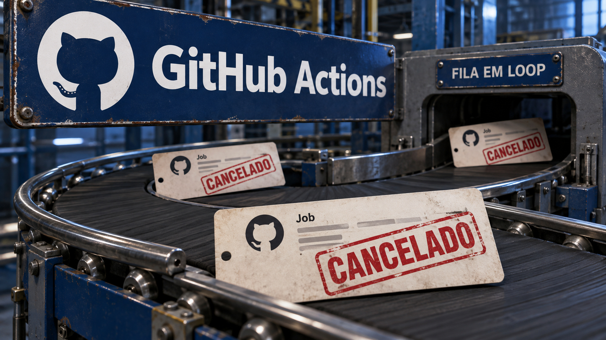

Você entrega um contexto enorme ao agente e fica esperando a resposta. Antes da primeira palavra, o modelo já tem bastante serviço: processar tudo aquilo que recebeu. O novo DeepSeek-V4.1-Flash separa esse processamento da geração e promete guardar menos estado de atenção. Para quem mantém conversas longas, interessa. Só confira qual memória diminuiu antes de abrir a calculadora. Parâmetros ativos, cache e pesos completos aparecem na mesma ficha, mas cada um cobra sua parte da conta.

## DeepSeek-V4.1-Flash separa o custo de ler do custo de responder

A DeepSeek publicou o V4.1-Flash, com entrada de imagem e texto, saída em texto e contexto de até um milhão de tokens. O repositório público foi criado no fim de 9 de setembro, no horário de São Paulo, e os pesos têm licença MIT. A arquitetura separa etapas do processamento e combina mecanismos para reduzir o estado guardado durante a inferência.

A espera começa no *prefill*, que é o processamento do prompt recebido. Depois vem o *decode*, a geração dos tokens seguintes. Um agente que recebe muito contexto pode gastar recursos consideráveis antes de escrever qualquer coisa. A arquitetura causal de codificador e decodificador do novo modelo tem 20 camadas de cada lado. Segundo a DeepSeek, ela ativa 8 bilhões de parâmetros por token no prefill e 16 bilhões na geração.

A palavra que merece atenção aí é “ativos”. Esses números descrevem computação por token. O conjunto principal tem **552 bilhões de parâmetros**, e a ficha lista mais 196 bilhões no mecanismo de memória condicional Engram. É esse acervo completo que entra na conversa sobre armazenamento e download; os 8 bilhões ativos, sozinhos, não demonstram que o modelo caiba numa GPU doméstica.

Outra parte da conta é o cache KV, o estado de atenção que a geração guarda para reaproveitar computação anterior. A DeepSeek descreve um mecanismo chamado CSA2, que compartilha estado relacionado ao cache e índices de atenção esparsa entre camadas. Com o armazenamento principal de KV em FP4, a empresa informa **890 bytes por token de cache global**, aproximadamente um quarto do DeepSeek-V4-Flash.

Já o SWA Bounded Replay reconstrói o estado recente da atenção por janela deslizante, em vez de persistir esse estado em SSD. Nesse caso, a DeepSeek relata uma ocupação de aproximadamente um oitavo da versão anterior para o cache KV persistente.

São duas economias em componentes distintos: um quarto do cache global e um oitavo do persistente. As proporções não se multiplicam. E os ganhos reportados pela empresa ficam nesses componentes; a redução da RAM total, da latência de ponta a ponta e da conta de inferência precisa de medição própria, com os pesos incluídos no orçamento.

Na integração, tem um detalhe menos vistoso que os bilhões e bem capaz de ocupar sua tarde: o lançamento não traz um template de chat no formato Jinja. A DeepSeek fornece um codificador de referência em Python. O projeto deepseek-recipe oferece bibliotecas Rust com bindings para Python, voltadas à conversão e à interpretação do protocolo.

Inferência, execução de ferramentas e transporte HTTP ficam por sua conta. Antes de copiar um comando de servidor, confira se ele entende essa codificação. O modelo veio com bilhões de parâmetros e algumas pontas para você ligar.

Eu avaliaria esse lançamento medindo separadamente o processamento da entrada, a geração, o estado persistido e o armazenamento dos pesos. Para um agente com muito contexto, a pergunta útil é onde, na sua carga, essa arquitetura poupa trabalho.

Fontes: [DeepSeek — ficha oficial do V4.1-Flash](https://huggingface.co/deepseek-ai/DeepSeek-V4.1-Flash) e [Hugging Face — metadados do repositório](https://huggingface.co/api/models/deepseek-ai/DeepSeek-V4.1-Flash).

## GitHub recuperou capacidade e ainda precisava se livrar dos jobs revogados

O servidor volta a ter espaço, mas a fila continua entregando trabalho que já perdeu a validade. No relatório de disponibilidade de agosto, publicado em 9 de setembro, o GitHub conta como jobs revogados prolongaram a recuperação do Actions ao continuar chegando aos runners.

[Já falamos da tempestade de retries no serviço de tokens de 17 de agosto](/2026/github-afoga-em-retries-cargo-executa-malware-e-modelos-deixam-segredos-escapar/). Desta vez, o relato detalha uma falha de 6 de agosto e um atraso de status do agente de nuvem do Copilot no dia 20. É a explicação recém-publicada de incidentes passados, sem indicação de indisponibilidade nesta manhã.

No dia 6, a troca de pods durante um deploy de rotina reduziu temporariamente a capacidade. Os locais restantes ultrapassaram seus limites. Segundo a empresa, o rollback confirmou que a causa era a capacidade perdida durante a substituição, e não o conteúdo do deploy.

Os processos auxiliares da malha de serviços sofreram limitação de CPU e reinícios por falta de memória. Daí vieram falhas em cascata de cache, DNS e APIs entre clusters. Na recuperação, apareceu um bug que já existia na atribuição de trabalho: runners recebiam jobs revogados, tentavam novamente e bloqueavam trabalho válido. A infraestrutura recuperava o fôlego. A fila continuava insistindo no que já devia ter terminado.

O GitHub precisou aumentar a capacidade, limitar a entrada de webhooks, corrigir a aquisição de jobs inválidos e drenar filas, além de elevar limites internos de requisições. Alguns runners gerenciados pelos próprios clientes exigiram recuperação manual; alguns eventos tiveram de ser disparados novamente. A recuperação automática dos runners ARC afetados ainda aparece como trabalho futuro no relatório.

Para quem desenha filas, a regra é bem concreta: **a atribuição precisa rejeitar trabalho cuja revogação já é definitiva**. Esperar mais entre tentativas não devolve validade a um job cancelado. O rollback também deixa para você a limpeza do trabalho inválido acumulado. Dá para consertar a entrada e continuar servindo o estoque estragado.

No incidente de 20 de agosto, as tarefas do agente de nuvem do Copilot continuavam executando e terminando. Quem ficava para trás era a publicação dos status e resultados, com atrasos de 60–90 minutos em alguns casos. Segundo o GitHub, nenhum trabalho de tarefa foi perdido nesse incidente.

Uma indisponibilidade do banco gerenciado aumentou a latência. As partições fixas do processamento em streaming não absorveram esse aumento, e uma configuração de armazenamento dificultou a troca para a instância de recuperação. O trabalho estava concluído antes que o usuário conseguisse enxergar isso.

Se você mantém um runtime de agentes, acompanhe execução, persistência do resultado e publicação do status separadamente. Como cuidado de projeto, reexecutar uma tarefa só porque o painel está atrasado pode repetir efeitos. O GitHub não relata duplicação nesse caso. Antes de apertar “tentar de novo”, descubra qual etapa ficou para trás.

A empresa também mudou o monitoramento de pull requests: falhas de merge, review e comentário passam a ser medidas separadamente. Um volume grande de leituras bem-sucedidas podia esconder um caminho de escrita quebrado. O painel estava recebendo votos demais de quem só veio olhar.

Fonte: [GitHub — relatório de disponibilidade de agosto de 2026](https://github.blog/news-insights/company-news/github-availability-report-august-2026/).

## PostgreSQL pode aceitar a assinatura e deixar a replicação sem lugar para avançar

O comando de criação terminou com sucesso. Beleza. Os dados estão chegando? Uma investigação de Christophe Pettus, publicada em 9 de setembro, mostra como uma assinatura de replicação lógica no PostgreSQL 18 pode ser criada enquanto o processo que aplica as mudanças falha repetidamente, sem capacidade para registrar progresso.

[Ontem, o assunto era o orçamento de memória de manutenção](/2026/deep-live-cam-leva-malware-a-instalacao-e-execcritic-mede-o-peso-do-teste-ruim/). Agora o limite é `max_active_replication_origins`, introduzido no PostgreSQL 18. Ele controla quantas origens podem ter seu progresso acompanhado ao mesmo tempo e vem com padrão de dez.

Na replicação lógica, um publicador envia mudanças e um assinante as aplica. A origem identifica de onde elas vieram; seu estado de progresso registra até onde o processamento chegou, inclusive para reconstruir essa posição na recuperação. Cadastrar essa identidade no catálogo é uma etapa. Conseguir espaço na memória compartilhada para acompanhar seu avanço é outra.

O experimento esbarra justamente nessa separação. Segundo Pettus, `CREATE SUBSCRIPTION` grava a definição no catálogo e pode retornar sucesso. Depois, o worker que aplica as mudanças tenta obter uma entrada de acompanhamento, falha por falta de espaço e é iniciado novamente. A configuração foi aceita. O worker é que vai descobrir a falta de lugar quando chegar para trabalhar.

Reservar uma entrada por assinatura também pode ser pouco. No teste do autor, o limite era dois e havia duas assinaturas. Os processos de aplicação conseguiram suas entradas, mas a cópia inicial da segunda assinatura ficou sem terminar: o worker de sincronização precisava de outra origem. A tabela permaneceu no estado `d` em `pg_subscription_rel`.

Por isso, a documentação pede capacidade para as assinaturas **mais uma reserva para sincronização de tabelas**. O tamanho da reserva depende da sincronização concorrente permitida e dos workers disponíveis. Contar só as assinaturas deixa de fora o trabalho de colocá-las em dia no início.

Depois da criação, confira os erros dos workers e o progresso das tabelas. `pg_replication_origin_status` mostra o estado de progresso acompanhado ativamente; o catálogo registra a identidade. E reserve uma janela de reinício: esse parâmetro só muda na inicialização do servidor, não com reload. Segundo o manual, configurar um valor inferior ao número de origens já acompanhadas impede a inicialização.

Pettus encontrou ainda uma armadilha na réplica física, que também reproduz registros de origens. No relato, uma réplica com capacidade insuficiente consegue iniciar e atender consultas. Ela para quando a reprodução do log de mudanças chega a uma origem que não consegue acompanhar. O teste de conexão passa, e o problema está esperando mais adiante no log.

O autor recomenda aumentar a capacidade nas réplicas físicas antes de aumentá-la no primário. Para reduzir, o caminho é inverso: primeiro o primário. Essa é uma orientação da investigação, sem anúncio de patch ou de falha de segurança. Planeje a ordem e os reinícios junto com a capacidade de sincronização. No fim, confira a replicação avançando. É ali que você descobre se o sucesso do SQL chegou até os dados.

Fontes: [Christophe Pettus — investigação de max_active_replication_origins](https://thebuild.com/blog/all-your-gucs-in-a-row-max_active_replication_origins/) e [PostgreSQL 18 — configuração de replicação](https://www.postgresql.org/docs/18/runtime-config-replication.html).

## Cognition fatora RSA-260 com agentes, GPUs e bastante direção humana

Encontrar dois números cujo produto seja um inteiro enorme pode dar um trabalho danado. Conferir a multiplicação depois é bem mais simples. Eric Lu publicou em 9 de setembro os fatores do desafio RSA-260 e contou como usou sessões do Devin para adaptar uma implementação existente a GPUs. Multiplicar os fatores publicados produz o número apresentado. Já o tempo, os recursos e a participação dos agentes vêm do relato de Lu.

O 260 do nome significa **260 dígitos decimais**, não uma chave de 260 bits. O cálculo ocorreu entre 18 de agosto e 3 de setembro. Segundo Lu, o trabalho não afeta de maneira significativa o RSA-2048. Ele descreve engenharia de desempenho sobre um algoritmo existente, sem avanço algorítmico relevante.

A base foi o CADO-NFS, implementação aberta do algoritmo de fatoração conhecido como GNFS. Lu e os agentes modificaram bastante esse pipeline para executar computação nas GPUs. A infraestrutura existente já entregava algoritmos definidos, interfaces entre etapas e uma implementação de referência em CPU.

Isso dava aos agentes partes separadas para otimizar e saídas para comparar. A versão nova precisava chegar ao mesmo resultado da referência por outro caminho. Se você usa agentes na equipe, aí está um ponto de partida: delimitar cada trabalho e dar a ele um resultado verificável. “Faça tudo ficar mais rápido” ainda deixa muita coisa para o otimismo do agente resolver.

O volume de computação foi grande. Lu estima aproximadamente **4.900 GPU-dias**, avaliados em cerca de US$ 400 mil a preços de mercado. GPU-dias somam uso de máquinas, em vez de medir dias de calendário. O autor diz que o projeto ocupou capacidade ociosa ou fragmentada do cluster, sem custo marginal para ele. A disponibilidade veio das sobras; a estimativa de mercado dá uma ideia do valor econômico delas. “Estava sobrando” continua sendo uma descrição curiosa para quatrocentos mil dólares de computação.

Nem toda etapa aproveitava essas sobras do mesmo jeito. O peneiramento tinha muitas unidades independentes, que podiam ser interrompidas. Mais adiante, a álgebra linear exigia workers coordenados e sofria mais quando os recursos eram retirados. Organizar a carga conforme sua tolerância à interrupção fez parte do trabalho.

E o humano ficou fazendo o quê? Lu aponta a organização de medições, benchmarks e estimadores comparáveis como provavelmente sua maior contribuição. Também dirigia os objetivos e a distribuição de recursos, e relata milhares de mensagens humanas ao longo das sessões. Ele próprio descarta a descrição de uma iteração autônoma de ponta a ponta.

O código de referência e as interfaces estáveis permitiram delegar implementação. A régua comum permitiu escolher o que merecia continuar. Eu levaria essas duas condições para um projeto com agentes antes de abrir mais sessões. Se cada um mede progresso de um jeito, você ganha uma sala cheia de otimistas e ainda precisa descobrir qual código ficou melhor.

Fonte: [Cognition — relato de Eric Lu sobre a fatoração RSA-260](https://cognition.com/blog/factoring-rsa-260).

## Destaques rápidos para hoje.

- **O CRA começa a exigir notificações amanhã, 11 de setembro.** A Comissão Europeia confirma que fabricantes de produtos abrangidos pela lei, no mercado da União Europeia, devem reportar vulnerabilidades ativamente exploradas e incidentes graves de segurança do produto. Os prazos após tomar conhecimento são de 24 horas para o alerta inicial e 72 horas para a notificação completa. [A preparação já apareceu por aqui em maio](/2026/quando-o-servidor-o-kernel-e-o-agente-pedem-limite/); amanhã começa a aplicação dessa obrigação existente. As obrigações gerais ficam para 11 de dezembro de 2027. Se sua equipe fornece um produto coberto, defina quem responde pela notificação e o caminho até a plataforma. A regra não abrange todo bug nem todo repositório de código aberto. Fontes: [Comissão Europeia — notificações do CRA](https://digital-strategy.ec.europa.eu/en/policies/cra-reporting) e [escopo e datas gerais](https://digital-strategy.ec.europa.eu/en/policies/cyber-resilience-act).

- **ShieldCrash publica uma prova de leitura de arquivos com autoridade SYSTEM.** O pesquisador MSNightmare afirma contornar a correção do ShieldBreak, associado à CVE-2026-69414, em Windows com patches de setembro. A demonstração descrita no repositório é de leitura arbitrária de arquivos; a prova completa de obtenção de SYSTEM, com execução de comandos arbitrários, fica como possibilidade futura. Na cobertura de 10 de setembro, a SecurityWeek informa que pediu uma resposta à Microsoft. Para defesa, acompanhe a divulgação e a orientação do fornecedor: essas fontes ainda não estabelecem confirmação independente do novo bypass, evidência de exploração ativa ou nova versão corrigida. Fontes: [ShieldCrash — repositório do pesquisador](https://github.com/MSNightmare/ShieldCrash) e [SecurityWeek — divulgação e limites da prova](https://www.securityweek.com/new-shieldcrash-zero-day-exploit-targets-microsoft-defender/).

- **VS Code 1.137 traz uma prévia de tarefas recorrentes com agentes.** A versão de 9 de setembro permite habilitar `chat.automations.enabled` e configurar Automations na janela Agents, com template ou prompt próprio. As tarefas podem rodar sob demanda, a cada hora, diariamente ou semanalmente. Dá para experimentar resumos de mudanças e triagem de issues sem digitar o mesmo pedido toda vez. O recurso está em preview, com distribuição gradual. Fonte: [VS Code — notas oficiais da versão 1.137](https://code.visualstudio.com/updates/v1_137).

- **Kubernetes 1.37 dá nomes comuns ao estado de manutenção dos nós.** Na explicação oficial de 9 de setembro, condições como `MaintenanceInProgress` permitem que controladores e painéis publiquem o que está acontecendo. Nesta versão, nenhum componente central lê essas condições para agir. A flag alpha NodeLifecycleConditions vem desligada, não tem efeito e nem precisa ser habilitada para publicar os sinais. Continue usando cordon, drain e taints para controlar agendamento e remoção de cargas; quem administra ou controla o nó deve definir e limpar o status. A placa de “em manutenção” ganhou padronização. Alguém ainda precisa fazer a manutenção. Fonte: [Kubernetes — condições do ciclo de vida dos nós](https://kubernetes.io/blog/2026/09/09/kubernetes-v1-37-node-lifecycle-conditions/).

- **Fortunate Recall dá prazo e substituição explícita às memórias de agentes.** O preprint de 9 de setembro aplica regras determinísticas para substituir, expirar e retirar informações a partir de metadados extraídos por um modelo. “Mudou para Londres” pode substituir uma residência; “pensa em se mudar” pede outro tratamento. Para quem constrói agentes, é um ciclo de vida das notas salvas para experimentar, separado do cache de inferência do DeepSeek. A avaliação é dos próprios autores, e a extração continua decisiva: uma chave de substituição errada pode desativar informação ainda válida. Fonte: [Fortunate Recall — proposta e limitações](https://arxiv.org/html/2609.10413v1).

- **API Gateway amplia e redireciona logs de execução de APIs REST.** O anúncio da AWS de 9 de setembro permite entregar esses logs a CloudWatch Logs, S3 ou Firehose, com eventos de até 1 MB em vez do truncamento anterior em 1 KB. Revise painéis e alarmes antes de ativar: o grupo automático antigo para de receber logs, salvo se for mantido como destino. MethodSettings continua determinando o conteúdo emitido, e `dataTraceEnabled` pode incluir dados sensíveis dos pedidos e respostas. A mudança vale para logs de execução de REST APIs, não para todos os logs do API Gateway. Cabe mais diagnóstico no evento; confira o que mais vai junto. Fonte: [AWS — novos destinos para logs de execução](https://aws.amazon.com/blogs/compute/customize-amazon-api-gateway-destinations-for-execution-logs/).

> Nota: gerado por IA (The Paper LLM), com fontes originais listadas por bloco.

<!--
briefing_id: 26874
source_urls:
  - https://huggingface.co/deepseek-ai/DeepSeek-V4.1-Flash
  - https://huggingface.co/api/models/deepseek-ai/DeepSeek-V4.1-Flash
  - https://github.blog/news-insights/company-news/github-availability-report-august-2026/
  - https://thebuild.com/blog/all-your-gucs-in-a-row-max_active_replication_origins/
  - https://www.postgresql.org/docs/18/runtime-config-replication.html
  - https://cognition.com/blog/factoring-rsa-260
  - https://digital-strategy.ec.europa.eu/en/policies/cra-reporting
  - https://digital-strategy.ec.europa.eu/en/policies/cyber-resilience-act
  - https://github.com/MSNightmare/ShieldCrash
  - https://www.securityweek.com/new-shieldcrash-zero-day-exploit-targets-microsoft-defender/
  - https://code.visualstudio.com/updates/v1_137
  - https://kubernetes.io/blog/2026/09/09/kubernetes-v1-37-node-lifecycle-conditions/
  - https://arxiv.org/html/2609.10413v1
  - https://aws.amazon.com/blogs/compute/customize-amazon-api-gateway-destinations-for-execution-logs/
-->
