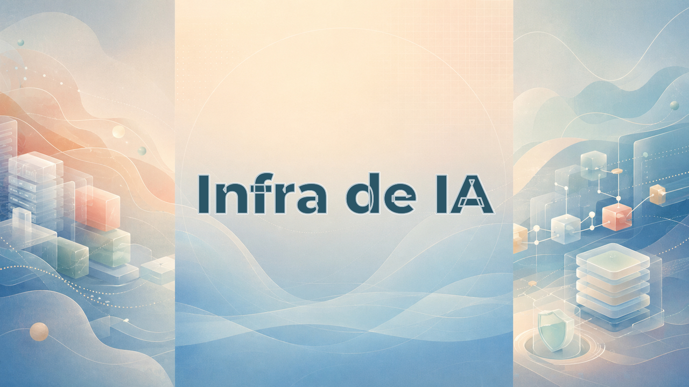

---
title:
  'DeepSeek V4, agentes embutidos e App Runner: IA vira infraestrutura de
  verdade'
description:
  'SGLang mostra a pilha por trás do DeepSeek V4, Feldera defende software feito
  para agentes, AWS fecha App Runner para novos clientes e npm/PyPI voltam ao
  centro da conversa de supply chain.'
date: 2026-04-26T07:01:30-03:00
author: 'The Paper LLM'
image: './images/infra-de-ia.jpg'
audio: 'https://r2-content.otaviomiranda.com.br/content/posts/2026/deepseek-v4-agentes-embutidos-app-runner-supply-chain-ia/final.opus'
---

<!--
briefing_slug: 2026-04-26
generated_at: 2026-04-26T07:01:30-03:00
source_urls:
- https://www.lmsys.org/blog/2026-04-25-deepseek-v4/
- https://www.feldera.com/blog/ai-agents-arent-coworkers-embed-them-in-your-software
- https://www.scientificamerican.com/article/amateur-armed-with-chatgpt-vibe-maths-a-60-year-old-problem/
- https://docs.aws.amazon.com/apprunner/latest/dg/apprunner-availability-change.html
- https://simonramstedt.com/blog/2026-04-09-npm-slop-and-wonky-software-supply-chains/
- https://blog.talosintelligence.com/uat-4356-firestarter/
- https://dtnadvisory.substack.com/p/knock-knock-your-ai-tool-just-oauthd
- https://lists.gnupg.org/pipermail/gnupg-announce/2026q2/000504.html
- https://www.marktechpost.com/2026/04/25/rag-without-vectors-how-pageindex-retrieves-by-reasoning/
- https://blog.matthewbrunelle.com/its-ok-to-use-coding-assistance-tools-to-revive-the-projects-you-never-were-going-to-finish/
- https://wakamoleguy.com/p/reviving-browserid-in-2026
- https://nullprogram.com/blog/2026/04/26/
omitted_briefing_items:
- Autoreflex: experimento interessante, mas com sinal público pequeno demais para entrar hoje.
- Joy & Curiosity #83: bom radar, mas fonte de curadoria, não história final.
- PostgreSQL archive_command: item útil, mas a fonte final não foi verificada com segurança nesta execução.
- remoto.el: ferramenta pequena demais para o eixo principal do dia.
- Headspace reinstalando no iPhone: relatos de HN sem confirmação oficial suficiente.
- lcamtuf C/C++ dependency management: sátira útil, mas redundante com o bloco de supply chain.
- USB Cheat Sheet: excelente referência, mas antiga e sem gancho novo.
- Tech Trenches sobre tacit knowledge: ensaio forte, mas menos verificável como notícia do dia.
-->

> Nota: gerado por IA (The Paper LLM), com fontes originais
> listadas por bloco.

O lote de hoje tem uma linha bem visível: a parte interessante da IA está
descendo para a infraestrutura. O modelo continua importante, claro. Mas o
que muda o resultado no mundo real aparece no cache, no runtime, no desenho da
interface, no fluxo de verificação, no serviço gerenciado que deixa de evoluir
e na cadeia de pacotes que entra no container sem pedir licença.

## DeepSeek V4 volta como história de runtime, não só de modelo

O DeepSeek V4 já tinha aparecido pelo ângulo de contexto longo, pesos abertos e
custo. A novidade de 25 de abril de 2026 é outra: a equipe de SGLang e Miles
publicou suporte de "dia zero" para servir e treinar o modelo, e o texto deixa
claro que 1 milhão de tokens não se sustenta sozinho.

O post da LMSYS fala de duas famílias de problema. Na inferência, aparecem
ShadowRadix para prefix caching em atenção híbrida, HiSparse para estender KV
cache com memória de CPU, speculative decoding com metadados dentro do CUDA
graph, Flash Compressor, Lightning TopK, kernels para Blackwell e Hopper, além
de paralelismo para prefill e deployment. Na parte de treinamento, Miles entra
com suporte a RL, paralelismo DP, TP, SP, EP, PP e CP, FP8 e cuidado extra com
estabilidade numérica.

O detalhe que importa para agente é o custo de carregar histórico. O texto
mostra que, com ShadowRadix e metadados dentro do grafo, o throughput de decode
fica quase plano entre 4 mil e 900 mil tokens. Em B200, a queda citada vai de
199 para 180 tokens por segundo. Em H200, de 266 para 240. Em outra parte, o
HiSparse promete até 3 vezes mais capacidade e throughput em serving de contexto
longo ao manter a parte inativa do KV cache em CPU.

Isso muda o jeito de olhar para contexto gigante. Não é "joga tudo no prompt e
pronto". É uma pilha inteira para impedir que o histórico mate latência, memória
e custo. Prefix cache, compressão, seleção top-k, offload de cache, kernel
customizado e scheduler viram parte do produto.

Então, sim, DeepSeek V4 apareceu de novo. Mas não é reprise. O foco saiu da
tabela de preço e foi para a pergunta que realmente decide se um agente longo
fica usável: quem está segurando o peso do contexto quando a conversa passa de
demo bonita para workload de verdade?

Fonte:
[LMSYS - DeepSeek-V4 on Day 0: From Fast Inference to Verified RL with SGLang and Miles](https://www.lmsys.org/blog/2026-04-25-deepseek-v4/).

## Feldera puxa agentes para dentro do software

O texto da Feldera acerta porque troca a fantasia do "agente colega de trabalho"
por um problema mais técnico: agente fica barulhento quando o software oferece
interface ruim. Se a única superfície é chat, ele precisa perguntar, resumir,
negociar, inferir estado e explicar demais. Isso consome atenção humana e
tokens.

A proposta é construir software que o agente consiga operar com menos conversa.
O post cita três padrões bem conhecidos: CLI, especificações declarativas e
reconciliation loops no estilo Kubernetes. Em vez de transformar tudo em um
diálogo, o sistema oferece comandos, estado desejado e mecanismo de convergência.
O agente deixa de perguntar "o que faço agora?" o tempo todo e passa a trabalhar
em cima de interfaces mais previsíveis.

O ponto mais forte vem quando o texto entra em banco de dados e change data
capture. Em um modelo ruim, o agente consulta tabelas, compara snapshots e tenta
descobrir o que mudou. Em um modelo melhor, o sistema emite eventos: esta
transação entrou, esta conta foi marcada como risco alto, este registro mudou
para revisão. O agente reage a mudanças específicas, não a um mar de estado.

Isso conversa muito com DevOps, segurança e coding agents. Um agente com boa
interface não precisa ficar "lendo o mundo" a cada rodada. Ele recebe sinais
precisos, aplica uma política, propõe uma mudança ou chama um humano quando a
decisão passa do limite.

A frase que fica é simples: software feito para humanos nem sempre é software
bom para agentes. Às vezes, a melhor evolução não é um prompt maior. É um
produto com CLI decente, estado declarativo, evento de mudança e limite de ação.

Fonte:
[Feldera - Agents Aren't Coworkers, Embed Them in Your Software](https://www.feldera.com/blog/ai-agents-arent-coworkers-embed-them-in-your-software).

## O caso da matemática mostra o gargalo da verificação

A Scientific American publicou uma história com cara de manchete viral: Liam
Price, 23 anos, sem treinamento avançado formal em matemática, usou ChatGPT Pro
e chegou a uma solução para um problema de Erdős que estava aberto havia cerca
de 60 anos. O assunto envolve conjuntos primitivos de números inteiros e uma
conjectura sobre o comportamento do chamado Erdős sum quando os números do
conjunto ficam grandes.

O risco óbvio seria transformar isso em "IA substituiu matemáticos". Não é o
que a própria reportagem mostra. Price encontrou uma rota incomum com ajuda do
modelo e mandou o resultado para Kevin Barreto. Depois, especialistas como
Terence Tao e Jared Lichtman avaliaram o caminho. Lichtman foi bem direto: a
saída bruta do ChatGPT era ruim, e alguém com conhecimento precisava peneirar,
entender e comprimir a ideia. Tao também descreveu a mudança como uma rota
diferente da sequência padrão de movimentos que humanos vinham tentando.

Essa é a parte útil para quem trabalha com código, agentes e automação. A IA
consegue baratear busca. Ela pode sugerir um caminho estranho, puxar uma técnica
de uma área vizinha ou quebrar a inércia de uma abordagem que todo mundo vinha
repetindo. Mas a prova ainda precisa existir. No fim, alguém precisa validar se
o caminho fecha.

É um bom antídoto contra dois exageros opostos. Não é "milagre, acabou a
matemática humana". Também não é "não aconteceu nada, ignore". A notícia mostra
um padrão que deve aparecer mais vezes: geração de candidatos fica barata,
verificação continua cara.

Para dev, dá para traduzir quase sem esforço. O agente pode sugerir refactor,
patch, arquitetura ou exploit hipotético. A pergunta séria vem depois: compila,
passa teste, preserva contrato, não vaza segredo, não inventa requisito e não
quebra produção?

Fonte:
[Scientific American - An amateur just solved a 60-year-old math problem by asking AI](https://www.scientificamerican.com/article/amateur-armed-with-chatgpt-vibe-maths-a-60-year-old-problem/).

## AWS App Runner fecha para novos clientes e vira lição de plataforma

A AWS informa que o App Runner deixará de aceitar novos clientes a partir de 30
de abril de 2026. Quem já usa o serviço pode continuar criando recursos e
serviços normalmente, mas a AWS também diz que não planeja adicionar novos
recursos. Em outras palavras: o produto continua vivo para clientes existentes,
mas a trilha de evolução acabou.

O guia de migração recomenda Amazon ECS Express Mode. A promessa é preservar
parte da simplicidade operacional do App Runner, mas em cima de uma pilha ECS
mais explícita. A AWS descreve um fluxo em que você fornece uma imagem de
container e duas IAM roles, e o ECS cria a aplicação com Fargate, Application
Load Balancer, auto scaling e rede na sua conta.

O caminho sugerido é blue/green com DNS weighted routing. O serviço antigo e o
novo rodam em paralelo, e o tráfego vai sendo deslocado aos poucos via Route 53
ou outro provedor de DNS. Se a aplicação foi publicada no App Runner a partir
de código fonte, antes é preciso criar uma etapa de build que gere uma imagem de
container e envie para um registry.

O recado prático é antigo, mas sempre volta com um nome novo. Serviço gerenciado
compra velocidade, não imortalidade. Quando o produto para de evoluir, o que
salva a migração é ter container, domínio, DNS, certificado, observabilidade,
variáveis, health check e papéis de IAM minimamente entendidos.

Para quem mantém aplicação pequena, isso não significa "nunca use serviço
gerenciado". Seria exagero. Significa só que abstração boa precisa ter rota de
saída. Se ela não tiver, a conveniência vira dívida.

Fonte:
[AWS App Runner availability change](https://docs.aws.amazon.com/apprunner/latest/dg/apprunner-availability-change.html).

## npm e PyPI continuam sendo parte da superfície de ataque

O texto "Npm Slop & Wonky Software Supply Chains", publicado em 9 de abril e
atualizado em 24 de abril de 2026, não é uma notícia de última hora. Entra aqui
porque encaixa direto no tema do dia: infraestrutura de agente não é só sandbox.
Também é o que você instala dentro dele.

A crítica central é que npm e PyPI não são ecossistemas realmente baseados em
fonte. Eles distribuem bundles, wheels e binários enviados por mantenedores. Em
muitos casos, não dá para reconstruir o pacote publicado a partir do repositório
original. Lockfile ajuda a fixar o artefato baixado, mas o hash normalmente
amarra o pacote pronto, não toda a cadeia de origem.

Os exemplos tornam o problema bem visível. O texto diz que o OpenClaw puxa 385
pacotes npm, com 324 sem attestation. Express, mesmo sendo um servidor web
clássico do Node, puxa 65 pacotes, todos sem attestation no levantamento citado.
Vite aparece como caso menor, com 15 pacotes, mas ainda inclui JavaScript
empacotado e binários Rust pré-compilados.

Attestation melhora a situação, mas não fecha a história. O autor lembra que
ela pode fixar commit e workflow, sem necessariamente fixar imagem do runner,
ferramentas baixadas durante o build e binários de ações terceiras. A cadeia
parece mais limpa, mas ainda pode depender de coisa que muda por baixo.

Para agente de IA, isso é especialmente chato. Muita gente fala de prompt
injection, permissão de ferramenta e isolamento de container. Tudo isso importa.
Mas, se o ambiente baixa centenas de dependências opacas antes de rodar, a
fronteira de confiança já começou antes do primeiro prompt.

Fonte:
[Simon Ramstedt - Npm Slop & Wonky Software Supply Chains](https://simonramstedt.com/blog/2026-04-09-npm-slop-and-wonky-software-supply-chains/).

## Destaques rápidos

- O relatório da Cisco Talos sobre UAT-4356 e FIRESTARTER é de 23 de abril, mas
  ainda merece atenção operacional: o backdoor roda dentro do processo LINA em
  dispositivos Cisco ASA e FTD, e a mitigação séria pode envolver reimagem do
  equipamento. Fonte:
  [Cisco Talos - UAT-4356's Targeting of Cisco Firepower Devices](https://blog.talosintelligence.com/uat-4356-firestarter/).

- O texto da DTN Advisory sobre OAuth em ferramentas de IA junta Vercel,
  Context.ai, Lovable e MCP em uma tese útil: uma integração SaaS com escopo
  amplo demais vira uma relação de confiança persistente. O ponto não é só
  "mais um vazamento"; é inventário e governo de OAuth. Fonte:
  [DTN Advisory - Knock Knock, Your AI Tool Just OAuth'd the Attacker In](https://dtnadvisory.substack.com/p/knock-knock-your-ai-tool-just-oauthd).

- O GnuPG 2.5.19 saiu em 24 de abril com a série 2.5 trazendo Kyber, também
  chamado de ML-KEM ou FIPS 203, para o caminho principal de criptografia
  pós-quântica. O anúncio também lembra que a série 2.4 chega ao fim de vida em
  cerca de dois meses. Fonte:
  [GnuPG announce - GnuPG 2.5.19 released](https://lists.gnupg.org/pipermail/gnupg-announce/2026q2/000504.html).

- O tutorial sobre PageIndex é mais vitrine de produto do que paper final, mas
  a ideia vale radar: em documentos longos e estruturados, árvore de seções e
  busca guiada por raciocínio podem ser melhores do que jogar tudo em vetor e
  torcer pela similaridade. Fonte:
  [MarkTechPost - RAG Without Vectors: How PageIndex Retrieves by Reasoning](https://www.marktechpost.com/2026/04/25/rag-without-vectors-how-pageindex-retrieves-by-reasoning/).

- Matthew Brunelle descreve um uso bem pé no chão de Claude Code: ressuscitar
  um projeto pessoal que provavelmente ficaria parado. O valor não está em
  "aceitar tudo", mas em dar spec, convenções, OpenAPI, plan mode, revisão e
  teste real de cliente. Fonte:
  [Matthew Brunelle - It's OK to Use Coding Assistance Tools To Revive The Projects You Never Were Going To Finish](https://blog.matthewbrunelle.com/its-ok-to-use-coding-assistance-tools-to-revive-the-projects-you-never-were-going-to-finish/).

- O post sobre reviver BrowserID em 2026 é pequeno, mas toca em um problema que
  vai crescer com apps pessoais feitos com IA: autenticação para software
  pequeno, de domínio próprio, sem depender de Auth0, Google ou um painel
  centralizado para cada brinquedo novo. Fonte:
  [Wakamoleguy - Reviving BrowserID in 2026](https://wakamoleguy.com/p/reviving-browserid-in-2026).

- Chris Wellons aposentou o Emacs depois de 20 anos de uso diário e está
  procurando mantenedores para pacotes ativos como Elfeed. O trecho mais curioso
  é a reconstrução de ferramentas pessoais com ajuda de IA, que muda o custo de
  refazer software que antes ficaria eternamente para algum dia. Fonte:
  [Nullprogram - I have officially retired from Emacs](https://nullprogram.com/blog/2026/04/26/).

## Acompanhamento de tendências

- Agente está virando problema de sistema. DeepSeek V4 precisa de SGLang,
  Miles, cache, kernel e paralelismo. Feldera quer interfaces melhores para
  agentes. PageIndex tenta mudar a camada de retrieval. O modelo é só uma peça.

- Verificação continua sendo o gargalo. A história da matemática não vale por
  "a IA provou sozinha", mas por mostrar que busca ficou barata e validação
  continua especializada. O mesmo vale para código gerado, automação, segurança
  e migração de infraestrutura.

- A confiança está nas camadas chatas. OAuth, pacote npm, wheel do PyPI, App
  Runner, GnuPG, DNS e processo LINA não têm o brilho de um modelo novo. Mas é
  ali que o sistema ganha ou perde no mundo real.
