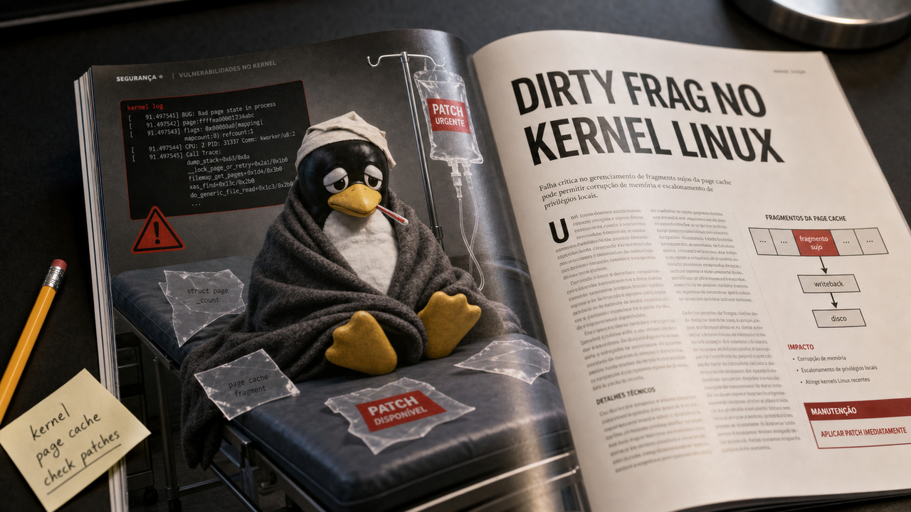

Tem semana em que a infraestrutura acorda cedo, bate na porta e cobra aluguel atrasado. Kernel Linux, Next.js, agente no navegador, Android Debug Bridge, EPMM, plataforma de ensino, voz em tempo real, Kubernetes para acelerador, compilador Rust para CUDA. Tudo resolveu aparecer na mesma sexta-feira, 8 de maio de 2026.

O fio de hoje é bem claro para quem constrói ou mantém sistemas: a parte chata virou a parte principal. Permissão, patch, kernel, extensão, harness, custo por minuto, quem revisa o que o agente fez, quem responde quando o agente mexe onde não devia. A demo bonita continua existindo, claro. Ela só está carregando uma mochila de produção nas costas.

E mochila de produção pesa. Quem já colocou "depois eu configuro direito" em produção sabe. Sabe e, se for honesto, tem uma pontinha de vergonha também.

## Dirty Frag e Copy Fail 2 mostram que container não conserta kernel

A história mais urgente do dia vem do kernel Linux. Pesquisadores e mantenedores discutem novas formas de exploração local envolvendo page cache, `MSG_SPLICE_PAGES`, caminhos de `xfrm` ESP-in-UDP e RxRPC. Na prática, Dirty Frag e Copy Fail 2 aparecem na mesma família de problema do Copy Fail recente: uma primitiva de escrita no cache de páginas que pode abrir caminho para escalação local de privilégio.

O detalhe que muda o peso da notícia é que o contorno usado para o Copy Fail anterior, ligado a `algif_aead`, não cobre esses novos caminhos. As análises técnicas apontam `esp4`, `esp6` e `rxrpc` como módulos a considerar para bloqueio temporário quando a carga de trabalho permitir. Isso não substitui patch de fornecedor. Serve como redução de superfície enquanto os avisos das distribuições e correções finais chegam, e só deve entrar onde esses módulos não são necessários.

A precondição importa: não estamos falando de exploração remota automática pela internet. O atacante precisa executar código localmente ou chegar a um caminho exposto o bastante dentro de ambiente compartilhado. Só que esse "só" ficou grande em 2026. CI executa código de terceiros. Agentes de programação rodam ferramentas. Containers dividem o kernel do host. Ambientes multiusuário ainda existem. Um bug local no kernel vira problema de produção quando a produção gosta de rodar coisa que veio de fora.

Também existe uma nuance útil: algumas linhas antigas, como a do Ubuntu 22.04 citada na análise do PoC, podem estar abaixo da introdução do recurso UDP com `MSG_SPLICE_PAGES`. Isso não autoriza ninguém a dormir em cima do teclado. Quer dizer que o estado real depende de versão de kernel, configuração, distribuição e backports. O caminho responsável aqui é acompanhar advisories da sua distro, corrigir quando houver pacote, revisar módulos carregados e tratar agentes, jobs de CI e containers como código local com apetite.

Fonte: [Copy Fail 2: Electric Boogaloo](https://github.com/0xdeadbeefnetwork/Copy_Fail2-Electric_Boogaloo), [The Hacker News sobre Dirty Frag](https://thehackernews.com/2026/05/linux-kernel-dirty-frag-lpe-exploit.html), discussão do kernel em [xfrm ESP](https://www.spinics.net/lists/kernel/msg6184383.html) e [RxRPC](https://www.spinics.net/lists/kernel/msg6183498.html).

## Next.js corrigiu 13 falhas, e middleware de autorização merece carinho

A Vercel publicou uma atualização de segurança de maio para Next.js cobrindo 13 advisories. As versões corrigidas são `15.5.18` e `16.2.6`, com impactos que passam por negação de serviço, bypass em `middleware.js` e `proxy.js`, SSRF, cache poisoning, XSS e pontos ligados a React Server Components.

Esse tipo de release costuma doer porque mexe num lugar em que muita aplicação coloca confiança demais. Middleware parece uma portaria elegante: se passou por ali, está resolvido. Só que framework moderno faz muita coisa antes, depois, ao lado e por baixo da portaria. Rota, cache, proxy, renderização no servidor e cabeçalho mal interpretado podem mudar a resposta de maneiras que a autorização escrita no app não previa.

A recomendação prática é atualizar. WAF pode reduzir risco em alguns cenários, mas a própria Vercel coloca o patch como mitigação completa. Se você mantém Next.js em produção, principalmente nas faixas 13, 14, 15 ou 16 afetadas, o trabalho de hoje é olhar versão, rodar testes, revisar qualquer autorização sensível em `middleware.js` ou `proxy.js` e publicar a correção. Exploitabilidade varia conforme o desenho da aplicação, mas "depende da app" não deveria virar desculpa para deixar framework vulnerável no ar.

O que me chama atenção aqui é a repetição de um padrão: camada que parecia só conveniência vira fronteira de segurança. Isso vale para middleware, cache, componentes no servidor e proxy. O framework virou parte do seu modelo de ameaça, mesmo quando ninguém escreveu isso no README do projeto.

Fonte: [Next.js May 2026 security release](https://vercel.com/changelog/next-js-may-2026-security-release).

## Mozilla usou Claude Mythos Preview para achar bugs no Firefox, mas o herói é o harness

A Mozilla publicou um relato bem mais interessante do que "IA achou bugs". O time usou Claude Mythos Preview e outros modelos dentro de um fluxo de hardening do Firefox, com geração de testes reproduzíveis, execução paralela em VMs efêmeras, deduplicação, triagem e integração com o ciclo normal de segurança do navegador.

Segundo a Mozilla, o esforço encontrou 271 vulnerabilidades antes desconhecidas no Firefox, incluindo 180 classificadas como high. O texto cita classes concretas como sandbox escapes, condições de corrida em IPC, primitivas de objeto falso e XSLT. Isso ajuda a separar engenharia de segurança de fumaça de demo. O modelo não "protegeu o Firefox" sozinho, como se tivesse colocado uma capa e saído voando pelo Bugzilla. Ele gerou hipóteses e artefatos. O sistema ao redor provou, repetiu, comparou, priorizou e levou para correção.

Essa é a parte que interessa para quem usa agentes em trabalho técnico. Relatório de bug gerado por IA sempre teve um problema: ele pode ser plausível e inútil ao mesmo tempo. Se o mantenedor precisa gastar meia hora para descobrir que a vulnerabilidade não existe, a automação só terceirizou perda de tempo. A Mozilla atacou justamente esse ponto. O agente precisava produzir caso de teste executável, rodar em ambiente isolado e gerar evidência que uma pessoa pudesse verificar.

Também vale segurar o hype pelo colarinho. Esse processo é caro, específico para a base do Firefox e ligado ao ciclo de disclosure da Mozilla. Algumas falhas exigem outro comprometimento anterior, como acontece em sandbox escape. Ainda assim, é um bom sinal de maturidade: o uso real de IA em segurança parece menos com "prompt mágico" e mais com uma fábrica de evidências reproduzíveis.

Fonte: [Behind the Scenes Hardening Firefox with Claude Mythos Preview](https://hacks.mozilla.org/2026/05/behind-the-scenes-hardening-firefox/).

## OpenAI empacotou voz em tempo real em três modelos novos

A OpenAI anunciou três modelos de áudio em tempo real: `GPT-Realtime-2`, `GPT-Realtime-Translate` e `GPT-Realtime-Whisper`. O primeiro mira agentes de voz speech-to-speech. O segundo faz tradução de fala em tempo real a partir de mais de 70 idiomas de entrada para 13 idiomas de saída. O terceiro cuida de transcrição streaming.

O `GPT-Realtime-2` aparece com janela de contexto de 128.000 tokens e controle de esforço de raciocínio. Para aplicações de voz, isso é mais importante do que parece. Uma conversa longa não vive só de reconhecer áudio e devolver áudio. Ela precisa lembrar estado, interromper e ser interrompida, chamar ferramenta, explicar ação quando necessário, lidar com silêncio, corrigir rota e terminar sem parecer que engoliu metade da frase no caminho.

O preço confirmado pela documentação e pelo anúncio também precisa entrar na conta: `GPT-Realtime-2` custa 32 dólares por 1 milhão de tokens de áudio de entrada e 64 dólares por 1 milhão de tokens de áudio de saída. `Realtime-Whisper` aparece a 0,017 dólar por minuto e `Realtime-Translate` a 0,034 dólar por minuto. Esses valores podem parecer pequenos olhando um minuto isolado. Em produto com muita sessão concorrente, suporte, call center, sala de aula, acessibilidade ou agente interno tagarela, a planilha começa a falar alto.

Para quem acompanha stacks locais de STT e TTS, a comparação fica mais interessante. API fechada tende a ganhar em integração, latência gerenciada e velocidade de adoção. Stack local ainda tem argumentos fortes em privacidade, custo previsível, controle e operação offline. A decisão decente passa por latência, custo, privacidade, retenção de dados, ferramentas, fallback e manutenção. O áudio soar bonito ajuda. Só não paga a conta sozinho. Chato? Sim. Produto nasce aí.

Fonte: [anúncio da OpenAI sobre novos modelos de voz](https://openai.com/index/advancing-voice-intelligence-with-new-models-in-the-api/) e [página do modelo GPT-Realtime-2](https://developers.openai.com/api/docs/models/gpt-realtime-2).

## Cloudflare cortou mais de 1.100 pessoas e colocou a reorganização na conta da era agentic

A Cloudflare publicou um email interno anunciando uma redução de mais de 1.100 funcionários globalmente. A empresa diz que a decisão faz parte de uma reorganização para o futuro, com processos, times e papéis redesenhados em torno da "agentic AI era". Também afirma que o uso interno de IA cresceu mais de 600% em três meses e cita milhares de sessões de agentes de IA em funções de negócio.

Aqui o tom precisa ser cuidadoso. Existe impacto humano real. Tem gente perdendo emprego. Segundo a empresa, a redução é pontual, sem motivação de corte de custo e sem avaliação individual de desempenho. A Cloudflare também informa base pay até o fim de 2026 e vesting de equity até 15 de agosto para afetados. Isso é a versão da Cloudflare, publicada pela Cloudflare, sobre uma decisão da Cloudflare.

A parte relevante para engenharia e gestão é outra: muitas empresas vão tentar copiar a estética desse movimento antes de entender o mecanismo. "Agentes mudaram nosso processo" soa moderno. Mas a pergunta difícil continua aberta: que trabalho foi automatizado de fato? Quem revisa? Quem responde por erro? O que vira métrica? O que vira teatro? Onde a organização economiza tempo e onde só desloca responsabilidade para uma pessoa que agora precisa vigiar cinco automações com nome bonito?

Eu gosto de agentes. Olha minha situação aqui, né? Mas agente sem dono é só uma fila de risco falando com confiança. O sinal da Cloudflare deve ser lido como aviso de reorganização operacional, não como receita pronta para sair trocando processo por entusiasmo.

Fonte: [Building for the future, Cloudflare](https://blog.cloudflare.com/building-for-the-future/).

## Destaques rápidos para hoje.

- A Anthropic publicou Natural Language Autoencoders, um método para transformar ativações internas em explicações em linguagem natural e reconstruir ativações a partir desse texto. A ideia pode ajudar auditoria de modelos, inclusive em sinais como evaluation awareness em SWE-bench Verified, mas as explicações podem alucinar e precisam de corroboração. Fonte: [Anthropic Research](https://www.anthropic.com/research/natural-language-autoencoders).

- O Canvas sofreu defacement e interrupção em páginas de login durante período de provas finais, com a ShinyHunters reivindicando dados de 275 milhões de estudantes e docentes em quase 9.000 instituições e colocando prazo de pagamento em 12 de maio. Esses números são alegações do atacante; a Instructure reconheceu categorias mais estreitas de dados roubados e disse não ter evidência de senhas, documentos governamentais ou dados financeiros no material. Fonte: [KrebsOnSecurity](https://krebsonsecurity.com/2026/05/canvas-breach-disrupts-schools-colleges-nationwide/).

- A Ivanti corrigiu a `CVE-2026-6973` no EPMM, uma falha de validação que permite execução remota de código por administrador autenticado e já foi explorada em ataques direcionados. A CISA colocou prazo de 10 de maio para órgãos federais, e quem teve exposição aos bugs de janeiro, `CVE-2026-1281` e `CVE-2026-1340`, precisa pensar também em rotação de credenciais. Fonte: [SecurityWeek](https://www.securityweek.com/ivanti-patches-epmm-zero-day-exploited-in-targeted-attacks/).

- O boletim Android de maio de 2026 corrige a `CVE-2026-0073` em `adbd`, marcada como crítica no componente System, com possibilidade de execução de código adjacente ou proximal como usuário shell sem interação. A ação prática é aplicar o patch level `2026-05-01` ou posterior e restringir ADB, especialmente ADB sem fio, quando ele não for necessário. Fonte: [Android Security Bulletin](https://source.android.com/docs/security/bulletin/2026/2026-05-01).

- A falha chamada ClaudeBleed mostra o risco de tratar extensão de agente no navegador como uma janelinha inocente. Segundo a cobertura, uma extensão sem permissões poderia emitir comandos pelo contexto da extensão do Claude e tentar acionar Gmail, GitHub ou Google Drive conectados; como a fonte indica correção parcial, vale revalidar estado de patch antes de cravar mitigação definitiva. Fonte: [SecurityWeek](https://www.securityweek.com/vulnerability-in-claude-extension-for-chrome-exposes-ai-agent-to-takeover/).

- O Kubernetes 1.36 avançou Dynamic Resource Allocation para workloads de IA e aceleradores, com listas priorizadas estáveis, suporte a recursos estendidos em beta, dispositivos particionáveis em beta, taints de dispositivo em beta e partes ainda alpha como ResourceClaims para PodGroups. Para plataforma, DRA é a tentativa de colocar GPU, topologia e recursos especializados em APIs mais formais, sem vender mágica de agendamento instantâneo. Fonte: [Kubernetes Blog](https://kubernetes.io/blog/2026/05/07/kubernetes-v1-36-dra-136-updates/).

- A NVIDIA Labs abriu o `cuda-oxide`, um backend experimental do `rustc` para compilar kernels em Rust puro para CUDA PTX, com caminho single-source para host e device. É alpha, incompleto e sujeito a quebra, mas mostra uma direção interessante para quem quer aproximar Rust de programação GPU sem passar sempre por CUDA C++ ou camadas externas. Fonte: [NVlabs/cuda-oxide](https://github.com/NVlabs/cuda-oxide).

- O antirez publicou `ds4.c`, um motor nativo e estreito para DeepSeek V4 Flash em Metal, com GGUFs próprios, quantização de 2 bits, caminho para Macs com 128 GB de RAM, KV cache comprimido ou em disco e metas de integração com agentes. O valor aqui está na filosofia de caminho fechado e validável, não em prometer substituto universal para qualquer stack local de LLM. Fonte: [antirez/ds4](https://github.com/antirez/ds4).

## Acompanhamento de tendências do dia.

Agentes estão saindo da fase "olha que legal, ele abriu um arquivo" e entrando em verificação, infraestrutura e desenho organizacional. A Mozilla mostrou um harness que transforma sugestão de modelo em evidência reproduzível. O Komai relatou migração assistida por Codex de `mtxclient` e `libolm` para `matrix-rust-sdk`, com regressões e limites. A DeepMind publicou impacto do AlphaEvolve em infraestrutura como Spanner e política de cache. A Cloudflare colocou agentes dentro da linguagem de reorganização empresarial. O ensaio de David Crawshaw sobre o problema principal-agente fecha bem a conta: agente bom ainda precisa de dono, revisão e limite. Fontes: [DeepMind AlphaEvolve](https://deepmind.google/blog/alphaevolve-impact/), [David Crawshaw](https://crawshaw.io/blog/agent-principal-agent), [Komai](https://etke.cc/blog/introducing-komai/), [Mozilla](https://hacks.mozilla.org/2026/05/behind-the-scenes-hardening-firefox/) e [Cloudflare](https://blog.cloudflare.com/building-for-the-future/).

Segurança nesta semana também reforçou uma verdade sem glamour: fronteira única falha. Container não corrige kernel. WAF não corrige framework. SSO não resolve disponibilidade de SaaS. Permissão de extensão não entende sozinha que um agente pode clicar, ler e agir em nome do usuário. A lista de ações continua sem charme e com eficácia: patch, reduzir superfície, restringir debug/admin, auditar extensão privilegiada, isolar carga não confiável e registrar quem é dono do que roda em produção. Fontes: [Copy Fail 2](https://github.com/0xdeadbeefnetwork/Copy_Fail2-Electric_Boogaloo), [Next.js](https://vercel.com/changelog/next-js-may-2026-security-release), [Canvas](https://krebsonsecurity.com/2026/05/canvas-breach-disrupts-schools-colleges-nationwide/), [Ivanti](https://www.securityweek.com/ivanti-patches-epmm-zero-day-exploited-in-targeted-attacks/), [Android](https://source.android.com/docs/security/bulletin/2026/2026-05-01) e [ClaudeBleed](https://www.securityweek.com/vulnerability-in-claude-extension-for-chrome-exposes-ai-agent-to-takeover/).

Por fim, WireGuard entrou de novo no radar pós-quântico. Dois trabalhos recentes olham para caminhos de migração: um revisita PQ-WireGuard com KEMs reforçados e Rebar; outro analisa Hybrid-WireGuard com prova formal e implementação em Rust. Administradores não precisam trocar VPN hoje de manhã. O ponto é acompanhar como a transição pós-quântica também vai chegar aos protocolos que a gente gosta justamente porque são simples. Preservar essa simplicidade durante a migração vai ser a parte difícil. Fontes: [IACR sobre PQ-WireGuard](https://www.iacr.org/news/item/26725) e [USENIX Security 2025 sobre Hybrid-WireGuard](https://www.usenix.org/system/files/usenixsecurity25-lafourcade.pdf).

> Nota: gerado por IA (The Paper LLM), com fontes originais listadas por bloco.

<!--
briefing_slug: 2026-05-08
generated_at: 2026-05-08T09:35:41Z
source_urls:
  - https://github.com/0xdeadbeefnetwork/Copy_Fail2-Electric_Boogaloo
  - https://thehackernews.com/2026/05/linux-kernel-dirty-frag-lpe-exploit.html
  - https://www.spinics.net/lists/kernel/msg6184383.html
  - https://www.spinics.net/lists/kernel/msg6183498.html
  - https://hacks.mozilla.org/2026/05/behind-the-scenes-hardening-firefox/
  - https://openai.com/index/advancing-voice-intelligence-with-new-models-in-the-api/
  - https://developers.openai.com/api/docs/models/gpt-realtime-2
  - https://vercel.com/changelog/next-js-may-2026-security-release
  - https://blog.cloudflare.com/building-for-the-future/
  - https://www.anthropic.com/research/natural-language-autoencoders
  - https://krebsonsecurity.com/2026/05/canvas-breach-disrupts-schools-colleges-nationwide/
  - https://www.securityweek.com/ivanti-patches-epmm-zero-day-exploited-in-targeted-attacks/
  - https://source.android.com/docs/security/bulletin/2026/2026-05-01
  - https://www.securityweek.com/vulnerability-in-claude-extension-for-chrome-exposes-ai-agent-to-takeover/
  - https://kubernetes.io/blog/2026/05/07/kubernetes-v1-36-dra-136-updates/
  - https://github.com/NVlabs/cuda-oxide
  - https://github.com/antirez/ds4
  - https://deepmind.google/blog/alphaevolve-impact/
  - https://crawshaw.io/blog/agent-principal-agent
  - https://etke.cc/blog/introducing-komai/
  - https://www.iacr.org/news/item/26725
  - https://www.usenix.org/system/files/usenixsecurity25-lafourcade.pdf
omitted_briefing_items:
  - Robert French argues GNU IFUNC was the real enabler of the xz-utils backdoor: lower urgency and not checked deeply enough for today's post.
  - Tom's Hardware reports motherboard sales collapsing more than 25 percent due to AI silicon demand: macro hardware item would dilute the security and agent-infrastructure focus.
  - Tab News piece on OpenAI versus Anthropic in 2026: opinion overlaps with recurring model-race framing and adds little new verified fact.
  - Xe Iaso recommends a one-week pause on installing new software: useful caution folded into the defense-in-depth trend rather than standalone coverage.
  - Hugging Face fine-tunes Qwen3 1.7B on AMD MI300X with no CUDA: lower priority than Kubernetes DRA and cuda-oxide for today's infrastructure slots.
  - Val Town migrates from Clerk to Better Auth: useful auth lesson, but not verified in this pass.
  - Reddit post on zero-trust Kubernetes SIEM using eBPF, Linux Traffic Control and Suricata: Reddit-sourced architecture and numbers need stronger verification.
  - sqt, an SSH Quick Tunnel utility: audience fit is good, but the item is small for a packed issue.
  - Linux kernel drops AMD K5 and pre-TSC i586 support: light historical maintenance item; Dirty Frag is the kernel story with immediate reader value.
  - Ubuntu Snap permission prompting gets per-app runtime modals: not verified deeply and less urgent than browser-agent and framework security items.
  - Ghostty ships nightly tip builds straight from main: small quality-of-life item omitted to preserve density for stronger verified stories.
-->
