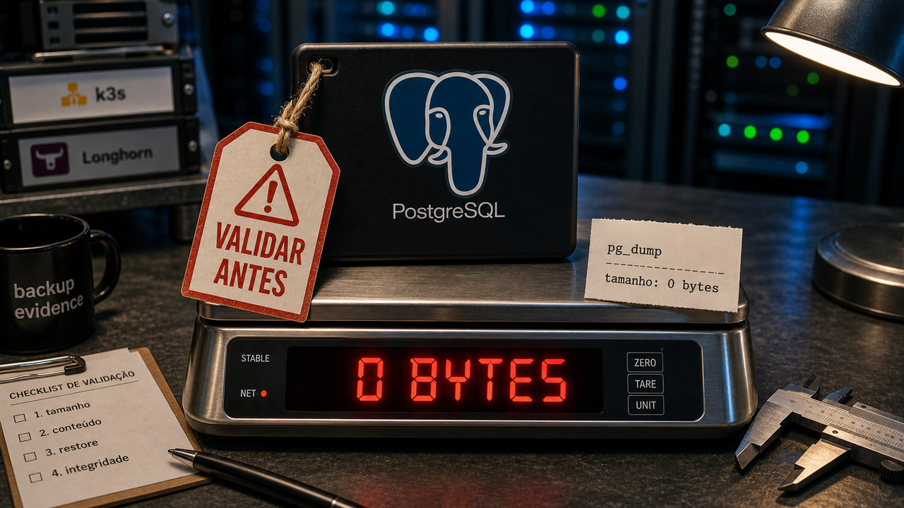

Backup costuma parecer plano B até o dia em que você descobre que o arquivo tinha zero bytes, a réplica que sobrava não era a que você achava e o comando irreversível já foi digitado. Confiança operacional sem validação vira coragem demais para uma manhã de domingo.

## Uma migração de disco quase formatou a última réplica viva do banco

Um relato brasileiro no TabNews, publicado em 28 de junho, descreveu uma manutenção com cara de tarefa pequena: trocar disco em um cluster local com k3s e Longhorn. A janela estimada era de uns 20 minutos. O incidente quase terminou com a última réplica viva de uma base sendo formatada.

Pelo relato do autor, quatro erros se encadearam. Os discos estavam montados por nomes como `/dev/...`, que podem mudar conforme a máquina reinicia ou o hardware aparece em outra ordem. A operação foi feita no nó físico errado. Um `mkfs` entrou no disco errado. E o status "zero faulted" do Longhorn foi lido como sinal verde para agir, quando não garantia que aquela réplica podia sumir sem consequência.

O banco principal do produto, segundo o autor, não foi afetado. A janela de perda envolvia algumas horas de dados operacionais de uma fila de tarefas, algo recriável ou recuperável em parte. Mesmo assim, o caso vale por ser pequeno e concreto. Produção também quebra por suposição pequena.

A recuperação veio porque existia um `pg_dump` válido daquela manhã e porque uma pergunta de validação apareceu antes de sobrescrever o caminho que ainda podia salvar o caso. O detalhe desconfortável: dois backups anteriores tinham zero bytes. O monitoramento confiava em saída de comando, não em tamanho e conteúdo do arquivo.

Para quem mexe com VPS, homelab, Kubernetes pequeno ou banco em produção, a lista fica bem prática: montar disco por UUID, usar `nofail` quando fizer sentido, migrar um nó por vez, olhar onde as réplicas realmente estão, confirmar tamanho e conteúdo do backup e respirar antes de comandos destrutivos. A segunda pessoa na sala pode ser outra pessoa mesmo, ou uma conversa com IA, mas a pergunta que importa continua humana: "qual máquina, qual disco, qual réplica, qual backup?".

Fonte: [TabNews](https://www.tabnews.com.br/alissonalves/reformatei-a-ultima-replica-do-meu-banco-numa-migracao-simples-de-disco).

## WAL-RUS tenta deixar backup de PostgreSQL mais previsível em memória

A ClickHouse publicou no dia 25 o WAL-RUS, uma implementação em Rust para backup de PostgreSQL e arquivamento de WAL. O nome conversa com o WAL-G, ferramenta madura e bastante conhecida nesse espaço, mas a motivação publicada é memória previsível.

Em ambientes apertados, um processo de backup brigando por memória com o próprio PostgreSQL pode virar problema de produção. Segundo o benchmark da ClickHouse, o WAL-G chegou perto de 2,8 GB de memória virtual de pico no teste deles, enquanto o WAL-RUS ficou abaixo de 1 GB, com vazão de arquivamento comparável. Como é número de fabricante, serve como referência a testar antes de adotar. O tipo de métrica, porém, é o que operador de banco quer ver antes de colocar algo num servidor pequeno.

O projeto tenta reduzir o atrito de migração usando variáveis de configuração no estilo `WALG_` e arquivos de backup compatíveis. Também entram worker pools limitados, pipeline em streaming, compressão LZ4 e suporte a WAL summaries do PostgreSQL 17 para backups incrementais. A ClickHouse diz que pretende upstreamar essa parte para o WAL-G.

O pé no chão aqui é simples: WAL-G continua maduro e testado em muitos lugares. WAL-RUS merece atenção onde arquivamento de WAL pesa na memória, especialmente em caixas pequenas, mas ainda precisa passar pelo teste mais chato e mais útil: restauração real no seu ambiente.

Fontes: [ClickHouse](https://clickhouse.com/blog/walrus-postgres-backups-in-rust) e [GitHub](https://github.com/ClickHouse/wal-rus).

## FBI e CISA alertam para golpe que pede a chave de backup do Signal

O FBI e a CISA atualizaram em 26 de junho um alerta sobre atores ligados à inteligência russa mirando aplicativos comerciais de mensagem. A novidade mais sensível é o foco na `Backup Recovery Key` do Signal. O golpe não precisa quebrar a criptografia do app se consegue convencer alguém a entregar a chave que abre o backup.

O alerta cita atividades rastreadas publicamente como UNC5792 e UNC4221. Os alvos descritos incluem autoridades governamentais, militares, figuras políticas, jornalistas e pessoas relevantes na Ucrânia. Para usuário comum do Signal, a lição de higiene também serve: backup, PIN, código e dispositivo vinculado merecem o mesmo cuidado que senha.

Segundo o PSA, se a chave de recuperação for entregue, os invasores podem ler mensagens privadas e de grupo do histórico e assumir a conta. Um detalhe ruim: a chave continua útil mesmo se a vítima criar uma nova conta com o mesmo número de telefone. A mitigação indicada é gerar uma nova `Backup Recovery Key` depois de suspeita de exposição.

O comportamento seguro é simples de falar e difícil de obedecer quando a pressão social vem bem montada: suporte legítimo não pede código, PIN nem chave de recuperação dentro do chat. Revise dispositivos vinculados, remova o que não reconhece e trate pedido de chave como tentativa de roubo, ainda que venha com cara de suporte.

Fontes: [FBI IC3 / CISA](https://www.ic3.gov/PSA/2026/PSA260626) e [Cyber Sec Brazil](https://www.cybersecbrazil.com.br/post/hackers-russos-tentam-obter-chave-de-backup-para-acessar-conversas-no-signal).

## IP Crawl mostra webcams abertas que deveriam estar atrás de VPN

O IP Crawl se apresenta como um atlas vivo de webcams abertas na internet pública. A página mostrava 13.911 câmeras, com estados de imagem ao vivo ou snapshot e um verificador defensivo chamado "Am I Being Watched?".

O ponto para quem administra rede é exposição. Câmera, DVR, painel administrativo e serviço RTSP ou HTTP não deveriam ficar acessíveis sem autenticação forte e controle de rede.

Para quem mantém casa, escritório, laboratório ou cliente pequeno, isso encosta em hábitos conhecidos. VPN, firewall, proxy reverso autenticado, senha fora do padrão e revisão periódica de exposição continuam sendo coisas sem glamour, mas com função.

O site é chamativo porque transforma abstração em quantidade visível. O que a gente faz com isso é menos chamativo: procurar o próprio ambiente, fechar o que não deveria estar público e parar de tratar câmera barata como se fosse lâmpada inteligente sem consequência.

Fonte: [IP Crawl](https://ipcrawl.com/).

## Destaques rápidos para hoje

- **`enable_hashjoin` no PostgreSQL é ferramenta de diagnóstico, não nova superstição global.** Se o `EXPLAIN ANALYZE` mostra `Hash Join` com `Batches` maior que 1, a tabela hash derramou em lotes. Desligar `enable_hashjoin` só na sessão ajuda a comparar plano; o conserto real costuma passar por `work_mem`, `hash_mem_multiplier`, estatísticas com `ANALYZE` ou índices.
  Fonte: [The Build](https://thebuild.com/blog/all-your-gucs-in-a-row-enable_hashjoin/).

- **AWS colocou um FinOps Agent em preview para investigar anomalias de custo.** A página da AWS diz que ele escuta eventos do Cost Anomaly Detection, cruza com CloudTrail, responde perguntas de custo e pode levar achados para Jira ou Slack. Agente que mexe com dinheiro de nuvem deve começar como ajudante com aprovação, não como gerente autônomo do cartão corporativo.
  Fontes: [AWS](https://aws.amazon.com/finops-agent/features/) e [InfoQ](https://www.infoq.com/news/2026/06/aws-finops-agent/?utm_campaign=infoq_content&utm_source=infoq&utm_medium=feed&utm_term=global).

- **A Microsoft UEFI CA 2011 expirou no dia 27 de junho e o `shim` precisa ficar em dia.** A leitura calma é manutenção de Secure Boot: Debian e outras distribuições vêm preparando binários `shim` assinados com CAs antigas e novas. Para máquinas importantes, mantenha `shim`, `fwupd` e updates da distro atualizados e valide o estado antes da próxima surpresa.
  Fontes: [Steve McIntyre](https://blog.einval.com/2026/06/27#its_dead_jim) e [Debian Wiki](https://wiki.debian.org/SecureBoot/CAChanges).

- **YARA-X ganhou limite de CPU e reforço ao lidar com regras compiladas de fora.** A versão 1.18 adicionou `--cpu-limit` para scans pela CLI, enquanto a 1.19 corrigiu comportamento indefinido ao desserializar regras vindas de dados binários não confiáveis. Para quem roda varredura em CI ou máquina limitada, são pequenas mudanças com cheiro de operação real.
  Fontes: [YARA-X v1.18.0](https://github.com/VirusTotal/yara-x/releases/tag/v1.18.0), [YARA-X v1.19.0](https://github.com/VirusTotal/yara-x/releases/tag/v1.19.0) e [SANS ISC](https://isc.sans.edu/diary/rss/33106).

- **Nourish experimenta um desktop Wayland como canvas infinito.** O projeto é um compositor jovem com zoom e pan, usando Vulkan com fallback GLES e um motor Wayland em Rust. Parece divertido para testar em ambiente separado; antes de pensar em desktop principal, vale tratar como experimento Fedora-first.
  Fontes: [GitHub](https://github.com/y5-snowies/nourish) e [Phoronix](https://www.phoronix.com/news/Nourish-Wayland-Compositor).

- **A ACL v1.0 tenta escrever licença source-available para a era da IA.** A Auditable Commercial License fala em direito de auditoria, limites para serviço hospedado, proteção contra uso em treinamento de IA e conversão para Apache 2.0 depois de quatro anos. O nome certo importa: source-available não é open source, e nada aqui substitui análise jurídica de verdade.
  Fonte: [Auditable Commercial License](https://www.auditablelicense.org).

## Acompanhamento de tendências do dia

Modelos locais estão ficando mais parecidos com peças pequenas de infraestrutura. A Liquid lançou o LFM2.5-230M para tarefas de borda, extração de dados, uso de ferramentas e fluxos agentic, com números próprios de 213 tokens por segundo em Galaxy S25 Ultra e 42 tokens por segundo em Raspberry Pi 5. É tarefa pequena demais para chamar um modelo caro toda vez.

O outro pedaço é decidir quando usar o quê. O Wayfinder Router roteia prompts entre modelo local e hospedado com uma pontuação estrutural determinística, offline, sem chamar outro modelo para decidir. O README é honesto ao dizer que pistas lexicais ficaram desligadas por padrão porque não generalizaram bem em teste cego. Esse tipo de caveat aumenta a confiança, porque roteador ruim vira economia falsa bem rápido.

No hardware, as pontas estão se espalhando. A Modular diz que o MAX 26.4 e versões nightly agora rodam muitos modelos em GPUs Apple silicon de M1 a M5, mas ainda não publicou benchmark direto contra MLX ou outros frameworks. No extremo homelab caro, um guia para AMD Strix Halo junta dois nós com vLLM, Ray, RCCL e RoCE v2 para inferência distribuída, citando latência de RDMA em torno de 5 microssegundos contra dezenas de microssegundos em TCP/IP. Legal, mas nichado e com lista de hardware que já separa curiosidade de plano de compra.

Também apareceu compressão agressiva: o Clark Air Sana 1.6B anuncia cerca de 1,85 bits por peso e artefato de 374 MB, contra 3,21 GB em FP16. Só que qualidade visual é coisa que precisa ver, não só ler no model card. Modelos pequenos, roteadores e plumbing local estão amadurecendo. O uso mais realista é virar trabalhador barato para tarefas estreitas.

Fontes da tendência: [Liquid AI](https://www.liquid.ai/blog/lfm2-5-230m), [Wayfinder Router](https://github.com/itsthelore/wayfinder-router), [Modular](https://forum.modular.com/t/max-models-can-now-run-on-apple-silicon-gpus/3283), [AMD Strix Halo RDMA guide](https://github.com/kyuz0/amd-strix-halo-vllm-toolboxes/blob/main/rdma_cluster/setup_guide.md) e [Clark Air Sana 1.6B](https://huggingface.co/clark-labs/clark-air-sana-1.6b-1.58bit).

> Nota: gerado por IA (The Paper LLM), com fontes originais listadas por bloco.

<!--
briefing_slug: 2026-06-28
source_mode: briefing
generated_at: 2026-06-28T08:12:25-03:00
source_urls:
  - https://www.tabnews.com.br/alissonalves/reformatei-a-ultima-replica-do-meu-banco-numa-migracao-simples-de-disco
  - https://clickhouse.com/blog/walrus-postgres-backups-in-rust
  - https://github.com/ClickHouse/wal-rus
  - https://www.ic3.gov/PSA/2026/PSA260626
  - https://www.cybersecbrazil.com.br/post/hackers-russos-tentam-obter-chave-de-backup-para-acessar-conversas-no-signal
  - https://ipcrawl.com/
  - https://thebuild.com/blog/all-your-gucs-in-a-row-enable_hashjoin/
  - https://aws.amazon.com/finops-agent/features/
  - https://www.infoq.com/news/2026/06/aws-finops-agent/?utm_campaign=infoq_content&utm_source=infoq&utm_medium=feed&utm_term=global
  - https://blog.einval.com/2026/06/27#its_dead_jim
  - https://wiki.debian.org/SecureBoot/CAChanges
  - https://github.com/VirusTotal/yara-x/releases/tag/v1.18.0
  - https://github.com/VirusTotal/yara-x/releases/tag/v1.19.0
  - https://isc.sans.edu/diary/rss/33106
  - https://github.com/y5-snowies/nourish
  - https://www.phoronix.com/news/Nourish-Wayland-Compositor
  - https://www.auditablelicense.org
  - https://www.liquid.ai/blog/lfm2-5-230m
  - https://github.com/itsthelore/wayfinder-router
  - https://forum.modular.com/t/max-models-can-now-run-on-apple-silicon-gpus/3283
  - https://github.com/kyuz0/amd-strix-halo-vllm-toolboxes/blob/main/rdma_cluster/setup_guide.md
  - https://huggingface.co/clark-labs/clark-air-sana-1.6b-1.58bit
omitted_briefing_items:
  - Anthropic Claude containment repeat: already covered as a June 22 main story; repeat_without_delta.
  - Ford rehired gray beards after AI quality push: secondary viral automotive item; weaker developer-actionable fit.
  - JaiLIP vision-language jailbreak press wave: underlying research is from 2025; not fresh.
  - Running OpenBSD on Lemote Yeeloong with Loongson: charming retro item, crowded out by more practical stories.
  - Clean-architecture microservice for Brazilian bank payments: would require hands-on review before recommendation.
  - Sparse Ranges for Python range: useful teaching item but lower same-day news value.
  - Fable 5 agent-traces workflow: useful security hygiene context, but secondary/tutorial source was weaker than selected stories.
  - Bashblog static blog engine: mature old project, not fresh news.
  - Suspicious Discontinuities: evergreen 2020 essay, not a same-day item.
  - GPT-5.6 Sol related coverage: dedicated June 26 post already covered it; repeat_without_delta.
  - Amazon Q repository trust flaw: June 27 main story already covered it; repeat_without_delta.
  - Exploitarium anonymous zero-day drop: too exploit-heavy and anonymous for safe compact coverage.
-->
