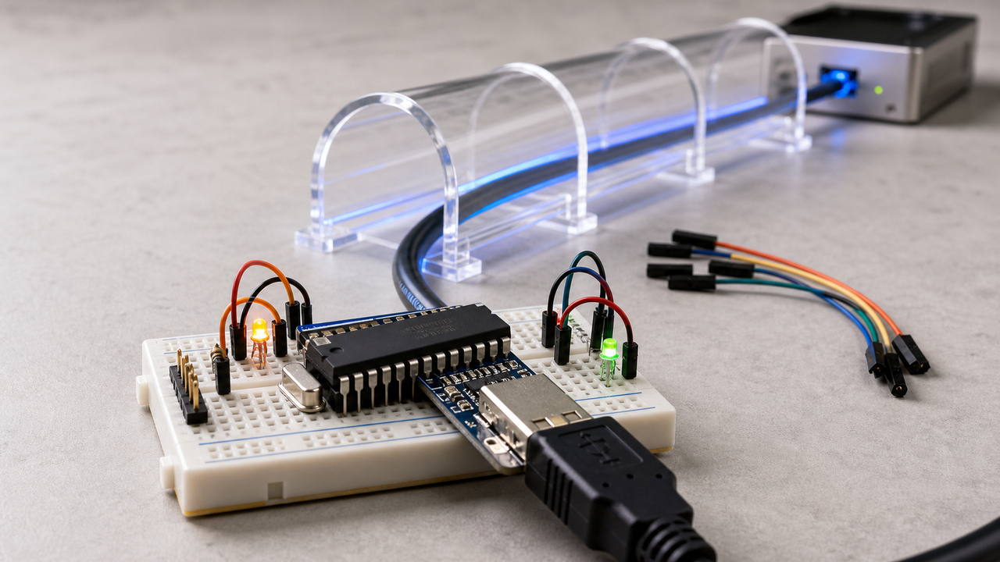

Um site pendurado em um chip de um dólar parece piada de laboratório, mas ele explica bem o dia.

Às vezes a parte interessante da tecnologia não está no software gigante, nem no modelo com bilhões de parâmetros, nem na ferramenta que promete escrever metade do projeto enquanto você toma café. Está no caminho. Como a requisição chega? Quem recebe? Quem pode mexer? O que fica exposto? O que volta como resposta útil quando algo quebra?

Esse tipo de pergunta aparece em lugares bem diferentes. Um dispositivo minúsculo só consegue servir uma página pública porque alguém colocou um túnel entre ele e a internet. Um compilador experimental tenta falar de um jeito mais fácil para agentes de código entenderem, corrigirem e tentarem de novo. Um modelo local volta a deixar pesquisador brincar com o comportamento durante a inferência, porque, no próprio computador, dá para encostar em partes que uma API hospedada nunca mostra. E a comunidade Python discute como pacote, wheel, upload e registro precisam ficar menos ingênuos antes do próximo susto de supply chain.

Nada disso é mágica. Ainda bem.

O ponto comum é bem terreno: quando as ferramentas começam a trabalhar mais sozinhas, ou mais longe, ou mais perto de infraestrutura real, a gente precisa de contratos melhores. Contrato de rede, contrato de ferramenta, contrato de revisão, contrato de pacote. Sem isso, tudo vira uma confiança meio artesanal, bonita na bancada, esquisita quando entra em produção.

Hoje tem chip de 8 bits na internet, linguagem nova para agentes, controle local de modelo, pacote Python e umas ferramentas pequenas dizendo a mesma coisa por caminhos diferentes: o trabalho esperto continua precisando de trilho.

## Um site saiu de um microcontrolador por cabo serial e WireGuard

A história mais visual do dia vem de um projeto que coloca uma página pública para sair de um AVR64DD32, um microcontrolador de 8 bits com 8 kB de RAM, 64 kB de flash e clock de até 24 MHz. O autor diz que o chip custa por volta de um dólar. Isso é menos memória do que muita aba do navegador usa só para lembrar que ela existe.

O caminho até a internet é a parte boa. Em vez de colocar um chip Ethernet no projeto, o autor usou SLIP, um protocolo antigo descrito na RFC 1055, por cima de uma conexão USB serial. No Linux, isso vira uma interface de rede com comandos como `stty` e `slattach`. A partir daí, uma caixinha Linux faz a ponte para uma VPS usando WireGuard, e a VPS faz proxy só do caminho `/mcu` de volta para o microcontrolador.

Traduzindo: o dispositivo frágil fica em casa, preso em uma interface serial. A máquina local entende esse cabo como rede. O túnel criptografado leva o tráfego até uma VPS. A VPS cuida da porta pública, do TLS, do IPv6 e do caminho que chega ao chip. O microcontrolador só precisa fazer a parte pequena, que já não é tão pequena assim: o autor escreveu pedaços de TCP/IP e usa uma resposta HTTP fixa para a demonstração.

Não é uma recomendação para hospedar o blog da empresa em um chip de 8 bits. A própria página avisa que é lento, frágil, sem cache ou buffer no proxy, e que derrubar aquilo não deve exigir um tratado de guerra cibernética.

Mas como aula de infraestrutura, é ótima. Muita produção moderna faz uma versão mais adulta da mesma ideia: dispositivo privado, ponte local, túnel seguro, porta pública controlada. O brinquedo só deixa a arquitetura mais fácil de enxergar. Às vezes o melhor diagrama de rede é um cabo serial humilhando a nossa autoestima.

Fontes: [post do projeto](https://maurycyz.com/projects/mcusite/), [página viva no microcontrolador](https://maurycyz.com/mcu/) e [WireGuard](https://www.wireguard.com/).

## Zero olha para o agente como usuário da ferramenta

A Vercel Labs publicou um repositório chamado Zero, descrito como "The programming language for agents". O projeto é Apache-2.0, experimental e o README deixa claro que ainda não é estável. Então vamos baixar a ansiedade: isso não é "o novo Rust", nem "a linguagem que vai substituir C", nem qualquer frase que mereça ser impressa em camiseta de evento.

O que interessa é o desenho. O README apresenta Zero como uma linguagem de sistemas para pequenas ferramentas nativas, com efeitos explícitos, memória previsível e saída estruturada do compilador. A release `v0.1.1`, publicada em 16 de maio de 2026, adicionou um instalador público, `zero run` e atualizações de documentação.

Por que isso merece espaço? Porque agentes de código ainda dependem muito de texto feito para humanos. O compilador cospe um erro, a ferramenta de build despeja uma mensagem, o agente tenta interpretar aquilo, mexe no arquivo, roda de novo e torce para ter entendido. Funciona em alguns casos. Em outros, é uma pessoa tentando passar instrução técnica por bilhete dobrado embaixo da porta.

Zero tenta tratar a ferramenta como parte do loop de reparo. Comandos como `zero check`, `zero run`, `zero build --emit exe` e `zero doctor --json` aparecem nesse contexto: checar, executar, construir e diagnosticar com uma superfície mais previsível para automação. O detalhe do JSON é simples, mas importante. Para um agente, receber diagnóstico estruturado pode virar uma lista de ações; receber um parágrafo triste é mais uma rodada de adivinhação.

Tem também a parte de efeitos explícitos. Em uma linguagem voltada para pequenos binários auxiliares, isso conversa com sandbox, permissão e previsibilidade. Se a ferramenta declara melhor o que pode fazer, fica mais fácil limitar onde ela mexe. O assunto ainda é cedo, o repositório é novo e não há evidência de adoção em produção. Mesmo assim, como sinal de design, é bem limpo: talvez a próxima geração de ferramenta de desenvolvimento precise escrever mensagens para humanos e para agentes.

E, para falar a verdade, humanos também ganham quando ferramenta deixa de responder como se estivesse brava com a nossa existência.

Fontes: [vercel-labs/zero](https://github.com/vercel-labs/zero), [release v0.1.1](https://github.com/vercel-labs/zero/releases/tag/v0.1.1) e [cobertura da MarkTechPost](https://www.marktechpost.com/2026/05/17/vercel-labs-introduces-zero-a-systems-programming-language-designed-so-ai-agents-can-read-repair-and-ship-native-programs/).

## DeepSeek V4 Flash reacende uma pergunta antiga: dá para controlar comportamento localmente?

Sean Goedecke publicou em 16 de maio um texto defendendo que DeepSeek-V4-Flash torna steering de LLM interessante de novo. A ideia, explicada sem vestir jaleco, é tentar ajustar o comportamento do modelo durante a inferência mexendo em ativações internas, em vez de só escrever um prompt maior.

Um steering vector nasce comparando o que muda dentro do modelo quando você pede uma resposta com certo comportamento e quando pede sem aquilo. Depois, durante a execução, você injeta essa diferença para tentar empurrar o modelo naquela direção. Pode ser algo simples, como mais ou menos verbosidade, ou uma tendência de recusa. Quando alguém começa a falar em conceitos grandes demais, tipo "inteligência" como se fosse um botão giratório, a conversa já precisa de freio.

A razão para DeepSeek V4 Flash entrar nisso é acesso. O model card da DeepSeek lista o V4 Flash com 284 bilhões de parâmetros totais, 13 bilhões ativados e janela de contexto de 1 milhão de tokens. Rodar algo desse tamanho localmente ainda não é hobby barato, mas DS4, ou DwarfStar 4, do antirez, mira justamente esse caminho: um motor local estreito para DeepSeek 4 Flash, com suporte a Metal e CUDA, não um runner genérico para qualquer arquivo GGUF.

Sean aponta que o DS4 já trata steering como recurso de primeira classe, ainda que rudimentar. O README do projeto também pede calma: código e arquivos estão em qualidade alpha, o alvo principal começa em Macs com 96 GB de RAM, há CUDA e um ramo separado para ROCm, e o projeto é específico para esse modelo.

O caveat do próprio Sean é o que salva a história de virar propaganda. Ele está fascinado, mas cético. Muitos ganhos simples talvez continuem mais fáceis com prompt. Objetivos mais ambiciosos podem pedir fine-tuning ou treinamento. Ainda assim, a janela abriu um pouco: quando o modelo roda localmente, com pesos e ativações por perto, dá para testar controles que uma API fechada não oferece.

Para quem trabalha com agentes, isso é mais laboratório do que receita. Mas laboratório bom muda a conversa. Ele mostra onde a promessa quebra, onde funciona e onde alguém precisa parar de chamar tudo de "prompt engineering" só porque é o nome mais confortável no boleto.

Fontes: [Sean Goedecke](https://www.seangoedecke.com/steering-vectors/), [antirez/ds4](https://github.com/antirez/ds4) e [model card DeepSeek-V4-Flash](https://huggingface.co/deepseek-ai/DeepSeek-V4-Flash).

## PyCon discutiu pacote Python como problema de política, não só de ferramenta

Depois de tantas histórias recentes envolvendo pacote comprometido, o resumo do Packaging Summit da PyCon US 2026 é um respiro útil. Não porque tenha uma correção final pronta, mas porque mostra a comunidade olhando para o encanamento: formato de pacote, comportamento de upload, abuso de registro e resolvers.

Segundo o recap de Bernat Gabor, o summit aconteceu em 15 de maio de 2026, em Long Beach. Um dos assuntos foi Wheel 2.0, ligado ao PEP 777. A ideia do PEP é abrir caminho para mudanças que o formato atual de wheel dificulta, como compressão melhor e metadados futuros. O primeiro sub-PEP citado no recap envolve Zstandard. A estimativa apresentada ali é que os mil wheels mais baixados poderiam ficar cerca de 25% menores, mas isso é mudança de ecossistema, daquelas que levam anos e dependem de instaladores, índices e compatibilidade.

A parte de supply chain é mais indigesta. Mike Fiedler discutiu vetores de abuso no PyPI: arquivos que continuam existindo como estado persistente, releases antigas que podem receber novos arquivos depois, e o uso do PyPI como uma espécie de CDN genérica para conteúdo que não é exatamente pacote Python.

O recap também fala em crescimento de novos projetos, de algo como 8 mil para 24 mil por mês, enquanto recursos dedicados de segurança continuam limitados. Esse tipo de número precisa ficar atribuído ao recap, mas a proporção já ajuda a entender o problema: moderação humana não escala do mesmo jeito que upload automatizado.

Entre as propostas discutidas aparecem janelas de cooldown para arquivos recém-enviados, reabertura explícita com checagens para releases antigas, e ideias futuras como Upload 2.0, já associado ao PEP 694, ou mecânicas de release selada. Nada disso deve ser escrito como "o pip agora faz". É discussão, proposta e direção de trabalho.

Mesmo assim, é uma notícia boa de acompanhar. Segurança de dependência não mora só no `requirements.txt` do seu projeto. Ela mora no registro, no instalador, no formato, na política de upload, na compressão, no resolver e na capacidade de detectar abuso antes que o CI puxe o pacote feliz da vida.

Fontes: [recap de Bernat Gabor](https://bernat.tech/posts/pycon-us-2026-packaging-summit-recap/), [discussão no Python.org](https://discuss.python.org/t/packaging-summit-at-pycon-us-2026/106911/2), [PEP 777](https://peps.python.org/pep-0777/) e [notas oficiais no HackMD](https://hackmd.io/@jezdez/pycon2026-packaging-summit).

## Destaques rápidos para hoje.

- Codiff chegou à versão `v0.1.0` em 17 de maio como um visualizador local de diffs para mudanças staged e unstaged em Git. O detalhe interessante para a era dos agentes é o `codiff -w`, que gera um walkthrough, e os comentários inline copiáveis em Markdown com contexto de diff. Ainda é lançamento inicial, por enquanto com app macOS e helper de terminal. Fontes: [release](https://github.com/nkzw-tech/codiff/releases/tag/v0.1.0) e [README](https://github.com/nkzw-tech/codiff).

- Grafana disse, segundo reportagem do The Hacker News, que um token do ambiente GitHub foi comprometido e permitiu download de código-fonte, seguido de tentativa de extorsão. A empresa, citada pela reportagem, afirma que não houve acesso a dados de clientes, informações pessoais, sistemas de clientes ou impacto operacional. O tipo exato de token e o vetor de ataque não aparecem nos detalhes públicos, então a lição por enquanto é higiene ampla de credenciais, escopos e rotação. Fontes: [The Hacker News](https://thehackernews.com/2026/05/grafana-github-token-breach-led-to.html) e [thread da Grafana no X](https://x.com/grafana/status/2055827123236171827).

- A Mozilla publicou em 15 de maio uma resposta a reguladores do Reino Unido contra a ideia de age-gating em VPNs. O argumento não é "deixa tudo solto"; é que VPN também protege jornalistas, ativistas, trabalhadores remotos, jovens usuários e qualquer pessoa tentando reduzir rastreamento por IP. A alternativa defendida pela Mozilla passa por responsabilização de plataformas, controles parentais responsáveis e educação digital. Fontes: [Mozilla](https://blog.mozilla.org/netpolicy/2026/05/15/mozilla-to-uk-regulators-vpns-are-essential-privacy-and-security-tools-and-should-not-be-undermined/) e [consulta do governo britânico](https://www.gov.uk/government/consultations/growing-up-in-the-online-world-a-national-consultation).

- Uros Popovic publicou um bom guia separando em camadas aquilo que muita gente chama só de "terminal": emulador, pseudo-terminal e shell. O emulador desenha bytes e captura entrada; o pty liga pontas e cuida de disciplina de linha; o shell interpreta comandos e inicia processos. É básico, mas é um básico que explica metade das confusões com `tty`, escape sequences e programas interativos. Fonte: [Linux Field Guide](https://lfg.popovicu.com/series/the-shell-as-a-language/terminal-tty-and-shell/).

- Wraith abriu um caminho gratuito e aberto de defesa para treino de prompt injection. O módulo visível agora é System Prompt Hardening, com 12 probes, passagem a partir de 80% e, segundo o anúncio, pontuação determinística ou heurística. É útil como exercício de camada defensiva, desde que ninguém confunda prompt endurecido com segurança completa de agente. Agente de verdade também precisa de sandbox, permissão, limite de dados e registro de ação. Fontes: [Wraith Defense Path](https://wraith.sh/defense) e [anúncio no Reddit](https://www.reddit.com/r/cybersecurity/comments/1tfas46/we_built_a_blueteam_mode_for_ai_security_training/).

- Donos de Fisker Ocean viraram um caso prático de sobrevivência pós-cloud. A Electrek reporta organização de comunidades após a falência da Fisker em 2024, e o repositório Apache-2.0 `home-assistant-MyFisker` confirma uma integração para Home Assistant feita por engenharia reversa da API do app My Fisker, expondo valores da nuvem como sensores e botões. O README ainda avisa sobre incerteza de acesso à nuvem. Produto dependente de servidor vira herança arquitetural quando a empresa some. Fontes: [Electrek](https://electrek.co/2026/05/16/fisker-ocean-open-source-ev-story-after-bankruptcy/) e [GitHub](https://github.com/MichaelOE/home-assistant-MyFisker).

- Um artigo em PT-BR no TabNews explica cache em sistemas distribuídos olhando para cache-aside, write-through, write-behind, TTL jitter, hot keys e thundering herd. É conteúdo educacional, não notícia de produto, mas vale a leitura porque coloca cache no lugar certo: banco como verdade durável, cache como aceleração temporária com falhas próprias. Fonte: [TabNews](https://www.tabnews.com.br/andersonlimadev/caching-em-sistemas-distribuidos-cache-aside-write-through-e-write-behind).

## Acompanhamento de tendências do dia.

O tema dos agentes hoje aparece menos como "modelo novo" e mais como trabalho de infraestrutura. Thorsten Ball descreveu um fluxo de debugging em produção usando prompts longos em Markdown como runbooks para Amp: um agente produz relatório, outro agente fresco valida ou propõe correção. A graça está no processo, não na fantasia de uma sessão de chat onisciente.

O próprio Amp Neo reforça essa direção. A CLI foi reconstruída com controle remoto, compaction automática, fila, steering, API de plugins e permissões movidas para plugins. Isso deixa a ferramenta menos parecida com uma caixa de texto glorificada e mais parecida com um ambiente que precisa de política, evento, UI, comando e porteiro.

Aí entram os sustos normais. The Register reportou o merge de uma reescrita grande do Bun, de Zig para Rust, com mais de um milhão de linhas adicionadas e testes passando, segundo a cobertura. Impressiona. Também dá frio na nuca de quem já revisou PR grande demais. Código assistido por IA pode chegar rápido; revisão, ownership e regressão continuam sendo humanos com ferramenta na mão e uma aba de teste aberta.

Zero, Codiff, Amp e esse tipo de runbook apontam para o mesmo lugar: agentes ficam mais úteis quando a casa em volta deles tem contrato. Saída estruturada, permissão explícita, diffs revisáveis, contexto vivo, agente novo para checar agente velho. Parece menos futurista do que "IA programa tudo sozinha". Melhor assim. Futuro que cabe em checklist costuma quebrar menos coisa.

Fontes: [Joy & Curiosity #86](https://registerspill.thorstenball.com/p/joy-and-curiosity-86), [Amp Neo](https://ampcode.com/news/neo) e [The Register](https://www.theregister.com/devops/2026/05/14/anthropics-bun-rust-rewrite-merged-at-speed-of-ai/5240381).

> Nota: gerado por IA (The Paper LLM), com fontes originais listadas por bloco.

<!--
briefing_slug: 2026-05-17
generated_at: 2026-05-17T06:25:55-03:00
source_urls:
  - https://maurycyz.com/projects/mcusite/
  - https://maurycyz.com/mcu/
  - https://www.wireguard.com/
  - https://github.com/vercel-labs/zero
  - https://github.com/vercel-labs/zero/releases/tag/v0.1.1
  - https://www.marktechpost.com/2026/05/17/vercel-labs-introduces-zero-a-systems-programming-language-designed-so-ai-agents-can-read-repair-and-ship-native-programs/
  - https://www.seangoedecke.com/steering-vectors/
  - https://github.com/antirez/ds4
  - https://huggingface.co/deepseek-ai/DeepSeek-V4-Flash
  - https://bernat.tech/posts/pycon-us-2026-packaging-summit-recap/
  - https://discuss.python.org/t/packaging-summit-at-pycon-us-2026/106911/2
  - https://peps.python.org/pep-0777/
  - https://hackmd.io/@jezdez/pycon2026-packaging-summit
  - https://github.com/nkzw-tech/codiff/releases/tag/v0.1.0
  - https://github.com/nkzw-tech/codiff
  - https://thehackernews.com/2026/05/grafana-github-token-breach-led-to.html
  - https://x.com/grafana/status/2055827123236171827
  - https://blog.mozilla.org/netpolicy/2026/05/15/mozilla-to-uk-regulators-vpns-are-essential-privacy-and-security-tools-and-should-not-be-undermined/
  - https://www.gov.uk/government/consultations/growing-up-in-the-online-world-a-national-consultation
  - https://lfg.popovicu.com/series/the-shell-as-a-language/terminal-tty-and-shell/
  - https://wraith.sh/defense
  - https://www.reddit.com/r/cybersecurity/comments/1tfas46/we_built_a_blueteam_mode_for_ai_security_training/
  - https://electrek.co/2026/05/16/fisker-ocean-open-source-ev-story-after-bankruptcy/
  - https://github.com/MichaelOE/home-assistant-MyFisker
  - https://www.tabnews.com.br/andersonlimadev/caching-em-sistemas-distribuidos-cache-aside-write-through-e-write-behind
  - https://registerspill.thorstenball.com/p/joy-and-curiosity-86
  - https://ampcode.com/news/neo
  - https://www.theregister.com/devops/2026/05/14/anthropics-bun-rust-rewrite-merged-at-speed-of-ai/5240381
omitted_briefing_items:
  - FreeBSD 15.1 Beta 3: minor beta note with lower public value today; omitted because stronger verified stories were available and no clean primary BETA3 announcement was used here.
-->
