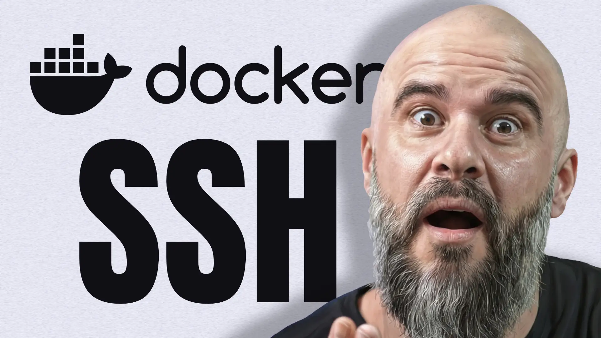

Se você entende **como o Docker funciona** e o utiliza no seu dia a dia, sabe
que ele é uma mão na roda para muitas coisas além do desenvolvimento. Você pode
até fazer deploy com ele, como
[já mostrei](https://youtu.be/yxxEk68EDgo?si=t1GbSOZ62aShmcZD) algumas vezes no
passado.

Só que existem algumas configurações que uso bem menos do que deveria. Como é o
caso do contexto _(Docker Context)_. Uma parte extremamente simples do Docker,
mas que pode salvar o dia e evitar que você fique fazendo conexões remotas sem
necessidade.

**Em vídeo:** se preferir, tenho este mesmo
[conteúdo em vídeo](https://youtu.be/tXM3Ifd6_T8).

---

## Mais de um computador? Sem problemas!

Vamos montar um cenário fictício e depois te falo como isso se encaixa com o meu
momento atual.

Suponha que você tem um computador que fica sempre parado e um laptop que usa
para trabalhar com mais conforto pela casa. O computador tem um hardware
excelente e te ajuda nas tarefas mais pesadas. Mas, seu laptop só consegue te
ajudar em cenários de baixo “_load_”.

Usar Docker no laptop vai **engolir** todo o pouco recurso que ele tem.

Este cenário é muito similar ao que tenho atualmente. Só que o meu problema é um
pouco diferente.

Por incrível que pareça, **utilizo três computadores ao mesmo tempo.** Quando
falo isso, pessoas costumam duvidar. Mas, não é exagero.

Tenho um **MacBook M1 com 32GB de RAM** que carrego pra todo lado (vamos
chamá-lo de **m132**). Nada a reclamar deste laptop. No entanto, ele não roda um
“_gpt-oss:120b_“ ou outros modelos open-source mais parrudos.

Para esses casos mais extremos, tenho um **MacBook M4 com 128GB de RAM** (que
vamos chamar de **m4128**). Só que este é o meu computador que “_fica parado_”.
Como gravo e edito bastante conteúdo, este computador fica com câmeras,
microfones e várias outras coisas conectadas o tempo todo. Eu sei que poderia
desconectar tudo e usá-lo como um laptop, mas manter tudo conectado evita atrito
na hora de gravar algo novo. Só preciso pressionar um simples botão e já
“**estou no-ar**”.

Para complicar um pouco mais a história, o laptop da minha esposa estragou a
tela e ficou encostado por meses. Quando consultamos o preço para troca da tela,
valia mais comprar outro do que mantê-lo.

Em um belo dia, decidi instalar o [Asahi Linux](https://asahilinux.org/) neste
último laptop (uma versão do **Fedora**). Não estava com muitas esperanças que
tudo funcionasse. Este é um **MacBook Air M1 com 8GB de RAM** (vamos chamá-lo
carinhosamente de **fedoraair**).

Acontece, que o Fedora rodou tão liso neste MacBook via SSH, que eu só queria
usar o bendito Linux.

---

## Três computadores ao mesmo tempo

Agora que você entendeu o cenário, **como isso funciona**? E, o mais importante:
o que isso tem a ver com **Docker Context**?

Como o **fedoraair** está com a tela danificada, ele também fica parado. Por
isso, continuo usando o **m132** o dia todo. Meu ambiente de desenvolvimento
está inteiro no terminal, então não preciso de GUI.

E sim, uso as IAs todas (Claude, Codex e Gemini) via CLI sem interface gráfica.

O que fiz foi configurar SSH em todos os computadores. Então, consigo trabalhar
por qualquer um deles simplesmente digitando:

```shell
ssh m132 # <-- Me conecto por aqui
ssh m4128
ssh fedoraair # <-- E trabalho aqui
```

Sem perceber, acabei montando o **cenário perfeito para o Docker Context**. A
única coisa que você precisa para isso funcionar da mesma maneira que uso por
aqui é uma conexão SSH com o computador ou servidor remoto.

```shell
# Do m132 entro no fedoraair
ssh fedoraair

# Do fedoraair rodo comandos normal
docker run ...

# O Docker Context está apontado para m4128
# Então, comandos do Docker CLI, rodam lá
# e não consomem recursos do fedoraair 🥹.
```

Isso significa que toda vez que estou usando o Docker no fedoraair, estou usando
3 computadores ao mesmo tempo (_LITERALMENTE_).

---

## O que é o Docker Context?

Ao invés de entrar via SSH para rodar comandos manualmente no **m4128**, uso o
cliente do Docker (o CLI) para enviar comandos remotamente para o motor (engine)
do Docker na máquina potente.

Faça esse teste comigo... Vai lá, coragem... Abre esse terminal aí agora e roda
o comando:

```bash
docker context ls
```

Você vai ver a lista de contextos configurados na sua máquina.

Por padrão, ele aponta para um Unix Socket local, o que significa que os
comandos rodam na sua própria máquina.

Mas nós podemos criar novos contextos para apontar para outras máquinas.

### Como criar e usar um Docker Context remotamente

Suponha que eu queira me conectar ao **m4128** agora. Posso criar um contexto
novo especificamente para isso.

Se você tem um servidor, mesma coisa. Não importa onde ele estiver (só precisa
de SSH). Crie o contexto:

```bash
docker context create m4128 --docker "host=ssh://USUARIO@HOST_OU_IP"
```

Muda o nome do contexto para o que quiser. Vou usar **m4128** só porque já me
acostumei com os nomes.

> Dica: Se você já configurou o seu arquivo `.ssh/config` como eu (ensinei isso
> [neste vídeo](https://youtu.be/0eG9Vorc-TY?t=1172&si=xuTkSYeD59lJQtSp)), você
> pode simplesmente usar o alias que você definiu:

```shell
docker context create m4128 --docker "host=ssh://m4128"
```

Para listar e ver se deu tudo certo:

```shell
docker context ls
```

Agora que o contexto foi criado, tudo o que precisamos fazer é dizer ao Docker
para usá-lo:

```shell
docker context use m4128
```

A partir deste momento, qualquer comando Docker que você digitar no seu terminal
(como `docker run`, `docker service ls` ou `docker node ls`) será executado não
na sua máquina local, mas lá no servidor remoto.

A magia disso é que você pode interagir com um Swarm ou subir imagens pesadas no
seu provedor de nuvem (como a [Hostinger](https://hostinger.com/otaviomiranda))
direto do seu laptop, sem consumir um único MegaByte da sua memória local!

> Intromissão sem vergonha 💜
>
> Se precisar de servidor VPS, tenho link e cupom que te dá um belo desconto por
> até 2 anos se quiser.
>
> [https://hostinger.com/otaviomiranda](https://hostinger.com/otaviomiranda)  
> Cupom: OTAVIOMIRANDA
>
> Obrigado à Hostinger por acreditar no meu conteúdo.

---

## O Cuidado Necessário: Bind Mounts vs Named Volumes

Nem tudo são flores. Ao utilizar esse setup, você precisa ficar **atento aos
Volumes**.

Quando usamos [bind mount](https://docs.docker.com/engine/storage/bind-mounts/)
(_que atrela uma pasta local do seu projeto ao container_), o Docker tentará
fazer o bind da pasta que existe lá no servidor, e não na sua máquina local de
onde você disparou o comando. Afinal, o motor do Docker está rodando
remotamente.

### Como resolver isso?

Se a sua imagem não depende de arquivos locais, você pode usar o setup remoto
sem problemas.

Se você precisa de volumes, recomendo utilizar Named Volumes no seu
`docker-compose.yml`.

Exemplo de uso com Named Volumes:

```yaml
services:
  app:
    image: nginx:latest
    volumes:
      - dados-app:/var/www/html

volumes:
  dados-app:
```

Dessa forma, o Docker se encarrega de criar e gerenciar o volume na máquina
remota, evitando transtornos de sincronização de pastas ou de erros ao tentar
mapear uma pasta que só existe no seu computador local.

Existem outras formas de contornar isso, mas essa é, de longe, a mais fácil.

---

## Alternativa com Variável de Ambiente

Para uma alteração rápida, sem precisar criar e salvar um contexto inteiro, você
pode utilizar a variável de ambiente `DOCKER_HOST`:

```shell
export DOCKER_HOST=ssh://m4128
docker ps
```

Ele fará praticamente o mesmo processo, de forma direta e provisória. Recomendo
usar o docker context para um setup mais contínuo e organizado.

---

Seja para economizar recursos locais utilizando um servidor potente ou para
gerenciar seu ambiente em nuvem remotamente, o Docker Context via SSH é uma
ferramenta indispensável no seu cinto de utilidades **DevOps**.

Se você gostou deste conteúdo e não quer perder as próximas dicas de só me
seguir! Posto aqui e em várias outras redes direto 😘.
