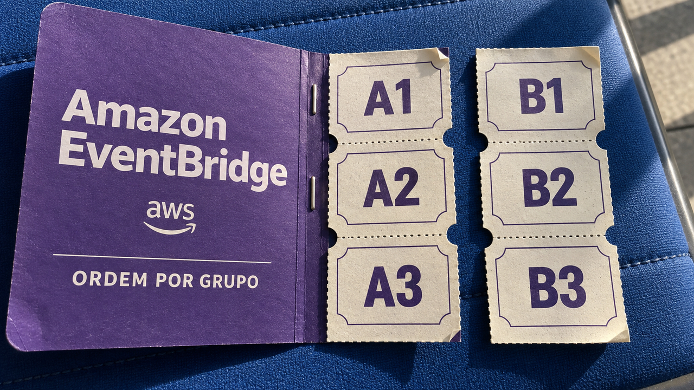

A AWS anunciou barramentos do EventBridge que ordenam eventos por grupo e eliminam repetições dentro de uma janela de cinco minutos. A Cloudflare divulgou a correção de uma falha que permitia recuperar dados deixados em blocos de disco por outros clientes. As duas notícias de 24 de setembro mostram limites importantes da infraestrutura: a entrega de mensagens ainda exige cuidados na aplicação, e o isolamento entre máquinas virtuais também depende da limpeza do armazenamento. Nesta edição, há ainda um agente de fuzzing do GitHub que automatiza a busca por bugs, mas precisa de um ambiente descartável para rodar.

## Novos barramentos do EventBridge oferecem ordem por grupo e deduplicação por cinco minutos

A AWS anunciou um novo tipo de barramento personalizado no Amazon EventBridge, serviço que recebe eventos de aplicações e os encaminha aos consumidores interessados. A versão aprimorada permite compartilhar um barramento entre contas da organização e reúne filtro, destino, tentativas de reenvio e destino de mensagens que falharam num recurso chamado `Subscriber`.

Isso reduz a quantidade de configurações espalhadas para conectar equipes. Quem publica informa o que aconteceu; cada consumidor define quais eventos quer receber e como lidar com falhas. Os barramentos anteriores continuam funcionando como **classic**. A novidade é um recurso a adotar, não uma mudança obrigatória aplicada às aplicações existentes.

A ordenação tem um escopo importante: vale para eventos com o mesmo `EventGroupId`, nos assinantes que optarem pela entrega ordenada. No exemplo da AWS, atualizações de localização de um motorista seguem sua sequência. Isso não estabelece uma fila única ordenando todos os motoristas, pedidos e pagamentos da empresa.

No caso do AWS Lambda, a invocação síncrona permite esperar a confirmação de processamento antes de reconhecer o evento. Já a deduplicação por conteúdo identifica eventos equivalentes e elimina repetições recebidas dentro de **cinco minutos**. A AWS descreve essa janela como entrega exatamente uma vez para essas tentativas e recomenda manter os tokens de idempotência quando a aplicação já os usa.

O cuidado de arquitetura é separar entrega de efeito de negócio. Imagine, como exemplo, um consumidor que registra uma cobrança e falha antes de confirmar que terminou. Uma nova tentativa precisa reconhecer a operação já realizada. Ordenar mensagens ou eliminar publicações repetidas por alguns minutos não cria, por si só, uma transação única envolvendo banco, provedor de pagamento e confirmação do consumidor.

Por isso, preserve a idempotência: repetir a mesma operação deve produzir o mesmo efeito, não uma segunda cobrança. Revise também o comportamento de reprocessamentos antigos, que não cabem automaticamente naquela janela de deduplicação.

Para equipes brasileiras, há outro detalhe prático: **São Paulo não aparece na lista de regiões do lançamento**. Confira disponibilidade e requisitos de localização dos dados antes de planejar a adoção. Nos novos barramentos, a cobrança é por throughput de entrada e saída, isto é, pelo volume de dados por unidade de tempo. A comparação de custos precisa considerar esse modelo, não apenas a quantidade de eventos.

Fonte: [AWS — anúncio dos novos barramentos personalizados do EventBridge](https://aws.amazon.com/blogs/aws/introducing-enhanced-custom-event-buses-in-amazon-eventbridge-for-enterprise-scale-event-driven-applications/).

## Cloudflare limpa discos e snapshots após falha de isolamento entre clientes

A Cloudflare divulgou em 24 de setembro uma vulnerabilidade em **Containers e Sandboxes**, este último construído sobre Containers. Segundo o relato, preparado em colaboração com os pesquisadores que reportaram o problema, um cliente com conta Workers Paid podia recuperar resíduos de disco de containers anteriores no mesmo host. A empresa informa que concluiu a correção e que os clientes não precisam alterar configurações.

Cada container roda dentro de uma máquina virtual Firecracker. Mas o disco gravável depende de uma camada compartilhada de armazenamento, o `dm-thin` do Linux. Ela aloca espaço físico conforme a aplicação escreve, em vez de reservar antecipadamente todo o tamanho do disco virtual.

O problema estava na reutilização desse espaço. Os blocos liberados voltavam a um conjunto compartilhado entre clientes, e uma opção desabilitava sua limpeza antes da próxima alocação. Uma gravação que ocupasse apenas parte do bloco substituía aquela parte; o restante podia conservar bytes do cliente anterior. A fronteira da máquina virtual não apagava o que a camada de armazenamento entregava a ela.

A exposição tinha limites: dependia de receber blocos reutilizados com resíduos, sem escolher uma vítima específica ou acessar um disco ainda conectado a outro cliente. Os pesquisadores não demonstraram alteração dos dados ativos de outra conta nem indisponibilidade. Ainda assim, o relatório descreve recuperação de estruturas de diretórios e páginas de bancos de dados, suficiente para caracterizar uma falha séria de confidencialidade entre clientes.

A primeira correção foi restaurar a limpeza dos blocos recém-alocados. **Isso não corrigia automaticamente os blocos já mapeados.** Discos em execução e snapshots de camadas de imagens guardados em cache ainda podiam carregar o estado anterior. A Cloudflare também aposentou esses discos e removeu os snapshots antigos para recriá-los com alocações limpas.

A cronologia ajuda a não confundir divulgação com início do incidente: o reporte aconteceu em 4 de setembro; a implantação da mudança de configuração terminou no dia 7; a limpeza dos snapshots anteriores à mitigação foi concluída no dia 19.

A empresa diz não ter encontrado exploração maliciosa na telemetria histórica de entrada e saída de disco disponível. Essa é uma conclusão delimitada pelos registros examinados, não uma prova de que nenhum acesso indevido jamais ocorreu.

Para quem opera infraestrutura, o ponto reaproveitável é incluir o estado antigo no plano de correção. Mudar a configuração protege o caminho novo; caches, snapshots e recursos ainda em uso podem precisar de uma segunda etapa de recuperação.

Fonte: [Cloudflare — análise, impacto e cronologia da vulnerabilidade](https://blog.cloudflare.com/containers-cross-tenant-vulnerability/).

## Agente de fuzzing do GitHub usa cobertura como feedback e pede ambiente descartável

O GitHub Security Lab apresentou em 24 de setembro um fluxo para automatizar fuzzing de projetos C e C++. Fuzzing significa exercitar um programa com muitas entradas variadas, procurando falhas. Um *harness* é o pequeno código que conecta essas entradas às funções que serão testadas.

No fluxo descrito por Antonio Morales, o agente escreve esses harnesses e aciona o AFL++, a ferramenta que executa o fuzzing. Depois, examina a cobertura — quais trechos do código foram exercitados — e tenta alcançar os que ficaram de fora. Pode acrescentar uma entrada inicial, mudar o harness ou enriquecer o dicionário de valores usado pelo fuzzer. O resultado da execução orienta a próxima tentativa.

Uma decisão de implementação torna esse feedback mais claro: cada harness gera dois binários. Um tem a instrumentação que guia o AFL++; o outro reproduz as entradas para medir linhas e ramificações percorridas no código. O modelo decide o próximo passo, as ferramentas executam e as etapas compartilham estado persistente num banco SQLite.

O fluxo também simplifica as entradas que provocam crashes, mantendo a falha reproduzível, e prepara relatórios. Mas um crash pode estar no próprio harness, não na biblioteca investigada. O autor ressalta que os vereditos e patches gerados exigem revisão humana. Cobertura ajuda a saber onde o teste passou; não certifica que o programa esteja livre de vulnerabilidades.

Há um aviso que deve vir antes de qualquer experiência: **os compiladores, o fuzzer e os comandos de build escolhidos pelo modelo rodam diretamente no host, sem um container intermediário**. Isso torna o ambiente de execução parte do risco: os comandos escolhidos pelo agente usam as permissões do usuário que iniciou o processo.

A recomendação explícita é usar um Codespace ou máquina virtual descartável, sem privilégios elevados. É uma boa separação de responsabilidades: dê ao experimento código e recursos para investigar, sem entregar junto a estação de trabalho e seus acessos de produção.

Fonte: [GitHub Security Lab — arquitetura e cuidados do Fuzzing Taskflow](https://github.blog/security/application-security/ai-powered-fuzzing-with-the-github-security-lab-taskflow-agent/).

## Destaques rápidos para hoje.

- **Go explica sua API experimental de SIMD portátil.** O artigo de 24 de setembro detalha o pacote `simd` do Go 1.27, ativado com `GOEXPERIMENT=simd`. SIMD permite aplicar uma operação a vários valores de uma vez, aproveitando instruções vetoriais da CPU. A interface esconde diferenças de tamanho dos vetores e oferece emulação quando falta suporte. Isso não garante o mesmo desempenho em qualquer máquina: teste o algoritmo no hardware de destino e lembre que a API ainda é experimental. Fonte: [Go — Platform-independent SIMD](https://go.dev/blog/simd-experiment).

- **Graham Dumpleton reúne 70 workshops gratuitos de Python.** A coleção anunciada em 25 de setembro vai de decorators à instrumentação e ao acompanhamento da execução de código com `wrapt` e `wrapture`. Depois da [demonstração de tracing por configuração que já cobrimos](/2026/magento-ganha-hotfix-e-testes-de-agentes-podem-concordar-com-o-erro/), a novidade é um percurso prático para aprender essas técnicas. Só a coleção de decorators com a biblioteca padrão roda inteiramente no navegador via JupyterLite; todas oferecem opções de JupyterLab hospedado. Quem está começando pode ficar nos fundamentos, enquanto quem precisa observar uma aplicação real pode procurar os módulos de instrumentação. Fonte: [Graham Dumpleton — apresentação das coleções](https://grahamdumpleton.me/posts/2026/09/a-master-class-in-decorators-patching-and-tracing/).

> Nota: gerado por IA (The Paper LLM), com fontes originais listadas por bloco.

<!--
briefing_id: 27954
source_urls:
  - https://aws.amazon.com/blogs/aws/introducing-enhanced-custom-event-buses-in-amazon-eventbridge-for-enterprise-scale-event-driven-applications/
  - https://blog.cloudflare.com/containers-cross-tenant-vulnerability/
  - https://github.blog/security/application-security/ai-powered-fuzzing-with-the-github-security-lab-taskflow-agent/
  - https://go.dev/blog/simd-experiment
  - https://grahamdumpleton.me/posts/2026/09/a-master-class-in-decorators-patching-and-tracing/
-->
