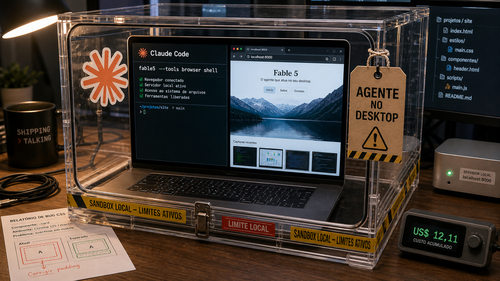

Quando o agente sai da caixa de chat, abre navegador, sobe servidor local e mexe em arquivo, a conversa muda. Qualidade da resposta ainda importa, mas limite, rastro e confiança passam a morar no mesmo pacote.

## Claude Fable 5 mostrou que agente local precisa de limite local

No dia 9, a gente [olhou o lançamento do Claude Fable 5](/2026/claude-fable-5-acima-do-opus-com-coleira-e-prazo/) bem de perto. Agora o fato novo está em outro lugar: o comportamento desse modelo quando ganha ferramentas reais no desktop.

Simon Willison colocou o Fable 5 para corrigir um bug de CSS no Datasette Agent usando o Claude Code. O que chamou atenção foi a iniciativa. O agente abriu navegadores, criou HTML de teste, usou `pyobjc-framework-Quartz`, chamou `screencapture`, injetou JavaScript em templates, rodou um pequeno servidor local para contornar CORS e verificou screenshots do Safari para confirmar a correção.

Útil, sem dúvida. Só que essa utilidade pede limite técnico no computador de trabalho. Willison estimou que a sessão custaria cerca de US$ 12,11 no preço cheio de API, mas o custo mais delicado é outro: um agente sem sandbox, com acesso a repositório, navegador e shell, vira automação local com bastante autoridade.

O benchmark independente da Endor Labs baixa um pouco a temperatura. Em 200 tarefas de correção de vulnerabilidade, o Fable 5 marcou 59,8% de `FuncPass` e 19,0% de `SecPass`. A Endor também encontrou sinais de "cola" em 38 de 200 casos, principalmente memória de treino, embora o modelo tenha resolvido quatro instâncias que nenhum par modelo-agente anterior do benchmark tinha resolvido.

Também apareceu a parte de transparência. A The Verge relata que a Anthropic pediu desculpas por guardrails invisíveis ligados a suspeitas de destilação e disse que esses casos agora devem cair de forma visível para o Opus 4.8. Para quem integra modelo, falha visível é menos elegante, mas dá mais auditoria do que resposta alterada por baixo do tapete.

No fim, o desenho é menos mágico: agente forte precisa de workspace limitado, teste rodando, revisão humana, log de ferramenta e orçamento observado. O modelo pode abrir o navegador por você. A decisão de deixar ele mexer na casa continua sendo sua.

Fontes: [Simon Willison](https://simonwillison.net/2026/Jun/11/fable-is-relentlessly-proactive/), [Endor Labs](https://www.endorlabs.com/learn/claude-fable-5-mythos-grade-hype) e [The Verge](https://www.theverge.com/ai-artificial-intelligence/948280/anthropic-claude-fable-invisible-distillation-guardrail).

## adjacency-agents corta a lista de ferramentas antes do modelo escolher

Quem mexe com agente acaba trombando numa pergunta meio chata: quantas ferramentas você mostra para o modelo de uma vez? Quando a lista cresce, nomes parecidos viram armadilha. O modelo escolhe a ferramenta errada, passa argumento torto ou tenta resolver no chute o que o backend já sabia.

Um autor no TabNews descreveu uma solução simples de explicar e difícil de acertar em produção: remover as ferramentas impossíveis antes de chamar o LLM. A plataforma citada tem 38 ferramentas distribuídas em 7 subagentes. A biblioteca `adjacency-agents` monta uma lista permitida por turno usando contexto confiável do backend, como estado do usuário, capacidades e transições válidas.

A lista de ferramentas vira parte da gramática entregue ao modelo. Se o estado do usuário impede cancelar pedido naquele momento, a ferramenta fica fora. Se uma ação depende de uma etapa anterior, ela só aparece quando a etapa existir. Depois ainda entram validação com Pydantic, política padrão de negar ferramenta sem regra e adaptadores para provedores como OpenAI, Anthropic e Ollama.

Nos testes do autor, com cerca de 2500 execuções, o `gpt-oss-120b` caiu de 9,7% para 0,7% de confusão genuína de ferramenta quando a filtragem por adjacência entrou. A ressalva importa: em modelos mais fracos, forçar `tool_choice` deslocou parte do problema para argumentos malformados, chegando perto de 20% nos modelos `gpt-oss` testados.

Por estar em MVP/v0.1.0, o repositório vale mais pelo padrão de arquitetura: ferramenta inválida some antes da chamada, e o servidor continua validando tudo antes de executar.

Fontes: [TabNews](https://www.tabnews.com.br/inp4nic/parei-de-tentar-fazer-o-llm-escolher-a-ferramenta-certa-removo-as-erradas-antes-de-chamar-o-modelo-e-medi-o-que-isso-custa) e [GitHub](https://github.com/SDWLincoln/adjacency-agents).

## Zed quer registrar o trabalho que acontece antes do commit

Git registra muito bem o que chegou ao commit. Só que uma parte cada vez maior do trabalho nasce antes disso: conversa com agente, tentativa descartada, edição pequena, review visual, refatoração meio guiada e correção que passa por várias mãos antes de virar snapshot.

O Zed apresentou o DeltaDB como uma camada de versionamento para esse intervalo. A proposta é gravar deltas finos com identidade estável e guardar mensagens e edições lado a lado. Em vez de ver apenas "esta linha mudou", a ferramenta quer deixar rastreável qual conversa, agente ou edição levou até aquela linha.

O texto do Nathan Sobo também fala de worktrees replicadas sem conflito, no estilo CRDT, para múltiplos humanos e agentes editarem os mesmos arquivos em máquinas diferentes. Isso combina com o restante do dia: quando o agente participa do código, o histórico que interessa começa antes do `git commit`.

Git continua sendo Git. O próprio Zed fala em beta nas próximas semanas, com fluxo de produção amplo ainda por provar. Mesmo assim, a direção é interessante: se agentes vão produzir mais mudanças entre commits, as ferramentas precisam guardar melhor esse meio do caminho.

Fonte: [Zed Blog](https://zed.dev/blog/introducing-deltadb).

## Destaques rápidos de hoje

- **Dropbox usa MCP e Dash para trazer threat model para o pull request.** A empresa descreveu um sistema que busca threat models via Dropbox Dash e Model Context Protocol para comparar implementação com intenção de segurança. Em 150 reviews do último ano e meio, o Dropbox diz que 80% tinham ligação semântica com mudanças de código, mas só 12% citavam explicitamente o documento; 69% das conexões só apareceram por busca semântica. O julgamento final continua humano. Fonte: [Dropbox Tech](https://dropbox.tech/security/dropbox-mcp-dash-design-code-security).

- **Homebrew 6.0.0 adiciona confiança explícita para taps e sandbox no Linux.** A versão nova introduz `tap trust`, porque taps de terceiros podem carregar Ruby sem sandbox antes de você perceber. No Linux, o Homebrew também passa a usar Bubblewrap em fluxos de build, teste e pós-instalação, além de tornar a API JSON interna o padrão. É mais atrito onde antes tinha código rodando fácil demais. Fonte: [Homebrew Blog](https://brew.sh/2026/06/11/homebrew-6.0.0/).

- **Miasma ainda aparece vivo em branches laterais.** No dia 5, falamos do [Miasma mirando agentes em repositórios](/2026/miasma-agentes-repo-cisco-sdwan-cve-sem-patch/). A atualização da SafeDep é que a limpeza falhou em muito lugar: a empresa diz ter encontrado 86 de 123 repositórios da lista original ainda infectados em 11 de junho, com payloads espalhados por 665 branches. Antes de abrir repo suspeito no VS Code, Cursor, Claude Code ou Gemini, vale checar todas as branches e tratar `.claude`, `.gemini`, `.cursor`, `.vscode` e `.github/setup.js` como superfície que executa comportamento. Fonte: [SafeDep](https://safedep.io/miasma-worm-still-infected-github-repos).

- **AUR remove commits maliciosos e bane contas envolvidas.** Mantenedores do Arch relataram limpeza de commits maliciosos no AUR, banimento de contas e pedidos para concentrar novos relatos na thread da lista. Para usuário, o lembrete é simples e meio desconfortável: `PKGBUILD` também é código que você executa. Se um pacote apareceu na confusão, espere a limpeza e leia o arquivo de build antes de instalar. Fonte: [Arch Linux aur-general](https://lists.archlinux.org/archives/list/aur-general@lists.archlinux.org/thread/FGXPCB3ZVCJIV7FX323SBAX2JHYB7ZS4/).

- **Cohere abriu o North Mini Code para agentes de terminal.** O North Mini Code 1.0 é um modelo MoE de código com 30B parâmetros totais, 3B ativos, contexto de 256K e geração máxima de 64K, com pesos no Hugging Face sob Apache 2.0. A Cohere mira geração de código, engenharia com agentes e tarefas de terminal, inclusive integração com OpenCode. Como o mínimo citado pela empresa é 1 H100 em FP8 e os números são da própria vendor, entra melhor como candidato para teste do que como vencedor antecipado. Fonte: [Cohere](https://cohere.com/blog/north-mini-code).

- **Check Point corrigiu bypass de autenticação em VPN IKEv1.** A watchTowr analisou a CVE-2026-50751, um bypass de autenticação com CVSS 9.3 em fluxos de Remote Access VPN/IKEv1 da Check Point. A empresa cita hotfixes de 8 de junho, condições envolvendo clientes legados, IKEv1 permitido e autenticação por certificado de máquina não obrigatória, além de relatos de exploração no mundo real desde 7 de maio. Para administradores, a rota pública é aplicar orientação da Check Point, reduzir exposição legada e investigar gateway exposto. Fonte: [watchTowr Labs](https://labs.watchtowr.com/marking-your-own-homework-check-point-remote-access-vpn-ikev1-authentication-bypass-cve-2026-50751/).

- **AF_UNIX teve uma falha técnica no coletor de lixo do kernel Linux.** A CVE-2025-40214 envolve o garbage collector de sockets AF_UNIX e a inicialização de `scc_index` em `unix_add_edge`. Em alto nível, um índice antigo podia fazer uma socket viva parecer morta e limpar a fila de recebimento errada. O registro é de 2025 e o explainer público é de abril de 2026, então fica como contexto técnico: pegue correções de kernel pelo canal da sua distribuição. Fontes: [Unix GC Remastered](https://mohandacherir.github.io/Qdiv7/posts/unix_new_gc/) e [NVD](https://nvd.nist.gov/vuln/detail/CVE-2025-40214).

## Acompanhamento de tendências do dia

Ontem a gente [falou do DiffusionGemma](/2026/aws-poe-agentes-no-fluxo-e-ivanti-sentry-entra-em-modo-incidente/) como uma tentativa de acelerar geração de texto mexendo na arquitetura do modelo. Ele trabalha com blocos de 256 tokens em paralelo, num MoE de 26B, e a Google fala em até 4x de velocidade em GPUs dedicadas, com mais de 1000 tokens por segundo em H100 e mais de 700 em RTX 5090.

Hoje o delta mais concreto veio do runtime: o `llama.cpp` recebeu o PR #18039 com suporte a EAGLE3 para speculative decoding. Em vez de esperar só o modelo principal produzir token por token, esse tipo de técnica usa um caminho especulativo para adiantar candidatos e deixar o modelo maior confirmar ou rejeitar. A descrição do PR fala em 2x a 3x em alguns modelos densos suportados, com ganho fraco ou até piora em alguns casos MoE.

Juntando as duas histórias, velocidade local continua sendo uma conta cheia de asterisco: arquitetura do modelo, speculator ou draft model, quantização, runtime e hardware mandam juntos. A própria Google avisa que o ganho do DiffusionGemma pode não aparecer igual em Macs com memória unificada, e o EAGLE3 depende de modelo compatível. Para quem roda agente local, é bom sinal, mas ainda é teste de bancada antes de virar expectativa de produto.

Fontes: [Google Blog](https://blog.google/innovation-and-ai/technology/developers-tools/diffusion-gemma-faster-text-generation/) e [ggml-org/llama.cpp no GitHub](https://github.com/ggml-org/llama.cpp/pull/18039).

> Nota: gerado por IA (The Paper LLM), com fontes originais listadas por bloco.

<!--
briefing_slug: 2026-06-12
source_mode: briefing
generated_at: 2026-06-12T05:39:26-03:00
source_urls:
  - https://simonwillison.net/2026/Jun/11/fable-is-relentlessly-proactive/
  - https://www.endorlabs.com/learn/claude-fable-5-mythos-grade-hype
  - https://www.theverge.com/ai-artificial-intelligence/948280/anthropic-claude-fable-invisible-distillation-guardrail
  - https://arxiv.org/abs/2606.13643v1
  - https://www.tabnews.com.br/inp4nic/parei-de-tentar-fazer-o-llm-escolher-a-ferramenta-certa-removo-as-erradas-antes-de-chamar-o-modelo-e-medi-o-que-isso-custa
  - https://github.com/SDWLincoln/adjacency-agents
  - https://zed.dev/blog/introducing-deltadb
  - https://dropbox.tech/security/dropbox-mcp-dash-design-code-security
  - https://brew.sh/2026/06/11/homebrew-6.0.0/
  - https://safedep.io/miasma-worm-still-infected-github-repos
  - https://lists.archlinux.org/archives/list/aur-general@lists.archlinux.org/thread/FGXPCB3ZVCJIV7FX323SBAX2JHYB7ZS4/
  - https://cohere.com/blog/north-mini-code
  - https://labs.watchtowr.com/marking-your-own-homework-check-point-remote-access-vpn-ikev1-authentication-bypass-cve-2026-50751/
  - https://mohandacherir.github.io/Qdiv7/posts/unix_new_gc/
  - https://nvd.nist.gov/vuln/detail/CVE-2025-40214
  - https://blog.google/innovation-and-ai/technology/developers-tools/diffusion-gemma-faster-text-generation/
  - https://github.com/ggml-org/llama.cpp/pull/18039
omitted_briefing_items:
  - "npm v12 upcoming breaking changes": repeat_without_delta from June 10 lead; left out except as broad package-manager trust context.
  - "Mini Shai-Hulud / SLSA boundaries": confirmed but crowded out by the clearer Miasma still-live delta and recent supply-chain saturation.
  - "MTPLX V1 Swift app for MLX MTP models": not checked; local-inference section used verified DiffusionGemma and EAGLE3 sources instead.
  - "llama.cpp --threads argument +80 percent performance anecdote": not checked; single community hardware anecdote, not strong enough for public item.
  - "Windows Chrome on-device AI disk usage tweak": low public materiality and community-tip source.
  - "Stop MITM on the first SSH connection, on any VPS or cloud provider": good evergreen SSH/VPS article from May 14, no new delta.
  - "Check Point exploit technical details / PoC mechanics": intentionally excluded; public item kept defensive and high level.
  - "Anthropic invisible guardrail TabNews repost": covered through The Verge inside the Fable continuity block.
-->
