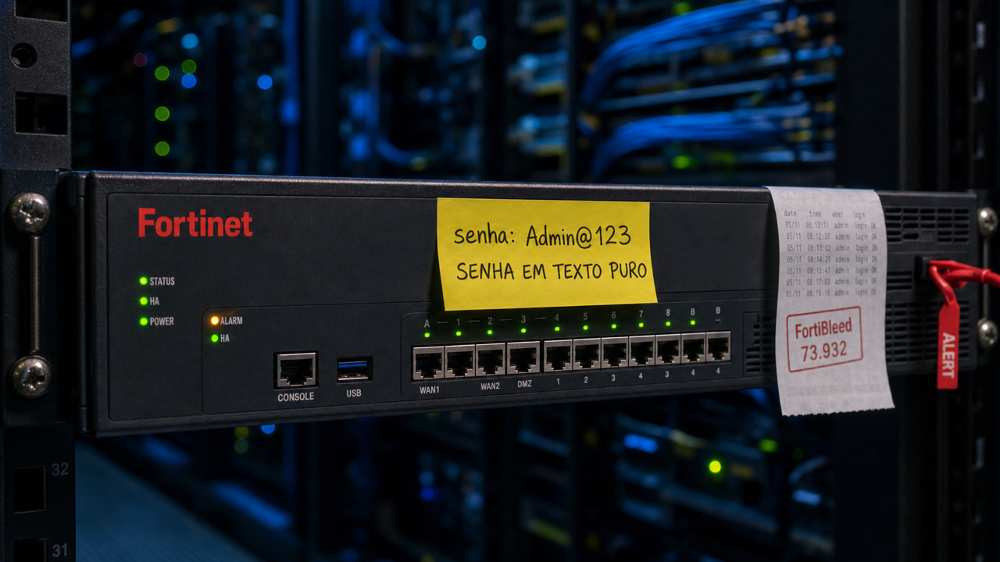

Se você cuida de um firewall Fortinet com VPN ligada, hoje vale parar o café por um minuto: apareceu uma lista pública com senha de acesso de dezenas de milhares dessas caixas, e parte dela ainda abre a porta.

## FortiBleed lista senha de VPN de 73.932 firewalls Fortinet em texto puro

Um pesquisador de segurança, Bob Diachenko, encontrou um servidor exposto reunindo credenciais de VPN de 73.932 URLs de firewall Fortinet e FortiGate espalhados pelo mundo. E o conteúdo é do pior tipo possível: usuário, email e senha, com a senha em texto puro. O dump ganhou o apelido de FortiBleed e logo apareceu em listas e fóruns.

O apelido lembra Heartbleed e sugere uma falha nova no produto, mas não é o caso. A Fortinet diz que esses dados são recompartilhamento de incidentes antigos somados a tentativas de força bruta, sem ligação com uma vulnerabilidade nova, um breach novo ou um aviso de segurança novo. Não tem CVE para correr atrás aqui, e patch não resolve.

O problema é que senha antiga continua funcionando quando ninguém troca. Kevin Beaumont, outro nome conhecido na área, checou parte da lista e confirmou que alguns logins de administrador são reais e ainda estão online. A lista também cita nomes grandes, como Chevron, Samsung, Foxconn, Comcast, AT&T, Mercedes-Benz e Toyota, então não é coisa só de rede pequena.

Para quem administra esse tipo de firewall, o trabalho é o de sempre, só que com pressa: rotacionar as credenciais de VPN e de administração, ligar autenticação em duas etapas, olhar os logs de acesso da VPN e checar se a sua instância aparece na exposição. Se a sua senha estava nessa lista em texto puro, o mais seguro é tratá-la como já comprometida.

Para dimensionar o esforço do outro lado: pela análise de Diachenko, foram mais de 1,16 bilhão de tentativas de credencial contra cerca de 320 mil alvos FortiGate, usando um cluster de GPUs para quebrar senha. A atribuição a um grupo específico e o tamanho exato do estrago ainda são leitura do pesquisador, então leia como investigação em andamento, não como número fechado.

Fonte: [BleepingComputer](https://www.bleepingcomputer.com/news/security/fortibleed-leak-exposes-fortinet-vpn-credentials-for-73-000-devices/).

## PostgreSQL: o jeito seguro de criar um usuário só de relatório

Christophe Pettus, um nome respeitado no mundo PostgreSQL, escreveu sobre uma armadilha comum: você quer um relatório pesado que enxergue um retrato consistente do banco e não atrapalhe a aplicação, e a tentação é mexer em dois parâmetros globais do cluster.

O primeiro controla o nível de isolamento das transações, e o segundo deixa tudo somente-leitura. Esses parâmetros, no PostgreSQL, são as tais GUCs, que é só o nome interno dos parâmetros de configuração. Se você sobe o isolamento para o nível mais rígido no cluster inteiro, qualquer transação da aplicação pode passar a falhar com erro de serialização, o `40001`, que o seu código talvez nem tente repetir. E se você liga o somente-leitura no cluster todo, bloqueia escrita onde ela precisava acontecer.

O caminho que ele recomenda é não tocar no cluster. Em vez disso, você cria um papel dedicado de relatório e prende a configuração nele:

```sql
ALTER ROLE relatorio SET default_transaction_isolation = 'serializable';
ALTER ROLE relatorio SET default_transaction_read_only = on;
ALTER ROLE relatorio SET default_transaction_deferrable = on;
```

Com isso, o relatório longo espera por um retrato seguro do banco, lê esse retrato sem o custo de detecção de conflito, nunca causa nem sofre o erro de serialização, e simplesmente não consegue escrever. A aplicação geral continua no isolamento padrão, que segue sendo o certo para o caso comum. É uma receita limpa para quem mantém um Postgres em VPS e só queria um usuário de relatório sem efeito colateral no resto.

Fonte: [thebuild.com (Christophe Pettus)](https://thebuild.com/blog/all-your-gucs-in-a-row-defaulttransactionisolation-and-defaulttransactionreadonly/).

## Atacante usou OpenSSH e Tailscale para voltar depois que o C2 caiu

Depois de invadir a máquina de uma vítima, um atacante instalou OpenSSH e Tailscale ali dentro. Não para fazer nada exótico, mas para garantir um caminho de volta que não dependesse do servidor de comando e controle, aquele canal central que costuma orquestrar a operação, conhecido como C2.

Quando o C2 dele, baseado no Havoc, saiu do ar, o acesso por Tailscale continuou vivo, porque estava em uma rede separada. E quando o C2 voltou, no dia 26 de abril, os agentes reconectaram sozinhos, sem precisar de uma nova invasão. É um exemplo limpo do que o pessoal de segurança chama de living-off-the-land: usar a ferramenta legítima que já é confiável no ambiente, justamente porque ela não dispara os alarmes que procuram por malware.

A reconstrução só foi possível por um descuido do operador. A Cato Networks, que analisou o caso, contou que ele deixou as chaves SSH e um manual da operação dentro de um bucket de armazenamento aberto. Com isso, dá para acompanhar 339 comandos rodados ao longo de 33 dias, incluindo um capturador de senha em Python de umas 70 linhas escrevendo num arquivo local.

O recado não é parar de usar Tailscale ou OpenSSH, que são ótimas ferramentas. É olhar para instalações inesperadas delas, chaves SSH que você não reconhece e nós novos na sua rede Tailscale como sinal de alerta, mesmo quando o binário em si é confiável. Defesa que só procura assinatura de C2 não pega esse tipo de volta pela porta dos fundos.

Fonte: [The Hacker News](https://thehackernews.com/2026/06/junior-hacker-used-tailscale-and.html) (análise da Cato Networks).

## Destaques rápidos para hoje

- **Microsoft confirma um zero-day de elevação no próprio Defender.** A falha, apelidada de RoguePlanet, está no motor de proteção contra malware do Microsoft Defender e recebeu o identificador CVE-2026-50656, com gravidade 7.8. Ela permite elevação de privilégio local, e a própria Microsoft diz que o patch ainda está em desenvolvimento. Como o Defender roda em quase todo Windows, vale acompanhar a saída da correção e priorizar a atualização quando ela chegar. Fonte: [The Hacker News](https://thehackernews.com/2026/06/microsoft-confirms-rogueplanet-defender_02022423645.html).

- **Driver do SignalRGB deixava usuário comum mandar comando privilegiado de hardware.** O CERT/CC publicou que o driver de kernel do SignalRGB, aquele app de luzinha RGB, era criado com permissões frouxas demais. Um processo sem privilégio conseguia mandar comandos privilegiados para o hardware e até travar o sistema. São duas falhas, CVE-2026-8049 e CVE-2026-8050, corrigidas na versão 1.3.7.0. O risco maior nem é para quem usa o app: um driver assinado e fraco é matéria-prima clássica para o ataque que carrega um driver vulnerável de propósito para abrir caminho no kernel. Fonte: [CERT/CC](https://kb.cert.org/vuls/id/380058).

- **Cinco pacotes npm publicados em 12 minutos escondiam um instalador de malware no Windows.** A SafeDep descreveu uma campanha em que um operador subiu cinco pacotes de uma vez. Dois eram armados: o `procwire`, que baixa e roda um binário no Windows, e um clone do Express que puxa o `procwire`. Os outros três eram peças auxiliares para esconder o endereço do servidor de comando, guardado embaralhado dentro do código. Um `npm install` no Windows já bastava para o script de pré-instalação rodar tudo sem abrir janela. É um caso diferente do incidente do Mastra de [ontem](/2026/mastra-levou-o-risco-para-o-npm-install-e-glm-5-2-abriu-pesos-no-hugging-face/), com outro operador e outro alvo, mas reforça a mesma regra: instalar pacote já é executar código. Fonte: [SafeDep](https://safedep.io/procwire-npm-windows-dropper-campaign).

- **Um dev brasileiro fez um gerenciador de pacotes que se recusa a instalar pacote com CVE conhecido.** O projeto se chama Vault, é escrito em Rust, no estilo do pnpm, e faz a checagem de segurança acontecer antes de escrever no `node_modules`. Ele consulta a base de vulnerabilidades OSV mais um scan estático, bloqueia pacote com CVE crítico ou alto, não roda script de pós-instalação por padrão e instala dentro de uma sandbox Landlock. É projeto de comunidade e ainda está crescendo, então trate como demonstração de uma ideia boa, não como ferramenta pronta para produção. Mesmo assim, é um contraponto bem concreto à semana de sustos com npm. Fonte: [TabNews](https://www.tabnews.com.br/matheusagostinho/fiz-um-gerenciador-de-pacotes-que-se-recusa-a-instalar-pacote-com-cve-conhecido).

- **Epic Games abriu o Lore, um controle de versão para arquivos gigantes.** Quem trabalha com jogos e multimídia conhece a dor: o Git, mesmo com o Git LFS, não foi pensado para o volume de arquivos enormes desse tipo de projeto. A Epic lançou o Lore, um sistema de controle de versão open source desenhado em torno desse problema específico. Não é proposta para substituir o Git no caso geral, é mais uma opção para um nicho que sofria de verdade. Fonte: [Phoronix](https://www.phoronix.com/news/Epic-Games-Lore-VCS).

- **Pesquisa propõe filtrar instrução escondida antes que ela chegue ao agente de código.** Um agente que lê arquivos, issues e repositórios pode ser enganado por instruções plantadas em comentários, strings ou nomes de variável, o chamado prompt injection indireto. O preprint do CodeSentinel sugere uma defesa que usa o Tree-sitter para transformar o código em árvore sintática, isolar os trechos de maior risco e limpar a entrada antes do modelo ver. Os autores dizem que isso supera defesas atuais, mas são resultados de paper, ainda dependentes de reprodução. Fonte: [arXiv](https://arxiv.org/abs/2606.19235v1).

- **Outro preprint tenta caçar pacote PyPI malicioso com um agente e uma base de APIs suspeitas.** O PYPILINE combina uma lista de chamadas tipicamente abusadas com um agente que usa ferramentas para analisar o pacote por dentro. Os números reportados são altos, com 96,7% de precisão, mas, de novo, são claims do paper, não veredito independente. Vale como sinal de para onde a detecção automática está caminhando no registro do Python. Fonte: [arXiv](https://arxiv.org/abs/2606.19063v1).

## Acompanhamento de tendências do dia

Tem um fio ligando boa parte dos itens de segurança de hoje, e ele passa pela ideia de esconder coisa onde o revisor não costuma olhar. No npm, o perigo veio embalado em pacotes auxiliares de aparência inocente. No PyPI, a pesquisa mira chamadas suspeitas espalhadas pelo código. E um terceiro preprint, o PhantomSkill, leva esse mesmo movimento para um terreno mais novo: as skills de agente.

A sacada do trabalho é desconfortável. Em vez de esconder a parte maliciosa na descrição da skill, que é o que costuma passar pelo olho humano, eles escondem nos recursos auxiliares dela. A técnica que descrevem, chamada VulMask, reescreve um script obviamente malicioso para parecer só uma vulnerabilidade comum, daquelas que só fazem algo errado sob um gatilho específico do atacante. Para um revisor automático, isso passa como código distraído, não como ataque.

É preprint de demonstração, então leia como alerta de superfície, não como abuso confirmado em escala. Ainda assim dá para enxergar o caminho: a mesma corrida de supply chain que já bagunçou npm e PyPI está chegando aos ecossistemas de skills de agente. Para quem vai começar a baixar skill de terceiro como quem baixa pacote, dá para já ir tratando isso com a mesma desconfiança. Fonte: [arXiv / PhantomSkill](https://arxiv.org/abs/2606.19191v1).

> Nota: gerado por IA (The Paper LLM), com fontes originais listadas por bloco.

<!--
briefing_slug: 2026-06-18
source_mode: briefing
generated_at: 2026-06-18T05:40:00-03:00
source_urls:
  - https://www.bleepingcomputer.com/news/security/fortibleed-leak-exposes-fortinet-vpn-credentials-for-73-000-devices/
  - https://thebuild.com/blog/all-your-gucs-in-a-row-defaulttransactionisolation-and-defaulttransactionreadonly/
  - https://thehackernews.com/2026/06/junior-hacker-used-tailscale-and.html
  - https://thehackernews.com/2026/06/microsoft-confirms-rogueplanet-defender_02022423645.html
  - https://kb.cert.org/vuls/id/380058
  - https://safedep.io/procwire-npm-windows-dropper-campaign
  - https://www.tabnews.com.br/matheusagostinho/fiz-um-gerenciador-de-pacotes-que-se-recusa-a-instalar-pacote-com-cve-conhecido
  - https://www.phoronix.com/news/Epic-Games-Lore-VCS
  - https://arxiv.org/abs/2606.19235v1
  - https://arxiv.org/abs/2606.19063v1
  - https://arxiv.org/abs/2606.19191v1
omitted_briefing_items:
  - Mastra npm install: repeat_without_delta (covered 2026-06-17)
  - Anthropic Fable/Mythos export control: repeat_without_delta (covered 2026-06-13)
  - GLM-5.2 open weights: repeat_without_delta (covered 2026-06-17)
-->
