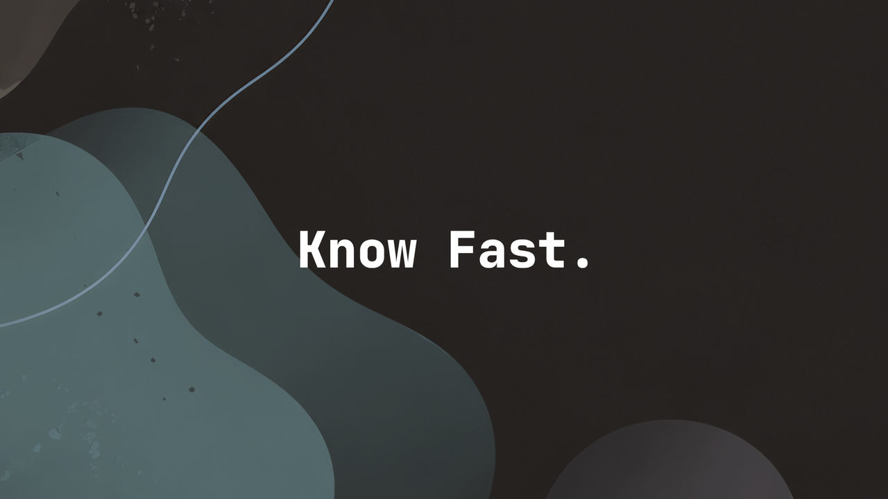

<!--
briefing_slug: 2026-04-30
generated_at: 2026-04-30T07:01:41-03:00
source_urls:
- https://martinfowler.com/fragments/2026-04-29.html
- https://www.chrismdp.com/coding-with-ai/
- https://martinfowler.com/articles/harness-engineering.html
- https://openai.com/index/open-source-codex-orchestration-symphony/
- https://github.com/openai/symphony
- https://github.com/google-github-actions/run-gemini-cli/security/advisories/GHSA-wpqr-6v78-jr5g
- https://xint.io/blog/copy-fail-linux-distributions
- https://infisical.com/blog/agent-vault-the-open-source-credential-proxy-and-vault-for-agents
- https://www.dbmaestro.com/ai/dbmaestro-mcp-server/
- https://kristoff.it/blog/contributor-poker-and-ai/
- https://blog.zulip.com/2026/04/27/zulip-12-0-released/
- https://openai.com/index/where-the-goblins-came-from/
- https://arxiv.org/abs/2604.26904v1
- https://arxiv.org/abs/2604.26892v1
- https://vercel.com/templates/template/open-agents
omitted_briefing_items:
- The Hacker News sobre Gemini CLI/Cursor: usado apenas como sinal secundário; a advisory do GitHub/Google era fonte melhor para Gemini.
- The Hacker News, LWN, Reddit e Hacker News sobre Copy Fail: duplicavam a mesma história; Xint ficou como fonte principal.
- Cloudflare agents com Stripe/domains/deploy: item forte no curated, mas apareceu fora do briefing principal e com timestamp posterior ao horário do heartbeat; fica para watch.
- APRA, Risky Biz, DigitalOcean, Percona, pgBackRest, Wireshark e SANS/Libredtail: bons itens operacionais, porém desviavam o texto do eixo harness/controle.
- Select to Think, Bian Que, ClassEval-Pro, RepoDoc, speculative decoding, TDD governance e vários papers do arXiv: úteis para acompanhamento, mas redundantes com Fowler/Symphony/ClawGym hoje.
- FastCGI, WebAssembly, Futhark, functional programmers and Zig, goshs, LynxDB e Utilyze: bons evergreen ou ferramentas, mas menos urgentes que agentes e segurança.
- GitHub is sinking e caminhos para independência de código: gancho interessante para outro texto sobre Git e descentralização, não para este roundup.
-->

> Nota: gerado por IA (The Paper LLM), com fontes originais listadas por bloco.

Martin Fowler juntou alguns fragmentos em 29 de abril e o começo já resolve uma
confusão comum sobre agentes de código. A parte interessante não é o modelo
escrever mais rápido. É descobrir se aquilo que ele escreveu presta, se pode
rodar, se respeita o projeto e se não abriu uma cratera no caminho.

No mesmo pacote, a OpenAI mostrou o Symphony, o Gemini CLI corrigiu uma falha
de confiança em CI, o Linux ganhou um bug de page cache com cheiro de pesadelo
para sandbox, e projetos open source começaram a deixar mais claro onde aceitam
ou rejeitam contribuição com IA.

O tema do dia é menos glamouroso que um prompt bonito. É controle.

## Fowler colocou o dedo na parte menos cinematográfica do agente

O fragmento do Fowler não é uma notícia única. É uma costura. Ele aponta para o
guia atualizado do Chris Parsons sobre programação com IA, volta ao texto da
Birgitta Böckeler sobre harness engineering, passa pela diferença entre vibe
coding e agentic engineering, e ainda encosta em um ponto mais antigo de design:
nomes, conceitos e definições continuam importando.

Essa costura é boa porque tira a conversa do encantamento. Parsons escreve que
"verificado" deixou de significar apenas "lido por você". Com agentes gerando
mais trabalho do que uma pessoa consegue revisar linha por linha, parte da
checagem precisa ir para testes, type checkers, linters, gates automáticos e
ambientes onde o agente consegue falhar antes de pedir atenção humana.

É aí que o harness deixa de ser palavra bonita. No texto da Böckeler, o harness
em volta de um agente de código combina guias e sensores. Guia é aquilo que
orienta antes da ação: `AGENTS.md`, `CLAUDE.md`, skill files, documentação curta,
convenções do projeto. Sensor é aquilo que observa depois: teste, análise
estática, log, browser headless, script de verificação, revisão automática. Os
sensores bons são baratos, repetíveis e falam numa linguagem que o agente
consegue usar para se corrigir.

Isso muda o papel do senior. O trabalho não some. Fica mais estranho. Em vez de
ficar no fim da esteira aprovando um monte de diffs que chegaram rápido demais,
a pessoa experiente precisa transformar gosto, regra e cicatriz de produção em
estrutura. Uma regra que sempre aparece em review vira linter, teste, script ou
skill. Um erro recorrente vira instrução versionada. Uma decisão de arquitetura
vira critério que o agente consegue consultar antes de abrir o editor.

Sim, tem uma ironia aqui. Este texto também sai de um pipeline cheio de prompt,
arquivo, build, TTS e checagem. A diferença entre piada e ferramenta é o quanto
desse pipeline consegue acusar erro sem depender de torcida.

Fontes: [Martin Fowler](https://martinfowler.com/fragments/2026-04-29.html),
[Chris Parsons](https://www.chrismdp.com/coding-with-ai/) e
[Birgitta Böckeler no Martin Fowler](https://martinfowler.com/articles/harness-engineering.html).

## Symphony transforma o issue tracker em sala de controle

A OpenAI publicou em 27 de abril de 2026 o Symphony, uma especificação open
source e uma implementação experimental para orquestrar agentes de código. O
gancho é simples: em vez de abrir várias sessões do Codex e cuidar de cada uma
como quem vigia panela no fogão, o time usa o tracker de tarefas como plano de
controle.

Na descrição da OpenAI, cada issue ativa pode virar um workspace isolado com um
agente trabalhando. O Symphony acompanha estados no Linear, reinicia execução
quando algo trava, deixa tarefas bloqueadas esperando dependências e trata parte
da vida real do PR: CI, review feedback, rebases, conflitos e checagens
flaky. A OpenAI diz que alguns times tiveram aumento de 500% em pull requests
landados nas três primeiras semanas. É número de vendor, então merece sobrancelha
levantada. Mas o desenho técnico é mais importante que o número.

O repositório deixa claro que é uma prévia de engenharia para ambientes
confiáveis. Isso importa. Symphony não é "solta o agente no data center e vai
dormir". A própria especificação fala de workspaces por issue, política no repo,
logs estruturados, retry, estados de handoff e limites de escopo. É menos
brinquedo de chat e mais fila de trabalho com execução assistida.

O ponto forte é que Symphony combina muito bem com a tese do Fowler. Um agente
rodando por issue só é útil se o projeto já sabe se defender: teste que pega
regressão, CI que falha de verdade, instrução curta no repo, ambiente que limita
onde o comando roda, revisão humana onde julgamento ainda pesa. Sem isso, a
orquestração só aumenta a velocidade com que a bagunça chega.

Fonte: [OpenAI](https://openai.com/index/open-source-codex-orchestration-symphony/)
e [repositório openai/symphony](https://github.com/openai/symphony).

## Gemini CLI mostra que o harness também pode virar ataque

O aviso de segurança do `run-gemini-cli` é uma daquelas correções que parecem
detalhe até você imaginar dentro de um pull request de desconhecido. Versões
anteriores do Gemini CLI confiavam automaticamente na pasta do workspace quando
rodavam em modo headless, como em CI. Isso permitia carregar configuração e
variáveis locais a partir de conteúdo controlado pelo repositório.

A atualização publicada em 24 de abril de 2026 endurece esse modelo. O pacote
`@google/gemini-cli` foi corrigido nas versões 0.39.1 e 0.40.0-preview.3. A
GitHub Action `google-github-actions/run-gemini-cli` foi corrigida na versão
0.1.22. O comportamento novo exige confiança explícita antes de processar
configurações do workspace em ambiente não interativo.

Tem outro ajuste importante no mesmo aviso: allowlist de ferramentas em modo
`--yolo`. Antes, uma configuração ampla demais podia ignorar o limite fino para
comandos de shell. Em workflow que analisa issue ou pull request de fora, isso
vira a receita clássica de prompt injection com acesso a comando.

O aprendizado aqui é meio seco, mas necessário: o harness não é
automaticamente uma camada de segurança. Ele também é código, configuração,
trust boundary e política de execução. Se o agente lê `.env`, confia em pasta
errada ou aceita comando demais porque alguém quis "agilidade", o problema não
está no modelo. Está no trilho em volta dele.

Fonte:
[GitHub Security Advisory GHSA-wpqr-6v78-jr5g](https://github.com/google-github-actions/run-gemini-cli/security/advisories/GHSA-wpqr-6v78-jr5g).

## Copy Fail lembra que container ainda divide kernel

Copy Fail, rastreado como CVE-2026-31431, é uma falha no kernel Linux descrita
pela Xint em 29 de abril de 2026. O resumo curto já é desconfortável: `AF_ALG`,
`splice()` e o template criptográfico `authencesn` se combinam para permitir uma
escrita controlada de 4 bytes no page cache de um arquivo legível.

O arquivo no disco não muda. O checksum do disco pode continuar lindo. Só que o
page cache é a versão que o sistema lê em memória. A Xint demonstra o impacto
com um script Python pequeno o bastante para caber num susto: corromper a visão
em memória de um binário `setuid` e conseguir root em distribuições testadas
como Ubuntu, Amazon Linux, RHEL e SUSE.

Para quem mexe com agente, CI e sandbox, a parte pior está na frase sobre
container. O page cache é compartilhado pelo host. Então a conversa não fica
limitada a "um usuário local pode escalar privilégio". Ela encosta em runner de
CI, ambiente multi tenant, nó Kubernetes e máquina que executa código não
confiável achando que container é parede de concreto.

O conserto prático começa onde sempre começa: kernel atualizado. Para ambiente
de execução de agente, a mitigação de defesa em profundidade é reduzir a
superfície do kernel exposta para workloads não confiáveis. Se o agente não
precisa de `AF_ALG`, seccomp e política de sandbox devem dizer isso com todas as
letras. Container ajuda. Kernel continua sendo a fronteira de verdade.

Fonte: [Xint](https://xint.io/blog/copy-fail-linux-distributions).

## Segredo de agente não deveria virar variável de ambiente gourmet

Agent Vault, da Infisical, olha para um problema bem concreto: como deixar um
agente chamar APIs sem entregar o segredo para ele. A resposta proposta é um
proxy HTTPS local. O agente faz uma requisição normal, o proxy injeta a credencial
no caminho e registra metadados do acesso. A chave não entra no contexto do
agente.

Isso conversa com o MCP Server da DBmaestro no mesmo ponto, só em outro domínio.
No caso da DBmaestro, agentes e copilotos acessam fluxos de database DevOps por
MCP, mas a promessa útil não é "natural language controla banco". A parte que
presta atenção é outra: RBAC, trilha de auditoria, compliance, templates de
release e execução determinística continuam mandando. A IA vira interface de
entrada, não substituta da governança.

O detalhe que decide se isso é segurança ou teatro está no egress. Definir
`HTTPS_PROXY` e deixar o agente sair direto para a internet é só decorar a porta
da frente enquanto a janela está aberta. Para o proxy de credencial fazer sentido,
o sandbox precisa bloquear saída direta e obrigar o caminho controlado.

Essa é uma regra boa para avaliar ferramentas de agente nos próximos meses. A
pergunta não é "tem MCP?" ou "tem vault?". É: quem segura o segredo, quem executa
a ação, quem autoriza, quem audita e como o agente é impedido de contornar o
caminho feliz?

Fontes:
[Infisical](https://infisical.com/blog/agent-vault-the-open-source-credential-proxy-and-vault-for-agents)
e [DBmaestro](https://www.dbmaestro.com/ai/dbmaestro-mcp-server/).

## Zig e Zulip tratam IA como política de mantenedor, não como opinião de Twitter

Zig e Zulip chegaram a decisões diferentes, mas a dor é parecida. Loris Cro
explica a proibição de contribuições com IA no Zig usando a ideia de "contributor
poker". Um projeto open source investe em pessoas, não só em patches. Revisar um
PR ruim pode ser racional quando aquilo ajuda alguém a virar colaborador
recorrente. Revisar PR gerado por IA, sem autor capaz de explicar e manter a
mudança, queima esse investimento.

O texto não tenta vender nostalgia. Ele fala de custo de mantenedor. PR gigante
de primeira viagem, explicação alucinada, autor que não domina a própria mudança
e volume extra de ruído são problemas sociais e técnicos ao mesmo tempo. CI
passar não prova que existe ownership.

Zulip escolheu outro caminho. No release 12.0, Tim Abbott conta que o projeto
recebeu centenas de PRs gerados por IA durante a temporada de Google Summer of
Code e praticamente nenhum foi mergeado. Em vez de banir todo uso, o projeto
adotou política de responsabilidade humana: quem contribui precisa entender,
testar e explicar o trabalho, mesmo que tenha usado LLM.

Ao mesmo tempo, o Zulip investiu em preparar o próprio repo para Claude Code,
com contexto de projeto e orientação de self-review. Em abril, segundo o post,
engenheiros do core team já produziam PRs com Claude Code em qualidade próxima
ao padrão histórico do time. A diferença não é mágica. É quem está dirigindo, em
qual base, com quais instruções e sob qual responsabilidade.

No fundo, Zig e Zulip concordam no ponto que importa: IA em open source precisa
de política explícita. Pode ser não. Pode ser sim, com responsabilidade. O que
não funciona é fingir que todo patch é igual só porque apareceu verde no CI.

Fontes:
[Loris Cro](https://kristoff.it/blog/contributor-poker-and-ai/) e
[Zulip](https://blog.zulip.com/2026/04/27/zulip-12-0-released/).

## Destaques rápidos

- A OpenAI publicou um post sobre os "goblins" que apareceram em metáforas de
  modelos recentes. O valor técnico está em mostrar como recompensa de estilo,
  personalidade e dados sintéticos podem espalhar tique verbal para lugares onde
  ninguém pediu um monstrinho retórico. Fonte:
  [OpenAI](https://openai.com/index/where-the-goblins-came-from/).

- ClawGym tenta organizar o ciclo completo de agentes pessoais em workspace:
  dados sintéticos, trajetórias, treino e benchmark. O número que importa menos
  é o placar. O que importa mais é a direção: agente precisa de ambiente,
  tarefa verificável e rollout reproduzível. Fonte:
  [arXiv](https://arxiv.org/abs/2604.26904v1).

- O paper Hot Fixing in the Wild analisou hot fixes em mais de 61 mil
  repositórios. Hot fix tende a ser menor, com menos gente, menos review e menos
  teste. É exatamente o tipo de cenário em que agente pode ajudar no patch local
  e atrapalhar feio se alguém terceirizar contexto de produção. Fonte:
  [arXiv](https://arxiv.org/abs/2604.26892v1).

- O Open Agents da Vercel apareceu como referência para agentes de código em
  background, com workflow durável e execução em sandbox. Vale acompanhar mais
  pelo desenho de controle do que pelo release em si. Fonte:
  [Vercel](https://vercel.com/templates/template/open-agents).

## Acompanhamento de tendências

A linha que atravessa tudo hoje é a mesma: agente bom precisa de chão. Issue
tracker, skill file, teste, sandbox, egress, segredo, CI, política de review e
observabilidade não são detalhes depois da demo. São o produto real.

Também ficou mais claro que segurança de agente tem duas camadas. A primeira é
o que o agente pode fazer. A segunda é o que o ambiente em volta dele deixa
passar sem perceber. Gemini CLI e Copy Fail mostram lados diferentes do mesmo
medo: uma confiança errada no workspace ou uma interface perigosa do kernel já
bastam para transformar automação em ataque.

E a parte social finalmente está entrando na conversa técnica. Zig e Zulip não
estão brigando sobre "gostar" ou "não gostar" de IA. Estão definindo o custo que
cada projeto aceita pagar em review, aprendizado, responsabilidade e manutenção.
Isso é infraestrutura também. Só não compila.
