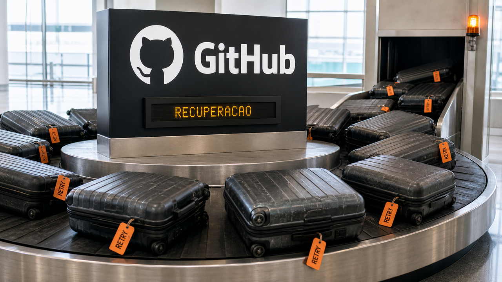

O GitHub já estava sem capacidade quando os clientes resolveram ajudar: tentaram de novo. E de novo. A pane de 17 de agosto durou 7 horas e 47 minutos, atingiu os principais serviços da plataforma e ainda recebeu tráfego extra de um loop de retry do Copilot durante a recuperação.

A edição de hoje está cheia dessas fronteiras que pareciam ótimas até alguém encostar nelas. No ecossistema Rust, uma dependência transitiva executou malware durante o build. Em agentes, um estudo novo mostra que o modelo pode entregar pistas sobre um segredo sem jamais imprimi-lo. E até a documentação entrou na conversa: agentes leem bastante as instruções escritas para eles, mas validação determinística continua sendo trabalho de outro mecanismo.

## O GitHub ficou sem capacidade. Os retries trouxeram mais carga

O GitHub publicou em 20 de agosto o relato da pane ocorrida três dias antes. Segundo a empresa, o tráfego bateu um novo pico e um componente crítico no data center Central US não conseguiu escalar. A falta de capacidade derrubou ou degradou github.com, autenticação, Actions, APIs, pull requests, issues e Copilot.

Aí entrou um velho reflexo dos sistemas distribuídos: falhou, repita. Um loop de retry num cliente do Copilot acrescentou chamadas enquanto a infraestrutura tentava voltar. Tentativa original e retry brigam pelo mesmo recurso escasso. Quando milhares de clientes repetem juntos, a fila não recebe paciência. Recebe outra fila.

O sistema ao redor também cresceu muito. O GitHub diz que os commits mensais passaram de 1,4 bilhão em abril para 2,9 bilhões, mas não atribui esse salto aos agentes de IA. Dá vontade de olhar para o Copilot no incidente, olhar para a curva e desenhar duas setas no quadro. A evidência publicada não permite fechar essa conta.

A lição reaproveitável para quem projeta APIs e agentes está no controle da repetição. Backoff e jitter espalham novas tentativas no tempo. Um orçamento de retry limita quanto tráfego extra uma operação pode gerar. Circuit breakers e controle de admissão evitam que trabalho novo sufoque o serviço durante a recuperação. Idempotência define o que pode ser repetido sem cobrar duas vezes, abrir duas issues ou mandar o mesmo deploy passear novamente por produção.

O GitHub agora pretende padronizar limites e orçamentos de retry, além de timeouts variáveis. A regra é fácil de falar e uma desgraça de implementar: retry faz parte da carga. Ele não fica do lado de fora esperando educadamente.

Fonte: [GitHub — The August 17 outage, and the work ahead](https://github.blog/news-insights/company-news/the-august-17-outage-and-the-work-ahead/).

## Uma dependência Rust executou malware antes da aplicação

A versão 0.3.10 da crate `arrayref` ganhou uma dependência chamada `proc-macro1`, versão 1.0.107. O nome imita um pacote conhecido o bastante para o olho passar batido. Segundo a análise da SafeDep, o `build.rs` dessa dependência baixava e executava um payload remoto em Linux, macOS e Windows.

A parte mais desagradável é quando isso acontece. Cargo compila scripts de build das dependências com os privilégios do desenvolvedor ou do runner de CI. A aplicação não precisava importar função suspeita nem chegar a rodar. Resolver as versões ruins e compilar o projeto já podia acionar o downloader.

As releases maliciosas apareceram em 20 de agosto e foram removidas do crates.io, de acordo com a SafeDep. A empresa também registra cerca de 244.989.384 downloads históricos de `arrayref`. Esse total mede o alcance acumulado da crate, não o número de vítimas. Não há contagem pública verificada de instalações comprometidas. Como a API do crates.io respondeu com HTTP 403 durante a pesquisa, tanto a remoção quanto o total de downloads continuam atribuídos à análise da SafeDep.

Quem compilou essas versões precisa tratar a máquina como potencialmente exposta: conferir o `Cargo.lock`, fixar `arrayref` novamente na versão limpa 0.3.9 e investigar os hosts de desenvolvimento e CI atrás de atividade inesperada. Se o processo teve acesso a segredos, as credenciais devem ser giradas a partir de uma máquina limpa quando a exposição for confirmada.

Os indicadores publicados incluem o endpoint de comando e controle `23[.]254[.]165[.]112:443` e o caminho Unix `/tmp/rust-setup`. Os hashes SHA-256 são `25ad700976873c76af785cb99b33c48db7df8b81f21d1e9e06b3676b9a9373ae` para o artefato `arrayref` 0.3.10 e `61198155da51b838772eecf5bfaac6cbc4dcc388dccc56658fc28a8e831b34d4` para `proc-macro1` 1.0.107.

Já vimos esse padrão de `build.rs` na cobertura do [TrapDoor](/2026/trapdoor-mexeu-no-claudemd-e-a-revisao-virou-a-noticia/). Os pacotes mudaram, mas a fronteira continua no mesmo lugar: instalar dependência é executar código de terceiro numa etapa em que o CI costuma estar cercado de credenciais. O binário final nem abriu e a festa já começou.

Fonte: [SafeDep — arrayref/proc-macro1 Rust build-time malware](https://safedep.io/arrayref-proc-macro1-rust-build-time-malware/).

## O modelo pode vazar um segredo sem dizer qual é

Imagine uma credencial no contexto de um agente. O modelo obedece à ordem de nunca mostrá-la. Ainda resta uma pergunta meio incômoda: a presença daquele valor muda outras escolhas na resposta?

Um preprint submetido em 20 de agosto chama esse efeito de vazamento inadvertido de contexto. Tokens, tamanho, formatação e outras características de respostas aparentemente normais podem manter correlação estatística com o segredo. Um atacante com acesso black-box repete consultas e adapta as próximas perguntas aos sinais recebidos.

Fairoze e coautores testaram oito modelos proprietários. Eles relatam reconstrução quase perfeita de segredos de dois dígitos e 82% de correspondência exata para segredos de quatro dígitos usando saídas comuns. O trabalho também descreve um classificador capaz de inferir predicados sobre memórias de usuários e um adversário treinado por aprendizado por reforço que extraiu números completos do seguro social dos Estados Unidos de um agente configurado de forma semelhante a produção.

O resultado tem limites importantes. É um preprint novo, conduzido sob hipóteses controladas e com acesso repetido por consultas. Ele não prova que todo segredo livre vaza de qualquer agente, e o ataque prático depende dessas condições. O que cai por terra é uma intuição específica: recusar a string literal não transforma o contexto numa fronteira de segurança.

A saída de arquitetura é manter credenciais fora do modelo. Um broker com escopo executa a ação autorizada; um identificador opaco deixa o agente pedir o uso de um recurso sem receber seu conteúdo. A autorização determinística confere usuário, operação e estado fora da conversa. O modelo cuida da intenção. O segredo fica com o componente contratado para guardar segredos. Tecnologia de ponta às vezes é só cada um fazendo o próprio trabalho.

Fonte: [Fairoze et al. — Inadvertent Context Leakage in Language Models](https://arxiv.org/abs/2608.19857v1).

## Agentes leem instruções; testes ainda dão a última palavra

Arquivos de instrução ficam colados ao contexto de execução do agente, então faz sentido que sejam consultados. O tamanho dessa preferência é que ajuda a decidir onde uma equipe precisa gastar revisão e manutenção.

Gao e Chen analisaram 557 sessões do SWE-chat e 33.097 pull requests do AIDev, somando 94.813 eventos. Arquivos voltados ao agente e notas de trabalho responderam por 60,5% das interações com documentação. Documentação técnica clássica ficou em 10,6%; referências de API, em 1,3%.

A consulta aconteceu muito mais por iniciativa própria, 70,2%, do que depois de falhas, 7,5%. Nos pull requests de vários commits que entraram na comparação, o código apareceu antes da documentação 4,7 vezes mais. O estudo também não observou uma sequência explícita em que a documentação servisse como validação.

Esse é um resultado observacional. Ele não demonstra que um `AGENTS.md` melhora o código, e o próprio resumo diz que ação e verificabilidade não receberam suporte comportamental consistente. A consequência operacional é mais modesta: instruções locais exercem influência e por isso precisam de escopo, proprietário e revisão. Invariantes críticas também devem morar em testes, schemas ou exemplos executáveis.

Prosa orienta. Teste falhando interrompe o passeio. Se a regra manda “sempre normalize antes de persistir”, um teste que rejeita o caminho errado evita que a frase vire decoração histórica: lida com enorme respeito e ignorada com a mesma eficiência.

Fonte: [Gao e Chen — From Agent Behaviour to Agent-Friendly Documentation](https://arxiv.org/abs/2608.20195v1).

## Destaques rápidos para hoje.

- **Bun 1.4 chegou à versão estável com o runtime em Rust concluído.** Depois da nossa [cobertura da versão canary em julho](/2026/bun-troca-zig-por-rust-gitea-1-27-pede-patch-e-teste-no-ci/), o release traz APIs de imagem, Markdown, cron, terminal e automação experimental de WebView. A Bun relata 1.517 novos testes da suíte Node passando, mais de 2.900 correções, CPU ociosa cinco vezes menor, até 35% menos memória e startup 50% menor no Linux. São benchmarks da empresa; compatibilidade, OpenTelemetry, memória e concorrência ainda precisam ser medidas no serviço real. Fonte: [Bun 1.4](https://bun.com/blog/bun-v1.4).

- **MaliciousSkillBench mostrou detectores tropeçando em fontes desconhecidas.** O benchmark reúne 9.740 skills: 7.505 maliciosas e 2.235 benignas. O melhor detector relatado marcou 0,932 de Macro-F1 numa divisão aleatória, mas caiu para 0,665 quando treino e teste separaram as fontes, com 62,4% de falsos positivos benignos nas origens retidas. O preprint não representa todo marketplace nem toda família de ataque futura. Mesmo assim, essa queda já enterra a ideia de transformar score bonito em instalação automática sem provenance, revisão e sandbox. Fonte: [MaliciousSkillBench](https://arxiv.org/abs/2608.19901v1).

- **PolicyGuide tirou a ordem do workflow da memória do modelo.** A proposta compila políticas em grafos persistidos, capazes de rejeitar deterministicamente uma próxima etapa inválida mesmo quando o contexto deriva. Em tarefas de aviação, varejo e telecom, os autores relatam média Pass⁴ de 0,42 para 0,62; telecom saiu de 0,19 para 0,61. Os números pertencem aos domínios e modelos escolhidos, sem garantia universal. A ideia prática é transformar transições autorizadas em estado, em vez de pedir ao prompt que decore a burocracia inteira. Fonte: [PolicyGuide](https://arxiv.org/abs/2608.19861v1).

- **Repo0 mantém requisitos e componentes em dois grafos acíclicos explícitos.** O sistema ajusta fronteiras até convergir e depois guia a geração test-first do repositório. Em seis projetos do RepoCraft, usando GPT-5 mini e DeepSeek V3.2, os autores relatam máximos de 20,08 pontos a mais em cobertura funcional e 29,74 pontos em taxa de aprovação sobre o RPG. É uma amostra pequena, e máximos não provam que a arquitetura gerada serve para qualquer repositório maduro. O pedaço útil é deixar dependências e módulos inspecionáveis antes de expandir o código. Fonte: [Repo0](https://arxiv.org/abs/2608.19854v1).

- **Task-CoEvolve gastou avaliações perto da fronteira atual do agente.** O método prioriza tarefas que ainda diferenciam configurações concorrentes, em vez de repetir sempre o conjunto completo; casos sempre aprovados ou sempre reprovados oferecem pouco sinal nessa escolha. Os autores relatam desempenho equivalente à busca completa com 80% menos avaliações de otimização. É o resultado do cenário experimental do preprint, não um cupom de 80% para qualquer harness. Fonte: [Task-CoEvolve](https://arxiv.org/abs/2608.20169v1).

- **EnvHarness mudou a interface e preservou o verificador.** O sistema envolve ambientes existentes com ferramentas programáveis geradas para a tarefa, mantendo o oracle determinístico original. Os autores relatam ganho de até 9 pontos numa avaliação separada e 9,8% menos passos de execução. Os números dependem dos ambientes e do pipeline escolhido. A conclusão arquitetural é mais segura: dá para melhorar a forma de agir do agente sem deixá-lo corrigir a própria prova. Fonte: [EnvHarness](https://arxiv.org/abs/2608.19880v1).

- **Um `lock_timeout` curto pode impedir que uma migração PostgreSQL monte uma fila na aplicação.** Christophe Pettus recomenda de um a três segundos, com retry; `lock_timeout='2s'`, por exemplo, faz um `ALTER` bloqueado desistir. O limite vale para cada aquisição de lock, não para a transação nem para o tempo de retenção, e não substitui `statement_timeout`. Em `CREATE INDEX CONCURRENTLY`, um valor curto também pode cancelar a operação e deixar um índice inválido. Esse caminho pede tratamento próprio. Fonte: [All Your GUCs in a Row: lock_timeout](https://thebuild.com/blog/all-your-gucs-in-a-row-lock_timeout/).

- **Epiphany corrigiu uma injeção em código privilegiado nas versões 50.6 e 49.9.** Dados controlados pela página podiam entrar numa string executada em um script world isolado do WebKit e alcançar o preenchimento de senhas. Segundo Michael Catanzaro, explorar a falha exige acionar manualmente o autofill pelo clique direito; não havia CVE na publicação. Usuários devem atualizar. Na integração, a saída precisa ser codificada para o contexto de destino, porque filtrar a entrada e depois concatená-la em código privilegiado é segurança com data de validade. Fonte: [GNOME — Introduction to Injection Vulnerabilities (and Script Worlds!)](https://blogs.gnome.org/mcatanzaro/2026/08/20/introduction-to-injection-vulnerabilities-and-script-worlds/).

- **Rust 1.98 liberou operações algébricas explícitas para ponto flutuante.** Métodos de soma, subtração, multiplicação, divisão e resto em `f32` e `f64` permitem reordenamento e mais otimização sem comportamento indefinido. O opt-in acontece por operação porque reagrupar contas pode mudar o arredondamento. A versão também traz `format_into`, formatador inteiro com buffer que evita o overhead de `write!` e teve desempenho comparável ao `itoa` no benchmark citado pelo projeto. Fonte: [Rust 1.98.0](https://blog.rust-lang.org/2026/08/20/Rust-1.98.0/).

- **Seed reduziu um agente automodificável a cerca de 150 linhas e uma fronteira de confiança enorme.** O repositório deixa o modelo usar Bash e alterar o próprio prompt e os próprios arquivos. O autor chama a demonstração de perigosa e recomenda sandbox. Sem essa separação, política, execução e persistência vivem no mesmo domínio. É um experimento auditável para máquina descartável, sem segredos nem acesso ao host. Plataforma autônoma endurecida é outra conversa. Fonte: [repositório Seed](https://github.com/vivekhaldar/seed).

- **KIO Snapshot levou snapshots Btrfs para dentro do Dolphin.** O worker permite navegar e restaurar versões anteriores de arquivos e diretórios sem manter um serviço privilegiado próprio. Ele não cria snapshots: Snapper ou outra ferramenta ainda precisa produzi-los. E snapshot não vira backup só porque ganhou uma interface bonita. Para quem usa KDE e Btrfs, a novidade é acessar estados anteriores como locais dentro dos aplicativos. Fonte: [Btrfs Snapshot Integration in KDE](https://bharadwajraju.com/posts/btrfs-snapshots-in-kde/).

- **ParqDB fez busca vetorial no navegador sobre Parquet.** A demonstração usa MiniLM localmente, WebAssembly e requisições HTTP Range para pesquisar um índice de 100 mil artigos sem servidor de consulta. As ranges buscam regiões específicas dos objetos colunares, em vez de baixar tudo a cada pergunta. É uma demo, não um benchmark geral: CPU, volume transferido e comportamento do object storage variam conforme dispositivo e infraestrutura. Fonte: [demo do ParqDB](https://search.parqdb.io/).

- **Daedalus-150M trocou dois terços dos blocos de atenção por convoluções curtas.** A arquitetura mira decoding em CPU, onde o trabalho de memória da atenção cresce com o contexto, enquanto os blocos convolucionais usam janela fixa. Os autores relatam velocidade 1,76 vez maior em contexto de 2.048 tokens, arquivo quantizado em 4 bits 6,3% menor e qualidade comparável ao modelo pareado. O estudo usa inglês e uma única seed; a vantagem fica perto de zero sem contexto e cresce junto com ele. Fonte: [Daedalus-150M](https://arxiv.org/abs/2608.20210v1).

> Nota: gerado por IA (The Paper LLM), com fontes originais listadas por bloco.

<!--
briefing_id: 33735
source_urls:
  - https://github.blog/news-insights/company-news/the-august-17-outage-and-the-work-ahead/
  - https://safedep.io/arrayref-proc-macro1-rust-build-time-malware/
  - https://arxiv.org/abs/2608.19857v1
  - https://arxiv.org/abs/2608.20195v1
  - https://bun.com/blog/bun-v1.4
  - https://arxiv.org/abs/2608.19901v1
  - https://arxiv.org/abs/2608.19861v1
  - https://arxiv.org/abs/2608.19854v1
  - https://arxiv.org/abs/2608.20169v1
  - https://arxiv.org/abs/2608.19880v1
  - https://thebuild.com/blog/all-your-gucs-in-a-row-lock_timeout/
  - https://blogs.gnome.org/mcatanzaro/2026/08/20/introduction-to-injection-vulnerabilities-and-script-worlds/
  - https://blog.rust-lang.org/2026/08/20/Rust-1.98.0/
  - https://github.com/vivekhaldar/seed
  - https://bharadwajraju.com/posts/btrfs-snapshots-in-kde/
  - https://search.parqdb.io/
  - https://arxiv.org/abs/2608.20210v1
-->
