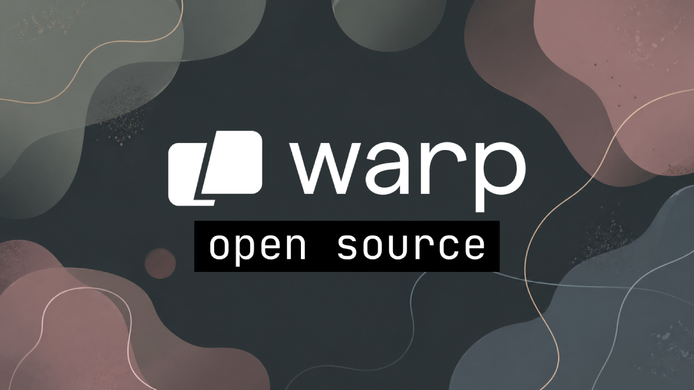

<!--
briefing_slug: 2026-04-29
generated_at: 2026-04-29T07:00:34-03:00
source_urls:
- https://www.wiz.io/blog/github-rce-vulnerability-cve-2026-3854
- https://github.blog/security/securing-the-git-push-pipeline-responding-to-a-critical-remote-code-execution-vulnerability/
- https://www.sysdig.com/blog/cve-2026-42208-targeted-sql-injection-against-litellms-authentication-path-discovered-36-hours-following-vulnerability-disclosure
- https://github.com/BerriAI/litellm/security/advisories/GHSA-r75f-5x8p-qvmc
- https://grafana.com/blog/get-observability-in-the-terminal-for-you-and-your-agents-with-the-gcx-cli-tool/
- https://www.warp.dev/blog/warp-is-now-open-source
- https://corrode.dev/blog/bugs-rust-wont-catch/
- https://arxiv.org/abs/2604.25850v1
- https://arxiv.org/abs/2604.25562v1
- https://arxiv.org/abs/2604.25611v1
- https://socket.dev/blog/73-open-vsx-sleeper-extensions-glassworm
- https://kubernetes.io/blog/2026/04/28/kubernetes-v1-36-staleness-mitigation-for-controllers/
- https://jdx.dev/posts/2026-04-17-going-full-time-on-open-source/
- https://arxiv.org/abs/2604.25862v1
- https://arxiv.org/abs/2604.25724v1
omitted_briefing_items:
- SecurityWeek GitHub story: confirmava a mesma história da Wiz/GitHub, então ficou como duplicata secundária.
- OpenWrt, cPanel e LangChain exploit-db: úteis, mas os ganchos eram mais antigos ou menos fortes que GitHub e LiteLLM.
- NCSC SOC metrics, Who owns the Claude code, ChatGPT ads attribution e legal/marketing items: bons para acompanhamento, mas deslocavam o post do eixo técnico do dia.
- Poolside, Rocky, LFK e várias ferramentas novas: interessantes, porém ainda pediam mais tração ou documentação primária antes de virar recomendação.
- Ghostty leaving GitHub: item ficou como watch, porque a fonte primária não resolveu bem no briefing.
- Before GitHub, HardenedBSD/Radicle e PostgreSQL ecosystem: entraram no pano de fundo de open source infra, mas não couberam sem alongar demais.
-->

> Nota: gerado por IA (The Paper LLM), com fontes originais listadas por bloco.

Hoje tem muito assunto interessante: Warp abriu abriu o cliente para open
source. Também tem incidente de infraestrutura, daqueles que começam com comando
normal e terminam no lugar errado. Um `git push` virou caminho para RCE. Um
gateway de LLM virou banco de segredo exposto. E a parte boa, se dá pra chamar
assim, é que o resto do lote ajuda a pensar em defesa de um jeito menos
romântico.

Agente precisa de contexto de produção. Terminal precisa falar com
observabilidade. Open source precisa decidir até onde deixa agente tocar no
produto. E Rust, coitado, segue fazendo muita coisa certa sem virar varinha
mágica para código privilegiado.

## GitHub corrigiu um RCE no caminho do git push

A Wiz divulgou em 28 de abril de 2026 a CVE-2026-3854, uma falha crítica no
pipeline interno de Git do GitHub. O formato é simples o bastante para dar frio:
usuário autenticado, acesso de push a um repositório e um `git push` com opção
manipulada.

O problema estava na passagem de metadados entre serviços internos. O GitHub
explica que push options, que são parte normal do Git, entravam nesse caminho.
Como o formato interno usava um delimitador que também podia aparecer no valor
fornecido pelo usuário, o pesquisador conseguia injetar campos que o serviço
seguinte interpretava como confiáveis.

A partir daí, a cadeia ficava feia. Segundo o GitHub, os pesquisadores
demonstraram como mudar o ambiente de processamento do push, contornar a
contenção esperada para execução de hooks e chegar a comando arbitrário no
servidor que processava a operação.

O GitHub diz que recebeu o relatório em 4 de março de 2026, validou em menos de
duas horas, corrigiu o GitHub.com no mesmo dia e não encontrou exploração por
outros usuários. Para GitHub Enterprise Server, a história é mais prática:
atualizar para as versões corrigidas e revisar `/var/log/github-audit.log` em
busca de push options contendo `;`.

A Wiz acrescenta duas partes que deixam o caso maior. A primeira é impacto: no
GitHub Enterprise Server, a falha poderia comprometer o servidor inteiro. A
segunda é método: a pesquisa usou IA para ajudar a reverter binários fechados e
entender o protocolo interno. Não é preciso transformar isso em ficção
científica. Já é suficiente: source hosting é produção.

Fontes: [Wiz](https://www.wiz.io/blog/github-rce-vulnerability-cve-2026-3854) e
[GitHub Security Blog](https://github.blog/security/securing-the-git-push-pipeline-responding-to-a-critical-remote-code-execution-vulnerability/).

## LiteLLM mostra o risco de tratar gateway de IA como proxy comum

O LiteLLM apareceu de novo, agora por uma SQL injection crítica na verificação
de chaves da API do proxy. A advisory GHSA-r75f-5x8p-qvmc afeta versões a partir
da 1.81.16 e antes da 1.83.7. A correção está na 1.83.7.

O bug não precisava de login. A advisory diz que um atacante podia enviar um
header `Authorization` manipulado para rotas de LLM, como
`POST /chat/completions`, e alcançar uma query de banco pelo caminho de erro do
proxy. O ponto frágil era clássico: valor vindo do usuário misturado no texto da
query em vez de virar parâmetro.

O detalhe que muda o peso da história veio da Sysdig. A equipe observou a
primeira tentativa de exploração 36 horas e 7 minutos depois da advisory entrar
no GitHub Advisory Database. E não parecia barulho genérico de scanner. A
tentativa mirava tabelas com chaves virtuais, credenciais de provedores e
configuração de ambiente do proxy.

Esse é o tipo de bug que obriga a olhar para o desenho inteiro. Se o LiteLLM
está exposto, ele não é só um roteador simpático entre aplicação e OpenAI,
Anthropic ou outro provedor. Ele pode ser o lugar onde ficam as chaves, as
políticas e o mapa de como seu produto chama modelo.

A ação curta é atualizar. A ação menos confortável é assumir possível exposição:
revisar logs, rotacionar segredos relevantes, reduzir acesso de rede ao proxy e
parar de colocar gateway de IA público como se fosse endpoint qualquer.

Fontes:
[Sysdig](https://www.sysdig.com/blog/cve-2026-42208-targeted-sql-injection-against-litellms-authentication-path-discovered-36-hours-following-vulnerability-disclosure)
e
[GitHub Advisory Database](https://github.com/BerriAI/litellm/security/advisories/GHSA-r75f-5x8p-qvmc).

## gcx leva observabilidade para o terminal do agente

A Grafana colocou em preview público o `gcx`, uma CLI para levar Grafana Cloud e
Grafana Assistant ao terminal. A frase parece anúncio de ferramenta, mas a ideia
é boa: se o agente já roda `git`, `kubectl` e teste, ele também deveria
conseguir consultar latência, traces, SLO, alertas e dashboards antes de mexer
em código.

O texto da Grafana dá exemplos bem concretos. Um agente pode perguntar por que
um endpoint ficou mais lento, puxar traces e histogramas de latência, consultar
burn rate de um SLO ou olhar histórico de alerta antes de sugerir um threshold
novo. Isso muda o tipo de palpite que o agente faz.

Tem uma camada de design que interessa mais que o produto em si. O `gcx` emite
JSON ou YAML via `--output`, documenta códigos de saída, evita ruído visual em
modo de agente, tem catálogo de comandos legível por máquina e pede confirmação
em operações destrutivas. Parece detalhe chato. É exatamente o tipo de detalhe
que separa uma CLI boa para humano de uma CLI usável por agente.

Se a automação do futuro vai tocar código, ela precisa ver produção sem abrir um
painel colorido no navegador e fingir que entendeu. Texto estável, erro
documentado e contexto nomeado ainda são o idioma mais honesto para esse tipo de
integração.

Fonte:
[Grafana Labs](https://grafana.com/blog/get-observability-in-the-terminal-for-you-and-your-agents-with-the-gcx-cli-tool/).

## Warp abriu o cliente, mas a pergunta é quem controla o loop

A Warp anunciou que seu cliente agora é open source. A parte óbvia é a licença.
A parte mais interessante é o motivo declarado: agentes mudaram a forma como a
empresa quer desenvolver o produto.

O post fala em comunidade ajudando a direcionar, especificar e melhorar Warp,
enquanto agentes entram no ciclo de implementação. A empresa também é direta
sobre o lado comercial. Open source, ali, não aparece como pureza estética; é
estratégia para competir, acelerar desenvolvimento e atrair uma comunidade mais
envolvida.

Esse é um experimento que vale acompanhar sem comprar a embalagem inteira. O
cliente aberto ajuda. O ecossistema em volta, especialmente a camada Oz de
orquestração de agentes, continua sendo parte do jogo da empresa. Então a
pergunta prática não é só se o repositório abriu. É até onde a comunidade
consegue influenciar o produto quando a execução passa por um loop
semi-automatizado.

Mesmo assim, tem algo real aqui. Manutenção open source com agente não combina
com issue vaga e PR jogado por cima do muro. Combina com especificação clara,
verificação boa e humano decidindo quando o resultado presta. Bonito? Nem
sempre. Provavelmente é por aí que vai andar.

Fonte: [Warp](https://www.warp.dev/blog/warp-is-now-open-source).

## Rust não protege contra lógica errada no filesystem

Matthias Endler publicou um texto excelente sobre bugs que Rust não pega. A base
é a divulgação de 44 CVEs em `uutils`, a reimplementação em Rust do GNU
coreutils usada pela Canonical. O ponto não é bater no projeto. É entender onde
a garantia da linguagem termina.

O maior grupo de problemas vem de path handling. Caminho de arquivo parece valor
simples no código, mas para o kernel é nome resolvido no momento da syscall. Se
um programa privilegiado checa uma path em uma chamada e age sobre a mesma path
em outra, alguém com acesso ao diretório pai pode trocar o alvo no intervalo.

Esse tipo de erro não depende de `unsafe`, ponteiro solto ou buffer overflow. O
borrow checker pode estar feliz enquanto o programa abre uma janela de corrida
contra o filesystem. Em ferramenta privilegiada, isso vira bug de segurança.

A correção muda o jeito de pensar. Em vez de confiar na path como identidade
estável, ancore a operação em file descriptor quando a situação pedir. Crie com
permissões corretas desde o começo. Evite checar uma coisa e agir sobre outra
como se o mundo tivesse congelado entre duas syscalls.

Rust continua sendo uma baita escolha para sistemas. Só não dá para terceirizar
o modelo de ameaça para o compilador. Ele não conhece o adversário sentado no
diretório `/tmp`.

Fonte: [corrode.dev](https://corrode.dev/blog/bugs-rust-wont-catch/).

## Destaques rápidos

- O paper Agentic Harness Engineering diz que o harness pode pesar mais que a
  troca de modelo em agentes de código. A proposta é observar componentes,
  trajetórias e decisões para evoluir o harness com contrato verificável, não só
  tentativa e erro. Fonte: [arXiv](https://arxiv.org/abs/2604.25850v1).

- SnapGuard mira agentes web baseados em screenshot. A ideia é detectar prompt
  injection visual sem chamar um modelo de visão pesado para cada página, usando
  sinais visuais e texto recuperado da própria captura. Fonte:
  [arXiv](https://arxiv.org/abs/2604.25562v1).

- WhisperPipe é um paper de streaming ASR com memória limitada, Silero VAD,
  janelas sobrepostas e latência mediana de 89 milissegundos nos testes
  reportados. Para pipeline de áudio, é o tipo de arquitetura que vale guardar.
  Fonte: [arXiv](https://arxiv.org/abs/2604.25611v1).

- A Socket encontrou 73 extensões dormentes no Open VSX ligadas ao GlassWorm. O
  alvo inclui VS Code, Cursor, Windsurf e VSCodium, com loaders que baixam
  payloads depois da ativação. Fonte:
  [Socket](https://socket.dev/blog/73-open-vsx-sleeper-extensions-glassworm).

- O Kubernetes 1.36 trouxe mitigação de staleness para controladores. O resumo
  prático: cache de controller desatualizado pode tomar ação errada, então
  operadores precisam tratar consistência eventual como risco real. Fonte:
  [Kubernetes](https://kubernetes.io/blog/2026/04/28/kubernetes-v1-36-staleness-mitigation-for-controllers/).

- Jeff Dickey saiu da Figma para trabalhar em open source em tempo integral,
  principalmente no mise. A parte útil do relato é sustentabilidade de
  ferramenta que já virou infraestrutura de dev, inclusive em ambientes de
  agente. Fonte:
  [jdx.dev](https://jdx.dev/posts/2026-04-17-going-full-time-on-open-source/).

- RESTestBench alerta para um efeito chato: quando um LLM refina testes contra
  um sistema já mutado ou com bug, ele pode aprender o comportamento errado como
  se fosse verdade. Fonte: [arXiv](https://arxiv.org/abs/2604.25862v1).

- O paper da Salesforce sobre compound AI systems fala de inferência com vários
  modelos, retrievers e ferramentas escalando em paralelo. O detalhe bom é
  operacional: sistemas de agentes precisam escalar partes diferentes de forma
  independente. Fonte: [arXiv](https://arxiv.org/abs/2604.25724v1).

## Acompanhamento de tendências

A linha do dia é infraestrutura de desenvolvimento entrando no threat model sem
pedir licença. GitHub, LiteLLM, Open VSX, Kubernetes e mise aparecem em camadas
diferentes, mas todos vivem perto do mesmo lugar: onde código vira execução
confiável.

Também tem uma virada boa em agentes. O assunto menos útil é "qual modelo
escreve melhor". O assunto que começa a ficar sério é o que o agente consegue
ver, em qual formato, com qual permissão e como ele prova que a mudança
funcionou. `gcx`, Agentic Harness Engineering, RESTestBench e SnapGuard caem
nessa família.

E tem o lembrete antigo, agora com roupa nova: segurança de software ainda é
cheia de chão batido. Um delimitador mal tratado, uma query sem parâmetro, uma
path re-resolvida na hora errada. A IA pode acelerar a descoberta e a correção,
mas o bug continua morando em detalhes bem humanos.
