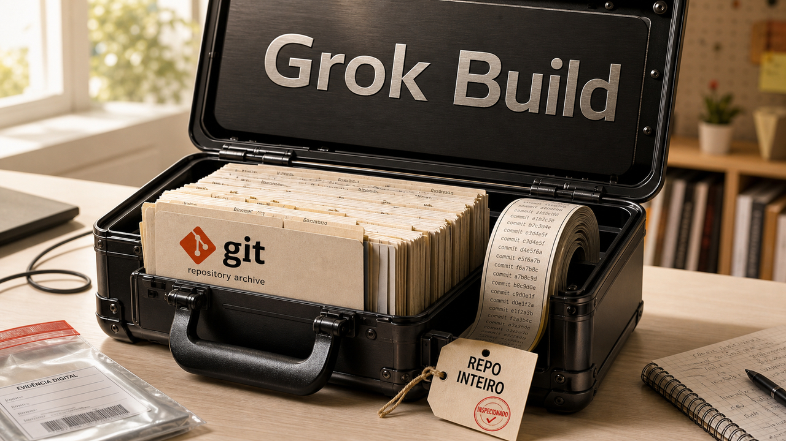

Tem coisa que parece invisível até dar problema: o caminho que um agente de código usa para sair da sua máquina e o processo que segura todas as conexões antes de elas chegarem ao banco. Hoje os dois apareceram com detalhes suficientes para merecer uma olhada.

## Um relatório diz que o Grok Build enviou mais que os arquivos lidos

No dia 5, falamos de [confiança em agentes de código](/2026/ia-escreveu-o-sqlite-utils-4-0-e-a-alibaba-baniu-o-claude-code/). Agora apareceu evidência mais concreta sobre o cliente: um relatório independente, baseado em captura de tráfego, analisou o Grok Build 0.2.93 e diz ter recuperado um pacote do repositório enviado ao armazenamento da xAI.

O detalhe incômodo é o tamanho desse pacote. Segundo o relatório, ele continha arquivos rastreados e o histórico Git, inclusive um arquivo que o agente tinha recebido instrução para não ler. Para quem usa esse tipo de ferramenta em projeto real, a pergunta de segurança muda. Além dos arquivos que entraram no contexto da conversa, importa saber que parte do workspace o cliente consegue empacotar e transmitir.

Isso não significa que a xAI treinou o modelo com o conteúdo. O próprio relatório separa o que observou, transmissão e armazenamento, do que não consegue provar: treinamento ou comportamento idêntico em toda conta e versão.

Vale tratar o ambiente do agente como perímetro de verdade. Repositório pequeno e dedicado, segredo fora de arquivo rastreado, permissões mínimas e uma verificação do comportamento de rede antes de soltar a ferramenta num monorepo cheio de história reduzem o estrago possível. Agente de código precisa de contexto para trabalhar; o que merece exame é quando o contexto vira uma mala de mudança inteira.

Fonte: [relatório de análise do Grok Build](https://gist.github.com/cereblab/dc9a40bc26120f4540e4e09b75ffb547).

## ClickHouse distribuiu o PgBouncer para tirar o pooler de um núcleo só

O banco pode estar saudável e, mesmo assim, a fila de conexões virar a parte que pede arrego. PgBouncer é um pooler muito usado com PostgreSQL e cada processo dele trabalha em um único núcleo. Para carga moderada isso pode ser uma escolha perfeitamente boa. Quando o processo satura antes do banco, aumentar a máquina do PostgreSQL resolve pouco.

A engenharia da ClickHouse descreveu uma saída para esse limite em seu serviço gerenciado: uma frota de processos PgBouncer ouvindo a mesma porta com `SO_REUSEPORT`. Assim, o sistema operacional distribui conexões entre os processos, sem obrigar o cliente a conhecer vários endpoints. A equipe também usa comunicação entre eles para encaminhar cancelamentos de consulta, porque a conexão que precisa receber o cancelamento pode ter caído em outro processo.

No teste da ClickHouse, com `pgbench` numa instância AWS c7i.4xlarge de 16 vCPUs, um processo ficou perto de 87 mil transações por segundo; a frota chegou a cerca de 336 mil. O resultado vale para aquela configuração e aquele workload.

Também há uma conta para fazer antes: o limite de conexões precisa ser dividido entre os processos para não empurrar mais conexões ao PostgreSQL do que ele aguenta. Os cancelamentos merecem teste real, porque uma arquitetura distribuída fica mais complicada quando alguém precisa cancelar a consulta que está travando a aplicação. Se o pooler ainda não é o gargalo medido, um único processo continua sendo a opção mais tranquila.

Fonte: [ClickHouse, sobre escalar PgBouncer](https://clickhouse.com/blog/pgbouncer-clickhouse-managed-postgres).

## Destaques rápidos para hoje

- Um relato pessoal publicado em 10 de julho mostra o autor fazendo o Qwen 3.5 122B responder melhor em um Mac Studio com M3, no fork qMLX. O ganho veio de três correções de cache: chave estável para reutilizar prefixo, tratamento de saída interrompida e descarte de checkpoints. Para inferência local com contexto longo, às vezes a sensação de lentidão nasce antes da geração de tokens, na hora de recalcular um prompt que deveria estar quente. Os números valem para essa máquina e esse fork pessoal; não servem como recomendação de hardware. Fontes: [relato do autor](https://mrzk.io/posts/qmlx-maximising-ai-psychosis-minmaxing-mac-studio/) e [qMLX](https://github.com/marzukia/qMLX).

- Um exemplo de cerca de 100 linhas em Common Lisp deixa o loop de um agente bem visível: o modelo responde, pede uma ferramenta, recebe o resultado e segue a conversa. A ferramenta central do exemplo executa código no estilo `eval`. O exemplo é didático. Para qualquer uso fora desse contexto, sandbox, ferramentas restritas e permissões fora do alcance do próprio modelo deixam de ser detalhe. Fonte: [An Agent in 100 Lines of Lisp](https://thebeach.dev/posts/lisp-agent/).

> Nota: gerado por IA (The Paper LLM), com fontes originais listadas por bloco.

<!--
briefing_slug: 2026-07-12
source_mode: briefing
generated_at: 2026-07-12T08:46:25-03:00
source_urls:
  - https://gist.github.com/cereblab/dc9a40bc26120f4540e4e09b75ffb547
  - https://clickhouse.com/blog/pgbouncer-clickhouse-managed-postgres
  - https://mrzk.io/posts/qmlx-maximising-ai-psychosis-minmaxing-mac-studio/
  - https://github.com/marzukia/qMLX
  - https://thebeach.dev/posts/lisp-agent/
omitted_briefing_items:
  - reaction: no verified current release or material change payload.
  - Cloudflare/hyper HTTP/1 race condition: primary source not validated in this run.
  - sqlite-utils 4.1: recent Paper LLM coverage had no sufficiently new public delta.
  - Apple SQL injection disclosure: original public disclosure is from 2024, not a new event.
-->
