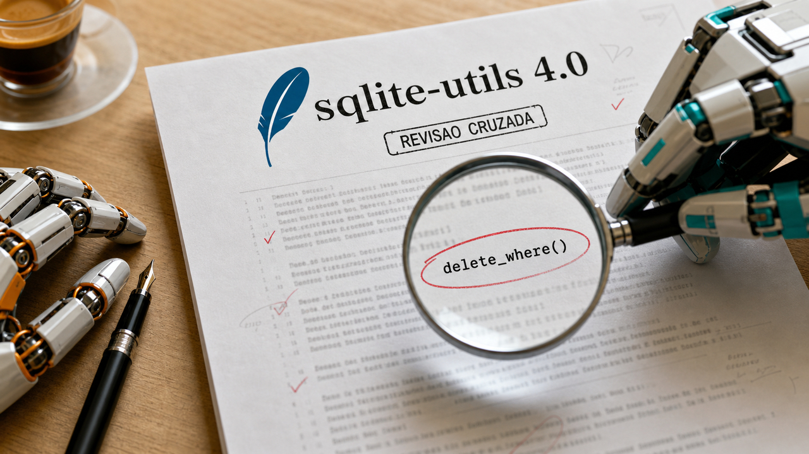

Domingo de manhã e a pergunta que atravessa quase todas as histórias de hoje é antiga: quem confere o trabalho de quem? A primeira resposta veio de um lugar concreto, uma biblioteca de SQLite que muita gente usa, num release que a IA escreveu e outra IA revisou.

## Simon Willison lançou o sqlite-utils 4.0rc2 escrito quase todo por IA, e a revisão de outro modelo pegou bug de perda de dados

O sqlite-utils tinha um footgun clássico de transação. Você escrevia no banco, lia de volta na mesma conexão, tudo parecia salvo. Se a conexão fechava antes de um commit manual, a escrita sofria rollback silencioso e sumia. Dados que pareciam confirmados, perdidos sem erro nenhum.

A versão 4.0rc2, publicada neste 5 de julho, mata esse comportamento: todo método que escreve no banco agora roda na própria transação e commita antes de retornar. O `db.query()` também mudou, executa imediatamente e rejeita statements que não retornam linhas. Quem depende do commit manual antigo precisa revisar o código antes de subir para o 4.x. E ainda é release candidate, não versão final.

A outra metade da história é como o release foi feito. Willison dirigiu o processo, mas o código saiu quase todo do Claude Fable via Claude Code: 37 prompts, 34 commits, 30 arquivos mexidos, custo estimado pelo próprio autor em US$ 149,25 sem subsídio de plano.

E a parte que me interessa de verdade: a revisão. Durante o trabalho, o próprio modelo encontrou um bug real de perda de dados, o `delete_where()` nunca commitava e envenenava a conexão, fazendo escritas posteriores desaparecerem. Willison então fez algo que ainda é raro: pediu para o GPT-5.5 da OpenAI revisar o trabalho do modelo da Anthropic. A revisão adversarial confirmou mais dois problemas de transação em `db.query()`, corrigidos em seguida no PR #768.

Um modelo escreveu, o rival revisou, o humano decidiu o que entrava. É um fluxo de revisão que qualquer time pode copiar hoje, com números reais na etiqueta.

Fonte: [Simon Willison](https://simonwillison.net/2026/Jul/5/sqlite-utils-fable/).

## Alibaba proíbe o Claude Code internamente depois que a Anthropic admitiu experimento de rastreamento

No dia 3, [o marcador escondido no prompt do Claude Code passou por aqui](/2026/confiar-cedo-demais-no-kde-plasma-no-claude-code-e-no-guix/) ainda como análise técnica de um pesquisador. Agora a história ganhou os dois desfechos que faltavam: a Anthropic confirmou, e a Alibaba reagiu.

Pelo lado da Anthropic, o funcionário Thariq Shihipar disse publicamente que o código que checava sinais do ambiente, coisas como fuso horário e proxy, para sinalizar usuários na China ou ligados a labs chineses foi "um experimento lançado em março" contra abuso de contas e destilação, já substituído por salvaguardas mais fortes. Ou seja: o mecanismo existiu, e a empresa assume.

Pelo lado da Alibaba, a The Information reporta que a empresa está banindo o Claude Code internamente. Os detalhes que circulam vêm dessa reportagem e das que a replicaram: vigência a partir de 10 de julho, classificação interna como software de alto risco, ordem para apagar modelos Claude e migração para o Qoder, a plataforma de código da própria Alibaba. A empresa não confirmou nada disso publicamente, então esses pontos seguem como reportagem com fontes, não comunicado.

O pano de fundo é uma briga maior. A Anthropic acusa operadores ligados ao lab Qwen, da Alibaba, de destilação em massa das respostas do Claude; a Alibaba nega. Os termos da Anthropic, aliás, já proibiam uso por empresas controladas pela China. Com o ban, os dois lados do Pacífico agora restringem a mesma ferramenta, cada um pelo seu motivo.

Para quem está longe dessa geopolítica, sobra uma lição bem local: agente de código é software que inspeciona o ambiente onde roda. O que ele coleta, e para quem, virou critério de compra e de banimento. Vale perguntar isso do seu, seja ele qual for.

Fontes: [The Information](https://www.theinformation.com/briefings/alibaba-bans-employees-using-claude), [The Decoder](https://the-decoder.com/claude-codes-complicated-china-problem-involves-bans-on-both-sides-of-the-pacific/), [SCMP](https://www.scmp.com/tech/big-tech/article/3359375/alibaba-bans-staff-using-claude-code-over-anthropic-spyware-concerns) e [TechCrunch](https://techcrunch.com/2026/07/04/alibaba-reportedly-bans-employees-from-using-claude-code/).

## O criador do BabyAGI propõe que o log de eventos seja o agente

Auditar um agente hoje costuma significar confiar na memória do modelo e em logs colados por cima de um loop de conversa. Deu problema na execução de terça? Boa sorte reproduzindo exatamente o que aconteceu.

O paper "The Log is the Agent", de Yohei Nakajima, o mesmo do BabyAGI, inverte essa arquitetura. No ActiveGraph, a única fonte da verdade é um log de eventos append-only, aquele arquivo que só cresce e nunca é editado. O grafo de trabalho do agente é uma projeção determinística desse log, e os comportamentos, sejam funções, classes ou rotinas com modelo, reagem a mudanças no grafo e emitem novos eventos. Nenhum componente chama outro diretamente.

Se você faz backend, já viu esse filme: é event sourcing, o padrão de guardar cada mudança como evento e reconstruir o estado a partir deles, aplicado a agentes. E as três propriedades que caem de graça são exatamente as dores atuais: replay determinístico de qualquer execução, fork barato a partir de qualquer evento sem re-executar o que veio antes, e linhagem completa do objetivo lá do início até cada chamada de modelo.

Honestidade de calendário: o paper é de 21 de maio de 2026, ressurgiu nos feeds agora. É pesquisa com implementação de referência sob Apache 2.0 e demo reproduzível; ainda não é um framework pronto para substituir o que você usa em produção. Como direção de arquitetura, porém, é das mais limpas que apareceram por aqui.

Fonte: [arXiv](https://arxiv.org/abs/2605.21997).

## TinyCOV mede cobertura de fuzzing do jeito errado, e o autor é o primeiro a avisar

Fuzzing é jogar entrada maluca num programa até ele quebrar. Só que fuzzer moderno precisa saber por onde o programa passou, a tal cobertura, para gerar entradas melhores. E medir isso em binário sem código-fonte custa caro: o QEMU instrumenta tudo com 3 a 5 vezes de lentidão, enquanto o Intel Processor Trace faz em hardware com uns 10% de overhead.

O autor do redvice.org tinha um problema mundano: está num laptop AMD, sem Processor Trace. A solução, batizada de TinyCOV, é assumidamente errada e por isso divertida. Ele troca cada instrução de branch do binário por um breakpoint INT3, que ocupa 1 byte, e guarda no byte que sobra os metadados para reconstruir o desvio.

Breakpoint normalmente é caro porque cada disparo obriga o processador a trocar de nível de privilégio, do código do usuário para o kernel e de volta. O truque do TinyCOV é rodar tudo dentro de uma VM no KVM com um kernel guest próprio, escrito para tratar o trap sem sair do ring 3, o nível menos privilegiado. O desvio caro simplesmente não acontece.

Resultado: funciona, habilita hooks de cobertura customizados, e roda cerca de 7 vezes mais lento que o nativo, pior ainda em código cheio de branches como o bzip2. O próprio autor arquiva o projeto como "brinquedo fofo" e manda não usar em produção. O texto vale menos pela ferramenta e mais pela aula: é um tour honesto por como fuzzers enxergam código, de AFL a Processor Trace, com uma gambiarra deliciosa no final.

Fonte: [redvice.org](https://redvice.org/2026/coverage-the-wrong-way/).

## Ter seu próprio pedaço da internet: ASN, IPv6 e BGP num VPS barato

Se você vive atrás de CGNAT, aquele esquema em que a operadora divide um IP público entre vários clientes, conhece os sintomas: CAPTCHA em tudo, cara de proxy para os sites, reputação do endereço afundada por um vizinho que você nunca viu. A série "My ASN Journey" mostra a saída mais radical possível: virar, literalmente, um sistema autônomo da internet.

O caminho, documentado em 8 das 12 partes planejadas: registrar seu próprio ASN, o número que identifica uma rede independente, e um bloco IPv6 via um LIR da RIPE, e anunciá-los com BGP a partir de um VPS. Os custos surpreendem para baixo: cerca de £15 de taxa única do ASN, uns £55 por ano de RIPE, e um VPS com sessão BGP por uns 5 francos suíços a cada 3 meses. Dali em diante a série cobre trazer o IPv6 para casa via SOCKS5 ou WireGuard, entrar num ponto de troca de tráfego, adicionar upstreams e configurar RPKI.

O ganho é ter endereço com reputação só sua, controle total do roteamento e independência do provedor. Netflix e Wikipedia param de te tratar como bot.

Agora os avisos, que o autor lista sem enfeite. Seu nome e contato vão para registro público da internet, sem opção de privacidade; o autor chama isso de self-doxxing e é exatamente isso. E BGP é a tubulação real da internet: um anúncio errado não quebra só o seu lab, incomoda engenheiro de rede do outro lado do mundo. A série é de abril de 2024, atualizada em maio de 2026, então leia como guia testado pelo tempo, não como notícia. Para quem já brinca de VPS, túnel e WireGuard, é a fase seguinte do jogo.

Fonte: [Anim Mouse](https://www.animmouse.com/p/my-asn-journey/).

## Destaques rápidos para hoje

- **Uma issue no Codex acusa o GPT-5.5 de raciocinar menos, com telemetria em vez de vibe.** Um dev analisou 390.195 registros de 865 sessões próprias e mostra respostas se acumulando em exatamente 516 tokens de raciocínio, padrão 33 vezes mais forte que em outros modelos, subindo de 0,11% para mais de 53% das respostas em maio enquanto a profundidade média caía. Cheira a teto deliberado, mas segue como acusação: a issue #30364 está aberta desde 27 de junho sem resposta da OpenAI, e os dados são de um usuário só. Fonte: [GitHub openai/codex](https://github.com/openai/codex/issues/30364).

- **O ex-líder do Qwen admite que o hybrid thinking foi um erro.** Junyang Lin, que comandou o Qwen até março, conta que juntar modo instruct e modo thinking no mesmo modelo degradava os dois, por isso as variantes se separaram. Ele também deixa uma lição de infra: treino agêntico exige desacoplar inferência da execução do ambiente, senão as GPUs ficam paradas esperando testes rodarem. O problema que ele chama de mais difícil é reward hacking. Opinião de um pesquisador, não posição oficial da Alibaba. Fonte: [Marktechpost](https://www.marktechpost.com/2026/07/04/qwens-former-lead-on-what-hybrid-thinking-got-wrong-and-why-he-now-backs-agents/).

- **Um projeto comunitário transforma o PS5 em desktop Linux.** O ps5-linux-loader usa exploits de hypervisor para subir um bootloader próprio em firmwares 3.00 a 7.61, com drivers escritos à mão para Blu-ray, Bluetooth e ethernet; Wi-Fi só em chipsets Marvell por enquanto. A release v2.3 saiu em julho, e o valor real é a masterclass pública de bring-up de hardware em Linux. Fonte: [GitHub ps5-linux](https://github.com/ps5-linux/ps5-linux-loader).

- **Backon empacota retry, circuit breaker e hedging em Python puro.** Backoff exponencial, circuito com estados CLOSED/OPEN/HALF_OPEN e hedging (disparos concorrentes, vence o primeiro sucesso), com API idêntica para sync e async, mypy strict e licença MIT, tudo sem dependência externa. Projeto jovem, 13 stars e 9 releases: estude os padrões e valide antes de produção. Fonte: [GitHub Llucs/backon](https://github.com/Llucs/backon).

- **No PostgreSQL, enable_parallel_hash é sonda de diagnóstico, não botão de turbo.** Com o parâmetro ligado, que é o padrão, os workers de um hash join paralelo constroem uma única tabela hash em memória compartilhada, somando os orçamentos de memória em vez de duplicar cópias. Desligue só para diagnosticar quando o EXPLAIN (ANALYZE) mostra spill para disco (Batches > 1); a correção real costuma ser work_mem ou hash_mem_multiplier, e o toggle volta a ligado depois. Fonte: [thebuild.com](https://thebuild.com/blog/all-your-gucs-in-a-row-enable_parallel_hash/).

- **O plano perfeito de migração para Keycloak durou 20 segundos na mesa do CTO.** Relato em português no TabNews: dois dias desenhando a migração de identidade, e o chefe escolheu a opção chata esboçada em meia hora. Com razão, pelos motivos que o próprio autor lista: Keycloak sem bcrypt nativo, extensões por instância em vez de por realm, e Sign in with Apple exigindo rotação custom de JWT. Venceu a auth interna com argon2id e rehash preguiçoso no login. Rigor no plano errado ainda é o plano errado. Fonte: [TabNews](https://www.tabnews.com.br/vmv/o-plano-perfeito-que-foi-rejeitado-em-20-segundos).

- **Se o LLM não vai ler o dado, o dado não deveria passar pelo contexto.** Padrão do blog da RidgeText: cada tool guarda o resultado pesado em memória no servidor e devolve só um recibo minúsculo com status e um layerId; um compositor final monta tudo na renderização. No exemplo, 500KB de GeoJSON que custariam ~125 mil tokens viram ~150. Ontem o pxpipe atacou a mesma dor por outro ângulo; economizar janela de contexto virou disciplina. O texto é de 18 de junho, ressurgiu agora. Fonte: [RidgeText](https://ridgetext.com/blog/mapbox-llm-composition).

- **E se o TypeScript compilasse direto para código nativo?** Dois devs brasileiros, com ajuda pesada de IA, estão construindo o RTS: compilador em Rust com Cranelift que mantém números provados pelo sistema de tipos em registradores de CPU, caindo para um modelo dinâmico com NaN-boxing quando o tipo não garante. A compatibilidade está em 76% de 609 testes semânticos comparados byte a byte com o Node, medida pelo CI do próprio projeto. A pergunta interessante é até onde os tipos estáticos carregam antes de o dinamismo do JS cobrar. Fonte: [TabNews](https://www.tabnews.com.br/MarcosBrendon/e-se-o-typescript-pudesse-compilar-diretamente-para-codigo-nativo).

- **libbeef porta a lib de floats de precisão arbitrária do Bellard para Rust puro.** IEEE 754 completo, funções transcendentais, suporte decimal e zero dependências em ~480 KiB, rodando até em WASM e embedded. A manchete discreta é a licença: MIT, escapando do LGPL que vem junto com GMP/MPFR. Em precisão extrema, acima de uns 10 mil bits, as libs C ainda vencem. Fonte: [GitHub lifthrasiir/libbeef](https://github.com/lifthrasiir/libbeef).

- **"Não sei Rust, minha IA está reescrevendo o PHP nele", e o juiz são os 22 mil testes do php-src.** O Phargo passa hoje 3.844 de 22.037 testes oficiais (17,4%, com teto realista de 40 a 45% sem extensões C) e já renderiza a home do WordPress, 55 vezes mais lento. As pérolas: um bug de CRLF que mentia no placar por semanas, e os "Potemkin builtins", features que existiam e não faziam nada, como clone retornando null. Nunca deixe a IA corrigir a própria prova. Fonte: [ekinertac.com](https://ekinertac.com/blog/i-dont-know-rust-my-ai-is-rewriting-php-in-it/).

- **PDF para JSON com modelos abertos tem pegadinha na licença dos pesos.** Guia da Marktechpost mapeia as opções locais de 2026: lift (9B, saída presa a schema, 90,2% de acurácia de campo segundo o projeto), Granite-Docling-258M da IBM, MinerU, Marker, olmOCR 2 e DeepSeek-OCR. O aviso que salva dinheiro: código livre não garante peso livre; lift e Marker usam variantes de OpenRAIL-M que cobram por self-hosting comercial. MIT ou Apache de verdade: DeepSeek-OCR e olmOCR 2. Fonte: [Marktechpost](https://www.marktechpost.com/2026/07/04/structured-pdf-to-json-a-guide-to-open-source-extraction-models-in-2026/).

- **Armin Ronacher: modelos melhores, ferramentas piores.** O criador do Flask observa que modelos Claude recentes pioraram em seguir schemas de tools fora do padrão, inventando campos em chamadas malformadas que versões antigas acertavam. A hipótese dele: pós-treino num harness que aceita e conserta chamada desleixada ensina o modelo a ser desleixado. Para quem tem tools próprias, a defesa é validação estrita e, quando der, sampling restrito por gramática. É observação de um engenheiro respeitado, não estudo controlado. Fonte: [lucumr.pocoo.org](https://lucumr.pocoo.org/2026/7/4/better-models-worse-tools/).

## Acompanhamento de tendências do dia

O fio que costura o dia é a verificação virando parte da arquitetura. No sqlite-utils, a revisão virou etapa estrutural: um modelo escreve, o rival revisa, e o bug de perda de dados aparece antes do release. No Phargo e no RTS, o oráculo é uma suíte de testes que a IA não controla, e é ela que desmascara os builtins de fachada e mede os 76% sem gentileza.

A issue dos 516 tokens no Codex joga no mesmo time por outro caminho: em vez de reclamar que o modelo "parece preguiçoso", o autor levou 390 mil registros de telemetria. Pode estar errado, mas de um jeito verificável.

E o ActiveGraph aponta onde isso pode terminar: se o log de eventos é a fonte da verdade, auditar agente deixa de ser arqueologia e vira replay. O alerta do Ronacher fecha o ciclo pelo avesso, lembrando que o harness onde o modelo treina molda o comportamento dele fora dali. A infraestrutura de conferir está virando tão importante quanto a de gerar. Ainda não dá para saber se isso vira padrão de mercado ou fica como bom gosto de alguns; por enquanto, quem já tem um oráculo externo dorme melhor.

Fontes da tendência: [Simon Willison](https://simonwillison.net/2026/Jul/5/sqlite-utils-fable/), [ekinertac.com](https://ekinertac.com/blog/i-dont-know-rust-my-ai-is-rewriting-php-in-it/), [GitHub openai/codex](https://github.com/openai/codex/issues/30364), [arXiv](https://arxiv.org/abs/2605.21997) e [lucumr.pocoo.org](https://lucumr.pocoo.org/2026/7/4/better-models-worse-tools/).

> Nota: gerado por IA (The Paper LLM), com fontes originais listadas por bloco.

<!--
briefing_slug: 2026-07-05
source_mode: briefing
generated_at: 2026-07-05T06:00:00-03:00
source_urls:
  - https://simonwillison.net/2026/Jul/5/sqlite-utils-fable/
  - https://www.theinformation.com/briefings/alibaba-bans-employees-using-claude
  - https://the-decoder.com/claude-codes-complicated-china-problem-involves-bans-on-both-sides-of-the-pacific/
  - https://www.scmp.com/tech/big-tech/article/3359375/alibaba-bans-staff-using-claude-code-over-anthropic-spyware-concerns
  - https://techcrunch.com/2026/07/04/alibaba-reportedly-bans-employees-from-using-claude-code/
  - https://arxiv.org/abs/2605.21997
  - https://redvice.org/2026/coverage-the-wrong-way/
  - https://www.animmouse.com/p/my-asn-journey/
  - https://github.com/openai/codex/issues/30364
  - https://www.marktechpost.com/2026/07/04/qwens-former-lead-on-what-hybrid-thinking-got-wrong-and-why-he-now-backs-agents/
  - https://github.com/ps5-linux/ps5-linux-loader
  - https://github.com/Llucs/backon
  - https://thebuild.com/blog/all-your-gucs-in-a-row-enable_parallel_hash/
  - https://www.tabnews.com.br/vmv/o-plano-perfeito-que-foi-rejeitado-em-20-segundos
  - https://ridgetext.com/blog/mapbox-llm-composition
  - https://www.tabnews.com.br/MarcosBrendon/e-se-o-typescript-pudesse-compilar-diretamente-para-codigo-nativo
  - https://github.com/lifthrasiir/libbeef
  - https://ekinertac.com/blog/i-dont-know-rust-my-ai-is-rewriting-php-in-it/
  - https://www.marktechpost.com/2026/07/04/structured-pdf-to-json-a-guide-to-open-source-extraction-models-in-2026/
  - https://lucumr.pocoo.org/2026/7/4/better-models-worse-tools/
omitted_briefing_items:
  - Concurrency plus NVFP4 on Blackwell (Reddit): Reddit-only, bot-blocked; central throughput figure unverifiable. Fails payload gate.
  - Mouse precision editing tools (hic-ai.com): closed commercial product, unverifiable marketing claims; hype and payload gates fail.
  - Archi open-source CLI (TabNews): verified but early-stage study project; crowded out on a day with 11 stronger quick hits.
  - Bad Epoll curated echo (github.com/J-jaeyoung/bad-epoll): covered as main block on July 4; repeat without delta.
-->
