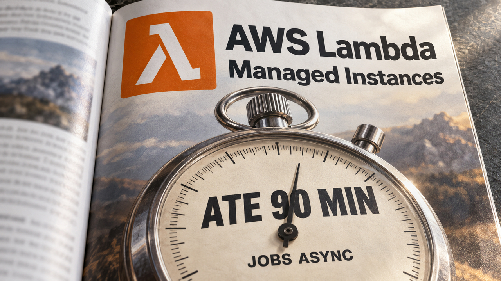

Seu job precisa de mais de 15 minutos para terminar. A AWS abriu espaço para até 90, desde que ele rode em Lambda Managed Instances e use uma modalidade de invocação compatível. Dá para respirar no processamento demorado. Também dá para falhar lá na frente e descobrir, na tentativa seguinte, que parte do trabalho já tinha sido feita. Antes de dar mais tempo ao job, confira o que ele pode acabar fazendo duas vezes.

## Lambda Managed Instances amplia o tempo dos jobs assíncronos

O anúncio de 9 de setembro aumenta para **90 minutos, ou 5.400 segundos**, o limite de uma execução assíncrona nas Lambda Managed Instances. A mudança também cobre os mapeamentos de fontes de eventos suportados, que ligam o consumo de filas ou streams à função. Isso dá espaço para processamento de mídia, transformação de dados e inferência que precisam de uma execução contínua mais longa.

Confira o escopo antes de comemorar no grupo do projeto. A capacidade on-demand comum do Lambda fica fora dessa mudança. Chamadas síncronas continuam limitadas a 15 minutos, assim como a inicialização. Os mapeamentos de Amazon MQ e DocumentDB também permanecem nos 15 minutos. “Lambda agora roda por uma hora e meia” é uma frase curta demais para a configuração que você vai ter de conferir.

[Já falamos do Lambda MicroVMs para executar código gerado por IA](/2026/lambda-microvms-isola-codigo-de-ia-e-sonicwall-lembra-que-patch-nao-limpa-vpn/). A novidade de setembro é outra: o timeout das funções em Managed Instances, nessas condições de invocação.

Nas funções existentes, você precisa alterar o timeout. Segundo a AWS, as invocações seguintes usam a nova configuração; a propagação para os mapeamentos de eventos pode levar alguns minutos. Alterar esse campo não migra uma função on-demand para Managed Instances. Primeiro confira onde ela executa e como recebe trabalho, depois aumente o limite.

Na fila, a conta chama atenção. Enquanto um consumidor processa uma mensagem do SQS, o período de visibilidade a esconde temporariamente dos outros consumidores. Quando ela volta a ficar elegível, pode haver outra tentativa de processamento. Para SQS nesse arranjo, a AWS recomenda configurar o período para pelo menos seis vezes o timeout da função. No novo máximo, são **nove horas de visibilidade**.

Coloque os dois números lado a lado no planejamento: uma hora e meia de execução e nove horas na configuração de visibilidade. Mudar só o campo da função deixa parte do comportamento antigo ao redor de um job bem mais longo.

E se a execução falhar depois de gravar alguma coisa? O Lambda não garante processamento exatamente uma vez. A operação de negócio precisa tolerar novas tentativas. Imagine uma cobrança: duas tentativas da mesma operação devem continuar correspondendo a uma cobrança. Uma chave de idempotência identifica essa operação lógica; a implementação precisa realmente impedir a duplicação do efeito. Dar um nome igual aos pedidos é só a parte que cabe numa string.

Funções duráveis ajudam a retomar o trabalho por checkpoints, os registros de etapas concluídas. No replay, uma etapa já registrada pode ser pulada. Se ela produziu um efeito externo e falhou antes de registrar o checkpoint, porém, pode executar de novo. Segundo a AWS, as etapas usam por padrão a semântica de pelo menos uma vez.

Também há dois tempos diferentes nessa história. O novo timeout governa uma execução contínua do handler. Um fluxo durável pode atravessar várias invocações; esse limite individual não se aplica à duração total do fluxo.

Faltam duas coisas para conferir. Nas fontes suportadas, o relato de falhas parciais de lote permite repetir os registros que falharam em vez do lote inteiro. E credenciais temporárias precisam continuar válidas ou ser renovadas durante o job. O processamento ganha hora extra, e a credencial encerra o expediente no meio. Bem conveniente.

Eu revisaria o timeout junto com a visibilidade da fila, os efeitos que toleram repetição e os checkpoints. Se o trabalho precisa durar mais, reserve tempo também para conferir como ele volta depois de uma falha.

Fonte: [AWS — timeout de 90 minutos no Lambda Managed Instances](https://aws.amazon.com/blogs/compute/announcing-90-minute-function-timeout-on-aws-lambda-managed-instances/).

## Uma consulta ClickHouse caiu de 85 segundos para cerca de 400 ms

Às vezes você precisa dar mais tempo ao processamento. Em outras, precisa descobrir por que ele está fazendo tanta coisa. Jordi Villar publicou em 8 de setembro uma investigação de quatro meses sobre uma consulta de dashboard em ClickHouse. Segundo o relato, ela começou em 85,715 segundos e terminou perto de 400 milissegundos, depois de mudanças acumuladas no banco e na aplicação.

Esses são os tempos reportados para a carga da equipe. As medições intermediárias incluem um conjunto reduzido de produção, e o histórico em produção cresceu entre as mudanças. Por isso, os ganhos de cada etapa não podem ser multiplicados como se tivessem sido medidos sobre os mesmos dados. Eu leria o relato pelo diagnóstico: é ali que dá para encontrar perguntas úteis para o seu dashboard, sem prometer que ele vai chegar ao mesmo tempo.

[Na cobertura anterior de ClickHouse, o assunto era o custo de observabilidade](/2026/confiar-cedo-demais-no-kde-plasma-no-claude-code-e-no-guix/). Aqui, a dificuldade começa com eventos históricos que mudam: o Kafka entregava atualizações e exclusões, e a consulta precisava reconstruir o estado atual.

A tabela usava ReplacingMergeTree, um mecanismo que lida com versões de registros. As consultas recorriam bastante a `FINAL` para obter o resultado deduplicado nesse arranjo. Esse trabalho caía na hora da leitura. Tirar o `FINAL` só para ver o cronômetro baixar mudaria a correção do resultado, a menos que outro mecanismo preservasse as mesmas regras. Um dashboard rápido com o número errado tem um talento especial para espalhar o erro com eficiência.

Uma das mudanças foi trocar o particionamento mensal por uma divisão baseada no identificador do cliente do cliente. A escolha recuperou paralelismo útil no processamento de `FINAL` e ajudou a controlar a fragmentação das inserções. Em troca, a equipe abriu mão de descartar partições pela chave naquele padrão de consulta. É uma escolha específica daquela carga, com esse custo para pesar antes de copiar.

Depois, parte do trabalho saiu da leitura e foi para a aplicação. Calcular um valor intermediário antecipadamente eliminou um join com outra tabela que também precisava de `FINAL`. A equipe ainda passou a guardar a contribuição de cada linha para a métrica. Em vez de ler nove colunas para calcular essa contribuição toda vez, a consulta podia ler uma.

Num banco colunar, isso reduz diretamente o trabalho da leitura. A aplicação, por sua vez, passa a responder pela manutenção correta do valor calculado. A conta precisa estar pronta quando o dashboard pedir.

Um teste particularmente útil foi consultar um cliente sem dados. Sem linhas para processar, o tempo restante mostrava o custo de preparar a consulta: interpretar o SQL, planejar e montar o caminho de execução. Numa comparação ilustrada, esse preparo respondia por cerca de 420 milissegundos. A consulta ainda nem tinha buscado uma linha e já tinha consumido uma fatia considerável do tempo que a equipe queria atingir.

Havia três camadas de views parametrizadas. A equipe as substituiu por templates planos, retirando fisicamente do SQL as partes que aquela métrica não usava. Deixar um join no texto com um filtro que nunca aceita linhas é diferente: o banco ainda pode gastar tempo entendendo e planejando aquela estrutura.

Até a preparação dos templates entrou na investigação. Um cache compartilhado do bytecode em memcached reduziu o trabalho que os servidores da aplicação ainda faziam quando havia falhas de cache local. O tempo total incluía banco e aplicação, então o diagnóstico precisou passar pelos dois.

A equipe experimentou ainda forçar merges de partes antigas para ler menos duplicatas. Funcionou, ao custo de quase uma reescrita diária da tabela entre as réplicas. A leitura ganhou alívio; escrita e armazenamento receberam serviço. Essa parte precisa entrar na conta da otimização.

O último corte importante veio do significado da métrica. Aproximadamente 97% das linhas examinadas pertenciam a períodos já encerrados, sem contribuição para o cálculo atual. A equipe manteve uma data de fim de período, chamada `period_ends_at`, acrescentou sua data à chave de ordenação e filtrou os períodos que já não interessavam àquela conta.

Os 97% valem para aqueles dados e aquela métrica. Em outro sistema, você precisa demonstrar quais períodos realmente deixaram de contribuir. A mudança também exigiu cuidar da lógica de exclusão na aplicação; alterar a ordenação demandou uma nova tabela e reescrita completa.

É aí que conhecer o negócio vira ferramenta de desempenho. O banco sabia executar a consulta que recebeu. Quem sabia que quase todo aquele passado era irrelevante para a métrica atual estava fora dele. Depois de meses mexendo em consultas, uma parte decisiva da otimização foi explicar ao banco qual trabalho já podia parar de fazer.

Fonte: [Jordi Villar — Every Millisecond Counts](https://jordivillar.com/blog/every-millisecond-counts).

## Microsoft relata phishing que usa passkeys como desculpa para tomar contas

A mensagem oferece ajuda para atualizar seu acesso, configurar uma passkey ou ajustar o login corporativo. No fim do caminho, você autoriza o invasor. Num relatório publicado em 9 de setembro, a Microsoft descreve intrusões observadas desde maio que combinam esse tipo de engenharia social com persistência na identidade e coleta de arquivos e emails na nuvem.

A passkey entra como isca para conduzir a vítima a outros caminhos de autenticação e autorização; o relatório não demonstra uma quebra da sua criptografia. [O rollout de passkeys por padrão que cobrimos antes](/2026/k8s-aibom-encontra-a-ia-escondida-no-cluster-o-que-ainda-escapa/) é um evento distinto, sem relação causal estabelecida por esta investigação.

A Microsoft descreve dois caminhos de entrada. Em um deles, o phishing coloca um intermediário entre a vítima e a autenticação para capturar credenciais ou tokens de sessão. É o ataque chamado adversary-in-the-middle. O exemplo da linha do tempo envolve autenticação multifator que não é resistente a phishing.

No outro, a vítima é convencida a autorizar um cliente controlado pelo atacante usando um código de dispositivo. A página de autenticação pode ser legítima. Você termina o fluxo certo para dar acesso ao cliente errado. Confira o domínio da página e, nesse caso, preste atenção ao que está autorizando e a pedido de quem.

Depois da entrada, os investigadores observaram o cadastro de novos métodos de autenticação controlados pelos invasores, como telefone ou aplicativo autenticador. Isso dá ao atacante uma forma de persistência ao lado de sessões ainda válidas ou credenciais disponíveis: outro meio de responder a desafios futuros daquela identidade. Esse cadastro, por si só, não concede privilégios de administrador.

Trocar só a senha deixa perguntas abertas. Quais sessões continuam ativas? Que método foi adicionado à conta? Quem consegue responder ao próximo pedido de autenticação? A recuperação precisa remover o cadastro feito pelo invasor, além de tratar o acesso usado na primeira entrada.

A atividade seguinte passou pelo Microsoft Graph, que oferece operações autorizadas sobre identidades, aplicações e conteúdo. Uma identidade comprometida pode usar essas APIs legítimas dentro dos acessos que já possui. Na investigação, chamadas de descoberta foram seguidas por atividade de alto volume em SharePoint, OneDrive e email.

Se você cuida dos logs, repare na diferença entre entrar numa aplicação e obter conteúdo. Um registro de login bem-sucedido não prova que alguém abriu um documento, baixou um anexo ou acessou uma área de trabalho remota. Eventos como `FileDownloaded` e registros de acesso ao conteúdo dão outra força à evidência.

Uma chamada isolada ao Graph também não basta para classificar um usuário como invasor. A sequência permite investigar melhor: a mesma identidade apresenta login incomum, ganha um novo fator, faz descoberta ampla e chega à recuperação de conteúdo. Correlacionar esses registros ajuda a entender o que de fato ocorreu, sem transformar todo acesso à API em incidente. A Microsoft relata achados das próprias investigações, sem estabelecer uma contagem geral de vítimas ou de dados roubados.

Para comprometimento confirmado, a orientação de contenção da Microsoft inclui tarefas diferentes. Confira cada uma:

- Revogar sessões ativas e tokens de renovação, além de redefinir credenciais.
- Remover métodos de autenticação não autorizados e regras de caixa de correio criadas pelo atacante.
- Fazer o novo registro de autenticação por um caminho seguro.

Na prevenção, a empresa recomenda exigir autenticação multifator resistente a phishing, aplicar condições de dispositivo e bloquear o fluxo de código de dispositivo onde não houver necessidade explícita de negócio. A defesa passa por limitar os caminhos que a organização aceita, inclusive quando alguém chega pelo chat dizendo que está ali para melhorar a segurança.

“Passkey” no chamado de suporte é uma palavra, não a identificação de quem abriu o chamado. Confira a autorização solicitada antes de tratar a conversa como manutenção de rotina.

Fonte: [Microsoft Security — engenharia social com isca de passkey e comprometimento na nuvem](https://www.microsoft.com/en-us/security/blog/2026/09/09/passkey-themed-social-engineering-leads-identity-cloud-compromise/).

## Destaques rápidos para hoje.

- **A Cisco confirmou exploração ativa da CVE-2026-20079 no Secure FMC.** A revisão de 9 de setembro e a entrada no catálogo de falhas exploradas da CISA dão urgência à vulnerabilidade divulgada em março. Ela permite contornar o login da interface web e executar comandos para obter root no gerenciamento afetado. É outra falha, diferente da [credencial estática que cobrimos em julho](/2026/cisco-fmc-tem-credencial-explorada-openai-detalha-fuga-de-agentes/). Para instalações próprias afetadas, aplique o software ou hotfix correspondente à tabela oficial; não há workaround. Suspeita de comprometimento exige investigação e orientação de recuperação do suporte TAC: o patch preventivo não limpa uma invasão anterior. Fontes: [Cisco — advisory atualizado](https://sec.cloudapps.cisco.com/security/center/content/CiscoSecurityAdvisory/cisco-sa-onprem-fmc-authbypass-5JPp45V2) e [CISA — catálogo KEV](https://www.cisa.gov/sites/default/files/feeds/known_exploited_vulnerabilities.json).

- **O GitHub ganhou uma regra para impedir merge com alertas de segredos abertos.** A prévia pública de 9 de setembro permite exigir que o scan do commit de ponta tenha terminado e que os alertas de segredos introduzidos pelos commits do PR estejam resolvidos. Administradores com GitHub Secret Protection ou Advanced Security podem configurar `Require secret scanning alerts are resolved`. A cobertura depende dos padrões configurados e das permissões de bypass. A barreira age antes do merge, quando o segredo já pode ter chegado ao repositório. A credencial exposta ainda precisa ser revogada. Fonte: [GitHub — bloqueio de merge por segredos expostos](https://github.blog/changelog/2026-09-09-block-pull-requests-with-exposed-secrets-from-merging/).

- **Permissões centrais do Copilot passaram a prevalecer sobre aprovações locais.** No anúncio de disponibilidade geral de 9 de setembro, administradores Business ou Enterprise podem definir operações bloqueadas, sujeitas a aprovação humana ou liberadas sem pergunta para comandos de shell, leitura e edição de arquivos e domínios de rede. Configurações do usuário, do workspace e aprovações salvas não podem enfraquecer essas restrições. O escopo é o aplicativo Copilot, o CLI e as sessões de VS Code com Agent Host; a novidade não garante contenção geral de qualquer subprocesso ou extensão. É a ferramenta que aplica a precedência de permissão, em vez de depender de um pedido mais enfático no prompt. Fonte: [GitHub — permissões gerenciadas para operações de agentes](https://github.blog/changelog/2026-09-09-enterprise-managed-permissions-for-github-copilot-agent-operations/).

- **Cloudflare Workers ganhou um registro de módulos mais compatível com Node.js, por adesão explícita.** O anúncio de 9 de setembro apresenta a flag `new_module_registry`, com suporte a `import.meta.resolve()` para resolução de módulos, além de `import.meta.url` e `import.meta.main`. Para testar dependências que esperam esse comportamento, você precisa habilitar a flag mesmo em Workers novos: uma data de compatibilidade mais recente não a liga sozinha. Revise também os atributos de importação. Os inválidos ou não suportados que antes eram ignorados agora podem lançar erro. Fonte: [Cloudflare — novo registro de módulos dos Workers](https://blog.cloudflare.com/workers-module-registry-nodejs/).

- **pgSafe só publica o manifesto depois de os dados e o WAL estarem duráveis.** Na explicação de 9 de setembro, Jimmy Angelakos descreve a regra do seu projeto de backup PostgreSQL: concluir a cópia durável e a operação de término do backup, esperar o WAL necessário chegar ao destino de arquivamento e então publicar o manifesto atomicamente. O WAL registra as mudanças necessárias para recuperar de modo consistente o intervalo da cópia; a pasta copiada, por si só, não prova que o backup pode ser recuperado. É uma definição de conclusão útil para avaliar backups. O software continua alpha, e o próprio autor pede que não seja usado para backups de produção. Fonte: [Jimmy Angelakos — design do pgSafe apresentado no PGDay UK](https://vyruss.org/blog/100000-lines-of-c-later-pgsafe-pgday-uk-2026.html).

> Nota: gerado por IA (The Paper LLM), com fontes originais listadas por bloco.

<!--
briefing_id: 26713
source_urls:
  - https://aws.amazon.com/blogs/compute/announcing-90-minute-function-timeout-on-aws-lambda-managed-instances/
  - https://jordivillar.com/blog/every-millisecond-counts
  - https://www.microsoft.com/en-us/security/blog/2026/09/09/passkey-themed-social-engineering-leads-identity-cloud-compromise/
  - https://sec.cloudapps.cisco.com/security/center/content/CiscoSecurityAdvisory/cisco-sa-onprem-fmc-authbypass-5JPp45V2
  - https://www.cisa.gov/sites/default/files/feeds/known_exploited_vulnerabilities.json
  - https://github.blog/changelog/2026-09-09-block-pull-requests-with-exposed-secrets-from-merging/
  - https://github.blog/changelog/2026-09-09-enterprise-managed-permissions-for-github-copilot-agent-operations/
  - https://blog.cloudflare.com/workers-module-registry-nodejs/
  - https://vyruss.org/blog/100000-lines-of-c-later-pgsafe-pgday-uk-2026.html
-->
