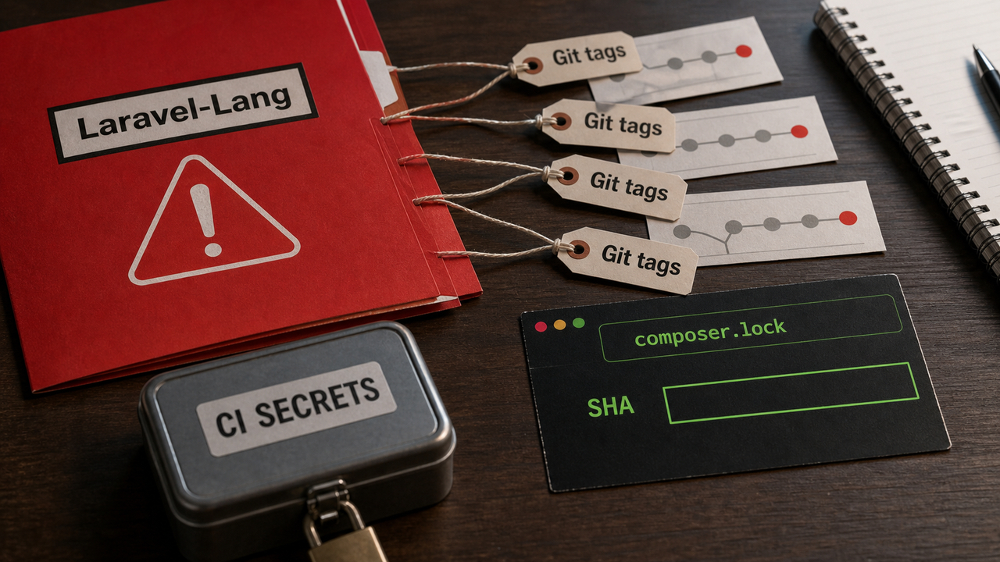

Se você mantém projeto PHP ou Laravel e usa pacotes do Laravel-Lang, este é um daqueles alertas chatos que merecem pausa antes do próximo `composer update`.

Segundo a StepSecurity, em uma publicação de 22 de maio de 2026, um atacante com acesso de push à organização GitHub do Laravel-Lang reescreveu tags de quatro pacotes Composer. A preocupação vai além de uma versão nova ruim: no cenário descrito pela StepSecurity, a própria placa da versão pode ter sido movida para outro commit. Isso muda bastante a triagem.

O resumo curto, atribuído à StepSecurity, é este: se `composer install` ou `composer update` rodou com esses pacotes a partir de 2026-05-22 22:32 UTC, secrets acessíveis àquele processo podem precisar de rotação. Isso vale para CI e também para máquina de desenvolvimento. Não significa que todo app Laravel do planeta foi comprometido. Significa que projetos que dependem desses pacotes precisam olhar o lockfile, os SHAs, os logs e os secrets com calma, mas sem dormir no ponto.

Fonte única deste alerta: [StepSecurity](https://www.stepsecurity.io/blog/laravel-lang-supply-chain-attack).

## Quem é afetado, segundo a StepSecurity

A StepSecurity identifica quatro pacotes do Laravel-Lang no relato:

- `laravel-lang/lang`, com todas as 502 tags reescritas, segundo a StepSecurity.
- `laravel-lang/http-statuses`, com as tags de `v1.0.0` até `v3.4.5` reescritas, segundo a StepSecurity.
- `laravel-lang/actions`, com as 46 tags de `1.0.0` até `1.12.2` reescritas, segundo a StepSecurity.
- `laravel-lang/attributes`, com todas as 86 tags reescritas, segundo a StepSecurity.

O grupo de risco principal, pela orientação da StepSecurity, inclui projetos que dependem de um desses pacotes e rodaram Composer a partir de 2026-05-22 22:32 UTC. Entra aqui `composer update`, instalação nova sem um `composer.lock` confiável, regeneração de lockfile depois do início da janela e qualquer pipeline que tenha resolvido dependência usando as tags afetadas.

Também entram ambientes onde Composer rodou com secrets disponíveis. CI costuma ter token de GitHub, chave de nuvem, credencial de registry, chave de deploy, conexão de banco, segredo de aplicação e outras coisas que a gente coloca lá porque precisa entregar software. Se o processo conseguia enxergar o segredo, a recomendação da StepSecurity é tratar esse segredo como potencialmente exposto quando houve execução afetada.

## Por que tag reescrita é pior que release ruim

Em um incidente comum de pacote, a versão maliciosa costuma aparecer como uma publicação nova. Você vê que a versão `x.y.z` saiu em tal horário, evita aquela versão, volta para uma anterior e segue a vida com um pouco mais de pressão arterial.

O caso descrito pela StepSecurity é mais desagradável porque envolve reescrita de tags Git. Uma tag é o rótulo que aponta para um commit. Se alguém move esse rótulo, duas pessoas podem dizer que estão usando a mesma versão e, ainda assim, não estar no mesmo commit. Bonito para confundir auditoria. Péssimo para responder incidente.

Por isso, segundo a StepSecurity, pin de versão sozinho não basta para esta triagem. O que importa é o commit real que ficou registrado no `composer.lock`, ou uma referência conhecida como boa em clone local, mirror confiável ou fonte equivalente. A pergunta operacional vira: o seu lockfile aponta para um SHA legítimo anterior ao incidente ou para um dos commits impostores listados pela StepSecurity?

A própria StepSecurity diz que os commits maliciosos adicionaram um `src/helpers.php` e ligaram esse arquivo ao `autoload.files` no `composer.json`. Em Composer, isso importa porque `vendor/autoload.php` é carregado cedo por aplicação, testes e scripts. Se o arquivo entrou no autoload, o payload pode executar antes de alguém "usar" conscientemente a biblioteca.

## Por que `composer update` e instalação limpa preocupam

Segundo a StepSecurity, `composer update` é perigoso nesse recorte porque ele resolve versões de novo. Se o projeto usa constraint solta, caret, tilde, wildcard ou qualquer faixa que permita uma versão afetada, o Composer pode acabar travando o lockfile em um tag que, naquele momento, apontava para commit ruim.

Instalação limpa também merece cuidado. Quando não existe um `composer.lock` conhecido como bom, `composer install` pode resolver dependências como uma atualização inicial e gerar um lockfile novo. Segundo a StepSecurity, para esses pacotes, rodar instalação sem lockfile confiável deve ser pausado até conferir SHAs.

O caso mais seguro, ainda segundo a StepSecurity, é o projeto que já tinha um `composer.lock` antes de 2026-05-22 apontando para o commit legítimo. Se esse projeto só roda `composer install` contra esse lockfile conhecido como bom, a StepSecurity trata esse caminho como seguro no artigo. O lockfile não é amuleto. Ele só ajuda quando prende o pacote em um commit anterior e verificado.

Se o `composer.lock` foi regenerado em ou depois de 2026-05-22 22:32 UTC, ou se contém um dos SHAs impostores listados pela StepSecurity, a orientação do artigo é tratar o ambiente como comprometido.

## Janela e indicadores citados

Nos timestamps detalhados da StepSecurity, a janela começa em 2026-05-22 22:32 UTC e vai até 2026-05-23 00:00 UTC. A StepSecurity diz que a sequência começou com `laravel-lang/lang` e terminou com `laravel-lang/actions` dentro desse recorte.

A lista de IOCs publicada pela StepSecurity inclui estes sinais.

Sinais de rede:

- Requisição HTTPS para `flipboxstudio.info/payload`.
- Requisição HTTPS para `flipboxstudio.info/exfil`.
- A StepSecurity identifica `flipboxstudio.info` como typosquat de `flipboxstudio.com`.

Sinais de arquivo:

- Arquivo PHP temporário no padrão `/tmp/.laravel_locale/<12 caracteres hex>.php`.
- Binário temporário no padrão `/tmp/.<8 caracteres hex>`, sem extensão.
- Artefatos temporários que podem se apagar em segundos, segundo a observação da StepSecurity.

Sinais de processo:

- Processo PHP órfão com PPID 1.
- Processo ELF órfão, sem nome claro, com PPID 1.
- Execução a partir de caminhos apagados em `/tmp`.

Sinais em Git e no pacote:

- Commits com autor `Your Name <you@example.com>`.
- Timestamps suspeitos entre 2026-05-22 22:32 UTC e 2026-05-23 00:00 UTC.
- Mudanças apenas em `composer.json` e `src/helpers.php`, como relatado pela StepSecurity.
- Entrada nova de `autoload.files` carregando `src/helpers.php`.

## Checklist de triagem e recuperação

Para consumidores dos pacotes, a sequência prática, baseada na orientação da StepSecurity, fica assim:

1. Pare `composer update` nos projetos que dependem de `laravel-lang/lang`, `laravel-lang/http-statuses`, `laravel-lang/actions` ou `laravel-lang/attributes` até conferir lockfile e SHAs.
2. Pare `composer install` em instalação nova ou ambiente sem `composer.lock` conhecido como bom.
3. Abra o `composer.lock` e procure esses quatro pacotes.
4. Compare o SHA travado no lockfile com os commits impostores listados pela StepSecurity e com um commit legítimo anterior ao incidente, vindo de clone local, mirror confiável ou outra referência que você já controlava antes.
5. Se o lockfile foi regenerado em ou depois de 2026-05-22 22:32 UTC, trate o ambiente como suspeito, segundo a StepSecurity.
6. Se Composer rodou a partir de 2026-05-22 22:32 UTC com um dos pacotes afetados, audite o runner, a máquina de desenvolvimento e os logs de rede usando os IOCs acima.
7. Bloqueie ou sinkhole `flipboxstudio.info` na saída de rede quando isso couber no seu ambiente.

Na parte de secrets, a recomendação da StepSecurity deve ser lida com uma palavra importante: acessíveis. Não é para rotacionar o universo inteiro por reflexo. É para levantar o que aquele job, runner ou terminal conseguia ler no momento em que Composer rodou.

Se houve exposição possível, revise e rotacione tokens de CI, credenciais de nuvem, tokens ou PATs do GitHub, credenciais de registry, chaves de deploy, credenciais de banco e secrets de aplicação. Depois olhe logs de uso desses secrets, porque trocar a chave sem conferir uso recente é apagar a luz e fingir que arrumou a fiação.

Para mantenedores, a StepSecurity recomenda restaurar as tags para os commits originais, recuperar SHAs legítimos por Packagist dist mirror, clones locais ou outras fontes conhecidas como boas, auditar contas GitHub, GitHub Apps, deploy keys e PATs com acesso de push, revogar e rotacionar credenciais suspeitas, reforçar 2FA e avisar o Packagist depois da restauração.

## Caveats importantes

A StepSecurity detonou `laravel-lang/http-statuses` `v3.4.5` em um runner isolado do GitHub Actions usando Harden-Runner em modo de auditoria. Nesse teste, segundo a StepSecurity, carregar o autoload do Composer foi seguido por chamada para `flipboxstudio.info/payload`, processos PHP e ELF órfãos, chamada para `flipboxstudio.info/exfil` e limpeza rápida dos artefatos temporários.

Para os outros três pacotes, a própria StepSecurity apresenta o caveat: ela espera comportamento semelhante porque encontrou estrutura maliciosa e comportamento de payload equivalentes por análise de fonte, mas o artigo destaca a detonação específica de `http-statuses` `v3.4.5`. Então evite transformar isso em afirmação independente de que todos os ambientes exfiltraram dados. O correto, pelo relato da StepSecurity, é tratar como risco de exposição quando Composer rodou nos cenários descritos.

Outro limite: a StepSecurity diz que observou comportamento consistente com roubo de credenciais, mas o artigo não mostra o corpo exato da requisição de exfiltração. Por isso este alerta fala em secrets potencialmente expostos, não em lista confirmada de tudo que saiu de cada ambiente.

E tem um último detalhe editorial importante. Este texto usa só a publicação da StepSecurity de 22 de maio de 2026 como fonte. Ele não afirma o estado atual dos tags, do Packagist ou da organização Laravel-Lang depois dessa publicação. Para triagem imediata, o suficiente agora é conferir `composer.lock`, comparar SHAs com a lista da StepSecurity, auditar IOCs e rotacionar secrets acessíveis quando houver exposição possível.

Fonte: [StepSecurity](https://www.stepsecurity.io/blog/laravel-lang-supply-chain-attack).

> Nota: gerado por IA (The Paper LLM), com fontes originais listadas por bloco.

<!--
briefing_slug: 2026-05-23-laravel-lang-supply-chain
generated_at: 2026-05-23T00:18:11-03:00
source_urls:
  - https://www.stepsecurity.io/blog/laravel-lang-supply-chain-attack
omitted_briefing_items:
  - Normal briefing omitted by explicit user override; single-source emergency public-service post.
-->
