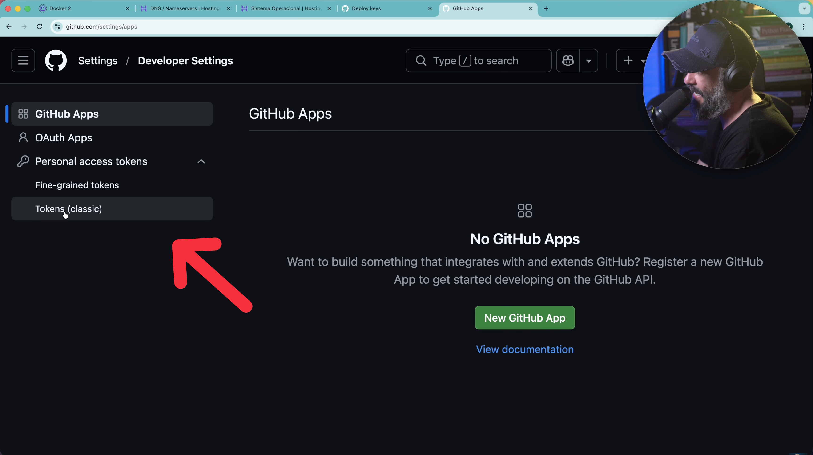
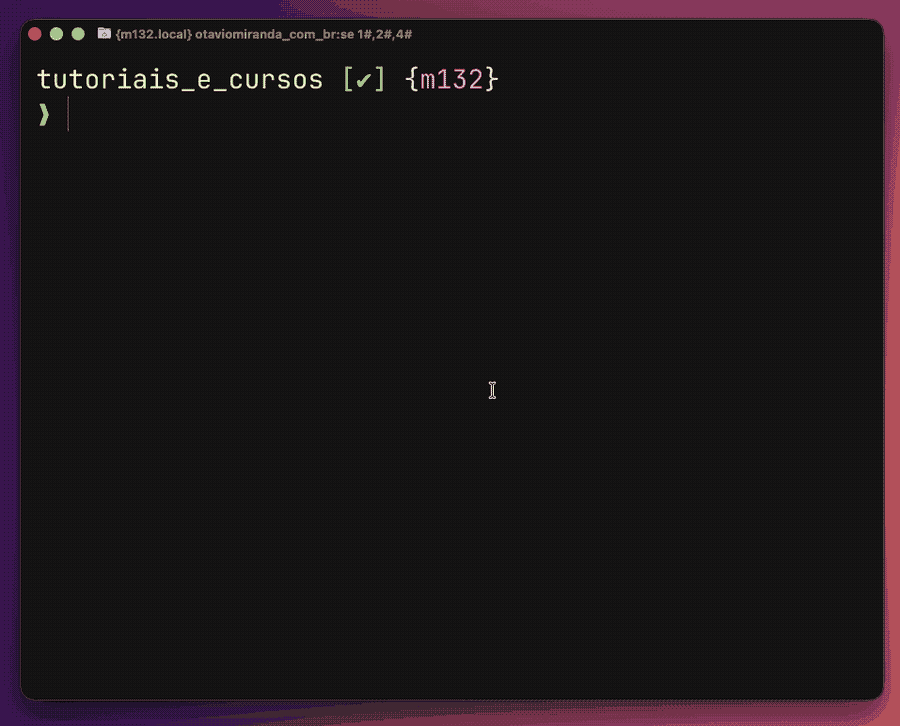

O pacote `litellm` versões **1.82.7 e 1.82.8** foram comprometidos com um
credential stealer sofisticado. Basicamente, foi um script escondido atrás de
`base64` que rouba qualquer chave secreta no seu computador. Senhas, `.env`,
credenciais em geral, `authentication tokens`, chaves SSH e qualquer outra coisa
que você nem imaginaria que estivesse em arquivo de texto no seu computador
(como as próprias credenciais dos modelos de LLM que você usa).

Se você trabalha com IA em Python, ou usa qualquer ferramenta que depende de
litellm por baixo dos panos, esse texto é pra você.

Referência da issue inicial:
[https://github.com/BerriAI/litellm/issues/24512](https://github.com/BerriAI/litellm/issues/24512)

> **Observação**: ainda estou escrevendo este conteúdo. Só estou
> disponibilizando os comandos primeiro pelo fato do caso ser urgente.

---

## O que aconteceu?

No dia 24 de março de 2026, hackers publicaram duas versões maliciosas do
`litellm` diretamente no PyPI. Não foi invasão ao repositório do GitHub. Não foi
PR malicioso que passou despercebido. Eles simplesmente... **publicaram o pacote
no lugar do time oficial**, usando credenciais roubadas. 🤔

O `litellm` não é uma biblioteca qualquer. Eu não o usava diretamente, mas estou
descobrindo como funciona enquanto escrevo este texto.

Ele é a camada que traduz e roteia chamadas pra mais de 100 provedores de LLM
(OpenAI, Anthropic, Google, AWS Bedrock, etc.) numa interface única.

Uma comparação mais familiar para mim seria com o LangChain. Porém, enquanto
LangChain é o framework que orquestra os agentes de IA, o `litellm` é a camada
que fica embaixo dele traduzindo essas chamadas pra cada provedor. Inclusive,
parece que o LangChain usa o `litellm` por baixo dos panos em alguns fluxos.

Aquela busca rápida no Google já me entregou o código abaixo sem eu olhar nenhum
site. É aquele tipo de amigo que te empurra na piscina, quando você não sabe
nadar, pra te ajudar a perder o medo (tô brincando, viu? haha).

```python
# Example Usage
from langchain_litellm import ChatLiteLLM

llm = ChatLiteLLM(model="gpt-4.1-nano", temperature=0.1)
# or using other providers
# llm = ChatLiteLLM(model="bedrock/amazon.titan-embed-text-v1")
```

Sério agora, é o tipo de biblioteca invisível que você nem sabe que está usando,
até que ela é comprometida.

O pacote tem algo em torno de 95 a 97 milhões de downloads por mês. É o motor
invisível de boa parte do ecossistema de IA em Python.

Quando um pacote desse tamanho é comprometido, o impacto não é local apenas.

Para você ter uma ideia, as versões maliciosas ficaram no ar por poucas horas,
mas isso foi suficiente pra ~47.000 downloads acontecerem. E não, nem todo mundo
que foi afetado instalou o `litellm` diretamente. Mas a gente chega nisso.

---

## Como os hackers conseguiram publicar no PyPI?

A doideira deste ataque é super interessante, mas assustadora ao mesmo tempo.

Não começou no `litellm`. Começou no **[Trivy](https://trivy.dev/)**. Ele é um
scanner de vulnerabilidades open-source mantido pela **Aqua Security**. É
exatamente a ferramenta que deveria estar te protegendo.

No final de fevereiro, um bot automatizado chamado `hackerbot-claw` explorou um
[workflow `pull_request_target` no GitHub Actions](https://docs.github.com/pt/actions/reference/workflows-and-actions/events-that-trigger-workflows#pull_request_target)
do Trivy e roubou um Personal Access Token (PAT). Já usamos esse tipo de token
em vídeos do canal.

[](https://youtu.be/yxxEk68EDgo?t=1140&si=i6cBZGyNZupEGYDt)

A Aqua Security percebeu e tentou revogar... mas a rotação de credenciais foi
incompleta. Justo uma empresa de segurança, trancou todas as portas, ligou o
alarme, mas deixou a janela aberta. Não me pergunte 😅.

No dia 19 de março, o grupo (conhecido como **TeamPCP**) voltou com as
credenciais que sobraram e comprometeu o Trivy de vez. Publicaram um binário
infectado e forçaram commits maliciosos em 75 das 76 tags do `trivy-action` no
GitHub. Ou seja: qualquer pipeline que rodasse com
`uses: aquasecurity/trivy-action` sem travar numa versão específica passou a
executar código malicioso.

Lembrando que a maioria das pessoas usa "tags" para travar a versão, mas tags
não são imutáveis, apenas os hashes.

> Nota para o eu do futuro: Deixe de preguiça e use o SHA do commit ao invés de
> tag para garantir imutabilidade.

O que esse código malicioso fazia? Vasculhava as variáveis de ambiente do runner
em busca dos secrets. E o CI/CD do `litellm` rodava o Trivy pra fazer scan de
segurança sem travar a versão. O malware encontrou o `PYPI_PUBLISH` token e
mandou pro servidor dos atacantes.

Cinco dias depois, com o token em mãos, o **TeamPCP** publicou as versões
`1.82.7` e `1.82.8` direto no [PyPI](https://pypi.org/). Sem tocar no GitHub.
Sem PR. Sem nenhum rastro no repositório público.

Esse é o tipo de coisa que faz você parar um segundo: será que toda dependência
que você adiciona vale a exposição? No caso do `litellm`, você realmente vai
usar os mais de 100 provedores? Ou vai só chamar a **OpenAI** mesmo?

---

## O truque do `.pth`: por que a versão 1.82.8 é diferente

A versão 1.82.7 já fazia algum estrago. Ela tinha código malicioso embutido em
`litellm/proxy/proxy_server.py`, mas só executava se você importasse o módulo
proxy no seu código. Dava pra ter sorte se você não usasse isso.

A versão **1.82.8**, publicada **13 minutos depois**, não te perdoaria.

Ela incluiu um arquivo chamado `litellm_init.pth` dentro do wheel. E aqui entra
um mecanismo do Python que muita gente não conhece.

Toda vez que o Python inicia (qualquer invocação, qualquer contexto) ele passa
pela pasta `site-packages` e lê todos os arquivos `.pth` que encontrar.

Normalmente esses arquivos só adicionam caminhos ao `sys.path`. Mas **se uma
linha começar com `import`, o Python executa ela como código nativo**. Sem pedir
permissão. Sem precisar que você escreva `import litellm` em lugar nenhum.

O resultado disso é que o payload do **TeamPCP** rodava em vários cenários:

- Quando você abria um Jupyter notebook
- Quando o `pytest` iniciava
- Quando o Language Server da sua IDE ligava
- Quando você rodava qualquer script Python no ambiente
- **Durante o próprio `pip install`**, porque o pip invoca Python

E o arquivo `litellm_init.pth` estava corretamente declarado no manifesto do
wheel com hash `SHA-256` válido. Ferramentas tradicionais de supply chain
scanning não sinalizaram nada.

O que salvou a situação foi um bug dos próprios hackers. O `.pth` spawna um
processo Python pra executar o payload.

Esse processo filho também inicia o Python... que lê o `.pth`... que spawna
outro filho... que lê o `.pth`... Já viu, né? Loop, fork bomb e a memória RAM da
turma começou a ser jantada pelos processos.

A pessoa vai verificar... Puxa um fio daqui, outro dali... E abre uma
[issue dessas](https://github.com/BerriAI/litellm/issues/24512). Cá entre nós,
já pensou receber uma dessas?

Se eles não tivessem cometido esse erro, o malware poderia ter ficado rodando em
silêncio por dias.

---

## O que o malware coletava

Uma vez rodando, o script vasculhava tudo que encontrava:

- **Variáveis de ambiente**: onde ficam `OPENAI_API_KEY`, `ANTHROPIC_API_KEY`,
  tokens de CI/CD e afins
- **Chaves SSH** (`~/.ssh/`): par de chaves inteiro, `known_hosts`
- **Credenciais de cloud**: `~/.aws/credentials`, `~/.azure/`, arquivos GCP;
  também consultava o IMDS da AWS pra pegar tokens temporários de alta permissão
- **Kubernetes**: `~/.kube/config` e todos os segredos de todos os namespaces do
  cluster
- **Docker**: `~/.docker/config.json`
- **Carteiras de criptomoedas**: Bitcoin, Ethereum, Solana e mais sete
- **Histórico do terminal**: bash e zsh; sim, porque tem gente que digita senha
  por acidente no prompt e o histórico guarda
- **Banco de dados**: strings de conexão pra PostgreSQL, MySQL, Redis, MongoDB
- **Arquivos `.env`** recursivamente até 6 diretórios de profundidade

E olha só. Os atacantes se preocuparam com a sua privacidade. Eles
criptografavam seus dados roubados com **AES-256-CBC** e empacotavam com uma
chave `RSA-4096` embutida no código (pra que ninguém interceptasse a chave AES
no meio do caminho).

O pacote `tpcp.tar.gz` ia via `POST` pra `https://models.litellm.cloud/`,
domínio falso, registrado horas antes, feito pra parecer tráfego legítimo da
biblioteca nos logs.

E se detectasse um cluster **Kubernetes** acessível, iam além: criavam pods
privilegiados em cada nó do cluster, montavam o sistema de arquivos do host e
instalavam um backdoor persistente. Mesmo que você deletasse o `litellm`, a
porta dos fundos continuava aberta.

---

## Por que CrewAI, DSPy, MLflow e outros foram afetados

Você pode nunca ter escrito `pip install litellm` na sua vida e ainda assim ter
sido afetado. O que foi o meu caso. Mas, já te mostro os comandos que rodei
aqui.

Se você instala o `CrewAI`, e o `CrewAI` depende do `litellm`. Se o arquivo de
dependências do `CrewAI` dizia `litellm>=1.80`, sem travar numa versão
específica, o pip simplesmente pega a versão mais nova disponível no momento.
Que, no momento, era a `1.82.8`.

Análise dos dados do PyPI mostrou que **88% dos ~2.337 pacotes que dependem do
`litellm`** usavam especificações soltas assim.

Ao fazer uma instalação limpa do `CrewAI`, `DSPy`, `MLflow`, `GraphRAG` ou
outros que usam `litellm` na manhã do dia 24 de março de 2026, baixava o malware
automaticamente, sem nenhum aviso.

É o que a galera de segurança chama de **dependência transitiva**. Você não
instalou o problema. Mas o problema veio junto com o que você instalou.

---

## Como verificar se você foi afetado

Aqui vai o passo a passo. Se todos os comandos voltarem vazios ou com erro de
import, você está limpo.

**IMPORTANTE**: rode os comandos em uma pasta acima de onde estão seus pacotes
(ou na pasta onde eles estão).

Aqui vai um exemplo de um dos comandos sendo executado, mas buscando por
`llms.py` (só pra encontrar algo):



Se o seu aparecer algo similar a isso, verifique qual a versão do `litellm` está
usando.

**Verificar instalação global via pip**

```bash
pip list 2>/dev/null | grep -i litellm
pip3 list 2>/dev/null | grep -i litellm
```

**Verificar via import direto**

```bash
python3 -c "import litellm; print(litellm.__version__, litellm.__file__)"
```

**Verificar via uv (se usar)**

```bash
uv pip list 2>/dev/null | grep -i litellm
```

**Varrer todos os ambientes virtuais em `.venv`**

```bash
find . -path "*/.venv/*/site-packages/litellm*" 2>/dev/null
```

**Buscar em arquivos de dependência**

```bash
grep -ri "litellm" --include="requirements*.txt" \
                   --include="pyproject.toml" \
                   --include="uv.lock" \
                   --include="poetry.lock" \
                   --include="Pipfile*" \
                   --include="setup.py" \
                   --include="setup.cfg" .
```

**Buscar imports no código-fonte**

```bash
grep -rE --include="*.py" -l "import litellm|from litellm" . \
  | grep -v ".venv" | grep -v "__pycache__"
```

**Buscar o arquivo `.pth` malicioso**

Esse é o mais importante. Se existir, a máquina está comprometida.

```bash
find / -name "litellm_init.pth" 2>/dev/null
```

Pra varrer só dentro dos seus `.venv`:

```bash
find . -type d -name ".venv" -exec find {} -name "litellm_init.pth" \;
```

Se usar `uv`, o cache dele também precisa ser checado:

```bash
find ~/.cache/uv -name "litellm_init.pth"
```

---

## O que fazer se encontrou algo

Encontrou o `.pth` ou a versão `1.82.7` ou `1.82.8` instalada? A postura correta
agora é assumir que tudo que estava no ambiente foi vazado. Não é pessimismo, é
o protocolo segurança de verdade.

Vamos ter que rotacionar tudo.

**Limpe o ambiente e o cache**

Deletar o pacote não é suficiente. O pip (e o `uv`) têm cache em disco, e na
próxima instalação podem reaproveitar o wheel contaminado:

```bash
# pip
pip uninstall litellm -y
pip cache purge

# uv
uv cache clean
rm -rf ~/.cache/uv
```

**Verifique persistência no sistema**

Se o script rodou no seu ambiente, pode ter instalado um backdoor:

```bash
ls ~/.config/sysmon/sysmon.py
ls ~/.config/systemd/user/sysmon.service
```

Se encontrar qualquer um dos dois: delete e reinicie o serviço do `systemd` do
usuário.

Pra quem usa `Kubernetes`:

```bash
kubectl get pods -n kube-system | grep "node-setup"
```

Qualquer pod com esse nome usando imagem Alpine precisa ser removido
imediatamente.

> **Observação:** pedi ajuda para LLMs (3 diferentes) para pontos que não
> conheço muito bem, como **Azure**, **ClaudTrail**, etc.

**Rotacione credenciais (por ordem de prioridade)**

- **Tokens de CI/CD primeiro:** (GitHub Actions, GitLab CI, CircleCI, PyPI,
  Docker Hub). Se vazar um token de publicação, o atacante passa a ser você
- **Cloud (AWS/GCP/Azure):** access keys, service accounts, roles; consulte os
  logs de auditoria (CloudTrail na AWS) pra ver se já usaram as credenciais
- **Chaves SSH:** gere um novo par (preferencialmente Ed25519), remova as chaves
  antigas do GitHub/GitLab/Bitbucket
- **API keys de LLM:** OpenAI, Anthropic, Google, qualquer provedor que estava
  em variável de ambiente
- **Tudo que estava em `.env`:** DB passwords, webhooks, tokens de integração

---

## Como se proteger daqui pra frente

O que protegeu quem não foi afetado? Basicamente uma coisa: **lockfile**.

Projetos usando `poetry.lock` ou `uv.lock` com versões travadas ficaram
completamente imunes.

A versão maliciosa nunca foi resolvida porque a versão exata já estava definida
no `lockfile`. Este foi um caso de estudos interessante.

Se eu não atualizei nada, nem instalei nada do zero, o que será instalado será o
que está no `lockfile`. Claro que temos alguns hábitos ruins: talvez pudéssemos
travar a versão de forma mais específica nos nossos `pyproject.toml`.

Você não quer a versão mais nova possível, você quer a versão que está
disponível agora.

Falando em "agora", vou deixar algumas práticas que já sigo e outras que vou
passar a seguir a partir de agora (eu acho 😅).

**Trave versões das suas dependências**

Em vez de `litellm>=1.80`, porque não usar `litellm==1.82.6`? Vale pra qualquer
dependência, não só o `litellm`.

**Use `lockfile`**

`uv lock`, `poetry lock`, `pip-compile`. Você commita o `lockfile` junto com o
código, e qualquer instalação futura (local, CI, Docker) usa exatamente as
mesmas versões.

**Escopo de segredos no CI/CD**

O token `PYPI_PUBLISH` que foi roubado estava disponível pra toda a pipeline, o
tempo todo.

Para nós, a lição é deixá-las disponíveis apenas nas etapas que precisam
usá-las. Não como variável de ambiente global disponível pra qualquer step,
incluindo steps de terceiros como scanners.

Também use o
["princípio do menor privilégio"](https://www.paloaltonetworks.com/cyberpedia/what-is-the-principle-of-least-privilege)
com chaves e segredos. Se algo precisa ler, não precisa da permissão de
escrever.

**Trave ferramentas externas por commit SHA**

No GitHub Actions, `uses: aquasecurity/trivy-action@v0.20.0` não é seguro. O
correto seria `uses: aquasecurity/trivy-action@COMMIT_SHA_AQUI`. Tag pode ser
reescrita (foi exatamente o que o **TeamPCP** fez). `SHA` não.

---

## Fim

Esse incidente é uma prova de que "o repositório está limpo no GitHub" não é
garantia de nada se as credenciais de publicação forem roubadas. O vetor de
ataque foi o CI/CD, não o código.

A versão segura é qualquer uma **até a 1.82.6**. Vi algumas pessoas falando de
versões abaixo, mas não consegui confirmar isso. Se você atualizou o `litellm`
(direto ou indiretamente) no dia 24 de março de 2026, vale rodar os comandos
acima pra checar.

Qualquer dúvida, comenta aí. Vou ver se faço um vídeo mais detalhado sobre isso
em breve.

Valeu. Até o próximo.
