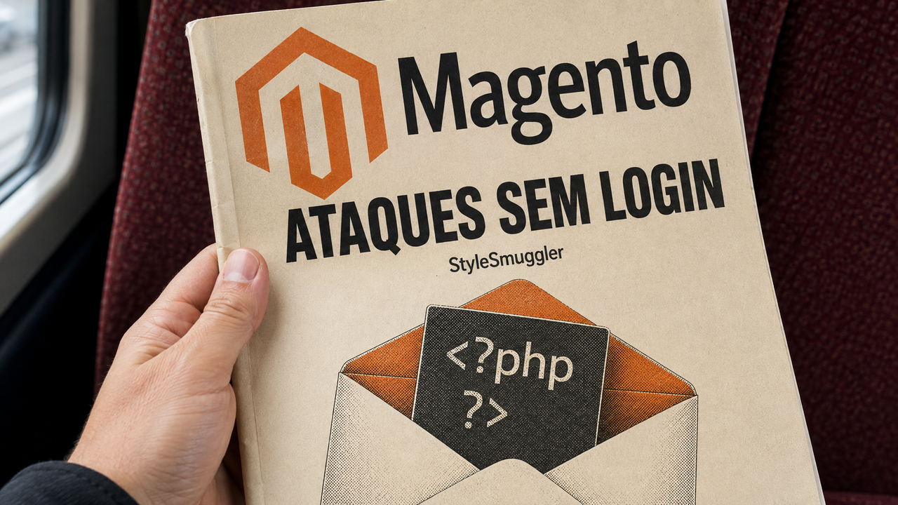

O Magento prepara um aviso de pagamento que falhou e, enquanto monta a mensagem, executa código do invasor. Ninguém precisa abrir o email. Segundo a Sansec, a cadeia chamada StyleSmuggler está sendo explorada desde 4 de setembro e ainda não tinha patch oficial identificado na apuração. Se você cuida de uma dessas lojas, é hora de interromper o café e conferir a exposição. O email pode nem chegar. O invasor já conseguiu executar código no servidor.

## StyleSmuggler usa a renderização de email para executar código

A Sansec divulgou em 5 de setembro uma cadeia de execução remota sem autenticação no Magento. Primeiro, o atacante consegue gravar código PHP em um arquivo produzido pela própria aplicação. Depois, faz o sistema de templates processar esse conteúdo pelo caminho do lembrete de transação de pagamento malsucedida, chamado Payment Transaction Failed Reminder.

O sistema acaba tratando conteúdo armazenado como código executável. O gatilho é a renderização no servidor, inclusive quando o envio do email falha. Por isso, a investigação precisa olhar para esse processamento: o ataque funciona sem participação do destinatário.

A Sansec reproduziu a cadeia completa em instalações limpas do Magento Open Source 2.4.7, 2.4.8 e 2.4.9. A primeira vítima descrita usava a 2.4.6-p15, com os patches de julho e agosto aplicados. Até a verificação de status dos patches estava limpa. A tela verde estava certa sobre as correções conhecidas. O problema era o que ainda não tinha entrado na lista.

A empresa diz que o alcance é maior e inclui versões atuais de Adobe Commerce. A reprodução publicada, porém, cobre as versões nomeadas do Magento Open Source. O índice oficial da Adobe consultado ainda terminava no boletim de 11 de agosto, sem confirmar esse escopo maior. Também não havia garantia de que a atualização prevista para 8 de setembro, citada pela Sansec, incluiria a correção.

Os ataques já aparecem fora do laboratório. A Disrex publicou observações próprias de resposta a incidente, com tráfego capturado em uma loja comprometida em 5 de setembro e análise do código daquela instalação. O total de lojas atingidas e a autoria da campanha continuam desconhecidos. Encontrar um implante exige resposta, mas, por si só, não comprova roubo de cartões ou exfiltração em cada vítima.

Se você opera Magento, a prioridade é reduzir a exposição e investigar o que já aconteceu. A Sansec recomenda desabilitar temporariamente GraphQL para quem não usa seu produto Shield. Só que essa API sustenta lojas com frontend separado e aplicações web progressivas. Desligá-la pode interromper esses ambientes, como a Disrex explicou ao The Hacker News. Antes de mexer, confira o que a sua loja precisa dela para fazer.

Os snippets comunitários da Disrex também pedem cuidado. O próprio repositório avisa que não passaram por revisão, que as regras de Apache não foram testadas ao vivo e que o guard foi exercitado num ambiente de teste, não numa loja em execução. Os autores orientam procurar comprometimento antes de aplicar os trechos e validá-los em staging. Copiar uma mitigação do GitHub continua sendo uma mudança de produção, mesmo quando o README está tentando salvar seu domingo.

Na investigação, olhe além do diretório público da loja. A Sansec descreve um processo disfarçado de `[kworker/u:8:0]`, um arquivo sob a home do usuário em `~/.local/share/.gvfsd/gvfsd-user` e persistência por cron. São pistas para investigar; a ausência delas não atesta integridade. Um scanner limitado ao web root pode passar longe do lugar onde o implante está morando.

Preserve evidências e, se encontrar comprometimento, combine contenção com rotação das credenciais expostas. A Sansec destaca as credenciais Magento quando o processo suspeito aparece. Bloquear novas requisições ainda deixa a persistência instalada para a equipe resolver. Estar com o patch de agosto em dia e esperar pelo próximo boletim não dá conta dessa exposição.

Fontes: [Sansec — StyleSmuggler](https://sansec.io/research/stylesmuggler), [Disrex — observações e mitigações comunitárias](https://github.com/disrex-group/stylesmuggler-mitigation), [índice de segurança do Adobe Commerce](https://helpx.adobe.com/security/products/magento.html) e [The Hacker News — impacto da mitigação em lojas que dependem de GraphQL](https://thehackernews.com/2026/09/unpatched-magento-and-adobe-commerce.html).

## Beyond ORMs troca acesso genérico por operações da aplicação

Você precisa remover alguns registros e devolver os dados removidos. O código busca os objetos, percorre a coleção e apaga um por um. Parece uma operação pequena, até você olhar o que chegou ao banco: uma consulta de leitura seguida de uma deleção para cada objeto. A mesma intenção, paga em várias prestações.

Esse é o ponto de partida de *Beyond ORMs*, ensaio publicado em 5 de setembro pelo autor do Extralite. Um ORM faz a ponte entre tabelas relacionais e objetos da linguagem. O texto propõe partir das operações de que a aplicação precisa e criar uma interface pequena para elas, com o SQL guardado atrás dessa interface.

No exemplo, trocar o loop por `delete_all` já reduz o caminho a duas consultas: uma para buscar e outra para apagar. O próprio autor reconhece essa alternativa. Depois, ele usa uma instrução de deleção com `RETURNING`, que devolve os registros removidos na mesma operação.

O PostgreSQL também documenta esse recurso. No `DELETE`, o retorno expõe por padrão o conteúdo da linha removida e evita uma consulta adicional para recuperar esses dados. A novidade é o ensaio e a discussão de design. O banco não aprendeu a devolver linhas ontem.

A conta do exemplo fica assim: uma consulta mais N deleções, depois duas consultas e, por fim, uma instrução. Dá para conferir a redução de operações olhando o código. O texto não traz benchmark para transformar essa contagem em ganho de velocidade.

A parte que eu mais aproveitaria vem depois do SQL. O autor monta um `PostsStore` que recebe uma conexão e oferece operações como buscar um post por identificador ou listar posts com seus autores. Por dentro, pode manter joins e consultas envolvendo várias tabelas. Para o restante do programa, entrega hashes comuns do Ruby, estruturas de chave e valor.

Quem usa o store pede uma operação com significado para a aplicação. Os detalhes da consulta ficam lá dentro. No desenho apresentado, quem não recebe essa interface não usa esse caminho de acesso ao banco. A conexão deixa de ser um controle remoto universal distribuído pela casa, inclusive para quem só queria acender a luz da cozinha.

Você também consegue reunir o SQL de uma operação em um lugar sem criar uma classe de entidade para cada tipo de linha. Na revisão, dá para perguntar: quais consultas esta ação pode disparar, e por onde ela chega ao banco? Pelo menos essa conversa tem código para conferir. A discussão sobre se todo ORM presta ou nenhum presta pode esperar mais um pouco.

O ensaio não compara sistematicamente as capacidades dos ORMs. O cache automático de statements que ele menciona para o Extralite também ainda não estava lançado nem tinha benchmark. A proposta de interface pode ser aproveitada por conta própria, sem depender dessa promessa de desempenho.

No seu projeto, eu começaria por uma operação cujo acesso ao banco esteja difícil de acompanhar. Conte as consultas, identifique quem recebe a conexão e veja se um método com nome claro consegue esconder o trabalho inteiro. Isso cabe numa revisão localizada, sem abrir uma migração geral de persistência só porque um `DELETE` finalmente voltou com o recibo.

Fontes: [Noteflakes — Beyond ORMs](https://noteflakes.com/articles/2026-09-05-beyond-orms) e [PostgreSQL — retorno de dados em instruções de modificação](https://www.postgresql.org/docs/current/dml-returning.html).

## Cloud in a Bottle integra apps e mostra o que cada um pode acessar

Você sobe suas aplicações pessoais numa VPS e logo aparece outra parte do trabalho: fazer os apps compartilharem login e usarem capacidades uns dos outros. Zack Polizzi, da Imbue, anunciou em 5 de setembro o Cloud in a Bottle para cuidar dessa integração. Segundo ele, o lançamento veio depois de mais de seis meses de desenvolvimento e testes privados.

A plataforma usa uma máquina Ubuntu, um servidor web que encaminha HTTP e HTTPS e aplicações em containers rootless. Nesse modelo, o runtime opera com privilégios reduzidos no host. O login da instância pode servir aos apps, e APIs habilitadas explicitamente permitem acesso autorizado a capacidades de outras aplicações.

O projeto tem licença AGPL-3.0 e pode ser hospedado por você. Há também um serviço gerenciado que, segundo o anúncio, usa o mesmo código. O catálogo inicial ainda é pequeno; o autor reconhece que os primeiros usuários podem precisar adaptar ou criar apps com alguma familiaridade técnica. É para quem aceita mexer na própria nuvem, mas gostaria de receber parte do encanamento montada.

A documentação dá um lugar concreto para conferir a instalação: o arquivo `cloudinabottle.toml`, na raiz do repositório de cada app. Ali ficam o Dockerfile, a porta HTTP, recursos e permissões. Antes de instalar, eu olharia especialmente o que fica fora da proteção do login e quais dados entram no container.

O campo `public_paths` libera prefixos de caminho sem autenticação. Os mapeamentos extras de portas em `[[ports]]` ligam TCP e UDP do container ao host em `0.0.0.0`: todas as interfaces, não só o acesso local. Esses mapeamentos nem são necessários para o roteamento HTTP e HTTPS comum da plataforma. Você os adiciona quando quer essa exposição extra; o login unificado não se estende automaticamente a todo protocolo colocado ali.

Há uma permissão ainda mais abrangente. `access_all_app_data` vem desativada. Quando ligada, monta com leitura e escrita os diretórios permanentes, temporários e de arquivo de todos os apps. O nome avisa bastante. A caixinha “acessar todos os dados” tem a delicadeza de fazer exatamente o que diz.

Rootless cuida dos privilégios do runtime no host. Quem autoriza esse acesso amplo entre aplicações é o manifesto, onde você precisa conferir se o app realmente necessita dos dados dos vizinhos. As fontes descrevem a arquitetura, mas não trazem uma auditoria independente que permita prometer isolamento absoluto.

O armazenamento tem outro detalhe que merece atenção: os dados temporários em `app_temp_data` sobrevivem a reinicializações, mas ficam fora de backups e migrações. Você pode ver o arquivo voltar depois de um restart e ainda assim ficar sem ele na restauração. “Ainda está no disco” e “foi incluído no backup” são respostas diferentes. A gente costuma lembrar de perguntar as duas juntas no pior momento.

A proposta reúne instalação, autenticação e integração. Se for experimentar, revise caminhos públicos, portas extras e acesso aos dados antes de entregar recursos ao app. O manifesto deixa essas escolhas à vista. Melhor ler a permissão ali do que aprender seu significado pelo efeito.

Fontes: [Cloud in a Bottle — anúncio de lançamento](https://cloudinabottle.org/blog/launch-post) e [especificação do manifesto de aplicações](https://cloudinabottle.org/docs/creating_an_app/manifest_spec.html).

## Destaques rápidos para hoje.

- **O Asahi Linux incorporou os Macs M3 ao instalador em 6 de setembro, ainda em Expert mode.** [Em 27 de agosto, o suporte estava em preparação](/2026/agentes-invadem-hugging-face-skills-envenenam-skills-e-asahi-chega-perto-do-m3/); agora você pode experimentar nos MacBooks e iMacs com M3, M3 Pro ou M3 Max, conforme o modelo. O Mac Studio com M3 Ultra fica de fora. Wi-Fi e decodificação de vídeo por hardware, inclusive AV1, funcionam, mas faltam aceleração 3D adequada, suspensão e HDMI nos MacBooks equipados com essa saída. Já dá para instalar; no uso diário, essas ausências ainda pesam. Fonte: [Asahi Linux — suporte ao M3](https://asahilinux.org/2026/09/m2-episode-1/).

- **Workstation e Fusion receberam correção para duas rotas de execução do guest para o host.** O advisory da Broadcom é de 3 de setembro: quem usa 25H2 ou 26H1 deve instalar 26H1u1. As duas falhas exigem um atacante com administração local dentro da VM; a CVE-2026-59346 também depende do adaptador de rede VMXNET3. A CVE-2026-59347 passa pelo serviço de arquivos compartilhados HGFS e pode executar código como o processo VMX no host. O boletim não lista workaround nem declara exploração ativa. Se seu laboratório recebe máquinas virtuais menos confiáveis, priorize o patch. Fonte: [Broadcom — VMSA-2026-0007](https://support.broadcom.com/web/ecx/support-content-notification/-/external/content/SecurityAdvisories/0/38288).

- **Cinco segundos de consulta podem conter só meio segundo de CPU do backend.** Christophe Pettus mostrou esse caso em 5 de setembro usando contadores já existentes do PostgreSQL. `log_statement_stats` mede a instrução inteira e não pode ser ligado junto dos contadores por etapa; eles vêm desligados e exigem superusuário ou privilégio de configuração apropriado. O autor recomenda ligar brevemente para diagnóstico e desligar depois. A medida deixa de fora a CPU dos workers paralelos, e o pico de memória residente é histórico do processo, não consumo da query. A diferença entre CPU e relógio ajuda a orientar a investigação; sozinha, não identifica a causa da espera. Fontes: [análise de Christophe Pettus](https://thebuild.com/blog/all-your-gucs-in-a-row-log_parser_stats-log_planner_stats-log_executor_stats-and-log_statement_stats/) e [documentação de estatísticas do PostgreSQL](https://www.postgresql.org/docs/current/runtime-config-statistics.html).

- **Um PR experimental propõe guardar parte do KV cache na RAM para aliviar a VRAM.** Esse cache mantém o estado de atenção dos tokens já processados. Aberto em 6 de setembro no fork TheTom/llama-cpp-turboquant, o PR #357 limita uma alocação CUDA compartilhada entre páginas residentes e espaço de trabalho ativo, trazendo o restante do cache da RAM conforme necessário. A proposta vem desligada por padrão, aceita uma sequência por execução e teve o suporte a DeepSeek-V4 revertido por uma regressão de correção. Ainda é um PR aberto de um fork, não um release do llama.cpp principal. O limite cobre essa alocação, não toda a memória da GPU, e RAM e transferências continuam entrando na conta. O cache mudou de endereço, não deixou de ocupar espaço. Fonte: [llama-cpp-turboquant — PR #357](https://github.com/TheTom/llama-cpp-turboquant/pull/357).

> Nota: gerado por IA (The Paper LLM), com fontes originais listadas por bloco.

<!--
briefing_id: 26567
source_urls:
  - https://sansec.io/research/stylesmuggler
  - https://github.com/disrex-group/stylesmuggler-mitigation
  - https://helpx.adobe.com/security/products/magento.html
  - https://thehackernews.com/2026/09/unpatched-magento-and-adobe-commerce.html
  - https://noteflakes.com/articles/2026-09-05-beyond-orms
  - https://www.postgresql.org/docs/current/dml-returning.html
  - https://cloudinabottle.org/blog/launch-post
  - https://cloudinabottle.org/docs/creating_an_app/manifest_spec.html
  - https://asahilinux.org/2026/09/m2-episode-1/
  - https://support.broadcom.com/web/ecx/support-content-notification/-/external/content/SecurityAdvisories/0/38288
  - https://thebuild.com/blog/all-your-gucs-in-a-row-log_parser_stats-log_planner_stats-log_executor_stats-and-log_statement_stats/
  - https://www.postgresql.org/docs/current/runtime-config-statistics.html
  - https://github.com/TheTom/llama-cpp-turboquant/pull/357
-->
