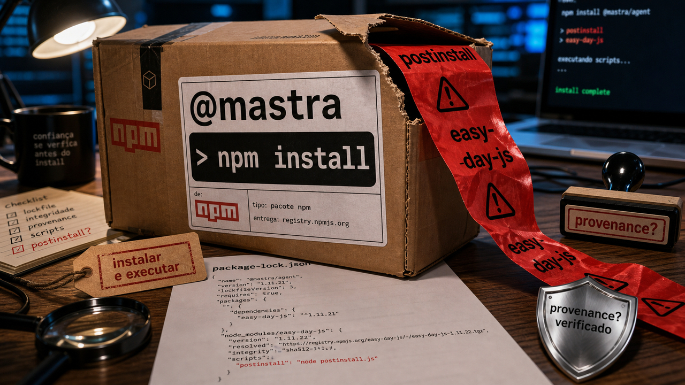

Hoje a história começa antes de o app rodar. Em JavaScript, instalar pacote já pode executar código; se essa etapa cai, o resto do fluxo descobre tarde.

## Pacotes @mastra foram republicados com easy-day-js malicioso

Em 17 de junho de 2026, pacotes do escopo `@mastra` no npm foram republicados com uma dependência nova: `easy-day-js`. A jogada era boa de atacante e péssima para quem instalou. A versão `1.11.21` parecia limpa, mas a faixa `^1.11.21` podia resolver para a `1.11.22`, que executava um `postinstall` malicioso durante a instalação.

Isso muda a gravidade. O código principal dos pacotes `@mastra` nem precisava carregar a parte maliciosa. O ataque entrava quando o gerenciador resolvia a dependência e rodava o script de instalação, antes de qualquer `import`, teste ou deploy. Em máquina de desenvolvimento e CI, esse encanamento todo vira incidente rápido.

Os números ainda variam entre as fontes. A SafeDep fala em 141 pacotes; a StepSecurity fala em mais de 140 pacotes e mais de 1,1 milhão de downloads semanais combinados expostos. O padrão confirmado é o mesmo: escopo importante de framework para agentes, publicação maliciosa, dependência `easy-day-js`, ausência do sinal normal de provenance nas versões afetadas e execução durante instalação.

Para quem instalou `@mastra` nos dias 16 ou 17 de junho, a resposta passa de "dar update". É revisar o lockfile, voltar versões afetadas, rotacionar credenciais acessíveis no ambiente, procurar persistência e apertar política de publicação onde der. `npm provenance`, assinatura e atestação SLSA ajudam justamente quando uma versão nova aparece sem a trilha esperada do fluxo de release.

Como a investigação ainda estava andando, as fontes divergem no número exato de pacotes e nos detalhes finais do segundo estágio. O fato bem sustentado publicamente já basta: a instalação virou o momento de execução. Ruim o bastante.

Fontes: [SafeDep](https://safedep.io/mastra-npm-scope-takeover-supply-chain-attack), [StepSecurity](https://www.stepsecurity.io/blog/mastra-npm-packages-compromised-using-easy-day-js) e [The Hacker News](https://thehackernews.com/2026/06/144-mastra-npm-packages-compromised-via.html).

## GLM-5.2 saiu com licença MIT, 1M de contexto e uso local pesado

No dia 14, o [GLM-5.2 apareceu por aqui como acesso e configuração](/2026/relatorio-acusa-ad-blockers-de-roubar-prompts-tensorzero-e-splunk-pedem-atencao/), ainda com promessa de abertura. Agora o fato mudou: a página pública no Hugging Face está no ar, com licença MIT, contexto de 1 milhão de tokens e instruções para rodar ou servir o modelo em ambientes compatíveis.

A página lista suporte a `Transformers`, `vLLM`, `SGLang`, Docker Model Runner e caminhos de quantização. A documentação da Z.ai também fala em saída máxima de 128K tokens, function calling e streaming. Para quem monta agente de código, isso muda a conversa de "será que um dia abre?" para "como eu testo isso no meu fluxo sem queimar tempo e GPU à toa?".

O tamanho puxa o freio: o model card lista 753B parâmetros. Self-hosting real, nesse porte, não é coisa de notebook feliz em mesa de cafeteria. O caminho provável para muita gente passa por infraestrutura pesada, quantização, provedor compatível ou teste bem recortado em tarefa real do repositório.

Numa semana em que acesso a modelo virou risco operacional por preço, quota, região e política de fornecedor, um modelo aberto com licença permissiva entra como plano B possível para fluxos de agente. Merece avaliação, com teste antes de qualquer troca.

Benchmarks do card e cobertura de ecossistema continuam sendo claims de model card e sinal de atenção dos devs. Antes de apostar nele, o teste chato ainda manda: pegar uma tarefa real, medir qualidade, custo, latência, uso de ferramenta e regressão. Modelo aberto também precisa passar pelo constrangimento do seu próprio repositório.

Fontes: [Hugging Face / Z.ai](https://huggingface.co/zai-org/GLM-5.2), [Z.AI Developer Document](https://docs.z.ai/guides/llm/glm-5.2) e [Latent Space](https://www.latent.space/p/ainews-glm-52-the-top-frontend-coding).

## Destaques rápidos para hoje

- **MiniMax Sparse Attention tenta baratear contexto de 1M tokens.** O paper descreve uma atenção esparsa em blocos com dois ramos: um mais leve escolhe blocos relevantes, e o ramo principal aplica atenção exata só nesses blocos. Os autores reportam avaliação em um MoE de 109B parâmetros, orçamento de 3T tokens e claim de 28,4x menos compute de atenção por token em 1M de contexto, com speedups medidos em H800. Trate como radar técnico dependente de reprodução no seu runtime. Fontes: [arXiv](https://arxiv.org/html/2606.13392), [Hugging Face Papers](https://huggingface.co/papers/2606.13392) e [GitHub / MiniMax-AI](https://github.com/MiniMax-AI/MSA).

- **Bash `/dev/tcp` quebra um galho quando o container não tem curl.** O texto mostra como abrir um socket com redirecionamento especial do Bash, usar `exec 3<>` e mandar um `GET` manual com `printf` para ler a resposta. Serve bem para diagnosticar container mínimo sem `curl` ou `wget`; como cliente HTTP completo, deixa TLS, redirect, chunking, conteúdo comprimido e retry fora da brincadeira. Fonte: [Marek Suppa](https://mareksuppa.com/til/bash-dev-tcp-http-without-curl/).

- **PseudoBench mede agentes de pesquisa aceitando pseudociência.** O benchmark tem 200 pares de claim e evidência pseudocientífica em cinco domínios, e os autores testaram sete agentes em um fluxo de pesquisa. O resumo do paper fala em taxa de recusa quase zero e resistência máxima de 27,4%. É preprint e depende do desenho do benchmark, mas a mensagem para uso real é saudável: fluência não é filtro de verdade. Fonte: [arXiv](https://arxiv.org/abs/2606.18060).

- **Amazon S3 ganhou annotations mutáveis para contexto consultável.** A AWS anunciou annotations para anexar contexto diretamente a objetos: até 1.000 annotations por objeto, cada uma com até 1 MB, totalizando até 1 GB por objeto. Com S3 Metadata, esse contexto pode virar tabela gerenciada consultável no Athena. Para data lake e agente que precisa achar objeto por contexto, é interessante; preço, disponibilidade, governança e lock-in entram na conta antes de migrar metadata existente. Fonte: [AWS News Blog](https://aws.amazon.com/blogs/aws/amazon-s3-annotations-attach-rich-queryable-context-directly-to-your-objects/).

- **Bedrock Guardrails ganhou checagens detect-only dentro do loop do agente.** A nova `InvokeGuardrailChecks API` permite aplicar salvaguardas em pontos específicos de fluxos com ferramentas, sem criar um recurso separado de guardrail para cada etapa. Ela devolve notas numéricas, e a aplicação decide se bloqueia, registra, tenta de novo ou manda para revisão. Ajuda a desenhar controle por etapa, mas segurança de agente continua dependendo de política, log, teste e revisão humana. Fontes: [AWS Machine Learning Blog](https://aws.amazon.com/blogs/machine-learning/safeguard-your-agentic-ai-applications-with-the-amazon-bedrock-guardrails-invokeguardrailchecks-api/) e [AWS Documentation](https://docs.aws.amazon.com/bedrock/latest/userguide/guardrails.html).

- **Joomla JCE e LiteSpeed cPanel entraram em alerta de exploração ativa.** A SecurityWeek reportou ataques envolvendo o Joomla Content Editor e o plugin LiteSpeed para cPanel. A CVE-2026-48907 pode levar a upload e execução de PHP no JCE; a CVE-2026-54420 afeta o LiteSpeed cPanel plugin antes de 2.4.8 e o WHM plugin antes de 5.3.2.0, com problema de symlink. Como CISA KEV aparece no caminho, atualizar e procurar comprometimento anterior entram juntos. Fontes: [SecurityWeek](https://www.securityweek.com/joomla-litespeed-vulnerabilities-exploited-in-attacks/), [CVE-2026-48907](https://www.cve.org/CVERecord?id=CVE-2026-48907), [CVE-2026-54420](https://www.cve.org/CVERecord?id=CVE-2026-54420) e [CISA KEV](https://www.cisa.gov/known-exploited-vulnerabilities-catalog).

## Acompanhamento de tendências do dia

O padrão de hoje é mais operacional do que bonito: confiança está aparecendo em etapas que muita gente tratava como detalhe. No Mastra, ela aparece antes do código rodar, no install e na provenance. No GLM-5.2, aparece em licença, acesso e runtime. No S3, aparece no contexto que acompanha o dado. No Bedrock e no PseudoBench, aparece dentro do loop do agente, antes de uma resposta fluente virar decisão.

Para quem mantém automação, a pergunta vem antes da ação: quem verifica o pacote antes do `postinstall`, qual modelo entra se o provedor sumir, onde o dado ganha contexto, e que checagem roda antes do agente usar ferramenta? É menos charmoso que benchmark. Também costuma ser onde produção sobrevive.

Fontes: [SafeDep](https://safedep.io/mastra-npm-scope-takeover-supply-chain-attack), [Hugging Face / Z.ai](https://huggingface.co/zai-org/GLM-5.2), [AWS News Blog](https://aws.amazon.com/blogs/aws/amazon-s3-annotations-attach-rich-queryable-context-directly-to-your-objects/), [AWS Machine Learning Blog](https://aws.amazon.com/blogs/machine-learning/safeguard-your-agentic-ai-applications-with-the-amazon-bedrock-guardrails-invokeguardrailchecks-api/) e [arXiv / PseudoBench](https://arxiv.org/abs/2606.18060).

> Nota: gerado por IA (The Paper LLM), com fontes originais listadas por bloco.

<!--
briefing_slug: 2026-06-17
source_mode: briefing
generated_at: 2026-06-17T05:40:22-03:00
source_urls:
  - https://safedep.io/mastra-npm-scope-takeover-supply-chain-attack
  - https://www.stepsecurity.io/blog/mastra-npm-packages-compromised-using-easy-day-js
  - https://thehackernews.com/2026/06/144-mastra-npm-packages-compromised-via.html
  - https://huggingface.co/zai-org/GLM-5.2
  - https://docs.z.ai/guides/llm/glm-5.2
  - https://www.latent.space/p/ainews-glm-52-the-top-frontend-coding
  - https://arxiv.org/html/2606.13392
  - https://huggingface.co/papers/2606.13392
  - https://github.com/MiniMax-AI/MSA
  - https://mareksuppa.com/til/bash-dev-tcp-http-without-curl/
  - https://news.ycombinator.com/front
  - https://arxiv.org/abs/2606.18060
  - https://aws.amazon.com/blogs/aws/amazon-s3-annotations-attach-rich-queryable-context-directly-to-your-objects/
  - https://aws.amazon.com/blogs/machine-learning/safeguard-your-agentic-ai-applications-with-the-amazon-bedrock-guardrails-invokeguardrailchecks-api/
  - https://docs.aws.amazon.com/bedrock/latest/userguide/guardrails.html
  - https://www.securityweek.com/joomla-litespeed-vulnerabilities-exploited-in-attacks/
  - https://www.cve.org/CVERecord?id=CVE-2026-48907
  - https://www.cve.org/CVERecord?id=CVE-2026-54420
  - https://www.cisa.gov/known-exploited-vulnerabilities-catalog
omitted_briefing_items:
  - "Honda Civics and the Evil Valet: confirmed source, but same JuniperSpring story was already published on 2026-06-14 and no new public delta was found."
-->
