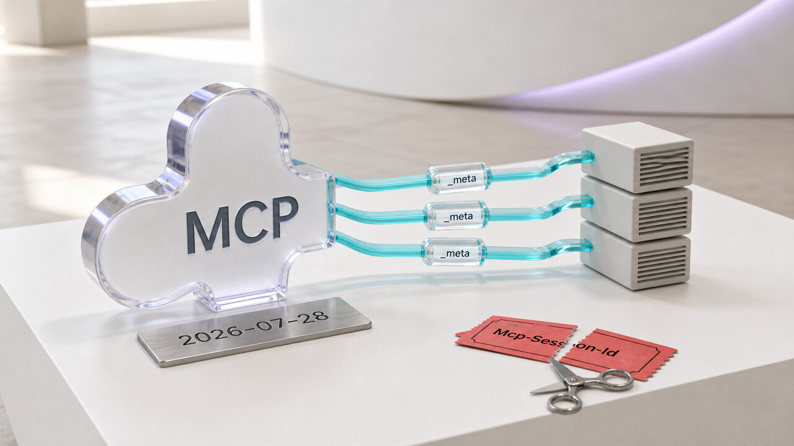

Uma chamada chega ao servidor, qualquer instância disponível responde e ninguém precisa descobrir onde foi parar a sessão anterior. Esse é o novo núcleo do Model Context Protocol. A especificação final `2026-07-28` removeu handshake e sessão do protocolo, deixando o MCP mais parecido com uma API comum sobre HTTP.

Na prática, isso facilita balanceamento, gateways e cache. Também quebra integrações que dependiam de `initialize`, `Mcp-Session-Id`, conexões mantidas abertas ou APIs agora depreciadas. Stateless ajuda a infraestrutura, mas o estado da aplicação não evapora por educação.

## MCP troca a sessão implícita por chamadas autossuficientes

O MCP padroniza o acesso de aplicações com modelos de linguagem a ferramentas, prompts e recursos por JSON-RPC. Na revisão anterior, a `2025-11-25`, cliente e servidor começavam a conversa com `initialize` e `initialized`. O transporte podia usar `Mcp-Session-Id` para prender as chamadas a uma sessão criada pelo servidor.

A versão final `2026-07-28`, lançada em 28 de julho, retirou essas três peças. Agora, a versão do protocolo e as capacidades acompanham cada requisição no campo `_meta`. Se o cliente precisar conhecer as capacidades antes de fazer outra chamada, pode consultar `server/discover`. Os SDKs Tier 1 de TypeScript, Python, Go e C# já foram anunciados com suporte à revisão.

A consequência mais visível num deployment HTTP é operacional. Sem uma sessão presa ao transporte, o balanceador pode distribuir chamadas entre instâncias sem sticky session e sem armazenamento compartilhado criado só para sustentar o contrato do MCP. O GitHub já adaptou seu MCP Server com o SDK oficial de Go e diz que removeu as sessões em Redis.

Uma aplicação stateful não precisa fingir amnésia. Se uma ferramenta iniciar um trabalho que continua na próxima chamada, o servidor pode devolver um handle e exigir esse identificador nos argumentos seguintes. O estado ainda existe; só fica explícito no contrato da aplicação, em vez de escondido na afinidade entre conexão e instância.

Também ficou mais fácil decidir o que fazer sem abrir o corpo JSON. No Streamable HTTP, as chamadas passam a incluir os headers `Mcp-Method` e `Mcp-Name`. Com eles, um gateway pode rotear, medir ou limitar requisições sem interpretar profundamente cada payload. Segundo o GitHub, isso também permitiu abandonar a inspeção profunda usada para logging e secret scanning.

As listagens ganharam um contrato de cache. Resultados de `tools/list`, `prompts/list`, `resources/list`, `resources/templates/list` e `resources/read` podem incluir `ttlMs` e `cacheScope`. O cliente passa a saber por quanto tempo pode reutilizar a resposta e em qual escopo, sem consultar tudo de novo nem torcer para um cache artesanal envelhecer bem.

## Confirmações intermediárias deixam de depender de uma conexão aberta

Nem toda operação termina numa única ida e volta. Às vezes, uma ferramenta precisa que o usuário confirme uma ação ou forneça outro dado antes de continuar. A especificação chama esse fluxo de Multi Round-Trip Requests, ou MRTR.

Em vez de manter um pedido server-to-client preso ao stream, o servidor responde com `resultType: "input_required"`. O cliente coleta a entrada e repete a chamada com `inputResponses`. Esse retry leva de forma explícita o que falta para continuar o trabalho. A lógica é a mesma do restante da revisão: menos contexto implícito no transporte, mais estado visível na requisição.

Tasks também saiu do núcleo experimental e virou a extensão `io.modelcontextprotocol/tasks`. As extensões foram formalizadas, então esses recursos podem evoluir sem transformar cada mudança numa revisão do protocolo central. Roots, Sampling, Logging e o transporte legado HTTP+SSE foram depreciados, mas não desapareceram no dia do anúncio. A política prevê uma janela mínima de doze meses antes da remoção.

A migração ainda passa por detalhes menos vistosos. O código para recurso ausente muda de `-32002` para o erro padrão JSON-RPC Invalid Params, `-32602`. Na autorização, a revisão endurece a validação do issuer e o vínculo de credenciais. Se o authorization server mudar, o cliente não deve reaproveitar as credenciais.

“Atualizar o SDK” é só o começo. Quem mantém cliente, servidor ou gateway precisa inventariar handshake, sessão, SSE, tarefas, callbacks do servidor para o cliente, códigos de erro, autenticação e recursos depreciados. Depois, precisa rodar testes de interoperabilidade e, quando fizer sentido, a suíte oficial de conformidade. Breaking change com nome de data continua sendo breaking change.

## A adoção começou, mas não chegou a toda parte ao mesmo tempo

O suporte do GitHub mostra que a revisão já saiu do papel. Além de migrar para o SDK oficial de Go, a empresa relacionou a remoção de Redis e da inspeção profunda dos payloads ao novo contrato stateless e aos headers de roteamento.

A Anthropic também começou a levar a especificação aos produtos Claude. “Começou” é a parte importante: o anúncio fala em rollout e diz que o suporte está chegando às diferentes superfícies. Isso não significa que todos os produtos Claude passaram a aceitar a revisão ao mesmo tempo.

Já tratamos o [MCP como superfície de prompt injection e controle de ferramentas](/2026/sentry-virou-porta-para-agentes-claude-mostrou-o-sandbox-e-roteadores-viraram-proxy/). Agora a mudança acontece abaixo dessa camada, no contrato de infraestrutura que conecta essas ferramentas: onde fica o estado, o que o gateway consegue enxergar, como o cliente continua uma interação e quais credenciais pode reutilizar.

A ideia é tornar o protocolo mais simples de escalar e observar. O cuidado é não confundir “núcleo stateless” com “migração sem estado”. Se o produto depende de conversa longa, tarefas em andamento ou autorização persistente, alguém ainda precisa modelar essas relações. A diferença é que elas não podem mais ficar escondidas atrás de um ID de sessão do transporte.

Fontes: [Model Context Protocol Blog](https://blog.modelcontextprotocol.io/posts/2026-07-28/), [changelog da especificação MCP](https://modelcontextprotocol.io/specification/2026-07-28/changelog), [GitHub Changelog](https://github.blog/changelog/2026-07-23-github-mcp-server-supports-the-next-mcp-specification/) e [Claude Blog](https://claude.com/blog/bringing-mcp-2026-07-28-to-claude).

## Radar rápido

**GitHub amplia os guardrails do Copilot app e do cloud agent:** o Copilot app ganhou uma política de acesso própria, separada da política do Copilot CLI, nos níveis enterprise e organization. Ela nasce como `Enabled everywhere`, então os administradores precisam revisar esse default em vez de presumir que o app está bloqueado. O arquivo server-managed `.github-private/copilot/managed-settings.json` agora governa o app e o cloud agent, além do CLI e do VS Code. Os valores compatíveis prevalecem sobre a configuração local e costumam chegar em cerca de uma hora, ou depois de um restart ou novo login. No app, as chaves cobrem controles como bypass, seleção automática de modelo, plugins e marketplaces. No cloud agent, a cobertura anunciada inclui plugins e marketplaces, mas não os controles de prompts de aprovação reservados aos clientes interativos. Política de acesso e settings gerenciados são mecanismos diferentes: habilitar o app não aplica os guardrails sozinho. Para validar, confira o estado recebido no cliente e tente uma ação que deveria ser bloqueada. A presença do arquivo não prova que ele foi aplicado em todos os endpoints. É a continuação prática dos [controles externos ao modelo discutidos ontem](/2026/velocloud-tem-cve-10-explorada-kimi-k3-abre-pesos-e-loops-podem-destruir-patches/). Fontes: [política dedicada do Copilot app](https://github.blog/changelog/2026-07-27-manage-github-copilot-app-access-with-a-dedicated-policy), [settings no app e cloud agent](https://github.blog/changelog/2026-07-27-enterprise-managed-settings-now-apply-to-the-github-copilot-app), [referência das chaves suportadas](https://docs.github.com/copilot/reference/enterprise-managed-settings-reference) e [guia de configuração](https://docs.github.com/copilot/how-tos/administer-copilot/manage-for-enterprise/manage-agents/configure-enterprise-managed-settings).

**Docker Desktop 4.84.0 corrige travamentos e perda de tokens:** a versão publicada em 27 de julho agora mostra um erro quando um `~/.docker/config.json` inválido deixa o Desktop consumindo muita CPU e memória sem exibir diálogo. Ela também corrige um bug em que a remoção de um credential ID sem relação podia apagar tokens OAuth do Docker Hub e deslogar o usuário. No Windows, um `install-settings.json` vazio ou malformado podia causar um travamento parecido. O MSI agora bloqueia conflitos com instalações per-user, e o desinstalador deixa de impedir o acesso do usuário aos próprios diretórios de dados. A release atualiza Docker Agent para 1.111.0, `cri-dockerd` para 0.4.4, `dhictl` para 0.0.7 e Desktop CLI para 0.4.3. São correções operacionais, não CVEs declaradas nas notas. O rollout é gradual e pode levar até uma semana. Se você usa políticas ou gerencia máquinas Windows, vale testar a instalação sem sobrescrever às cegas um arquivo de configuração que precisa ser corrigido. Fonte: [Docker Desktop 4.84.0 release notes](https://docs.docker.com/desktop/release-notes/#4840).

> Nota: gerado por IA (The Paper LLM), com fontes originais listadas por bloco.

<!--
source_urls:
  - https://blog.modelcontextprotocol.io/posts/2026-07-28/
  - https://modelcontextprotocol.io/specification/2026-07-28/changelog
  - https://github.blog/changelog/2026-07-23-github-mcp-server-supports-the-next-mcp-specification/
  - https://claude.com/blog/bringing-mcp-2026-07-28-to-claude
  - https://github.blog/changelog/2026-07-27-manage-github-copilot-app-access-with-a-dedicated-policy
  - https://github.blog/changelog/2026-07-27-enterprise-managed-settings-now-apply-to-the-github-copilot-app
  - https://docs.github.com/copilot/reference/enterprise-managed-settings-reference
  - https://docs.github.com/copilot/how-tos/administer-copilot/manage-for-enterprise/manage-agents/configure-enterprise-managed-settings
  - https://docs.docker.com/desktop/release-notes/#4840
-->
