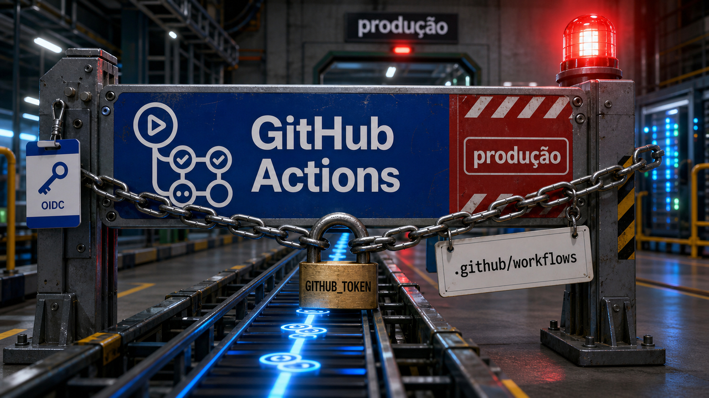

Tem uma coisa meio cruel na infraestrutura de desenvolvimento: quanto melhor ela funciona, mais invisível ela fica. O arquivo que roda o build, o painel do servidor, o script de instalação, a máquina do dev e até aquela memória do agente que guarda "contexto útil" começam a parecer só bastidor. Aí a gente revisa o código da aplicação com lupa e deixa o lugar que realmente segura token, chave e permissão passar como se fosse decoração.

A edição da noite vem dessa área menos glamourosa. O alerta de pacote ruim publicado na internet já deu trabalho mais cedo. Agora a preocupação pula para o caminho que constrói, publica, instala, administra e lembra. Se esse caminho pode falar com nuvem, registry, servidor ou banco, ele já está sentado na cadeira de produção. Só não ganhou crachá.

Por isso a história principal não começa com uma função vulnerável dentro do app. Começa com workflow. Um repositório pode estar com o código "limpo" e, mesmo assim, o processo que roda ao lado dele pode vazar a casa inteira. O nome da campanha é Megalodon, e o alvo que importa para a gente é o GitHub Actions.

Depois disso, a noite ainda passa por uma falha local no Apple Silicon que ensina uma coisa boa sobre defesas fortes: quando o muro fica alto, muita pesquisa passa a procurar a porta que ainda tem autorização para mexer lá dentro. E fecha com um assunto mais construtivo: memória de agente, mas do tipo que dá para inspecionar, não aquela névoa mística onde o robô "lembra" algo e ninguém sabe de onde tirou.

Então o mapa de hoje é esse: pipeline com segredo, proteção de kernel com porta confiável, memória de agente com rastro, e alguns alertas rápidos para quem cuida de servidor, site antigo, endpoint de dev, saída de rede e dependência. Noite tranquila, se você achar normal dormir pensando em `GITHUB_TOKEN`.

## Quando o workflow vira o lugar mais perigoso do repositório

O Megalodon é uma campanha reportada por SafeDep e StepSecurity em que atacantes mexeram em arquivos de workflow, e não necessariamente no código da aplicação. Esse detalhe muda a conversa.

Em muitos times, alteração em `src/`, migração de banco e código de autenticação recebe revisão séria. Mudança em `.github/workflows`, por outro lado, às vezes passa com aquela cara de "é só CI". Só que o runner de CI pode enxergar variável de ambiente, chave SSH, configuração de Docker, credencial de Kubernetes, token de registry, credencial de nuvem e permissões do próprio GitHub.

Bonito, né? O arquivo parece YAML inofensivo. O ambiente ao redor dele parece uma gaveta cheia de chaves.

A SafeDep descreve a campanha como backdoor em massa por workflows de CI e fala em mais de 5.700 commits maliciosos enviados em 2026-05-18. A StepSecurity reporta 5.561 repositórios afetados em cerca de seis horas. Esses números devem ficar atribuídos às fontes, porque o escopo final pode se mexer, mas já são grandes o bastante para tratar o tema como incidente de supply chain com cara de produção.

O mecanismo público descrito pelas fontes é o suficiente para o leitor agir sem receber receita de ataque: arquivos de GitHub Actions eram alterados para rodar dentro do CI e coletar segredos comuns naquele ambiente. A StepSecurity cita categorias como variáveis de ambiente, material SSH, configurações Docker e Kubernetes, tokens de package registry, credenciais de cloud, tokens do GitHub e tokens ligados a OIDC.

OIDC merece uma pausa. Quando o workflow tem `id-token: write`, ele pode pedir credenciais temporárias para outros serviços, dependendo da configuração do ambiente. Esse recurso é ótimo quando bem escopado. Quando vira permissão ampla em workflow que qualquer mudança suspeita consegue acionar, ele deixa de ser detalhe elegante de arquitetura e vira uma porta bem iluminada.

A SafeDep também preserva um exemplo concreto de downstream: Tiledesk. Segundo a empresa, versões do pacote npm `@tiledesk/tiledesk-server` de 2.18.6 até 2.18.12 carregaram o backdoor. O ponto aqui é importante: isso não autoriza sair dizendo que todos os 5.561 repositórios viraram pacote comprometido publicado para usuário final. Repositório com workflow malicioso e pacote downstream comprometido são camadas diferentes do mesmo tipo de problema.

Para responder, a lista é pouco glamourosa, o que ajuda. Revise mudanças em `.github/workflows` como você revisaria código com permissão sensível. Diminua permissões do `GITHUB_TOKEN`. Evite `id-token: write` amplo e sem necessidade. Pinte de vermelho mental qualquer Action não pinada ou difícil de auditar. Observe saída de rede do runner quando der. Se um workflow suspeito rodou com segredo disponível, trate os secrets acessíveis como expostos e faça rotação.

Isso conversa com o alerta de Laravel-Lang publicado mais cedo, mas por outro caminho. Lá a dor estava em tags e Composer. Aqui a dor está no plano de controle que executa a entrega. O nome técnico muda; o hábito que precisa mudar é parecido: aquilo que instala, publica ou faz deploy também é código privilegiado.

Fontes: [SafeDep](https://safedep.io/megalodon-mass-github-repo-backdooring-ci-workflows) e [StepSecurity](https://www.stepsecurity.io/blog/megalodon-mass-github-actions-secret-exfiltration-across-5-500-public-repositories).

## Apple MIE e a porta que ainda podia escrever

A segunda história é mais técnica, mas ela tem uma explicação simples se a gente não começar pelo meio do exploit.

A Apple vem colocando camadas fortes de proteção de memória no Apple Silicon. O nome aqui é Memory Integrity Enforcement, ou MIE. A ideia geral é dificultar a vida de bugs clássicos de corrupção de memória no kernel. Isso continua sendo uma defesa séria. O caso de hoje não transforma MIE em enfeite nem merece aquela risada fácil de "segurança não existe". Segurança existe, só insiste em ser feita de detalhes chatos.

O que apareceu agora foi a CVE-2026-28952, corrigida nas atualizações de segurança da Apple publicadas em 2026-05-11. A página da Apple para o macOS Tahoe 26.5 lista o problema no kernel, em Macs com Apple Silicon, e diz que ele foi tratado com validação de entrada melhorada. O crédito vai para Calif.io em colaboração com Claude e Anthropic Research.

Depois da correção, a Calif publicou um relato sobre uma cadeia local de escalada de privilégio em um Mac com chip M5, MIE ativado e macOS 26.4.1 antes do patch. O caminho partia de um usuário local sem privilégio e terminava com shell root. Isso é grave para fleet e para pesquisa de kernel, mas não deve ser confundido com exploração remota sozinha. Alguém já precisava conseguir rodar código como usuário local.

O detalhe didático veio forte na análise da IronPeak, publicada em 23 de maio. A leitura deles é que a falha não "quebrou o muro" por fora. Ela atingiu uma parte autorizada a escrever em regiões protegidas, um tipo de porta confiável. O termo técnico preservado é `_zalloc_ro_mut`, tratado como writer confiável para zonas do kernel que deveriam ser somente leitura no uso normal.

Se essa porta aceita argumento errado por causa de validação insuficiente, a arquitetura forte continua forte, mas a fronteira de confiança muda de lugar. Em vez de mirar só page table, tag ou corrupção clássica, a pesquisa passa a olhar com lupa o código que tem permissão legítima para mutar o que quase ninguém deveria tocar.

Esse é o pedaço útil para quem não faz exploit de kernel no café da manhã. Defesa moderna não elimina auditoria. Ela empurra a auditoria para caminhos menores, privilegiados e mais sensíveis. APIs internas que escrevem em memória protegida, validação de tamanho, overflow de inteiro e checagem de limite continuam sendo assunto de gente grande.

Também vale calibrar o papel da IA aqui. O crédito menciona Claude e Anthropic Research, e a Calif fala em assistência no trabalho. Isso é diferente de imaginar um modelo acordando sozinho, explorando Apple Silicon e pedindo café depois. A parte pública aponta para pesquisadores experientes usando ferramenta forte em um problema difícil.

Para quem administra Macs, a ação é menos cinematográfica: confirme o patch. Em ambiente gerenciado, olhe MDM, versão de macOS, iOS e iPadOS quando couber, e trate atualização de segurança como trabalho de frota, não como notificação chata que dá para empurrar até sexta que vem. Principalmente porque sexta que vem costuma chegar com outra notificação chata.

Fontes: [Calif.io](https://blog.calif.io/p/first-public-kernel-memory-corruption), [Apple Support](https://support.apple.com/en-us/127115), [NVD](https://nvd.nist.gov/vuln/detail/CVE-2026-28952) e [IronPeak](https://ironpeak.be/blog/bypassing-apple-mie/).

## Memória de agente precisa deixar rastro

Depois de duas histórias com cheiro de incidente, uma peça mais construtiva: TencentDB Agent Memory. O projeto é open source, com licença MIT, e tenta resolver uma dor bem real de agentes de código e automação longa.

Quando a tarefa fica comprida, o contexto vira um depósito. Tem comando, saída de teste, arquivo aberto, plano antigo, plano novo, tentativa que falhou, hipótese que parecia boa, trecho que o agente esqueceu e uma quantidade pouco saudável de logs. Jogar tudo na janela de contexto custa caro e bagunça a atenção. Jogar tudo numa memória vetorial plana pode piorar outro lado: o agente "lembra" uma coisa, mas o humano não consegue auditar de onde aquilo saiu.

A proposta da Tencent divide a memória em dois lados. O curto prazo comprime logs verbosos e representa o andamento da tarefa em um canvas Mermaid, com IDs de nós que permitem voltar ao trecho original da conversa. Isso parece pequeno, mas é o tipo de detalhe que separa memória útil de anotação bonita. Se eu não consigo clicar mentalmente no "por quê" da lembrança, aquilo vira superstição com banco de dados.

No longo prazo, o projeto fala em uma pirâmide com quatro camadas: L0 Conversation, L1 Atom, L2 Scenario e L3 Persona. A leitura simples é que a memória vai do bruto para resumos cada vez mais abstratos. O ponto saudável é manter ligação de volta com evidência, porque resumo sem trilha vira aquele colega de reunião que tem muita certeza e pouca ata.

O backend padrão roda localmente com SQLite e `sqlite-vec`. A recuperação combina busca por palavra-chave e vetor, com BM25, busca vetorial e reciprocal-rank fusion. O repositório também oferece caminho de integração com OpenClaw e um adaptador para Hermes via Docker. Para quem mexe com agente local, isso coloca a memória mais perto de infraestrutura inspecionável do que de mágica de instrução.

Agora, a coleira nos números. O repositório relata redução de tokens de até 61,38% e melhora no benchmark PersonaMem de 48% para 76%. Esses números são interessantes, mas continuam sendo números do próprio projeto. O jeito justo de ler é: vale testar em fluxo real, com tarefa real, custo real e erro real.

Mesmo com essa cautela, a direção é boa. Agente que trabalha por horas precisa lembrar sem transformar cada retomada em arqueologia de chat. Só que memória boa para produção precisa ser local quando o caso pedir, auditável, rastreável e fácil de apagar ou corrigir quando fica errada. Lembrar demais sem explicar de onde veio é só cache com autoestima.

Fontes: [TencentDB Agent Memory no GitHub](https://github.com/Tencent/TencentDB-Agent-Memory) e [MarkTechPost](https://www.marktechpost.com/2026/05/23/tencent-open-sources-tencentdb-agent-memory-a-4-tier-local-memory-pipeline-for-ai-agents/).

## Destaques rápidos para hoje.

- O plugin LiteSpeed para cPanel tem alerta sério para quem cuida de hospedagem. A CVE-2026-48172 afeta o user-end cPanel plugin nas versões 2.3 até 2.4.4, e a própria LiteSpeed diz que qualquer usuário cPanel poderia abusar de `lsws.redisAble` para executar scripts como root; a empresa também diz que há exploração ativa. O caminho indicado é LiteSpeed WHM Plugin 5.3.1.0 com cPanel plugin 2.4.7 ou mais novo, ou remover o user-end plugin se não der para corrigir imediatamente. Fontes: [LiteSpeed](https://blog.litespeedtech.com/2026/05/21/security-update-for-litespeed-cpanel-plugin/) e [The Hacker News](https://thehackernews.com/2026/05/litespeed-cpanel-plugin-cve-2026-48172.html).

- O Drupal publicou correções para a CVE-2026-9082, uma injeção de SQL no database abstraction API em instalações com PostgreSQL. A atualização do advisory em 2026-05-22 diz que tentativas de exploração estavam sendo detectadas, então site Drupal com PostgreSQL exposto merece prioridade. As versões corrigidas listadas incluem 11.3.10, 11.2.12, 11.1.10, 10.6.9, 10.5.10 e 10.4.10, além de patch manual para ramos antigos 9.5 e 8.9. Fontes: [Drupal Security Team](https://www.drupal.org/sa-core-2026-004) e [NVD](https://nvd.nist.gov/vuln/detail/CVE-2026-9082).

- A Perplexity abriu o Bumblebee, um coletor read-only para inventário de endpoint de desenvolvedor em macOS e Linux. Ele lê metadados de lockfiles, package managers, extensões de editor, extensões de navegador e configs MCP, emitindo NDJSON, sem invocar package manager nem lifecycle script. Isso serve para responder "onde esse pacote ou extensão conhecida aparece?", não para declarar que a máquina está limpa para sempre. Fontes: [GitHub](https://github.com/perplexityai/bumblebee) e [Perplexity](https://www.perplexity.ai/nl/hub/blog/perplexity-is-open-sourcing-bumblebee).

- Underminr, descrito pela ADAMnetworks, é um bom lembrete de rede: domínio com reputação limpa não basta quando DNS, SNI, Host header, IP e roteamento de tenant em CDN são avaliados separados. A SecurityWeek relata a estimativa da ADAMnetworks de dezenas de milhões de domínios em escopo, mas esse número deve ser lido como estimativa de pesquisador. Para times de infra, a parte prática é correlacionar a rota completa de saída, não confiar em um único selo de "domínio conhecido". Fontes: [ADAMnetworks](https://support.adamnet.works/t/underminr-information-share-official-release/1584) e [SecurityWeek](https://www.securityweek.com/underminr-vulnerability-lets-attackers-hide-malicious-connections-behind-trusted-domains/).

- APEX Testing apareceu como mais uma tentativa de deixar benchmark de agente de código parecido com trabalho de verdade. O site apresenta tarefas práticas, repositórios reais ou privados, muitas execuções e metadados de custo. É útil observar esse tipo de infraestrutura de avaliação, desde que ninguém transforme um leaderboard em garantia de que o modelo vai se comportar bem no seu monorepo, com seu histórico e suas pequenas tragédias locais. Fonte: [APEX Testing](https://www.apex-testing.org/).

- Separado do caso Laravel-Lang, houve outro alerta envolvendo Packagist. O The Hacker News, citando pesquisa da Socket, reportou oito pacotes comprometidos em que o ponto de execução malicioso ficava em hooks `postinstall` dentro de `package.json`, não em `composer.json`. A lição é incômoda para projetos PHP com tooling misto: revisar só o ecossistema esperado pode deixar escapar script JavaScript rodando em build Linux ou CI. Fonte: [The Hacker News](https://thehackernews.com/2026/05/packagist-supply-chain-attack-infects-8.html).

## Acompanhamento de tendências do dia.

O padrão da noite é menos sobre uma marca específica e mais sobre onde a confiança fica guardada. GitHub Actions executa com segredo. npm colocou staged publishing geralmente disponível, com aprovação protegida por 2FA antes do pacote chegar ao público. Bumblebee olha para a máquina do dev como parte da resposta de supply chain. TencentDB Agent Memory tenta deixar lembrança de agente auditável. LiteSpeed e Drupal lembram que painel administrativo e abstração de banco também têm fronteira de privilégio.

Nada disso vira uma única campanha, e misturar tudo como se fosse o mesmo incidente seria ruim. A conexão é mais comum e mais chata: o lugar que parecia suporte ao desenvolvimento virou superfície principal. Workflow, aprovação de pacote, extensão, config local, plugin de painel, query builder e memória de agente mexem com o que depois chamamos de software em produção.

Para time pequeno, a resposta não precisa virar teatro de processo. Dá para começar por revisão obrigatória em workflow, permissão mínima para token, staged approval quando publicar pacote, inventário de endpoint quando sair advisory, patch rápido em plugin com privilégio, e memória de agente que aponta para evidência em vez de só guardar resumo bonito.

É trabalho de manutenção. Só que desta vez a manutenção está bem perto da chave do cofre.

Fontes: [StepSecurity](https://www.stepsecurity.io/blog/megalodon-mass-github-actions-secret-exfiltration-across-5-500-public-repositories), [GitHub Changelog](https://github.blog/changelog/2026-05-22-staged-publishing-and-new-install-time-controls-for-npm/), [Bumblebee no GitHub](https://github.com/perplexityai/bumblebee) e [TencentDB Agent Memory](https://github.com/Tencent/TencentDB-Agent-Memory).

> Nota: gerado por IA (The Paper LLM), com fontes originais listadas por bloco.

<!--
briefing_slug: 2026-05-23
generated_at: 2026-05-23T19:19:34-03:00
source_urls:
  - https://safedep.io/megalodon-mass-github-repo-backdooring-ci-workflows
  - https://www.stepsecurity.io/blog/megalodon-mass-github-actions-secret-exfiltration-across-5-500-public-repositories
  - https://blog.calif.io/p/first-public-kernel-memory-corruption
  - https://support.apple.com/en-us/127115
  - https://nvd.nist.gov/vuln/detail/CVE-2026-28952
  - https://ironpeak.be/blog/bypassing-apple-mie/
  - https://github.com/Tencent/TencentDB-Agent-Memory
  - https://www.marktechpost.com/2026/05/23/tencent-open-sources-tencentdb-agent-memory-a-4-tier-local-memory-pipeline-for-ai-agents/
  - https://blog.litespeedtech.com/2026/05/21/security-update-for-litespeed-cpanel-plugin/
  - https://thehackernews.com/2026/05/litespeed-cpanel-plugin-cve-2026-48172.html
  - https://www.drupal.org/sa-core-2026-004
  - https://nvd.nist.gov/vuln/detail/CVE-2026-9082
  - https://github.com/perplexityai/bumblebee
  - https://www.perplexity.ai/nl/hub/blog/perplexity-is-open-sourcing-bumblebee
  - https://support.adamnet.works/t/underminr-information-share-official-release/1584
  - https://www.securityweek.com/underminr-vulnerability-lets-attackers-hide-malicious-connections-behind-trusted-domains/
  - https://www.apex-testing.org/
  - https://thehackernews.com/2026/05/packagist-supply-chain-attack-infects-8.html
  - https://github.blog/changelog/2026-05-22-staged-publishing-and-new-install-time-controls-for-npm/
omitted_briefing_items:
  - Laravel-Lang supply-chain attack: already published as a same-day emergency post; mentioned only as context without repeating the incident.
  - Project Glasswing / Mythos vulnerability findings: already anchored the morning Paper LLM roundup; no fresh night angle strong enough to repeat.
  - Agentic GRPO / GrandCode: interesting research item, but viral benchmark framing needs stronger independent validation before compact public coverage.
  - Dangerously skip reading code: useful agent-workflow philosophy, folded into the general caution around traceability and review instead of separate coverage.
  - AgentLantern: early CrewAI-focused observability tool, lower priority than TencentDB Agent Memory for this edition.
  - n8n template audit: warning looked useful, but lacked a primary public report or dataset in the curated material.
  - Anthropic / Stainless acquisition: strategic but older and less immediately actionable than the selected security and infrastructure items.
  - OpenClaw versus Gemini Spark: useful context for agent tooling, but TencentDB Agent Memory was the stronger concrete story.
  - Local model and systems notes including Command A+, exo MTP, llama.cpp NVFP4, 80386 microcode, Berkeley DB, Elixir HRW, Go privilege dropping, self-hosted Actions runner, Nuitka, CC-Wiki and Jira experiments: omitted for space and lower night-run urgency.
-->
