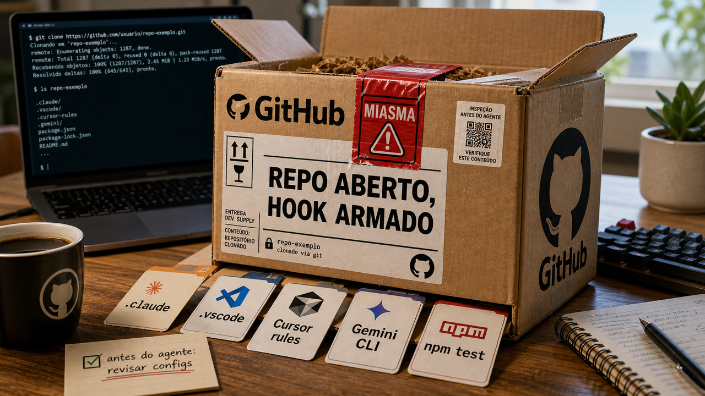

Clonar um projeto parece começo tranquilo de trabalho. Mas, se editor e assistente de código leem regras do próprio repositório, esse começo também vira superfície de execução. Hoje o destaque nasce nesse espaço entre confiança, atalho e automação.

## Miasma agora usa configs de agente dentro do repositório

Ontem, a gente falou do [Miasma usando `binding.gyp` no npm](/2026/binding-gyp-virou-esconderijo-do-worm-no-npm/). Agora a camada mudou: a SafeDep diz que encontrou um braço paralelo da mesma família empurrando commits direto para repositórios no GitHub, com configuração local para acionar ferramentas de agente e editor.

No caso descrito pela SafeDep, o gatilho não dependia de publicar outro pacote no npm. O repositório comprometido carregava um runner de cerca de 4,3 MB e pontos de acionamento ligados a Claude Code, Gemini CLI, Cursor, VS Code e `npm test`.

Na rotina de dev, a tradução é bem direta: abrir ou usar um clone em um ambiente que confia demais em config local pode virar execução antes de você sequer entender o projeto. A fonte também diz que o mesmo fingerprint apareceu em pelo menos quatro contas e mais de uma dúzia de repositórios.

Além do código-fonte, o repositório hoje pode trazer automação de editor, tarefas, hooks, scripts de teste e regras de agente. Tudo isso entra na revisão de confiança, principalmente quando o clone veio de um fork, de uma dependência abandonada, de um pacote recém-tocado ou de um link jogado em issue.

Na defesa, antes de abrir um repo suspeito com assistente ligado, olhe pastas e arquivos de automação local, regras do editor, tarefas do VS Code, configs do Cursor, instruções de agente e scripts do npm. Se um repositório foi tocado por uma campanha desse tipo, o caminho mais seguro é voltar para um commit confiável, revisar mudanças de config e reduzir permissões do agente no workspace.

Fontes: [SafeDep](https://safedep.io/miasma-worm-ai-coding-agent-config-injection) e [StepSecurity](https://www.stepsecurity.io/blog/binding-gyp-npm-supply-chain-attack-spreads-like-worm).

## Cisco SD-WAN Manager tem CVE explorada sem correção dedicada

A Cisco publicou um advisory para a CVE-2026-20245 no Cisco Catalyst SD-WAN Manager, antigo SD-WAN vManage. A falha tem CVSS 7.8 e envolve validação insuficiente de entrada enviada pelo usuário. Em certas condições, um arquivo preparado permite injeção de comando e execução como root.

O escopo importa. A exploração exige privilégios de `netadmin` ou encadeamento com duas falhas anteriores, CVE-2026-20182 e CVE-2026-20127. Ainda assim, a Cisco diz que soube de exploração em junho de 2026 e viu casos limitados em que configurações foram empurradas para dispositivos de borda.

Para quem opera infraestrutura, o problema é o lugar do controlador. Um controlador de SD-WAN fica no centro do caminho operacional. Se ele cai ou é usado com privilégio alto, a consequência pode descer para edge devices, rotas, tenant e configuração de rede.

No momento do advisory, a Cisco dizia que não havia atualização de software dedicada nem workaround para a CVE-2026-20245. A orientação passa por instalar o software corrigido de 14 de maio para as falhas relacionadas, preservar logs, coletar arquivos `admin-tech`, verificar configuração nos dispositivos de borda e acionar o TAC se houver sinal de comprometimento.

Mesmo fora de Cisco SD-WAN, fica o lembrete: plano de gerenciamento precisa de menor privilégio, retenção de evidência e patch de caminho indireto. Às vezes a falha nova só fica explorável porque a falha velha continuou na prateleira.

Fontes: [Cisco](https://sec.cloudapps.cisco.com/security/center/content/CiscoSecurityAdvisory/cisco-sa-sdwan-privesc-4uxFrdzx) e [BleepingComputer](https://www.bleepingcomputer.com/news/security/new-cisco-sd-wan-flaw-exploited-in-zero-day-attacks-to-gain-root/).

## Claude Code Action corrigiu caso em que uma issue podia alcançar o workflow

Aqui cabe cautela: segundo a pesquisa da GMO Flatt Security, a falha foi reportada em 12 de janeiro de 2026, corrigida em 16 de janeiro e os ajustes aparecem como presentes no `claude-code-action` v1.0.94. Para quem já atualizou e revisou o workflow, o valor principal é entender a fronteira de permissão.

No dia 23, [falamos de GitHub Actions como produção](/2026/megalodon-mostrou-que-github-actions-tambem-e-producao/). Aqui a peça nova é o agente dentro desse caminho. RyotaK descreve uma cadeia em que conteúdo controlado por atacante em uma issue, somado a confiança ampla em GitHub Apps e permissões do workflow, podia chegar ao agente com acesso demais.

O risco passava pelo ambiente em volta do modelo: permissões do repositório, variáveis, OIDC e credenciais temporárias que podem existir durante a execução. Quando uma automação de issue chama um agente, o texto da issue precisa ser tratado como dado hostil, do mesmo jeito que payload de formulário, corpo de email ou comentário de usuário.

Para quem usa Claude Code em GitHub Actions, a lista curta é direta: atualizar para v1.0.94 ou posterior, revisar `allowed_non_write_users`, limitar quem pode disparar o modo agente, reduzir permissões do workflow, cortar segredo desnecessário do ambiente e separar leitura de issue de ação privilegiada.

Esse bug continua útil mesmo depois do patch. Ele mostra que agente no CI precisa de desenho de autoridade, e desenho de autoridade não nasce do prompt. Nasce de evento, ator, permissão, segredo, aprovação e log.

Fontes: [GMO Flatt Security Research](https://flatt.tech/research/posts/poisoning-claude-code-one-github-issue-to-break-the-supply-chain/) e [Cyber Sec Brazil](https://www.cybersecbrazil.com.br/post/falha-no-claude-code-github-action-permitia-sequestro-de-reposit%C3%B3rios-a-partir-de-uma-%C3%BAnica-issue).

## Magenta RealTime 2 roda música local no Mac com MLX

Depois de tanta superfície de ataque, uma notícia de engenharia local cai bem. O Google Magenta apresentou o Magenta RealTime 2, uma família de modelos abertos para geração musical ao vivo, com uma configuração de 2,4 bilhões de parâmetros e outra menor, de 230 milhões.

O interesse para dev não depende de você querer criar uma banda de IA no sábado. A parte interessante é o desenho de inferência: a página fala em Apple Silicon, uma biblioteca Python instalável com `pip install magenta-rt`, suporte a JAX e MLX, e um motor em C++ usando MLX para gerar áudio em streaming na GPU do MacBook.

Os números publicados pela equipe são bem específicos: frames de 40 ms e cerca de 200 ms de latência de controle. A fonte também fala em uma latência cerca de 15 vezes menor que a versão anterior. Para um instrumento musical, isso muda a sensação. Para engenharia de IA, é uma aula pequena sobre como runtime, janela de atenção e formato de geração mandam no produto.

O modelo usa geração autoregressiva em nível de frame e atenção causal com janela deslizante. São termos chatos, mas servem para uma coisa simples: manter o sistema respondendo em tempo real sem carregar memória infinita para trás.

A ressalva: isso é especializado para música e áudio, e o suporte local depende de Apple Silicon e do tamanho do modelo. Mesmo assim, é um bom contraponto ao barulho do dia: modelo local também pode ser uma pilha inteira de baixa latência, runtime nativo e limite de memória bem desenhado.

Fontes: [Google Magenta](https://magenta.withgoogle.com/magenta-realtime-2) e [Hugging Face](https://huggingface.co/google/magenta-realtime-2).

## Code is Cheap(er) lembra que gerar código ficou mais barato que entender código

Carson Gross, do htmx.org, publicou o ensaio "Code is Cheap(er)" em 4 de junho. A tese é simples e desconfortável: IA tornou código mais barato de produzir, mas entender esse código pode continuar caro. Em alguns casos, mais caro ainda, porque agora a base cresce na velocidade da geração.

O texto critica uma comparação comum com compilador. Compilador gera saída determinística para um domínio estreito. LLM gera software geral, com semântica, decisões e caminhos que uma pessoa precisa revisar. Dá para usar muito bem, mas a revisão não desaparece só porque a máquina digitou rápido.

O resto do dia dá um exemplo indireto. Miasma explorando config de agente, Claude Code Action dentro do GitHub Actions e Cisco com controlador sensível mostram a mesma coisa por outro caminho: produzir mudança é só uma etapa. Entender permissão, fronteira, arquitetura e consequência ainda é o trabalho.

Gross recomenda uso incremental de LLM, mudanças pequenas e revisáveis, cuidado com changelists grandes que introduzem semântica nova e uma postura de engenharia que remove complexidade. Eu gosto dessa palavra aqui: remover. Muito software melhora quando alguém tem coragem de deixar menos coisa para o próximo humano entender.

É um ensaio opinativo, não um estudo medido. Ainda assim, como bússola de time, funciona: use IA para acelerar partes mecânicas, mas não gere mais do que você consegue ler, testar, explicar e desfazer.

Fontes: [htmx.org / Carson Gross](https://htmx.org/essays/code-is-cheap/) e [Simon Willison](https://simonwillison.net/2026/Jun/4/ai-enthusiasts-ai-skeptics/).

## Mais alguns pontos do dia

- **OWASP Top 10 colocou supply chain e vibe-coding na conversa normal de appsec.** Na conversa do Stack Overflow com Tanya Janca, a discussão recente amplia "componentes desatualizados" para uma categoria mais ampla de software supply chain, e também cita memory safety e vibe-coding como itens de consciência. Não é um tutorial oficial completo da OWASP; funciona mais como empurrão para levar dependências e código gerado para a revisão de segurança comum. Fonte: [Stack Overflow Blog](https://stackoverflow.blog/2026/06/05/making-the-owasp-top-ten-in-the-vibe-code-era/).

- **PCPJack transformou 230 servidores cloud em relays SMTP.** A Hunt.io descreve uma infraestrutura XSync/PCPJack em AWS, GCP e Azure usando Sliver, Chisel, testes de capacidade SMTP e sincronização de proxies verificados a cada cinco minutos. O uso final não estava totalmente visível, mas a defesa prática é bloquear saída SMTP por padrão, usar relay aprovado e monitorar túnel ou processo estranho em VPS esquecida. Fontes: [Hunt.io](https://hunt.io/blog/pcpjack-230-cloud-servers-smtp-proxy-network-sliver-chisel) e [The Hacker News](https://thehackernews.com/2026/06/pcpjack-hijacks-230-aws-google-cloud.html).

- **PostgreSQL 18 liga `data_checksums` por padrão em clusters novos.** As docs dizem que páginas de dados passam a ser protegidas por checksums por default, com estado verificável por `SHOW data_checksums`; o `pg_checksums` ainda pode habilitar ou desabilitar em cluster offline. A pegadinha operacional, lembrada pelo The Build, é que `pg_upgrade` exige origem e destino com a mesma configuração de checksum. Fontes: [PostgreSQL](https://www.postgresql.org/docs/18/checksums.html) e [The Build](https://thebuild.com/blog/all-your-gucs-in-a-row-datachecksums/).

- **Anthropic abriu um harness de referência para caça a vulnerabilidades com Claude.** O repositório `anthropics/defending-code-reference-harness` traz skills interativas e um pipeline autônomo de recon, find, verify, report e patch, voltado a bugs de memória em C/C++ com Docker e ASAN. A fonte também deixa claro que é referência, não produto mantido, e que execuções com agentes exigem gVisor por padrão. Fonte: [GitHub](https://github.com/anthropics/defending-code-reference-harness).

- **Alibaba Open Code Review mostra code review de IA com trilho determinístico.** O projeto lê diffs do Git, manda arquivos alterados para um agente configurável e tenta produzir comentários estruturados por linha; o README fala em problemas comuns de agentes genéricos, como cobertura incompleta e posição errada no diff. A ideia aproveitável é cercar o modelo com seleção de arquivo, posicionamento e regras determinísticas, em vez de pedir para ele inventar a revisão inteira no ar. Fonte: [GitHub](https://github.com/alibaba/open-code-review).

## O padrão nos papers de agente

Os papers de agente de hoje apontam para algo bem concreto: o modelo sozinho não é o sistema. Memória, lista de ferramentas, runtime, logs e harness estão virando o lugar onde custo, segurança e confiabilidade aparecem.

O paper Agent Memory propõe caracterizar sistemas de memória para workloads longos. O TokenMizer vai para uma forma mais específica: histórico de sessão como grafo, com 14 tipos de nós, 7 tipos de arestas e blocos de retomada com média de 78 tokens, segundo o resumo. É pesquisa, mas o cheiro de produto é familiar: agente que trabalha muito tempo precisa lembrar sem enfiar a vida inteira no contexto.

No lado das ferramentas, ToolChoiceConfusion diz que mostrar ferramentas demais pode reduzir confiabilidade e aumentar custo. A proposta reporta reduzir o menu visível de 100 ferramentas para uma por etapa e cortar cerca de 90% do uso de tokens no benchmark. O WebMCP adiciona a borda de segurança: manipulação de superfície de ferramenta em runtime, com classes como Mid-Session Tool Injection, Tool Hijacking e Tool Framing.

O HarnessFix entra por outro caminho. Quando o agente falha, ele tenta diagnosticar e reparar falhas do harness a partir de traces e código, com ganhos reportados de 15,2% para 50,0% em tarefas separadas para teste. Tudo aqui é preprint e precisa de cuidado antes de virar promessa de produção. Mesmo assim, a pergunta para quem constrói agente já vale: o que a sua memória guarda, que ferramenta aparece em cada passo, quem confere a origem da ferramenta e como você sabe se a falha veio do modelo ou do harness em volta dele?

Fontes de contexto: [Agent Memory](https://arxiv.org/abs/2606.06448v1), [TokenMizer](https://arxiv.org/abs/2606.06337v1), [HarnessFix](https://arxiv.org/abs/2606.06324v1), [ToolChoiceConfusion](https://arxiv.org/abs/2606.06284v1) e [WebMCP Tool Surface Poisoning](https://arxiv.org/abs/2606.06387v1).

> Nota: gerado por IA (The Paper LLM), com fontes originais listadas por bloco.

<!--
briefing_slug: 2026-06-05
source_mode: briefing
generated_at: 2026-06-05T05:40:15-03:00
source_urls:
  - https://safedep.io/miasma-worm-ai-coding-agent-config-injection
  - https://www.stepsecurity.io/blog/binding-gyp-npm-supply-chain-attack-spreads-like-worm
  - https://sec.cloudapps.cisco.com/security/center/content/CiscoSecurityAdvisory/cisco-sa-sdwan-privesc-4uxFrdzx
  - https://www.bleepingcomputer.com/news/security/new-cisco-sd-wan-flaw-exploited-in-zero-day-attacks-to-gain-root/
  - https://flatt.tech/research/posts/poisoning-claude-code-one-github-issue-to-break-the-supply-chain/
  - https://www.cybersecbrazil.com.br/post/falha-no-claude-code-github-action-permitia-sequestro-de-reposit%C3%B3rios-a-partir-de-uma-%C3%BAnica-issue
  - https://magenta.withgoogle.com/magenta-realtime-2
  - https://huggingface.co/google/magenta-realtime-2
  - https://htmx.org/essays/code-is-cheap/
  - https://simonwillison.net/2026/Jun/4/ai-enthusiasts-ai-skeptics/
  - https://stackoverflow.blog/2026/06/05/making-the-owasp-top-ten-in-the-vibe-code-era/
  - https://hunt.io/blog/pcpjack-230-cloud-servers-smtp-proxy-network-sliver-chisel
  - https://thehackernews.com/2026/06/pcpjack-hijacks-230-aws-google-cloud.html
  - https://www.postgresql.org/docs/18/checksums.html
  - https://thebuild.com/blog/all-your-gucs-in-a-row-datachecksums/
  - https://github.com/anthropics/defending-code-reference-harness
  - https://github.com/alibaba/open-code-review
  - https://arxiv.org/abs/2606.06448v1
  - https://arxiv.org/abs/2606.06337v1
  - https://arxiv.org/abs/2606.06324v1
  - https://arxiv.org/abs/2606.06284v1
  - https://arxiv.org/abs/2606.06387v1
coverage:
  - miasma-agent-repo-configs: main block; continuity link to June 4 Phantom Gyp/npm post used; SafeDep GitHub repo/config delta, 4.3 MB runner, Claude Code, Gemini CLI, Cursor, VS Code, npm test and scope caveat preserved.
  - cisco-sdwan-cve-2026-20245: main block; Cisco SD-WAN Manager, CVE-2026-20245, CVSS 7.8, netadmin/chained-CVE requirement, limited exploitation, edge-device config changes, no dedicated patch/workaround and TAC/log guidance preserved.
  - claude-code-action-issue-hijack: main block; continuity link to GitHub Actions-as-production coverage used; patched v1.0.94 caveat, January timeline, GitHub App trust, issue content, OIDC/environment risk and workflow-hardening guidance preserved.
  - magenta-realtime-2-local-music: main block; Magenta RealTime 2, 2.4B/230M configs, Apple Silicon, MLX, C++ runtime, pip install magenta-rt, 40 ms frames, about 200 ms control latency and local-model caveat preserved.
  - code-is-cheap-design-understanding: main block; Carson Gross essay, cheap generation versus expensive understanding, compiler analogy caveat, incremental LLM use, mechanical-refactor caveat and subtractive engineering preserved.
  - owasp-top-ten-vibe-code: quick hit; Stack Overflow/Tanya Janca podcast source, software supply chain, memory safety and vibe-coding caveat preserved.
  - pcpjack-cloud-smtp-relay: quick hit; Hunt.io primary source, 230 cloud Linux nodes, SMTP relay, Sliver, Chisel, five-minute sync and no raw IOCs preserved.
  - postgres-18-data-checksums: quick hit; PostgreSQL 18 default checksums, SHOW data_checksums, pg_checksums offline caveat and pg_upgrade matching requirement preserved.
  - anthropic-vulnerability-harness: quick hit; reference harness, Claude, recon-find-verify-report-patch loop, C/C++ memory bugs, Docker/ASAN, gVisor and non-product caveat preserved.
  - alibaba-open-code-review: quick hit; Git diffs, deterministic engineering plus LLM agent, line-level comments, coverage/position drift caveat and vendor-claim caution preserved.
  - agent-harness-memory-tooling-trend: trend section; Agent Memory, TokenMizer, HarnessFix, ToolChoiceConfusion and WebMCP synthesized as memory/tool/runtime/harness engineering, with preprint caveat and selected metrics preserved.
omitted_briefing_items:
  - A new self-spreading npm worm hides in binding.gyp - Phantom Gyp: exact npm build-step angle was already published on June 4; used only as continuity context for SafeDep's repo/agent-config update.
  - Stop man-in-the-middle on the first SSH connection, on any VPS: confirmed but undated/repeated evergreen item with no new delta.
  - Design de Sistemas para Editores Colaborativos: useful architecture material but lower urgency and not fully source-validated in this pass.
  - Azure Linux 4.0 is Microsoft's first general-purpose Linux: interesting but secondary-source-only here and crowded out by stronger validated stories.
  - Latent Agents: older April preprint; not part of the fresh June 4 agent-harness payload.
  - asryx local speech-to-text for Linux: Reddit-originated and lower priority on a dense day.
  - GLASS voice-style control for TTS: interesting TTS preprint but lower public priority than selected local-model and harness stories.
  - Fine-tuning an LLM to write docs like it's 1995: fun project but lower urgency.
  - An advanced llama.cpp NVFP4/MXFP6 GGUF quantizer: niche/local GPU item and not deeply validated.
  - Branchless Quicksort: good evergreen performance explainer but not timely enough.
  - WSL 2 gets faster Windows file access via per-device DMA pools: useful systems item but lower priority and not core today.
  - GREYVIBE: original WithSecure report is from late May; no verified new research delta today.
  - Meta face-recognition stack in glasses app: gadget/privacy angle weaker than developer infrastructure and security items.
  - The Evil MSI Background is Back: fresh but narrower malware item; not stronger than selected stories.
  - New IronWorm malware hits 36 packages in npm supply-chain attack: would over-repeat npm supply-chain alerts without a stronger delta than SafeDep's repo/config story.
  - Researcher Drops a New VS Code Zero-Day After Losing Trust in Microsoft's Disclosure Process: sensitive disclosure-drama item; omitted beside verified Claude Code and Miasma agent-config stories.
-->
