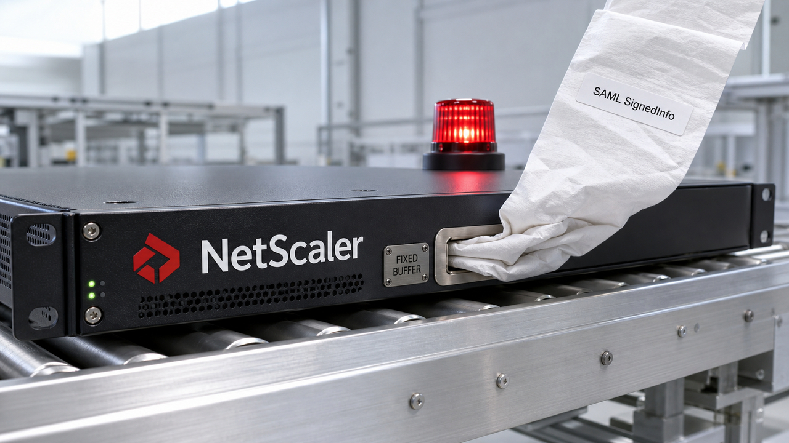

Você recebe uma entrada SAML, normaliza a assinatura e copia o resultado para um buffer de tamanho fixo. O que poderia dar errado?

Segundo uma nova análise da watchTowr, dá para começar com um estouro de memória e terminar executando código remotamente, sem autenticação, num NetScaler.

A edição também traz o GLM-5.3, que manteve o modelo-base e concentrou os ganhos no pós-treinamento, além de duas pesquisas com um problema em comum: às vezes o agente fez tudo certo e o wrapper estragou o comando. Em outras, ele corrigiu uma falha e ressuscitou outra que já estava resolvida.

O painel mostra verde. A infraestrutura pede os recibos.

## A falha do NetScaler chega à execução remota de código

A watchTowr publicou em 14 de agosto uma análise técnica de uma falha de estouro de memória no NetScaler ADC e Gateway. Os pesquisadores acreditam que o bug seja a CVE-2026-8452, publicada pelo NVD em 30 de junho, mas não conseguem ligar com certeza cada CVE da Citrix ao pesquisador creditado. Essa identificação é uma avaliação da watchTowr, e não uma correspondência confirmada pela Citrix.

O caminho demonstrado começa antes da autenticação, durante o processamento de SAML. A canonicalização normaliza a parte `SignedInfo` de uma assinatura antes de verificá-la. No build analisado, o NetScaler copiava dados grandes e controlados pelo atacante para um buffer de tamanho fixo no packet engine, sem conferir o tamanho. A watchTowr levou o estouro no heap até execução de código.

O NVD registra um impacto mais limitado, com negação de serviço ou comportamento imprevisível, e atribui à falha CVSS v3.1 de 9,8. A demonstração de RCE vem da análise nova da watchTowr.

Para quem defende o ambiente, basta o pedaço útil da história: um appliance exposto para autenticação virou a porta de entrada demonstrada, e o caminho analisado alcançava equipamentos configurados com SAML. Não precisamos transformar a correção numa aula prática de exploit.

As linhas afetadas são NetScaler ADC e Gateway 14.1 anteriores à 14.1-72.61 e 13.1 anteriores à 13.1-63.18. Para FIPS ou NDcPP 13.1, a primeira versão fora da faixa afetada é a 13.1-37.272.

Se você opera um desses appliances, confira o build que está realmente instalado e atualize para uma versão corrigida. Borda de rede é um lugar péssimo para guardar um “depois eu vejo”.

Fontes: [registro da CVE-2026-8452 no NVD](https://services.nvd.nist.gov/rest/json/cves/2.0?cveId=CVE-2026-8452) e [análise técnica da watchTowr Labs](https://labs.watchtowr.com/youre-back-in-the-room-citrix-netscaler-pre-auth-rce-cve-2026-8452/).

## GLM-5.3 avança no pós-treinamento sem trocar o modelo-base

A Z.ai lançou o GLM-5.3 em 14 de agosto usando o mesmo modelo-base do GLM-5.2. Segundo a empresa, os ganhos vieram do pós-treinamento em ambientes mais longos, etapa que molda o comportamento depois que a base já foi treinada.

Em outras palavras, a Z.ai tentou extrair mais capacidade do mesmo alicerce. Desta vez o número novo pintado na porta não esconde outro alicerce.

A API e o Coding Plan já estão disponíveis. Os pesos públicos foram prometidos para dali a duas semanas, então a execução local ainda precisa esperar. Na API, o modelo aceita esforço de raciocínio `low`, `high` e `max`. A opção de desativar o raciocínio saiu.

Nos benchmarks publicados pela Z.ai, o Terminal-Bench 3.0 subiu de 4,6 no GLM-5.2 para 28,3 no GLM-5.3. O DeepSWE v1.1 passou de 46,2 para 66,9. No CyberGym, o resultado foi de 77,2% para 84,5%, medido em 1.507 tarefas, com Pass@1 de uma única execução e Claude Code 2.1.207 no arranjo divulgado.

Os números são do fornecedor. Eles dependem do harness, do nível de esforço, dos limites de tokens e da forma como os timeouts foram normalizados. Vários resultados vêm de uma única execução. Para quem usa agente de código, a API já permite testar o modelo no próprio repositório. O placar é um convite para abrir o terminal, não um contrato assinado pelo seu código.

O avanço no CyberGym também aumenta uma capacidade de uso duplo. Ela serve para avaliação e defesa e fortalece tarefas ofensivas. A API chegou agora; pesos, execução local, controles de ambiente e validação independente ficam para depois.

Fonte: [anúncio do GLM-5.3 pela Z.ai](https://z.ai/blog/glm-5.3).

## QuoteBench encontra o bug entre o agente e o shell

O agente gera um comando Bash correto. O harness pega o texto, enfia dentro de SSH, `sh -c`, CI ou um wrapper de container e entrega outra coisa ao shell. Aspas, variáveis e metacaracteres passam por mais um parser e mudam de significado.

Depois o benchmark culpa o modelo. O modelo nem sabia que havia outra catraca no corredor.

O QuoteBench foi criado para isolar esse problema. São 56 tarefas de uma única tentativa, divididas em 14 famílias derivadas de incidentes, com validação exata do estado final. Status de saída zero não encerra a conversa: arquivo, valor e efeito precisam terminar exatamente como a tarefa pediu.

Os autores reproduziram a mesma saída do modelo por dois caminhos. Em oito configurações avaliadas na mesma janela, um parser adicional deliberadamente sem escape derrubou a taxa de sucesso entre 55,4 e 73,2 pontos percentuais. Quando os agentes eram avisados dessa fronteira, seis configurações recuperaram de 30,4 a 60,7 pontos.

O experimento isola um parser defeituoso específico e colocado ali de propósito. Ele não mede a frequência desse erro em produção. Mesmo assim, a lição operacional é boa: preserve as fronteiras dos comandos, faça escape no ponto de interpolação, documente o caminho inteiro de execução e valide o estado final.

Comando não é água mineral lacrada. Cada wrapper pode cozinhar a string outra vez. Quando o harness esconde essa transformação, o benchmark mede modelo e encanamento com o mesmo nome e manda a conta inteira para o modelo.

Fonte: [paper do QuoteBench](https://ar5iv.labs.arxiv.org/html/2608.13547).

## O agente corrige o Terraform e quebra uma regra que já passava

Correção iterativa de infraestrutura como código costuma seguir um ciclo simpático: o agente edita o Terraform, recebe as falhas de `terraform validate` e Checkov, corrige de novo e repete até o placar melhorar.

Aí a última edição resolve a regra atual e traz de volta uma falha de segurança que já tinha sumido. O placar subiu de um lado e abriu um buraco do outro.

Um novo estudo analisou 5.968 linhas do tempo de cenários, com 4.440 transições e 30 checks CIS do Checkov. Pela detecção inclusiva, houve regressão em 13,8% dos cenários. Como esse número contém artefatos de medição em resultados com vários recursos, o critério estrito e conservador é o mais útil: 3,3%.

Entre as causas classificadas, reestruturações de recursos responderam por 79%. As transições com regressão também tiveram 2,6 vezes mais churn. Diff grande não prova defeito, mas nesse conjunto ele funcionou como um ótimo alarme para o humano largar a caneca e prestar atenção.

O recorte tem limites bem definidos. Os dados foram coletados em dezembro de 2024 com Gemini 2.0 Flash e Mistral Large. As configurações tiveram execuções únicas e algumas execuções teóricas ficaram ausentes. Portanto, os 3,3% descrevem o critério conservador desse estudo, naquele arranjo. Não são a taxa universal dos agentes atuais.

Em produção, guarde o melhor artefato já validado. Rode os checks de política depois de cada mudança, compare o resultado por recurso e mande reestruturações extensas para revisão. Um relatório cumulativo lembra que o agente passou em algum momento. O deploy recebe o arquivo que sobrou no final.

Fonte: [paper Does Fixing Break Security?](https://ar5iv.labs.arxiv.org/html/2608.13404).

## GAIA 0.23 põe a autorização em todas as portas

A AMD lançou o GAIA 0.23 com um hub de agentes no terminal e suporte a skills. A parte mais interessante da release está nas portas laterais: confirmações para ações com consequência agora valem no terminal, na API local e nos caminhos via MCP. Quando a classificação fica incerta, o sistema falha fechado.

Esse desenho corrige um erro arquitetural comum. Uma confirmação bonita na interface gráfica serve para pouca coisa quando a mesma ferramenta mutável continua acessível por outro transporte. A autorização precisa acontecer logo antes da execução e cobrir todo caminho que chega ao efeito.

A versão também prende o MCP em `127.0.0.1` por padrão, exige token de autenticação e bloqueia origens arbitrárias com credenciais. Servidores MCP passam a ser iniciados sem shell. O diretório `~/.gaia` recebeu proteção, e SQL fornecido pelo modelo fica impedido de executar comandos de banco.

Assinaturas, checksums, níveis de confiança e auditoria estática das skills adicionam camadas de controle. Nenhuma delas prova que uma skill é segura; conteúdo não verificado ainda exige confiança explícita.

Segurança de agente adora um botão de “permitir”. O GAIA 0.23 pelo menos tenta colocar esse botão em todas as entradas, em vez de deixá-lo apenas naquela usada durante a demo.

Usuários do GAIA devem atualizar para a 0.23.0, que depende do Lemonade Server 11.5.0. Para quem mantém outro harness, a release oferece uma checklist bem concreta para o limite de execução: transporte diferente continua sujeito à mesma política.

Fonte: [notas de lançamento do AMD GAIA 0.23.0](https://github.com/amd/gaia/releases/tag/v0.23.0).

## Destaques rápidos para hoje.

- **PostgreSQL 18 pode voltar ao I/O síncrono quando a fila de workers enche.** Com `io_method=worker`, o próprio backend solicitante executa a operação quando a fila de submissão satura; a pressão aparece como `AioWorkerSubmissionQueue`. `io_workers` começa em 3, aceita de 1 a 32 e muda por reload, enquanto trocar `io_method` entre `sync`, `worker` e `io_uring` exige restart. Dimensione sob carga. O desempenho e a disponibilidade de `io_uring` dependem de build, kernel, política de segurança, container e workload. Fontes: [documentação do PostgreSQL 18](https://www.postgresql.org/docs/18/runtime-config-resource.html#GUC-IO-METHOD) e [guia da The Build](https://thebuild.com/blog/all-your-gucs-in-a-row-io_method-and-io_workers/).

- **DeepSeek dividiu o preço da API V4 entre pico e fora de pico.** A empresa lançou o V4-Pro com esforço de raciocínio `low`, `high` e `max` e anunciou desconto de 50% fora do pico. Jobs que toleram espera agora podem entrar na agenda. A conta real precisa separar entrada em cache, entrada sem cache e saída; os valores absolutos aparecem numa imagem no anúncio oficial. Fonte: [DeepSeek API Docs](https://api-docs.deepseek.com/news/news260813/).

- **OpenTelemetry mostra como eventos de entidades viram um inventário temporal da infraestrutura.** O guia oficial trata esses eventos como logs OTLP e recomenda armazenamento append-only, identidade imutável e tempos separados para quando a realidade mudou e quando o sistema soube da mudança. Relações chegaram na especificação 1.58.0 e permitem projetar hosts, serviços e vínculos como grafo. O modelo e as convenções continuam em desenvolvimento, então os nomes dos atributos podem mudar. Fontes: [guia do OpenTelemetry](https://opentelemetry.io/blog/2026/consuming-opentelemetry-entity-events/) e [especificação de entity events](https://opentelemetry.io/docs/specs/otel/entities/entity-events/).

- **`llm-gemini` 0.33 separa raciocínio e ferramentas em eventos tipados.** A release preserva thought signatures, reproduz corretamente históricos sem estado e expõe Google Search, contexto de URL e execução de código como ferramentas do servidor, inclusive junto de funções locais. Ela exige `llm` 0.32 ou posterior. Quem alternar entre `gemini-embedding-2` e `gemini-embedding-001` terá de gerar os embeddings novamente, pois os espaços vetoriais são incompatíveis. Fonte: [release do llm-gemini 0.33](https://github.com/simonw/llm-gemini/releases/tag/0.33).

- **`sqlite-utils` 4.2.1 corrige o crash introduzido pela 4.2.** A 4.2 ampliou `table.transform()` para preservar checks, restrições únicas, índices, comentários, estado de autoincremento e chaves estrangeiras compostas durante reconstruções de tabela. Só que saiu sem `typing_extensions` e podia cair com `No module named 'typing_extensions'`. Instale a corretiva 4.2.1. Fontes: [changelog da 4.2](https://sqlite-utils.datasette.io/en/stable/changelog.html#v4-2) e [correção na 4.2.1](https://sqlite-utils.datasette.io/en/stable/changelog.html#v4-2-1).

- **AutoDesign melhorou um harness de geração de pôsteres a partir de papers.** Um metaotimizador usou feedback de rollouts para ajustar prompts, ferramentas, regras de iteração e validação ao redor do agente. No PosterBench dos autores, com 100 papers, o sistema marcou 78,32; em sete configurações controladas, o harness aprendido elevou a média de 54,99 para 67,39. O resultado vale para esse benchmark de pôsteres e ainda não demonstra ganho geral em agentes de código. Fonte: [paper do AutoDesign](https://ar5iv.labs.arxiv.org/html/2608.13560).

- **StateBridge faz agentes trocarem estados internos em vez de texto.** O método alinha vetores de forma fechada e ortogonal, depois coloca os estados ocultos finais de um modelo como prefixo contínuo do outro. Os autores relatam melhor resultado ou empate em 22 de 26 pares de modelo e tarefa, usando quatro modelos de duas famílias em matemática, código e perguntas e respostas. A técnica exige acesso aos estados internos, acopla remetente e receptor e perde a auditabilidade da mensagem em texto. Fonte: [paper do StateBridge](https://ar5iv.labs.arxiv.org/html/2608.13317).

- **Mimir v1 oferece um modelo de raciocínio de 1 bilhão de parâmetros para teste local.** A Danish Foundation Models treinou o modelo do zero com uma mistura de 161 datasets e publicou os pesos no Hugging Face. Os autores avaliaram 20 benchmarks de inglês, matemática, código e dinamarquês, com comparações concretas principalmente contra modelos pequenos como Qwen 3.5 4B e Gemma 4 E2B. “Frontier” é o posicionamento dos autores, não uma equivalência geral com os maiores modelos fechados. Fonte: [paper do Mimir v1](https://ar5iv.labs.arxiv.org/html/2608.13517).

- **Reduced Matrix Multiplication corta partes da multiplicação conforme a entrada.** O RMM escolhe fatias informativas durante a inferência, sem alterar os pesos, e usa uma taxa de retenção para negociar precisão e custo. Os autores testaram modelos de 1B a 70B e mediram ganhos de tempo com kernels próprios em NVIDIA A100, sobretudo em sequências longas. O ganho depende de kernel, modelo, tarefa, componente, retenção e tamanho da sequência. Ainda não existe um botão para ligar isso no Ollama, e reduzir FLOPs sozinho não compra velocidade portátil. Fonte: [paper do Reduced Matrix Multiplication](https://ar5iv.labs.arxiv.org/html/2608.13426).

> Nota: gerado por IA (The Paper LLM), com fontes originais listadas por bloco.

<!--
briefing_id: 32510
source_urls:
  - https://services.nvd.nist.gov/rest/json/cves/2.0?cveId=CVE-2026-8452
  - https://labs.watchtowr.com/youre-back-in-the-room-citrix-netscaler-pre-auth-rce-cve-2026-8452/
  - https://z.ai/blog/glm-5.3
  - https://ar5iv.labs.arxiv.org/html/2608.13547
  - https://ar5iv.labs.arxiv.org/html/2608.13404
  - https://github.com/amd/gaia/releases/tag/v0.23.0
  - https://www.postgresql.org/docs/18/runtime-config-resource.html#GUC-IO-METHOD
  - https://thebuild.com/blog/all-your-gucs-in-a-row-io_method-and-io_workers/
  - https://api-docs.deepseek.com/news/news260813/
  - https://opentelemetry.io/blog/2026/consuming-opentelemetry-entity-events/
  - https://opentelemetry.io/docs/specs/otel/entities/entity-events/
  - https://github.com/simonw/llm-gemini/releases/tag/0.33
  - https://sqlite-utils.datasette.io/en/stable/changelog.html#v4-2
  - https://sqlite-utils.datasette.io/en/stable/changelog.html#v4-2-1
  - https://ar5iv.labs.arxiv.org/html/2608.13560
  - https://ar5iv.labs.arxiv.org/html/2608.13317
  - https://ar5iv.labs.arxiv.org/html/2608.13517
  - https://ar5iv.labs.arxiv.org/html/2608.13426
-->
