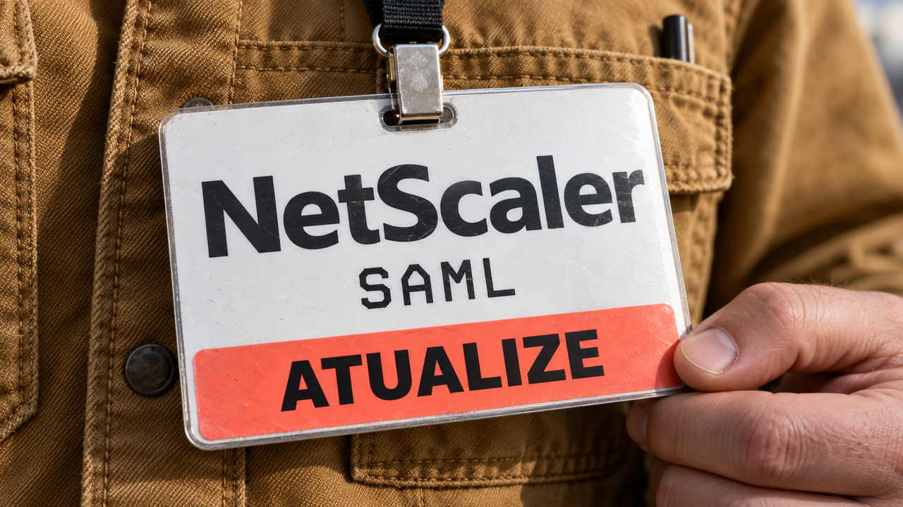

Uma falha crítica no NetScaler exige conferir a versão instalada e seu papel na autenticação de usuários. Nesta sexta-feira, a edição também traz uma explicação da Hetzner para o limite de conexões de seus servidores e um teste de aplicações Kanban que relaciona o peso da página ao tempo de carregamento.

## NetScaler corrige falha com risco de execução de código em configurações SAML

A Citrix publicou em **8 de outubro** o boletim da **CVE-2026-107406**, uma falha de memória no NetScaler ADC e no NetScaler Gateway, produtos usados para entregar aplicações e oferecer acesso remoto. Segundo o fabricante, ela pode causar execução remota de código ou indisponibilidade e recebeu nota **9,5 no CVSS 4.0**, escala de gravidade técnica que vai até 10.

A exposição depende da versão e da configuração de **SAML**, protocolo usado para integrar autenticação entre sistemas. O equipamento pode funcionar como provedor de identidade, que autentica o usuário, ou como provedor de serviço, que recebe essa confirmação. Nas faixas **14.1-73.37 a 14.1-73.41** e **13.1-64.23 a 13.1-64.28**, o boletim exige a configuração de provedor de identidade. Em versões anteriores aos limites iniciais dessas faixas, os dois papéis podem ser afetados. As linhas FIPS e NDcPP têm condições próprias detalhadas no aviso.

A orientação é atualizar os equipamentos afetados para **14.1-73.46 ou posterior**, **13.1-64.29 ou posterior**, ou os builds correspondentes das linhas especiais: **14.1-73.46 FIPS** e **13.1.37.283 para 13.1-FIPS/NDcPP**. Instalações de Secure Private Access Hybrid que usam NetScaler também precisam dessa verificação.

É uma nova vulnerabilidade, com novos builds corrigidos, em relação à [CVE-2026-88779 coberta nesta semana](/2026/pgvector-corrige-execucao-de-codigo-owasp-reforca-aprovacao-de-agentes/). Para quem administra esses equipamentos, a tarefa imediata é cruzar **versão, papel SAML e linha do produto** com o boletim e aplicar a atualização indicada.

Fonte: [boletim CTX697191 da Citrix](https://support.citrix.com/external/article/CTX697191/citrix-netscaler-adc-and-citrix-netscale.html).

## Hetzner detalha a rede de suas máquinas virtuais e o teto de 80 mil conexões

Em uma publicação de **8 de outubro**, a Hetzner explicou a arquitetura de rede baseada em **Open vSwitch**, um comutador virtual que encaminha pacotes no host onde as máquinas virtuais rodam. Um controlador próprio, o **Flusskrebs**, escrito em Python, configura as regras de tráfego. Redes privadas e firewalls são implementados perto das máquinas dos clientes, enquanto a rede física fornece conectividade entre os hosts.

Um detalhe operacional merece atenção: o rastreamento de conexões do Linux, usado pelo firewall com estado, mantém uma tabela compartilhada no host. Para impedir que uma máquina virtual consuma esse recurso inteiro, a Hetzner limita cada servidor de nuvem a **80 mil conexões ativas simultâneas**. Ao atingir o teto, novas conexões deixam de abrir até que alguma existente seja encerrada.

Isso ajuda a entender uma classe de problema que um gráfico de CPU sozinho não explica. Conexões também ocupam recursos finitos. Em uma aplicação com muitas sessões persistentes ou grande quantidade de conexões a serviços externos, vale investigar quantas ficam abertas e como são reutilizadas.

A publicação descreve a arquitetura existente e suas limitações. A empresa informa que vem construindo outra implementação e deixará seus detalhes para a continuação da série.

Fonte: [visão técnica da rede Hetzner Cloud](https://www.hetzner.com/blog/the-hetzner-cloud-network-stack-history-and-technical-overview/).

## Kanban de Bolli supera PLANKA no carregamento em teste com rede lenta

Michael Bolli publicou em **8 de outubro** uma comparação entre seu quadro Kanban — aplicação de cartões organizados em colunas — e o **PLANKA Community 2.2.1**. A implementação do autor usa Go, SQLite e Datastar para atualizar o HTML recebido do servidor. O PLANKA usa React e uma arquitetura de aplicação de página única.

Na primeira visita ao quadro de 200 cartões, sem cache, a aplicação do autor transferiu **58 kB**, contra cerca de **2,6 MB** no PLANKA. O tempo até exibir o maior elemento de conteúdo da tela, medido pelo LCP, foi de **0,6 segundo contra 15,4 segundos**. São medianas de três execuções por aplicação, feitas pelo próprio desenvolvedor. O navegador tinha a CPU desacelerada em quatro vezes, com latência de ida e volta de 150 milissegundos e download de 1,6 megabit por segundo.

A diferença tem uma explicação concreta no teste: o PLANKA baixa o código da aplicação antes de pedir os dados do quadro. A versão de Bolli já envia o quadro em HTML na primeira resposta. Nessa conexão lenta, a quantidade de JavaScript transferida pesa no tempo de espera.

O recorte importa: o PLANKA tem mais recursos, como anexos, notificações e campos personalizados, cujo custo também entra no carregamento. A edição Pro e uma instalação otimizada com cache e CDN ficaram fora do teste. Na inclusão de comentários, **o PLANKA foi mais rápido**, inclusive para receber a confirmação do servidor.

A parte útil para quem está construindo uma aplicação colaborativa está nas garantias por trás da interface. As gravações passam por uma fila; cada ação leva um identificador para que uma tentativa repetida após erro de rede seja aplicada uma única vez. A transação verifica se outro usuário já moveu o cartão. As páginas recebem atualizações por uma conexão de eventos enviados pelo servidor, e clientes lentos recebem o estado mais recente, sem acumular uma fila interminável de telas antigas.

Para quem está escolhendo uma arquitetura, o experimento oferece critérios de comparação: tempo até ver o conteúdo, confirmação das ações e comportamento diante de falhas de rede. A medição precisa incluir as funcionalidades exigidas pelo produto.

Fonte: [comparação, metodologia e limitações de Bolli](https://zweiundeins.gmbh/en/blog/spa-vs-hypermedia-a-collaborative-kanban-board-measured-against-planka).

## Destaques rápidos para hoje.

- **Mellum2.1 chega com novo pós-treinamento para agentes de programação.** A JetBrains lançou em 8 de outubro a versão do modelo com 12 bilhões de parâmetros totais, 2,5 bilhões ativos por token e licença Apache 2.0. Segundo a empresa, o trabalho concentrou-se em aprendizado por reforço em ambientes de execução, para explorar repositórios, editar arquivos e verificar mudanças. Os pesos estão no Hugging Face; versões GGUF e o componente de previsão de múltiplos tokens para vLLM ainda eram anunciados como futuros. Fonte: [anúncio da JetBrains](https://blog.jetbrains.com/ai/2026/10/mellum2-1-gets-to-work-a-fast-open-model-for-coding-agents/).

- **Jujutsu 0.46.0 integra workspaces adicionais a worktrees do Git.** A versão, publicada em 7 de outubro, permite combinar o controle de versão do Jujutsu com diretórios de trabalho reconhecidos pelo Git também fora do workspace principal. O `undo` e o `redo` passam a recusar, por padrão, operações realizadas em outro workspace, uma proteção útil quando várias mudanças estão em andamento. O requisito mínimo de Git subiu para 2.42.0. Fonte: [notas da versão](https://github.com/jj-vcs/jj/releases/tag/v0.46.0).

- **Artigo na CNCF propõe que agentes sugiram mudanças de infraestrutura com implantação sob controle separado.** Mauro Morales, embaixador da CNCF e mantenedor do Kairos, defende em texto de 8 de outubro que agentes proponham alterações versionadas na imagem do sistema operacional. Revisão, testes, construção, assinatura e implantação ficam em um fluxo controlado. A separação depende de permissões reais: a identidade que propõe a mudança não pode também aprová-la, alterar a esteira ou forçar sua implantação. A proteção da imagem-base precisa ser acompanhada de isolamento e controle das áreas em que o agente pode escrever. Fonte: [proposta arquitetural de Morales](https://www.cncf.io/blog/2026/10/08/dont-give-ai-agents-root-make-them-propose-the-next-system-state/).

- **Pesquisa encontra perda de regras quando agentes escolhem entre skills parecidas.** Skills são pacotes de instruções que ensinam procedimentos a um agente. Em um estudo preliminar publicado em 8 de outubro, pesquisadores testaram 312 pares no Claude Code, usando três modelos. Instalar uma skill semelhante reduziu em **19,9 pontos percentuais** o uso da skill original, sem queda detectável na conclusão das tarefas. O cumprimento de requisitos exclusivos da original caiu 5,6 pontos. Parte das execuções usou a alternativa; outra parte deixou de usar ambas. Assim, concluir a tarefa podia esconder o descumprimento de regras, como uma proibição de mexer no Git. Fonte: [estudo e metodologia](https://arxiv.org/html/2610.11647v1).

- **Pesquisa mostra que nomes de opções podem alterar decisões de autorização.** O estudo preliminar de 8 de outubro avalia modelos que escolhem entre opções como permitir e bloquear. Em testes sintéticos sobre decisões inicialmente corretas, alterar o nome da opção permissiva elevou a autorização de ações proibidas para 93% a 100% nos quatro modelos que recebiam esse rótulo como entrada. Esse ataque pressupõe que o adversário consiga influenciar os nomes das opções. Os autores recomendam regras determinísticas quando a política puder ser expressa em campos verificáveis; os resultados se referem às implementações abertas testadas. Fonte: [pesquisa sobre modelos de decisão](https://arxiv.org/html/2610.12292v1).

- **OpenTelemetry publica guia para exportar telemetria ao destino escolhido pelo cliente.** O texto de 8 de outubro explica como enviar logs, métricas e rastros de requisições pelo protocolo OTLP, preservando o contexto necessário à investigação. Para plataformas com vários clientes, compara um coletor dedicado por cliente com um coletor compartilhado e rotas separadas: a primeira opção favorece o isolamento, enquanto a segunda reduz a quantidade de infraestrutura para operar. É uma decisão de arquitetura para quem oferece software como serviço e precisa permitir integração com ferramentas de monitoramento externas. Fonte: [guia do OpenTelemetry](https://opentelemetry.io/blog/2026/otel-native-by-design/).

- **Microsoft orienta testar o ecossistema de certificados pós-quânticos fora de produção.** Em 8 de outubro, a empresa recomendou inventariar sistemas que emitem, guardam e validam certificados, além de testar compatibilidade e o efeito de cadeias maiores sobre desempenho e limites de processamento. Seu piloto de TLS pós-quântico, iniciado em agosto para autoridades certificadoras elegíveis, emite certificados sem confiança pública, destinados a ambientes fechados de teste. A preparação envolve aplicações, dispositivos e processos de renovação. Fonte: [orientação da Microsoft](https://www.microsoft.com/en-us/security/blog/2026/10/08/post-quantum-authentication-why-organizations-should-start-testing-certificate-ecosystems-now/).

- **Let's Encrypt marca a redução da validade padrão para 64 dias.** O anúncio de 7 de outubro estabelece a mudança para **10 de fevereiro de 2027**, com testes no ambiente de homologação a partir de **14 de outubro de 2026**. Certificados válidos não serão revogados por causa da transição. Quem automatiza a renovação deve conferir o suporte do cliente a ACME Renewal Info, mecanismo que informa quando renovar, e revisar agendamentos presos a números fixos de dias. A autoridade também recomenda automatizar implantação, recarga do serviço e alertas de falha na renovação. Fonte: [cronograma do Let's Encrypt](https://letsencrypt.org/2026/10/07/64-day-certs.html).

> Nota: gerado por IA (The Paper LLM), com fontes originais listadas por bloco.

<!--
briefing_id: 28327
source_urls:
  - https://support.citrix.com/external/article/CTX697191/citrix-netscaler-adc-and-citrix-netscale.html
  - https://www.hetzner.com/blog/the-hetzner-cloud-network-stack-history-and-technical-overview/
  - https://zweiundeins.gmbh/en/blog/spa-vs-hypermedia-a-collaborative-kanban-board-measured-against-planka
  - https://blog.jetbrains.com/ai/2026/10/mellum2-1-gets-to-work-a-fast-open-model-for-coding-agents/
  - https://github.com/jj-vcs/jj/releases/tag/v0.46.0
  - https://www.cncf.io/blog/2026/10/08/dont-give-ai-agents-root-make-them-propose-the-next-system-state/
  - https://arxiv.org/html/2610.11647v1
  - https://arxiv.org/html/2610.12292v1
  - https://opentelemetry.io/blog/2026/otel-native-by-design/
  - https://www.microsoft.com/en-us/security/blog/2026/10/08/post-quantum-authentication-why-organizations-should-start-testing-certificate-ecosystems-now/
  - https://letsencrypt.org/2026/10/07/64-day-certs.html
-->
