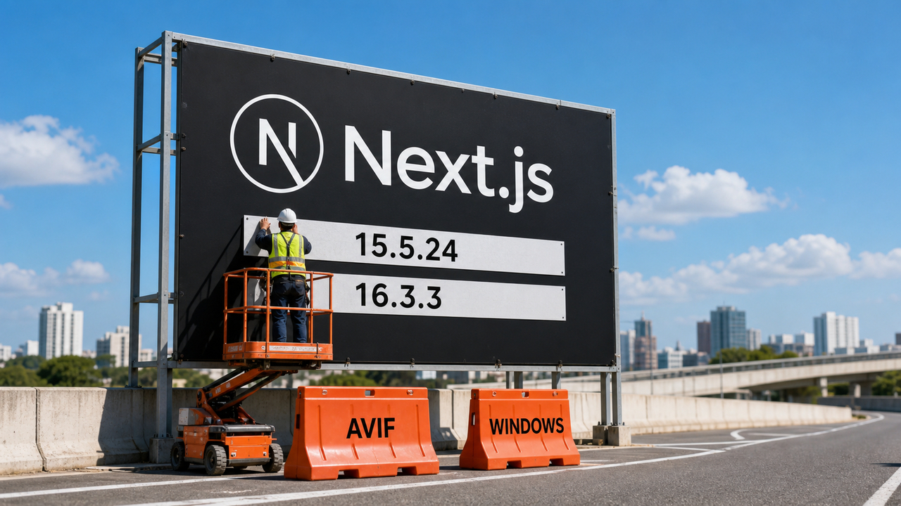

Você atualiza o `package.json`, o lockfile fica uma beleza e todo mundo vai dormir em paz. Enquanto isso, o container antigo continua no ar, executando exatamente a versão vulnerável que você jurou ter corrigido. A Vercel lançou duas atualizações críticas do Next.js que deixam a diferença entre arquivo e produção bem menos filosófica.

A segurança aparece em outra camada hoje. Dois papers novos mostram harnesses de agentes pegando dados não confiáveis, reconstruindo o contexto e devolvendo aquilo ao modelo com autoridade maior. Depois a Cloudflare dá um descanso ao sistema nervoso: cinco mudanças no layout de dados em Rust tiraram cerca de 100 terabytes de um cache DNS. Às vezes a infraestrutura não quer IA. Quer uma `String` menor.

## Next.js corrige duas rotas críticas até execução remota

A Vercel lançou o Next.js 15.5.24, na linha Maintenance LTS, e o 16.3.3, na Active LTS. As duas versões corrigem vulnerabilidades críticas que podem levar à execução remota de código sem autenticação. Mesmo quem aplicou a atualização de segurança de julho precisa instalar a de agosto.

A primeira falha mora no caminho de otimização de imagens AVIF. Quando uma aplicação entrega conteúdo controlado pelo atacante à Image Optimization API, o Next.js delega a decodificação ao `sharp`, que usa a biblioteca `libheif`. A dependência roda durante a requisição e faz parte da superfície de ataque da aplicação. A Vercel deu CVSS 9.5 ao problema.

As versões corrigidas desativam o caminho vulnerável de otimização AVIF enquanto a correção da biblioteca percorre a cadeia de dependências. Essa é a mitigação: o update interrompe o uso do decoder afetado. A retomada segura desse processamento depende da correção da biblioteca upstream.

A segunda vulnerabilidade, CVE-2026-75604, recebeu CVSS 9.0 e começa com uma travessia de diretórios. O cenário aqui é bem específico: aplicações no Windows que combinam Pages Router e App Router sem Cache Components. Linux e macOS ficam fora desse caso.

Se você hospeda Next.js por conta própria, três perguntas resolvem o primeiro inventário. Qual versão está realmente instalada? O serviço otimiza AVIF enviado ou indicado por alguém de fora? O deploy roda em Windows com essa combinação de routers? Aí vem a parte sem glamour: instalar 15.5.24 ou 16.3.3, reconstruir a imagem, fazer o redeploy e conferir a versão dentro do artefato em execução. Manifesto atualizado não atende requisição.

Em maio, cobrimos [outras 13 falhas do Next.js](/2026/dirty-frag-nextjs-agentes-infraestrutura-cobrando-conta/), corrigidas nas linhas 15.5.18 e 16.2.6. Agora são dois caminhos críticos recém-divulgados e novos pisos de versão.

Fontes: [release de segurança do Next.js em agosto de 2026](https://nextjs.org/blog/august-2026-security-release), [advisory da falha em AVIF](https://github.com/vercel/next.js/security/advisories/GHSA-2xp9-vwfh-vxw4) e [advisory da falha no Windows](https://github.com/vercel/next.js/security/advisories/GHSA-p293-qw3h-jr36).

## O dado da ferramenta voltou vestido de chefe

Dois preprints publicados em 27 de agosto colocam nome e números num problema de harnesses para agentes de código. A ferramenta recebe conteúdo pouco confiável, mas o sistema reconstrói esse conteúdo como uma nova mensagem de usuário ou de sistema. A procedência some e a autoridade sobe. É como copiar um bilhete achado no chão para o papel timbrado da empresa e depois se espantar quando alguém obedece.

O trabalho *When Context Gets Root* avaliou 13 objetivos de ataque em seis harnesses. Com execução irrestrita, todos os objetivos funcionaram em todos eles. A lista cobria confidencialidade, integridade, disponibilidade e execução remota de código. Os autores também cumpriram todos os objetivos testados nos três harnesses que ofereciam revisão automática de permissões.

A escalada sobreviveu à chamada de ferramenta. Segundo os pesquisadores, ela reapareceu quando o sistema delegou tarefas, preservou metas ou criou execuções agendadas. O fio comum é a procedência: o harness transporta o texto, joga fora o rótulo de baixa confiança e entrega ao modelo uma instrução com autoridade que aquele dado nunca teve.

O segundo paper, *The Framing Gap*, estuda a revisão de intenção. Uma ação maliciosa com aparência inofensiva pode atravessar essa outra interpretação probabilística. No laboratório sintético do trabalho, uma lista fechada de destinos bloqueou todos os ataques por construção. Uma divisão entre planejador e leitor, cada um com suas capacidades, fechou o caminho de vazamento testado e manteve 90% da utilidade medida.

Esses números valem para os ambientes controlados dos papers. São preprints novos, e os experimentos demonstram falhas arquiteturais nas configurações avaliadas. Taxa de comprometimento e utilidade em instalações de produção dependem do produto, da configuração e do fluxo real.

A consequência prática tem menos mistério que o ataque. A procedência precisa sobreviver a delegação, memória, skills, metas e agendamento. Credenciais ficam separadas do ambiente do agente. Leitura de arquivos, escrita, rede e destinos recebem capacidades explícitas. Aprovação pelo modelo continua sendo interpretação probabilística; o limite de verdade precisa morar fora dele.

Essa direção coincide com a orientação de contenção da Anthropic: sandbox, fronteiras de filesystem, credenciais com escopo e saída de rede controlada. Em junho, falamos de [saída falsa do Sentry e contenção determinística](/2026/sentry-virou-porta-para-agentes-claude-mostrou-o-sandbox-e-roteadores-viraram-proxy/). O avanço agora é a medição da promoção de contexto em seis harnesses, inclusive por mecanismos persistentes.

Fontes: [When Context Gets Root](https://arxiv.org/html/2608.27299v1), [The Framing Gap](https://arxiv.org/html/2608.27092v1) e [orientação de contenção da Anthropic](https://www.anthropic.com/engineering/how-we-contain-claude).

## Cloudflare encontra 100 terabytes entre ponteiros e capacidade ociosa

O Big Pineapple, cache DNS da Cloudflare, mantém mais de 250 bilhões de entradas. Nessa escala, desperdiçar um byte por entrada custa mais de 250 gigabytes na frota. Aquele campinho inocente aprovado no code review já alugou um galpão.

A empresa fez cinco mudanças no layout dos dados em Rust. Segundo os resultados publicados, o consumo por entrada no benchmark caiu de 953 para 420 bytes, redução de 56%. As alocações passaram de 1,1 quilobyte para 461 bytes. Em produção, o working set agregado encolheu aproximadamente 100 terabytes.

Parte do ganho veio de representar dados imutáveis como... dados imutáveis. `Vec` e `String` carregam capacidade de crescimento mesmo quando o cache nunca pretende alterar aquele valor. Slices e strings em caixas tiram essa reserva ociosa. Outra parte veio de guardar os registros em bytes contíguos no formato de rede, reduzindo ponteiros, alocações e a serialização repetida de conteúdo já codificado.

Tem preço. O layout compacto dificulta o acesso aleatório e deixa a implementação um pouco mais complexa. Em troca, melhora a localidade de cache e alivia o alocador. Nos testes da Cloudflare, a inserção subiu de 625 mil para 893 mil entradas por segundo, alta de 43%. A latência de lookup caiu de 828 para 670 nanossegundos, redução de 19%.

As medições são da própria Cloudflare. O benchmark usa uma mistura inspirada na produção: 56% de registros A, 25% AAAA e 19% TXT. Outro cache, com dados e padrões de mutação diferentes, não ganha 100 terabytes de brinde por trocar `Vec` por slice. A lição que viaja melhor é medir quanto você paga por uma flexibilidade que os dados nunca usam.

Fonte: [relato de engenharia da Cloudflare](https://blog.cloudflare.com/dns-cache-memory-optimization-1111/).

## Destaques rápidos para hoje.

- **A polícia australiana acusou dois homens de participação principal na TeamPCP.** As buscas ocorreram em 26 de agosto, e os dois réus receberam, juntos, 14 acusações. A AFP estima mais de mil organizações potencialmente comprometidas, mais de 500 mil credenciais roubadas e ao menos 300 GB exfiltrados. São estimativas policiais; a culpa ainda não foi estabelecida e os réus têm direito à presunção de inocência. A prisão também não restaura artefato nem segredo: equipes expostas pela campanha já coberta em [Trivy, KICS e LiteLLM](/2026/litellm-python-supply-chain-attack-check/) ainda precisam preservar evidências, girar credenciais e verificar o que publicam. Fonte: [Australian Federal Police](https://www.afp.gov.au/news-centre/media-release/two-wa-men-charged-following-afp-fbi-wapf-disruption-alleged-global).

- **O Qwen3.8-Flash-Next ativa 6 bilhões de parâmetros por token e continua ocupando bem mais que um modelo de 6B.** A prévia experimental da arquitetura planejada para o Qwen4 tem 125B de parâmetros principais, 51B em embeddings n-gram e 4B em MTP, numa combinação de Gated DeltaNet e Qwen Sparse Attention. O contexto nativo é de 262.144 tokens e pode chegar a 1 milhão com extensão por RoPE, como YaRN. A ativação esparsa reduz a computação por token; armazenamento e memória precisam manter disponível o conjunto completo. Os testes de desempenho são do fornecedor. Fonte: [model card oficial do Qwen3.8-Flash-Next](https://huggingface.co/Qwen/Qwen3.8-Flash-Next).

- **O Kubernetes 1.37 tornou estável a API de métricas de recursos.** `metrics.k8s.io/v1` expõe os mesmos `NodeMetrics` e `PodMetrics` da versão beta para CPU e memória, usados por recursos como `kubectl top`. Durante a transição, as implementações precisam servir as duas versões porque o HPA do Kubernetes 1.37 continua consumindo apenas `v1beta1`. A graduação estabiliza a API; você ainda precisa de uma implementação de métricas e de outro sistema para monitoramento completo. Fonte: [Kubernetes Blog](https://kubernetes.io/blog/2026/08/27/kubernetes-v1-37-metrics-api-ga/).

- **O Flatpak recebeu €508.640 para dois anos de trabalho em sandboxing.** O plano, organizado por Modal e Para-Real com investimento da Sovereign Tech Agency, vai até o fim de 2027. Entre as entregas estão permissões de áudio mais estreitas com PipeWire, política no WirePlumber, um portal capaz de separar alto-falante de microfone e trabalho em rede, VPN e entitlements. Tudo isso está no roadmap financiado e ainda precisa ser entregue. Fonte: [anúncio do investimento no Flatpak](https://modal.cx/blog/announcing-flatpak-sta/).

- **O Ubuntu 26.04.1 LTS atualizou a mídia de instalação.** O primeiro point release do Resolute Raccoon incorpora correções acumuladas e reduz a fila de updates em máquinas novas. Sistemas 26.04 já atualizados recebem os mesmos pacotes pelo caminho normal, sem reinstalação. Usuários do 24.04 LTS receberão separadamente a oferta de upgrade para 26.04.1. Fonte: [anúncio da equipe Ubuntu](https://discourse.ubuntu.com/t/ubuntu-26-04-1-lts-released/86808).

- **Um backend do `llama.cpp` passou a carregar GGUF no Axera AX8850 sem compilar cada modelo pelo fluxo do fornecedor.** O projeto reorganiza os pesos durante o carregamento para o layout de engines pré-compiladas, com desquantização e requantização conforme as escalas do hardware. O autor relata de 24 a 30 tokens por segundo num Raspberry Pi 5 como host, com a CPU ociosa. É uma implementação pública interessante para estudar esse caminho fechado; o resultado depende da configuração e não foi reproduzido nesta apuração. Fonte: [repositório Axera-AX8850-GGUF-Support](https://github.com/woolcoxm/Axera-AX8850-GGUF-Support).

- **O `gemma4.c` colocou uma rota completa de inferência do Gemma 4 E2B em cerca de 700 linhas de C.** Tokenizador, transformer, KV cache, geração e kernels ficam num único arquivo, com pesos de matrizes em int8 e escalas FP16. O runtime educacional exige AVX2 e OpenMP, usa um arquivo de modelo de aproximadamente 5 GB e recomenda 8 GB de RAM. Ele serve como lente pequena para enxergar o mecanismo; `llama.cpp` continua cobrindo o trabalho geral. A validação e as medições vêm do autor. Fonte: [repositório gemma4.c](https://github.com/ryanssenn/gemma4.c).

- **O `iperf3` separou um gargalo de rede do restante da pilha.** No caso de Scott Hanselman, o teste direto tirou NAS, RAID, SMB, filesystem e discos da investigação. Na combinação específica de Windows com uma Intel E610-XT2, desativar IPv4 Large Send Offload V2 mudou o resultado de 313 Mbit/s para 7,03 Gbit/s. O autor não isolou se a causa estava no driver, firmware, Windows ou naquela máquina, e LSO costuma ser útil. A dica boa é medir a rede crua primeiro. Sair desligando offload em peregrinação coletiva fica para depois. Fonte: [Scott Hanselman's Blog](https://www.hanselman.com/blog/debugging-my-new-network-when-10-gigabit-ethernet-runs-at-300-megabits).

> Nota: gerado por IA (The Paper LLM), com fontes originais listadas por bloco.

<!--
briefing_id: 25819
source_urls:
  - https://nextjs.org/blog/august-2026-security-release
  - https://github.com/vercel/next.js/security/advisories/GHSA-2xp9-vwfh-vxw4
  - https://github.com/vercel/next.js/security/advisories/GHSA-p293-qw3h-jr36
  - https://arxiv.org/html/2608.27299v1
  - https://arxiv.org/html/2608.27092v1
  - https://www.anthropic.com/engineering/how-we-contain-claude
  - https://blog.cloudflare.com/dns-cache-memory-optimization-1111/
  - https://www.afp.gov.au/news-centre/media-release/two-wa-men-charged-following-afp-fbi-wapf-disruption-alleged-global
  - https://huggingface.co/Qwen/Qwen3.8-Flash-Next
  - https://kubernetes.io/blog/2026/08/27/kubernetes-v1-37-metrics-api-ga/
  - https://modal.cx/blog/announcing-flatpak-sta/
  - https://discourse.ubuntu.com/t/ubuntu-26-04-1-lts-released/86808
  - https://github.com/woolcoxm/Axera-AX8850-GGUF-Support
  - https://github.com/ryanssenn/gemma4.c
  - https://www.hanselman.com/blog/debugging-my-new-network-when-10-gigabit-ethernet-runs-at-300-megabits
-->
