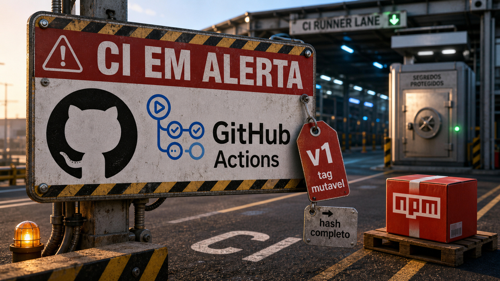

Quando o build recebe segredo, publica pacote e decide deploy, ele já está em produção, mesmo rodando num runner descartável. Hoje isso apareceu em pacote npm recém-publicado, ação de terceiro e tag que muda de lugar sem aparecer no diff do seu app.

## npm, GitHub Actions e tags mutáveis viraram risco de produção no CI

Em maio, falamos de [GitHub Actions como superfície de produção](/2026/megalodon-mostrou-que-github-actions-tambem-e-producao/). Agora o delta é bem concreto: a StepSecurity publicou, em 25 de junho, que 20 pacotes npm da Leo Platform foram comprometidos numa leva coordenada de versões maliciosas publicada em 24 de junho.

Segundo a empresa, essas versões saíram dentro de uma janela de três segundos e carregavam um kit voltado a roubo de credenciais de CI/CD. A soma dos pacotes gira em torno de 13.600 downloads por semana. O número não tem cara de catástrofe do ecossistema inteiro, mas CI com segredo por perto não precisa de milhões de instalações para virar dor de cabeça.

A StepSecurity também descreveu, no dia 24, comprometimentos em duas ações do GitHub: `simonecorsi/mawesome` e `codfish/semantic-release-action`. Nos dois casos, ela reportou commits maliciosos empurrados para o repositório e tags de versão apontando para outro lugar. Quem usava a ação por tag podia rodar código diferente sem mudar uma linha no repositório da aplicação.

Essa é a parte que costuma parecer detalhe até quebrar. Tag é apelido mutável. Hash completo de commit é endereço bem mais específico. Em caminho crítico de build, publicação, deploy e release, essa diferença não é preciosismo de segurança. É controle de mudança.

O contexto de Snyk sobre Phantom Gyp e Miasma lembra outra porta. Pacote npm pode executar coisa na instalação por caminhos que não aparecem como um script óbvio no `package.json`; `binding.gyp`, por exemplo, entra no fluxo de build nativo e pode virar veículo de execução. Se isso acontece dentro de um runner com token de GitHub, chave de registro, segredo de cloud ou credencial de release, o pacote deixou de ser só dependência.

Para reduzir o estrago, o caminho é chato e bom: pinar ações críticas por hash completo de commit, reduzir permissão do token do runner, usar lockfile com disciplina, criar uma espera mínima antes de consumir versão recém-publicada em CI e controlar scripts de instalação quando fizer sentido. Se uma referência afetada rodou durante a janela ruim, trate segredo acessível como exposto e investigue antes de seguir vida.

Fontes: [StepSecurity sobre Leo Platform](https://www.stepsecurity.io/blog/mass-npm-supply-chain-attack-20-leo-platform-packages-compromised), [StepSecurity sobre simonecorsi/mawesome](https://www.stepsecurity.io/blog/simonecorsi-mawesome-github-action-has-been-compromised), [StepSecurity sobre codfish/semantic-release-action](https://www.stepsecurity.io/blog/supply-chain-compromise-codfish-semantic-release-action) e [Snyk sobre Phantom Gyp/Miasma](https://snyk.io/blog/node-gyp-supply-chain-compromise-self-propagating-npm-worm-binding-gyp/).

## Anthropic acusa Alibaba de consultar Claude em escala para distillation

Os números são grandes, então a linguagem precisa ficar com o pé no chão. Reuters e Business Insider reportaram que a Anthropic enviou uma carta, em 10 de junho, a senadores dos Estados Unidos, acusando operadores ligados à Alibaba e à família Qwen de usar Claude em escala para extrair capacidades do modelo.

Pelos relatos públicos, a Anthropic fala em mais de 28,8 milhões de trocas com Claude entre 22 de abril e 5 de junho de 2026, usando quase 25.000 contas fraudulentas. A suspeita atribuída à empresa é que esse volume teria servido para melhorar capacidades de engenharia de software e raciocínio agente em outros modelos.

Distillation, nesse contexto, é uma ideia simples de explicar e difícil de policiar: você consulta um modelo forte muitas vezes, guarda as respostas e usa esse material para treinar ou ajustar outro modelo. É como pedir ajuda ao aluno mais avançado da sala em todos os exercícios, só que com API, conta falsa e planilha de custo no meio.

As reportagens públicas não trazem comprovação independente da conduta atribuída à Alibaba. Também não dá para afirmar, com essas fontes, que um modelo específico ganhou uma capacidade específica por causa dessa campanha. O fato jornalístico aqui é a acusação da Anthropic e os números reportados a partir da carta.

Para dev, a história sai rápido da geopolítica e cai em arquitetura. Saídas de modelo viraram ativo estratégico. API de modelo virou superfície de abuso. E custo virou peça de desenho de sistema, especialmente quando modelos open-weight mais baratos pressionam o preço de modelos fechados. Open-weight também não é sinônimo automático de open-source; é outro tipo de abertura, com outra conversa de licença, execução e controle.

Podemos esperar mais verificação de identidade, limite de taxa, detecção de abuso, contrato com cláusula sobre distillation e roteamento de modelo por custo. Quem monta agente de código também entra nessa conta: cada chamada grande demais vira dinheiro, risco e sinal para alguém monitorar.

Fontes: [Reuters](https://www.reuters.com/world/china/anthropic-says-alibaba-illicitly-extracted-claude-ai-model-capabilities-2026-06-24/), [Business Insider](https://www.businessinsider.com/anthropic-china-alibaba-exploiting-ai-models-distillation-attack-2026-6) e [James O'Claire](https://jamesoclaire.com/2026/06/25/the-unbearable-cheapness-of-open-weight-models/).

## TypeScript 7 RC troca o motor para Go sem trocar a linguagem

O TypeScript 7.0 RC já está disponível via `typescript@rc`, e a mudança por baixo é grande: a Microsoft portou o compilador para Go. A promessa oficial é manter a semântica do TypeScript 6, mas ganhar velocidade por código nativo e paralelismo com memória compartilhada.

O número que chama atenção é "muitas vezes cerca de 10x mais rápido", segundo a Microsoft. Use isso como motivo para testar, não como desculpa para atualizar CI sem medir. Código grande, plugin, monorepo, configuração de editor e tipo de erro podem mudar bastante a sensação real.

A migração também tem freio explícito. O suporte de editor passa pelo Language Server Protocol, então a história não fica presa só ao VS Code. Ao mesmo tempo, a API programática estável não deve chegar antes do TypeScript 7.1. Para ferramenta que usa a API antiga, a própria Microsoft aponta o caminho de convivência com `@typescript/typescript6` e `tsc6`.

O post oficial é de 18 de junho. Para quem vive com `tsc` segurando feedback em projeto grande, o RC merece uma branch de teste: medir type-check, editor, CI, integração com bundler e tudo que encosta na API do compilador. Se a promessa chegar perto no seu projeto, o ganho é menos glamour e mais café que não esfria esperando erro de tipo.

Fonte: [Microsoft DevBlogs](https://devblogs.microsoft.com/typescript/announcing-typescript-7-0-rc/).

## CVE-2026-20245 virou acesso root no Cisco SD-WAN, com rastros apagados

Ontem a Cisco apareceu aqui por [Unified CM](/2026/claude-tag-entra-no-slack-enquanto-dflash-promete-folego-no-blackwell/). Hoje é outro produto, outra falha e outro tipo de lição operacional: Cisco Catalyst SD-WAN, CVE-2026-20245 e limpeza anti-forense descrita pela Mandiant.

A Mandiant, no blog do Google Cloud, diz que identificou um invasor mirando infraestrutura SD-WAN em um provedor de comunicação. O caminho público descrito passa por exploração da CVE-2026-20245 para escalar de acesso administrativo para root em controladores Cisco Catalyst SD-WAN.

A Cisco trata o problema como uma falha de escalada de privilégio em controladores Catalyst SD-WAN e aponta versões corrigidas. O advisory da Cisco não traz workaround. Isso deixa pouco espaço para criatividade: inventariar versão, aplicar correção e entender se houve acesso antes do patch.

A parte que mais pesa na análise da Mandiant vem depois. O invasor teria apagado e restaurado arquivos e configurações modificadas, mexendo na trilha que alguém usaria para reconstruir o incidente. Dispositivo de rede costuma ter confiança demais e telemetria de endpoint de menos. Quando algo assim cai, o time não pode olhar para o appliance como se fosse só uma caixa preta que roteia pacote.

Para defesa, a lista fica bem direta: patch nos controladores afetados, caça por peering não autorizado, contas locais suspeitas, restauração estranha de configuração, alteração de administrador padrão e exposição de certificado ou credencial. E o limite importa: isso não é uma notícia sobre "todo Cisco da internet". É um caso específico de Catalyst SD-WAN, com exploração observada em um ambiente de provedor e escopo público ainda limitado.

Fontes: [Google Cloud / Mandiant](https://cloud.google.com/blog/topics/threat-intelligence/zero-day-exploitation-cisco-catalyst-sd-wan-manager/), [Cisco Security Advisory](https://sec.cloudapps.cisco.com/security/center/content/CiscoSecurityAdvisory/cisco-sa-sdwan-privesc-4uxFrdzx) e [BleepingComputer](https://www.bleepingcomputer.com/news/security/mandiant-reveals-how-cisco-sd-wan-zero-day-attacks-gained-root-access/).

## Destaques rápidos para hoje

- **Python sem GIL está mais perto do teste real.** A LWN resumiu a fala de Thomas Wouters na PyCon US 2026 sobre free-threaded Python: a penalidade de execução single-thread vem caindo de Python 3.13 para 3.14, e um caminho de ABI mais estável deve ajudar wheels e extensões. Ainda não é hora de declarar o GIL morto para todo mundo; é hora de medir workload, memória, latência e dependências com build free-threaded antes que o padrão mude lá na frente. Fonte: [LWN.net](https://lwn.net/SubscriberLink/1078367/eaa511915870fdb2/).

- **Cloudflare abriu OAuth self-managed e tratou revogação como confiabilidade.** Clientes agora podem criar clientes OAuth para acesso delegado às APIs da Cloudflare, reduzindo dependência de token cru em integração que precisa de consentimento e revogação. A engenharia por trás também interessa: o texto fala em Hydra, `CREATE INDEX CONCURRENTLY`, estratégia blue-green e fila/replay de revogações para não ressuscitar acesso que já tinha sido cortado. Fonte: [Cloudflare Blog](https://blog.cloudflare.com/oauth-for-all/).

- **PEP 832 quer parar a adivinhação de ambiente Python.** Brett Cannon explicou a proposta de descoberta de virtualenv com `.python-envs`, uma tabela `[workflow]` no `pyproject.toml` e um Workflow Server Protocol via JSON-RPC em stdin/stdout. A ideia mira editores e agentes de IA também, porque escolher o interpretador errado em projeto Python é um jeito educado de perder meia tarde. Ainda é proposta em discussão. Fonte: [Brett Cannon](https://snarky.ca/why-i-wrote-pep-832-virtual-environment-discovery/).

- **Node.js 26.4.0 mexe em loaders, VFS e rede no canal Current.** A release de 24 de junho trouxe package maps para loaders, buffers fornecidos pelo chamador em `readFile`, um subsistema mínimo `node:vfs`, compressão de certificado TLS e ajuste fino de keepalive TCP com opções como `TCP_KEEPINTVL` e `TCP_KEEPCNT`. É Current, não LTS; bom para autor de ferramenta testar, ruim para sair atualizando produção só porque a lista ficou bonita. Fonte: [Node.js Blog](https://nodejs.org/en/blog/release/v26.4.0).

- **Token de agente já entrou na revisão de arquitetura.** A InfoWorld reportou o alerta da Gartner de que custos de token para coding agents podem chegar perto de números de folha de pagamento, com a ressalva de que a comparação usa média global e varia por país e uso real. Um texto técnico separado mostrou exemplos menores, mas bem concretos, em que APIs nativas como `URLSearchParams` e `FormData` reduzem código gerado e tokens de saída. Orçamento, roteamento por tarefa, higiene de contexto e estilo de código agora fazem parte da conta. Fontes: [InfoWorld](https://www.infoworld.com/article/4189176/ai-coding-token-costs-are-on-track-to-rival-human-payroll-2.html) e [jimmont.com](https://www.jimmont.com/llm-style-token-costs).

## Acompanhamento de tendências do dia

Depois de [Sentry/MCP e sandbox de Claude](/2026/sentry-virou-porta-para-agentes-claude-mostrou-o-sandbox-e-roteadores-viraram-proxy/) no dia 22 e [Lambda MicroVMs](/2026/lambda-microvms-isola-codigo-de-ia-e-sonicwall-lembra-que-patch-nao-limpa-vpn/) no dia 23, a conversa de agentes continua saindo da caixa de prompt. O padrão de hoje é menos "modelo esperto" e mais infraestrutura: sessão durável, segredo local, banco com limite, gateway MCP e controle fora do próprio agente.

O Latent Space chamou esse movimento de meta-harness. O nome pode soar como categoria inventada em reunião longa, mas as peças verificáveis são familiares. Go Micro fala em runtime com service discovery, workflows duráveis, gateway MCP, gateway Agent2Agent e deploy por SSH. Flue vende um harness em TypeScript para agentes duráveis, com recuperação de sessão, sandbox e ferramentas.

Tabularis entra pela porta do banco: workspace SQL desktop com suporte a MCP, PostgreSQL, MySQL/MariaDB e SQLite, mantendo credenciais no keychain do sistema. Hasp entra pela porta do segredo: cofre local criptografado que tenta entregar segredo para comando e ferramenta sem colocar o valor dentro do contexto do agente.

O paper Unfireable Safety Kernel leva a conversa para controle de execução. A tese é que defesa dentro do runtime do agente pode ser alcançada por entrada influenciada. A proposta passa por separação de processo, checagem antes da ação, comportamento fail-closed e evidência verificável fora do modelo. As fontes citam Rust e claims de prova com SMT/Kani, mas isso ainda é pesquisa, não selo mágico de produção.

O padrão já importa antes de existir vencedor claro. Se o agente vai abrir terminal, consultar banco, chamar MCP ou mexer em deploy, alguém precisa decidir onde fica o segredo, quem aprova ação irreversível, como recuperar sessão quebrada e que log sobrevive quando o modelo acha que estava tudo certo.

Fontes: [Latent Space](https://www.latent.space/p/ainews-its-meta-harness-summer), [Go Micro](https://go-micro.dev/), [Flue](https://flueframework.com/), [Tabularis](https://tabularis.dev), [Hasp](https://github.com/gethasp/hasp) e [arXiv](https://arxiv.org/abs/2606.26057v1).

> Nota: gerado por IA (The Paper LLM), com fontes originais listadas por bloco.

<!--
briefing_slug: 2026-06-25
source_mode: briefing
generated_at: 2026-06-25T05:41:02-03:00
source_urls:
  - https://www.stepsecurity.io/blog/mass-npm-supply-chain-attack-20-leo-platform-packages-compromised
  - https://www.stepsecurity.io/blog/simonecorsi-mawesome-github-action-has-been-compromised
  - https://www.stepsecurity.io/blog/supply-chain-compromise-codfish-semantic-release-action
  - https://snyk.io/blog/node-gyp-supply-chain-compromise-self-propagating-npm-worm-binding-gyp/
  - https://www.reuters.com/world/china/anthropic-says-alibaba-illicitly-extracted-claude-ai-model-capabilities-2026-06-24/
  - https://www.businessinsider.com/anthropic-china-alibaba-exploiting-ai-models-distillation-attack-2026-6
  - https://jamesoclaire.com/2026/06/25/the-unbearable-cheapness-of-open-weight-models/
  - https://devblogs.microsoft.com/typescript/announcing-typescript-7-0-rc/
  - https://cloud.google.com/blog/topics/threat-intelligence/zero-day-exploitation-cisco-catalyst-sd-wan-manager/
  - https://sec.cloudapps.cisco.com/security/center/content/CiscoSecurityAdvisory/cisco-sa-sdwan-privesc-4uxFrdzx
  - https://www.bleepingcomputer.com/news/security/mandiant-reveals-how-cisco-sd-wan-zero-day-attacks-gained-root-access/
  - https://lwn.net/SubscriberLink/1078367/eaa511915870fdb2/
  - https://blog.cloudflare.com/oauth-for-all/
  - https://snarky.ca/why-i-wrote-pep-832-virtual-environment-discovery/
  - https://nodejs.org/en/blog/release/v26.4.0
  - https://www.infoworld.com/article/4189176/ai-coding-token-costs-are-on-track-to-rival-human-payroll-2.html
  - https://www.jimmont.com/llm-style-token-costs
  - https://www.latent.space/p/ainews-its-meta-harness-summer
  - https://go-micro.dev/
  - https://flueframework.com/
  - https://tabularis.dev
  - https://github.com/gethasp/hasp
  - https://arxiv.org/abs/2606.26057v1
omitted_briefing_items:
  - NVIDIA 45C liquid cooling: vendor-heavy hardware infrastructure item, weaker audience fit than selected developer/tooling stories.
  - DevOps solo TabNews piece: relatable PT-BR context, but not enough hard news for this dense technical edition.
  - PostgreSQL planner knobs / GUCs: useful niche database explainer, crowded out by stronger quick hits.
  - Gemma 4 uncensored variants: community model release with tooling caveats and insufficient validation for this package.
  - Baidu Unlimited OCR: secondary-source AI model item, weaker than selected tooling and infrastructure quick hits.
  - Dependency Black Hole: interesting research, but too abstract for today's already dense trend section.
  - Constraint Tax / ToolBench-X / multi-step RL collapse / CodeChat-Eval papers: collapsed into the agent-infrastructure trend instead of separate paper blurbs.
  - Slack multi-cloud AI serving: related to yesterday's Slack/Claude lead and weaker than today's selected main stories.
  - Cordyceps CI/CD flaws: same CI/CD risk pattern; StepSecurity incidents were fresher and better sourced.
  - OpenAI custom chip / Broadcom: mentioned only as background in Latent Space, not selected over hands-on developer stories.
  - AWS S3 Files / Lambda S3 workloads: avoided repeating Lambda/AWS immediately after June 23 without a stronger delta.
  - Squid HTTP request leak: potentially useful, but original advisory chain was not validated within this stage and the security lane was already full.
-->
