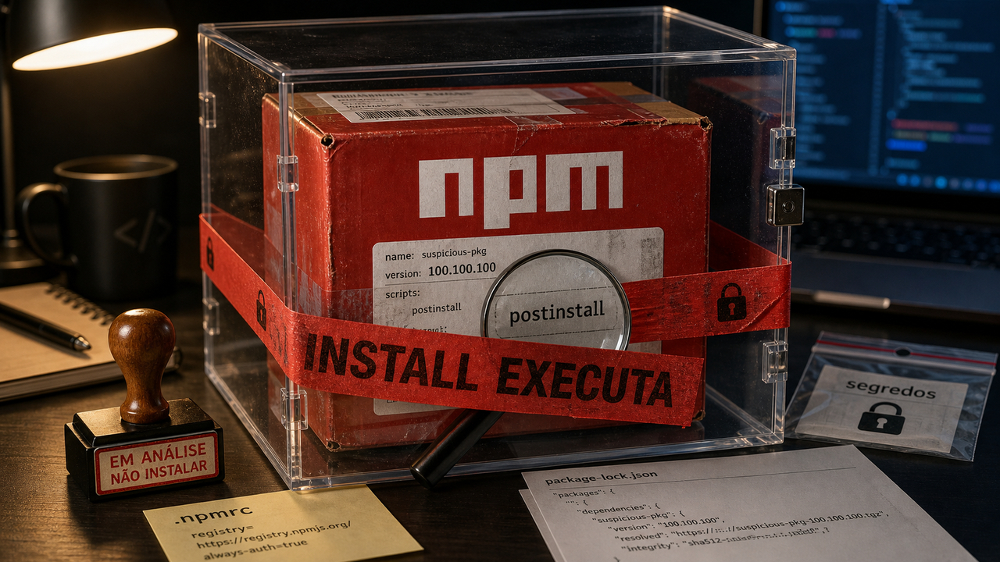

Sábado é um dia especialmente ruim para descobrir que uma coisa "auxiliar" tinha poder demais.

O instalador de dependência parecia só baixar biblioteca. Só que ele podia rodar script antes de qualquer linha da sua aplicação aparecer na tela. A VPN parecia só a porta de entrada controlada da empresa. Mas, se uma exceção de autenticação fica mal configurada e sem patch, essa porta vira assunto de emergência. O agente parecia só ter mais ferramentas para trabalhar melhor. Depois de alguns conectores, cada descrição de ferramenta começa a ocupar contexto, aumentar custo e confundir a escolha.

E migração de dados? Ela costuma ser vendida como troca de caminho. Quem já mexeu nisso sabe que o caminho antigo também alimenta relatório, modelo, dashboard e sistema que ninguém lembra até quebrar.

A edição de hoje gira em torno desse desconforto: ajuda técnica que passa a ter permissão de produção. Instalar, conectar, escolher ferramenta e mover dado são verbos comuns. O risco aparece quando eles são tratados como detalhes administrativos, não como lugares onde código roda, credencial circula e decisão vira estado real.

O primeiro caso vem da Microsoft, com pacotes npm maliciosos tentando se passar por dependências internas. Depois entra uma falha explorada no GlobalProtect, da Palo Alto Networks. Em seguida, o Hermes Agent mostra uma solução interessante para agentes com ferramentas demais. E a Meta entrega uma aula menos urgente, mas muito aproveitável, sobre migração de dados sem downtime.

## Microsoft encontrou 45 pacotes npm abusando de dependency confusion

Ontem falamos de [NuGet falso e pacotes npm caçando segredos](/2026/nuget-falso-gogs-sem-patch-marimo-segredos/). O caso novo da Microsoft muda o mecanismo. Sai o pacote parecido com nome público conhecido; entra o pacote publicado em escopo que parece interno de empresa.

A campanha descrita pela Microsoft usou 45 pacotes npm maliciosos em três grupos: 26 em uma conta, 7 em outra e mais 12 em uma onda de 29 de maio. A ideia era explorar dependency confusion. Se a empresa usa um pacote privado em um escopo interno, mas a configuração do registry permite cair no npm público, um pacote falso com nome compatível e versão maior pode ganhar a resolução.

Um detalhe deixa a armadilha mais fácil de visualizar: a Microsoft cita versões infladas como `100.100.100`. Esse número parece feio de propósito, quase cutucando o resolvedor de dependência. Se o ambiente procura "a maior versão disponível" e o registry privado não está travado do jeito certo, a embalagem falsa pode chegar antes da certa.

Os pacotes rodavam código em `postinstall`. Esse é o ponto que muita gente esquece quando fala "só instalei". No mundo do npm, instalar pode executar. A Microsoft descreve coleta de informações do ambiente de desenvolvimento e de build, detecção de CI/CD, tentativas de evitar alguns cenários e um modo de reconhecimento, com uma flag `RECON_ONLY`, que poderia ser trocado depois para uma fase mais agressiva.

A leitura equilibrada é tratar `install` como execução de código perto de segredo. Em empresa com registry privado, revise `.npmrc`, prenda escopos internos ao registry certo, evite upgrade automático nos escopos afetados, confira lockfiles e logs de build desde 28 de maio, e use `npm install --ignore-scripts` ou `npm config set ignore-scripts true` quando o projeto permite esse sacrifício sem quebrar a build.

Se um pacote suspeito rodou em máquina de dev ou pipeline, o trabalho passa para credencial. Token de npm, credencial de cloud, segredo de CI e variável de ambiente exposta não ficam magicamente menos vazados porque o pacote "só estava reconhecendo o terreno". Gire o que ficou ao alcance e procure persistência em hooks, scripts de shell, tarefas de build e configurações do repositório.

Fonte: [Microsoft Security Blog](https://www.microsoft.com/en-us/security/blog/2026/05/29/33-malicious-npm-packages-abuse-dependency-confusion-profile-developer-environments/).

## CVE-2026-0257 no GlobalProtect entrou no KEV com exploração limitada

O segundo alerta é menos sobre pacote de dev e mais sobre borda de rede. A Palo Alto Networks publicou orientação para a CVE-2026-0257, uma falha no PAN-OS e no Prisma Access envolvendo GlobalProtect em configurações específicas.

A condição importa. A vulnerabilidade depende de portal ou gateway GlobalProtect com authentication override cookies habilitados e uma configuração específica de certificado. Nem todo firewall PAN-OS com o logotipo piscando ficou automaticamente igual. Só que o serviço afetado fica justamente na entrada da rede. Quando VPN de borda tem bypass de autenticação, a pergunta deixa de girar em torno do CVSS e passa para patch, mitigação e caça de acesso suspeito.

A Palo Alto diz estar ciente de tentativas limitadas de exploração contra dispositivos sem patch e sem mitigação. A CISA adicionou a CVE ao catálogo KEV em 29 de maio de 2026, descrevendo a falha como caminho para burlar restrições de segurança e estabelecer conexão VPN não autorizada. Para órgãos federais cobertos pela regra da CISA, a data de ação listada é 1 de junho de 2026.

O número de severidade também pede leitura adulta. A pontuação citada pela Palo Alto fica em uma faixa que não carrega o selo "crítico" no grito. Mesmo assim, exploração real em VPN exposta pesa mais do que a etiqueta sozinha. Uma porta de entrada dispensa marketing de apocalipse para merecer prioridade.

Para quem opera esse ambiente, a ação vem da tabela oficial da Palo Alto: atualizar PAN-OS e Prisma Access para versões corrigidas, aplicar mitigação se o patch não puder entrar no mesmo dia, desabilitar Authentication Override quando fizer sentido, ou usar certificado dedicado somente para os cookies desse recurso. Depois disso, vale caçar sinais de conexão suspeita, principalmente onde havia GlobalProtect exposto com a combinação afetada.

Fonte: [Palo Alto Networks](https://security.paloaltonetworks.com/CVE-2026-0257), [CISA KEV](https://www.cisa.gov/sites/default/files/feeds/known_exploited_vulnerabilities.json) e [The Hacker News](https://thehackernews.com/2026/05/pan-os-globalprotect-authentication.html).

## Hermes Tool Search reduz o cardápio de ferramentas que o modelo vê

Agora vamos para agentes, mas sem jogar uma sopa de siglas logo de cara. O problema é simples: se um agente tem ferramentas demais, ele precisa carregar descrições demais. Cada conector, comando e parâmetro ocupa espaço no contexto. O modelo passa a ler um cardápio enorme antes de decidir qual garfo usar.

O Hermes Agent, da Nous Research, lançou Tool Search para lidar com isso. A ideia é disclosure progressivo. Em vez de mostrar todos os esquemas de ferramentas logo de início, o sistema deixa visíveis três ferramentas-ponte: `tool_search`, `tool_describe` e `tool_call`. Primeiro o modelo procura. Depois pede a descrição completa. Só então chama a ferramenta real.

A ligação com MCP, o Model Context Protocol, é direta porque servidores MCP podem trazer catálogos grandes de ferramentas. O Hermes ativa o modo automático quando os esquemas adiáveis consumiriam pelo menos 10% da janela de contexto ativa. A busca usa BM25 sobre nome, descrição e parâmetros tokenizados, com fallback por substring.

O detalhe engraçado, no melhor sentido, é esse: no meio do hype de agente moderno, a peça central é uma técnica clássica de busca textual. BM25 segue útil mesmo sem jaqueta prateada.

As próprias docs do Hermes citam números publicados pela Anthropic em que Opus 4 teria saído de 49% para 74% com busca de ferramentas. Esse número ajuda a explicar por que a abordagem interessa, mas não fecha a discussão. A documentação também avisa que a recuperação pode falhar. Se o modelo procura com a palavra errada, se a descrição é ruim ou se a ferramenta certa ficou escondida demais, o erro só mudou de lugar.

Também há custo operacional. A primeira chamada pode exigir turnos extras. Alterar o conjunto de ferramentas invalida cache. Ferramentas adiadas perdem parte do benefício de prompt cache. Para quem usa Codex, Claude Code, MCP servers ou agentes internos, a leitura boa é engenharia de harness: medir tokens de schema, separar ferramenta central de ferramenta rara, testar se a busca acha o que precisa e registrar quando ela erra.

Fonte: [Hermes Agent Docs](https://hermes-agent.nousresearch.com/docs/user-guide/features/tool-search) e [MarkTechPost](https://www.marktechpost.com/2026/05/29/hermes-agent-ships-tool-search-for-mcp-anthropic-evals-show-49-to-74-accuracy-gain-on-opus-4/).

## Meta migrou ingestão CDC com shadow, checksum e rollback

Depois de pacote malicioso, VPN explorada e agente carregando ferramenta demais, a história da Meta parece mais calma. O post original da engenharia da Meta é de 12 de maio, e a InfoQ trouxe o assunto de volta em 30 de maio. Não chega como sirene de sábado; chega como uma boa peça de arquitetura para guardar.

A Meta descreve uma migração de ingestão de dados em escala de vários petabytes por dia, saindo de pipelines fragmentados, mantidos por clientes internos, para um serviço centralizado e autogerenciado de data warehouse. A origem citada é MySQL com dados de grafo social. O destino alimenta analytics, sistemas internos e cargas que não podem simplesmente ficar sem dado porque alguém decidiu "migrar rapidinho".

O padrão útil não depende de você ter petabytes no quintal. A Meta organizou a transição em fases: shadow, reverse shadow e cleanup. Primeiro, o sistema novo roda ao lado do antigo e compara resultado. Depois, ele passa a assumir produção enquanto o antigo ainda serve como referência e caminho de volta. Só depois de validar, limpar e ganhar confiança, o legado vai embora.

As validações citadas incluem contagem de linhas, checksums, critérios de latência, consumo de recurso e dashboards. Como a história envolve Change Data Capture, rollback e propagação de dado ruim viram parte do desenho desde o começo. Capturar mudança é só metade da vida. A outra metade é decidir o que acontece quando a mudança errada também foi capturada com muita eficiência.

Para quem migra Postgres, MySQL, fila, ETL, analytics ou sync entre serviços menores, a tradução é bem prática: rode o novo caminho ao lado do velho, compare saída automaticamente, tenha critério de corte, preserve rollback e só comemore depois do cleanup. Migração sem downtime não nasce de coragem. Nasce de redundância chata e verificação repetida.

Fonte: [Engineering at Meta](https://engineering.fb.com/2026/05/12/data-infrastructure/migrating-data-ingestion-systems-at-meta-scale/) e [InfoQ](https://www.infoq.com/news/2026/05/meta-cdc-migration/).

## Destaques rápidos para hoje.

- O VT Code apareceu como um agente de código de terminal, escrito principalmente em Rust e com licença MIT. O repositório mostrava release 0.115.0 em 30 de maio de 2026, além de referências a Agent Skills, MCP, Agent Client Protocol, subagentes, provedores locais como Ollama e políticas de ferramenta. Parece bom para observar padrões de agente no terminal; para repositório real, teste permissões e comandos antes de entregar o volante. Fonte: [VT Code no GitHub](https://github.com/vinhnx/VTCode).

- O MOSS-TTS v1.5 está no Hugging Face com licença Apache 2.0 e 31 idiomas listados, incluindo português. O card fala em síntese multilíngue com tags de idioma, clonagem de voz mais estável, clonagem zero-shot e controle explícito de pausas com marcações como `[pause X.Ys]`. É candidato interessante para teste local de voz, mas rode isolado, confira `custom_code`, qualidade, velocidade e consentimento antes de chamar de stack de produção. Fonte: [OpenMOSS-Team no Hugging Face](https://huggingface.co/OpenMOSS-Team/MOSS-TTS-v1.5).

- No PostgreSQL, `compute_query_id` tem padrão `auto`, e isso pode deixar IDs de consulta vazios se nenhum módulo, como `pg_stat_statements`, pedir a computação. Se seus logs, `pg_stat_activity`, `EXPLAIN` ou `log_line_prefix` dependem de `query_id` sempre presente, avalie `compute_query_id = on` e recarregue com cuidado. O padrão existe por motivo; a mudança precisa ter motivo também. Fontes: [The Build](https://thebuild.com/blog/all-your-gucs-in-a-row-computequeryid/) e [documentação do PostgreSQL](https://www.postgresql.org/docs/current/runtime-config-statistics.html#GUC-COMPUTE-QUERY-ID).

- O `dax` é um toolkit de shell scripting para Deno e Node.js, inspirado no `zx`, com escape automático de interpolação em template literal. A graça está em escrever scripts portáveis com helpers para prompts, requests, path, saída em `.text()`, `.json()` e `.lines()`, sem dependência nativa, etapa de compilação ou `postinstall` segundo a documentação. Ainda é shell: se abrir escape hatch bruto, o cuidado volta para sua mão. Fonte: [dax.land](https://dax.land/).

- IBM e Red Hat anunciaram o Project Lightwell em 28 de maio, com compromisso divulgado de 5 bilhões de dólares, mais de 20.000 engenheiros e uma proposta de clearinghouse empresarial para segurança de open source. Pode virar capacidade útil de validação, patch e coordenação upstream. Também é anúncio de fornecedor e programa comercial; a parte que precisamos acompanhar é governança, acesso por assinatura e relação com comunidades. Fontes: [IBM Newsroom](https://newsroom.ibm.com/2026-05-28-ibm-and-red-hat-commit-5-billion-to-redefine-the-future-of-open-source-in-the-ai-era) e [Axios](https://www.axios.com/2026/05/28/ibm-ai-push-cyber-threats).

- O Linux pode ganhar um caminho bem curioso com USB4STREAM e o driver `thunderbolt_stream`. A ideia, reportada pela Phoronix a partir do trabalho no branch de Thunderbolt, é expor dispositivos como `/dev/tbstreamX` para transferência direta entre máquinas via USB4 ou Thunderbolt. Isso interessa para backup, resgate e laboratório sem montar rede tradicional, mas ainda é material de kernel em desenvolvimento, esperado para a janela do Linux 7.2 se tudo entrar a tempo. Fontes: [Phoronix](https://www.phoronix.com/news/Intel-Linux-USB4STREAM) e [kernel.org](https://git.kernel.org/pub/scm/linux/kernel/git/westeri/thunderbolt.git).

- A Bishop Fox detalhou a CVE-2026-22557 na UniFi Network Application, uma path traversal sem autenticação ligada ao captive portal de convidado em condições de portal customizado. O risco é ler backups que podem conter credenciais administrativas e de dispositivos. A orientação é atualizar para 10.1.89, 10.2.97 ou 9.0.118 ou posterior, usar UniFi Express 4.0.13 ou posterior, restringir portas guest/admin se o patch atrasar e girar segredos se backup pode ter vazado. Fonte: [Bishop Fox](https://bishopfox.com/blog/looting-unifi-controllers-detecting-and-weaponizing-cve-2026-22557).

## Acompanhamento de tendências do dia.

A tendência do dia é que agente está deixando de ser resposta bonita e virando infraestrutura de execução. Isso aparece no Hermes Tool Search, que tenta esconder ferramentas até elas serem necessárias. Aparece no VT Code, com terminal, protocolos, políticas e subagentes. E aparece em datasets como AgentTrove, que organiza 1,7 milhão de traces agentic para treinamento e análise.

O banho frio vem do CVE-Bench. O autor avaliou cinco modelos em 20 vulnerabilidades reais, com condições de prompt diferentes, e reportou melhor taxa geral de 50% para o gpt-5.5. Com advisory completo, o melhor resultado citado foi 60%. É um benchmark específico, pequeno e dependente do harness, então não serve para declarar guerra contra agentes. Serve para lembrar que patch de segurança pela metade pode parecer trabalho concluído até alguém rodar um teste que presta.

O conjunto aponta para uma cobrança menos glamourosa: busca de ferramenta, logs, traces, testes escondidos, política de execução, qualidade de feedback e rollback. Modelo maior ajuda em algumas tarefas. Um loop bagunçado continua sendo um loop bagunçado, só que com conta maior.

Fontes: [CVE-Bench](https://giovannigatti.github.io/cve-bench/), [AgentTrove no Hugging Face](https://huggingface.co/datasets/open-thoughts/AgentTrove), [Hermes Agent Docs](https://hermes-agent.nousresearch.com/docs/user-guide/features/tool-search) e [VT Code](https://github.com/vinhnx/VTCode).

> Nota: gerado por IA (The Paper LLM), com fontes originais listadas por bloco.

<!--
briefing_slug: 2026-05-30
source_mode: briefing
generated_at: 2026-05-30T05:39:51-03:00
source_urls:
  - https://www.microsoft.com/en-us/security/blog/2026/05/29/33-malicious-npm-packages-abuse-dependency-confusion-profile-developer-environments/
  - https://security.paloaltonetworks.com/CVE-2026-0257
  - https://www.cisa.gov/sites/default/files/feeds/known_exploited_vulnerabilities.json
  - https://thehackernews.com/2026/05/pan-os-globalprotect-authentication.html
  - https://hermes-agent.nousresearch.com/docs/user-guide/features/tool-search
  - https://www.marktechpost.com/2026/05/29/hermes-agent-ships-tool-search-for-mcp-anthropic-evals-show-49-to-74-accuracy-gain-on-opus-4/
  - https://engineering.fb.com/2026/05/12/data-infrastructure/migrating-data-ingestion-systems-at-meta-scale/
  - https://www.infoq.com/news/2026/05/meta-cdc-migration/
  - https://github.com/vinhnx/VTCode
  - https://huggingface.co/OpenMOSS-Team/MOSS-TTS-v1.5
  - https://thebuild.com/blog/all-your-gucs-in-a-row-computequeryid/
  - https://www.postgresql.org/docs/current/runtime-config-statistics.html#GUC-COMPUTE-QUERY-ID
  - https://dax.land/
  - https://newsroom.ibm.com/2026-05-28-ibm-and-red-hat-commit-5-billion-to-redefine-the-future-of-open-source-in-the-ai-era
  - https://www.axios.com/2026/05/28/ibm-ai-push-cyber-threats
  - https://www.phoronix.com/news/Intel-Linux-USB4STREAM
  - https://git.kernel.org/pub/scm/linux/kernel/git/westeri/thunderbolt.git
  - https://bishopfox.com/blog/looting-unifi-controllers-detecting-and-weaponizing-cve-2026-22557
  - https://giovannigatti.github.io/cve-bench/
  - https://huggingface.co/datasets/open-thoughts/AgentTrove
coverage:
  - microsoft-npm-dependency-confusion-45: main block with continuity link to 2026-05-29 post.
  - panos-globalprotect-cve-2026-0257: main block.
  - hermes-tool-search-mcp: main block.
  - meta-cdc-migration-zero-downtime: main block.
  - vtcode-rust-terminal-agent: quick hit.
  - moss-tts-v15-apache: quick hit.
  - postgres-compute-query-id: quick hit.
  - dax-cross-platform-shell: quick hit.
  - ibm-redhat-project-lightwell: quick hit.
  - linux-usb4stream-thunderbolt: quick hit.
  - unifi-cve-2026-22557: quick hit.
  - agent-harness-quality-trend: trend section.
omitted_briefing_items:
  - Perry compiles TypeScript straight to native binaries: confirmed but omitted because v0.5 benchmark claims need hands-on testing.
  - avai, a local AI antivirus: omitted because new untested security tool and source says detection coverage is not proven.
  - A multi-model dev stack with smart routing: omitted because promotional and weaker than verified Hermes/VT Code/CVE-Bench harness material.
  - How we contain Claude across products: confirmed but already covered as main story on 2026-05-27 with no new factual update.
  - Stop MITM on the first SSH connection, on any VPS or cloud provider: confirmed but treated as evergreen SSH/VPS topic without clear same-day hook.
  - My first home server 1.5 years later: omitted because Reddit/self-post guide was weaker than source-led security and infrastructure stories.
  - The Critical State of Cyberspace: omitted because broad infrastructure/geopolitical chapter was less fresh and practical today.
  - MCP Is Dead: omitted because opinion framing was weaker than verified Hermes Tool Search documentation.
  - Microsoft 0-day feud escalates as researcher threatens another exploit dump: omitted because disclosure drama had lower direct developer utility.
  - ChatGPT share links abused to host fake outage pages to deliver malware: omitted because security density was already high and stronger operational items won.
  - Attackers Use LLM Agent for Post-Exploitation After Marimo CVE-2026-39987 Exploit: omitted because it was already covered in the 2026-05-29 Marimo block.
-->
