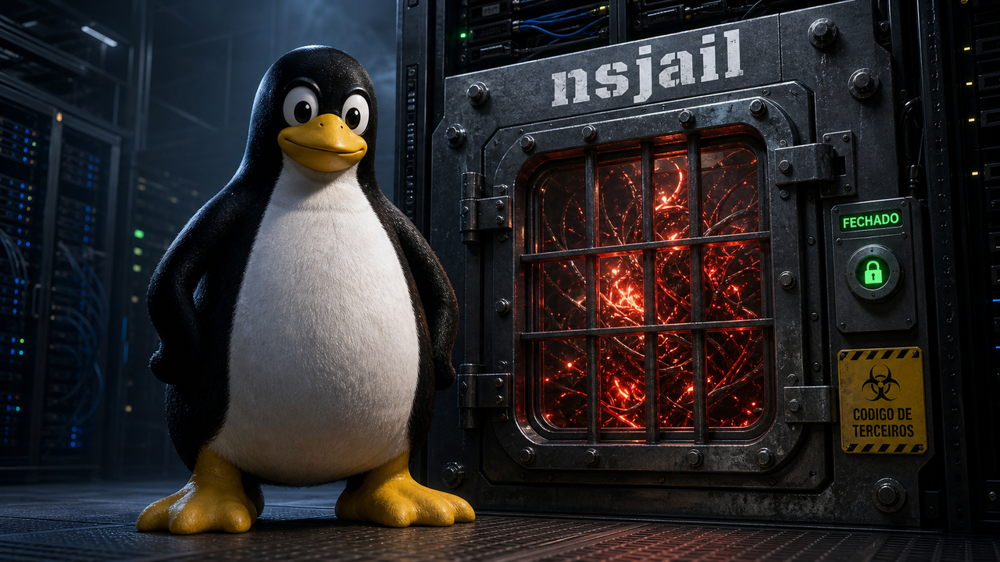

Rodar o código de outra pessoa no seu servidor é o tipo de tarefa que dá um frio na espinha se você parar para pensar. Um estudante manda um trecho de C, um usuário cola um script, um agente executa um plugin: em todos esses casos, código que você não escreveu roda com o seu kernel, na sua máquina, perto dos seus segredos. Um desenvolvedor brasileiro que está construindo uma plataforma educacional resolveu encarar exatamente esse pesadelo e, em vez de guardar a solução, abriu o código.

O nome do projeto é `dalivim-runner`, publicado nesta semana com um relato de arquitetura no Tab News. A ideia central cabe numa frase que vale colar na parede: se o isolamento não pode ser garantido, nada roda.

## nsjail roda código não confiável num VPS sem entregar o servidor

A base do isolamento é o nsjail, uma ferramenta que embrulha cada execução em paredes separadas. Cada rodada de código recebe seus próprios namespaces de mount, PID, rede, usuário e IPC. Namespace, aqui, é só o nome técnico para "o que aquele processo consegue enxergar": quais arquivos existem, quais outros processos existem, que rede existe. O filesystem entra como somente leitura, e o programa ganha apenas um workspace temporário pequeno para trabalhar.

Isolar o que o processo vê é metade da conta. A outra metade é limitar o que ele pode pedir ao kernel. Para isso o runner usa seccomp com allowlist, e essa escolha importa. Uma allowlist libera só o conjunto mínimo de chamadas de sistema que o programa precisa e bloqueia todo o resto por padrão; é o contrário de uma blocklist, que tenta adivinhar tudo que é perigoso e sempre esquece de alguma coisa. Por cima disso vêm os cgroups v2, que impõem teto de memória com `memory.max`, além de limites de número de processos, de CPU e de tamanho de saída. Uma fork bomb, aquele clássico que se multiplica até derrubar a máquina, esbarra no limite de processos em vez de esbarrar no seu uptime.

Tem um detalhe de projeto que eu gostei especialmente. O runner é fail-closed: se o nsjail não consegue criar o sandbox, ele simplesmente não inicia. Não existe aquele fallback silencioso, meio traiçoeiro, em que o isolamento falha e o código roda mesmo assim porque "só dessa vez". Ou o cofre fecha, ou o dinheiro não entra.

A arquitetura ainda separa os jails de compilação e de execução, liga o `no_new_privs` para impedir que um processo ganhe privilégio via setuid no meio do caminho, e deixa o namespace de rede completamente vazio. Rede vazia quer dizer duas coisas boas ao mesmo tempo: não há para onde exfiltrar dados e não há como alcançar o endpoint de metadados da cloud, aquele endereço interno que, em muitos provedores, entrega credenciais para quem souber perguntar. Para provar que tudo isso segura de pé, o projeto mantém testes adversariais que miram fork bombs, leitura de variáveis de ambiente e arquivos do host, syscalls bloqueadas, exaustão de memória, loops infinitos e sondagens ao tal endpoint de metadados.

Um limite honesto fecha o assunto. O kernel é compartilhado, e isso é o teto de tudo. Uma vulnerabilidade desconhecida no próprio kernel ainda pode, em tese, permitir uma fuga do sandbox. O próprio autor reconhece isso e aponta o próximo degrau, as microVMs no estilo Firecracker, que não estão implementadas aqui. E vale a nota de sempre em texto sobre ataque: o objetivo de listar fork bomb e sondagem de metadados é explicar o risco que o sandbox precisa conter, não distribuir receita de abuso.

Em junho a gente falou de [MicroVMs da AWS isolando código de IA](/2026/lambda-microvms-isola-codigo-de-ia-e-sonicwall-lembra-que-patch-nao-limpa-vpn/), que resolvem o problema por baixo, com um hardware virtual dedicado por execução. Este caso é a abordagem complementar e mais "na unha": namespaces, seccomp e cgroups montados à mão num VPS comum, do tipo que você aluga por poucos reais. Container, namespaces e microVM não são a mesma coisa, e ver os três lado a lado ajuda a escolher o nível de paranoia que a sua aplicação realmente pede.

Fontes: [Tab News — jpierreribeiro, "Lidando com o pior pesadelo de cybersec: rodar códigos de terceiros"](https://www.tabnews.com.br/jpierreribeiro/lidando-com-o-pior-pesadelo-de-cybersec-rodar-codigos-de-terceiros) e [GitHub — jpierreribeiro/dalivim-runner](https://github.com/jpierreribeiro/dalivim-runner).

## "Harness engineering" dá nome ao trabalho de moldar o ambiente do agente

Tem um padrão que se repete em quase toda conversa boa sobre agentes de código, e ele estava sem nome. Ryan Lopopolo resolveu batizar. Ele publicou o repositório `harness-engineering`, marcado como v1.0.0 em 18 de julho e sob licença CC BY 4.0, definindo o que chama de harness engineering: a prática de melhorar a saída de um agente mantendo o modelo e o próprio agente fixos, como uma caixa-preta, e ganhando a briga no que está em volta deles.

A tese vira o foco de lugar. Em vez de caçar o prompt mágico ou trocar de modelo toda semana, você trata o modelo como constante e investe no ambiente: o contexto que ele recebe, as ferramentas que pode chamar e as restrições que precisa satisfazer. Lopopolo usa uma imagem que ajuda, a do "iceberg de dados de processo". O peso do modelo carrega só a pontinha visível, o conhecimento geral do mundo. Abaixo da linha d'água fica tudo que decide o trabalho de verdade: o estado atual do sistema, as ontologias locais do seu domínio, o padrão de qualidade da casa, o histórico de exceções, quem tem autoridade sobre o quê. Nada disso está nos pesos, e alguém precisa entregar ao agente enquanto ele trabalha. Na prática, é o que vive num `AGENTS.md` bem feito, o arquivo que diz ao agente qual prova cada tipo de tarefa exige antes de dar por pronta.

Dois artefatos datados desta semana mostram a mesma ideia aplicada em contextos diferentes. O primeiro é o deepsec, da Vercel Labs, sob Apache 2.0: um scanner de vulnerabilidades movido a agente que solta agentes de código dentro do repositório no nível máximo de raciocínio, ajustável por um `--thinking-level`, para caçar falhas. O detalhe honesto vem no próprio README, e eu respeito: um scan grande pode custar milhares, ou até dezenas de milhares, de dólares, e o trabalho pode ser distribuído por microVMs do Vercel Sandbox. O harness é o produto, e o produto tem etiqueta de preço.

O segundo é o WANDR, da Perplexity, e ele faz uma pergunta que eu queria ver mais gente fazendo: o agente de pesquisa realmente fundamenta o que cita? O benchmark re-busca cada página citada durante a avaliação, para conferir se a fonte sustenta a afirmação. Nas 500 tarefas, os números da própria Perplexity não são bonitos: 41,4% das páginas não trazem um requisito substantivo, e 57,5% dos trechos não sustentam a alegação completa. O gargalo não é descobrir a informação, é aterrar a informação que já se descobriu. Como esses números vêm do benchmark do próprio fornecedor, são medição de casa, não veredito independente.

Uma cautela antes de você sair falando "harness" na daily. O termo ainda está subindo, não é padrão consolidado da área; é vocabulário emergente, atribuível a Lopopolo. Mas ele nomeia bem uma coisa que já era real, e nomear costuma ser metade do caminho para levar a sério.

Fontes: [GitHub — lopopolo/harness-engineering](https://github.com/lopopolo/harness-engineering), [GitHub — vercel-labs/deepsec](https://github.com/vercel-labs/deepsec) e [marktechpost — Perplexity WANDR](https://www.marktechpost.com/2026/07/19/perplexity-ai-releases-wandr-an-open-benchmark-evaluating-research-agents-that-must-search-wide-and-deep/).

## Um Mac reserva controlado pelo Claude Code por SSH

Se harness engineering é sobre moldar o ambiente do agente, aqui está uma escolha de ambiente bem concreta: em qual máquina você deixa o agente fazer besteira. O ykdojo publicou um guia passo a passo para pegar um Mac antigo, um Air reserva que estava na gaveta, e transformá-lo numa máquina que o Claude Code dirige por SSH a partir do computador principal.

A receita começa pela higiene. O guia manda criar uma conta local limpa, sem Apple ID e sem dados pessoais, habilitar o login remoto por SSH, e configurar `sudo` sem senha. Aí, sim, o agente roda com a flag `--dangerously-skip-permissions`, aquela que pula a confirmação a cada passo. O ponto pedagógico inteiro está nessa combinação: você aceita rodar a flag perigosa justamente porque a máquina é descartável. Se o agente apagar algo que não devia, o estrago mora numa conta vazia de um Mac reserva, não na sua vida.

O truque técnico mais esperto resolve uma chatice do macOS. Normalmente, um processo que entra por SSH não consegue capturar tela nem controlar teclado e mouse, porque o sistema separa a sessão remota da sessão gráfica. O guia contorna isso com um LaunchAgent que mantém um servidor tmux vivo dentro da sessão gráfica de login. Como o tmux já está lá dentro, com as permissões da interface, quem chega por SSH e se conecta a ele herda o acesso à tela e ao input. tmux, para quem não convive com ele, é o que mantém a sessão de terminal viva mesmo depois que você desconecta.

Daí saem três formas de dirigir a máquina: sessões de terminal por um wrapper chamado `ic`, controle pelo celular via o recurso "/remote-control" do próprio Claude, e Screen Sharing quando você quer só assistir com os olhos. O autor prefere um Mac reserva a um container por um motivo prático: container tem a rede isolada e não alcança apps nativos do Mac, então tarefas como abrir a Unity para desenvolver um jogo simplesmente não acontecem lá dentro. Quem quiser alcançar a máquina de qualquer lugar pode botar uma camada de Tailscale, que roda sobre WireGuard, por cima.

Duas ressalvas, porque essa é a parte que separa brincadeira de dor de cabeça. A página não traz data de publicação explícita, então trato como guia recente sem cravar o dia. E o tradeoff de segurança é real, não decorativo: uma máquina sempre ligada, com `sudo` sem senha e um agente com controle amplo, é uma superfície de ataque de respeito. A disciplina de isolar o raio de dano é a lição principal do guia, não uma nota de rodapé.

Fonte: [ykdojo — "Setting up your spare Mac for Claude Code to control"](https://ykdojo.github.io/claude-controls-mac/).

## "AI mania": o ensaio viral que diz ter visto 0% de sucesso

Depois de três blocos sobre como controlar bem um agente, cabe uma voz que puxa o freio de mão. Um ensaio publicado em 18 de julho pelo autor que assina como ludic viralizou dizendo, com todas as letras, que ele viu 0% de sucesso em projetos de IA ao longo de aproximadamente um ano e meio. O número inclui trabalho do próprio time dele e de terceiros, e vem de alguém que trabalha entregando IA na prática, não de um cético de arquibancada.

O texto abre com uma citação de Mitchell Hashimoto sobre "psicose de IA" tomando conta de empresas inteiras, e depois vai desfiando o argumento. A anedota que mais gruda é a da Snowflake Cortex: uma demo com cerca de 92% de acurácia declarada e ainda não pronta para produção. O autor traduz esse número numa imagem que dói, a de um CFO com um em cada dez de seus números simplesmente errado. Ele também cunha o termo "AI-washing" para a prática de fazer o trabalho na mão e creditar o resultado ao LLM, o que ajuda os números de sucesso a parecerem melhores do que são.

A parte mais interessante é o argumento de teoria dos jogos sobre por que ninguém admite o fracasso. Segundo o autor, nenhum executivo consegue reportar com segurança uma iniciativa de IA que deu errado, porque isso mina os colegas que juraram sucesso; se ele coopera com a narrativa, mantém o emprego, e se deserta, pode ser demitido. O fracasso, nesse desenho, fica escondido não por má-fé individual, mas pela estrutura de incentivos. O diagnóstico dele é organizacional, não técnico: um chatbot interno falha porque um LLM só sabe o que foi escrito, e a maioria das empresas tem documentação ruim.

Aqui a firmeza tem que ser proporcional. Isso é um ensaio de opinião, e os números são anedóticos, do próprio autor, não estatística de mercado auditada. Os 0% e os 92% são o relato dele, e é assim que devem ser lidos. A citação do Hashimoto é sobre "psicose de IA", não sobre a taxa de sucesso; são coisas separadas, e misturar as duas seria esticar a fonte. Ainda assim, como leitura crítica do ciclo de hype vinda de dentro da entrega, o texto é munição honesta para uma conversa que costuma acontecer só entre dentes.

Fonte: [ludic (mataroa blog) — "AI Mania Is Eviscerating Global Decision-Making"](https://ludic.mataroa.blog/blog/ai-mania-is-eviscerating-global-decision-making/).

## O computador no fundo do canal: o Rekursiv, certo em tudo e cedo demais

Para fechar, uma história sem relógio de urgência, dessas que a gente conta pelo prazer de contar. Em 1984, uma fabricante de hi-fi de Glasgow, a Linn Products, decidiu construir um processador. Não um chip de áudio: um processador de propósito geral, orientado a objetos, por uma subsidiária chamada Linn Smart Computing, num projeto que teria custado por volta de dez milhões de libras. O bicho se chamava Rekursiv e nascia de quatro gate arrays com nomes que parecem banda de rock: NUMERIK, LOGIK, OBJEKT e KLOK.

O que ele fazia em silício era assustadoramente à frente do tempo. O OBJEKT checava o tipo e os limites de cada acesso à memória, um por um, via uma tabela de páginas com hash. Havia um coletor de lixo compactador de dois espaços implementado em hardware. Memória e disco eram tratados como um único armazenamento de objetos, sem aquela fronteira dura entre o que está na RAM e o que está no disco. E o conjunto de instruções não era fixo: era um artefato carregável, quer dizer, você podia trocar a "linguagem de máquina" do processador como quem carrega um programa.

E mesmo assim afundou. Literalmente. Microprocessadores comuns melhoravam cerca de 52% ao ano entre 1986 e 2003, e essa maré de commodity ultrapassou o design custom antes que ele conseguisse emplacar. A cena que dá título ao ensaio é quase tragédia grega: um engenheiro chamado Harland teria jogado o próprio hardware acumulado e as mídias de backup no Forth and Clyde Canal. O computador foi para o fundo de um canal.

O final tem consolo, ainda que tardio, com uns 40 anos de atraso. As ideias do Rekursiv foram vindicadas. A Arm hoje empurra capabilities e limites impostos por hardware com o CHERI e o Morello, com ponteiros que carregam permissões inforjáveis e uma tag de validade que não dá para falsificar, exatamente o espírito daquela checagem de tipo e limites do OBJEKT. E o armazenamento persistente de objetos, o IBM System/38 provou que funcionava, mas por um caminho diferente: colocando a semântica numa ISA virtual, acima do chip físico, em vez de soldá-la a gate arrays específicos. É a moral inteira num contraste: a mesma visão venceu quando embarcada numa abstração portátil e afundou quando presa a um hardware particular. A portabilidade ganhou de novo.

Fonte: [Negroni Venture Studios — "The computer at the bottom of a canal"](https://negroniventurestudios.com/2026/07/18/the-computer-at-the-bottom-of-a-canal/).

> Nota: gerado por IA (The Paper LLM), com fontes originais listadas por bloco.

<!--
source_urls:
  - https://www.tabnews.com.br/jpierreribeiro/lidando-com-o-pior-pesadelo-de-cybersec-rodar-codigos-de-terceiros
  - https://github.com/jpierreribeiro/dalivim-runner
  - https://github.com/lopopolo/harness-engineering
  - https://github.com/vercel-labs/deepsec
  - https://www.marktechpost.com/2026/07/19/perplexity-ai-releases-wandr-an-open-benchmark-evaluating-research-agents-that-must-search-wide-and-deep/
  - https://ykdojo.github.io/claude-controls-mac/
  - https://ludic.mataroa.blog/blog/ai-mania-is-eviscerating-global-decision-making/
  - https://negroniventurestudios.com/2026/07/18/the-computer-at-the-bottom-of-a-canal/
-->
