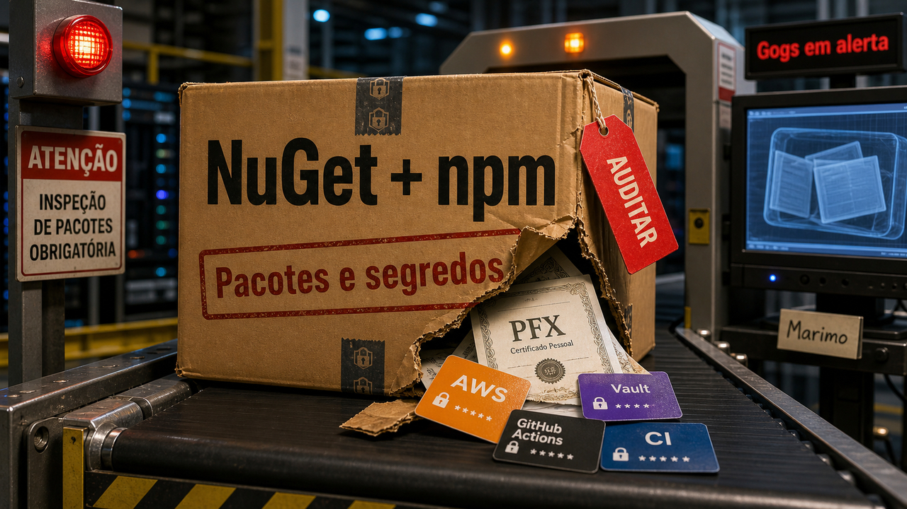

A gente instala um SDK para não escrever integração na mão. Sobe um servidor Git próprio porque o time precisa andar. Deixa um notebook de dados na rede interna por algumas horas. Aceita um pacote npm que roda script no `install` porque a build já faz tanta coisa que mais uma etapa parece normal.

O problema é que esses atalhos costumam ficar perto dos segredos. PFX de banco, token de CI, chave de cloud, repositório privado, arquivo `.env`, sessão de navegador. Tudo isso mora no mesmo bairro da produtividade. Quando a ferramenta é de desenvolvimento, a gente tende a chamar de ambiente. Atacante chama de caminho.

E o caminho de hoje passa por lugares bem familiares para quem programa. Um pacote no NuGet fingiu ser SDK do Sicoob. Outra campanha usou pacotes npm parecidos com nomes reais para procurar credenciais. Uma falha sem patch público colocou instâncias Gogs em alerta. Um servidor Marimo exposto virou pivô até banco interno, com a Sysdig avaliando que um agente de LLM participou do pós-exploit. No meio da tensão, a Kog apareceu com um número enorme de inferência e uma aula involuntária sobre largura de banda de memória.

Então a edição tem segurança, sim. Mas a história maior é confiança operacional. O que você instala? O que você deixa exposto? O que pode ler seus segredos? E quem revisa isso antes de o incidente ganhar horário próprio na agenda?

## Sicoob.Sdk no NuGet e typosquats npm transformaram install em caça a segredo

A Socket encontrou no NuGet um pacote chamado `Sicoob.Sdk`, com versões 2.0.0 até 2.0.4, que se apresentava como SDK para integrações com o Sicoob. Para leitor brasileiro, o nome chama atenção na hora. É contexto financeiro local, com chance real de aparecer em integração de empresa, não uma marca qualquer perdida em pacote obscuro.

O peso da história está no material que o pacote lia. Segundo a Socket, o artefato publicado no NuGet buscava IDs de cliente, senhas de PFX e conteúdo de certificado PFX, depois enviava esses dados por Sentry. PFX pode carregar material usado para autenticar integrações. Em integração bancária, isso sai da categoria "pacote esquisito" e entra na categoria "talvez precise girar credencial agora".

Tem um detalhe especialmente desagradável: o repositório público no GitHub parecia mais limpo do que o pacote publicado. A lógica de exfiltração estava no DLL distribuído pelo NuGet, não no código que alguém veria numa leitura rápida da fonte. Esse desencontro entre repositório e artefato é o tipo de coisa que quebra a confiança preguiçosa que todos nós já usamos alguma vez: olhar o GitHub, achar bonito, instalar e seguir.

A Socket diz que o NuGet bloqueou o pacote depois do reporte. Ainda assim, quem instalou precisa tratar como exposição de credencial, não como curiosidade de segurança. Dependendo do escopo, autorização e controles do lado Sicoob, material de PFX e ID de cliente pode abrir caminho para impersonação de integração.

A Microsoft publicou outro caso, separado, que rima com o mesmo problema. A empresa identificou 14 pacotes npm typosquat publicados em uma janela de cerca de quatro horas. Eles abusavam de hooks de ciclo de vida do npm para rodar durante a instalação e procurar segredos como credenciais AWS, tokens do HashiCorp Vault, segredos do GitHub Actions e tokens de publicação npm. Os usuários e repositórios foram removidos depois do aviso da Microsoft ao npm.

Juntar esses dois casos não quer dizer que existe um único ator por trás de tudo. A semelhança está no gesto: o `install` virou momento de coleta. A aplicação nem precisa importar o pacote para o estrago começar. Se o script de instalação rodou perto de token, PFX, metadata de cloud ou pipeline de CI, a primeira execução já pode ter sido suficiente.

Para quem mantém projeto, o cuidado fica bem menos poético: confira publicador, compare artefato e fonte quando o pacote mexe com segredo, desconfie de nome parecido demais, audite scripts de instalação e não use resposta de IA ou resultado de busca como selo de confiança. Se um pacote desse tipo passou pelo ambiente, gire PFX, tokens e credenciais alcançáveis. É chato. Mais chato é descobrir pelo log de alguém de fora.

Fontes: [Socket](https://socket.dev/blog/malicious-nuget-package-impersonates-sicoob-sdk), [Microsoft Security Blog](https://www.microsoft.com/en-us/security/blog/2026/05/28/typosquatted-npm-packages-used-steal-cloud-ci-cd-secrets/) e [The Hacker News](https://thehackernews.com/2026/05/malicious-sicoob-nuget-steals-banking.html).

## Gogs segue com RCE sem patch público e cadastro aberto piora a história

A Rapid7 divulgou uma vulnerabilidade crítica no Gogs, a plataforma self-hosted de Git. A falha permite execução remota de código por um usuário autenticado, recebeu CVSSv4 9.4 na análise da Rapid7 e, na publicação de 28 de maio, seguia sem patch público do projeto.

"Autenticado" pode soar menos assustador do que deveria. O Gogs vem com cadastro aberto por padrão e sem limite padrão de criação de repositórios. Em uma instância exposta desse jeito, o requisito pode virar algo bem simples: criar uma conta normal, criar ou controlar um repositório e chegar ao fluxo vulnerável.

O bug aparece no caminho de "Rebase before merging". A explicação curta é que dados controlados pelo atacante podem entrar no uso de `git rebase` de um jeito que vira injeção de argumento. A Rapid7 cita Gogs 0.14.2 e 0.15.0+dev no material técnico. O detalhe de exploração fica na fonte; aqui o que importa para defesa é que o processo do Gogs pode acabar executando comando com os privilégios do usuário do servidor.

Para quem roda um Gogs pequeno em VPS, homelab, empresa ou legado herdado, o impacto possível é bem concreto: repositórios privados, tokens, chaves SSH, hashes de senha e até alteração de código. Git self-hosted costuma parecer infraestrutura pequena até a gente lembra que ele guarda a história e o futuro do sistema ao mesmo tempo.

Enquanto não há correção pública, a mitigação é reduzir superfície. Desabilite cadastro com `DISABLE_REGISTRATION`, limite ou remova criação de repositórios com `MAX_CREATION_LIMIT`, revise quem tem conta, audite configurações de rebase antes de merge e procure atividade estranha em logs, tokens e chaves. Desligar rebase em repositórios ajuda em parte, mas não deve virar sensação de proteção completa quando usuários não confiáveis conseguem criar repositório.

Se a instância está na internet e ninguém sabe bem quem cuida dela, esse é o momento de descobrir. Isolar o serviço, colocar atrás de VPN, migrar para uma alternativa mantida ou desligar cadastro público pode ser uma tarde chata. RCE sem patch em servidor de Git costuma cobrar juros piores.

Fontes: [Rapid7](https://www.rapid7.com/blog/post/ve-authenticated-rce-via-argument-injection-gogs-unfixed/) e [SecurityWeek](https://www.securityweek.com/gogs-zero-day-exposes-servers-to-remote-code-execution/).

## Marimo mostrou como um notebook exposto pode virar ponte para banco interno

No dia 27, falamos de [contenção de agentes e credenciais com escopo pequeno](/2026/downloads-falsos-badhost-ia-encostando-producao/). A história do Marimo coloca esse assunto em uma cena menos abstrata: ferramenta de desenvolvimento exposta, terminal acessível demais, segredos por perto e movimento lateral depois.

A falha é a CVE-2026-39987. O NVD registra que versões do Marimo anteriores à 0.23.0 tinham execução remota de código antes de autenticação, ligada ao endpoint WebSocket do terminal, que não validava autenticação como deveria. A correção está na versão 0.23.0.

A Sysdig descreveu uma cadeia em que um Marimo vulnerável e alcançável pela internet levou a coleta de credenciais e acesso a banco interno. No caminho aparecem coisas que todo ambiente de dev tende a acumular: credenciais AWS, arquivos `.env`, chaves SSH, senha de banco e contexto suficiente para uma pessoa, ou ferramenta, entender para onde ir depois.

O pedaço novo e delicado é a atribuição do pós-exploit. A Sysdig avaliou que a fase depois da entrada inicial teve sinais de agente de LLM dirigindo a intrusão, com base em timing, estrutura dos comandos e comportamento observado. Vale segurar o trailer de cinema: a parte confirmada é a vulnerabilidade, a sequência descrita e a mitigação. A parte de agente é uma avaliação técnica da Sysdig, forte o bastante para prestar atenção, mas ainda deve ser citada como avaliação.

Mesmo assim, a consequência para quem opera notebook, dashboard ou ferramenta interna é simples de enxergar. Servidor de notebook não deveria morar exposto na internet com terminal e segredo por perto. Isso vale para Marimo, Jupyter, painel caseiro, ferramenta de ETL, app de dados feito para "só a equipe usar" e qualquer coisa que entregue shell com um sorriso.

Atualize Marimo para 0.23.0 ou posterior. Restrinja acesso de rede ao terminal, desative o terminal quando ele não for necessário, coloque autenticação e controle de origem na frente, gire credenciais alcançáveis e procure sinais de movimento lateral se houve exposição. O nome da ferramenta muda; o erro de arquitetura costuma ser bem parecido.

Fontes: [Sysdig](https://www.sysdig.com/blog/ai-agent-at-the-wheel-how-an-attacker-used-llms-to-move-from-a-cve-to-an-internal-database-in-4-pivots), [NVD](https://nvd.nist.gov/vuln/detail/CVE-2026-39987) e [The Hacker News](https://thehackernews.com/2026/05/attackers-use-llm-agent-for-post.html).

## Kog colocou 3.000 tokens/s na mesa, com uma boa aula de largura de banda

Depois de tanto segredo vazando, um pouco de física de data center ajuda a respirar. A Kog Labs publicou uma prévia técnica do Kog Inference Engine, ou KIE, com um número bem chamativo: 3.000 tokens de saída por segundo, por requisição, em um nó com oito GPUs AMD MI300X. No mesmo texto, a empresa fala em 2.100 tokens por segundo em oito NVIDIA H200.

Antes de deixar o número sair correndo sozinho, vale olhar o cenário. O teste é com batch size 1, FP16, sem speculative decoding, em um modelo de 2B parâmetros. É uma prévia técnica de fornecedor, em hardware de datacenter, com modelo pequeno. Não é promessa geral para qualquer modelo grande, qualquer placa e qualquer workload. Pronto, já coloquei o capacete no benchmark.

Ainda assim, a explicação é útil. Em geração autoregressiva, especialmente com uma única requisição esperando o próximo token, o gargalo muitas vezes passa pela largura de banda de memória e pelo overhead do software, não só por FLOPS brutos. Para agente que precisa pensar, chamar ferramenta, ler resultado e gerar mais texto em sequência, cada token atrasado estica o loop inteiro.

A Kog diz atacar isso com co-design entre arquitetura de modelo, runtime, código GPU de baixo nível e comunicação entre GPUs. O texto fala em persistent monokernel, coletivos customizados e KCCL, tentando reduzir camadas tradicionais que custam tempo no caminho. Em vez de depender apenas de um stack genérico de inferência, a proposta vai para perto do metal.

Mesmo que quase ninguém lendo isso tenha oito MI300X no quarto, a imagem mental vale. Throughput para servir muitos usuários e latência de uma requisição esperando token não são a mesma conversa. Um benchmark lindo em lote alto pode ser ótimo para custo agregado e ruim para aquele agente que precisa completar um raciocínio comprido agora.

Então dá para guardar duas coisas ao mesmo tempo. O número da Kog precisa de reprodução externa, outros modelos e outros workloads. A aula de sistema já serve hoje: desempenho de LLM é memória, runtime, comunicação, modelo e fila de uso conversando. Às vezes conversando alto.

Fonte: [Kog Labs](https://blog.kog.ai/real-time-llm-inference-on-standard-gpus-3-000-tokens-s-per-request/).

## Destaques rápidos para hoje.

- O Google diz que Device Bound Session Credentials, ou DBSC, ficou geralmente disponível no Chrome para Windows, com ativação padrão para usuários Google Workspace. O rollout começou em 25 de maio de 2026 e pode levar até 60 dias. A ideia é prender a sessão ao dispositivo que autenticou, reduzindo replay de cookie roubado em outra máquina; malware ainda ativo no dispositivo original continua sendo problema de endpoint, não de nomenclatura bonita. Fontes: [Google Workspace Updates](https://workspaceupdates.googleblog.com/2026/05/prevent-account-takeovers-with-DBSC-now-generally-available-in-the-Chrome-browser-for-Windows.html) e [BleepingComputer](https://www.bleepingcomputer.com/news/security/google-chrome-adds-session-cookie-theft-protection-for-all-users/).

## Acompanhamento de tendências do dia.

No dia 26, falamos de [pull requests tardios no Linux 7.1-rc5](/2026/copilot-cowork-e-ghost-cms-quando-a-automacao-age-antes-da-revisao/). Agora a Phoronix relata que o pull request de networking continuou significativamente maior do que o normal para esse ponto do ciclo, com Paolo Abeni ligando parte do volume a ferramentas como Claude Code, ChatGPT Codex e agentes de código.

Esse é o pedaço menos vendável da automação: quando gerar patch, relatório ou sugestão fica barato, a revisão vira gargalo principal. O mantenedor ainda precisa entender o caso, separar correção real de barulho, pedir evidência, encaixar no ciclo e assumir o risco. Ferramenta que encontra mais coisa pode ajudar muito. Também pode entregar uma fila maior para gente que já estava sem tempo.

Rust for Linux entra nessa conversa sem precisar virar briga de linguagem. No material da corrode com Greg Kroah-Hartman e Alice Ryhl, a linha é interop com C e adoção por drivers e subsistemas novos, não reescrita total do kernel. Rust ajuda quando tira certas classes de erro da mesa antes da revisão. Ele não elimina arquitetura errada, teste ruim, mudança tardia nem patch gerado sem dono.

Para times menores, a tradução é direta: comprar geração de código sem comprar revisão é só mudar o gargalo de lugar. Se agente vai abrir PR, ele precisa entregar caso pequeno, teste, contexto, limite e dono humano. Senão a produtividade vira fila. E fila também é dívida técnica, só que com notificação.

Fontes: [Phoronix](https://www.phoronix.com/news/Linux-Net-Significantly-Bigger), [corrode Rust Consulting](https://corrode.dev/podcast/s06e04-rust4linux/) e [LinuxTeck](https://www.linuxteck.com/linux-kernel-security-rust/).

> Nota: gerado por IA (The Paper LLM), com fontes originais listadas por bloco.

<!--
briefing_slug: 2026-05-29
source_mode: briefing
generated_at: 2026-05-29T14:37:26-03:00
source_urls:
  - https://socket.dev/blog/malicious-nuget-package-impersonates-sicoob-sdk
  - https://www.microsoft.com/en-us/security/blog/2026/05/28/typosquatted-npm-packages-used-steal-cloud-ci-cd-secrets/
  - https://thehackernews.com/2026/05/malicious-sicoob-nuget-steals-banking.html
  - https://www.rapid7.com/blog/post/ve-authenticated-rce-via-argument-injection-gogs-unfixed/
  - https://www.securityweek.com/gogs-zero-day-exposes-servers-to-remote-code-execution/
  - https://www.sysdig.com/blog/ai-agent-at-the-wheel-how-an-attacker-used-llms-to-move-from-a-cve-to-an-internal-database-in-4-pivots
  - https://nvd.nist.gov/vuln/detail/CVE-2026-39987
  - https://thehackernews.com/2026/05/attackers-use-llm-agent-for-post.html
  - https://blog.kog.ai/real-time-llm-inference-on-standard-gpus-3-000-tokens-s-per-request/
  - https://workspaceupdates.googleblog.com/2026/05/prevent-account-takeovers-with-DBSC-now-generally-available-in-the-Chrome-browser-for-Windows.html
  - https://www.bleepingcomputer.com/news/security/google-chrome-adds-session-cookie-theft-protection-for-all-users/
  - https://www.phoronix.com/news/Linux-Net-Significantly-Bigger
  - https://corrode.dev/podcast/s06e04-rust4linux/
  - https://www.linuxteck.com/linux-kernel-security-rust/
  - https://www.anthropic.com/engineering/how-we-contain-claude
omitted_briefing_items:
  - How Anthropic Contains Claude Across Products: demoted to continuity/background because it was already covered on 2026-05-27; one continuity link was used in the Marimo block.
  - Anthropic raises 65 billion dollars: omitted because the finance number was less developer-actionable than the selected security and infrastructure stories.
  - pasta AST and CUE multi-language linters: omitted because it was an interesting tool but weaker than the verified package, Gogs, Marimo and inference stories.
  - EvoRepair vulnerability repair agents: omitted as research-stage material outside the core public package.
  - 2,000 exposed vibe-coded apps: held as context because the vendor-contributed signal was weaker than the concrete Marimo exposed-tool incident.
  - Langflow remote code execution: omitted because the curation pass did not promote it beyond exploit-listing validation.
  - Linux kernel Kukurigu local privilege escalation: omitted because exploit/security-sensitive material lacked enough controlled source context for publication.
  - Zot coding agent harness: omitted as demo-friendly but not news-critical today.
  - Liquid AI LFM2.5-8B-A1B: omitted because it would need hands-on testing before recommendation.
  - GitHub bans researcher over Windows zero-days: omitted because disclosure drama had lower direct developer utility in this edition.
  - eywa Go framework for AI agents: omitted because the Brazilian project needs testing before recommendation.
  - FROST browser SSD side channel: omitted because deep privacy research was crowded out by more immediate operational stories.
  - AI audit of FreeBSD: omitted because Linux/Gogs/Marimo already covered verification pressure and infrastructure risk.
  - OpenTelemetry vendor neutrality: omitted as evergreen observability material, not urgent for this package.
  - GitHub cuts agent workflow token spend: omitted as relevant but secondary to safety and security stories.
  - Kimsuky abuses VS Code tunnels: omitted because the edition already had enough stronger security density.
  - Claude Code undocumented configuration: omitted because version-specific behavior would need source-code verification.
  - SQLite does not accept agentic code: omitted as a standalone item; the maintainer-review pressure was covered through the Linux trend.
  - Dutch police take down 17 million device botnet: omitted because it was less directly tied to developer workflow than the selected stories.
  - jqwik protestware for coding agents: held as context, not used as a standalone item.
  - Postgres-backed durable workflows: omitted as strong evergreen engineering material crowded out by fresher news.
-->
