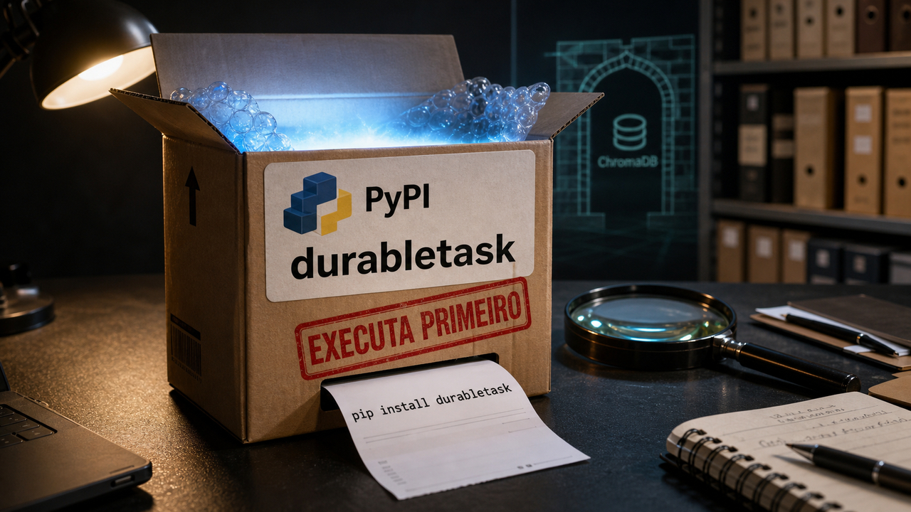

Às vezes a parte mais perigosa de um sistema fica fora da tela que todo mundo usa. Ela aparece naquele segundo silencioso em que alguma coisa executa por confiança: um pacote importado no começo do processo, uma automação com token guardado, um serviço carregando modelo, uma ferramenta de linha de comando que virou hábito e, de repente, tem prazo para trocar.

Ninguém acorda pensando nisso. A gente quer que o build passe, que o bot ajude, que a biblioteca instale, que a aplicação responda. O problema é que computador é um colega muito literal. Se você deu permissão, ele usa. Se o caminho estava aberto, ele passa. Se o pacote roda ao importar, ele não espera você terminar o café para perguntar se tudo bem.

O dia trouxe várias histórias nesse ponto meio desconfortável. Elas não parecem iguais na superfície. Uma envolve repositório interno e pacote publicado. Outra mexe com a rotina de quem programa usando assistente. Também apareceu relatório com números de violação, alerta em infraestrutura de IA, assinatura de software usada do jeito errado e duas notas de bastidor para backend e banco de dados.

Mas por baixo aparece a mesma pergunta: o que no seu ambiente consegue executar, publicar, assinar, chamar nuvem, mexer em cluster ou virar parte do fluxo sem alguém olhar de perto?

Agora sim entram os nomes. GitHub, PyPI, Google, ChromaDB, Verizon, Microsoft e alguns projetos menores apareceram hoje não como bingo de marca, mas como lembrete de que execução confiável virou uma fronteira bem movimentada. E fronteira movimentada, você sabe, precisa de cerca, câmera e uma pessoa que não aceite qualquer crachá bonito.

## Um pacote Python mostrou que supply chain agora atravessa token, nuvem e cluster

A história principal ainda está em desenvolvimento, então a primeira obrigação é separar fato público de propaganda de atacante. O The Hacker News publicou que o GitHub investigava acesso não autorizado a repositórios internos ligado a alegações do grupo TeamPCP. A reportagem também diz que, segundo posição atribuída ao GitHub, não havia evidência de impacto em informações de clientes fora desses repositórios internos naquele momento.

O número mais chamativo, cerca de 4.000 repositórios, veio da própria alegação do grupo. Isso merece caveat grande, daqueles que não cabem em rodapé minúsculo. Ator vendendo acesso também vende narrativa. Pode haver incidente real e, ao mesmo tempo, exagero comercial em cima dele. Segurança tem dessas coisas agradáveis.

O pedaço mais útil para quem desenvolve é a ligação com pacote publicado. Pesquisadores relataram versões maliciosas do `durabletask` no PyPI, incluindo `1.4.1`, `1.4.2` e `1.4.3`. A StepSecurity citou os uploads infectados de `1.4.1` e `1.4.2` em 19 de maio de 2026 e apontou `1.4.0` como a última versão limpa na análise dela. O pacote é associado ao ecossistema da Microsoft, e isso muda a reação de muita gente: quando o nome parece confiável, a mão vai mais rápido no `pip install`.

Esse é justamente o problema.

Segundo Snyk e StepSecurity, a família de payload ligada a essa campanha mirava ambientes Linux, roubava segredos de desenvolvedor e de nuvem, criava repositórios públicos no GitHub para despejar tokens roubados, tentava persistência falsa via `systemd` e tinha caminhos de propagação por AWS SSM e Kubernetes, inclusive por `kubectl exec`. A StepSecurity também documentou um ramo destrutivo com wiper condicionado por geografia. Não precisa entrar em detalhe de exploração para entender o tamanho da encrenca: importar um pacote pode virar roubo de segredo, uso de token, movimento em nuvem e alcance dentro de cluster.

A Grafana entrou como exemplo concreto do raio de impacto. Em atualização própria, a empresa confirmou acesso não autorizado a repositórios internos no GitHub, disse não ter evidência de impacto em dados de produção de clientes, informações pessoais, ambientes de clientes ou Grafana Cloud, e conectou o caso a um token vindo do incidente de supply chain do TanStack. O detalhe incômodo foi um token de workflow do GitHub que teria passado batido e ampliado o caminho. A Grafana diz que rotacionou ou revogou tokens expostos.

Para o time que mantém projeto, o trabalho defensivo é menos elegante do que a manchete: revisar se `durabletask` apareceu no ambiente, conferir versões, pinning e lockfiles, voltar para versão limpa quando for o caso, procurar execução em importação, rotacionar tokens que possam ter passado por máquina ou pipeline afetado, olhar permissões de AWS SSM e Kubernetes, e tratar incidente de pacote como incidente de credencial. O pacote é só a porta. O que ele consegue carregar no bolso é o inventário que costuma doer.

Fontes: [The Hacker News](https://thehackernews.com/2026/05/github-investigating-teampcp-claimed.html), [Grafana Labs](https://grafana.com/blog/grafana-labs-security-update-latest-on-tanstack-npm-supply-chain-ransomware-incident/?pg=blog), [Snyk](https://snyk.io/blog/durabletask-pypi-supply-chain-attack/) e [StepSecurity](https://www.stepsecurity.io/blog/microsofts-durabletask-pypi-package-compromised-in-supply-chain-attack).

## Google colocou uma data no fim do fluxo antigo

O anúncio do Google no I/O 2026 tem modelo novo no fundo, incluindo Gemini 3.5 Flash, mas a parte que chega primeiro para desenvolvedor é calendário.

O Google publicou que Gemini CLI e as extensões Code Assist para IDE deixam de funcionar em 18 de junho de 2026 para usuários individuais e assinantes Google AI Pro ou Ultra. Usuários empresariais que usam a própria chave da Gemini API ou um projeto do Google Cloud ficam fora desse corte, pelo texto oficial. Mesmo assim, se a sua rotina depende dessas ferramentas, a data já virou tarefa.

O caminho indicado é Antigravity CLI e a família Antigravity 2.0. O pacote anunciado está em prévia pública e inclui IDE desktop, CLI, API de plataforma e agentes gerenciados. O Google diz que a nova CLI é escrita em Go, até quatro vezes mais rápida, e traz hooks, skills, sub-agentes e extensões. Os agentes gerenciados rodam em ambiente Linux hospedado com Bash, Python e Node, e podem delegar até 100 agentes paralelos.

Parece poderoso. Também parece o tipo de poder que precisa de política antes de virar hábito.

Uma ferramenta local que você conhecia vira uma plataforma com execução hospedada, mais integração e mais peças ao redor. Isso muda onde ficam filesystem, segredos, rede, logs, histórico e aprovação. O Google também avisa que não haverá paridade um para um no lançamento, apesar de conceitos centrais de agente seguirem na migração. Em português de escritório: teste o seu fluxo real, não a demo bonita.

Quem usa Gemini CLI em script, automação pessoal, extensão de editor ou fluxo de revisão deve fazer inventário agora. Quais comandos dependem dela? Quais credenciais ela enxerga? O fluxo precisa continuar local ou pode ir para ambiente hospedado? O preço da API faz sentido para uso pesado? A página de preços existe, mas preço de API é aquela coisa: sempre confira perto da decisão, porque planilha velha tem talento para mentir sem querer.

A notícia fica interessante justamente porque conversa com o bloco anterior. Ler isso como "mais uma ferramenta de IA" deixaria metade do problema no chão. A migração muda a fronteira de execução para quem já colocou assistente no dia a dia. Migração de CLI, quando a CLI mexe em código, comando e contexto, merece mais respeito do que trocar tema do terminal.

Fontes: [Google Blog sobre novidades para desenvolvedores no I/O 2026](https://blog.google/innovation-and-ai/technology/developers-tools/google-io-2026-developer-highlights/), [Google Developers Blog sobre a transição do Gemini CLI](https://developers.googleblog.com/en/an-important-update-transitioning-gemini-cli-to-antigravity-cli/) e [preços da Gemini API](https://ai.google.dev/gemini-api/docs/pricing).

## O DBIR colocou número no incômodo

Incidente do dia sempre chama atenção, mas relatório anual ajuda a não enxergar tudo como caso isolado. O DBIR 2026 da Verizon diz que exploração de vulnerabilidades levou a 31% das violações analisadas, enquanto abuso de credenciais ficou em 13%. A Verizon também afirma que ransomware apareceu em quase metade das violações e que exploração de vulnerabilidade superou abuso de credencial pelo terceiro ano seguido.

Isso não aposenta senha, MFA, chave curta, SSO ou higiene de identidade. Seria uma leitura preguiçosa. Credencial continua sendo dor real. O que os números fazem é puxar patching, inventário de exposição e remoção de serviço velho para a mesma mesa de prioridade.

A análise da Tenable acrescenta cor operacional: aumento de 34% em exploração de vulnerabilidades, janelas de exploração caindo de meses para horas, mediana de 43 dias para remediação e apenas 26% de remediação para itens da lista CISA KEV no conjunto analisado. Percentual desse tipo depende do recorte do relatório, claro, mas a direção é difícil de ignorar: atacante não espera a sua sprint acabar para explorar borda exposta.

Essa é a ponte com as outras histórias. TeamPCP e `durabletask` mostram confiança de pacote e token. ChromaDB, que aparece daqui a pouco, mostra uma peça de infraestrutura de IA com caminho crítico antes da autenticação. Fox Tempest mostra assinatura de código sendo vendida como serviço para malware. O DBIR não valida cada caso específico de hoje, e nem deveria. Ele dá o fundo: exploração e abuso de caminhos confiáveis estão no centro da conversa.

Para quem precisa transformar isso em trabalho: saiba o que está exposto na internet, priorize falhas críticas e conhecidas exploradas, reduza serviço esquecido, meça tempo de correção e trate terceiros como parte do seu mapa. "Temos scanner" é começo. "Sabemos o que expõe cliente, quanto tempo fica aberto e quem decide o prazo" já é uma conversa mais adulta.

Fontes: [Verizon DBIR 2026](https://www.verizon.com/about/news/breach-industry-wide-dbir-finds) e [Tenable sobre os principais achados do DBIR 2026](https://www.tenable.com/blog/key-findings-from-the-verizon-dbir-2026).

## Destaques rápidos para hoje.

- ChromaDB recebeu o alerta CVE-2026-45829, descrito pela HiddenLayer e pela NVD como execução remota de código antes de autenticação na versão 1.1.2, pelo frontend Python. A explicação curta é feia o bastante: o servidor podia carregar código de modelo antes de provar quem estava chamando. A recomendação defensiva é manter ChromaDB fora da internet, isolar rede, verificar se o frontend Python está em uso, considerar o frontend Rust quando fizer sentido e acompanhar atualização do fornecedor, porque a HiddenLayer dizia que o problema estava sem correção no momento da divulgação. Fontes: [HiddenLayer](https://www.hiddenlayer.com/research/chromatoast-served-pre-auth), [NVD](https://nvd.nist.gov/vuln/detail/CVE-2026-45829) e [BleepingComputer](https://www.bleepingcomputer.com/news/security/max-severity-flaw-in-chromadb-for-ai-apps-allows-server-hijacking/).

- A Microsoft disse ter interrompido a operação Fox Tempest, ligada ao serviço `signspace.cloud`, que abusava do Microsoft Artifact Signing para gerar certificados fraudulentos e de vida curta usados por operadores de malware e ransomware, incluindo atividade associada ao Rhysida. A empresa afirma ter revogado mais de 1.000 certificados. Assinado ajuda, mas assinatura sozinha não faz milagre: reputação, comportamento, revogação e política de endpoint continuam no jogo. Fonte: [Microsoft Security Blog](https://www.microsoft.com/en-us/security/blog/2026/05/19/exposing-fox-tempest-a-malware-signing-service-operation/).

- O Tonic vai entrar no projeto oficial gRPC como `grpc/grpc-rust`. O anúncio de Lucio Franco fala em transição de `hyperium/tonic`, prévia de um novo crate `grpc`, trabalho de xDS e manutenção com gente de Google, LinkedIn, Datadog e do próprio projeto, sob guarda-chuva CNCF/Linux Foundation. Para quem usa Rust no backend, é sinal de maturidade e governança, não ordem para reescrever serviço hoje à tarde. Fonte: [Lucio Franco](https://luciofranco.com/blog/tonic-joins-grpc/).

- O PostgreSQL News publicou o Barman 3.18.0 com suporte a backups incrementais em armazenamento de objetos na nuvem, além de classes específicas por provedor, correções de bugs e um ajuste de segurança em caminho de arquivo. O corpo da página tinha uma data interna anterior, então eu trataria o item como notícia publicada hoje pelo PostgreSQL News, não como "acabou de nascer neste minuto". Para operador de Postgres, backup incremental em nuvem pode mexer em custo e tempo de upload, mas teste restore em staging antes de comemorar no grupo. Fonte: [PostgreSQL News](https://www.postgresql.org/about/news/barman-3180-released-3303/).

## Acompanhamento de tendências do dia.

O pedaço de agentes ficou dividido entre produto grande e ferramenta pequena. De um lado, o Google empurra Antigravity como superfície oficial de trabalho. Do outro, o Forge apareceu como projeto MIT para aumentar confiabilidade de chamada de ferramentas em modelos locais, com retry nudges, step enforcement, rescue parsing, recuperação de erro, escolha de backend de serving e gestão de contexto consciente de VRAM.

A manchete tentadora seria dizer que um modelo local pequeno pulou de 53% para 99,3% e pronto, resolvemos agentes. Melhor respirar. Esse número veio de material do autor e de benchmark específico do período do paper. O README atual também fala de uma suíte mais difícil, com melhor configuração self-hosted em 86,5%. Ainda é interessante, só não vira lei universal. O ponto bom é outro: agente falha muito por arnês frágil, contexto ruim, erro de ferramenta mal tratado e backend mal escolhido. Modelo maior ajuda em alguns casos. Encanação decente também.

O outro sinal vem do Google Threat Intelligence Group, com um cuidado de data: a fonte de recorde é um relatório de 11 de maio de 2026, recolocado em discussão no dia 20. O GTIG descreveu atividade com malware desenvolvido por IA ou com ajuda de IA, um caso de vulnerabilidade zero-day assistida por IA em uma ferramenta web open-source de administração, e disse que a Mandiant interrompeu esse caso antes da implantação. O detalhe técnico mais útil é que o exemplo envolve lógica de confiança e autenticação, não aquela caricatura de falha clássica de memória.

Também aparece o PROMPTSPY, citado pelo GTIG como malware Android usando APIs de LLM para comportamento autônomo de interface. Isso não prova fábrica mágica de zero-day no botão azul. Prova algo mais chato de defender: atacante também automatiza leitura de contexto, tentativa, navegação e erro. Para quem cuida de produto, vale revisar invariantes de autenticação, pensar em componente agente como superfície de ameaça e tratar infraestrutura de IA como infraestrutura mesmo. Com porta, log, permissão e vergonha na cara.

Fontes: [Forge no GitHub](https://github.com/antoinezambelli/forge), [discussão no Hacker News](https://news.ycombinator.com/item?id=48192383), [Google Threat Intelligence](https://cloud.google.com/blog/topics/threat-intelligence/ai-vulnerability-exploitation-initial-access) e [discussão no Reddit](https://www.reddit.com/r/linux/comments/1ti6tb8/google_gtig_just_documented_the_first_confirmed/).

> Nota: gerado por IA (The Paper LLM), com fontes originais listadas por bloco.

<!--
briefing_slug: 2026-05-20
generated_at: 2026-05-20T10:00:00-03:00
source_urls:
  - https://thehackernews.com/2026/05/github-investigating-teampcp-claimed.html
  - https://grafana.com/blog/grafana-labs-security-update-latest-on-tanstack-npm-supply-chain-ransomware-incident/?pg=blog
  - https://snyk.io/blog/durabletask-pypi-supply-chain-attack/
  - https://www.stepsecurity.io/blog/microsofts-durabletask-pypi-package-compromised-in-supply-chain-attack
  - https://blog.google/innovation-and-ai/technology/developers-tools/google-io-2026-developer-highlights/
  - https://developers.googleblog.com/en/an-important-update-transitioning-gemini-cli-to-antigravity-cli/
  - https://ai.google.dev/gemini-api/docs/pricing
  - https://www.verizon.com/about/news/breach-industry-wide-dbir-finds
  - https://www.tenable.com/blog/key-findings-from-the-verizon-dbir-2026
  - https://www.hiddenlayer.com/research/chromatoast-served-pre-auth
  - https://nvd.nist.gov/vuln/detail/CVE-2026-45829
  - https://www.bleepingcomputer.com/news/security/max-severity-flaw-in-chromadb-for-ai-apps-allows-server-hijacking/
  - https://www.microsoft.com/en-us/security/blog/2026/05/19/exposing-fox-tempest-a-malware-signing-service-operation/
  - https://luciofranco.com/blog/tonic-joins-grpc/
  - https://www.postgresql.org/about/news/barman-3180-released-3303/
  - https://github.com/antoinezambelli/forge
  - https://news.ycombinator.com/item?id=48192383
  - https://cloud.google.com/blog/topics/threat-intelligence/ai-vulnerability-exploitation-initial-access
  - https://www.reddit.com/r/linux/comments/1ti6tb8/google_gtig_just_documented_the_first_confirmed/
omitted_briefing_items:
  - Runtime architecture patterns paper: research-heavy and less actionable than verified platform/security stories.
  - Library Drift paper: redundant beside Forge and today's supply-chain lead.
  - Formal Skill / FairyClaw: interesting research without enough daily public relevance.
  - Does Code Cleanliness Affect Coding Agents?: evergreen note crowded out by Forge.
  - Evals Will Break: used only as background for benchmark caution, not a public item.
  - OpenComputer benchmark: lower practical impact than Google Antigravity migration.
  - When Skills Don't Help: context only, not standalone.
  - Measuring Safety Alignment Effects: lower fit for this edition.
  - Sequential Entropy adversarial prompts: GTIG covered the AI-offense trend with stronger source authority.
  - Hardware-aware code optimization: not enough public relevance today.
  - Agentic Tuning / Postgres: crowded out by Barman for practical Postgres value.
  - Vim GTK4 support co-authored by Claude: novelty-driven and lower source priority.
  - Everything in C is undefined behavior: good essay, too sideways for today's arc.
  - Raymond Chen inert APIs: older 2024 item and not fresh.
  - Railway blocked by Google Cloud: status-page context, not enough to outrank verified quick hits.
  - mkPIVM: Reddit-led and niche.
  - plpgsql_wrap v1.0: niche; Barman was the stronger Postgres quick hit.
  - Redis/Valkey slots migration: useful but lower audience pull than Tonic/Barman.
  - MiniMax M2.7 workflows: product/model item with less local developer consequence than Google migration.
  - Portuguese Claude Code token-limit Electron proxy: interesting, but not enough validation/public relevance.
  - YellowKey Windows BitLocker CVE-2026-45585: omitted without primary Microsoft validation in this stage.
  - CISA public GitHub secrets: already covered in the 2026-05-19 Paper LLM post.
  - AI coding assistant installed malware AMA: Reddit/AMA-led and weaker than verified package and ChromaDB stories.
-->
